# E0b judgement ab-01

You are an independent judge for a pre-registered experiment. Below are (1) a TOPIC: a Markdown file of Mermaid diagrams that document code, with `path:line` citations, where paths under `../project/` are in the VisionClaw repository and paths under `../project/agentbox/` are in the agentbox repository; and (2) a DIFF: one commit's changes in the agentbox repository, restricted to the files the topic lists under `sources:`.

Answer exactly one question:

> **Does this change make any statement in the topic false or incomplete?**

Judge only from the two texts below; do not look anything else up. Reply with a single JSON object and nothing else:

```json
{"verdict": "yes" | "no", "statements": ["<diagram id>: <the statement, quoted>", ...], "line_anchors_only": true | false, "reason": "<one or two sentences>"}
```

`statements` lists every topic statement the change makes false or incomplete (empty when the verdict is no). `line_anchors_only` is true when the only such statements are `path:line` anchors whose cited code merely moved.

## TOPIC (docs/diagrams/agentbox/13-nostr-relay-gateway-bridge-mirror.md)

````markdown
---
id: AB-13
title: Nostr — relay, gateway, pod bridge, session mirror
area: agentbox
governing:
  - ../project/agentbox/docs/INGRESS-identity.md
  - ../project/agentbox/docs/SECURITY-profiles.md
  - ../project/agentbox/docs/PROTOCOL-registry.md
adrs: [ADR-2012, ADR-2025, ADR-2026, ADR-2061, ADR-2085, ADR-2105]
sources:
  - ../project/agentbox/agentbox.toml
  - ../project/agentbox/flake.nix
  - ../project/agentbox/config/nostr-gateway/gateway.cjs
  - ../project/agentbox/config/hooks/nostr-live-mirror.cjs
  - ../project/agentbox/config/hooks/lib/egress-policy.cjs
  - ../project/agentbox/services/nostr-pod-bridge/src/main.rs
  - ../project/agentbox/services/nostr-pod-bridge/src/bootstrap.rs
  - ../project/agentbox/services/nostr-pod-bridge/src/lib.rs
  - ../project/agentbox/services/nostr-pod-bridge/src/admission.rs
  - ../project/agentbox/services/nostr-pod-bridge/src/session_summary.rs
  - ../project/agentbox/services/nostr-pod-bridge/src/egress_policy.rs
  - ../project/agentbox/services/nostr-pod-bridge/src/colloquy_publish.rs
  - ../project/agentbox/tests/fixtures/egress-redaction.v1.json
  - ../project/agentbox/mcp/servers/nostr-bridge.js
  - ../project/agentbox/mcp/nostr-bridge/relay-consumer.js
  - ../project/agentbox/mcp/nostr-bridge/default-intent-spec.js
  - ../project/agentbox/management-api/server.js
  - ../project/agentbox/management-api/lib/bc20-provenance-bridge.js
  - ../project/agentbox/schema/federation-kinds.json
  - ../project/agentbox/docs/user/nostr-control-gateway.md
  - ../project/agentbox/docs/adr/ADR-2012-relay-allowlist-only-ingress.md
  - ../project/agentbox/docs/adr/ADR-2025-cross-repo-federation-contract.md
  - ../project/agentbox/docs/adr/ADR-2026-session-mirror-egress-boundary.md
  - ../project/agentbox/management-api/lib/governance-decision-waiter.js
  - ../project/agentbox/management-api/lib/llm-marketplace.js
  - ../project/agentbox/agentbox.sh
  - ../project/agentbox/management-api/lib/agent-control-surface.js
verified_commit: c4ed3ec6505858e1e5ead651c29115d2f74e5546
---

## AB-13.1 Nostr topology — relay, gateway, pod bridge, mirror, mesh

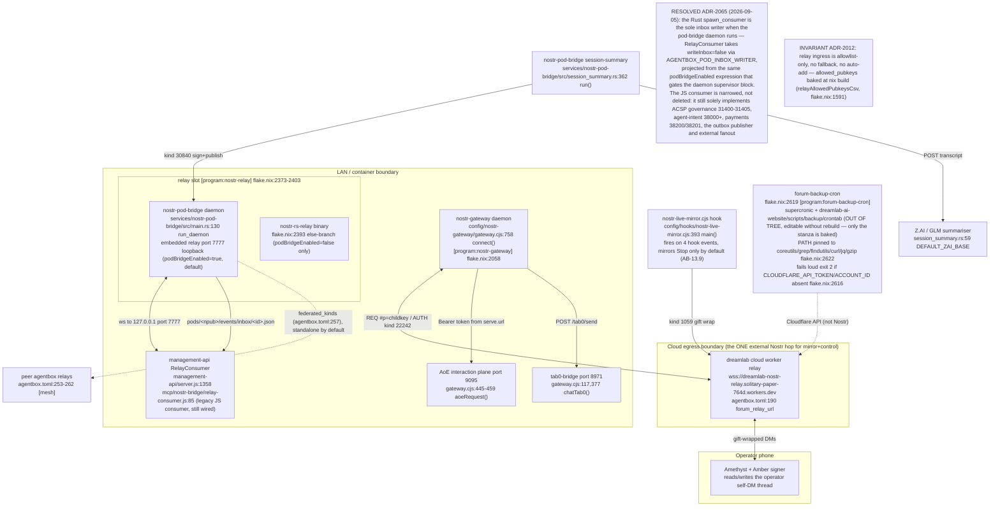

## AB-13.2 Relay ingress admission — allowlist gate before store/broadcast/OK

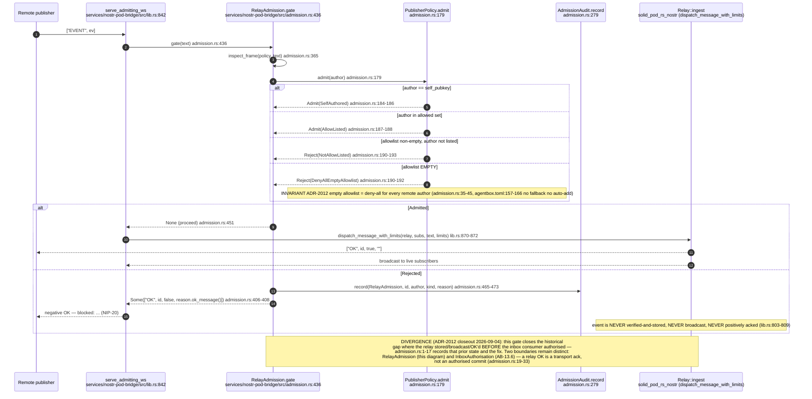

## AB-13.3 Allowlist projection at nix build — relay implementation selection

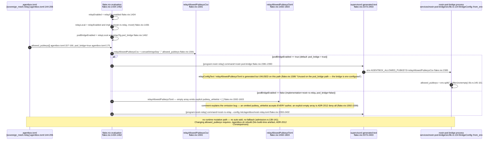

## AB-13.4 Event-kind map part 1 — transport, auth and reference kinds

```mermaid
classDiagram
    class Kind1059_GiftWrap {
        kind = 1059
        producer nostr-live-mirror.cjs:465 nip59.wrapEvent
        producer gateway.cjs:290 buildWrap
        consumer lib.rs:267 effective_message unwrap_gift
        consumer gateway.cjs:716 handleWrap
        signer mirror child key HMAC derived, nostr-live-mirror.cjs:211
    }
    class Kind14_DmRumor {
        kind = 14 NIP-17 rumor inside the gift wrap
        producer nostr-live-mirror.cjs:398 rumor
        producer gateway.cjs:291 rumor
        consumer nostr-pod-bridge unwrap_gift lib.rs:269
        signer sealed sender see AB-13.9
    }
    class Kind22242_NIP42Auth {
        kind = 22242 KIND_AUTH relay session AUTH
        producer gateway.cjs:681 authenticate finalizeEvent
        consumer cloud relay and embedded relay AUTH check
        signer operator or derived child key gateway.cjs:186-188
    }
    class Kind27235_NIP98 {
        kind = 27235 nostr-bridge.js:55 kinds.AUTH
        producer nostr-bridge.js verifyNip98 callers see AB-10.4
        consumer management-api HTTP auth middleware see AB-10.4
        note see AB-10.4 for full verification path
    }
    class Kind30078_AgentState {
        kind = 30078 nostr-bridge.js:57 AGENT_STATE
        producer see AB-17.x agent-event publishing
        consumer nostr-bridge.js:290 default subscribeKinds
    }
    class Kind30000_30001_Refs {
        kind = 30000 BRIEF_REF nostr-bridge.js:58
        kind = 30001 BEAD_REF nostr-bridge.js:59
        federated agentbox.toml:257 federated_kinds
    }
    class Kind30910_Invite {
        kind = 30910 NIP-58 invite agentbox.toml multi_user invite_kind
        federated agentbox.toml:257
    }
    Kind1059_GiftWrap --> Kind14_DmRumor : unwraps to
    note for Kind27235_NIP98 "identity minting and the DID behind every signer on this page is AB-11.2. Full NIP-98 verification is AB-10.4."
```

## AB-13.15 Event-kind map part 2 — session record and ACSP governance kinds

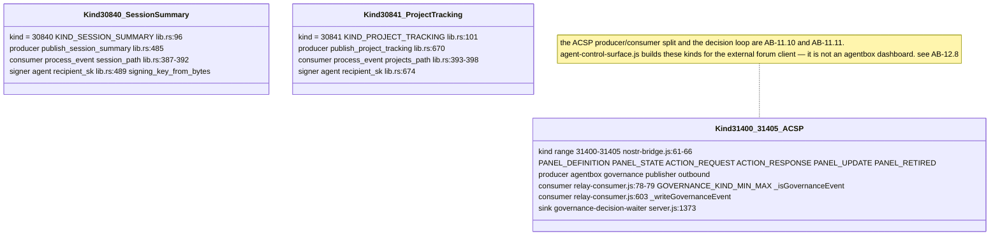

## AB-13.16 Event-kind map part 3 — federation, job and marketplace kinds

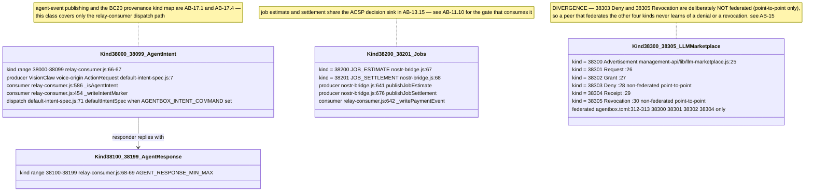

## AB-13.5 nostr-gateway command flow — relay subscribe to reply

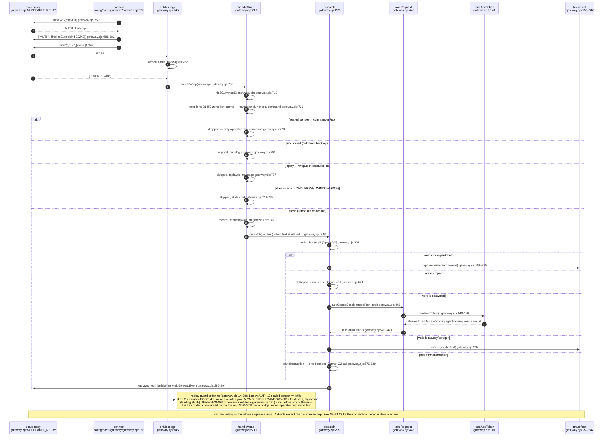

## AB-13.6 nostr-pod-bridge inbox write — authorise, unwrap, persist

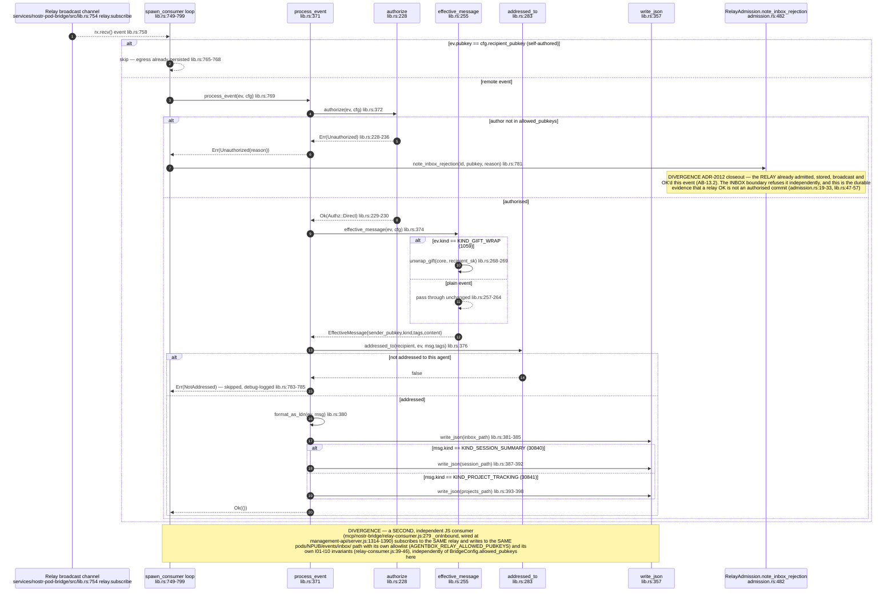

## AB-13.7 nostr-bridge / relay-consumer — in-process library, not an MCP tool server

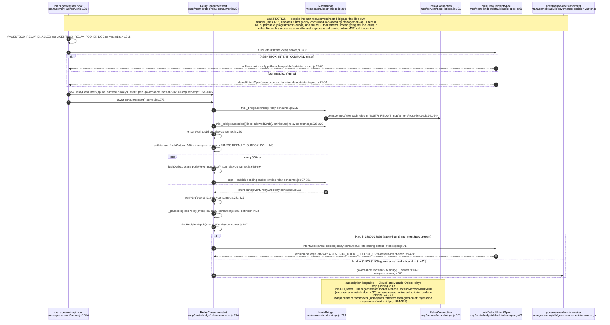

## AB-13.8 Control gateway — operator command to handler mapping

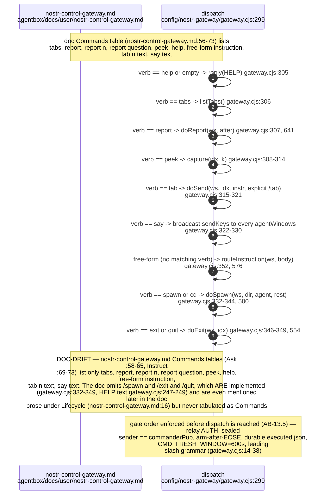

## AB-13.9 Session-mirror egress — per-turn NIP-59 gift wrap to the cloud relay (owns this flow)

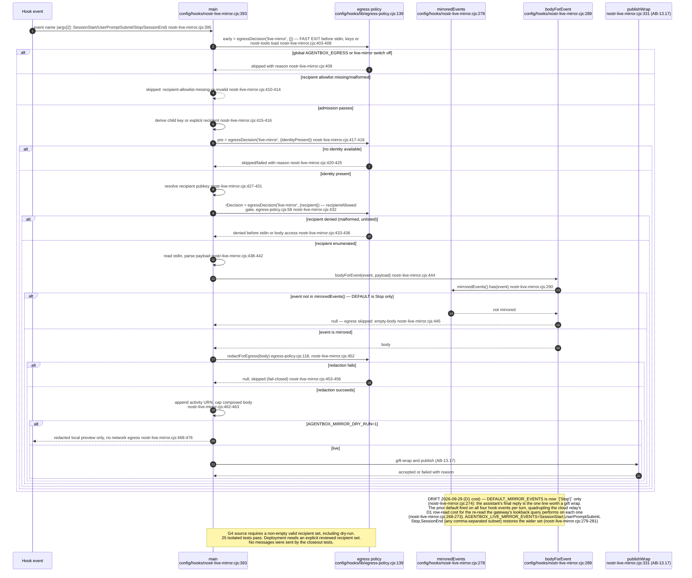

## AB-13.17 Session-mirror egress phase 2 — publish, deadline and fail-open

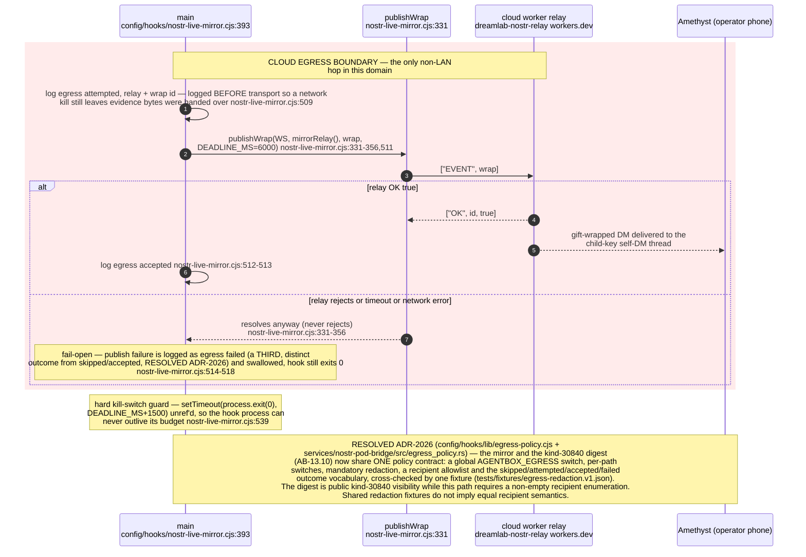

## AB-13.10 kind-30840 session-summary digest — Z.AI distil, sign, dual-write

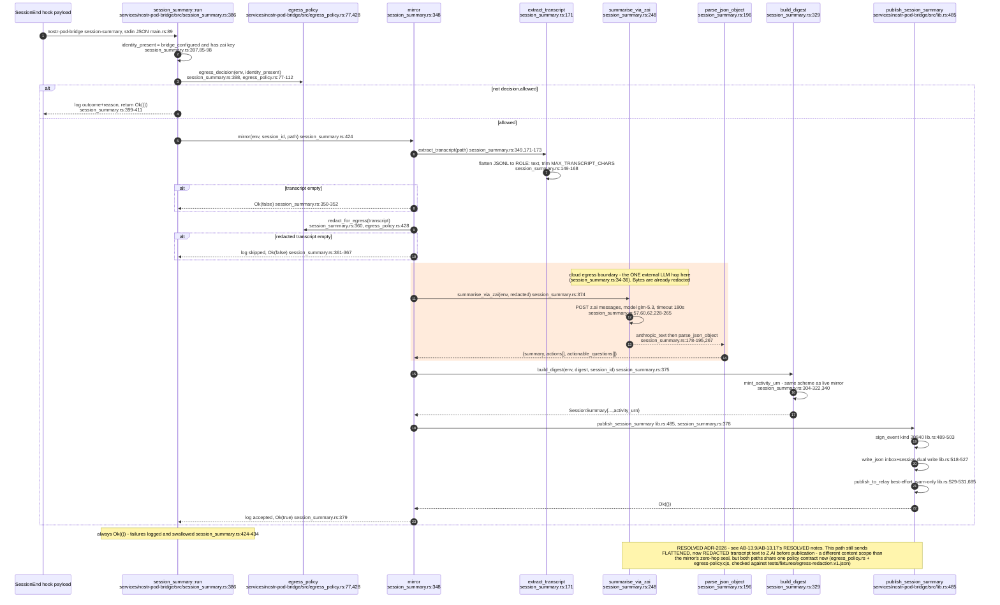

## AB-13.12 Federation — agentbox mesh peers vs the agentbox to VisionClaw URN bridge

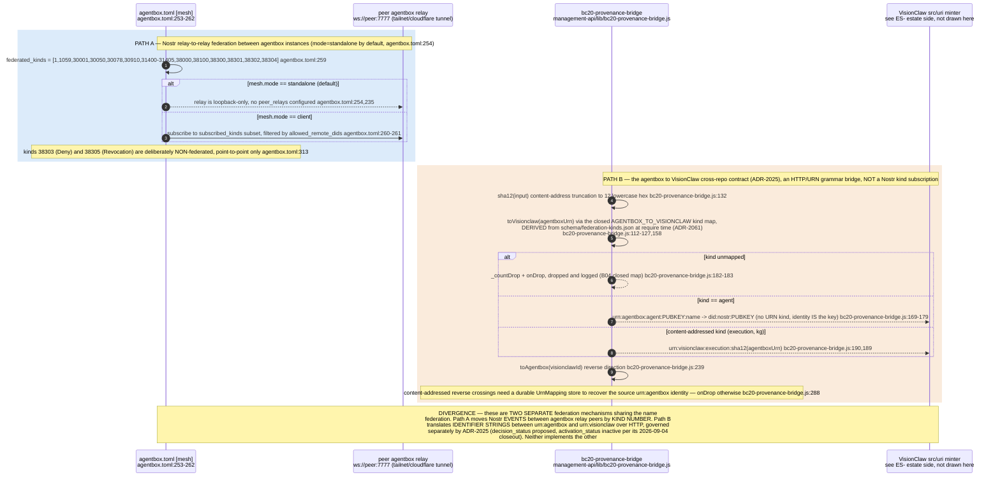

## AB-13.13 nostr-gateway relay connection — subscribe, live, reconnect lifecycle

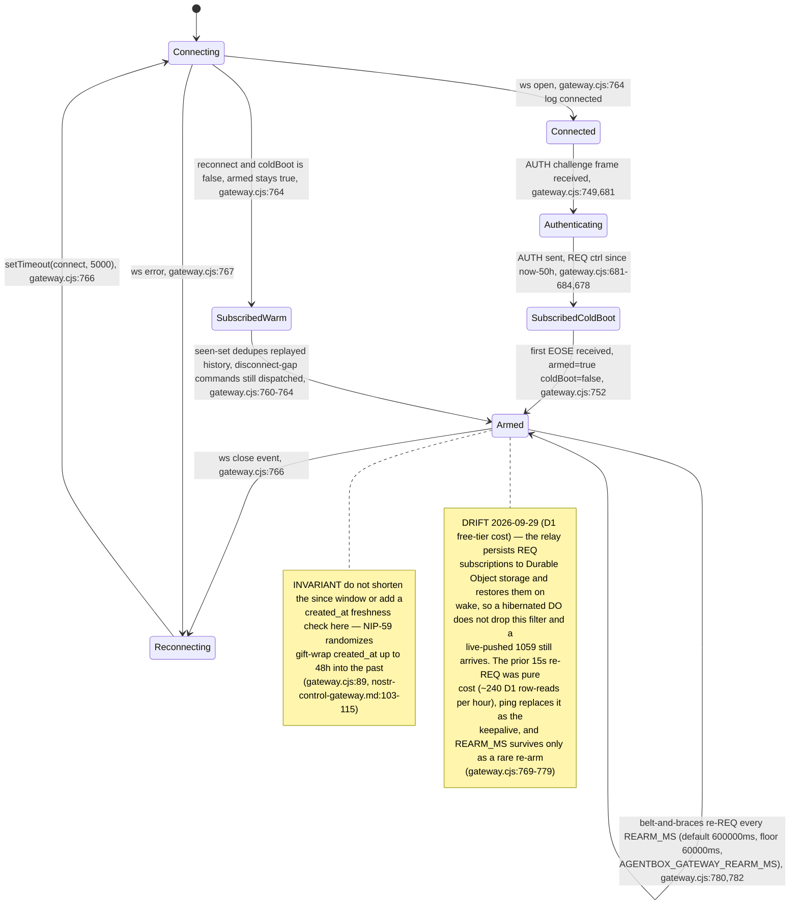

## AB-13.14 nostr-pod-bridge main — the four entry points of one binary

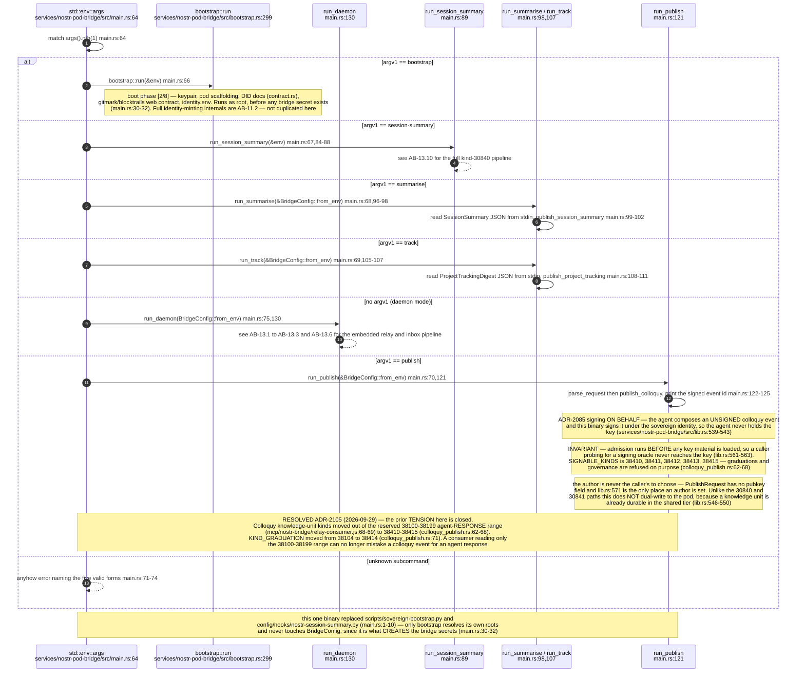


**Drift (kind map vs the sidestr chain plane):** the three event-kind maps above (AB-13.4, AB-13.15, AB-13.16) predate the settlement kinds and record none of them — the external sidestr set (23500, 23501, 23510-23514, 33333, 33500-33502) and the estate's own 38420-38425, into which ADR-2105 moved the account binding from 38110. The tip announcement, the mirror trust rule and the relays-as-registry arrangement are catalogued in AB-34.2 and AB-34.4 instead, and none of it passes through the relay, gateway or pod bridge drawn here.
````

## DIFF

```diff
diff --git a/services/nostr-pod-bridge/src/lib.rs b/services/nostr-pod-bridge/src/lib.rs
index 08cdfb862..cabb5fe1d 100644
--- a/services/nostr-pod-bridge/src/lib.rs
+++ b/services/nostr-pod-bridge/src/lib.rs
@@ -1053,7 +1053,7 @@ mod tests {
     async fn listed_author_is_admitted_stored_broadcast_and_acked() {
         let dir = tempfile::tempdir().unwrap();
         let (frame, pubkey, id) = signed_event_frame(0x31, 1, vec![]);
-        let admission = admission_for(&[pubkey.clone()], &"a".repeat(64), dir.path());
+        let admission = admission_for(std::slice::from_ref(&pubkey), &"a".repeat(64), dir.path());
         let relay = Relay::in_memory();
         let mut rx = relay.subscribe();
         let mut subs = HashMap::new();
@@ -1249,7 +1249,7 @@ mod tests {
         // the inbox config does not — the inbox must still refuse.
         let dir = tempfile::tempdir().unwrap();
         let author = "c".repeat(64);
-        let relay_policy = admission_for(&[author.clone()], &"a".repeat(64), dir.path());
+        let relay_policy = admission_for(std::slice::from_ref(&author), &"a".repeat(64), dir.path());
         assert!(relay_policy.policy.admit(&author).is_admitted());
 
         let inbox_cfg = BridgeConfig {
```
