# E0b judgement vc-03

You are an independent judge for a pre-registered experiment. Below are (1) a TOPIC: a Markdown file of Mermaid diagrams that document code, with `path:line` citations, where paths under `../project/` are in the VisionClaw repository and paths under `../project/agentbox/` are in the agentbox repository; and (2) a DIFF: one commit's changes in the visionclaw repository, restricted to the files the topic lists under `sources:`.

Answer exactly one question:

> **Does this change make any statement in the topic false or incomplete?**

Judge only from the two texts below; do not look anything else up. Reply with a single JSON object and nothing else:

```json
{"verdict": "yes" | "no", "statements": ["<diagram id>: <the statement, quoted>", ...], "line_anchors_only": true | false, "reason": "<one or two sentences>"}
```

`statements` lists every topic statement the change makes false or incomplete (empty when the verdict is no). `line_anchors_only` is true when the only such statements are `path:line` anchors whose cited code merely moved.

## TOPIC (docs/diagrams/visionclaw/01-boot-and-app-state.md)

````markdown
---
id: VC-01
title: Server boot, AppState construction and the full route table
area: visionclaw
governing:
  - ../project/docs/BASELINE-architecture.md
adrs: [ADR-2004, ADR-2005, ADR-2007, ADR-2008, ADR-2026, ADR-2037, ADR-2038, ADR-2045, ADR-2053]
sources:
  - ../project/src/main.rs
  - ../project/src/app_state.rs
  - ../project/src/handlers/mod.rs
  - ../project/src/handlers/consolidated_health_handler.rs
  - ../project/src/handlers/api_handler/mod.rs
  - ../project/src/handlers/api_handler/graph/mod.rs
  - ../project/src/handlers/api_handler/files/mod.rs
  - ../project/src/handlers/api_handler/bots/mod.rs
  - ../project/src/handlers/api_handler/analytics/mod.rs
  - ../project/src/handlers/api_handler/ontology/mod.rs
  - ../project/src/handlers/api_handler/ontology_physics/mod.rs
  - ../project/src/handlers/api_handler/semantic_forces.rs
  - ../project/src/handlers/graph_state_handler.rs
  - ../project/src/handlers/graph_export_handler.rs
  - ../project/src/handlers/layout_handler.rs
  - ../project/src/handlers/physics_handler.rs
  - ../project/src/handlers/schema_handler.rs
  - ../project/src/handlers/semantic_handler.rs
  - ../project/src/handlers/natural_language_query_handler.rs
  - ../project/src/handlers/semantic_pathfinding_handler.rs
  - ../project/src/handlers/constraints_handler.rs
  - ../project/src/handlers/validation_handler.rs
  - ../project/src/handlers/workspace_handler.rs
  - ../project/src/handlers/pages_handler.rs
  - ../project/src/handlers/kpi_handler.rs
  - ../project/src/handlers/trace_handler.rs
  - ../project/src/handlers/insight_loop_handler.rs
  - ../project/src/handlers/liveness_harness_handler.rs
  - ../project/src/handlers/ingest_writeback_handler.rs
  - ../project/src/handlers/metrics_handler.rs
  - ../project/src/handlers/multi_mcp_websocket_handler.rs
  - ../project/src/handlers/bots_visualization_handler.rs
  - ../project/src/handlers/ontology_derived_handler.rs
  - ../project/src/handlers/ontology_class_count_handler.rs
  - ../project/src/handlers/ontology_agent_handler.rs
  - ../project/src/handlers/admin_rbac_handler.rs
  - ../project/src/handlers/admin_sync_handler.rs
  - ../project/src/handlers/nostr_handler.rs
  - ../project/src/handlers/broker_inbox_handler.rs
  - ../project/src/handlers/decision_handler.rs
  - ../project/src/handlers/enrichment_proposals_handler.rs
  - ../project/src/handlers/briefing_handler.rs
  - ../project/src/handlers/memory_flash_handler.rs
  - ../project/src/handlers/image_gen_handler.rs
  - ../project/src/handlers/solid_proxy_handler.rs
  - ../project/src/handlers/ragflow_handler.rs
  - ../project/src/settings/api/settings_routes.rs
  - ../project/src/services/liveness_harness.rs
  - ../project/src/services/canary_nostr_tap.rs
  - ../project/src/config/security_profile.rs
  - ../project/src/services/github/config.rs
  - ../project/src/services/github_sync_service.rs
  - ../project/src/services/corpus_source/mod.rs
  - ../project/src/services/corpus_source/local.rs
  - ../project/src/services/corpus_source/github.rs
  - ../project/src/services/kpi_compute.rs
  - ../project/src/services/role_store.rs
  - ../project/src/utils/auth.rs
  - ../project/tests/resd_class_count_route.rs
  - ../project/src/services/ontology_pull.rs
  - ../project/Cargo.toml
  - ../project/src/adapters/mod.rs
verified_commit: dd420fbc722a7a4a50e968162ac6c3eaff6972b2
---

## VC-01.1 main() phase 1 — hygiene, logging, settings, stores
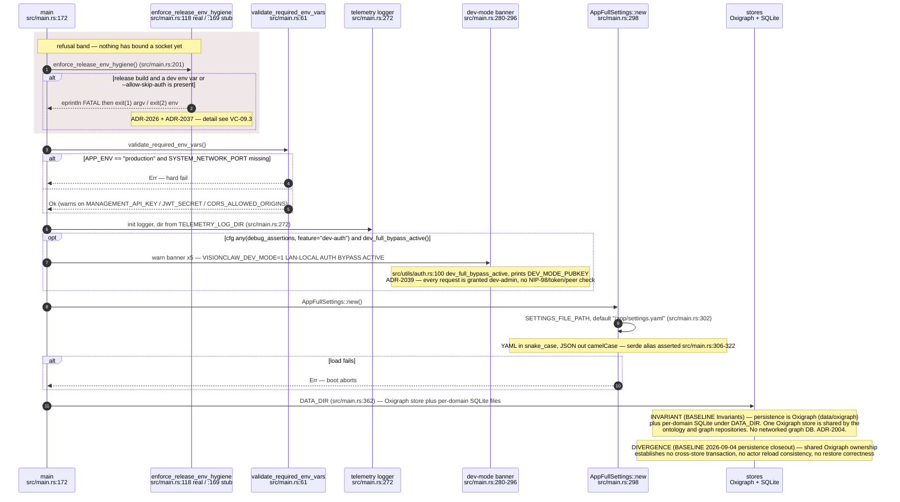

## VC-01.2 main() phase 2 — service graph, CorpusSource selection and RBAC owner bootstrap
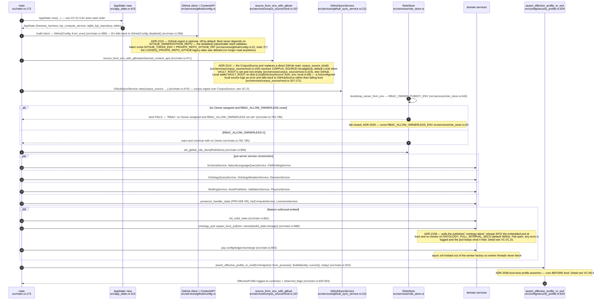

## VC-01.3 HttpServer worker factory and middleware stack order
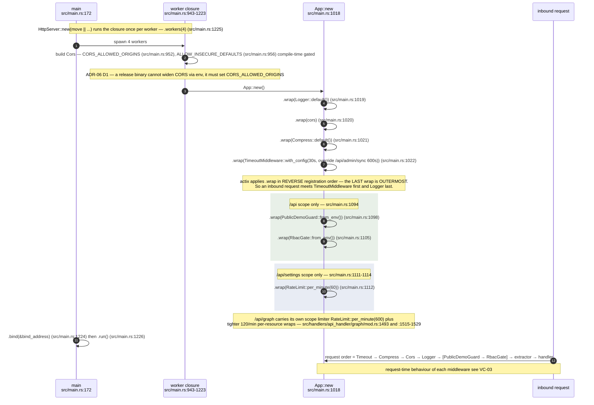

## VC-01.4 app_data registry — what each worker gets injected
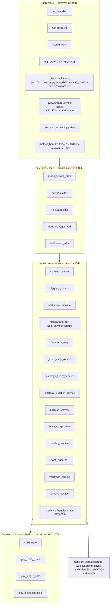

## VC-01.5 AppState::new — actor start order and the coordinator re-bind
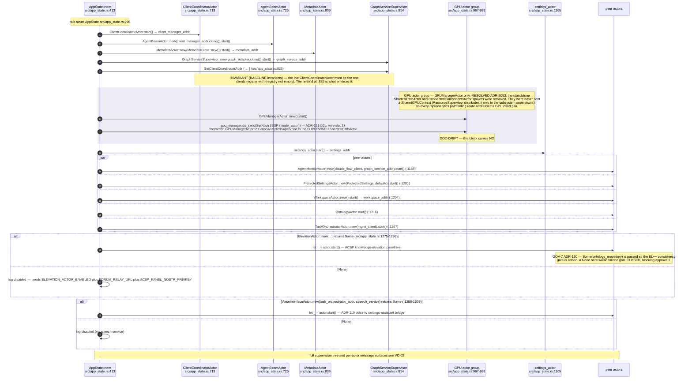

## VC-01.7 Health and readiness composition
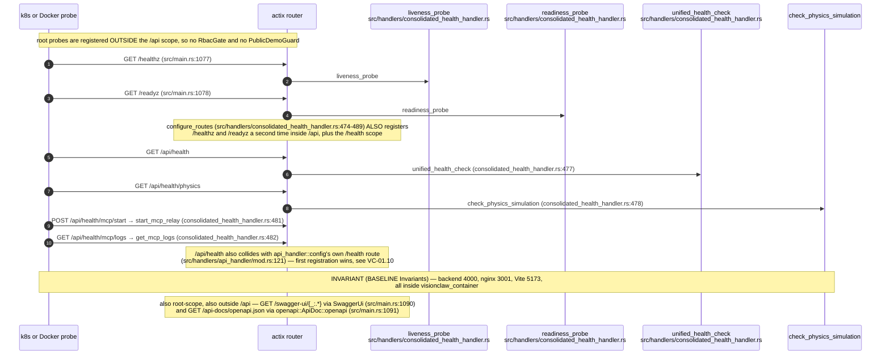

## VC-01.8 Post-bind background tasks and graceful shutdown
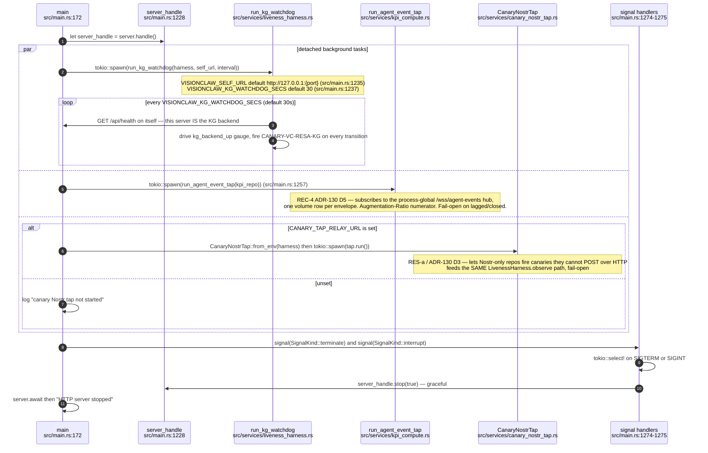

## VC-01.10 Route table 2 — /api scope registration ORDER
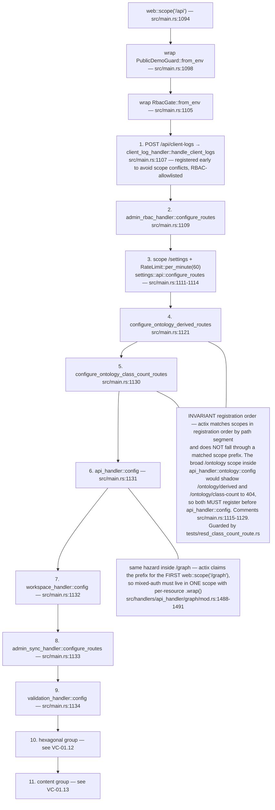

## VC-01.11 Route table 3 — api_handler::config fan-out
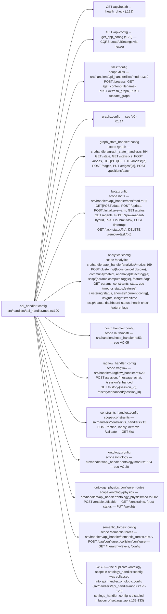

## VC-01.12 Route table 4 — hexagonal, health and MCP groups
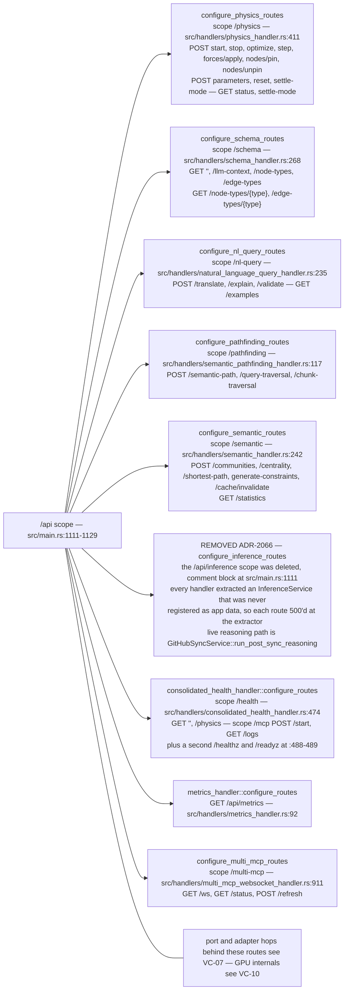

## VC-01.13 Route table 5 — content, governance and observability groups
```mermaid
flowchart LR
    S["/api scope — src/main.rs:1094-1212"]
    S --> PG["scope /pages + pages_handler::config<br/>src/main.rs:1160, src/handlers/pages_handler.rs:148 — GET ''"]
    S --> BO["scope /bots + api_handler::bots::config<br/>src/main.rs:1161"]
    S --> BV["bots_visualization_handler::configure_routes<br/>scope /visualization — src/handlers/bots_visualization_handler.rs:515<br/>GET /agents/ws, GET snapshot, POST initialize<br/>plus POST /bots/mock-agents at :530"]
    S --> GE["configure_graph_export_routes<br/>scope /graph-export — src/handlers/graph_export_handler.rs:319<br/>POST '', /share, /publish — GET /shared/{id}, /stats — DELETE /shared/{id}"]
    S --> OA["configure_ontology_agent_routes<br/>scope /ontology-agent — src/handlers/ontology_agent_handler.rs:366<br/>POST /discover, /read, /query, /traverse, /validate — GET /status<br/>POST /propose — RETIRED (ADR-2116): always 410 Gone, no auth or rate-limit,<br/>names vault propose as the replacement"]
    S --> DE["configure_decision_routes<br/>scope /decisions — src/handlers/decision_handler.rs:323<br/>GET /{urn}/trace — nested scope /record POST '' — PRD-022 W-B / ADR-048"]
    S --> SO["configure_solid_routes<br/>src/handlers/solid_proxy_handler.rs:1752<br/>re-exported at src/handlers/mod.rs:121 — see VC-05"]
    S --> IG["configure_image_gen_routes<br/>scope /image-gen — src/handlers/image_gen_handler.rs:935<br/>GET /health, /status/{job_id} — POST /submit, /agent-submit<br/>graph chosen by IMAGE_GEN_MODEL :114 — MiniMax H3 default, FLUX 2 opt-in"]
    S --> BR["configure_briefing_routes<br/>scope /briefs — src/handlers/briefing_handler.rs:118<br/>POST '' submit_brief, POST /{brief_id}/debrief"]
    S --> MF["configure_memory_flash_routes<br/>POST /api/memory-flash and the batch route<br/>src/handlers/memory_flash_handler.rs:134-137"]
    S --> EP["configure_enrichment_proposals_routes<br/>POST /api/enrichment-proposals/{id}/decide<br/>src/handlers/enrichment_proposals_handler.rs:715"]
    S --> BI["configure_broker_inbox_routes<br/>scope /broker — src/handlers/broker_inbox_handler.rs:177<br/>GET /inbox, GET /cases/{id}, POST decide_as_operator — WS-12"]
    S --> IW["configure_ingest_writeback_routes<br/>POST /api/ingest/writeback — src/handlers/ingest_writeback_handler.rs:103 — GOV-4"]
    S --> LV["configure_liveness_routes<br/>scope /canary — src/handlers/liveness_harness_handler.rs:212<br/>POST /register, POST /observe/{canary_id}, GET /status — RES-a"]
    S --> KP["configure_kpi_routes<br/>scope /kpi — src/handlers/kpi_handler.rs:49<br/>GET /summary, GET /lineage/{snapshot_id} — REC-4 ADR-043"]
    S --> IL["configure_insight_loop_routes<br/>scope /insight-loop — src/handlers/insight_loop_handler.rs:91<br/>GET /trace, GET /trace/{case_id} — REC-10 PRD-023 WP-12"]
    S --> TR["configure_trace_routes<br/>GET /api/trace — src/handlers/trace_handler.rs:76<br/>REC-11 joins agent-events and broker decisions on did:nostr"]
    S --> LA["configure_layout_routes<br/>scope /layout — src/handlers/layout_handler.rs:307<br/>GET /modes, /status, /zones — POST /mode, /radial, /zones, /reset — ADR-031"]
    N["handler internals for this group see VC-04 and VC-05"]
    S --- N
```

## VC-01.14 Route table 6 — /api/graph mixed-auth scope and /api/settings
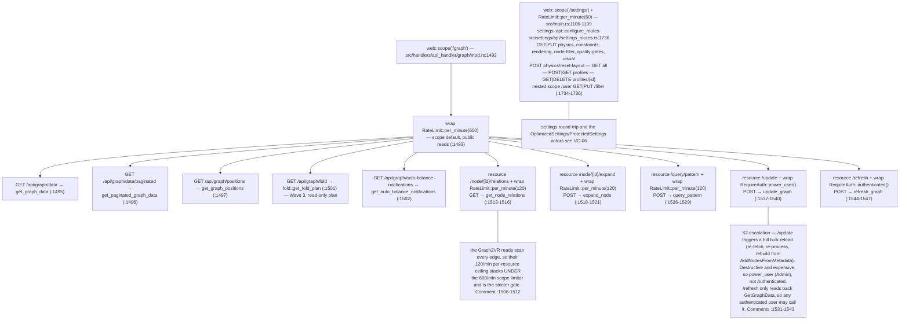

## VC-01.15 ADR-2106 — the embedded pod pulls the published ontology at boot
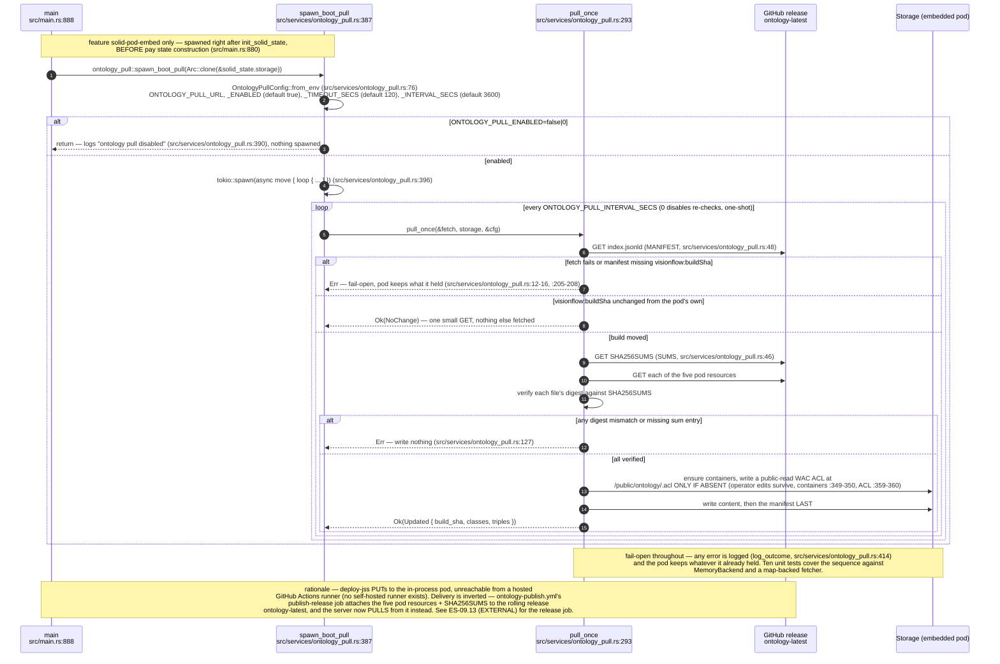
````

## DIFF

```diff
diff --git a/src/handlers/solid_proxy_handler.rs b/src/handlers/solid_proxy_handler.rs
index d630bb1d2..d298c4f57 100644
--- a/src/handlers/solid_proxy_handler.rs
+++ b/src/handlers/solid_proxy_handler.rs
@@ -881,6 +881,12 @@ async fn handle_patch(
 
 /// Walk up the path hierarchy to find the nearest .acl sidecar.
 /// Returns the parsed ACL document, or None if no ACL is found.
+///
+/// A document found at an ancestor container is marked `inherited`, so the
+/// evaluator honours only its `acl:default` rules and ignores its `accessTo`
+/// (WAC §4.2, as solid-pod-rs's own resolver does). A pod root granting public
+/// read through `accessTo ./` alone therefore covers the root, not its
+/// children.
 #[cfg(feature = "solid-pod-embed")]
 async fn load_acl_for_path(
     storage: &Arc<FsBackend>,
@@ -905,7 +911,7 @@ async fn load_acl_for_path(
             Some(0) => {
                 // Root container
                 if let Ok((body, _)) = storage.get("/.acl").await {
-                    return parse_acl_body(&body);
+                    return parse_acl_body(&body).map(inherited_from_ancestor);
                 }
                 break;
             }
@@ -917,13 +923,22 @@ async fn load_acl_for_path(
 
         let parent_acl = format!("{}/.acl", current);
         if let Ok((body, _)) = storage.get(&parent_acl).await {
-            return parse_acl_body(&body);
+            return parse_acl_body(&body).map(inherited_from_ancestor);
         }
     }
 
     None
 }
 
+/// Mark a document as found by walking up rather than at the resource itself.
+#[cfg(feature = "solid-pod-embed")]
+fn inherited_from_ancestor(
+    mut doc: solid_pod_rs::wac::AclDocument,
+) -> solid_pod_rs::wac::AclDocument {
+    doc.inherited = true;
+    doc
+}
+
 #[cfg(feature = "solid-pod-embed")]
 fn parse_acl_body(body: &[u8]) -> Option<solid_pod_rs::wac::AclDocument> {
     // Try JSON-LD first, then Turtle
@@ -1804,3 +1819,77 @@ pub fn configure_routes(cfg: &mut web::ServiceConfig) {
     let _ = cfg;
     info!("=== SOLID POD ROUTES DISABLED (no solid-pod-embed feature): registering none ===");
 }
+
+#[cfg(all(test, feature = "solid-pod-embed"))]
+mod wac_inheritance_tests {
+    use super::*;
+    use bytes::Bytes;
+    use solid_pod_rs::wac::{evaluate_access, AccessMode, IdOrIds, IdRef};
+
+    /// The pod root ACL the host writes, except that the public rule names
+    /// the pod container absolutely (`/pod/`), so `accessTo` would cover the
+    /// container's direct children if an ancestor ACL were treated as direct.
+    async fn pod() -> (tempfile::TempDir, Arc<FsBackend>) {
+        let dir = tempfile::tempdir().unwrap();
+        let storage = Arc::new(FsBackend::new(dir.path()).await.unwrap());
+        let mut acl = build_pod_root_acl("owner", "/pod");
+        for rule in acl.graph.iter_mut().flatten() {
+            if rule.id.as_deref() == Some("#public") {
+                rule.access_to = Some(IdOrIds::Single(IdRef { id: "/pod/".into() }));
+            }
+        }
+        let body = serde_json::to_vec(&acl).unwrap();
+        storage
+            .put("/pod/.acl", Bytes::from(body), "application/ld+json")
+            .await
+            .unwrap();
+        (dir, storage)
+    }
+
+    #[tokio::test]
+    async fn own_acl_is_direct_and_ancestor_acl_is_inherited() {
+        let (_d, storage) = pod().await;
+        let own = load_acl_for_path(&storage, "/pod/").await.unwrap();
+        assert!(!own.inherited, "a container's own .acl is not inherited");
+        let up = load_acl_for_path(&storage, "/pod/a.ttl").await.unwrap();
+        assert!(up.inherited, "an ACL found by walking up is inherited");
+    }
+
+    #[tokio::test]
+    async fn ancestor_access_to_no_longer_reaches_children() {
+        let (_d, storage) = pod().await;
+        let root = load_acl_for_path(&storage, "/pod/").await;
+        assert!(
+            evaluate_access(root.as_ref(), None, "/pod/", AccessMode::Read, None),
+            "public read still applies to the container its own ACL names"
+        );
+        let mut child = load_acl_for_path(&storage, "/pod/a.ttl").await.unwrap();
+        assert!(
+            !evaluate_access(Some(&child), None, "/pod/a.ttl", AccessMode::Read, None),
+            "an ancestor's accessTo-only public read must not reach a child (WAC §4.2)"
+        );
+        // The inherited flag is what stops it: read as a direct ACL, the
+        // same document would grant the child.
+        child.inherited = false;
+        assert!(evaluate_access(
+            Some(&child),
+            None,
+            "/pod/a.ttl",
+            AccessMode::Read,
+            None
+        ));
+    }
+
+    #[tokio::test]
+    async fn owner_default_still_reaches_descendants() {
+        let (_d, storage) = pod().await;
+        let child = load_acl_for_path(&storage, "/pod/notes/a.ttl").await;
+        assert!(evaluate_access(
+            child.as_ref(),
+            Some("did:nostr:owner"),
+            "/pod/notes/a.ttl",
+            AccessMode::Read,
+            None
+        ));
+    }
+}
```
