# E0b judgement vc-05

You are an independent judge for a pre-registered experiment. Below are (1) a TOPIC: a Markdown file of Mermaid diagrams that document code, with `path:line` citations, where paths under `../project/` are in the VisionClaw repository and paths under `../project/agentbox/` are in the agentbox repository; and (2) a DIFF: one commit's changes in the visionclaw repository, restricted to the files the topic lists under `sources:`.

Answer exactly one question:

> **Does this change make any statement in the topic false or incomplete?**

Judge only from the two texts below; do not look anything else up. Reply with a single JSON object and nothing else:

```json
{"verdict": "yes" | "no", "statements": ["<diagram id>: <the statement, quoted>", ...], "line_anchors_only": true | false, "reason": "<one or two sentences>"}
```

`statements` lists every topic statement the change makes false or incomplete (empty when the verdict is no). `line_anchors_only` is true when the only such statements are `path:line` anchors whose cited code merely moved.

## TOPIC (docs/diagrams/visionclaw/03-request-lifecycle-and-rbac.md)

````markdown
---
id: VC-03
title: Request lifecycle, identity and the RBAC lattice
area: visionclaw
governing:
  - ../project/docs/IDENTITY-authority-chain.md
  - ../project/docs/SECURITY-profiles.md
  - ../project/docs/BASELINE-architecture.md
adrs: [ADR-2002, ADR-2003, ADR-2009, ADR-2010, ADR-2011, ADR-2012, ADR-2013, ADR-2026, ADR-2039, ADR-2043, ADR-2044]
sources:
  - ../project/client/src/services/signedWebSocketProtocols.ts
  - ../project/client/src/services/nostrAuthService.ts
  - ../project/src/main.rs
  - ../project/src/middleware/mod.rs
  - ../project/src/middleware/rbac_gate.rs
  - ../project/src/middleware/public_demo.rs
  - ../project/src/middleware/rate_limit.rs
  - ../project/src/middleware/timeout.rs
  - ../project/src/middleware/validation.rs
  - ../project/src/settings/auth_extractor.rs
  - ../project/src/utils/auth.rs
  - ../project/src/utils/nip98.rs
  - ../project/src/services/nostr_service.rs
  - ../project/src/services/nostr_identity_verifier.rs
  - ../project/src/services/nostr_bridge.rs
  - ../project/src/services/role_store.rs
  - ../project/src/models/rbac.rs
  - ../project/src/handlers/nostr_handler.rs
  - ../project/src/handlers/socket_flow_handler/http_handler.rs
  - ../project/src/handlers/socket_flow_handler/position_updates.rs
  - ../project/src/handlers/socket_flow_handler/filter_auth.rs
  - ../project/src/handlers/fastwebsockets_handler.rs
  - ../project/src/handlers/client_messages_handler.rs
  - ../project/src/handlers/mcp_relay_handler.rs
  - ../project/src/handlers/multi_mcp_websocket_handler.rs
  - ../project/src/handlers/speech_socket_handler.rs
  - ../project/src/handlers/solid_proxy_handler.rs
  - ../project/src/actors/client_filter.rs
  - ../project/src/uri/mod.rs
  - ../project/src/config/security_profile.rs
  - ../project/crates/visionclaw-domain/src/utils/visibility_filter.rs
verified_commit: 58f04f2eb272a2707737f2065f8241b931229e81
---

## VC-03.1 REST request end-to-end — nginx to handler, real middleware order
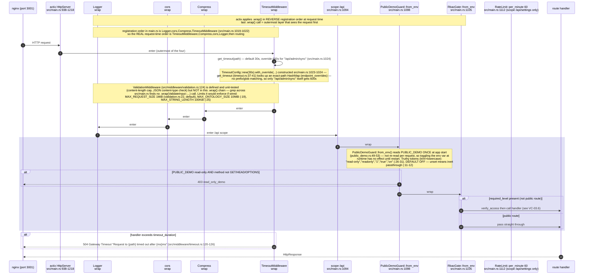

## VC-03.2 WebSocket upgrade lifecycle — every upgrade route, the `?token=` DIVERGENCE
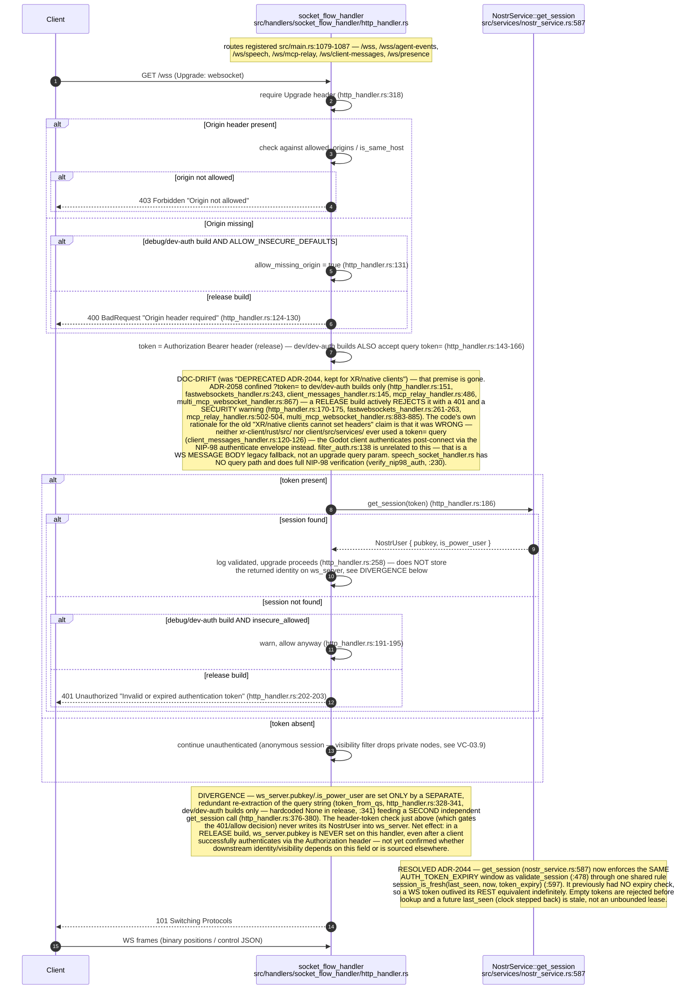

## VC-03.3 `AuthenticatedUser` extractor — settings API dual-auth
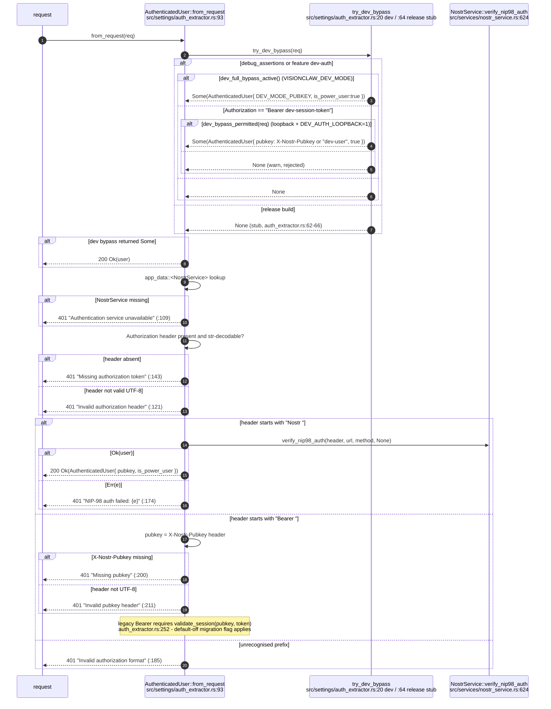

## VC-03.4 NIP-98 verification (kind 27235) — fixed order, single-use replay claim
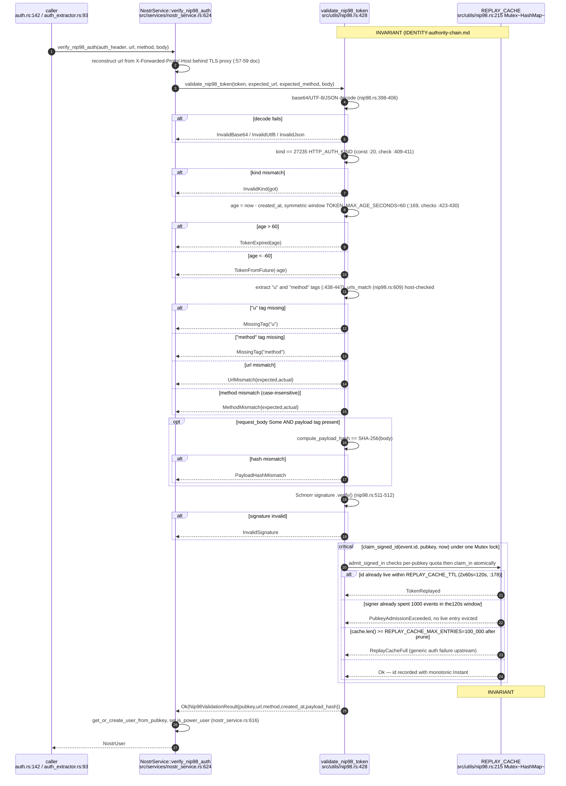

## VC-03.5 Session-bearer realm (ADR-2009) — NIP-98 signing vs opaque session token
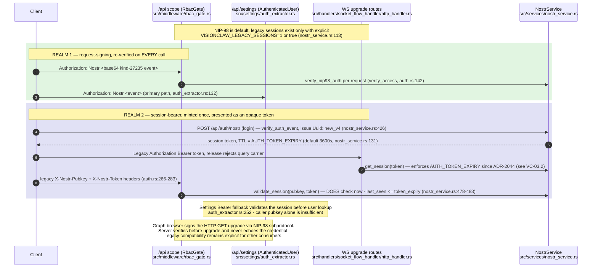

## VC-03.6 `RbacGate` decision sequence — env flags, allowlist, method classification
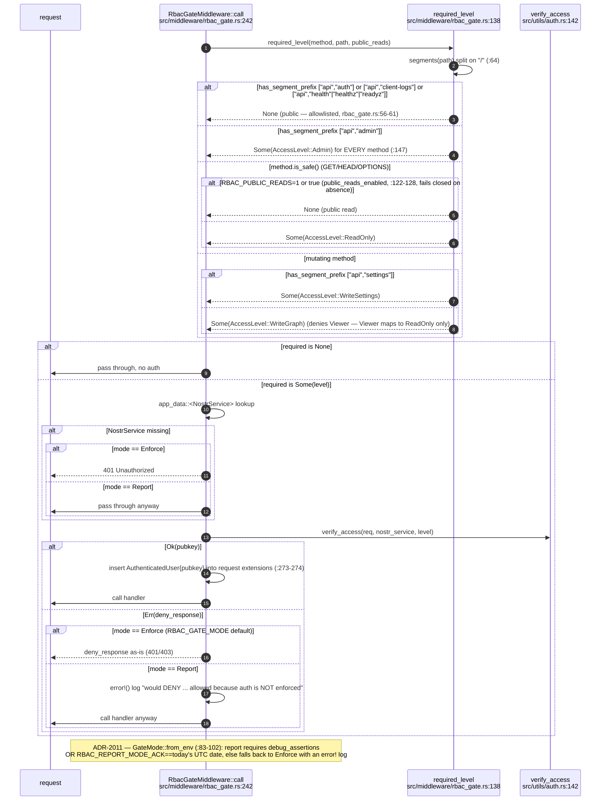

## VC-03.7 Role lattice — Owner > Admin > Editor > Viewer, default-role resolution
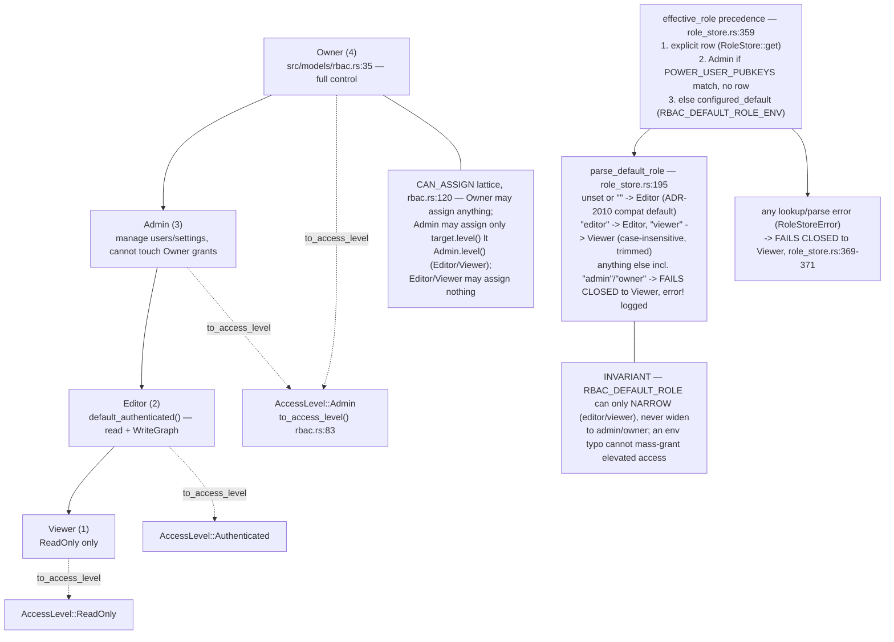

## VC-03.8 `role_store` atomic mutations (ADR-2010) — grant/revoke/transfer
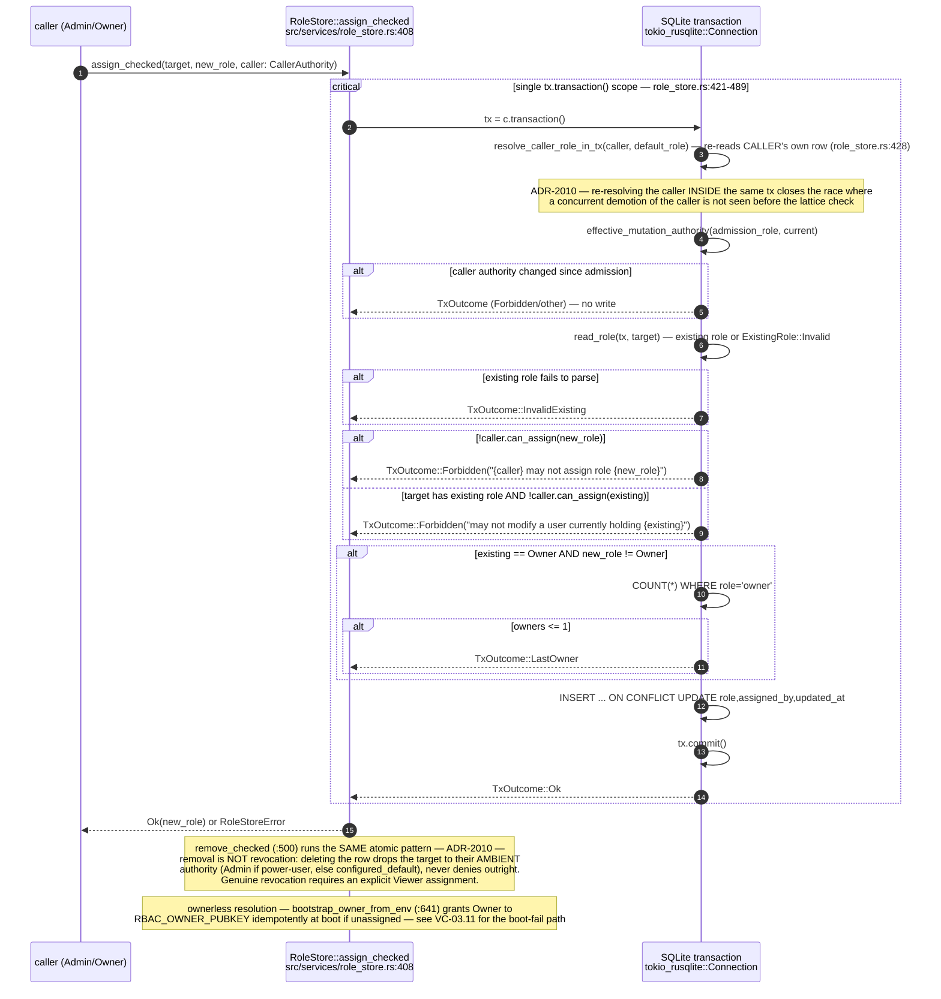

## VC-03.9 `PUBKEY_VISIBILITY_FILTER` — filtered vs unfiltered wire frame
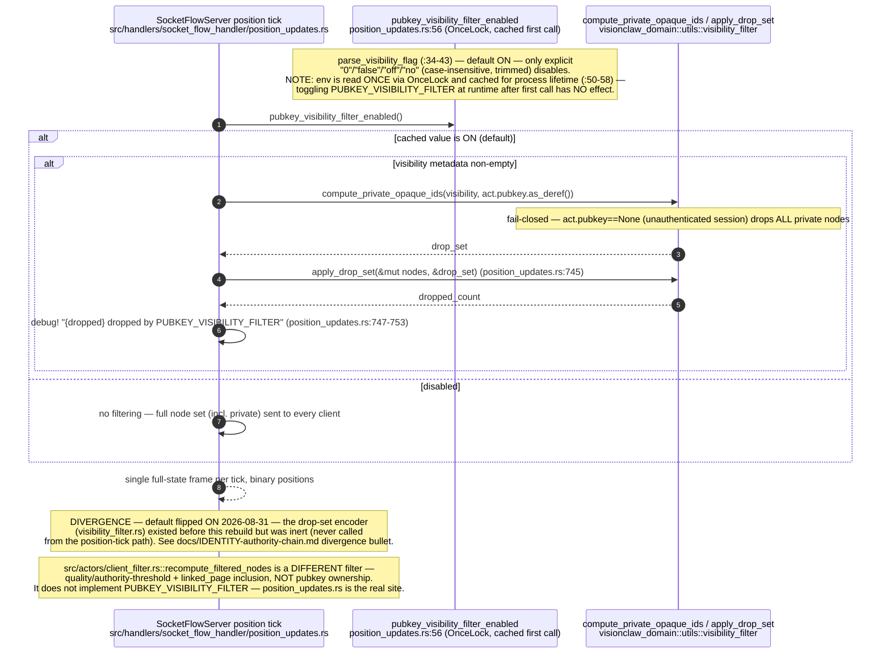

## VC-03.11 Dev bypass triple gate (ADR-2012 / ADR-2039) — nested conditions
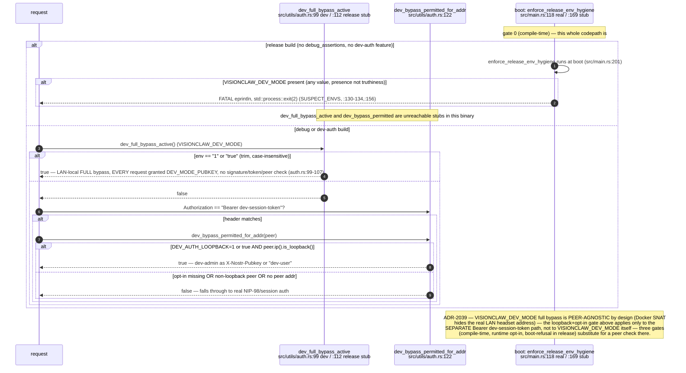

## VC-03.12 `RateLimit` middleware — sliding window per identifier
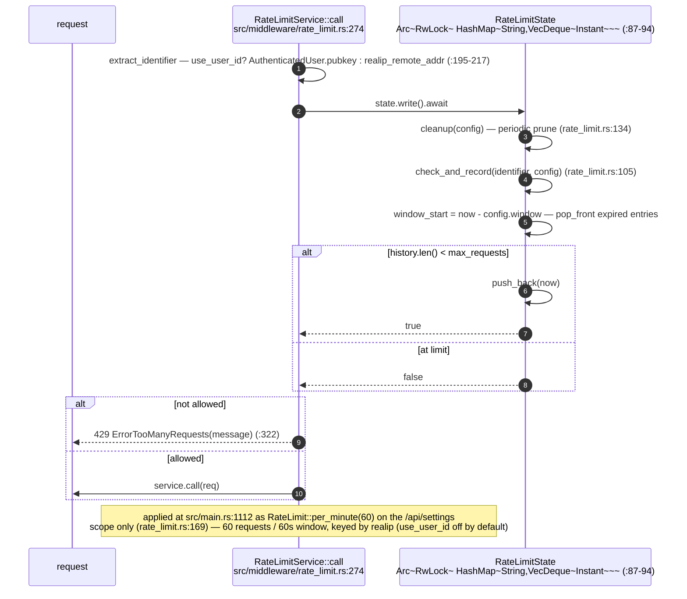

## VC-03.15 Identity authority chain end-to-end — Nostr key to role
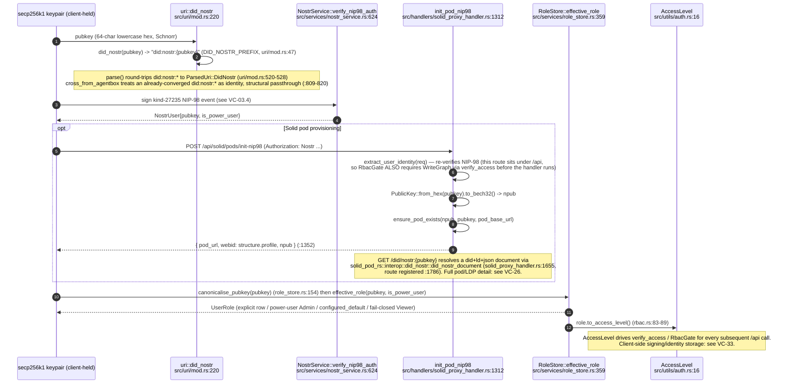

## VC-03.16 ADR-2013 federation-delegation boundary — NOT implemented
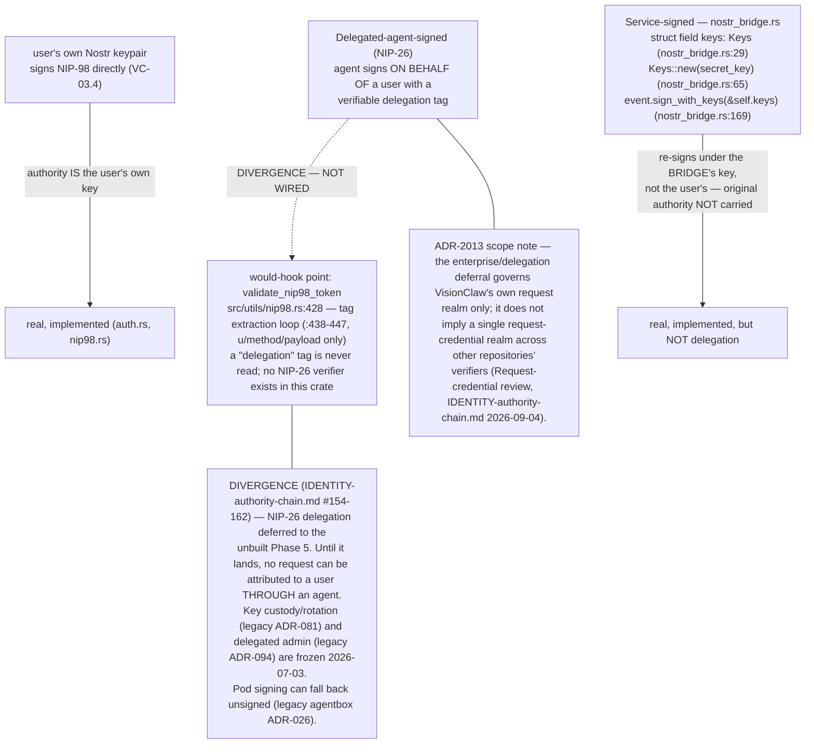

2026-09-07 closeout: `settings/auth_extractor.rs` reuses the server-side
middleware identity extension. The NIP-98 token is consumed once within the
request; a new request presenting the same token still fails. The regression
test checks both outcomes and preserves the authenticated user's privilege bit.


## VC-03.17 Signed browser upgrade and legacy-session sunset

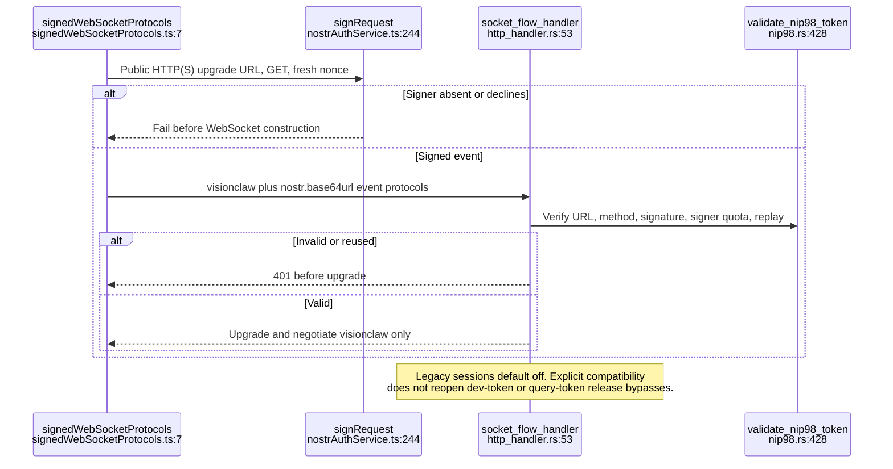
````

## DIFF

```diff
diff --git a/src/handlers/solid_proxy_handler.rs b/src/handlers/solid_proxy_handler.rs
index 9bef8a941..d630bb1d2 100644
--- a/src/handlers/solid_proxy_handler.rs
+++ b/src/handlers/solid_proxy_handler.rs
@@ -1123,6 +1123,8 @@ fn build_pod_root_acl(pubkey: &str, _pod_base: &str) -> solid_pod_rs::wac::AclDo
     AclDocument {
         context: None,
         graph: Some(vec![owner, public]),
+        // The pod root's own sidecar, not one found by walking up.
+        inherited: false,
     }
 }
```
