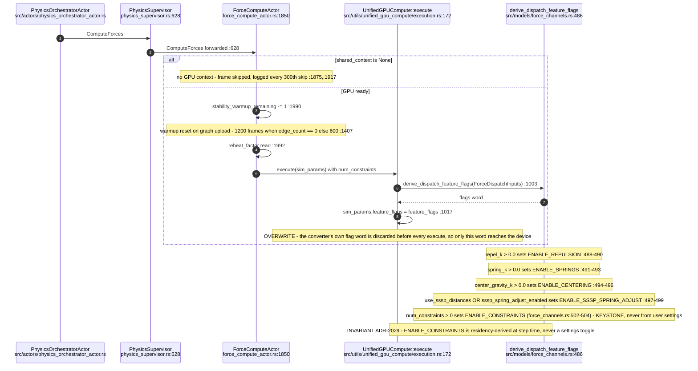
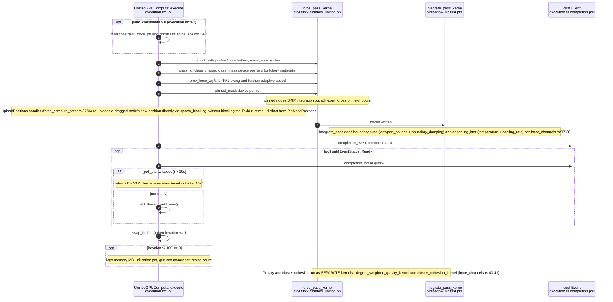
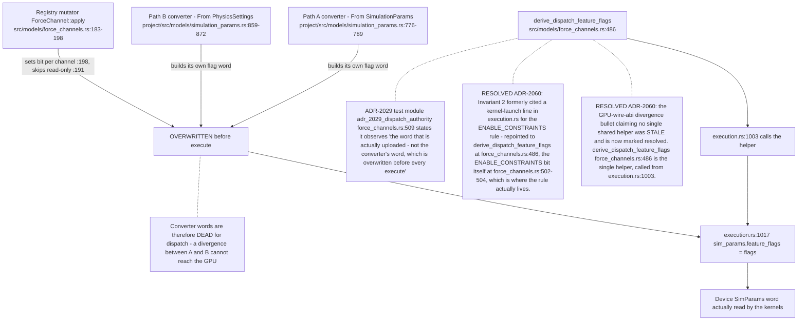
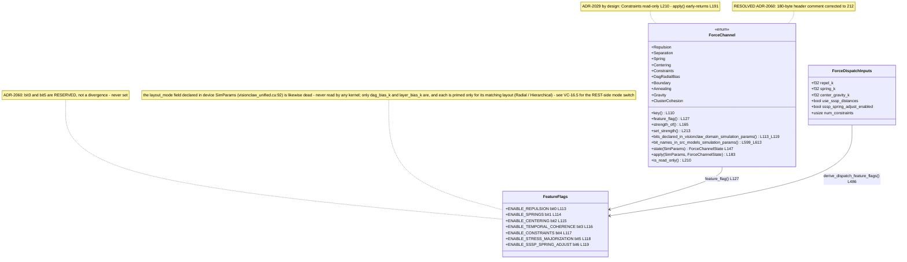
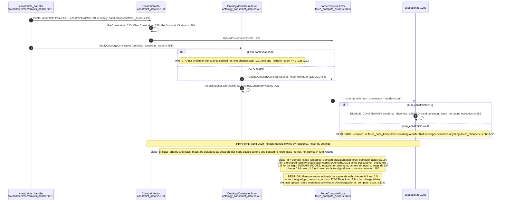
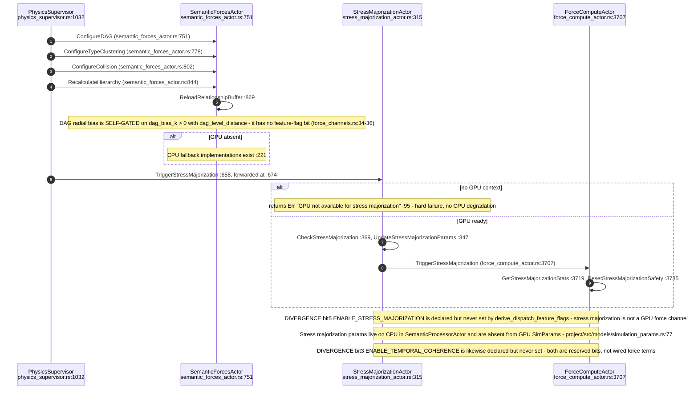
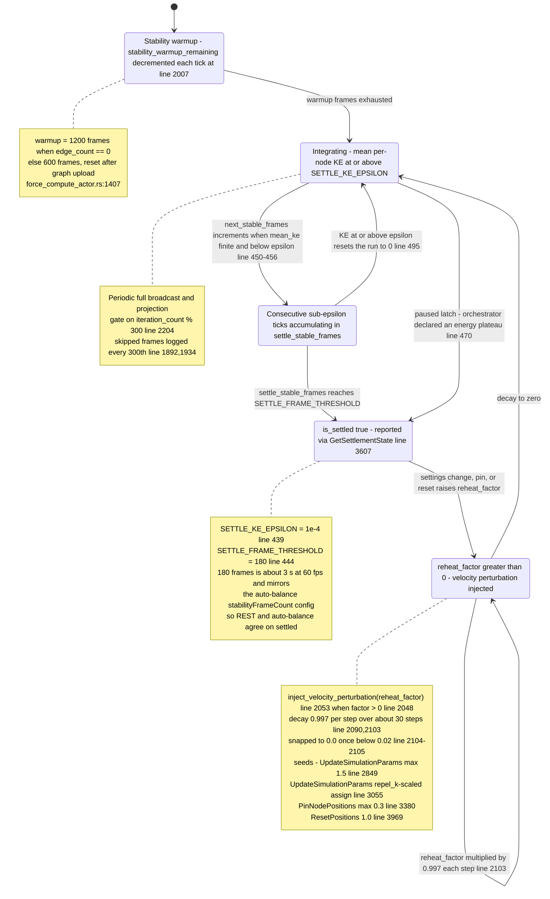
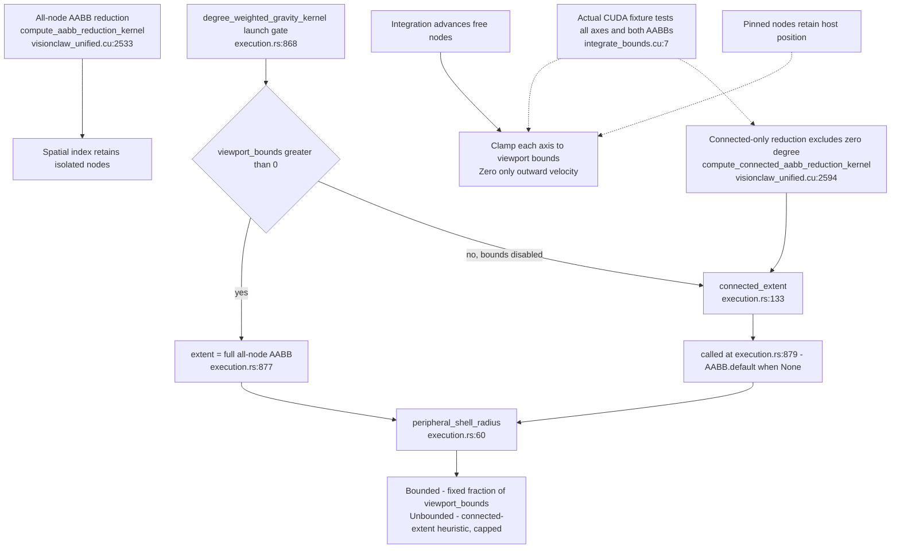

# E0b judgement vc-09

You are an independent judge for a pre-registered experiment. Below are (1) a TOPIC: a Markdown file of Mermaid diagrams that document code, with `path:line` citations, where paths under `../project/` are in the VisionClaw repository and paths under `../project/agentbox/` are in the agentbox repository; and (2) a DIFF: one commit's changes in the visionclaw repository, restricted to the files the topic lists under `sources:`.

Answer exactly one question:

> **Does this change make any statement in the topic false or incomplete?**

Judge only from the two texts below; do not look anything else up. Reply with a single JSON object and nothing else:

```json
{"verdict": "yes" | "no", "statements": ["<diagram id>: <the statement, quoted>", ...], "line_anchors_only": true | false, "reason": "<one or two sentences>"}
```

`statements` lists every topic statement the change makes false or incomplete (empty when the verdict is no). `line_anchors_only` is true when the only such statements are `path:line` anchors whose cited code merely moved.

## TOPIC (docs/diagrams/visionclaw/11-physics-step-and-force-channels.md)

````markdown
---
id: VC-11
title: Physics step and force channels
area: visionclaw
governing:
  - ../project/docs/GPU-wire-abi.md
  - ../project/docs/BASELINE-architecture.md
adrs: [ADR-2007, ADR-2028, ADR-2029, ADR-2055, ADR-2060]
sources:
  - ../project/src/actors/gpu/force_compute_actor.rs
  - ../project/src/actors/gpu/physics_supervisor.rs
  - ../project/src/actors/gpu/constraint_actor.rs
  - ../project/src/actors/gpu/ontology_constraint_actor.rs
  - ../project/src/actors/gpu/semantic_forces_actor.rs
  - ../project/src/actors/gpu/stress_majorization_actor.rs
  - ../project/src/actors/physics_orchestrator_actor.rs
  - ../project/src/models/force_channels.rs
  - ../project/src/models/simulation_params.rs
  - ../project/crates/visionclaw-gpu/src/cuda_sources/visionclaw_unified.cu
  - ../project/tests/gpu/integrate_bounds.cu
  - ../project/src/utils/unified_gpu_compute/execution.rs
  - ../project/crates/visionclaw-domain/src/models/simulation_params.rs
  - ../project/src/handlers/constraints_handler.rs
  - ../project/src/utils/visionflow_unified.ptx
  - ../project/src/actors/gpu/gpu_resource_actor.rs
  - ../project/crates/vault-core/src/domains.rs
verified_commit: dd420fbc722a7a4a50e968162ac6c3eaff6972b2
---

## VC-11.1 Physics tick — phase 1, params and flag word



## VC-11.2 Physics tick — phase 2, kernel launch and integrate



## VC-11.3 Feature-flag derivation across the conversion paths



## VC-11.4 Force-channel registry



## VC-11.5 Constraint residency — upload and flag consequence



## VC-11.7 Semantic forces and stress majorization



## VC-11.9 Warmup, settle and reheat cycle




## VC-11.10 Hard bounds and connected extent


````

## DIFF

```diff
diff --git a/src/actors/gpu/force_compute_actor.rs b/src/actors/gpu/force_compute_actor.rs
index 151e89e4f..8d7eac10d 100644
--- a/src/actors/gpu/force_compute_actor.rs
+++ b/src/actors/gpu/force_compute_actor.rs
@@ -4662,6 +4662,7 @@ mod dag_rank_tests {
         }
         for label in [
             "domain_member",
+            "chain_payment",
             "equivalent_class",
             "same_as",
             "sub_property_of",
```
