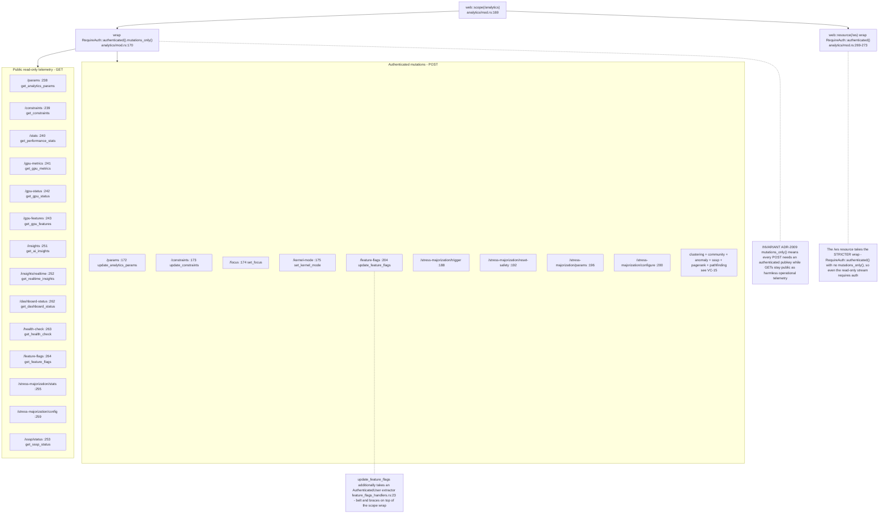
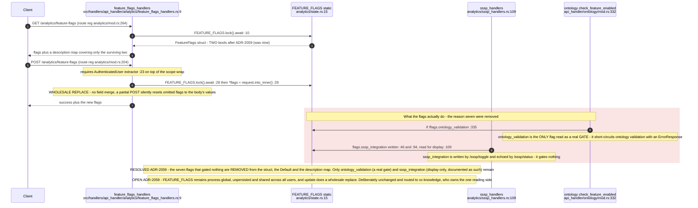
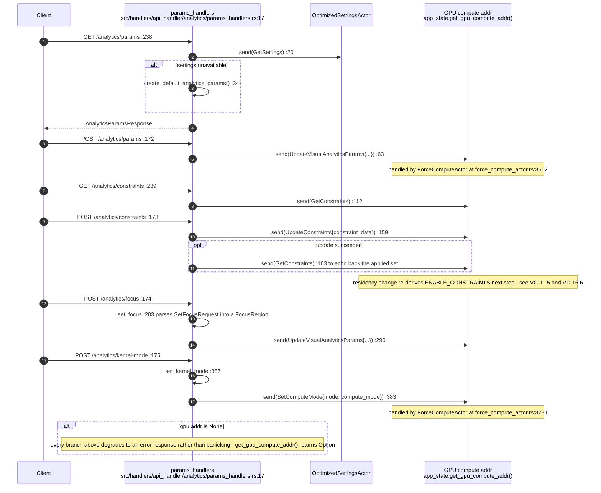
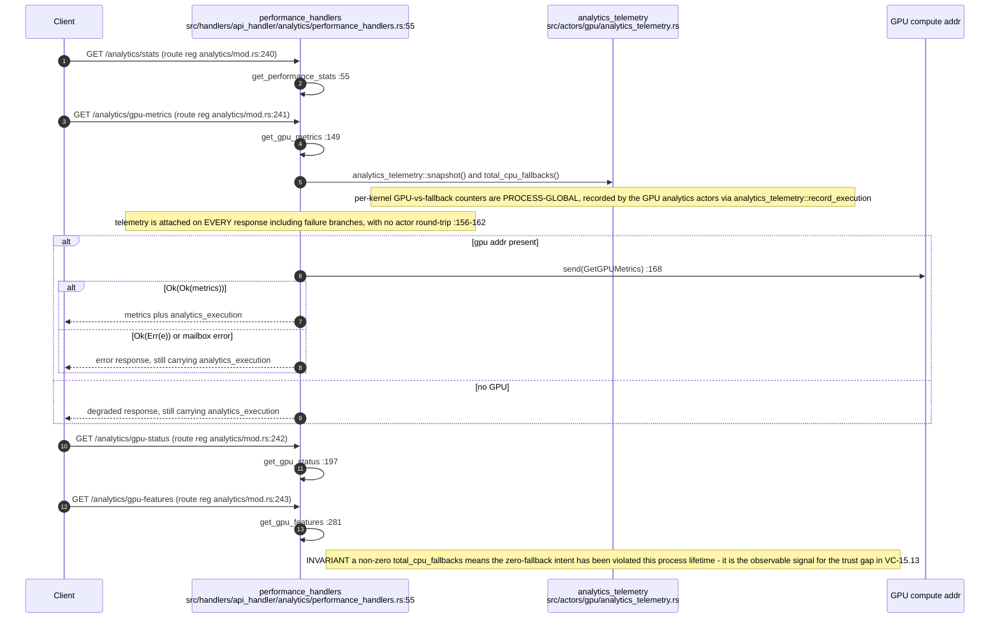
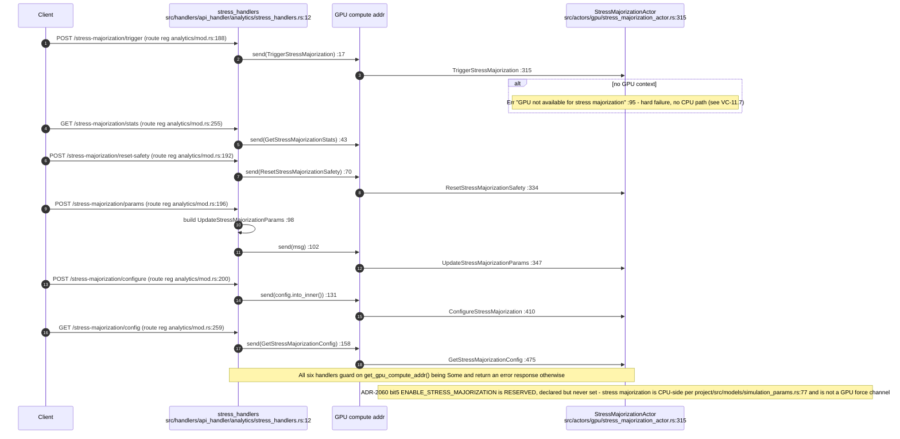
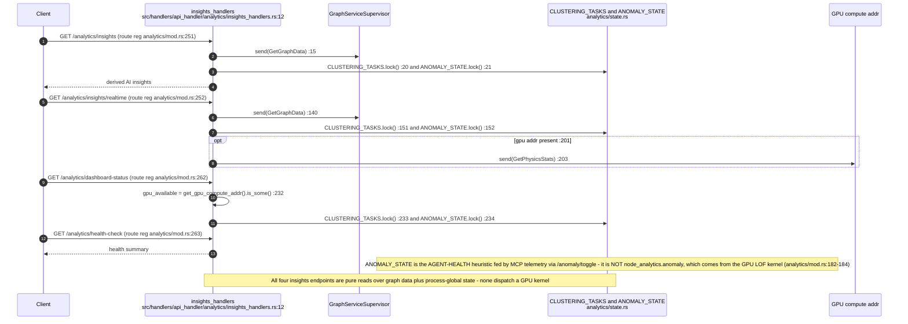
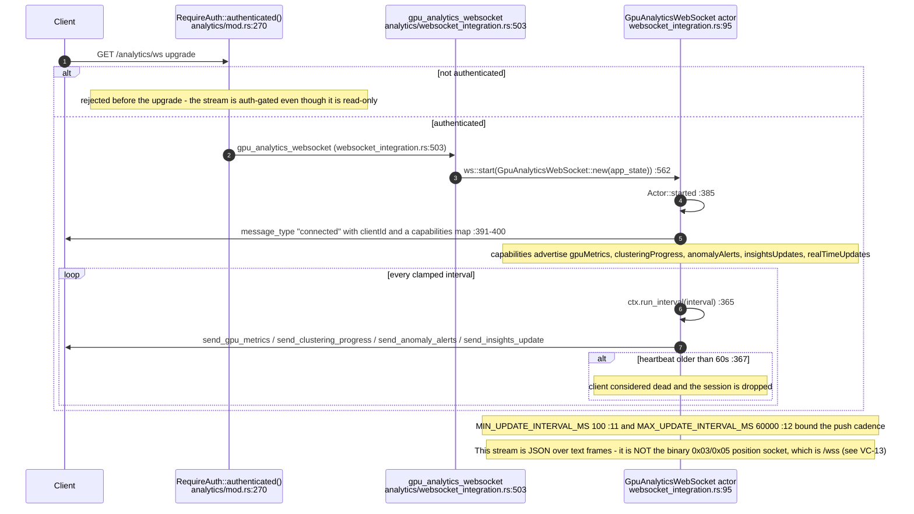
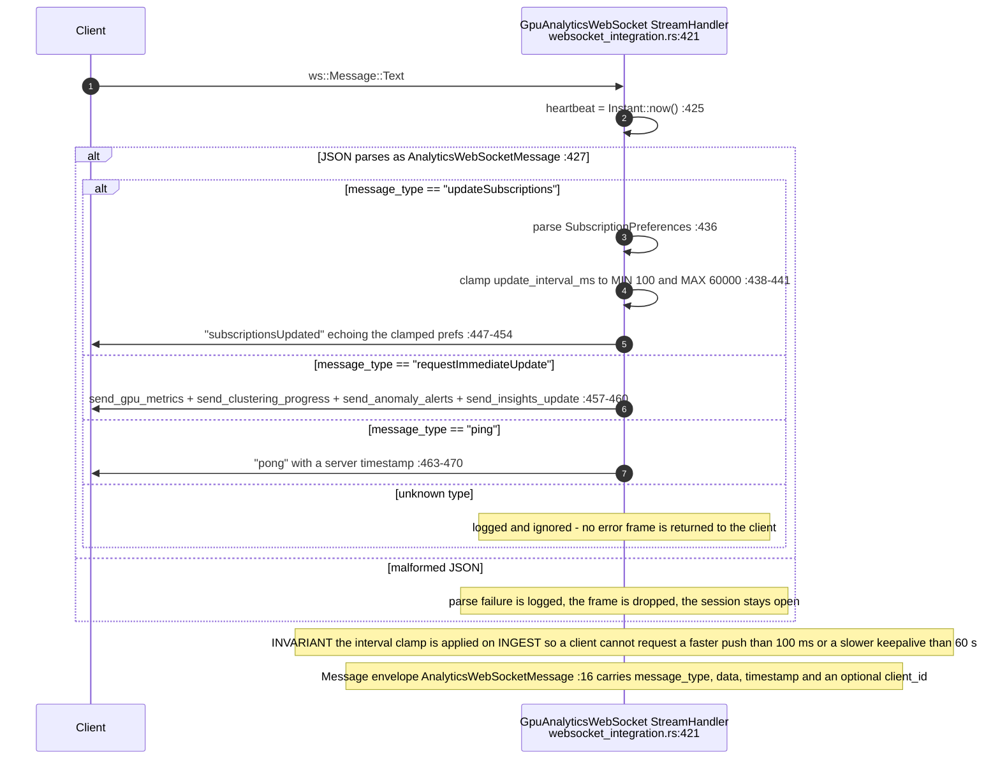
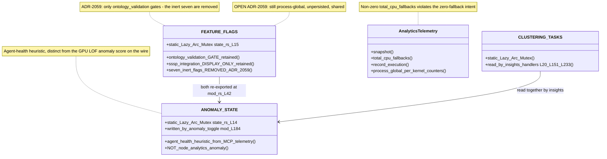

# E0b judgement vc-13

You are an independent judge for a pre-registered experiment. Below are (1) a TOPIC: a Markdown file of Mermaid diagrams that document code, with `path:line` citations, where paths under `../project/` are in the VisionClaw repository and paths under `../project/agentbox/` are in the agentbox repository; and (2) a DIFF: one commit's changes in the visionclaw repository, restricted to the files the topic lists under `sources:`.

Answer exactly one question:

> **Does this change make any statement in the topic false or incomplete?**

Judge only from the two texts below; do not look anything else up. Reply with a single JSON object and nothing else:

```json
{"verdict": "yes" | "no", "statements": ["<diagram id>: <the statement, quoted>", ...], "line_anchors_only": true | false, "reason": "<one or two sentences>"}
```

`statements` lists every topic statement the change makes false or incomplete (empty when the verdict is no). `line_anchors_only` is true when the only such statements are `path:line` anchors whose cited code merely moved.

## TOPIC (docs/diagrams/visionclaw/18-analytics-support-handlers.md)

````markdown
---
id: VC-18
title: Analytics support handlers and the analytics WebSocket
area: visionclaw
governing:
  - ../project/docs/PROTOCOL-registry.md
  - ../project/docs/GPU-wire-abi.md
adrs: [ADR-2007, ADR-2009, ADR-2059]
sources:
  - ../project/src/handlers/api_handler/analytics/mod.rs
  - ../project/src/handlers/api_handler/analytics/feature_flags_handlers.rs
  - ../project/src/handlers/api_handler/analytics/insights_handlers.rs
  - ../project/src/handlers/api_handler/analytics/params_handlers.rs
  - ../project/src/handlers/api_handler/analytics/performance_handlers.rs
  - ../project/src/handlers/api_handler/analytics/stress_handlers.rs
  - ../project/src/handlers/api_handler/analytics/websocket_integration.rs
  - ../project/src/handlers/api_handler/analytics/state.rs
  - ../project/src/handlers/api_handler/analytics/types.rs
  - ../project/src/handlers/api_handler/analytics/sssp_handlers.rs
  - ../project/src/handlers/api_handler/ontology/mod.rs
  - ../project/src/actors/gpu/analytics_telemetry.rs
  - ../project/src/actors/gpu/force_compute_actor.rs
  - ../project/src/actors/gpu/stress_majorization_actor.rs
  - ../project/src/models/simulation_params.rs
verified_commit: 7d3ea2edb067432a57e6fe1fd951fd8254380bb8
---

## VC-18.1 /analytics scope — auth wrapper and route table



## VC-18.2 Feature flags — get, update, and what they actually gate



## VC-18.3 Params handlers — analytics params, constraints, focus, kernel mode



## VC-18.4 Performance handlers — stats, GPU metrics, status and features



## VC-18.5 Stress-majorization handlers



## VC-18.6 Insights handlers



## VC-18.7 Analytics WebSocket — connect, subscribe, stream



## VC-18.8 Analytics WebSocket — inbound message handling



## VC-18.9 Analytics process-global state


````

## DIFF

```diff
diff --git a/src/actors/gpu/force_compute_actor.rs b/src/actors/gpu/force_compute_actor.rs
index 151e89e4f..8d7eac10d 100644
--- a/src/actors/gpu/force_compute_actor.rs
+++ b/src/actors/gpu/force_compute_actor.rs
@@ -4662,6 +4662,7 @@ mod dag_rank_tests {
         }
         for label in [
             "domain_member",
+            "chain_payment",
             "equivalent_class",
             "same_as",
             "sub_property_of",
```
