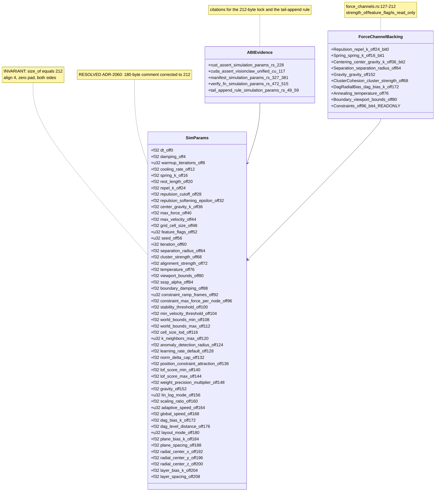
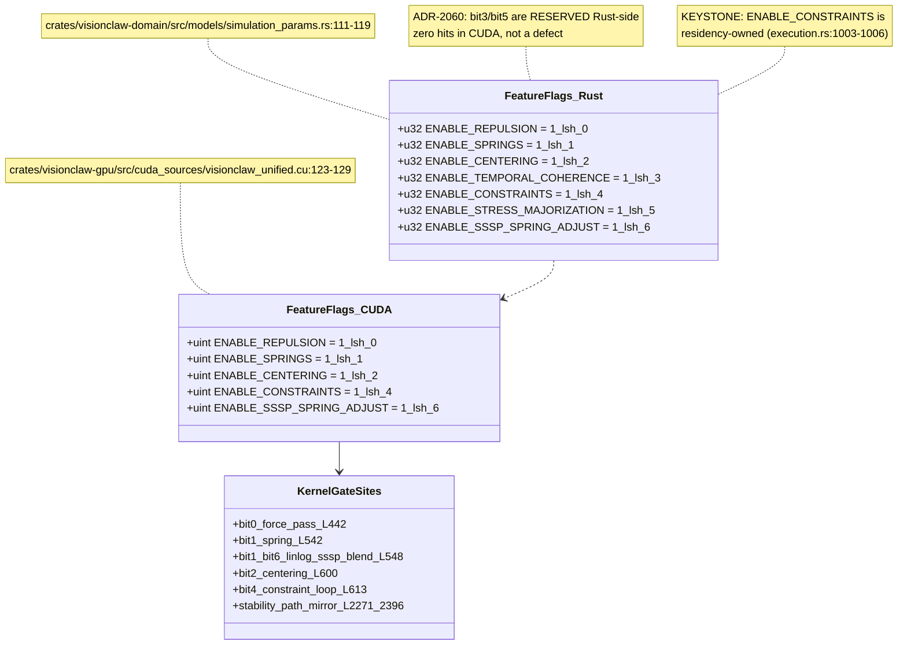
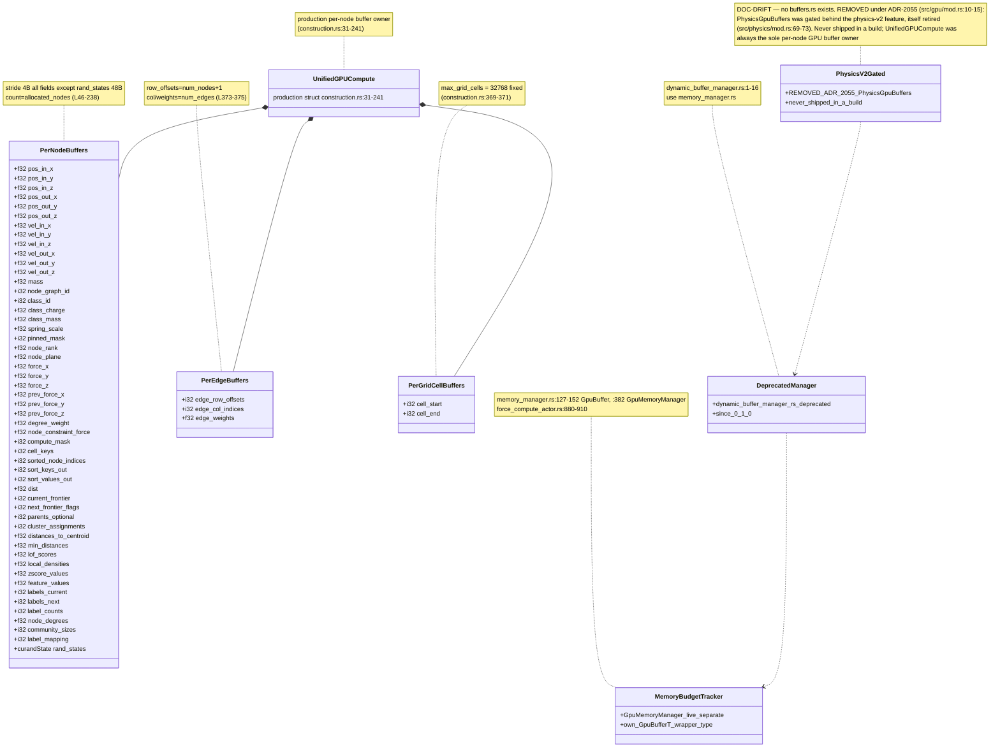
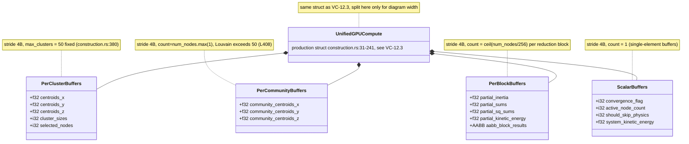
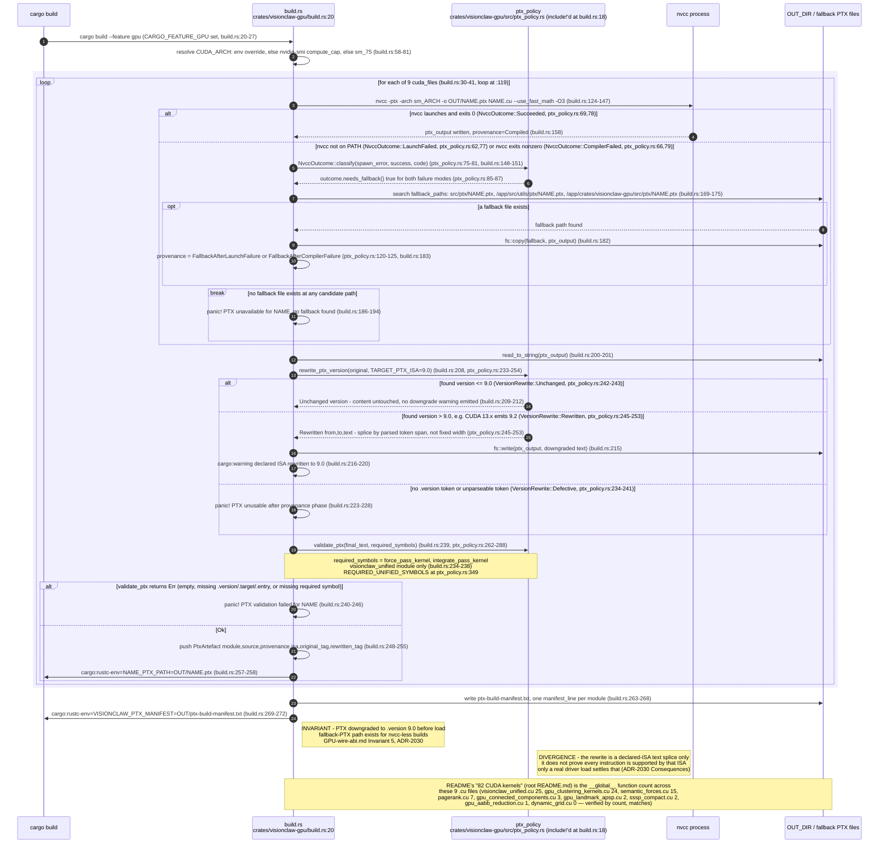
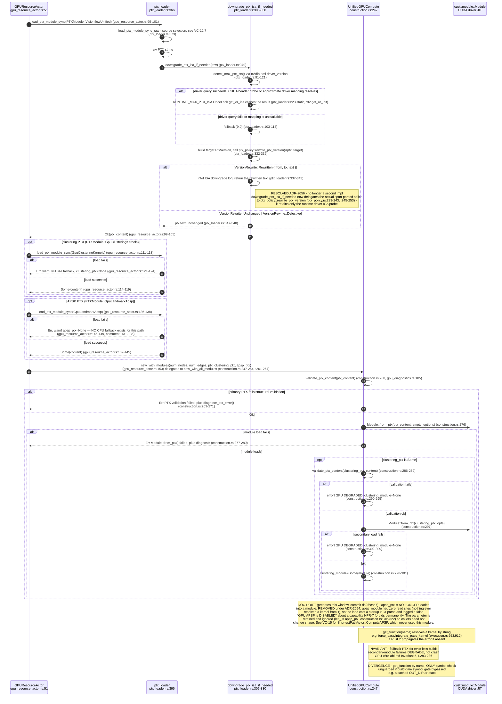
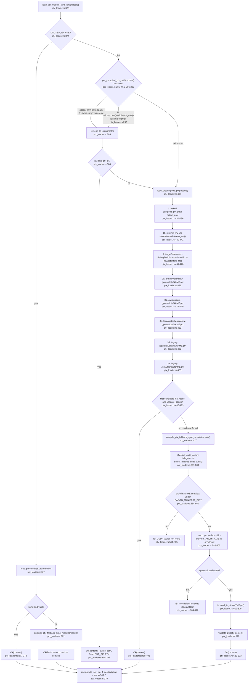

# E0b judgement vc-20

You are an independent judge for a pre-registered experiment. Below are (1) a TOPIC: a Markdown file of Mermaid diagrams that document code, with `path:line` citations, where paths under `../project/` are in the VisionClaw repository and paths under `../project/agentbox/` are in the agentbox repository; and (2) a DIFF: one commit's changes in the visionclaw repository, restricted to the files the topic lists under `sources:`.

Answer exactly one question:

> **Does this change make any statement in the topic false or incomplete?**

Judge only from the two texts below; do not look anything else up. Reply with a single JSON object and nothing else:

```json
{"verdict": "yes" | "no", "statements": ["<diagram id>: <the statement, quoted>", ...], "line_anchors_only": true | false, "reason": "<one or two sentences>"}
```

`statements` lists every topic statement the change makes false or incomplete (empty when the verdict is no). `line_anchors_only` is true when the only such statements are `path:line` anchors whose cited code merely moved.

## TOPIC (docs/diagrams/visionclaw/12-simparams-abi-and-ptx.md)

````markdown
---
id: VC-12
title: SimParams ABI, GPU buffers and PTX
area: visionclaw
governing:
  - ../project/docs/GPU-wire-abi.md
adrs: [ADR-2028, ADR-2030, ADR-2054, ADR-2055, ADR-2056]
sources:
  - ../project/src/models/simulation_params.rs
  - ../project/crates/visionclaw-domain/src/models/simulation_params.rs
  - ../project/crates/visionclaw-gpu/src/cuda_sources/visionclaw_unified.cu
  - ../project/src/models/force_channels.rs
  - ../project/src/utils/unified_gpu_compute/execution.rs
  - ../project/src/utils/unified_gpu_compute/construction.rs
  - ../project/src/actors/gpu/force_compute_actor.rs
  - ../project/src/actors/gpu/gpu_resource_actor.rs
  - ../project/crates/visionclaw-gpu/build.rs
  - ../project/crates/visionclaw-gpu/src/ptx_policy.rs
  - ../project/crates/visionclaw-gpu/src/ptx_loader.rs
  - ../project/src/gpu/dynamic_buffer_manager.rs
  - ../project/src/gpu/memory_manager.rs
  - ../project/src/utils/gpu_diagnostics.rs
  - ../project/src/gpu/mod.rs
  - ../project/src/physics/mod.rs
verified_commit: 7d3ea2edb067432a57e6fe1fd951fd8254380bb8
---
## VC-12.1 SimParams full 212-byte repr(C) layout


## VC-12.2 feature_flags bitfield (u32 at offset 52)


## VC-12.3 GPU core physics buffers: per-node, per-edge, per-grid-cell


## VC-12.4 GPU analytics-adjacent buffers: cluster, community, block, scalar


## VC-12.5 build.rs: nvcc to PTX to .version 9.0 downgrade


## VC-12.6 runtime PTX load, module init and kernel handle lookup


## VC-12.7 PTX source selection: compiled vs pre-shipped vs runtime-compiled

````

## DIFF

```diff
diff --git a/src/actors/gpu/force_compute_actor.rs b/src/actors/gpu/force_compute_actor.rs
index afa3124fc..151e89e4f 100644
--- a/src/actors/gpu/force_compute_actor.rs
+++ b/src/actors/gpu/force_compute_actor.rs
@@ -567,25 +567,34 @@ impl ForceComputeActor {
     /// If the hierarchy is non-empty but has no natural root (a pure cycle), the
     /// lowest-index participating node is seeded as a root so the layer assignment
     /// is deterministic rather than empty. Pure/actor-free for unit testing.
-    /// True only for relation strings with explicit class-subsumption provenance
-    /// (`rdfs:subClassOf`, child → parent), usable for hierarchy ranking.
+    /// The `(parent_idx, child_idx)` pairs the DAG ranker layers, mapped from
+    /// graph node IDs to GPU indices. An edge whose endpoint is not on the GPU
+    /// is skipped. Pure/actor-free for unit testing.
     ///
-    /// The accept set stays narrow on the enum side. `SemanticEdgeType::Hierarchical`
-    /// is far too broad — it folds in the SYMMETRIC `equivalent_class` / `same_as`
-    /// (no parent/child) and the separate property hierarchy `sub_property_of`.
-    /// The generic `"hierarchical"` string, however, IS accepted: it is the
-    /// collapsed subclass label this deployment's ingest writes (matching the fold
-    /// endpoint), so without it the DAG ranks stay unranked and Radial: DAG /
-    /// Hierarchy go silently inert. Beyond that string, only explicit subclass
-    /// provenance counts. Pure/actor-free for unit testing.
-    fn is_directed_hierarchy_relation(rel: &str) -> bool {
-        // "hierarchical" is the collapsed label this deployment's ingest writes
-        // (same accept the fold endpoint needed — see fold.rs); without it the
-        // DAG ranks stay unranked and Radial: DAG / Hierarchy are silently inert.
-        matches!(
-            rel,
-            "is_subclass_of" | "subclass_of" | "SUBCLASS_OF" | "hierarchical" | "HIERARCHICAL"
-        )
+    /// Only class-subsumption edges qualify ([`Edge::asserts_subsumption`]):
+    /// the `hierarchical` label is a force category the ingest also writes for
+    /// equivalence, sameAs, sub-property and instance-of, and domain membership
+    /// has its own label. Ranking any of those would fabricate layers (ADR-2035,
+    /// amended 2026-10-02).
+    ///
+    /// [`Edge::asserts_subsumption`]: visionclaw_domain::models::edge::Edge::asserts_subsumption
+    fn hierarchy_pairs(
+        edges: &[visionclaw_domain::models::edge::Edge],
+        node_indices: &std::collections::HashMap<u32, usize>,
+    ) -> Vec<(usize, usize)> {
+        edges
+            .iter()
+            .filter(|edge| edge.asserts_subsumption())
+            .filter_map(|edge| {
+                match (
+                    node_indices.get(&edge.source),
+                    node_indices.get(&edge.target),
+                ) {
+                    (Some(&child_idx), Some(&parent_idx)) => Some((parent_idx, child_idx)),
+                    _ => None,
+                }
+            })
+            .collect()
     }
 
     fn compute_dag_ranks(num_nodes: usize, hierarchy_edges: &[(usize, usize)]) -> Vec<f32> {
@@ -1228,26 +1237,7 @@ impl ForceComputeActor {
                 // itself stays inert until dagBiasK > 0, so uploading ranks
                 // unconditionally is safe and keeps them ready for a later toggle.
                 if let Some(ref graph_data) = self.pending_graph_data {
-                    let mut hierarchy_edges: Vec<(usize, usize)> = Vec::new();
-                    for edge in &graph_data.edges {
-                        // Match the RAW relation string, not the collapsed
-                        // SemanticEdgeType::Hierarchical (which also folds in the
-                        // symmetric equivalent_class/same_as and the separate
-                        // sub_property_of — all of which would corrupt the ranks).
-                        let directed = edge
-                            .edge_type
-                            .as_deref()
-                            .map(Self::is_directed_hierarchy_relation)
-                            .unwrap_or(false);
-                        if directed {
-                            if let (Some(&child_idx), Some(&parent_idx)) = (
-                                node_indices.get(&edge.source),
-                                node_indices.get(&edge.target),
-                            ) {
-                                hierarchy_edges.push((parent_idx, child_idx));
-                            }
-                        }
-                    }
+                    let hierarchy_edges = Self::hierarchy_pairs(&graph_data.edges, &node_indices);
                     if !hierarchy_edges.is_empty() {
                         let ranks = Self::compute_dag_ranks(num_nodes, &hierarchy_edges);
                         let ranked = ranks.iter().filter(|&&r| r >= 0.0).count();
@@ -4491,6 +4481,7 @@ mod dag_rank_tests {
     //! Pure, actor-free tests for the PHASE 2 DAG rank BFS: root detection,
     //! layered depth, cycle-safety, unreachable/unranked handling.
     use super::ForceComputeActor as FCA;
+    use std::collections::HashMap;
 
     #[test]
     fn empty_hierarchy_yields_all_unranked() {
@@ -4498,6 +4489,82 @@ mod dag_rank_tests {
         assert_eq!(ranks, vec![-1.0, -1.0, -1.0, -1.0]);
     }
 
+    // ── ADR-2035 amendment (N-14): rank from provenance, not the force label ──
+
+    const SUBCLASS: &str = "http://www.w3.org/2000/01/rdf-schema#subClassOf";
+    const EQUIVALENT: &str = "http://www.w3.org/2002/07/owl#equivalentClass";
+    const SUB_PROPERTY: &str = "http://www.w3.org/2000/01/rdf-schema#subPropertyOf";
+
+    /// The edge `relation_edges` writes for an `is-a` frontmatter relation:
+    /// the collapsed force label plus the predicate it was folded from.
+    fn ingested(
+        source: u32,
+        target: u32,
+        predicate: &str,
+    ) -> visionclaw_domain::models::edge::Edge {
+        visionclaw_domain::models::edge::Edge::new(source, target, 1.6)
+            .with_edge_type("hierarchical".to_string())
+            .with_owl_property_iri(predicate.to_string())
+    }
+
+    fn identity_indices(ids: &[u32]) -> HashMap<u32, usize> {
+        ids.iter().enumerate().map(|(i, &id)| (id, i)).collect()
+    }
+
+    #[test]
+    fn a_domain_root_never_ranks_below_its_own_members() {
+        // The live inversion. Members A ⊑ B (an asserted subclass edge), and the
+        // synthetic domain root that `materialise_domain_roots` hangs over both.
+        // Membership is not subsumption: the root must not become a CHILD of
+        // the pages it groups.
+        const A: u32 = 1;
+        const B: u32 = 2;
+        const ROOT: u32 = 900;
+        let edges = vec![
+            ingested(A, B, SUBCLASS),
+            crate::services::github_sync_service::domain_membership_edge(ROOT, A),
+            crate::services::github_sync_service::domain_membership_edge(ROOT, B),
+        ];
+        let idx = identity_indices(&[A, B, ROOT]);
+        let ranks = FCA::compute_dag_ranks(3, &FCA::hierarchy_pairs(&edges, &idx));
+
+        assert_eq!(ranks[idx[&B]], 0.0, "B is the superclass: the top layer");
+        assert_eq!(ranks[idx[&A]], 1.0, "A ⊑ B sits one layer down");
+        assert!(
+            !(ranks[idx[&ROOT]] > ranks[idx[&A]] || ranks[idx[&ROOT]] > ranks[idx[&B]]),
+            "domain root ranked below its members: {ranks:?}"
+        );
+        assert_eq!(
+            ranks[idx[&ROOT]], -1.0,
+            "membership contributes no layer, so the root takes no DAG bias"
+        );
+    }
+
+    #[test]
+    fn folded_non_subsumption_predicates_do_not_rank() {
+        // The ingest folds owl:equivalentClass and rdfs:subPropertyOf into the
+        // same `hierarchical` force label as rdfs:subClassOf. Neither is class
+        // subsumption (one is symmetric, the other is a property hierarchy), so
+        // the provenance must keep them out of the rank space.
+        let edges = vec![ingested(1, 2, EQUIVALENT), ingested(3, 4, SUB_PROPERTY)];
+        let idx = identity_indices(&[1, 2, 3, 4]);
+        assert!(FCA::hierarchy_pairs(&edges, &idx).is_empty());
+    }
+
+    #[test]
+    fn asserted_and_inferred_subclass_edges_rank_child_below_parent() {
+        // Asserted (ingest) and entailed (Whelk materialiser) subsumption both
+        // carry the subClassOf provenance and rank as (parent, child).
+        let edges = vec![
+            ingested(1, 2, SUBCLASS),
+            crate::services::inferred_edge_materialiser::build_inferred_edge(3, 2),
+        ];
+        let idx = identity_indices(&[1, 2, 3]);
+        let mut pairs = FCA::hierarchy_pairs(&edges, &idx);
+        pairs.sort();
+        assert_eq!(pairs, vec![(1, 0), (1, 2)]);
+    }
+
     #[test]
     fn simple_chain_ranks_by_depth() {
         // (parent, child): 0→1→2→3. Root 0 = rank 0, then 1,2,3.
@@ -4553,41 +4620,48 @@ mod dag_rank_tests {
     }
 
     #[test]
-    fn directed_hierarchy_accepts_subsumption_and_the_collapsed_label() {
-        // ADR-2035, reconciled 2026-09-05.
-        //
-        // This test previously asserted that "hierarchical" must be REJECTED,
-        // contradicting the implementation and the accepted decision. The
-        // closeout confirmed the conflict is in the test, not the predicate: the
-        // ratified contract is that the collapsed `hierarchical` label IS
-        // accepted, because it is what this deployment's ingest writes for a
-        // subclass edge (matching the fold endpoint). Without it the DAG ranks
-        // stay unranked and the Radial: DAG / Hierarchy layouts are silently
-        // inert — the failure the accept was introduced to fix.
-        //
-        // The cost is recorded rather than hidden: the collapsed label is lossy,
-        // so a producer that reuses it for domain membership contributes edges
-        // that are ranked as if they were subsumption. That is a *producer*
-        // provenance question (see the domain-membership fixture below), not a
-        // reason for the consumer predicate to reject the label its own ingest
-        // emits.
-        for rel in ["is_subclass_of", "subclass_of", "SUBCLASS_OF"] {
+    fn only_subsumption_provenance_ranks() {
+        // ADR-2035, amended 2026-10-02. The 2026-09-05 contract accepted the
+        // bare `hierarchical` label and claimed no consumer could tell a
+        // subclass edge from anything else folded into it. That was wrong: the
+        // ingest keeps the folded predicate in `owl_property_iri`. Rank on that.
+        let edge = |label: &str, iri: Option<&str>| {
+            let e = visionclaw_domain::models::edge::Edge::new(1, 2, 1.0)
+                .with_edge_type(label.to_string());
+            match iri {
+                Some(i) => e.with_owl_property_iri(i.to_string()),
+                None => e,
+            }
+        };
+        for label in ["is_subclass_of", "subclass_of", "SUBCLASS_OF"] {
             assert!(
-                FCA::is_directed_hierarchy_relation(rel),
-                "{rel}: explicit subclass provenance must rank"
+                edge(label, None).asserts_subsumption(),
+                "{label} names the relation"
             );
         }
-        for rel in ["hierarchical", "HIERARCHICAL"] {
+        for label in ["hierarchical", "HIERARCHICAL"] {
+            assert!(
+                edge(label, Some(SUBCLASS)).asserts_subsumption(),
+                "{label} folded from rdfs:subClassOf ranks"
+            );
             assert!(
-                FCA::is_directed_hierarchy_relation(rel),
-                "{rel}: the collapsed subclass label this ingest writes must rank"
+                !edge(label, None).asserts_subsumption(),
+                "{label} with no provenance is a force category, not a relation"
             );
+            for iri in [
+                EQUIVALENT,
+                SUB_PROPERTY,
+                "http://www.w3.org/2002/07/owl#sameAs",
+                "https://narrativegoldmine.com/ns/v1#instanceOf",
+            ] {
+                assert!(
+                    !edge(label, Some(iri)).asserts_subsumption(),
+                    "{label} folded from {iri} must not rank"
+                );
+            }
         }
-
-        // Still excluded, and for reasons the collapsed label does not share:
-        // symmetric relations have no parent/child direction at all, and
-        // sub_property_of is a different hierarchy over properties, not classes.
-        for rel in [
+        for label in [
+            "domain_member",
             "equivalent_class",
             "same_as",
             "sub_property_of",
@@ -4595,88 +4669,61 @@ mod dag_rank_tests {
             "has_part",
             "namespace",
             "member_of",
-            "belongs_to",
             "",
         ] {
             assert!(
-                !FCA::is_directed_hierarchy_relation(rel),
-                "{rel} must NOT be treated as directed hierarchy"
+                !edge(label, Some(SUBCLASS)).asserts_subsumption(),
+                "{label}"
             );
         }
     }
 
     #[test]
     fn a_subclass_fixture_ranks_by_depth_from_its_root() {
-        // Producer fixture: an ontology emitting explicit subclass provenance.
-        // Entity -> Animal -> Dog, plus a sibling Cat, as (parent, child) pairs.
-        const ENTITY: usize = 0;
-        const ANIMAL: usize = 1;
-        const DOG: usize = 2;
-        const CAT: usize = 3;
-        let edges = [(ENTITY, ANIMAL), (ANIMAL, DOG), (ANIMAL, CAT)];
-        assert!(edges
-            .iter()
-            .all(|_| FCA::is_directed_hierarchy_relation("subclass_of")));
-
-        let ranks = FCA::compute_dag_ranks(4, &edges);
-        assert_eq!(ranks[ENTITY], 0.0, "the root sits at rank 0");
-        assert_eq!(ranks[ANIMAL], 1.0);
-        assert_eq!(ranks[DOG], 2.0, "depth from the nearest root");
-        assert_eq!(ranks[CAT], 2.0, "siblings share a layer");
+        // Entity -> Animal -> {Dog, Cat}, as the ingest writes it (child -> parent).
+        const ENTITY: u32 = 10;
+        const ANIMAL: u32 = 11;
+        const DOG: u32 = 12;
+        const CAT: u32 = 13;
+        let edges = vec![
+            ingested(ANIMAL, ENTITY, SUBCLASS),
+            ingested(DOG, ANIMAL, SUBCLASS),
+            ingested(CAT, ANIMAL, SUBCLASS),
+        ];
+        let idx = identity_indices(&[ENTITY, ANIMAL, DOG, CAT]);
+        let ranks = FCA::compute_dag_ranks(4, &FCA::hierarchy_pairs(&edges, &idx));
+        assert_eq!(ranks[idx[&ENTITY]], 0.0, "the root sits at rank 0");
+        assert_eq!(ranks[idx[&ANIMAL]], 1.0);
+        assert_eq!(ranks[idx[&DOG]], 2.0, "depth from the nearest root");
+        assert_eq!(ranks[idx[&CAT]], 2.0, "siblings share a layer");
     }
 
     #[test]
-    fn a_domain_membership_fixture_ranks_identically_under_the_collapsed_label() {
-        // The accepted contract's known cost, made explicit rather than implied.
-        //
-        // A producer that writes "hierarchical" for domain MEMBERSHIP (repo -> file,
-        // say) is indistinguishable at the predicate from one writing it for
-        // subsumption: the label carries no provenance to tell them apart. The
-        // resulting ranks are therefore structurally identical to the subclass
-        // fixture above.
-        //
-        // This is a layout projection, not a claim about the edges' semantics.
-        // Distinguishing the two REQUIRES a producer-side label change (an
-        // explicit subclass label, or a distinct membership label); no consumer
-        // predicate can recover the distinction from this input.
-        const REPO: usize = 0;
-        const DIR: usize = 1;
-        const FILE_A: usize = 2;
-        const FILE_B: usize = 3;
-        let membership = [(REPO, DIR), (DIR, FILE_A), (DIR, FILE_B)];
-        assert!(
-            FCA::is_directed_hierarchy_relation("hierarchical"),
-            "the collapsed label is accepted whatever the producer meant by it"
-        );
-
-        let ranks = FCA::compute_dag_ranks(4, &membership);
-        assert_eq!(ranks, vec![0.0, 1.0, 2.0, 2.0]);
-
-        // The same shape as the subclass fixture: the predicate cannot separate
-        // them, so acceptance of the collapsed label is a decision about ingest
-        // provenance, not something the ranker can adjudicate.
-        let subsumption = FCA::compute_dag_ranks(4, &[(0, 1), (1, 2), (1, 3)]);
-        assert_eq!(ranks, subsumption);
+    fn membership_edges_neither_rank_nor_shortcut_a_subclass_chain() {
+        // Before the amendment a membership edge under `hierarchical` joined the
+        // rank space, and shortest-depth BFS let it lift a deep class a layer.
+        // Domain root R groups every node of the chain C0 <- C1 <- C2.
+        const R: u32 = 99;
+        let edges = vec![
+            ingested(1, 0, SUBCLASS),
+            ingested(2, 1, SUBCLASS),
+            crate::services::github_sync_service::domain_membership_edge(R, 0),
+            crate::services::github_sync_service::domain_membership_edge(R, 1),
+            crate::services::github_sync_service::domain_membership_edge(R, 2),
+        ];
+        let idx = identity_indices(&[0, 1, 2, R]);
+        let ranks = FCA::compute_dag_ranks(4, &FCA::hierarchy_pairs(&edges, &idx));
+        assert_eq!(ranks, vec![0.0, 1.0, 2.0, -1.0]);
     }
 
     #[test]
-    fn mixed_subclass_and_membership_edges_share_one_rank_space() {
-        // When both producers write the collapsed label into the same graph, the
-        // ranker sees one hierarchy. A node reachable by both paths takes the
-        // SHORTEST depth (multi-source BFS), so a membership shortcut can pull a
-        // deeply-subsumed class up a layer.
-        //  0 -> 1 -> 2 -> 3   (subclass chain)
-        //  0 -> 3             (membership shortcut, same label)
+    fn shortest_depth_wins_when_two_subclass_paths_reach_a_node() {
+        // A BFS property, independent of labels: a node reachable at two depths
+        // takes the shallower one.
+        //  0 -> 1 -> 2 -> 3, plus 0 -> 3
         let ranks = FCA::compute_dag_ranks(4, &[(0, 1), (1, 2), (2, 3), (0, 3)]);
-        assert_eq!(ranks[0], 0.0);
-        assert_eq!(ranks[1], 1.0);
-        assert_eq!(ranks[2], 2.0);
-        assert_eq!(
-            ranks[3], 1.0,
-            "shortest depth wins: the membership shortcut lifts node 3"
-        );
+        assert_eq!(ranks, vec![0.0, 1.0, 2.0, 1.0]);
     }
-
     #[test]
     fn nodes_outside_any_hierarchy_edge_stay_unranked() {
         // Rank -1 means "apply no radial bias", which is how a disconnected or
```
