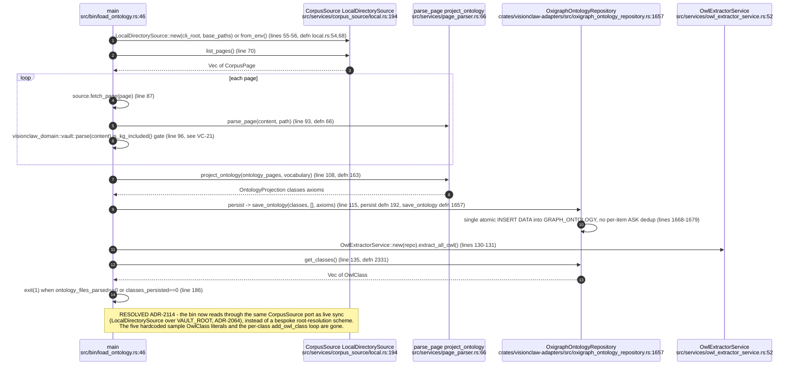
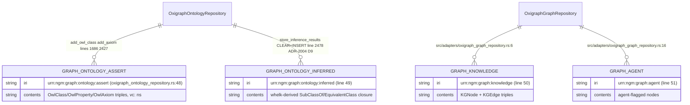
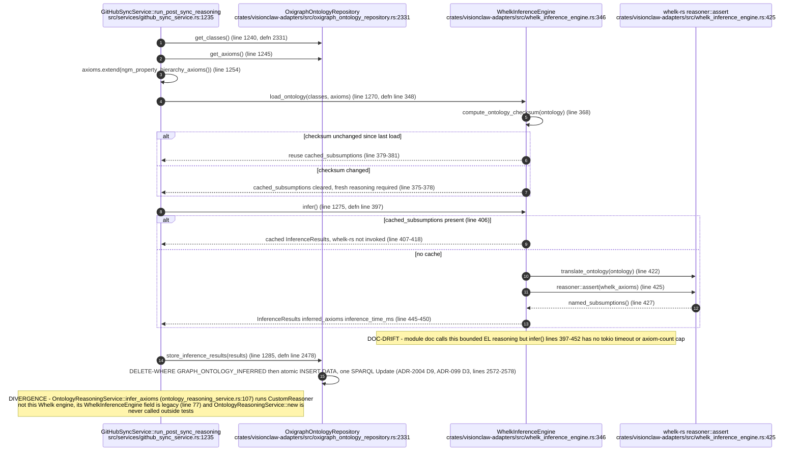
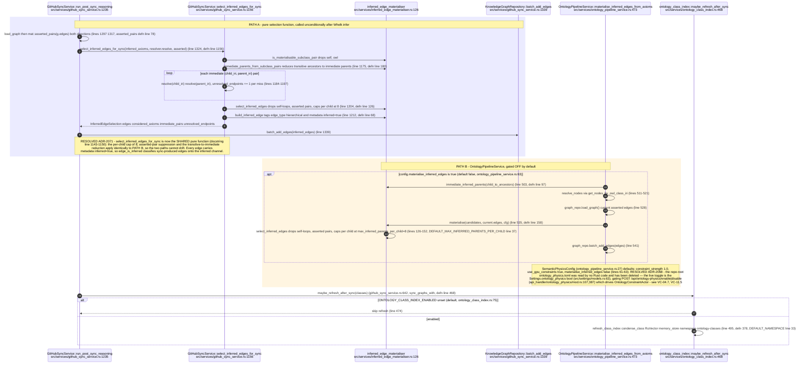
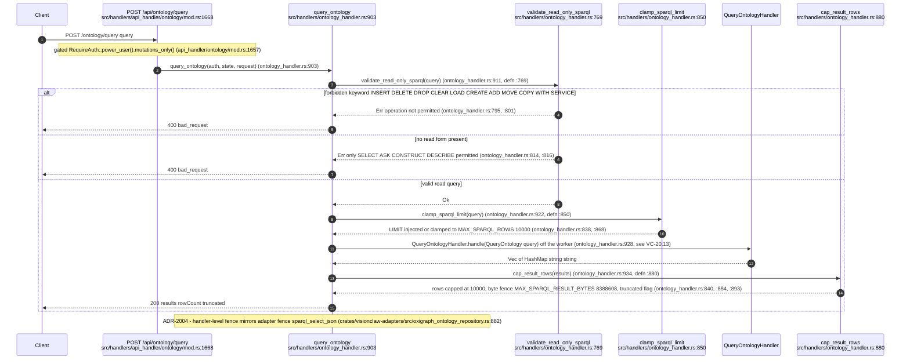
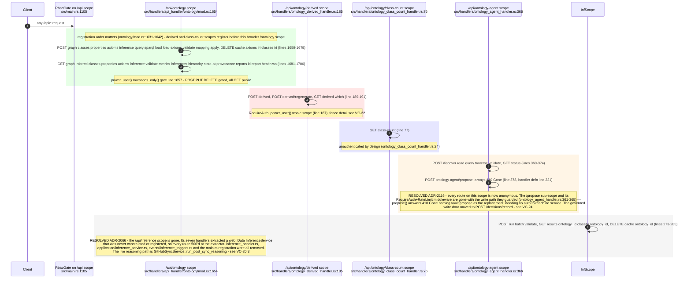
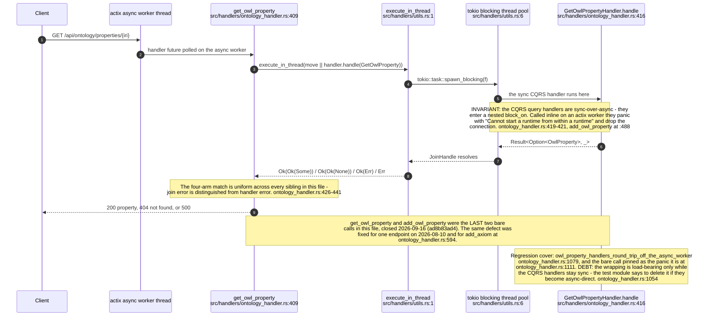

# E0b judgement vc-22

You are an independent judge for a pre-registered experiment. Below are (1) a TOPIC: a Markdown file of Mermaid diagrams that document code, with `path:line` citations, where paths under `../project/` are in the VisionClaw repository and paths under `../project/agentbox/` are in the agentbox repository; and (2) a DIFF: one commit's changes in the visionclaw repository, restricted to the files the topic lists under `sources:`.

Answer exactly one question:

> **Does this change make any statement in the topic false or incomplete?**

Judge only from the two texts below; do not look anything else up. Reply with a single JSON object and nothing else:

```json
{"verdict": "yes" | "no", "statements": ["<diagram id>: <the statement, quoted>", ...], "line_anchors_only": true | false, "reason": "<one or two sentences>"}
```

`statements` lists every topic statement the change makes false or incomplete (empty when the verdict is no). `line_anchors_only` is true when the only such statements are `path:line` anchors whose cited code merely moved.

## TOPIC (docs/diagrams/visionclaw/20-ontology-pipeline-oxigraph-whelk.md)

````markdown
---
id: VC-20
title: Ontology pipeline - OWL extraction, Oxigraph, Whelk reasoning, governed mutation
area: visionclaw
governing:
  - ../project/docs/BASELINE-architecture.md
adrs: [ADR-2004, ADR-2071, ADR-2064, ADR-2066, ADR-2068, ADR-2114, ADR-2116]
sources:
  - ../project/src/bin/load_ontology.rs
  - ../project/src/services/owl_extractor_service.rs
  - ../project/src/services/ontology_pipeline_service.rs
  - ../project/src/services/corpus_source/local.rs
  - ../project/src/services/page_parser.rs
  - ../project/src/adapters/oxigraph_graph_repository.rs
  - ../project/crates/visionclaw-adapters/src/oxigraph_ontology_repository.rs
  - ../project/crates/visionclaw-adapters/src/whelk_inference_engine.rs
  - ../project/src/services/ontology_reasoning_service.rs
  - ../project/src/services/inferred_edge_materialiser.rs
  - ../project/src/services/ontology_class_index.rs
  - ../project/src/handlers/ontology_handler.rs
  - ../project/src/handlers/ontology_derived_handler.rs
  - ../project/src/handlers/ontology_class_count_handler.rs
  - ../project/src/handlers/ontology_agent_handler.rs
  - ../project/src/handlers/api_handler/ontology/mod.rs
  - ../project/src/handlers/api_handler/ontology_physics/mod.rs
  - ../project/src/actors/ontology_actor.rs
  - ../project/src/actors/messages/ontology_messages.rs
  - ../project/src/services/owl_validator.rs
  - ../project/src/inference/mod.rs
  - ../project/src/reasoning/mod.rs
  - ../project/src/services/github_sync_service.rs
  - ../project/src/main.rs
  - ../project/src/handlers/utils.rs
  - ../project/crates/visionclaw-adapters/src/sparql_migrations.rs
  - ../project/src/actors/gpu/gpu_manager_actor.rs
  - ../project/src/actors/gpu/ontology_constraint_actor.rs
  - ../project/src/actors/gpu/physics_supervisor.rs
  - ../project/src/settings/models.rs
verified_commit: {visionclaw: 58f04f2eb272a2707737f2065f8241b931229e81}
---

## VC-20.1 load_ontology bin - CorpusSource-backed corpus loader


## VC-20.2 Oxigraph named-graph layout — ontology and knowledge graphs


## VC-20.5 Oxigraph named-graph layout — shapes, provenance, cache and migrations graphs

```mermaid
erDiagram
    GRAPH_SHAPES {
        string iri "urn:ngm:graph:shapes (line 56)"
        string contents "SHACL shape triples loaded from ttl at startup"
    }
    GRAPH_PROVENANCE {
        string iri "urn:ngm:graph:provenance (line 57)"
        string contents "append-only PROV-O activity triples, see VC-22"
    }
    GRAPH_CACHE_SSSP {
        string iri "urn:ngm:graph:cache:sssp (oxigraph_ontology_repository.rs:73)"
        string contents "shortest-path cache quads, own sub-domain so CLEAR GRAPH invalidates atomically"
    }
    GRAPH_CACHE_APSP {
        string iri "urn:ngm:graph:cache:apsp (line 74)"
        string contents "all-pairs shortest-path cache quads"
    }
    GRAPH_MIGRATIONS {
        string iri "urn:ngm:graph:migrations (sparql_migrations.rs:44)"
        string contents "applied SPARQL migration ids, ADR-101 D2"
    }
    OxigraphOntologyRepository ||--o{ GRAPH_SHAPES : "load_shacl_shapes line 410"
    OxigraphOntologyRepository ||--o{ GRAPH_PROVENANCE : "emit_provenance line 648 see VC-22"
    OxigraphOntologyRepository ||--o{ GRAPH_CACHE_SSSP : "own sub-domain, atomic CLEAR GRAPH, line 73"
    OxigraphOntologyRepository ||--o{ GRAPH_CACHE_APSP : "line 74"
    SparqlMigrations ||--o{ GRAPH_MIGRATIONS : "sparql_migrations.rs:44, excluded from graph-export/GPU paths"
```


## VC-20.3 Whelk EL++ reasoning cycle (github_sync post-sync)


## VC-20.4 inferred-edge materialisation and class-summary index


## VC-20.6 SPARQL read path - /ontology/query


## VC-20.7 ontology HTTP route families


## VC-20.8 OntologyActor message set

```mermaid
classDiagram
    class OntologyActor
    class InitializeActor
    class JobCompleted
    class LoadOntologyAxioms
    class UpdateOntologyMapping
    class ValidateOntology
    class ApplyInferences
    class GetOntologyReport
    class GetOntologyHealth
    class ClearOntologyCaches
    class TriggerReasoning
    class GetCachedOntologies
    class ApplyMaterializedAxioms

    OntologyActor ..> InitializeActor : Handler ontology_actor.rs 707
    OntologyActor ..> JobCompleted : Handler line 739
    OntologyActor ..> LoadOntologyAxioms : Handler line 749
    OntologyActor ..> UpdateOntologyMapping : Handler line 781
    OntologyActor ..> ValidateOntology : Handler line 791
    OntologyActor ..> ApplyInferences : Handler line 849
    OntologyActor ..> GetOntologyReport : Handler line 871
    OntologyActor ..> GetOntologyHealth : Handler line 906
    OntologyActor ..> ClearOntologyCaches : Handler line 938
    OntologyActor ..> TriggerReasoning : Handler line 962
    OntologyActor ..> GetCachedOntologies : Handler line 985

    note for LoadOntologyAxioms "LoadOntologyAxioms, ClearOntologyCaches,<br/>GetCachedOntologies, GetOntologyHealth now re-exported from<br/>visionclaw_actors::messages::ontology_messages<br/>(ontology_messages.rs:11-17), not defined in this webxr crate file"
    note for ValidateOntology "fields ontology_id, graph_data, mode, job_id<br/>(ontology_messages.rs:37-46), rtype Result of ValidationReport<br/>or String. owl_validator (src/services/owl_validator.rs:2) is a<br/>shim: pub use visionclaw_ontology::services::owl_validator::*<br/>(ADR-090 Phase A4), mirrored by src/inference/mod.rs:2 and<br/>src/reasoning/mod.rs:2 into the same crate.<br/>RESOLVED ADR-2065 - the orphaned second definition<br/>src/services/owl_validator_stubs.rs (a CPU-only<br/>ValidationConfig/PropertyGraph/RdfTriple/ConstraintSummary/<br/>ValidationReport set, no mod declaration or use anywhere,<br/>never compiled) has been deleted; owl_validator is now the<br/>single validation definition."
    note for ApplyInferences "fields rdf_triples, max_depth<br/>(ontology_messages.rs:52-55)"
    note for TriggerReasoning "fields ontology_id i64, source String<br/>(ontology_actor.rs:957-960), handler forwards to ReasoningActor<br/>per comment lines 971-973 which no longer exists"
    note for ApplyMaterializedAxioms "fields axioms, graph_data<br/>(ontology_messages.rs:76-79); NOT handled by OntologyActor -<br/>routed GPUManagerActor gpu_manager_actor.rs 645 to<br/>PhysicsSupervisor physics_supervisor.rs 732 to<br/>OntologyConstraintActor ontology_constraint_actor.rs 522"
    note for OntologyActor "RESOLVED - ProcessOntologyData and<br/>LogseqPage no longer exist in ontology_messages.rs; page<br/>ingest now runs through parse_page/project_ontology over the<br/>vault-core frontmatter model, see VC-20.1/VC-21"
```



## VC-20.13 Every ontology actix handler dispatches its sync CQRS handler off the worker


````

## DIFF

```diff
diff --git a/src/services/github_sync_service.rs b/src/services/github_sync_service.rs
index a5ca47155..966cd2029 100644
--- a/src/services/github_sync_service.rs
+++ b/src/services/github_sync_service.rs
@@ -35,7 +35,7 @@ use std::time::{Duration, Instant};
 use tokio::sync::RwLock;
 use vault_core::vocabulary::Vocabulary;
 use visionclaw_domain::models::canonical_entity::{CanonicalEntity, EntityKind};
-use visionclaw_domain::models::edge::Edge;
+use visionclaw_domain::models::edge::{Edge, DOMAIN_MEMBER_EDGE_TYPE};
 use visionclaw_domain::ports::inference_engine::InferenceEngine;
 use visionclaw_domain::ports::ontology_repository::{AxiomType, OntologyRepository, OwlAxiom};
 
@@ -916,16 +916,7 @@ impl GitHubSyncService {
             let slug = domain_slugs[idx];
             if let Some(members) = domain_members.get(slug) {
                 for &member_id in members {
-                    let edge = Edge {
-                        id: format!("domain_{}_{}", root_id, member_id),
-                        source: root_id,
-                        target: member_id,
-                        weight: 1.5,
-                        edge_type: Some("hierarchical".to_string()),
-                        owl_property_iri: None,
-                        metadata: None,
-                    };
-                    domain_edges.push(edge);
+                    domain_edges.push(domain_membership_edge(root_id, member_id));
                 }
             }
             created += 1;
@@ -2239,6 +2230,23 @@ fn enrich_node_from_frontmatter(
     }
 }
 
+/// The edge joining a synthetic domain root to one of its member pages.
+///
+/// Labelled [`DOMAIN_MEMBER_EDGE_TYPE`], not `hierarchical`: membership is not
+/// subsumption, so the DAG ranker, the fold ladder and the edge palette must
+/// not read it as a subclass edge (ADR-2035, amended 2026-10-02).
+pub(crate) fn domain_membership_edge(root_id: u32, member_id: u32) -> Edge {
+    Edge {
+        id: format!("domain_{}_{}", root_id, member_id),
+        source: root_id,
+        target: member_id,
+        weight: 1.5,
+        edge_type: Some(DOMAIN_MEMBER_EDGE_TYPE.to_string()),
+        owl_property_iri: None,
+        metadata: None,
+    }
+}
+
 /// Map a fully-expanded predicate IRI to a canonical edge-type label.
 /// Returns `""` for predicates that should not create graph edges.
 /// The label is looked up in `SEMANTIC_TYPE_REGISTRY` for force config;
diff --git a/src/services/inferred_edge_materialiser.rs b/src/services/inferred_edge_materialiser.rs
index 04df045d2..0f3959b3d 100644
--- a/src/services/inferred_edge_materialiser.rs
+++ b/src/services/inferred_edge_materialiser.rs
@@ -23,7 +23,7 @@
 //!   is opt-in via [`InferredMaterialisationConfig::enabled`] (default OFF).
 
 use std::collections::{HashMap, HashSet};
-use visionclaw_domain::models::edge::Edge;
+use visionclaw_domain::models::edge::{Edge, RDFS_SUBCLASS_OF_IRI};
 
 /// Edge-type of a materialised inferred subclass edge — the same class label the
 /// asserted hierarchy edges use, so inferred edges also fold under the L2 ladder.
@@ -68,6 +68,7 @@ pub fn edge_is_inferred(edge: &Edge) -> bool {
 pub fn build_inferred_edge(child: u32, parent: u32) -> Edge {
     Edge::new(child, parent, 1.0)
         .with_edge_type(INFERRED_EDGE_TYPE.to_string())
+        .with_owl_property_iri(RDFS_SUBCLASS_OF_IRI.to_string())
         .add_metadata(INFERRED_META_KEY.to_string(), "true".to_string())
 }
```
