# E0b judgement vc-29

You are an independent judge for a pre-registered experiment. Below are (1) a TOPIC: a Markdown file of Mermaid diagrams that document code, with `path:line` citations, where paths under `../project/` are in the VisionClaw repository and paths under `../project/agentbox/` are in the agentbox repository; and (2) a DIFF: one commit's changes in the visionclaw repository, restricted to the files the topic lists under `sources:`.

Answer exactly one question:

> **Does this change make any statement in the topic false or incomplete?**

Judge only from the two texts below; do not look anything else up. Reply with a single JSON object and nothing else:

```json
{"verdict": "yes" | "no", "statements": ["<diagram id>: <the statement, quoted>", ...], "line_anchors_only": true | false, "reason": "<one or two sentences>"}
```

`statements` lists every topic statement the change makes false or incomplete (empty when the verdict is no). `line_anchors_only` is true when the only such statements are `path:line` anchors whose cited code merely moved.

## TOPIC (docs/diagrams/visionclaw/22-data-authority-provenance-erasure.md)

````markdown
---
id: VC-22
title: Data authority, provenance and erasure
area: visionclaw
governing:
  - ../project/docs/DATA-authority-erasure.md
  - ../project/docs/BASELINE-architecture.md
adrs: [ADR-2004, ADR-2015, ADR-2016, ADR-2017, ADR-2069, ADR-2070]
sources:
  - ../project/docs/DATA-authority-erasure.md
  - ../project/Cargo.toml
  - ../project/src/services/nostr_service.rs
  - ../project/src/handlers/nostr_handler.rs
  - ../project/src/adapters/sqlite_settings_repository.rs
  - ../project/src/adapters/sqlite_canary_repository.rs
  - ../project/src/adapters/sqlite_kpi_repository.rs
  - ../project/src/adapters/sqlite_enrichment_repository.rs
  - ../project/src/adapters/oxigraph_graph_repository.rs
  - ../project/crates/visionclaw-adapters/src/oxigraph_ontology_repository.rs
  - ../project/crates/visionclaw-adapters/src/provenance_emitter.rs
  - ../project/src/services/provenance_writer.rs
  - ../project/src/services/provenance_trace.rs
  - ../project/src/services/intent_match.rs
  - ../project/migrations/sqlite/0006_kpi_agent_event_intent.sql
  - ../project/src/handlers/ingest_writeback_handler.rs
  - ../project/src/handlers/enrichment_proposals_handler.rs
  - ../project/src/handlers/trace_handler.rs
  - ../project/src/services/github_sync_service.rs
  - ../project/src/services/corpus_source/mod.rs
  - ../project/src/services/corpus_source/local.rs
  - ../project/src/services/role_store.rs
  - ../project/src/middleware/rbac_gate.rs
  - ../project/src/main.rs
  - ../project/src/handlers/socket_flow_handler/position_updates.rs
  - ../project/crates/visionclaw-domain/src/utils/visibility_filter.rs
  - ../project/client/src/services/solidPod/agentMemory.ts
  - ../project/client/src/services/solidPod/ldpClient.ts
  - ../project/client/src/services/SolidPodService.ts
  - ../project/scripts/backup-sqlite.sh
  - ../project/agentbox/management-api/routes/git-bridge.js
  - ../project/docker-compose.unified.yml
  - ../project/src/app_state.rs
  - ../project/src/services/ontology_mutation_service.rs
verified_commit: {visionclaw: 58f04f2eb272a2707737f2065f8241b931229e81, agentbox: 6a4ad132f2dc5ddaedd05c679fdd10066bf30a0f}
---

## VC-22.1 Write-master per data class

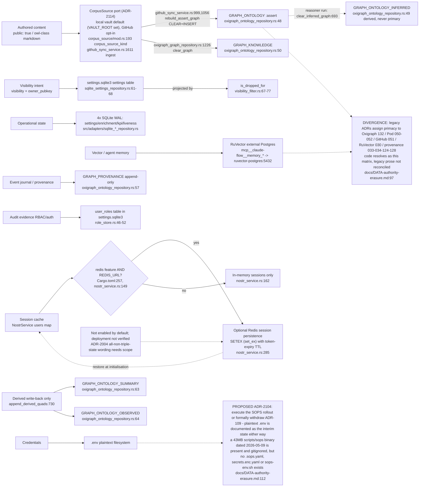

## VC-22.2 SQLite schemas (four write-master databases)

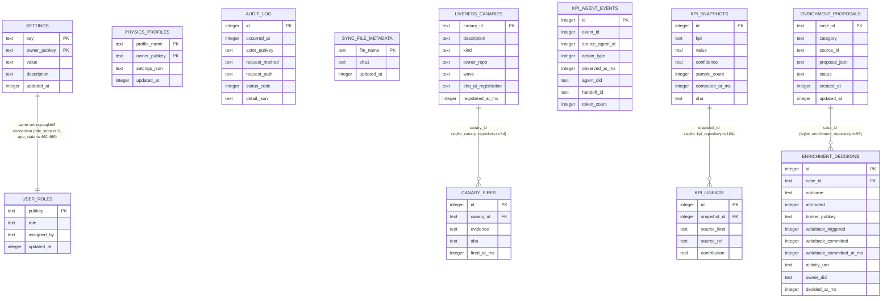

## VC-22.3 Derived-writeback fence (`POST /api/ingest/writeback`, ADR-2015)

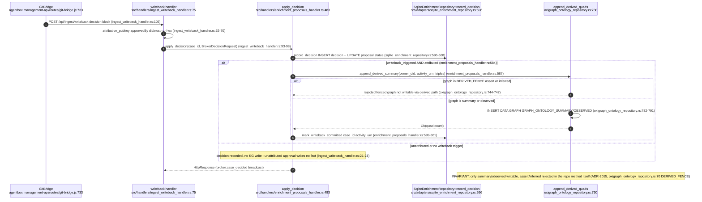

## VC-22.4 Provenance write — two producers, one append-only graph (ADR-2016)

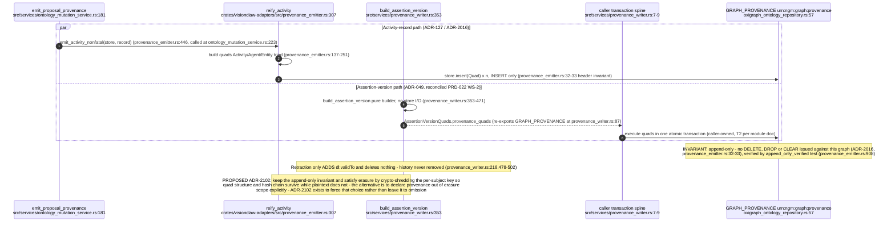

## VC-22.5 Unified provenance trace read path (`GET /api/trace`)

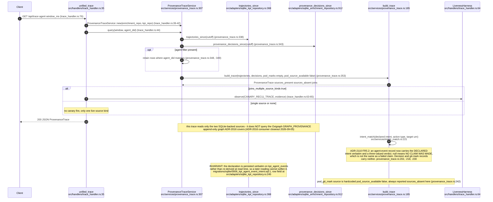

## VC-22.6 Erasure — `deleteAgentMemory` Pod path (RuVector tombstone gap)

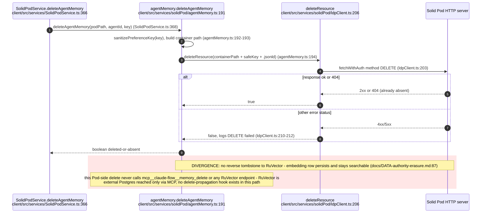

## VC-22.7 SQLite online backup (`scripts/backup-sqlite.sh`, ADR-2017)

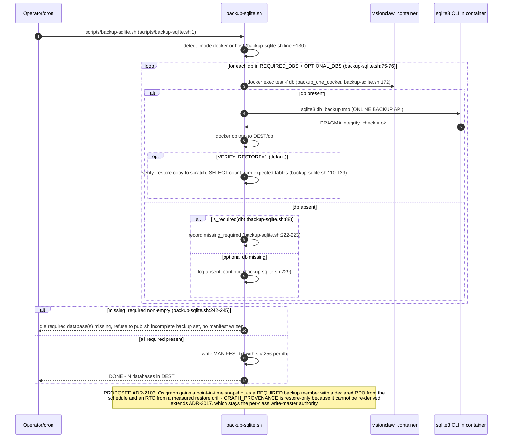

## VC-22.8 Dual-writes: fact fan-out to two stores

```mermaid
sequenceDiagram
    autonumber
    participant SYNC as GitHubSyncService<br/>src/services/github_sync_service.rs:195
    participant KG as GRAPH_KNOWLEDGE<br/>oxigraph_ontology_repository.rs:50
    participant AG as GRAPH_ONTOLOGY assert<br/>oxigraph_ontology_repository.rs:48
    participant APD as apply_decision<br/>src/handlers/enrichment_proposals_handler.rs:483
    participant SQ as enrichment_decisions row<br/>sqlite_enrichment_repository.rs:596
    participant SUM as GRAPH_ONTOLOGY_SUMMARY<br/>oxigraph_ontology_repository.rs:63
    participant PROV as GRAPH_PROVENANCE<br/>oxigraph_ontology_repository.rs:57

    critical content sync fan-out
        SYNC->>KG: batch_add_nodes ingest corpus pages (github_sync_service.rs:1611)
        SYNC->>AG: save_ontology_graph atomic CLEAR GRAPH assert then INSERT DATA (github_sync_service.rs:1056)
    end
    Note over SYNC,AG: authoritative store (the CorpusSource, ADR-2114) commits first via sync run - the Oxigraph projection is regenerated, never hand-edited (docs/DATA-authority-erasure.md:62)

    critical decision fan-out (enrichment_proposals_handler.rs:553-611)
        APD->>SQ: record_decision INSERT+UPDATE one transaction (sqlite_enrichment_repository.rs:596-668)
        APD->>SUM: append_derived_summary INSERT DATA :summary (enrichment_proposals_handler.rs:587, oxigraph_ontology_repository.rs:782-786)
        SUM->>PROV: prov:wasGeneratedBy marker on each subject (oxigraph_ontology_repository.rs:818-824)
    end
    Note over APD,SUM: no cross-store 2PC - the durable decision commits in SQLite first (writeback_triggered=true) - the Oxigraph<br/>write is best-effort, writeback_committed flips only on Ok (enrichment_proposals_handler.rs:587, :605)
```

## VC-22.9 RBAC open-by-default posture on a read

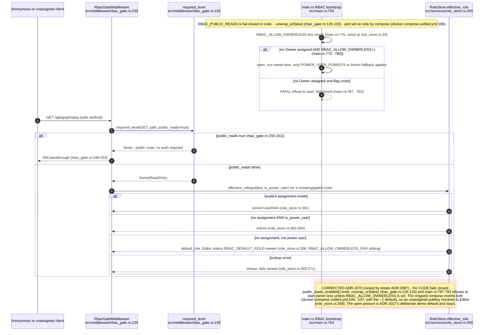

## VC-22.10 Full-sync corpus rebuild, ontology-typed filter and decision re-materialisation (ADR-2114, ADR-050)

```mermaid
sequenceDiagram
    autonumber
    participant OP as Operator (force_full_sync)
    participant SYNC as GitHubSyncService.sync_graphs<br/>src/services/github_sync_service.rs:246
    participant KGREPO as kg_repo.clear_graph<br/>src/adapters/oxigraph_graph_repository.rs:1226
    participant REBUILD as rebuild_assert_graph<br/>src/services/github_sync_service.rs:999
    participant AG as GRAPH_ONTOLOGY assert
    participant DECREB as rematerialise_decisions<br/>src/services/github_sync_service.rs:1095
    participant DIRECT as add_owl_class/add_axiom<br/>application/ontology/directives.rs (governed write door)

    OP->>SYNC: FORCE_FULL_SYNC=1
    alt force_full_sync true (github_sync_service.rs:349,604)
        SYNC->>KGREPO: clear_graph() wipes GRAPH_KNOWLEDGE (github_sync_service.rs:385-390)
        SYNC->>REBUILD: rebuild_assert_graph(stats) (github_sync_service.rs:604-605)
        REBUILD->>REBUILD: filter KG nodes to ontology-typed only, ONTOLOGY_TYPE_KEY metadata (github_sync_service.rs:1015)
        REBUILD->>AG: CLEAR GRAPH assert then INSERT DATA class nodes + class-relation edges (save_ontology_graph, atomic) (github_sync_service.rs:1056)
        Note over REBUILD,AG: this CLEAR wipes the ENTIRE assert graph including runtime OWL classes/axioms added via the governed write door (github_sync_service.rs:983-985)
        REBUILD->>DECREB: rematerialise_decisions() ADR-050 read-half, called AFTER the class CLEAR+INSERT (github_sync_service.rs:1072)
        DECREB->>DECREB: list_pages_under(DECISIONS_DIR), decision_page_quads_logged per page (github_sync_service.rs:1096,1124)
        DECREB->>AG: insert_quads_to_store re-derived dl:DecisionRecord quads, non-fatal on failure (github_sync_service.rs:1135, :1074-1077)
    else incremental sync (SHA1 filter narrowed file list)
        SYNC->>SYNC: clear_graph guard not entered, existing data left intact (github_sync_service.rs:385)
    end
    Note over DIRECT,AG: a class added via add_owl_class/add_axiom between full-syncs is NOT itself in GRAPH_PROVENANCE-protected history for the<br/>assert graph - only re-derivation from the corpus (the visionGraph vault via CorpusSource, ADR-2114) restores it after the next rebuild
    Note over DECREB,AG: attribution is deliberately NOT re-materialised here - the signed PROV-O attribution stays in GRAPH_PROVENANCE (ADR-049)<br/>the corpus decision page carries only the summary (github_sync_service.rs:1086-1094)
    Note over SYNC,AG: PROPOSED ADR-2102: one durable erasure record, five store acknowledgements, and a partial erasure that is recorded<br/>and retryable rather than a silent success - agentbox ADR-2060 is the RuVector-side half and is referenced, not superseded
```

## VC-22.11 SQLite membership contract vs KPI/enrichment sole-source risk

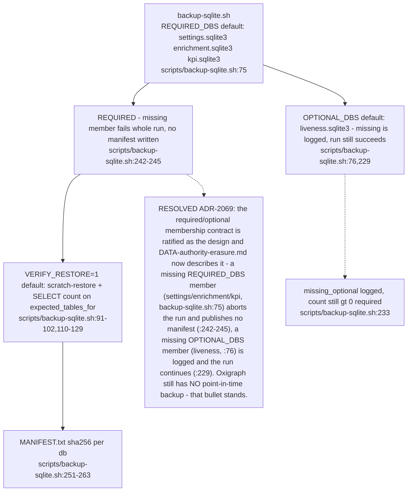
````

## DIFF

```diff
diff --git a/src/services/github_sync_service.rs b/src/services/github_sync_service.rs
index 596c07f79..a5ca47155 100644
--- a/src/services/github_sync_service.rs
+++ b/src/services/github_sync_service.rs
@@ -848,17 +848,10 @@ impl GitHubSyncService {
         Ok(n_nodes)
     }
 
-    /// Create domain root nodes for the 6 NarrativeGoldmine domains and
+    /// Create navigation root nodes for the eight NarrativeGoldmine domains and
     /// hierarchical edges from each node whose `group` matches a domain.
     async fn materialise_domain_roots(&self, stats: &mut SyncStatistics) -> Result<usize, String> {
-        const DOMAINS: &[(&str, &str)] = &[
-            ("spatial-computing", "Spatial Computing"),
-            ("artificial-intelligence", "Artificial Intelligence"),
-            ("infrastructure", "Infrastructure"),
-            ("blockchain", "Blockchain"),
-            ("robotics", "Robotics"),
-            ("distributed-collaboration", "Distributed Collaboration"),
-        ];
+        let domains = vault_core::domains::DOMAIN_ROOTS;
 
         let graph = self
             .kg_repo
@@ -871,7 +864,7 @@ impl GitHubSyncService {
             std::collections::HashMap::new();
         for node in &graph.nodes {
             if let Some(ref group) = node.group {
-                for &(slug, _) in DOMAINS {
+                for &(slug, _) in domains {
                     if group == slug {
                         domain_members.entry(slug).or_default().push(node.id);
                     }
@@ -883,7 +876,7 @@ impl GitHubSyncService {
         let mut domain_edges = Vec::new();
         let mut created = 0;
 
-        for &(slug, label) in DOMAINS {
+        for &(slug, label) in domains {
             let members = match domain_members.get(slug) {
                 Some(m) if !m.is_empty() => m,
                 _ => continue,
@@ -913,7 +906,7 @@ impl GitHubSyncService {
             .map_err(|e| format!("batch_add_nodes domain roots: {}", e))?;
 
         // Map slug → assigned root ID.
-        let domain_slugs: Vec<&str> = DOMAINS
+        let domain_slugs: Vec<&str> = domains
             .iter()
             .filter(|(slug, _)| domain_members.contains_key(slug))
             .map(|(slug, _)| *slug)
```
