# E0c judgement vc-01

You are an independent judge for a pre-registered experiment. Below are (1) a TOPIC: a Markdown file of Mermaid diagrams that document code, with `path:line` citations, where paths under `../project/` are in the VisionClaw repository and paths under `../project/agentbox/` are in the agentbox repository; and (2) a DIFF: one commit's changes in the visionclaw repository, restricted to the files the topic's `sequenceDiagram` blocks cite.

Consider only the topic's `sequenceDiagram` blocks. Answer exactly one question:

> **Does this change make any sequence diagram in this topic wrong or misleading (a call, branch condition, argument or return a diagram shows)?**

Judge only from the two texts below; do not look anything else up. Reply with a single JSON object and nothing else:

```json
{"verdict": "yes" | "no", "statements": ["<diagram id>: <the message, guard, argument or return, quoted>", ...], "line_anchors_only": true | false, "reason": "<one or two sentences>"}
```

`statements` lists every element of a sequence diagram the change makes wrong or misleading (empty when the verdict is no). `line_anchors_only` is true when the only such elements are `path:line` anchors whose cited code merely moved.

## TOPIC (docs/diagrams/visionclaw/02-actor-supervision.md)

````markdown
---
id: VC-02
title: Actor supervision tree, GraphServiceSupervisor routing and peer actor surfaces
area: visionclaw
governing:
  - ../project/docs/BASELINE-architecture.md
adrs: [ADR-2005, ADR-2007, ADR-2045]
sources:
  - ../project/src/app_state.rs
  - ../project/src/main.rs
  - ../project/src/actors/graph_service_supervisor.rs
  - ../project/src/actors/event_coordination.rs
  - ../project/src/actors/graph_state_actor.rs
  - ../project/src/actors/physics_orchestrator_actor.rs
  - ../project/src/actors/client_coordinator_actor.rs
  - ../project/src/actors/ontology_actor.rs
  - ../project/src/actors/semantic_processor_actor.rs
  - ../project/src/actors/optimized_settings_actor.rs
  - ../project/src/actors/elevation_actor.rs
  - ../project/src/actors/elevation_voice.rs
  - ../project/src/actors/decision_elevation_actor.rs
  - ../project/src/actors/voice_interface_actor.rs
  - ../project/src/actors/voice_commands.rs
  - ../project/src/actors/multi_mcp_visualization_actor.rs
  - ../project/src/actors/agent_monitor_actor.rs
  - ../project/src/actors/agent_beam_actor.rs
  - ../project/crates/visionclaw-actors/src/supervisor.rs
  - ../project/tests/orchestration_improvements_test.rs
  - ../project/src/actors/mod.rs
verified_commit: 58f04f2eb272a2707737f2065f8241b931229e81
---

## VC-02.1 Supervision-tree topology — AppState::new boot order
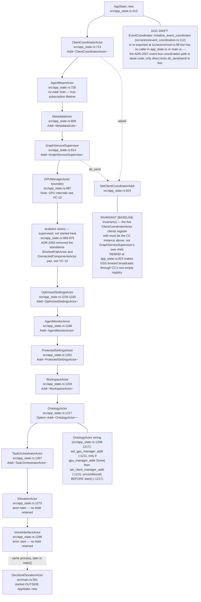

## VC-02.2 GraphServiceSupervisor::initialize_actors — child start order and wiring
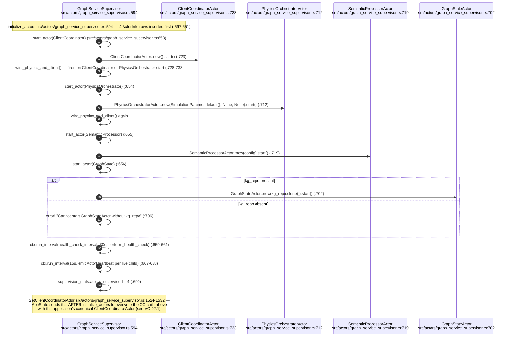

## VC-02.3 GraphServiceSupervisor message routing table
```mermaid
flowchart LR
    subgraph SUP["GraphServiceSupervisor handlers — grep impl Handler< src/actors/graph_service_supervisor.rs"]
        H1["SupervisorMessage graph_service_supervisor.rs:1411"]
        H2["ActorHeartbeat graph_service_supervisor.rs:1419"]
        H3["GetSupervisorStatus graph_service_supervisor.rs:1434"]
        H4["RestartActor graph_service_supervisor.rs:1442"]
        H5["RestartAllActors graph_service_supervisor.rs:1451"]
        H6["RESOLVED ADR-2045 (2026-09-05)<br/>SetParentSupervisor handler removed<br/>with src/actors/supervisor.rs, see VC-02.7"]
        H7["msgs::GetGraphData graph_service_supervisor.rs:1465"]
        H8["NotifyGraphUpdated graph_service_supervisor.rs:1500"]
        H9["SetClientCoordinatorAddr graph_service_supervisor.rs:1524"]
        H10["msgs::ReloadGraphFromDatabase graph_service_supervisor.rs:1534"]
        H11["msgs::ComputeShortestPaths graph_service_supervisor.rs:1638"]
        H12["msgs::UpdateGraphData graph_service_supervisor.rs:1664"]
        H13["msgs::AddNodesFromMetadata graph_service_supervisor.rs:1694"]
        H14["msgs::StartSimulation graph_service_supervisor.rs:1720"]
        H15["msgs::SimulationStep graph_service_supervisor.rs:1737"]
        H16["msgs::GetBotsGraphData graph_service_supervisor.rs:1764"]
        H17["msgs::UpdateSimulationParams graph_service_supervisor.rs:1797"]
        H18["msgs::ForceResumePhysics graph_service_supervisor.rs:1825"]
        H19["msgs::InitializeGPUConnection graph_service_supervisor.rs:1854"]
        H20["msgs::SetAppGpuComputeAddr graph_service_supervisor.rs:1952"]
        H21["msgs::UpdateBotsGraph graph_service_supervisor.rs:1966"]
        H22["msgs::UpdateNodePositions graph_service_supervisor.rs:1983"]
        H23["msgs::NodeInteractionMessage graph_service_supervisor.rs:2010"]
        H24["msgs::GetGraphStateActor graph_service_supervisor.rs:2078"]
        H25["msgs::GetPhysicsOrchestratorActor graph_service_supervisor.rs:2087"]
        H26["msgs::GetNodeTypeArrays graph_service_supervisor.rs:2102"]
        H27["msgs::GetNodeIdMapping graph_service_supervisor.rs:2124"]
        H28["msgs::AddEdge graph_service_supervisor.rs:2146"]
    end
    GS["self.graph_state (GraphStateActor)"]
    PH["self.physics (PhysicsOrchestratorActor)"]
    CL["self.client (ClientCoordinatorActor)"]
    GM["self.gpu_manager (GPUManagerActor) — boundary, see VC-10"]
    SELF["self (in-place state)"]

    H7 --> GS
    H10 --> GS
    H11 --> GS
    H12 --> GS
    H13 --> GS
    H16 --> GS
    H21 --> GS
    H26 --> GS
    H27 --> GS
    H28 --> GS
    H22 -->|"do_send both"| GS
    H22 --> PH
    H14 --> PH
    H15 --> PH
    H17 --> PH
    H18 --> PH
    H23 --> PH
    H25 --> PH
    H19 -->|"query GetForceComputeActor, InitializeGPU"| GM
    H19 -->|"StoreGPUComputeAddress"| PH
    H1 --> SELF
    H2 --> SELF
    H3 --> SELF
    H4 --> SELF
    H5 --> SELF
    H8 --> SELF
    H9 -->|"self.client = msg.addr, rewire"| CL
    H20 --> SELF
    H24 --> SELF

    N1["H12/H13/H28 also call notify_graph_updated (debounced graphUpdated broadcast) before forwarding<br/>H24/H26/H27 default-value fallback when the target child is None (never propagate an error to caller)<br/>H22 UpdateNodePositions mutates GraphStateActor's Arc~GraphData~ in-place (graph_state_actor.rs:857-858)<br/>so a subsequent GetGraphData poll (H7) returns the GPU-computed layout — no separate read-model push"]
    H12 --- N1
```

## VC-02.4 GraphServiceSupervisor restart and backoff lifecycle — the one live supervision path
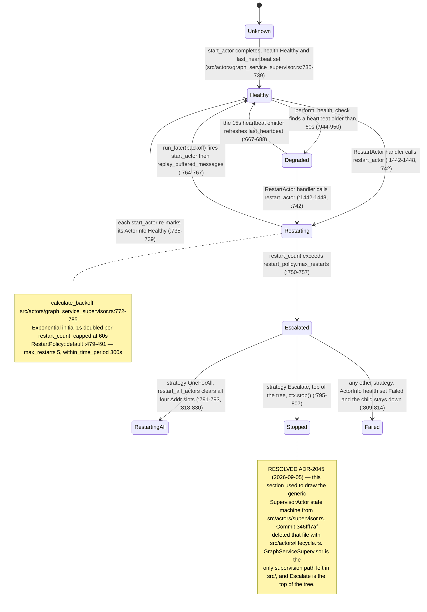

## VC-02.5 GraphServiceSupervisor restart sequence — RestartActor to replay or escalate
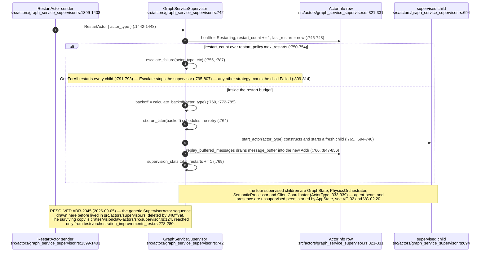

## VC-02.6 Drain and shutdown — GraphServiceSupervisor stop and the test-only crate drain
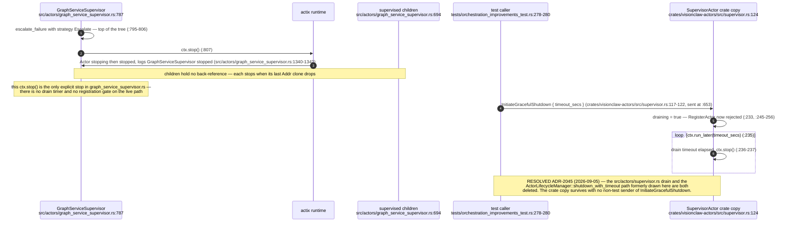

## VC-02.7 RESOLVED ADR-2045 — the removed supervision machinery and its survivor
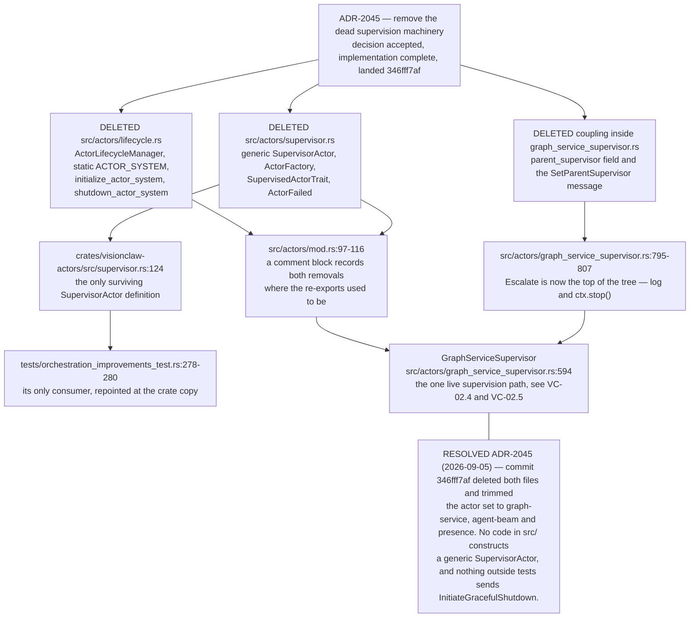

## VC-02.9 Message catalogue — client_messages, graph_messages, broadcast_messages
```mermaid
classDiagram
    class ClientCoordinatorActor {
      <<actor>>
      src/actors/client_coordinator_actor.rs
    }
    class RegisterClient {
      +ClientRecipients recipients
      result() Result~usize,String~
    }
    class ClientRecipients {
      +Recipient~SendToClientBinary~ binary
      +Recipient~SendToClientText~ text
      +Recipient~SendInitialGraphLoad~ initial_load
    }
    class UnregisterClient {
      +usize client_id
    }
    class BroadcastMessage {
      +String message
    }
    class GraphServiceSupervisor {
      <<actor>>
    }
    class GetGraphData {
      result() Result~Arc,String~
    }
    class UpdateGraphData {
      +Arc~ServiceGraphData~ graph_data
      result() Result~(),String~
    }
    class UpdateNodePositions {
      +List~u32,BinaryNodeData~ positions
      +Option~MessageId~ correlation_id
      result() Result~(),String~
    }
    class AddNodesFromMetadata {
      +MetadataStore metadata
      result() Result~(),String~
    }
    class AddEdge {
      +Edge edge
      result() Result~(),String~
    }
    class NodeInteractionMessage {
      +u32 node_id
      +NodeInteractionType interaction_type
      +Option~List~f32~~ position
      result() Result~(),VisionClawError~
    }
    RegisterClient *-- ClientRecipients
    ClientCoordinatorActor ..> RegisterClient
    ClientCoordinatorActor ..> UnregisterClient
    ClientCoordinatorActor ..> BroadcastMessage
    GraphServiceSupervisor ..> GetGraphData
    GraphServiceSupervisor ..> UpdateGraphData
    GraphServiceSupervisor ..> UpdateNodePositions
    GraphServiceSupervisor ..> AddNodesFromMetadata
    GraphServiceSupervisor ..> AddEdge
    GraphServiceSupervisor ..> NodeInteractionMessage
    note for GetGraphData "src/actors/messages/ — RegisterClient/UnregisterClient/BroadcastMessage\nowned by client_coordinator_actor.rs consumer; Result types confirmed from\nHandler impls at graph_service_supervisor.rs:1465,1664,1983,1694,2146,2010"
```

## VC-02.10 Message catalogue — supervision and heartbeat messages
```mermaid
classDiagram
    class GraphServiceSupervisor {
      <<actor>>
    }
    class SupervisorMessage {
      <<enum>>
      UpdateGraphData
      ReloadGraphFromDatabase
      StartSimulation
      StopSimulation
      SimulationStep
      UpdateSimulationParams
      UpdateNodePositions
      BroadcastMessage
      result() Result~(),VisionClawError~
    }
    class ActorHeartbeat {
      +ActorType actor_type
      +Instant timestamp
      +ActorHealth health
      +Option~ActorStats~ stats
    }
    class GetSupervisorStatus {
      result() SupervisorStatus
    }
    class RestartActor {
      +ActorType actor_type
      result() Result~(),VisionClawError~
    }
    class RestartAllActors {
      result() Result~(),VisionClawError~
    }
    class SetParentSupervisor {
      +Addr~SupervisorActor~ parent
    }
    class SetClientCoordinatorAddr {
      +Addr~ClientCoordinatorActor~ addr
    }
    class NotifyGraphUpdated {
      +str reason
    }
    class ActorFailed {
      +String actor_name
      +VisionClawError error
    }
    GraphServiceSupervisor ..> SupervisorMessage
    GraphServiceSupervisor ..> ActorHeartbeat
    GraphServiceSupervisor ..> GetSupervisorStatus
    GraphServiceSupervisor ..> RestartActor
    GraphServiceSupervisor ..> RestartAllActors
    GraphServiceSupervisor ..> SetClientCoordinatorAddr
    GraphServiceSupervisor ..> NotifyGraphUpdated
    note for SetClientCoordinatorAddr "src/actors/graph_service_supervisor.rs:1524-1532 —\nfield and handler both confirmed by direct read.\nRESOLVED ADR-2045 (2026-09-05) — SetParentSupervisor and ActorFailed\nwere removed from this actor with src/actors/supervisor.rs, see VC-02.7"
```

## VC-02.12 PhysicsOrchestratorActor — handled messages and broadcast invariant
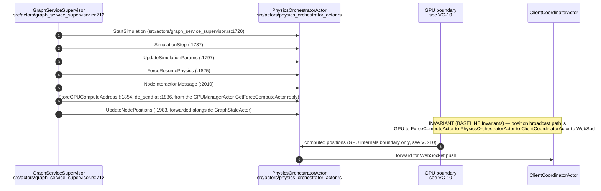

## VC-02.15 SemanticProcessorActor and OptimizedSettingsActor — message surfaces
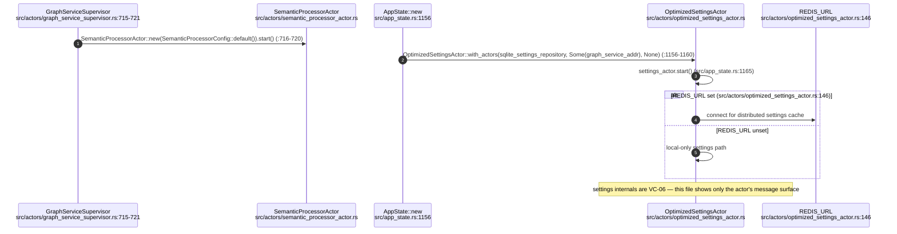

## VC-02.18 ElevationActor (+ elevation_voice.rs) and DecisionElevationActor
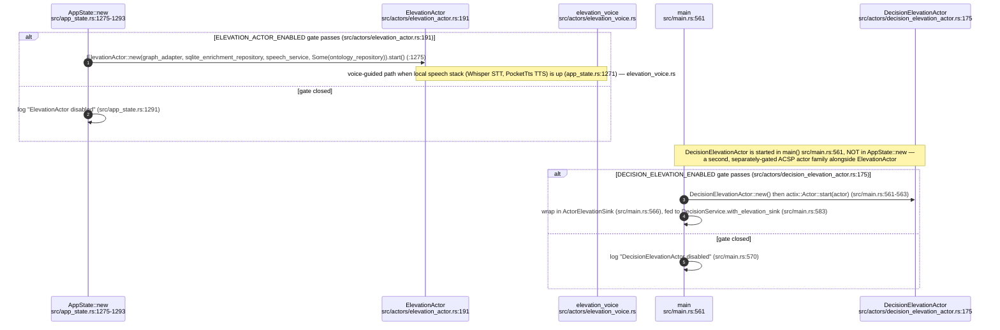

## VC-02.19 VoiceInterfaceActor (+ voice_commands.rs) and MultiMcpVisualizationActor
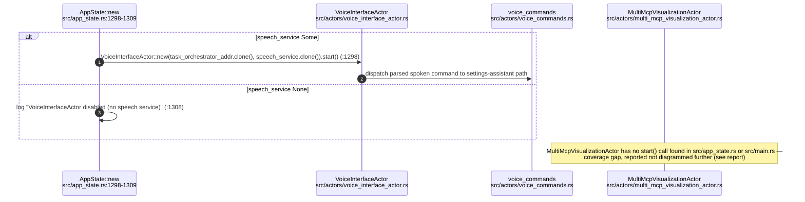

## VC-02.20 AgentMonitorActor and AgentBeamActor — message surfaces
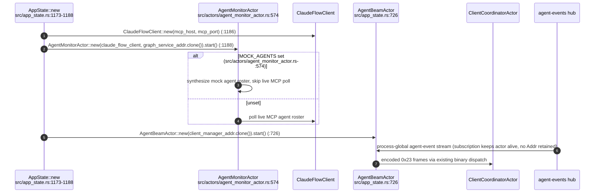
````

## DIFF

```diff
diff --git a/src/actors/elevation_actor.rs b/src/actors/elevation_actor.rs
index dde0bb79c..3e5c4bda4 100644
--- a/src/actors/elevation_actor.rs
+++ b/src/actors/elevation_actor.rs
@@ -574,6 +574,107 @@ pub fn draft_class_page(c: &FrontierCandidate) -> (String, String) {
     )
 }
 
+/// The canonical class IRI a class reference names, whatever form it is in:
+/// wikilink text (a page title such as `Vehicle Part`, or a slug), a minted
+/// `urn:ngm:class:<slug>`, or a published
+/// `https://narrativegoldmine.com/class/<slug>`. Every form goes through the
+/// mapping this actor mints draft IRIs with ([`slugify`] then
+/// `crate::uri::ngm::class_iri`, as in [`draft_class_page`]); an IRI
+/// contributes its local name through the shared normaliser
+/// [`vault_core::consistency::class_key`].
+///
+/// This is a **comparison key**, not a resolver: a title's slug is not always
+/// the slug the corpus stored (`VeChain` slugifies to `vechain`, the page is
+/// `urn:ngm:class:ve-chain`). Draft text is resolved against the base first,
+/// by [`BaseClassIndex::resolve`].
+fn class_ref_iri(reference: &str) -> String {
+    let r = reference.trim();
+    let local = if r.contains("://") || r.starts_with("urn:") {
+        vault_core::consistency::class_key(r)
+    } else {
+        r.to_string()
+    };
+    crate::uri::ngm::class_iri(&slugify(&local))
+}
+
+/// The base repository's classes, indexed by every name a draft wikilink can
+/// use for one (ADR-2125): its page file stem (a wikilink's own target), its
+/// `rdfs:label` and preferred term (the page title), all case-insensitively
+/// as the ingest's `project_ontology` matches them, and its stored IRI's
+/// local name ([`vault_core::consistency::class_key`]).
+///
+/// Minting a title with [`slugify`] does not reproduce the stored resource for
+/// 430 of 9,380 real classes (`VeChain` → `vechain`, stored `ve-chain`;
+/// `FigJam` → `figjam`, stored `fig-jam`), so a draft naming them would reason
+/// about a fresh, parentless class instead of the real one, and the sibling
+/// rule would see no parents. Resolving against the base fixes both.
+#[derive(Debug, Default)]
+struct BaseClassIndex {
+    /// Lower-cased page file stem → stored IRI. Outranks a title: two pages
+    /// may share a title (`Cryptographic Primitive.md` and
+    /// `bc-cryptographic-primitive.md`), never a file.
+    by_stem: HashMap<String, String>,
+    /// Lower-cased label or preferred term → stored IRI.
+    by_title: HashMap<String, String>,
+    /// `class_key` of the stored IRI → stored IRI.
+    by_key: HashMap<String, String>,
+}
+
+impl BaseClassIndex {
+    /// Index `classes`. On a name two classes share within one tier, the
+    /// first wins, as in the ingest.
+    fn new(classes: &[OwlClass]) -> Self {
+        fn claim(map: &mut HashMap<String, String>, name: &str, iri: &str) {
+            let name = name.trim().to_lowercase();
+            if !name.is_empty() {
+                map.entry(name).or_insert_with(|| iri.to_string());
+            }
+        }
+        let mut index = Self::default();
+        for class in classes {
+            let iri = class.iri.trim();
+            if iri.is_empty() {
+                continue;
+            }
+            index
+                .by_key
+                .entry(vault_core::consistency::class_key(iri))
+                .or_insert_with(|| iri.to_string());
+            if let Some(stem) = class
+                .source_file
+                .as_deref()
+                .and_then(|f| std::path::Path::new(f).file_stem())
+                .and_then(|s| s.to_str())
+            {
+                claim(&mut index.by_stem, stem, iri);
+            }
+            for title in [&class.label, &class.preferred_term].into_iter().flatten() {
+                claim(&mut index.by_title, title, iri);
+            }
+        }
+        index
+    }
+
+    /// The IRI a draft wikilink target names. An IRI is kept as written. Page
+    /// text resolves to the stored class it names — by page file stem, then
+    /// label or preferred term, then by its slug against the stored local
+    /// names — and only a name the base does not hold is minted with
+    /// [`class_ref_iri`].
+    fn resolve(&self, target: &str) -> String {
+        let t = target.trim();
+        if t.contains("://") || t.starts_with("urn:") {
+            return t.to_string();
+        }
+        let name = t.to_lowercase();
+        self.by_stem
+            .get(&name)
+            .or_else(|| self.by_title.get(&name))
+            .or_else(|| self.by_key.get(&slugify(t)))
+            .cloned()
+            .unwrap_or_else(|| class_ref_iri(t))
+    }
+}
+
 /// A minimal `owl_class` declaration for the EL++ gate (IRI only — the reasoner
 /// needs the term to exist; the rest of `OwlClass` is irrelevant to consistency).
 fn declare_class(iri: &str) -> OwlClass {
@@ -591,13 +692,33 @@ fn declare_class(iri: &str) -> OwlClass {
 /// `rdfs:subClassOf` relation (`vault validate` rejects a json-ld fence, so
 /// there is no longer a block to read), and `disjoint-with` — when a reviewer
 /// has added one by hand — becomes a `DisjointWith` axiom. Relation targets are
-/// wikilinks; the bracket text is the target IRI or page slug.
+/// wikilinks; the bracket text is the target IRI (kept as written) or a page
+/// title or slug, minted to its class IRI ([`class_ref_iri`]). The gate parses
+/// with [`parse_draft_axioms_against`] instead, which resolves page text to
+/// the class the base repository stores first.
+///
+/// `disjoint-with` is held to the sibling-only rule `vault validate` applies
+/// (ADR-2125, [`vault_core::consistency::check_disjoint_pair`]). Parsing cannot
+/// apply it alone, because a target's parents live in the base ontology, so
+/// [`run_consistency_gate`] applies it via [`check_draft_disjointness`] before
+/// it reasons.
 ///
 /// Axiom targets are also *declared* as classes so the reasoner can resolve
 /// them. A page with no frontmatter, a non-`Class` `type`, or no `resource`
 /// yields empty vecs — the caller treats "nothing drafted to check" honestly
 /// (a draft with no relations is trivially consistent against the base).
 pub fn parse_draft_axioms(draft: &str) -> (Vec<OwlClass>, Vec<OwlAxiom>) {
+    parse_draft_axioms_against(draft, &BaseClassIndex::default())
+}
+
+/// [`parse_draft_axioms`], with every wikilink target resolved against the
+/// base repository's classes ([`BaseClassIndex::resolve`]), so the axioms
+/// name the stored IRI and the reasoner and the sibling rule see the real
+/// class.
+fn parse_draft_axioms_against(
+    draft: &str,
+    base: &BaseClassIndex,
+) -> (Vec<OwlClass>, Vec<OwlAxiom>) {
     let meta = visionclaw_domain::vault::parse(draft);
     if meta.page_type.as_deref() != Some("Class") {
         return (Vec::new(), Vec::new());
@@ -643,6 +764,7 @@ pub fn parse_draft_axioms(draft: &str) -> (Vec<OwlClass>, Vec<OwlAxiom>) {
                             .to_string()
                     })
                     .filter(|s| !s.is_empty())
+                    .map(|s| base.resolve(&s))
                     .collect()
             })
             .unwrap_or_default()
@@ -659,16 +781,76 @@ pub fn parse_draft_axioms(draft: &str) -> (Vec<OwlClass>, Vec<OwlAxiom>) {
     (classes, axioms)
 }
 
+/// ADR-2125 item 1 on the elevation path: every `DisjointWith` axiom the draft
+/// declares must pair two **siblings** — classes sharing a direct
+/// `SubClassOf` parent across the base and the draft — and neither member may
+/// be a domain root or taxonomy category. The rule is
+/// [`vault_core::consistency::check_disjoint_pair`], the one `vault validate`
+/// runs as `DISJOINT_NOT_SIBLINGS`, so the two write paths cannot diverge.
+/// Disjointness the base already holds is not re-judged here.
+fn check_draft_disjointness(
+    base_axioms: &[OwlAxiom],
+    draft_axioms: &[OwlAxiom],
+) -> Result<(), String> {
+    // Subjects compare through one slug→IRI mapping (`class_ref_iri`): the
+    // base may store a class as a published IRI while the draft names it by
+    // wikilink title or slug. Parents keep their written form; the sibling
+    // rule compares them by `class_key`.
+    let mut parents_by_class: HashMap<String, Vec<String>> = HashMap::new();
+    for a in base_axioms.iter().chain(draft_axioms) {
+        if a.axiom_type == AxiomType::SubClassOf {
+            parents_by_class
+                .entry(class_ref_iri(&a.subject))
+                .or_default()
+                .push(a.object.clone());
+        }
+    }
+    let parents_of = |class: &str| -> Vec<String> {
+        parents_by_class
+            .get(&class_ref_iri(class))
+            .cloned()
+            .unwrap_or_default()
+    };
+    let refusals: Vec<String> = draft_axioms
+        .iter()
+        .filter(|a| a.axiom_type == AxiomType::DisjointWith)
+        .filter_map(|a| {
+            vault_core::consistency::check_disjoint_pair(
+                &a.subject,
+                &parents_of(&a.subject),
+                &a.object,
+                &parents_of(&a.object),
+            )
+            .err()
+            .map(|b| b.to_string())
+        })
+        .collect();
+    if refusals.is_empty() {
+        Ok(())
+    } else {
+        Err(refusals.join("; "))
+    }
+}
+
 /// The GOV-7 EL++ consistency gate: `Ok(())` to proceed to the PR, `Err(reason)`
 /// to BLOCK the approval. Canon (no advisory write path): a `None` base source
-/// means the gate is UNAVAILABLE and fails CLOSED. Otherwise the base ontology
-/// (classes + axioms) is loaded and combined with the drafted class + axioms,
-/// and whelk checks the union — an inconsistency (a class subsumed under
-/// owl:Nothing) blocks with the explanation as the reason.
+/// means the gate is UNAVAILABLE and fails CLOSED. Otherwise:
+///
+/// 0. the draft is parsed against the base's classes, so a wikilink title
+///    names the stored IRI ([`BaseClassIndex`]);
+/// 1. the draft's own `disjoint-with` is held to the sibling-only rule
+///    ([`check_draft_disjointness`], `[DISJOINT_NOT_SIBLINGS]`);
+/// 2. the base ontology (classes + axioms) is combined with the drafted class
+///    + axioms and whelk checks the union;
+/// 3. an inconsistency blocks **only on the classes the draft makes
+///    unsatisfiable** (ADR-2125 item 5, delta-scoped like the conflict gate),
+///    each reported as `[WHELK_INCONSISTENT] <class> is subsumed by
+///    owl:Nothing` — the blocker `vault propose` reports
+///    ([`vault_core::consistency::whelk_inconsistent`]). Classes already
+///    unsatisfiable in the base are logged, not blamed on the draft.
 async fn run_consistency_gate(
     base_src: Option<Arc<dyn OntologyRepository>>,
-    draft_classes: &[OwlClass],
-    draft_axioms: &[OwlAxiom],
+    draft: &str,
 ) -> Result<(), String> {
     let Some(repo) = base_src else {
         return Err(
@@ -685,17 +867,46 @@ async fn run_consistency_gate(
         Vec::new()
     });
 
-    let mut classes = base_classes;
-    classes.extend_from_slice(draft_classes);
-    let mut axioms = base_axioms;
-    axioms.extend_from_slice(draft_axioms);
+    // Draft wikilinks name the classes the base stores, not fresh slugs.
+    let (draft_classes, draft_axioms) =
+        parse_draft_axioms_against(draft, &BaseClassIndex::new(&base_classes));
+
+    check_draft_disjointness(&base_axioms, &draft_axioms)?;
+
+    let mut classes = base_classes.clone();
+    classes.extend(draft_classes);
+    let mut axioms = base_axioms.clone();
+    axioms.extend(draft_axioms);
 
     let outcome = WhelkInferenceEngine::check_axiom_set(&classes, &axioms);
     if outcome.consistent {
-        Ok(())
-    } else {
-        Err(outcome.explanation())
+        return Ok(());
     }
+    let before = WhelkInferenceEngine::check_axiom_set(&base_classes, &base_axioms);
+    let (introduced, preexisting): (Vec<&String>, Vec<&String>) = outcome
+        .unsatisfiable_classes
+        .iter()
+        .partition(|c| !before.unsatisfiable_classes.contains(c));
+    if !preexisting.is_empty() {
+        warn!(
+            "[Elevation] consistency gate: {} class(es) were already unsatisfiable in the base \
+             and are not blamed on this draft: {}",
+            preexisting.len(),
+            preexisting
+                .iter()
+                .map(|c| c.as_str())
+                .collect::<Vec<_>>()
+                .join(", ")
+        );
+    }
+    if introduced.is_empty() {
+        return Ok(());
+    }
+    Err(introduced
+        .iter()
+        .map(|c| vault_core::consistency::whelk_inconsistent(c).to_string())
+        .collect::<Vec<_>>()
+        .join("; "))
 }
 
 /// GOV-2: map a terminal PR git state to `(31404 status, store status)`.
@@ -1265,7 +1476,6 @@ impl ElevationActor {
     fn approve_with_gate(&mut self, ctx: &mut Context<Self>, d: CaseDecision, case: PendingCase) {
         let base_src = self.consistency_base.clone();
         let repo = self.enrichment_repo.clone();
-        let (draft_classes, draft_axioms) = parse_draft_axioms(&case.draft);
         let approve_record = decision_record(&d);
         let case_id = d.case_id.clone();
         let case_id_map = case_id.clone();
@@ -1276,7 +1486,7 @@ impl ElevationActor {
 
         ctx.spawn(
             actix::fut::wrap_future::<_, Self>(async move {
-                match run_consistency_gate(base_src, &draft_classes, &draft_axioms).await {
+                match run_consistency_gate(base_src, &draft).await {
                     Err(reason) => {
                         warn!(
                             "[Elevation] GOV-7 consistency gate BLOCKED approval of {case_id}: {reason}"
@@ -1954,12 +2164,372 @@ mod tests {
     /// the approval (returns Err) rather than passing it through advisorily.
     #[tokio::test]
     async fn gate_unavailable_fails_closed() {
-        let (dc, da) = parse_draft_axioms(&draft_with(&[], &[]));
-        let res = run_consistency_gate(None, &dc, &da).await;
+        let draft = &draft_with(&[], &[]);
+        let res = run_consistency_gate(None, draft).await;
         assert!(res.is_err(), "None source must fail closed");
         assert!(res.unwrap_err().contains("unavailable"));
     }
 
+    // ── ADR-2125 item 3: the probe through the real gate, not check_axiom_set ──
+
+    /// A base repository holding siblings `A`, `B` under `Parent`, optionally
+    /// declared disjoint — the fixture `run_consistency_gate` loads.
+    async fn probe_base(disjoint: bool) -> Arc<dyn OntologyRepository> {
+        let class = |iri: &str| OwlClass {
+            iri: iri.into(),
+            ..Default::default()
+        };
+        let axiom = |axiom_type: AxiomType, subject: &str, object: &str| OwlAxiom {
+            id: None,
+            axiom_type,
+            subject: subject.into(),
+            object: object.into(),
+            annotations: HashMap::new(),
+        };
+        let mut axioms = vec![
+            axiom(AxiomType::SubClassOf, "urn:test:A", "urn:test:Parent"),
+            axiom(AxiomType::SubClassOf, "urn:test:B", "urn:test:Parent"),
+        ];
+        if disjoint {
+            axioms.push(axiom(AxiomType::DisjointWith, "urn:test:A", "urn:test:B"));
+        }
+        let repo = crate::test_helpers::MockOntologyRepository::new();
+        repo.save_ontology(
+            &[
+                class("urn:test:Parent"),
+                class("urn:test:A"),
+                class("urn:test:B"),
+            ],
+            &[],
+            &axioms,
+        )
+        .await
+        .expect("the mock repository accepts the base");
+        Arc::new(repo)
+    }
+
+    /// `P ⊑ A`, `P ⊑ B`, `A disjoint-with B` through `run_consistency_gate`
+    /// must block with the `WHELK_INCONSISTENT` code naming P — the same code
+    /// `vault propose` reports (ADR-2125 item 2). A probe that passes cleanly
+    /// fails CI.
+    #[tokio::test]
+    async fn probe_gate_reports_whelk_inconsistent_for_disjoint_parents() {
+        let base = probe_base(true).await;
+        let draft = &draft_with(&["urn:test:A", "urn:test:B"], &[]);
+        let err = run_consistency_gate(Some(base), draft)
+            .await
+            .expect_err("P ⊑ A, P ⊑ B, A disjoint-with B must block");
+        assert!(
+            err.contains("WHELK_INCONSISTENT"),
+            "the gate must carry the WHELK_INCONSISTENT code: {err}"
+        );
+        assert!(
+            err.contains("urn:ngm:class:test"),
+            "the blocker must name the unsatisfiable class: {err}"
+        );
+    }
+
+    /// The control: the same draft against the same base without the
+    /// disjointness passes the gate.
+    #[tokio::test]
+    async fn probe_control_gate_passes_without_disjointness() {
+        let base = probe_base(false).await;
+        let draft = &draft_with(&["urn:test:A", "urn:test:B"], &[]);
+        let res = run_consistency_gate(Some(base), draft).await;
+        assert!(res.is_ok(), "no disjointness ⇒ consistent: {res:?}");
+    }
+
+    /// ADR-2125 item 1 on this path: a draft declaring `disjoint-with` against
+    /// a class it shares no direct parent with is refused before reasoning,
+    /// with the code `vault validate` uses.
+    #[tokio::test]
+    async fn gate_refuses_a_non_sibling_disjointness_in_the_draft() {
+        let base = probe_base(false).await;
+        // test ⊑ A; B is under Parent, not A, so test and B are not siblings.
+        let draft = &draft_with(&["urn:test:A"], &["urn:test:B"]);
+        let err = run_consistency_gate(Some(base), draft)
+            .await
+            .expect_err("non-siblings must be refused");
+        assert!(err.contains("DISJOINT_NOT_SIBLINGS"), "{err}");
+    }
+
+    /// A sibling disjointness in the draft (test and B both under Parent) is
+    /// admitted, and consistent.
+    #[tokio::test]
+    async fn gate_admits_a_sibling_disjointness_in_the_draft() {
+        let base = probe_base(false).await;
+        let draft = &draft_with(&["urn:test:Parent"], &["urn:test:B"]);
+        let res = run_consistency_gate(Some(base), draft).await;
+        assert!(res.is_ok(), "siblings under Parent: {res:?}");
+    }
+
+    /// Domain roots and taxonomy categories are never disjointness members,
+    /// even when they would be siblings.
+    #[tokio::test]
+    async fn gate_refuses_disjointness_with_a_domain_root() {
+        let base = probe_base(false).await;
+        let draft = &draft_with(&["urn:test:Parent"], &["urn:ngm:class:robotics"]);
+        let err = run_consistency_gate(Some(base), draft)
+            .await
+            .expect_err("a domain root is never a disjointness member");
+        assert!(err.contains("DISJOINT_NOT_SIBLINGS"), "{err}");
+        assert!(err.contains("domain root or taxonomy category"), "{err}");
+    }
+
+    /// A base storing full class IRIs (published or `urn:ngm:class:` form)
+    /// and a draft naming the same classes by wikilink title or slug: the
+    /// sibling rule must see the target's parents through one slug→IRI
+    /// mapping, not by exact string equality.
+    fn iri_base(parent_of_b: &str) -> Vec<OwlAxiom> {
+        let axiom = |axiom_type: AxiomType, subject: &str, object: &str| OwlAxiom {
+            id: None,
+            axiom_type,
+            subject: subject.into(),
+            object: object.into(),
+            annotations: HashMap::new(),
+        };
+        vec![
+            axiom(
+                AxiomType::SubClassOf,
+                "https://narrativegoldmine.com/class/wheel-hub",
+                "https://narrativegoldmine.com/class/vehicle-part",
+            ),
+            axiom(
+                AxiomType::SubClassOf,
+                "urn:ngm:class:brake-disc",
+                parent_of_b,
+            ),
+        ]
+    }
+
+    #[test]
+    fn sibling_rule_resolves_wikilink_titles_against_a_base_storing_iris() {
+        // Draft: is-a [[Vehicle Part]], disjoint-with [[Wheel Hub]] and
+        // [[brake-disc]]; all three are siblings under vehicle-part.
+        let base = iri_base("https://narrativegoldmine.com/class/vehicle-part");
+        let (_, da) =
+            parse_draft_axioms(&draft_with(&["Vehicle Part"], &["Wheel Hub", "brake-disc"]));
+        assert_eq!(
+            check_draft_disjointness(&base, &da),
+            Ok(()),
+            "siblings named by title must be recognised as siblings"
+        );
+    }
+
+    #[test]
+    fn sibling_rule_still_refuses_non_siblings_named_by_title() {
+        // brake-disc sits under a different parent: not a sibling.
+        let base = iri_base("urn:ngm:class:friction-component");
+        let (_, da) = parse_draft_axioms(&draft_with(&["Vehicle Part"], &["Brake Disc"]));
+        let err = check_draft_disjointness(&base, &da).expect_err("not siblings");
+        assert!(err.contains("DISJOINT_NOT_SIBLINGS"), "{err}");
+    }
+
+    #[test]
+    fn draft_wikilink_titles_become_class_iris() {
+        let (classes, axioms) = parse_draft_axioms(&draft_with(&["Vehicle Part"], &["Wheel Hub"]));
+        assert_eq!(axioms[0].object, "urn:ngm:class:vehicle-part");
+        assert_eq!(axioms[1].object, "urn:ngm:class:wheel-hub");
+        assert!(classes.iter().any(|c| c.iri == "urn:ngm:class:wheel-hub"));
+        // An IRI target is kept as written.
+        let (_, axioms) = parse_draft_axioms(&draft_with(
+            &["https://narrativegoldmine.com/class/vehicle-part"],
+            &[],
+        ));
+        assert_eq!(
+            axioms[0].object,
+            "https://narrativegoldmine.com/class/vehicle-part"
+        );
+    }
+
+    // ── ADR-2125: draft titles resolve against the base's stored classes ────
+
+    /// A base class as the ingest stores it: label and preferred term are
+    /// the page title, `source_file` the page path, `iri` the `resource`.
+    fn stored(iri: &str, title: &str) -> OwlClass {
+        OwlClass {
+            iri: iri.into(),
+            label: Some(title.into()),
+            preferred_term: Some(title.into()),
+            source_file: Some(format!("knowledge/pages/{title}.md")),
+            ..Default::default()
+        }
+    }
+
+    #[test]
+    fn titles_whose_slug_differs_from_the_stored_resource_resolve_to_it() {
+        // Two of the 430 real classes `slugify(title)` does not reproduce.
+        assert_eq!(slugify("VeChain"), "vechain");
+        let index = BaseClassIndex::new(&[
+            stored("urn:ngm:class:ve-chain", "VeChain"),
+            stored("urn:ngm:class:fig-jam", "FigJam"),
+            OwlClass {
+                iri: "urn:ngm:class:l2-rollup".into(),
+                source_file: Some("knowledge/pages/Layer2 Rollup.md".into()),
+                ..Default::default()
+            },
+        ]);
+        assert_eq!(index.resolve("VeChain"), "urn:ngm:class:ve-chain");
+        assert_eq!(
+            index.resolve("vechain"),
+            "urn:ngm:class:ve-chain",
+            "case-insensitive"
+        );
+        assert_eq!(index.resolve("FigJam"), "urn:ngm:class:fig-jam");
+        assert_eq!(index.resolve("fig-jam"), "urn:ngm:class:fig-jam", "by slug");
+        assert_eq!(
+            index.resolve("Layer2 Rollup"),
+            "urn:ngm:class:l2-rollup",
+            "by file stem"
+        );
+        // A shared title: the page whose *file* is named so wins, whatever
+        // the order; the other is reached by its own file stem.
+        let shared = BaseClassIndex::new(&[
+            OwlClass {
+                source_file: Some("knowledge/pages/bc-cryptographic-primitive.md".into()),
+                ..stored(
+                    "urn:ngm:class:bc-cryptographic-primitive",
+                    "Cryptographic Primitive",
+                )
+            },
+            stored(
+                "urn:ngm:class:cryptographic-primitive",
+                "Cryptographic Primitive",
+            ),
+        ]);
+        assert_eq!(
+            shared.resolve("Cryptographic Primitive"),
+            "urn:ngm:class:cryptographic-primitive"
+        );
+        assert_eq!(
+            shared.resolve("bc-cryptographic-primitive"),
+            "urn:ngm:class:bc-cryptographic-primitive"
+        );
+        // A name the base does not hold is minted as before; an IRI is kept.
+        assert_eq!(
+            index.resolve("Brand New Thing"),
+            "urn:ngm:class:brand-new-thing"
+        );
+        assert_eq!(
+            index.resolve("urn:ngm:class:VeChain"),
+            "urn:ngm:class:VeChain"
+        );
+        // The draft's axioms name the stored IRI.
+        let (classes, axioms) =
+            parse_draft_axioms_against(&draft_with(&["VeChain"], &["FigJam"]), &index);
+        assert_eq!(axioms[0].object, "urn:ngm:class:ve-chain");
+        assert_eq!(axioms[1].object, "urn:ngm:class:fig-jam");
+        assert!(classes.iter().all(|c| c.iri != "urn:ngm:class:vechain"));
+    }
+
+    async fn vechain_base(extra: &[OwlAxiom]) -> Arc<dyn OntologyRepository> {
+        let repo = crate::test_helpers::MockOntologyRepository::new();
+        let axiom = |axiom_type: AxiomType, subject: &str, object: &str| OwlAxiom {
+            id: None,
+            axiom_type,
+            subject: subject.into(),
+            object: object.into(),
+            annotations: HashMap::new(),
+        };
+        let mut axioms = vec![
+            axiom(
+                AxiomType::SubClassOf,
+                "urn:ngm:class:ve-chain",
+                "urn:ngm:class:ledger",
+            ),
+            axiom(
+                AxiomType::SubClassOf,
+                "urn:ngm:class:fig-jam",
+                "urn:ngm:class:ledger",
+            ),
+        ];
+        axioms.extend_from_slice(extra);
+        repo.save_ontology(
+            &[
+                stored("urn:ngm:class:ve-chain", "VeChain"),
+                stored("urn:ngm:class:fig-jam", "FigJam"),
+                stored("urn:ngm:class:ledger", "Ledger"),
+                stored("urn:ngm:class:whiteboard", "Whiteboard"),
+            ],
+            &[],
+            &axioms,
+        )
+        .await
+        .expect("the mock repository accepts the base");
+        Arc::new(repo)
+    }
+
+    /// The sibling rule sees `VeChain`'s stored parents. Minted as
+    /// `urn:ngm:class:vechain` it had none, and a true sibling pair was
+    /// refused as `DISJOINT_NOT_SIBLINGS`.
+    #[tokio::test]
+    async fn sibling_rule_resolves_titles_whose_slug_differs_from_the_resource() {
+        let draft = &draft_with(&["Ledger"], &["VeChain"]);
+        let res = run_consistency_gate(Some(vechain_base(&[]).await), draft).await;
+        assert!(
+            res.is_ok(),
+            "the draft and VeChain are siblings under Ledger: {res:?}"
+        );
+    }
+
+    /// The Whelk axioms name the stored class too. `is-a [[VeChain]]` plus
+    /// `is-a [[Whiteboard]]`, with `Ledger` disjoint from `Whiteboard`, is
+    /// unsatisfiable — but only if `VeChain` is the stored `ve-chain ⊑ Ledger`,
+    /// not a fresh parentless `vechain`.
+    #[tokio::test]
+    async fn whelk_gate_reasons_about_the_stored_class_a_title_names() {
+        let disjoint = OwlAxiom {
+            id: None,
+            axiom_type: AxiomType::DisjointWith,
+            subject: "urn:ngm:class:ledger".into(),
+            object: "urn:ngm:class:whiteboard".into(),
+            annotations: HashMap::new(),
+        };
+        let draft = &draft_with(&["VeChain", "Whiteboard"], &[]);
+        let err = run_consistency_gate(Some(vechain_base(&[disjoint]).await), draft)
+            .await
+            .expect_err("draft ⊑ ve-chain ⊑ Ledger and ⊑ Whiteboard, disjoint");
+        assert!(err.contains("WHELK_INCONSISTENT"), "{err}");
+        assert!(err.contains("urn:ngm:class:test"), "{err}");
+    }
+
+    /// ADR-2125 item 5: delta-scoped. A base that is already inconsistent
+    /// (X ⊑ A, X ⊑ B with A, B disjoint) does not block an unrelated draft.
+    #[tokio::test]
+    async fn gate_does_not_blame_a_draft_for_preexisting_unsatisfiability() {
+        let repo = crate::test_helpers::MockOntologyRepository::new();
+        let class = |iri: &str| OwlClass {
+            iri: iri.into(),
+            ..Default::default()
+        };
+        let axiom = |axiom_type: AxiomType, subject: &str, object: &str| OwlAxiom {
+            id: None,
+            axiom_type,
+            subject: subject.into(),
+            object: object.into(),
+            annotations: HashMap::new(),
+        };
+        repo.save_ontology(
+            &[
+                class("urn:test:A"),
+                class("urn:test:B"),
+                class("urn:test:X"),
+            ],
+            &[],
+            &[
+                axiom(AxiomType::DisjointWith, "urn:test:A", "urn:test:B"),
+                axiom(AxiomType::SubClassOf, "urn:test:X", "urn:test:A"),
+                axiom(AxiomType::SubClassOf, "urn:test:X", "urn:test:B"),
+            ],
+        )
+        .await
+        .expect("the mock repository accepts the base");
+        let base: Arc<dyn OntologyRepository> = Arc::new(repo);
+        let draft = &draft_with(&["urn:test:A"], &[]);
+        let res = run_consistency_gate(Some(base), draft).await;
+        assert!(res.is_ok(), "X was unsatisfiable before the draft: {res:?}");
+    }
+
     // ── GOV-2 terminal PR-state mapping ─────────────────────────────────────
 
     #[test]
```
