# E0c judgement vc-10

You are an independent judge for a pre-registered experiment. Below are (1) a TOPIC: a Markdown file of Mermaid diagrams that document code, with `path:line` citations, where paths under `../project/` are in the VisionClaw repository and paths under `../project/agentbox/` are in the agentbox repository; and (2) a DIFF: one commit's changes in the visionclaw repository, restricted to the files the topic's `sequenceDiagram` blocks cite.

Consider only the topic's `sequenceDiagram` blocks. Answer exactly one question:

> **Does this change make any sequence diagram in this topic wrong or misleading (a call, branch condition, argument or return a diagram shows)?**

Judge only from the two texts below; do not look anything else up. Reply with a single JSON object and nothing else:

```json
{"verdict": "yes" | "no", "statements": ["<diagram id>: <the message, guard, argument or return, quoted>", ...], "line_anchors_only": true | false, "reason": "<one or two sentences>"}
```

`statements` lists every element of a sequence diagram the change makes wrong or misleading (empty when the verdict is no). `line_anchors_only` is true when the only such elements are `path:line` anchors whose cited code merely moved.

## TOPIC (docs/diagrams/visionclaw/26-solid-pod-and-jss.md)

````markdown
---
id: VC-26
title: Solid Pod integration — embedded pod, proxy, client stack
area: visionclaw
governing:
  - ../project/docs/DATA-authority-erasure.md
  - ../project/docs/IDENTITY-authority-chain.md
adrs: [ADR-2067, ADR-2068, ADR-2070, ADR-2098, ADR-2106]
sources:
  - ../project/client/src/services/api/authInterceptor.ts
  - ../project/Cargo.toml
  - ../project/docs/adr/ADR-2111-re-sequence-rgb-for-bridged-assets-and-delete-the-host-payment-store.md
  - ../project/src/main.rs
  - ../project/src/services/ontology_generation.rs
  - ../project/src/services/ontology_pull.rs
  - ../project/src/handlers/solid_proxy_handler.rs
  - ../project/src/utils/nip98.rs
  - ../project/client/src/services/SolidPodService.ts
  - ../project/client/src/services/solidPod/ldpClient.ts
  - ../project/client/src/services/solidPod/agentMemory.ts
  - ../project/client/src/services/solidPod/typeIndex.ts
  - ../project/client/src/services/solidPod/wacManager.ts
  - ../project/client/src/services/solidPod/podNotifications.ts
  - ../project/client/src/services/SolidGraphViewService.ts
  - ../project/client/src/features/ontology/services/jss/contextLoader.ts
  - ../project/client/src/features/solid/hooks/useSolidPod.ts
  - ../project/client/src/features/solid/hooks/useSolidContainer.ts
  - ../project/client/src/features/solid/hooks/useSolidResource.ts
  - ../project/client/src/features/solid/components/SolidTabContent.tsx
  - ../project/client/src/features/control-center/panels/SolidPanel.tsx
  - ../project/client/src/store/websocket/solidWebSocket.ts
  - ../project/client/src/features/ontology/services/jss/schemaParser.ts
  - ../project/client/src/features/solid/components/PodBrowser.tsx
  - ../project/client/src/features/solid/components/PodSettings.tsx
  - ../project/client/src/features/solid/components/ResourceEditor.tsx
  - ../project/src/handlers/image_gen_handler.rs
verified_commit: {visionclaw: 58f04f2eb272a2707737f2065f8241b931229e81}
---

## VC-26.1 Deployment topology — embedded pod vs feature-off stub
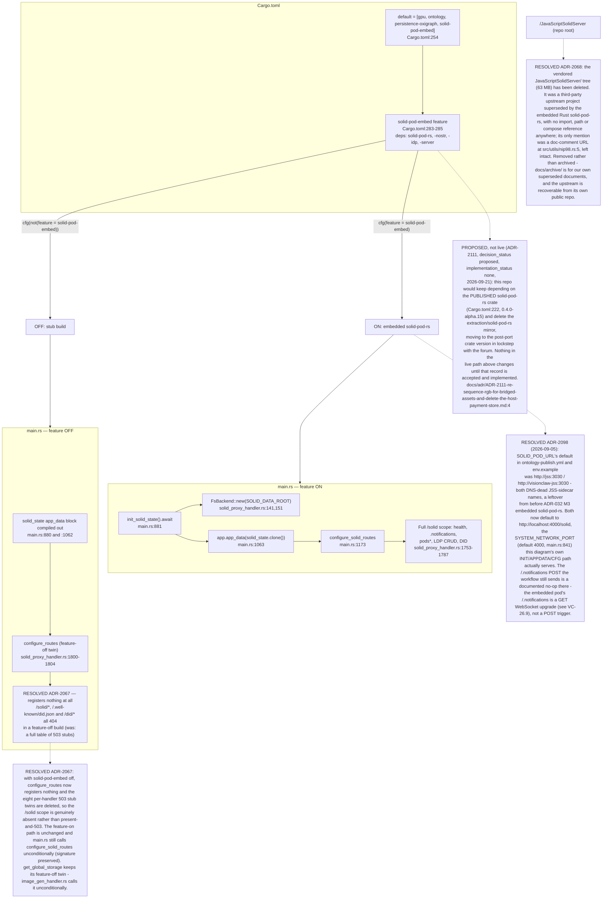

## VC-26.2 solid_proxy_handler — route dispatch, auth, WAC
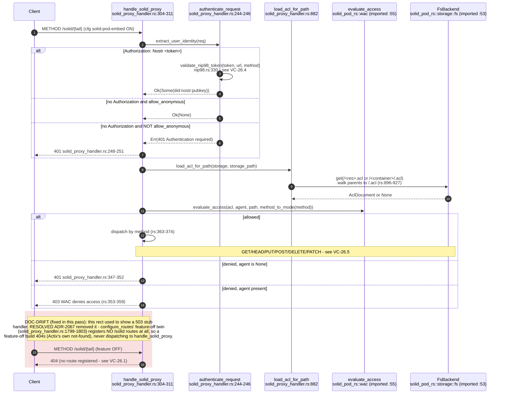

## VC-26.3 Login / pod session init — SolidPodService + useSolidPod
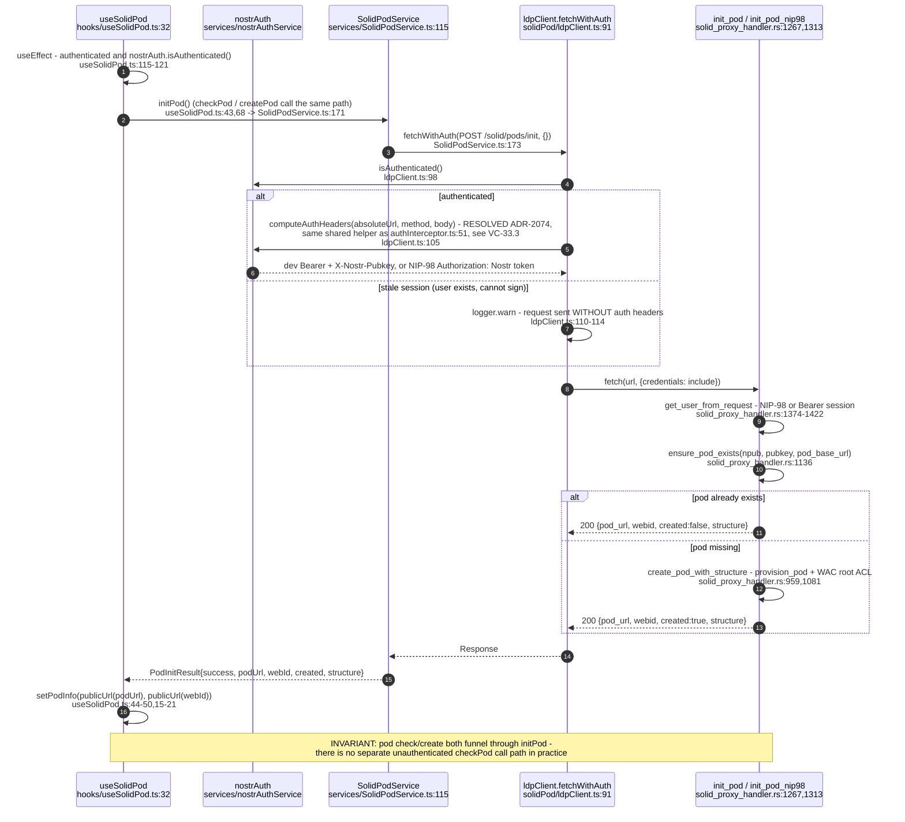

## VC-26.4 NIP-98 signed request reaching the pod — identity chain
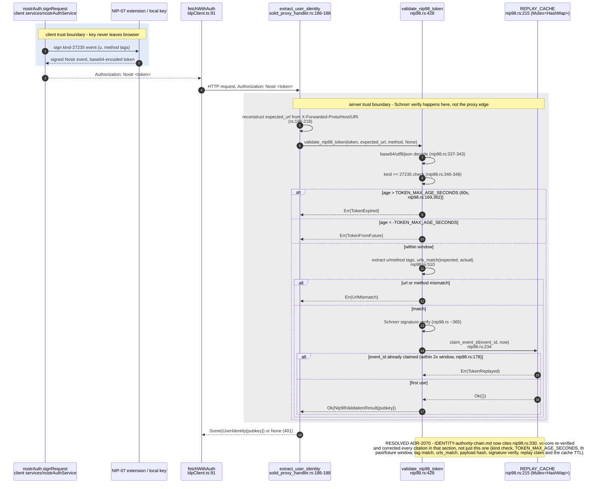

## VC-26.5 ldpClient CRUD — LDP resource operations
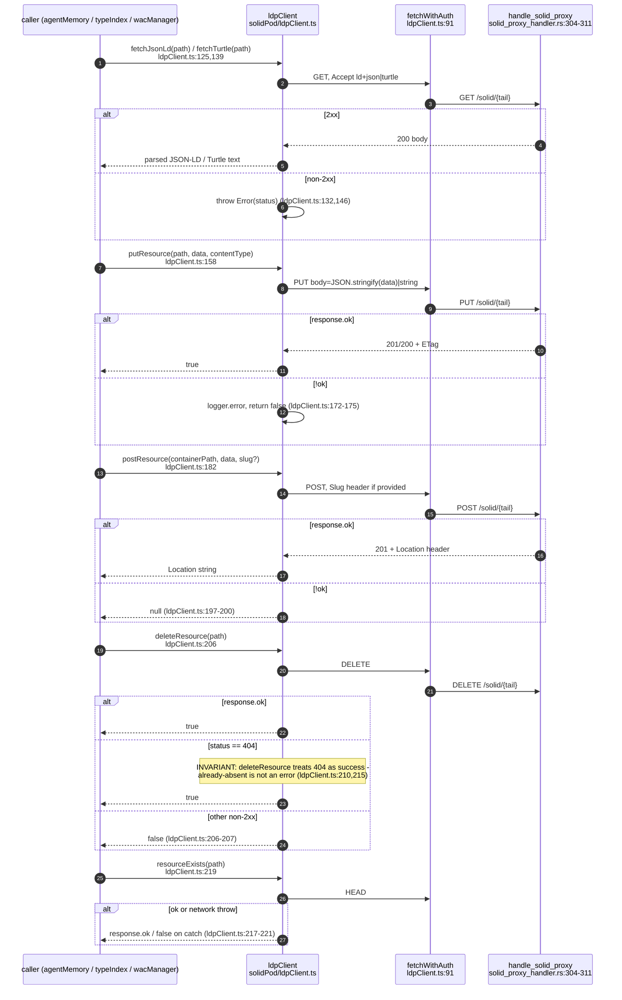

## VC-26.6 agentMemory — read / write / delete
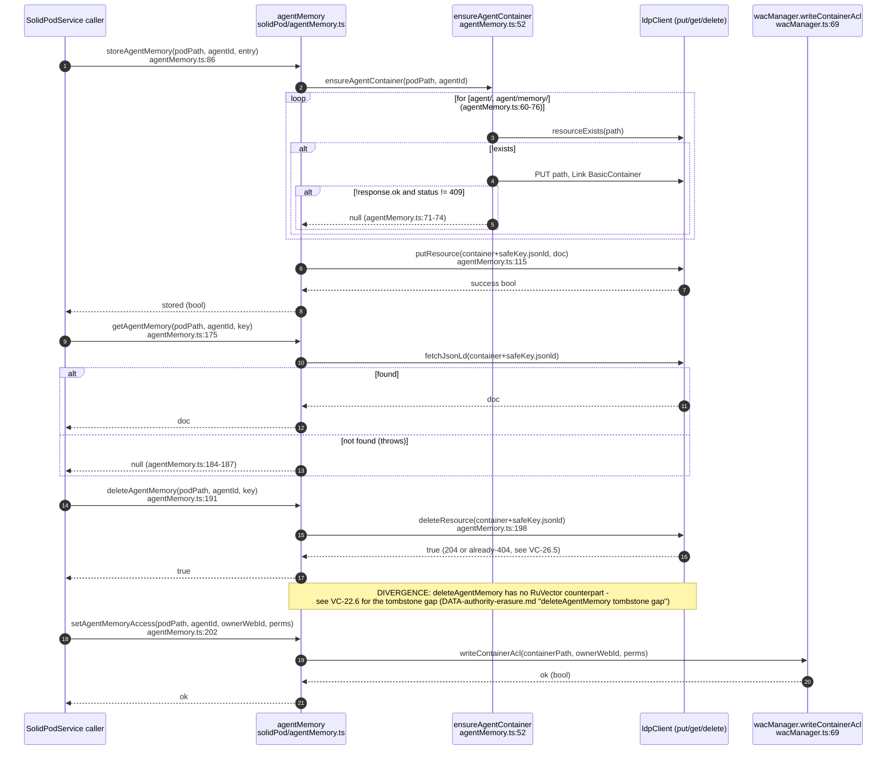

## VC-26.7 wacManager — WAC ACL write (client) and read (server)
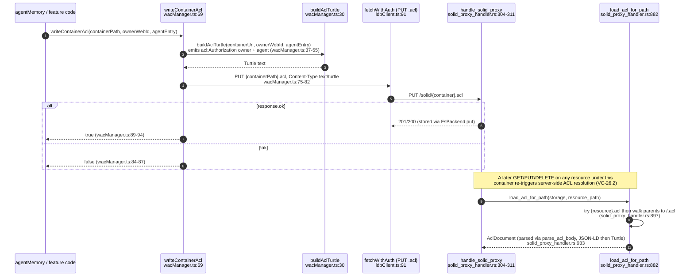

## VC-26.8 typeIndex — registration and discovery
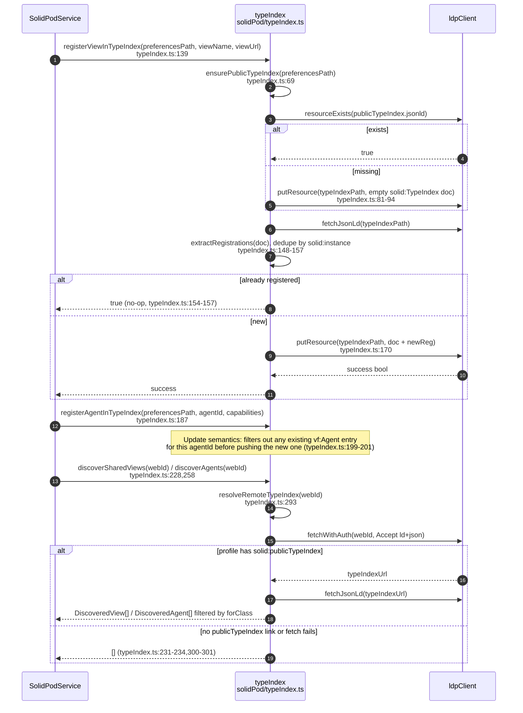

## VC-26.9 podNotifications subscription + solidWebSocket store
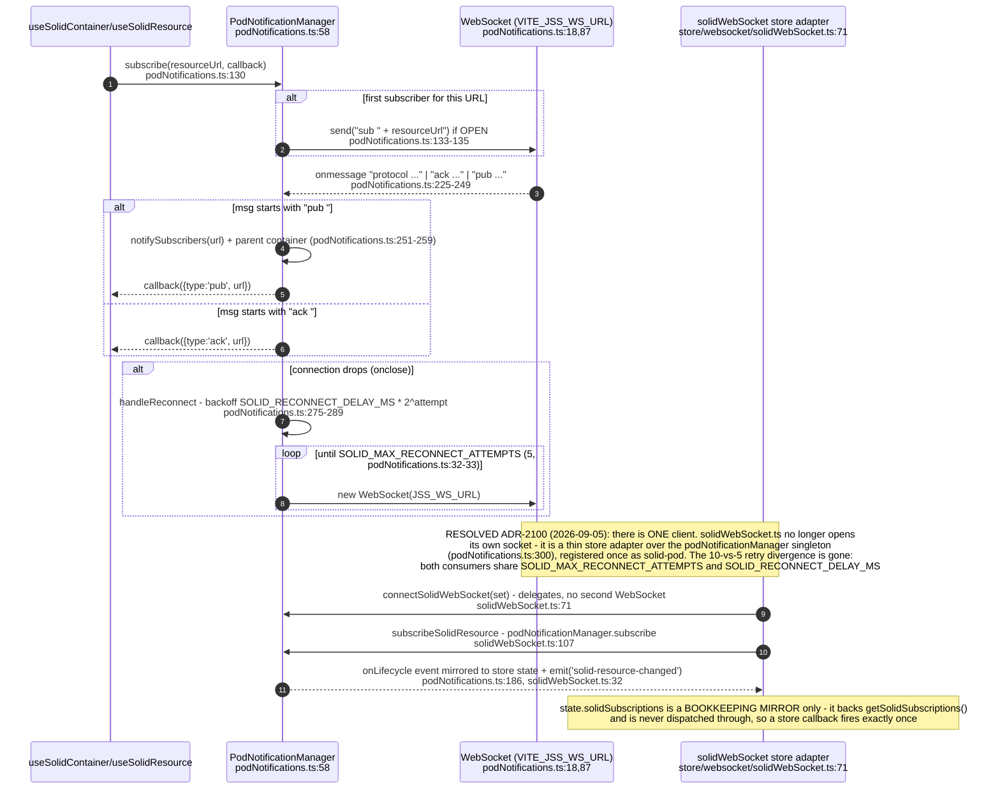

## VC-26.10 jss schemaParser — JSON-LD context load with cache
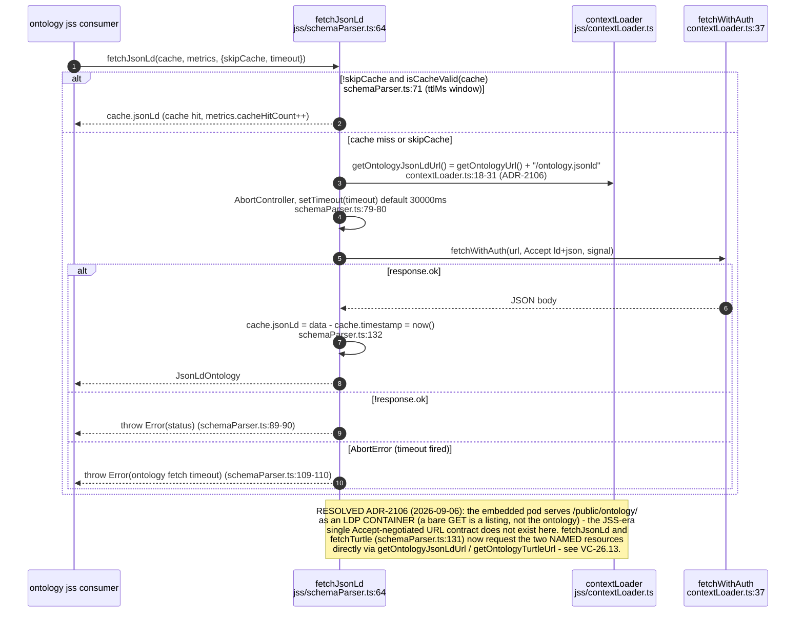

## VC-26.12 Client component/hook tree
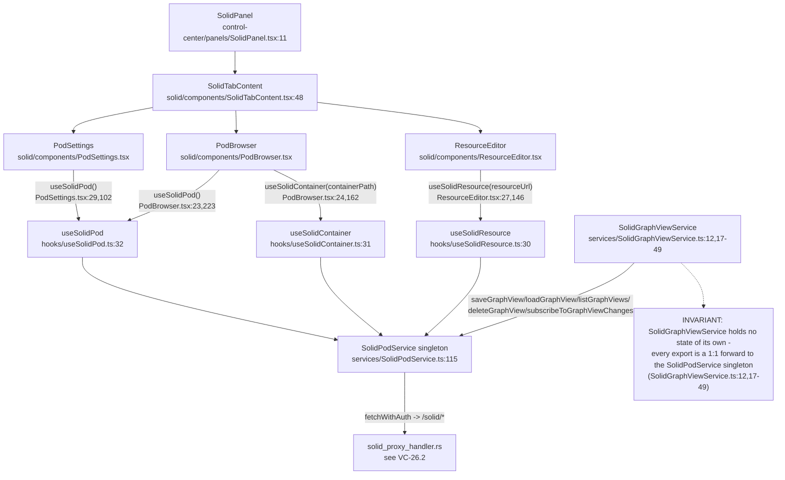

## VC-26.13 Ontology boot pull — GitHub release into the embedded pod (ADR-2106)
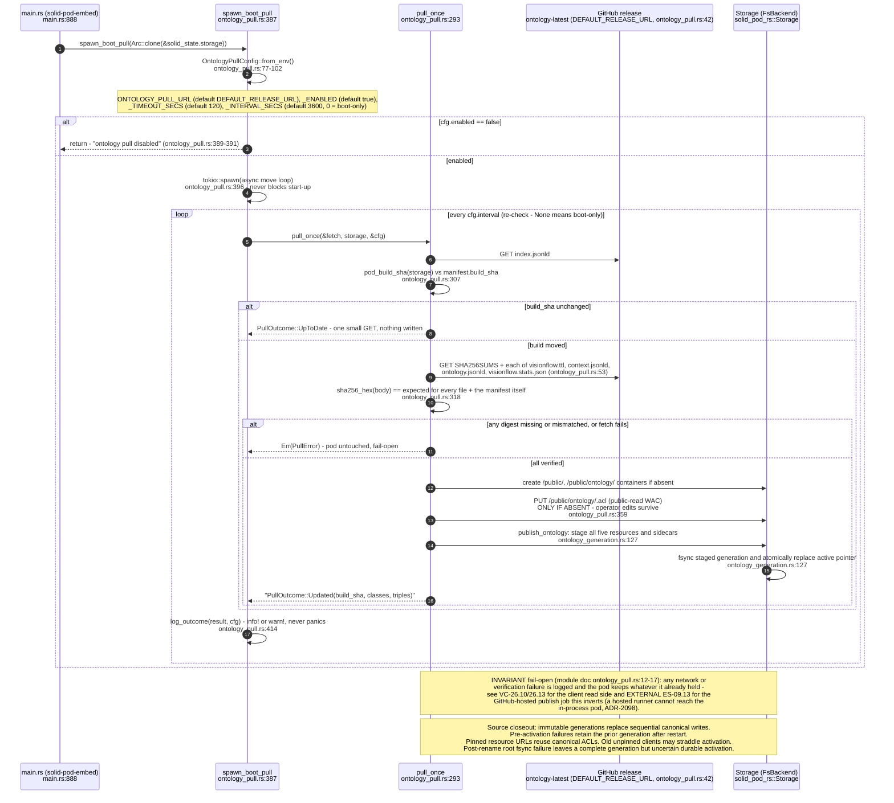

## VC-26.14 Ontology publication failure boundaries — verified bytes versus atomic visibility

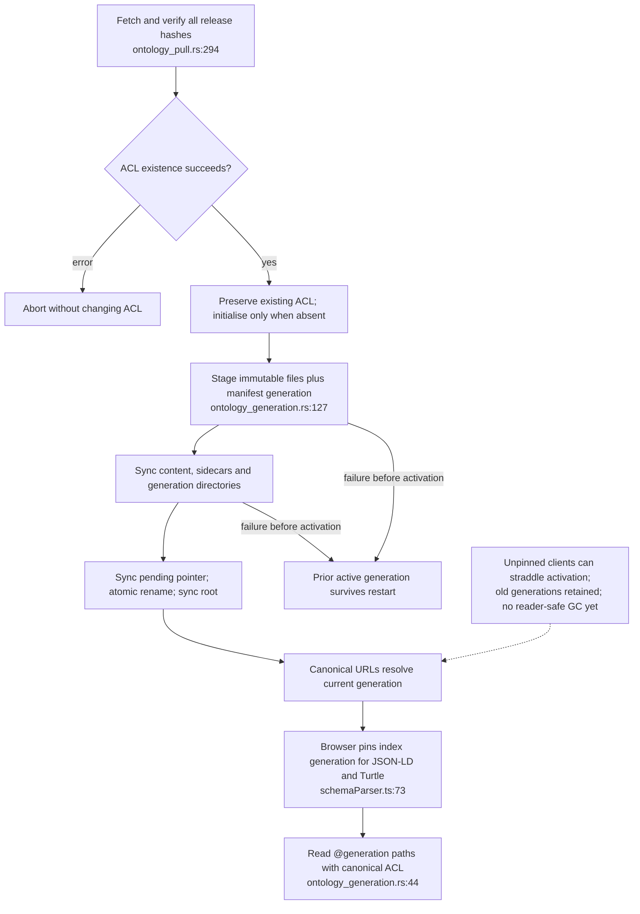
````

## DIFF

```diff
diff --git a/src/handlers/solid_proxy_handler.rs b/src/handlers/solid_proxy_handler.rs
index 9bef8a941..d630bb1d2 100644
--- a/src/handlers/solid_proxy_handler.rs
+++ b/src/handlers/solid_proxy_handler.rs
@@ -1123,6 +1123,8 @@ fn build_pod_root_acl(pubkey: &str, _pod_base: &str) -> solid_pod_rs::wac::AclDo
     AclDocument {
         context: None,
         graph: Some(vec![owner, public]),
+        // The pod root's own sidecar, not one found by walking up.
+        inherited: false,
     }
 }
 
diff --git a/src/services/ontology_pull.rs b/src/services/ontology_pull.rs
index c05a2a21c..e3eee4bb9 100644
--- a/src/services/ontology_pull.rs
+++ b/src/services/ontology_pull.rs
@@ -278,6 +278,8 @@ fn public_read_acl() -> AclDocument {
             })),
             condition: None,
         }]),
+        // The container's own sidecar, not one found by walking up.
+        inherited: false,
     }
 }
```
