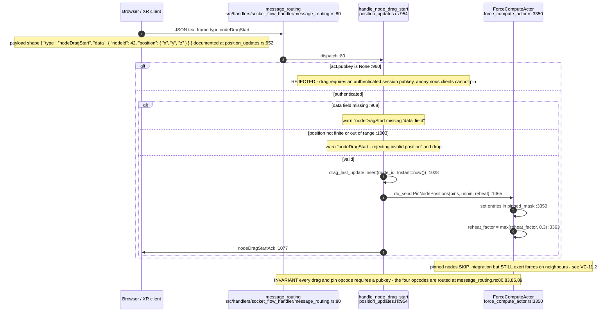
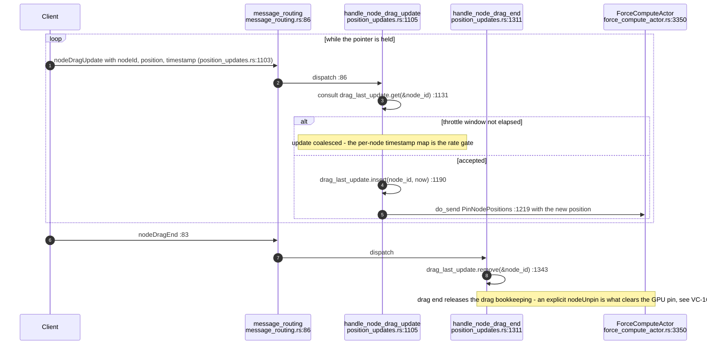
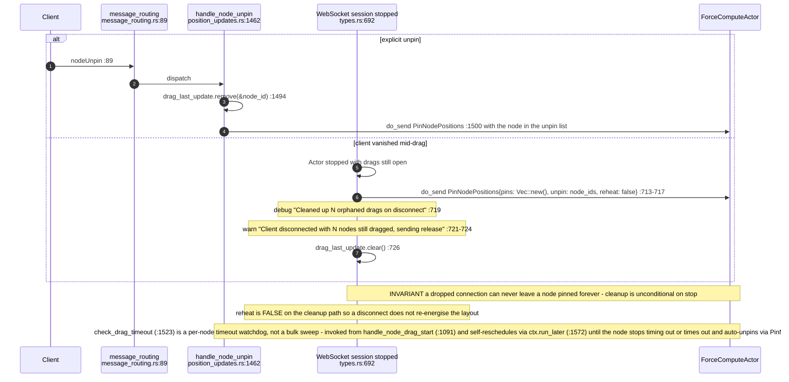
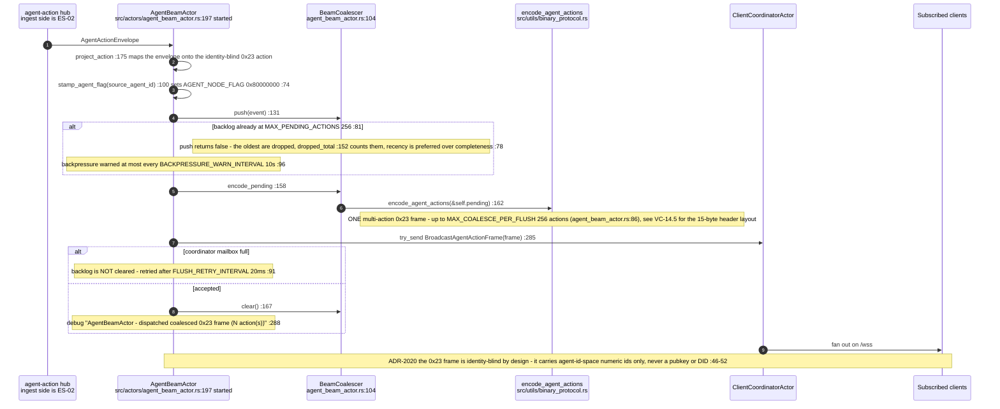
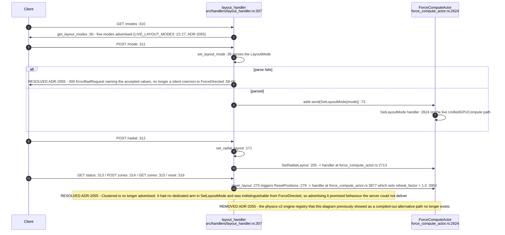
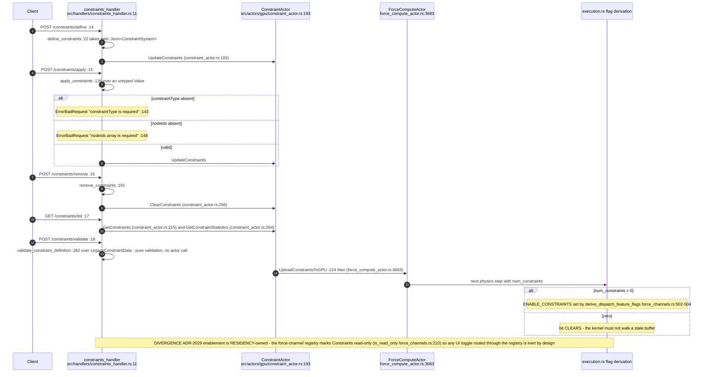
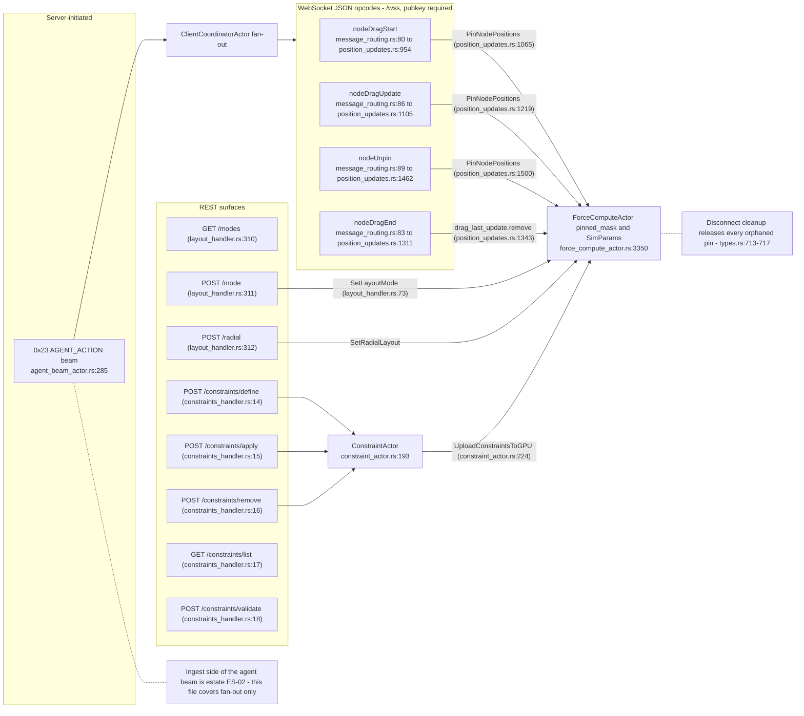
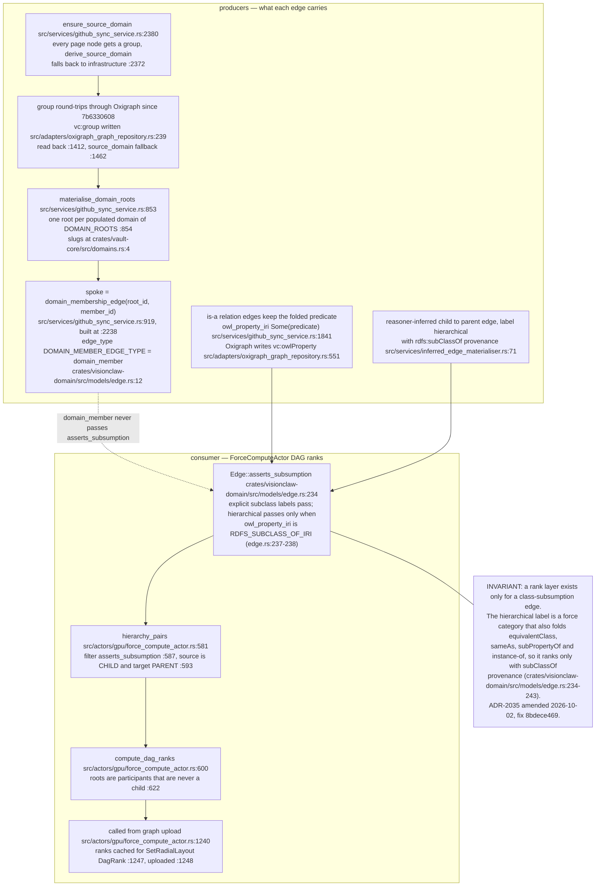

# E0c judgement vc-14

You are an independent judge for a pre-registered experiment. Below are (1) a TOPIC: a Markdown file of Mermaid diagrams that document code, with `path:line` citations, where paths under `../project/` are in the VisionClaw repository and paths under `../project/agentbox/` are in the agentbox repository; and (2) a DIFF: one commit's changes in the visionclaw repository, restricted to the files the topic's `sequenceDiagram` blocks cite.

Consider only the topic's `sequenceDiagram` blocks. Answer exactly one question:

> **Does this change make any sequence diagram in this topic wrong or misleading (a call, branch condition, argument or return a diagram shows)?**

Judge only from the two texts below; do not look anything else up. Reply with a single JSON object and nothing else:

```json
{"verdict": "yes" | "no", "statements": ["<diagram id>: <the message, guard, argument or return, quoted>", ...], "line_anchors_only": true | false, "reason": "<one or two sentences>"}
```

`statements` lists every element of a sequence diagram the change makes wrong or misleading (empty when the verdict is no). `line_anchors_only` is true when the only such elements are `path:line` anchors whose cited code merely moved.

## TOPIC (docs/diagrams/visionclaw/16-interaction-drag-pin-layout.md)

````markdown
---
id: VC-16
title: Interaction — drag, pin, layout, constraints and agent beams
area: visionclaw
governing:
  - ../project/docs/BASELINE-architecture.md
  - ../project/docs/PROTOCOL-registry.md
adrs: [ADR-2020, ADR-2029, ADR-2035, ADR-2055]
sources:
  - ../project/src/handlers/socket_flow_handler/message_routing.rs
  - ../project/src/handlers/socket_flow_handler/position_updates.rs
  - ../project/src/handlers/socket_flow_handler/types.rs
  - ../project/src/handlers/layout_handler.rs
  - ../project/src/handlers/constraints_handler.rs
  - ../project/src/actors/agent_beam_actor.rs
  - ../project/src/actors/gpu/force_compute_actor.rs
  - ../project/src/actors/gpu/constraint_actor.rs
  - ../project/src/models/force_channels.rs
  - ../project/src/utils/binary_protocol.rs
  - ../project/src/utils/unified_gpu_compute/execution.rs
  - ../project/src/services/github_sync_service.rs
  - ../project/src/adapters/oxigraph_graph_repository.rs
  - ../project/crates/vault-core/src/domains.rs
  - ../project/docs/adr/ADR-2035-dag-rank-accepts-hierarchical-label.md
  - ../project/crates/visionclaw-domain/src/models/edge.rs
  - ../project/src/services/inferred_edge_materialiser.rs
verified_commit: dd420fbc722a7a4a50e968162ac6c3eaff6972b2
---

## VC-16.1 Node drag start — pin acquisition



## VC-16.2 Drag update and drag end



## VC-16.3 Unpin and orphaned-drag cleanup on disconnect



## VC-16.4 Agent beam 0x23 fan-out



## VC-16.5 Layout mode switch over REST — post-ADR-2055



## VC-16.6 Constraint CRUD to GPU residency



## VC-16.7 Interaction surface map



## VC-16.8 DAG rank layering — subClassOf provenance, domain spokes as domain_member



**Invariant (ADR-2035, amended 2026-10-02):** the DAG ranker layers an edge only when `Edge::asserts_subsumption` holds (`crates/visionclaw-domain/src/models/edge.rs:234-243`), applied in `hierarchy_pairs` (`src/actors/gpu/force_compute_actor.rs:587`); a `hierarchical` edge counts only with `rdfs:subClassOf` in `owl_property_iri`, and domain-root spokes carry `domain_member` (`src/services/github_sync_service.rs:2238`, `crates/visionclaw-domain/src/models/edge.rs:12`). This resolves the earlier drift in which the ADR accepted the bare label on the premise that ingest never wrote membership under it, while `materialise_domain_roots` did, ranking every domain root below its own members. The amendment records the observed census: 9,796 subclass edges plus 6,400 spokes ranked together on the pre-fix binary (`docs/adr/ADR-2035-dag-rank-accepts-hierarchical-label.md:196`).

**Drift (ADR-2035 vs code):** the record's Context still says the ranker uses `is_directed_hierarchy_relation` (`docs/adr/ADR-2035-dag-rank-accepts-hierarchical-label.md:28-29`), and its Consequences still describe the accept as coupled to ingest labelling (`docs/adr/ADR-2035-dag-rank-accepts-hierarchical-label.md:61-62`). That function was deleted in 8bdece469 and replaced by `hierarchy_pairs` (`src/actors/gpu/force_compute_actor.rs:581`). The Decision section (`:37-43`) is current; the surrounding prose is not.

**Open:** the fix moves a dependency onto provenance. A producer that writes a `hierarchical` subclass edge without `rdfs:subClassOf` in `owl_property_iri`, or a store path that drops `vc:owlProperty` (`src/adapters/oxigraph_graph_repository.rs:551`), would silently stop ranking. The ADR names this as its review trigger; nothing at boot detects it.
````

## DIFF

```diff
diff --git a/src/actors/gpu/force_compute_actor.rs b/src/actors/gpu/force_compute_actor.rs
index 151e89e4f..8d7eac10d 100644
--- a/src/actors/gpu/force_compute_actor.rs
+++ b/src/actors/gpu/force_compute_actor.rs
@@ -4662,6 +4662,7 @@ mod dag_rank_tests {
         }
         for label in [
             "domain_member",
+            "chain_payment",
             "equivalent_class",
             "same_as",
             "sub_property_of",
```
