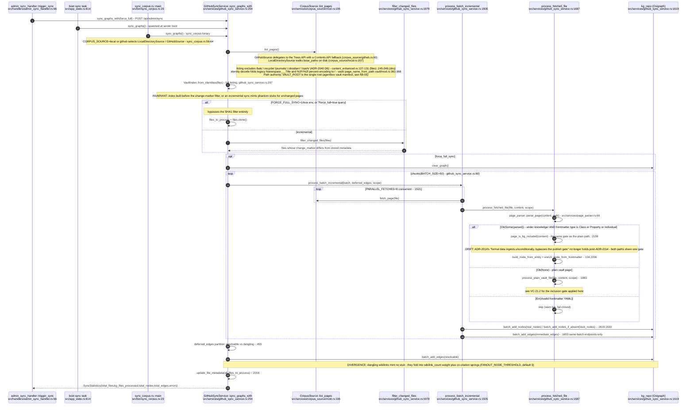
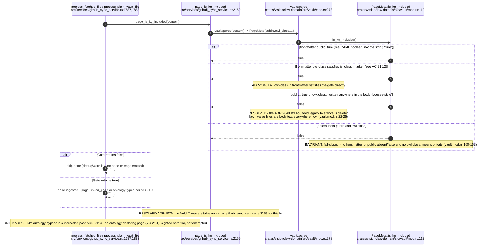
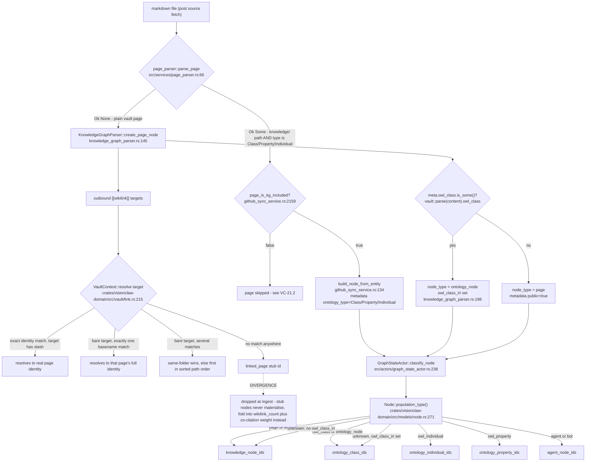
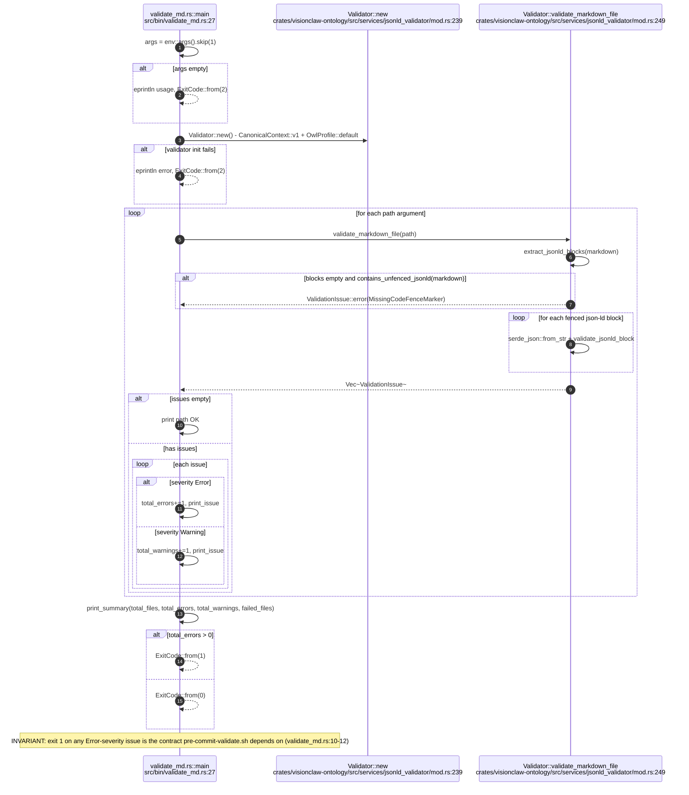
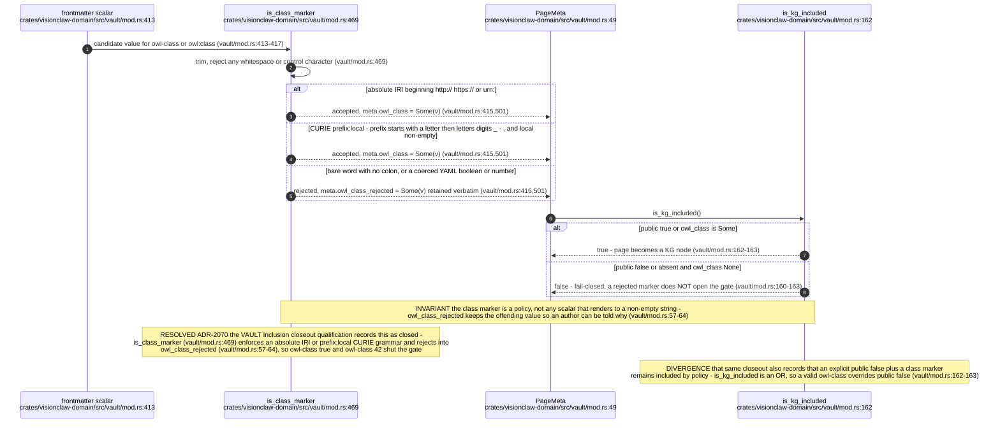

# E0c judgement vc-18

You are an independent judge for a pre-registered experiment. Below are (1) a TOPIC: a Markdown file of Mermaid diagrams that document code, with `path:line` citations, where paths under `../project/` are in the VisionClaw repository and paths under `../project/agentbox/` are in the agentbox repository; and (2) a DIFF: one commit's changes in the visionclaw repository, restricted to the files the topic's `sequenceDiagram` blocks cite.

Consider only the topic's `sequenceDiagram` blocks. Answer exactly one question:

> **Does this change make any sequence diagram in this topic wrong or misleading (a call, branch condition, argument or return a diagram shows)?**

Judge only from the two texts below; do not look anything else up. Reply with a single JSON object and nothing else:

```json
{"verdict": "yes" | "no", "statements": ["<diagram id>: <the message, guard, argument or return, quoted>", ...], "line_anchors_only": true | false, "reason": "<one or two sentences>"}
```

`statements` lists every element of a sequence diagram the change makes wrong or misleading (empty when the verdict is no). `line_anchors_only` is true when the only such elements are `path:line` anchors whose cited code merely moved.

## TOPIC (docs/diagrams/visionclaw/21-corpus-ingest-and-vault.md)

````markdown
---
id: VC-21
title: Corpus ingest (CorpusSource port, ADR-2114) and the frontmatter inclusion gate
area: visionclaw
governing:
  - ../project/docs/VAULT-corpus-format.md
  - ../project/docs/BASELINE-architecture.md
adrs: [ADR-2014, ADR-2040, ADR-2070, ADR-2112, ADR-2113, ADR-2114]
sources:
  - ../project/crates/visionclaw-ontology/src/services/jsonld_validator/mod.rs
  - ../project/src/services/github_sync_service.rs
  - ../project/src/services/github/content_enhanced.rs
  - ../project/src/services/corpus_source/mod.rs
  - ../project/src/services/corpus_source/github.rs
  - ../project/src/services/corpus_source/local.rs
  - ../project/src/services/page_parser.rs
  - ../project/src/services/parsers/knowledge_graph_parser.rs
  - ../project/src/handlers/admin_sync_handler.rs
  - ../project/src/app_state.rs
  - ../project/src/bin/sync_corpus.rs
  - ../project/src/bin/validate_md.rs
  - ../project/src/actors/graph_state_actor.rs
  - ../project/crates/visionclaw-domain/src/vault/mod.rs
  - ../project/crates/visionclaw-domain/src/vault/link.rs
  - ../project/crates/visionclaw-domain/src/models/node.rs
  - ../project/scripts/pre-commit-validate.sh
verified_commit: {visionclaw: 58f04f2eb272a2707737f2065f8241b931229e81}
---

## VC-21.1 Corpus sync entry points and the CorpusSource ingest path

<!-- 2026-09-29: rewritten for ADR-2114 - GitHubSyncService now reads through the CorpusSource port (GitHubSource / LocalDirectorySource) instead of calling the GitHub API directly, and the sync_github/sync_local binaries and local_file_sync_service.rs are gone, replaced by one sync_corpus.rs binary plus a boot task and an HTTP admin endpoint that all call the same sync_graphs(_with) -->


## VC-21.2 Frontmatter inclusion gate — one gate, both ingest paths

<!-- RESOLVED 2026-09-29: the ADR-2040 D3 legacy Logseq `key:: value` tolerance is deleted - the vault/mod.rs module doc now states such lines are body text and never the publish gate -->


## VC-21.3 Node-type derivation: file to page / linked_page / ontology-typed

<!-- 2026-09-29: the JSON-LD Page/Class fence entry is gone (ADR-2112/2113); ontology classification now reads frontmatter `type: Class|Property|Individual` under knowledge/ via page_parser::parse_page. The downstream classify/population-type path (knowledge_graph_parser.rs, graph_state_actor.rs, node.rs, vault/link.rs) is unchanged and its citations still land on the same lines -->


## VC-21.6 validate_md binary (JSON-LD validator CLI)


## VC-21.12 `owl-class` class-marker grammar — the typed inclusion half

````

## DIFF

```diff
diff --git a/src/services/github_sync_service.rs b/src/services/github_sync_service.rs
index 966cd2029..3c77417ee 100644
--- a/src/services/github_sync_service.rs
+++ b/src/services/github_sync_service.rs
@@ -574,7 +574,7 @@ impl GitHubSyncService {
             }
         }
 
-        // Materialise domain root nodes and hierarchical edges to members.
+        // Reconcile domain root nodes and their `domain_member` spokes.
         match self.materialise_domain_roots(&mut stats).await {
             Ok(n) => info!("Materialised {} domain root nodes with edges", n),
             Err(e) => {
@@ -851,93 +851,58 @@ impl GitHubSyncService {
     /// Create navigation root nodes for the eight NarrativeGoldmine domains and
     /// hierarchical edges from each node whose `group` matches a domain.
     async fn materialise_domain_roots(&self, stats: &mut SyncStatistics) -> Result<usize, String> {
-        let domains = vault_core::domains::DOMAIN_ROOTS;
-
         let graph = self
             .kg_repo
             .load_graph()
             .await
             .map_err(|e| format!("load_graph: {}", e))?;
 
-        // Collect domain → member node IDs from existing nodes.
-        let mut domain_members: std::collections::HashMap<&str, Vec<u32>> =
-            std::collections::HashMap::new();
-        for node in &graph.nodes {
-            if let Some(ref group) = node.group {
-                for &(slug, _) in domains {
-                    if group == slug {
-                        domain_members.entry(slug).or_default().push(node.id);
-                    }
-                }
-            }
+        let plan = plan_domain_roots(&graph);
+        if plan.is_noop() {
+            return Ok(plan.live_roots);
         }
 
-        let mut domain_nodes = Vec::new();
-        let mut domain_edges = Vec::new();
-        let mut created = 0;
-
-        for &(slug, label) in domains {
-            let members = match domain_members.get(slug) {
-                Some(m) if !m.is_empty() => m,
-                _ => continue,
-            };
-
-            let mut root = visionclaw_domain::models::node::Node::default();
-            root.label = label.to_string();
-            root.metadata_id = format!("domain-root-{}", slug);
-            root.node_type = Some("domain_root".to_string());
-            root.group = Some(slug.to_string());
-            root.size = Some(3.0);
-            root.weight = Some(1.0);
-            root.owl_class_iri = Some(format!("urn:ngm:domain:{}", slug));
-            root.metadata
-                .insert("type".to_string(), "domain_root".to_string());
-            domain_nodes.push(root);
+        // Order matters only for readability of the store between steps: the
+        // reconciliation is idempotent, so a partial failure is repaired by
+        // the next sync re-planning from whatever state it left.
+        if !plan.edges_to_remove.is_empty() {
+            self.kg_repo
+                .batch_remove_edges(plan.edges_to_remove.clone())
+                .await
+                .map_err(|e| format!("remove stale domain spokes: {}", e))?;
         }
-
-        if domain_nodes.is_empty() {
-            return Ok(0);
+        if !plan.nodes_to_remove.is_empty() {
+            self.kg_repo
+                .batch_remove_nodes(plan.nodes_to_remove.clone())
+                .await
+                .map_err(|e| format!("remove stale domain roots: {}", e))?;
         }
-
-        let root_ids = self
-            .kg_repo
-            .batch_add_nodes(domain_nodes)
-            .await
-            .map_err(|e| format!("batch_add_nodes domain roots: {}", e))?;
-
-        // Map slug → assigned root ID.
-        let domain_slugs: Vec<&str> = domains
-            .iter()
-            .filter(|(slug, _)| domain_members.contains_key(slug))
-            .map(|(slug, _)| *slug)
-            .collect();
-
-        for (idx, &root_id) in root_ids.iter().enumerate() {
-            let slug = domain_slugs[idx];
-            if let Some(members) = domain_members.get(slug) {
-                for &member_id in members {
-                    domain_edges.push(domain_membership_edge(root_id, member_id));
-                }
-            }
-            created += 1;
+        if !plan.roots_to_write.is_empty() {
+            self.kg_repo
+                .batch_add_nodes(plan.roots_to_write.clone())
+                .await
+                .map_err(|e| format!("batch_add_nodes domain roots: {}", e))?;
         }
-
-        if !domain_edges.is_empty() {
-            match self.kg_repo.batch_add_edges(domain_edges.clone()).await {
-                Ok(ids) => {
-                    stats.total_edges += ids.len();
-                    info!(
-                        "Created {} domain root edges for {} domains",
-                        ids.len(),
-                        created
-                    );
-                }
-                Err(e) => warn!("Failed to write domain root edges: {}", e),
-            }
+        if !plan.edges_to_add.is_empty() {
+            let ids = self
+                .kg_repo
+                .batch_add_edges(plan.edges_to_add.clone())
+                .await
+                .map_err(|e| format!("write domain spokes: {}", e))?;
+            stats.total_edges += ids.len();
         }
 
-        stats.total_nodes += created;
-        Ok(created)
+        info!(
+            "Domain roots reconciled: {} live roots ({} written), {} stale nodes purged, \
+             {} spokes removed, {} spokes added",
+            plan.live_roots,
+            plan.roots_to_write.len(),
+            plan.nodes_to_remove.len(),
+            plan.edges_to_remove.len(),
+            plan.edges_to_add.len()
+        );
+        stats.total_nodes += plan.roots_to_write.len();
+        Ok(plan.live_roots)
     }
 
     /// Rebuild the Oxigraph OWL **assert** graph (`urn:ngm:graph:ontology:assert`)
@@ -2230,6 +2195,189 @@ fn enrich_node_from_frontmatter(
     }
 }
 
+/// The node id of a domain's navigation root, derived from its slug.
+///
+/// Domain roots used to take `Node::default()`'s process-local counter, so
+/// every server process minted a fresh set of roots and the store kept every
+/// previous set beside it (16 roots and 12,808 spokes on 2 Oct). Deriving
+/// the id the way page ids are derived (`NodeIdHasher::derive_id` over the
+/// canonical slug of `domain-root-<slug>`) gives each domain one root id in
+/// every process, so a re-sync reconciles the root in place.
+pub fn domain_root_node_id(slug: &str) -> u32 {
+    use visionclaw_ontology::services::canonical_iri::{slugify, NodeIdHasher};
+    NodeIdHasher::derive_id(&slugify(&format!("domain-root-{slug}")))
+}
+
+/// Whether a stored node is a domain navigation root. `node_type` does not
+/// survive the Oxigraph round trip; the `type` metadata key does, so both are
+/// accepted.
+fn is_domain_root(node: &visionclaw_domain::models::node::Node) -> bool {
+    node.node_type.as_deref() == Some("domain_root")
+        || node.metadata.get("type").map(String::as_str) == Some("domain_root")
+}
+
+/// The root node a populated domain should have, at its derived id.
+fn domain_root_node(slug: &str, label: &str) -> visionclaw_domain::models::node::Node {
+    let mut root = visionclaw_domain::models::node::Node::new_with_id(
+        format!("domain-root-{}", slug),
+        Some(domain_root_node_id(slug)),
+    );
+    root.label = label.to_string();
+    root.node_type = Some("domain_root".to_string());
+    root.group = Some(slug.to_string());
+    root.size = Some(3.0);
+    root.weight = Some(1.0);
+    root.owl_class_iri = Some(format!("urn:ngm:domain:{}", slug));
+    root.metadata
+        .insert("type".to_string(), "domain_root".to_string());
+    root
+}
+
+/// The store writes [`plan_domain_roots`] asks for. Applying it to the graph
+/// it was planned from yields exactly one root per populated domain, at
+/// [`domain_root_node_id`], with exactly one `domain_member` spoke per member.
+#[derive(Debug, Default)]
+pub(crate) struct DomainRootPlan {
+    /// Root nodes that are absent or differ from what their domain needs.
+    pub roots_to_write: Vec<visionclaw_domain::models::node::Node>,
+    /// Stale roots (counter-minted or for an emptied domain), plus any live
+    /// root that is about to be rewritten, since an Oxigraph insert appends
+    /// triples rather than replacing them.
+    pub nodes_to_remove: Vec<u32>,
+    /// Edge ids (full IRIs, as `load_graph` returns them) of every edge on a
+    /// stale root and every spoke on a live root that is not wanted:
+    /// `hierarchical`-labelled, duplicated, or to a node no longer a member.
+    pub edges_to_remove: Vec<String>,
+    /// Missing `domain_member` spokes.
+    pub edges_to_add: Vec<Edge>,
+    /// Populated domains, which is the number of roots after the plan applies.
+    pub live_roots: usize,
+}
+
+impl DomainRootPlan {
+    fn is_noop(&self) -> bool {
+        self.roots_to_write.is_empty()
+            && self.nodes_to_remove.is_empty()
+            && self.edges_to_remove.is_empty()
+            && self.edges_to_add.is_empty()
+    }
+}
+
+/// Reconcile the stored domain roots against the domains the graph's nodes
+/// populate. Pure: the caller applies the plan.
+///
+/// Membership is a node's `group`; roots are never members, not even of
+/// their own domain (a root's `group` is its slug, which is how every
+/// pre-2-Oct root became a member of the next process's root).
+pub(crate) fn plan_domain_roots(
+    graph: &visionclaw_domain::models::graph::GraphData,
+) -> DomainRootPlan {
+    use std::collections::{BTreeSet, HashMap, HashSet};
+
+    let mut members: HashMap<&str, BTreeSet<u32>> = HashMap::new();
+    for node in graph.nodes.iter().filter(|n| !is_domain_root(n)) {
+        if let Some(group) = node.group.as_deref() {
+            if let Some(&(slug, _)) = vault_core::domains::DOMAIN_ROOTS
+                .iter()
+                .find(|(slug, _)| *slug == group)
+            {
+                members.entry(slug).or_default().insert(node.id);
+            }
+        }
+    }
+
+    let stored: HashMap<u32, &visionclaw_domain::models::node::Node> = graph
+        .nodes
+        .iter()
+        .filter(|n| is_domain_root(n))
+        .map(|n| (n.id, n))
+        .collect();
+
+    let mut plan = DomainRootPlan::default();
+    // live root id -> the members its spokes must reach
+    let mut live: HashMap<u32, &BTreeSet<u32>> = HashMap::new();
+    for &(slug, label) in vault_core::domains::DOMAIN_ROOTS {
+        let Some(m) = members.get(slug).filter(|m| !m.is_empty()) else {
+            continue;
+        };
+        let want = domain_root_node(slug, label);
+        match stored.get(&want.id) {
+            Some(have)
+                if have.label == want.label
+                    && have.group == want.group
+                    && have.metadata_id == want.metadata_id
+                    && have.owl_class_iri == want.owl_class_iri => {}
+            Some(_) => {
+                plan.nodes_to_remove.push(want.id);
+                plan.roots_to_write.push(want.clone());
+            }
+            None => plan.roots_to_write.push(want.clone()),
+        }
+        live.insert(want.id, m);
+    }
+    plan.live_roots = live.len();
+
+    let stale: HashSet<u32> = stored
+        .keys()
+        .copied()
+        .filter(|id| !live.contains_key(id))
+        .collect();
+    let mut stale_sorted: Vec<u32> = stale.iter().copied().collect();
+    stale_sorted.sort_unstable();
+    plan.nodes_to_remove.extend(stale_sorted);
+
+    // (root, member) -> the IRI of the spoke kept for it
+    let mut reached: HashMap<(u32, u32), &str> = HashMap::new();
+    for edge in &graph.edges {
+        if stale.contains(&edge.source) || stale.contains(&edge.target) {
+            plan.edges_to_remove.push(edge.id.clone());
+            continue;
+        }
+        let Some(want) = live.get(&edge.source) else {
+            continue;
+        };
+        // Only spoke-shaped edges belong to this reconciliation; anything a
+        // future producer hangs off a root with real provenance is left alone.
+        let spoke_shaped = edge.owl_property_iri.is_none()
+            && matches!(
+                edge.edge_type.as_deref(),
+                Some(DOMAIN_MEMBER_EDGE_TYPE) | Some("hierarchical")
+            );
+        if !spoke_shaped {
+            continue;
+        }
+        let key = (edge.source, edge.target);
+        let keep = edge.edge_type.as_deref() == Some(DOMAIN_MEMBER_EDGE_TYPE)
+            && want.contains(&edge.target)
+            && !reached.contains_key(&key);
+        if keep {
+            reached.insert(key, edge.id.as_str());
+        } else {
+            plan.edges_to_remove.push(edge.id.clone());
+        }
+    }
+
+    // Removal is by IRI. An insert over an existing IRI appends triples, so
+    // one IRI can load as two edges: if a kept spoke shares its IRI with one
+    // being removed, the removal takes it too, and it must be written again.
+    let removed: HashSet<&str> = plan.edges_to_remove.iter().map(String::as_str).collect();
+    reached.retain(|_, iri| !removed.contains(iri));
+    plan.edges_to_remove.sort_unstable();
+    plan.edges_to_remove.dedup();
+
+    let mut live_ids: Vec<u32> = live.keys().copied().collect();
+    live_ids.sort_unstable();
+    for root_id in live_ids {
+        for &member in live[&root_id] {
+            if !reached.contains_key(&(root_id, member)) {
+                plan.edges_to_add
+                    .push(domain_membership_edge(root_id, member));
+            }
+        }
+    }
+    plan
+}
+
 /// The edge joining a synthetic domain root to one of its member pages.
 ///
 /// Labelled [`DOMAIN_MEMBER_EDGE_TYPE`], not `hierarchical`: membership is not
@@ -2399,6 +2547,211 @@ fn ensure_source_domain(node: &mut visionclaw_domain::models::node::Node, file_p
     true
 }
 
+#[cfg(test)]
+mod domain_root_plan_tests {
+    //! `plan_domain_roots` is the whole decision; the async wrapper only
+    //! applies it. Each test builds a stored graph, plans, applies the plan
+    //! in memory the way Oxigraph would (remove by IRI, then insert), and
+    //! checks the one-root-one-spoke invariant.
+    use super::*;
+    use visionclaw_domain::models::graph::GraphData;
+    use visionclaw_domain::models::node::Node;
+
+    const SLUG: &str = "infrastructure";
+
+    fn page(id: u32) -> Node {
+        let mut n = Node::new_with_id(format!("page-{id}"), Some(id));
+        n.group = Some(SLUG.to_string());
+        n
+    }
+
+    fn legacy_root(id: u32) -> Node {
+        let mut n = Node::new_with_id(format!("domain-root-{SLUG}"), Some(id));
+        n.label = "Infrastructure".to_string();
+        n.group = Some(SLUG.to_string());
+        n.metadata
+            .insert("type".to_string(), "domain_root".to_string());
+        n
+    }
+
+    /// An edge as `load_graph` returns it: `id` is the full stored IRI.
+    fn loaded(source: u32, target: u32, label: &str) -> Edge {
+        let bare = format!("domain_{source}_{target}");
+        Edge {
+            id: format!("urn:ngm:edge:{source}:{target}:{bare}"),
+            source,
+            target,
+            weight: 1.5,
+            edge_type: Some(label.to_string()),
+            owl_property_iri: None,
+            metadata: None,
+        }
+    }
+
+    fn apply(mut g: GraphData, plan: &DomainRootPlan) -> GraphData {
+        g.edges.retain(|e| !plan.edges_to_remove.contains(&e.id));
+        g.nodes.retain(|n| !plan.nodes_to_remove.contains(&n.id));
+        g.nodes.extend(plan.roots_to_write.iter().cloned());
+        g.edges.extend(plan.edges_to_add.iter().map(|e| {
+            let mut e = e.clone();
+            e.id = format!("urn:ngm:edge:{}:{}:{}", e.source, e.target, e.id);
+            e
+        }));
+        g
+    }
+
+    fn assert_invariant(g: &GraphData, members: &[u32]) {
+        let root = domain_root_node_id(SLUG);
+        let roots: Vec<u32> = g
+            .nodes
+            .iter()
+            .filter(|n| is_domain_root(n))
+            .map(|n| n.id)
+            .collect();
+        assert_eq!(roots, vec![root], "one root, at the derived id");
+        let mut spokes: Vec<u32> = g
+            .edges
+            .iter()
+            .filter(|e| roots.contains(&e.source) || roots.contains(&e.target))
+            .inspect(|e| {
+                assert_eq!(e.source, root);
+                assert_eq!(e.edge_type.as_deref(), Some(DOMAIN_MEMBER_EDGE_TYPE));
+            })
+            .map(|e| e.target)
+            .collect();
+        spokes.sort_unstable();
+        assert_eq!(spokes, members, "one domain_member spoke per member");
+    }
+
+    fn graph(nodes: Vec<Node>, edges: Vec<Edge>) -> GraphData {
+        let mut g = GraphData::new();
+        g.nodes = nodes;
+        g.edges = edges;
+        g
+    }
+
+    #[test]
+    fn a_fresh_graph_gets_one_root_and_its_spokes() {
+        let g = graph(vec![page(10), page(11)], vec![]);
+        let plan = plan_domain_roots(&g);
+        assert_eq!(plan.live_roots, 1);
+        assert_invariant(&apply(g, &plan), &[10, 11]);
+    }
+
+    #[test]
+    fn a_reconciled_graph_plans_nothing() {
+        let g = graph(vec![page(10), page(11)], vec![]);
+        let g = apply(g.clone(), &plan_domain_roots(&g));
+        assert!(
+            plan_domain_roots(&g).is_noop(),
+            "a second sync writes nothing"
+        );
+    }
+
+    #[test]
+    fn two_counter_minted_roots_with_both_labels_collapse_to_one() {
+        // The live store on 2 Oct: root 937 from an old process with
+        // `hierarchical` spokes; root 1 from the next with `domain_member`
+        // spokes, one of them to root 937 (a root counted as a member).
+        let edges = vec![
+            loaded(937, 10, "hierarchical"),
+            loaded(937, 11, "hierarchical"),
+            loaded(1, 10, DOMAIN_MEMBER_EDGE_TYPE),
+            loaded(1, 11, DOMAIN_MEMBER_EDGE_TYPE),
+            loaded(1, 937, DOMAIN_MEMBER_EDGE_TYPE),
+        ];
+        let g = graph(
+            vec![page(10), page(11), legacy_root(937), legacy_root(1)],
+            edges,
+        );
+        let plan = plan_domain_roots(&g);
+        assert_eq!(plan.edges_to_remove.len(), 5);
+        let mut purged = plan.nodes_to_remove.clone();
+        purged.sort_unstable();
+        assert_eq!(purged, vec![1, 937]);
+        assert_invariant(&apply(g, &plan), &[10, 11]);
+    }
+
+    #[test]
+    fn a_hierarchical_spoke_on_the_live_root_is_relabelled() {
+        let root = domain_root_node_id(SLUG);
+        let mut r = domain_root_node(SLUG, "Infrastructure");
+        r.node_type = None; // as loaded: node_type does not round-trip
+        let g = graph(
+            vec![page(10), page(11), r],
+            vec![
+                loaded(root, 10, "hierarchical"),
+                loaded(root, 11, DOMAIN_MEMBER_EDGE_TYPE),
+            ],
+        );
+        let plan = plan_domain_roots(&g);
+        assert!(
+            plan.roots_to_write.is_empty(),
+            "an unchanged root is not rewritten"
+        );
+        assert_invariant(&apply(g, &plan), &[10, 11]);
+    }
+
+    #[test]
+    fn a_spoke_sharing_its_iri_with_a_removed_copy_is_written_again() {
+        // An insert over an existing IRI appends triples, so one IRI can load
+        // as two edges. Removing the bad copy by IRI removes the good one too.
+        let root = domain_root_node_id(SLUG);
+        let good = loaded(root, 10, DOMAIN_MEMBER_EDGE_TYPE);
+        let mut bad = good.clone();
+        bad.edge_type = Some("hierarchical".to_string());
+        let g = graph(
+            vec![page(10), domain_root_node(SLUG, "Infrastructure")],
+            vec![good, bad],
+        );
+        let plan = plan_domain_roots(&g);
+        assert_eq!(plan.edges_to_add.len(), 1, "the kept copy is re-added");
+        assert_invariant(&apply(g, &plan), &[10]);
+    }
+
+    #[test]
+    fn spokes_to_former_members_go_and_unrelated_root_edges_stay() {
+        let root = domain_root_node_id(SLUG);
+        let mut moved = page(12);
+        moved.group = Some("robotics-but-unknown".to_string());
+        let mut typed = loaded(root, 99, "structural");
+        typed.owl_property_iri = Some("urn:example:p".to_string());
+        let g = graph(
+            vec![page(10), moved, domain_root_node(SLUG, "Infrastructure")],
+            vec![
+                loaded(root, 10, DOMAIN_MEMBER_EDGE_TYPE),
+                loaded(root, 12, DOMAIN_MEMBER_EDGE_TYPE),
+                typed.clone(),
+            ],
+        );
+        let plan = plan_domain_roots(&g);
+        assert_eq!(
+            plan.edges_to_remove,
+            vec![loaded(root, 12, DOMAIN_MEMBER_EDGE_TYPE).id]
+        );
+        assert!(
+            !plan.edges_to_remove.contains(&typed.id),
+            "an edge with provenance is not a spoke"
+        );
+    }
+
+    #[test]
+    fn an_emptied_domain_loses_its_root() {
+        let root = domain_root_node_id(SLUG);
+        let g = graph(vec![domain_root_node(SLUG, "Infrastructure")], vec![]);
+        let plan = plan_domain_roots(&g);
+        assert_eq!(plan.live_roots, 0);
+        assert_eq!(plan.nodes_to_remove, vec![root]);
+    }
+
+    #[test]
+    fn the_root_id_is_a_pure_function_of_the_slug() {
+        assert_eq!(domain_root_node_id(SLUG), domain_root_node_id(SLUG));
+        assert_ne!(domain_root_node_id(SLUG), domain_root_node_id("robotics"));
+        assert_ne!(domain_root_node_id(SLUG), 0);
+    }
+}
+
 #[cfg(test)]
 mod adr_2071_inferred_edge_tests {
     //! ADR-2071 acceptance evidence — the post-sync Whelk path now shares the
```
