# E0c judgement vc-29

You are an independent judge for a pre-registered experiment. Below are (1) a TOPIC: a Markdown file of Mermaid diagrams that document code, with `path:line` citations, where paths under `../project/` are in the VisionClaw repository and paths under `../project/agentbox/` are in the agentbox repository; and (2) a DIFF: one commit's changes in the visionclaw repository, restricted to the files the topic's `sequenceDiagram` blocks cite.

Consider only the topic's `sequenceDiagram` blocks. Answer exactly one question:

> **Does this change make any sequence diagram in this topic wrong or misleading (a call, branch condition, argument or return a diagram shows)?**

Judge only from the two texts below; do not look anything else up. Reply with a single JSON object and nothing else:

```json
{"verdict": "yes" | "no", "statements": ["<diagram id>: <the message, guard, argument or return, quoted>", ...], "line_anchors_only": true | false, "reason": "<one or two sentences>"}
```

`statements` lists every element of a sequence diagram the change makes wrong or misleading (empty when the verdict is no). `line_anchors_only` is true when the only such elements are `path:line` anchors whose cited code merely moved.

## TOPIC (docs/diagrams/visionclaw/25-insight-kpi-nlq-semantics.md)

````markdown
---
id: VC-25
title: Insight loop, KPI, briefing, NLQ and semantic classification
area: visionclaw
governing:
  - ../project/docs/BASELINE-architecture.md
adrs: [ADR-2014, ADR-2040, ADR-2004, ADR-2063, ADR-2065]
sources:
  - ../project/src/services/insight_loop.rs
  - ../project/src/handlers/insight_loop_handler.rs
  - ../project/src/adapters/sqlite_enrichment_repository.rs
  - ../project/src/services/kpi_compute.rs
  - ../project/src/adapters/sqlite_kpi_repository.rs
  - ../project/src/handlers/kpi_handler.rs
  - ../project/src/services/briefing_service.rs
  - ../project/src/handlers/briefing_handler.rs
  - ../project/src/services/natural_language_query_service.rs
  - ../project/src/handlers/natural_language_query_handler.rs
  - ../project/src/services/perplexity_service.rs
  - ../project/src/services/semantic_analyzer.rs
  - ../project/src/services/semantic_type_registry.rs
  - ../project/src/services/edge_classifier.rs
  - ../project/src/actors/semantic_processor_actor.rs
  - ../project/src/actors/messages/physics_messages.rs
  - ../project/src/actors/messages/analytics_messages.rs
  - ../project/crates/visionclaw-actors/src/messages/analytics_messages.rs
  - ../project/src/actors/metadata_actor.rs
  - ../project/crates/visionclaw-actors/src/messages/graph_messages.rs
  - ../project/src/services/file_service.rs
  - ../project/src/services/graph_serialization.rs
  - ../project/src/app_state.rs
  - ../project/data/metadata/metadata.json
  - ../project/src/handlers/ontology_handler.rs
  - ../project/src/ports/knowledge_graph_repository.rs
  - ../project/src/services/github_sync_service.rs
  - ../project/src/services/liveness_harness.rs
  - ../project/src/services/management_api_client.rs
  - ../project/src/services/nostr_bead_publisher.rs
  - ../project/src/services/ontology_enrichment_service.rs
  - ../project/src/services/schema_service.rs
verified_commit: {visionclaw: 58f04f2eb272a2707737f2065f8241b931229e81}
---

## VC-25.1 Insight loop trace assembly (REC-10, compute-on-read)

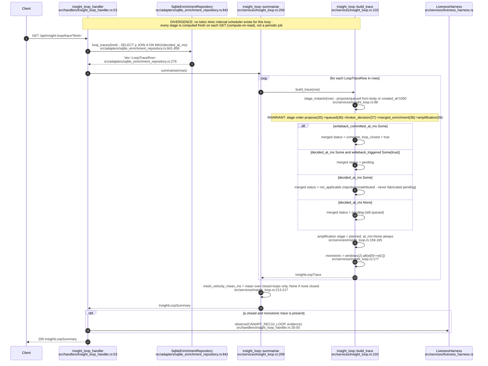

## VC-25.2 insight_loop_handler routes

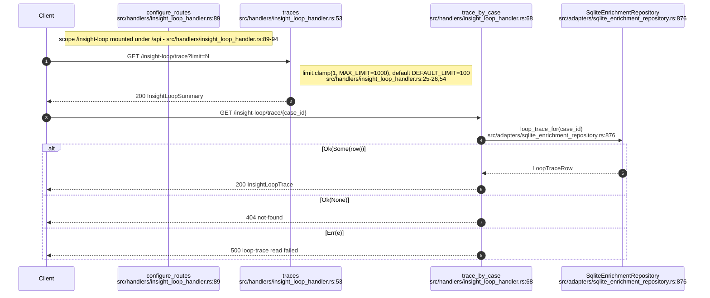

## VC-25.3 KPI compute and persist (kpi_snapshots / kpi_lineage / kpi_agent_events)

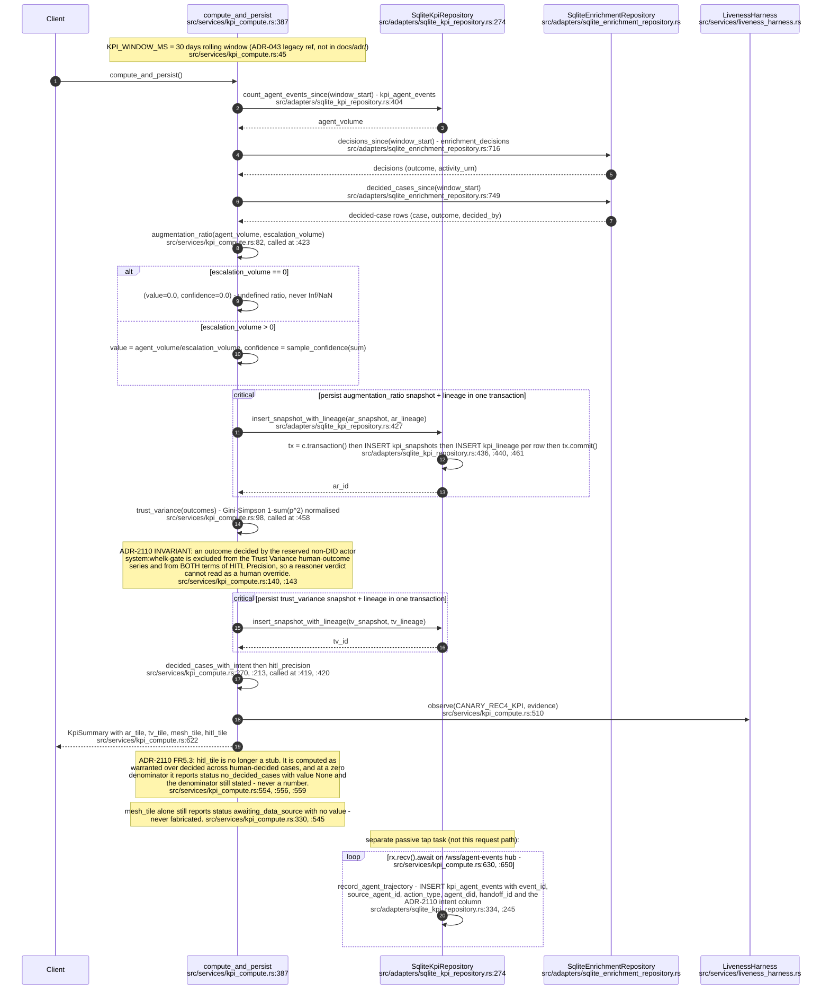

## VC-25.4 kpi_handler read routes

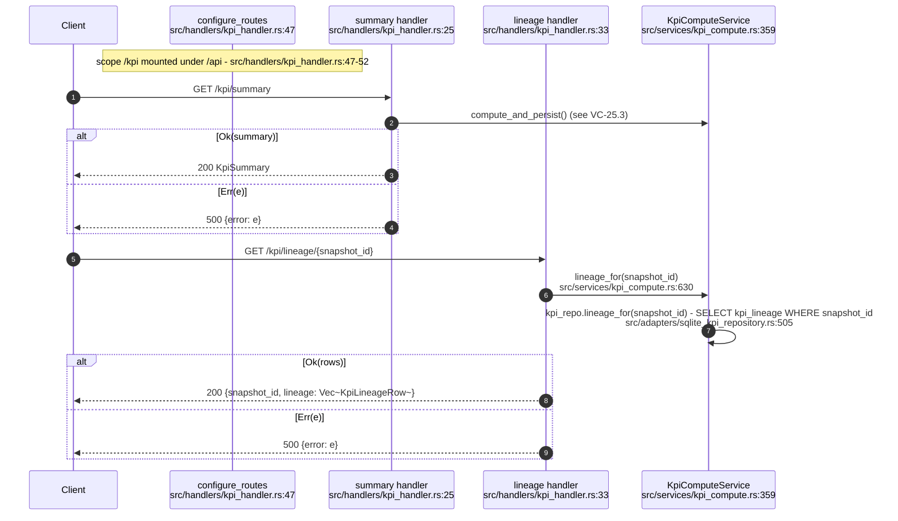

## VC-25.6 Briefing service and handler (submit + debrief)

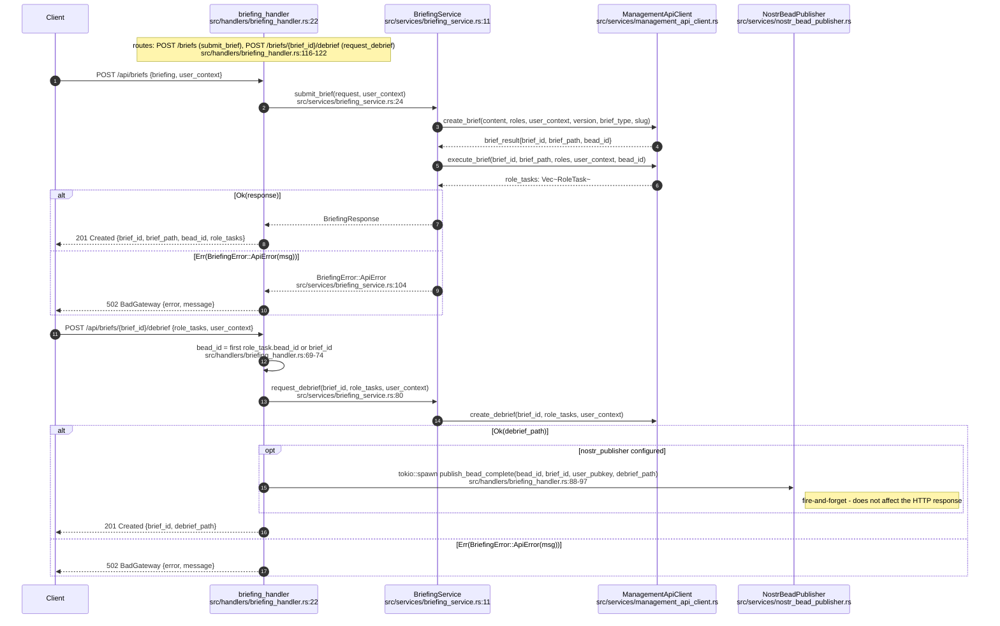

## VC-25.7 Natural language query: parse -> plan -> execute

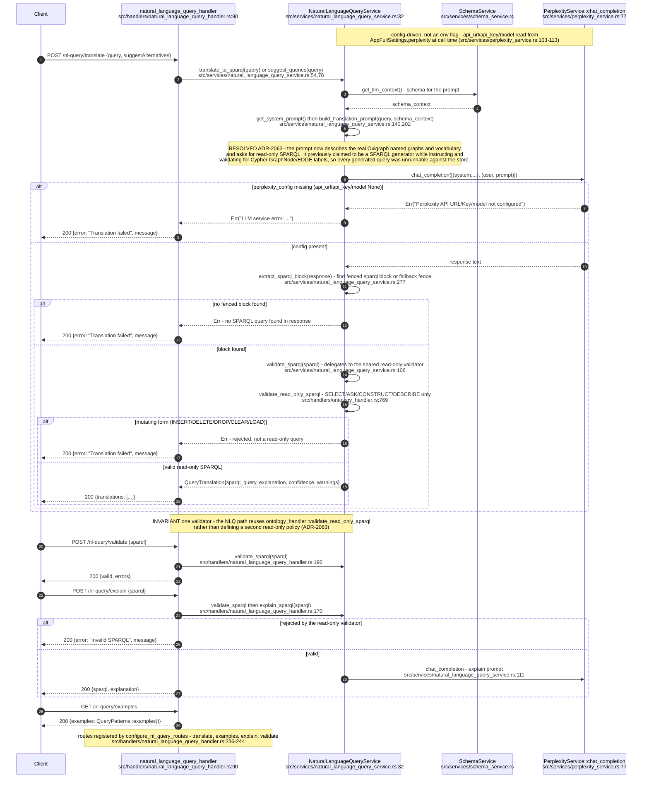

## VC-25.8 SemanticProcessorActor message handling

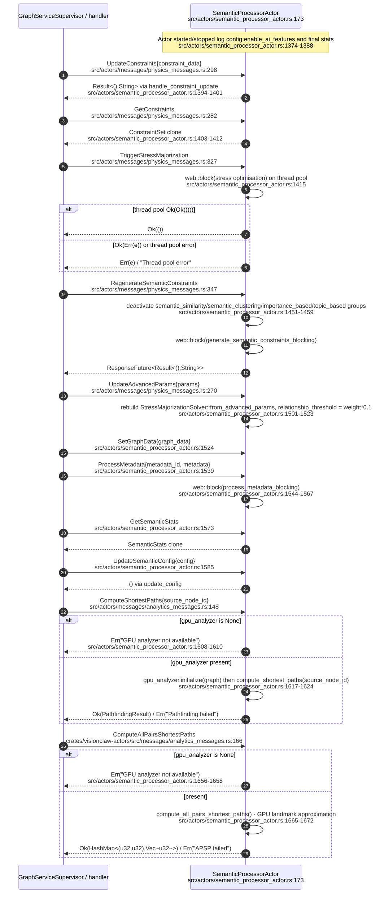

## VC-25.9 semantic_analyzer feature extraction + semantic_type_registry lookup/register

ADR-2114 unified corpus reads (local vault + GitHub via one `CorpusSource`) so `relation_edges` now
takes a `ParsedPage` and vault-core `Vocabulary` rather than JSON-LD; the registry lookup pattern is
otherwise unchanged. `SemanticAnalyzer` is a separate, unrelated caller shown for the same actor.

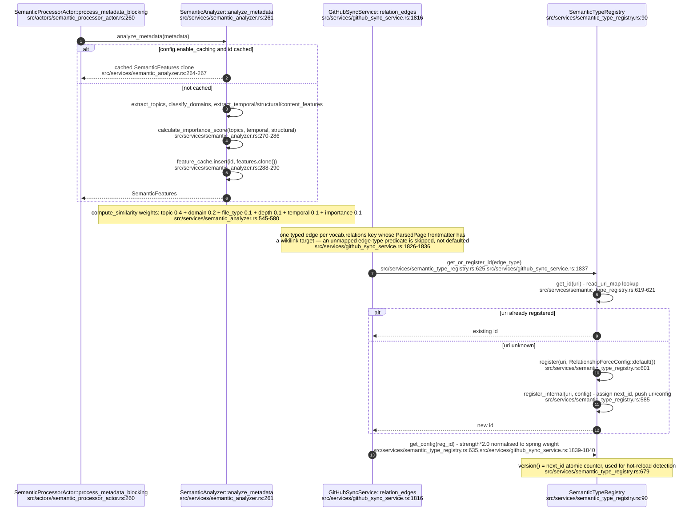

## VC-25.10 edge_classifier classification rules

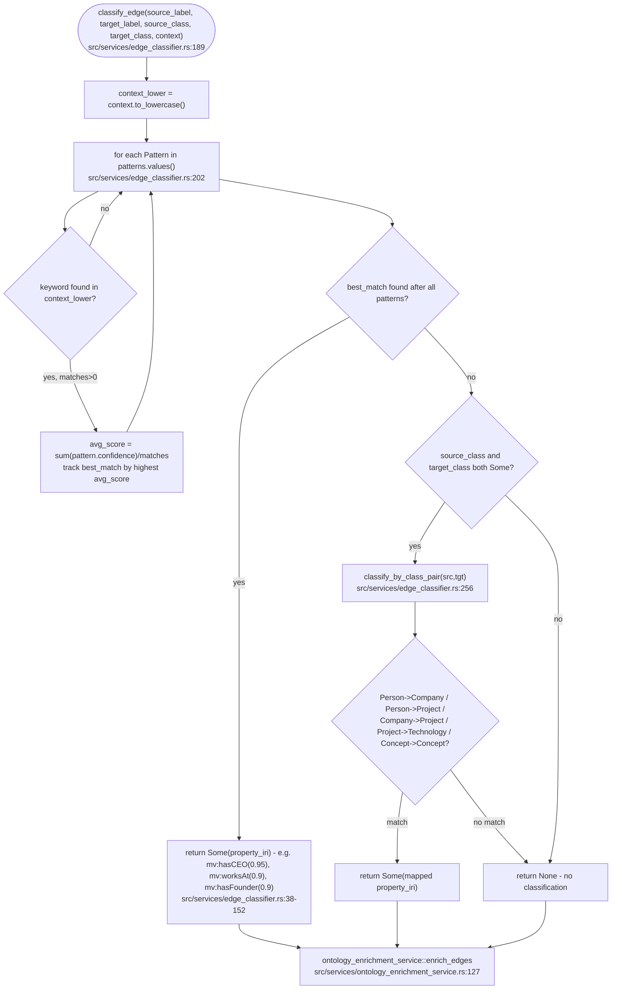

## VC-25.12 MetadataActor message handling

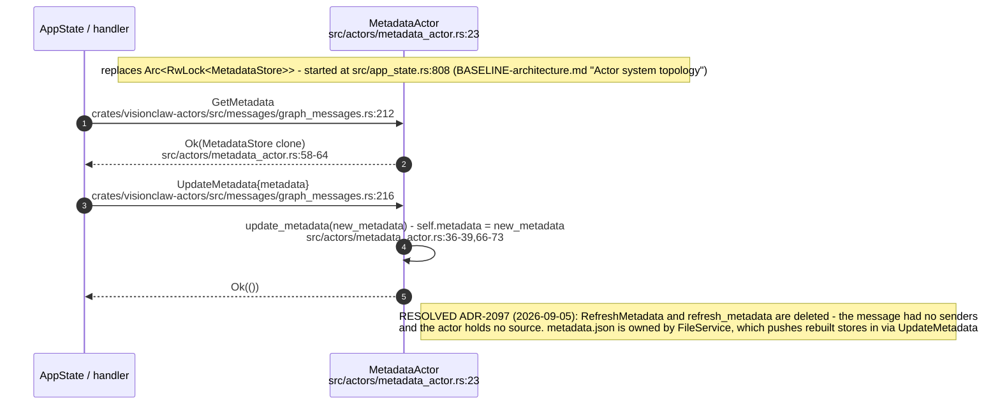

## VC-25.13 file_service + graph_serialization + empty-graph guard

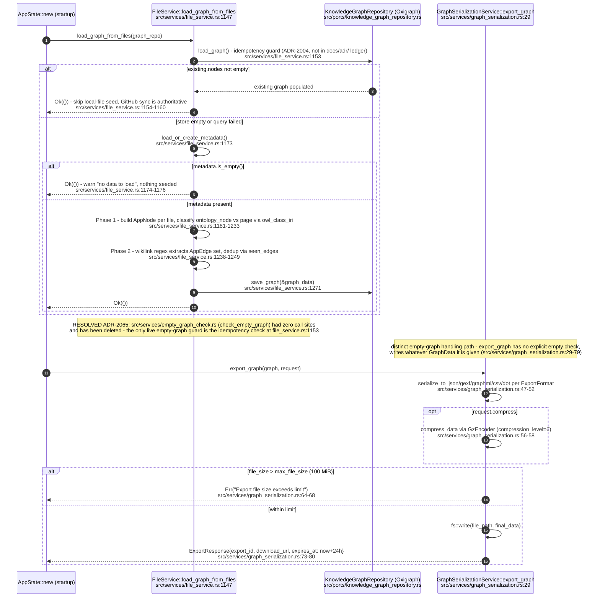
````

## DIFF

```diff
diff --git a/src/services/github_sync_service.rs b/src/services/github_sync_service.rs
index 596c07f79..a5ca47155 100644
--- a/src/services/github_sync_service.rs
+++ b/src/services/github_sync_service.rs
@@ -848,17 +848,10 @@ impl GitHubSyncService {
         Ok(n_nodes)
     }
 
-    /// Create domain root nodes for the 6 NarrativeGoldmine domains and
+    /// Create navigation root nodes for the eight NarrativeGoldmine domains and
     /// hierarchical edges from each node whose `group` matches a domain.
     async fn materialise_domain_roots(&self, stats: &mut SyncStatistics) -> Result<usize, String> {
-        const DOMAINS: &[(&str, &str)] = &[
-            ("spatial-computing", "Spatial Computing"),
-            ("artificial-intelligence", "Artificial Intelligence"),
-            ("infrastructure", "Infrastructure"),
-            ("blockchain", "Blockchain"),
-            ("robotics", "Robotics"),
-            ("distributed-collaboration", "Distributed Collaboration"),
-        ];
+        let domains = vault_core::domains::DOMAIN_ROOTS;
 
         let graph = self
             .kg_repo
@@ -871,7 +864,7 @@ impl GitHubSyncService {
             std::collections::HashMap::new();
         for node in &graph.nodes {
             if let Some(ref group) = node.group {
-                for &(slug, _) in DOMAINS {
+                for &(slug, _) in domains {
                     if group == slug {
                         domain_members.entry(slug).or_default().push(node.id);
                     }
@@ -883,7 +876,7 @@ impl GitHubSyncService {
         let mut domain_edges = Vec::new();
         let mut created = 0;
 
-        for &(slug, label) in DOMAINS {
+        for &(slug, label) in domains {
             let members = match domain_members.get(slug) {
                 Some(m) if !m.is_empty() => m,
                 _ => continue,
@@ -913,7 +906,7 @@ impl GitHubSyncService {
             .map_err(|e| format!("batch_add_nodes domain roots: {}", e))?;
 
         // Map slug → assigned root ID.
-        let domain_slugs: Vec<&str> = DOMAINS
+        let domain_slugs: Vec<&str> = domains
             .iter()
             .filter(|(slug, _)| domain_members.contains_key(slug))
             .map(|(slug, _)| *slug)
```
