# Label ab-03

You are an independent labeller for a pre-registered experiment. Below are (1) a TOPIC: a Markdown file of Mermaid diagrams, with short prose notes, that document code, with `path:line` citations, where paths under `../project/` are in the VisionClaw repository and paths under `../project/agentbox/` are in the agentbox repository; and (2) a DIFF: one commit's changes in the agentbox repository, restricted to the files the topic lists under `sources:`. The topic was verified against a revision of that repository at or before this commit's parent, so the diff is a change made after the topic was written.

Answer exactly one question:

> **Did this change make anything this topic states wrong or misleading?**

Judge only from the two texts below; do not look anything else up. Reply with a single JSON object and nothing else:

```json
{"verdict": "yes" | "no", "statements": ["<diagram or section id>: <the statement, quoted>", ...], "line_anchors_only": true | false, "reason": "<one or two sentences>"}
```

`statements` lists every statement in the topic (a message, node, edge, guard, label or prose claim) that the change makes wrong or misleading; it is empty when the verdict is no. `line_anchors_only` is true when the only such statements are `path:line` anchors whose cited code merely moved.

## TOPIC (docs/diagrams/agentbox/27-media-gpu-capability-services.md)

````markdown
---
id: AB-27
title: Media and GPU capability services — manifest-gated dispatch
area: agentbox
governing:
  - ../project/agentbox/docs/BASELINE-container.md
  - ../project/agentbox/docs/GOVERNANCE-capabilities.md
adrs: [ADR-2006, ADR-2020, ADR-2040, ADR-2057]
sources:
  - ../project/agentbox/flake.nix
  - ../project/agentbox/agentbox.toml
  - ../project/agentbox/config/entrypoint-unified.sh
  - ../project/agentbox/lib/gpu-wrap.nix
  - ../project/agentbox/lib/gpu-backend.nix
  - ../project/agentbox/lib/3dgs-stack.nix
  - ../project/agentbox/management-api/lib/system-manifest.js
  - ../project/agentbox/management-api/routes/comfyui.js
  - ../project/agentbox/management-api/utils/comfyui-manager.js
  - ../project/agentbox/management-api/server.js
  - ../project/agentbox/services/agentbox-ops/src/bin/comfyui-generate.rs
  - ../project/agentbox/services/agentbox-mcp/src/main.rs
  - ../project/agentbox/services/agentbox-mcp/src/imagemagick/mod.rs
  - ../project/agentbox/services/agentbox-mcp/src/imagemagick/exec.rs
  - ../project/agentbox/mcp/mcp.json
  - ../project/agentbox/skills/blender/tools/blender-mcp-proxy.js
  - ../project/agentbox/skills/comfyui/mcp-server/server.js
  - ../project/agentbox/skills/lichtfeld-studio/SKILL.md
  - ../project/agentbox/gui-tools-sidecar/supervisord.conf
  - ../project/agentbox/gui-tools-sidecar/launch-blender.sh
  - ../project/agentbox/gui-tools-sidecar/launch-qgis.sh
  - ../project/agentbox/docker-compose.gui-tools.yml
  - ../project/agentbox/docker-compose.openmed.yml
  - ../project/agentbox/openmed-sidecar/prereq-check.sh
  - ../project/agentbox/openmed-sidecar/entrypoint.sh
  - ../project/agentbox/voice/README.md
  - ../project/agentbox/agentbox.sh
  - ../project/agentbox/scripts/agentbox-config-validate.js
  - ../project/agentbox/gui-tools-sidecar/qgis-mcp-headless.py
  - ../project/agentbox/xr-runtime/launch-godot.sh
  - ../project/agentbox/xr-runtime/launch-monado.sh
  - ../project/agentbox/xr-runtime/supervisord.conf
  - ../project/agentbox/xr-runtime/build-gdext.sh
  - ../project/agentbox/xr-runtime/healthcheck.sh
  - ../project/agentbox/xr-runtime/README.md
  - ../project/agentbox/voice/unmute-override.yml
  - ../project/agentbox/docker-compose.voice.yml
  - ../project/agentbox/docker-compose.speech.yml
  - ../project/agentbox/scripts/qgis_mcp_standalone.py
verified_commit: 5ab197a9d49e9721b85b791bf9efe30842c9e047
---

## AB-27.1 ComfyUI — builtin loopback gate vs external sidecar integration

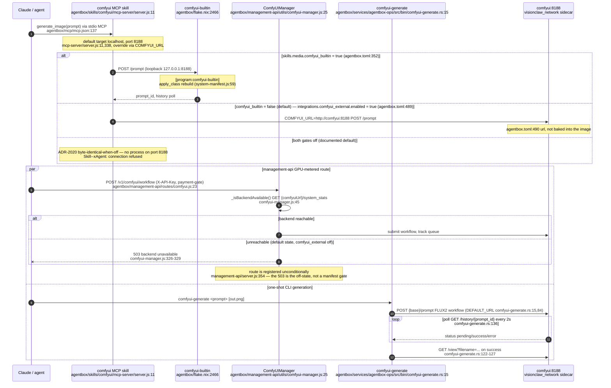

## AB-27.2 Blender MCP dispatch — proxy to the gui-tools GPU sidecar

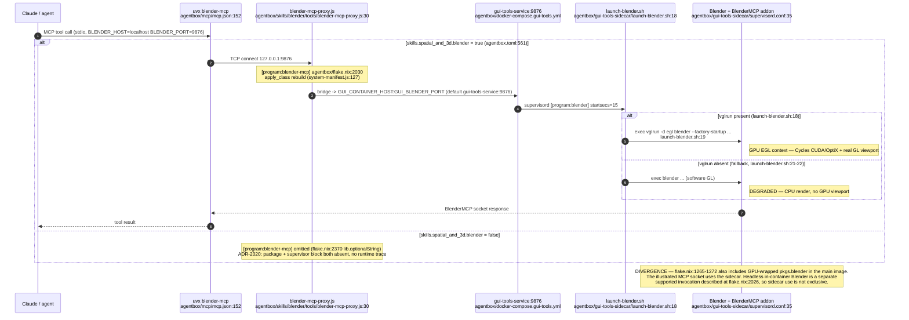

## AB-27.3 QGIS MCP dispatch — headless offscreen server in the same sidecar

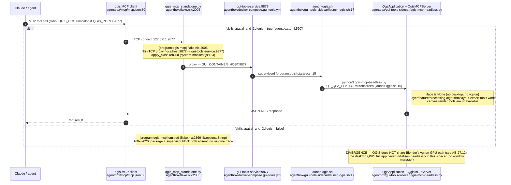

## AB-27.4 ImageMagick MCP dispatch — the 7 rmcp tools

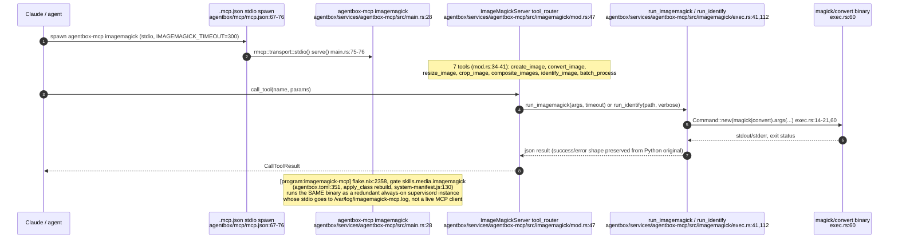

## AB-27.5 JupyterLab dispatch

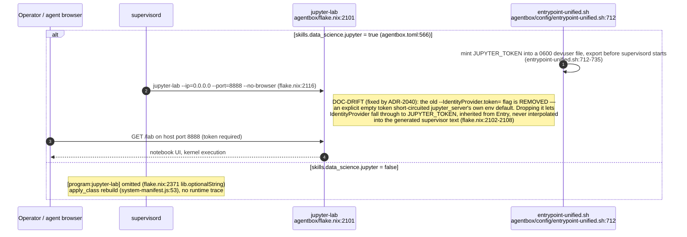

## AB-27.6 code-server dispatch

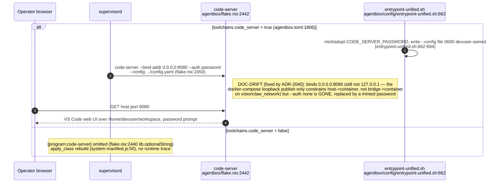

## AB-27.7 Voice / Unmute operator console dispatch — own-lifecycle sidecar

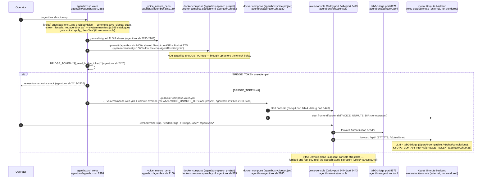

## AB-27.8 openmed clinical-PHI sidecar — triple fail-closed prerequisite gate

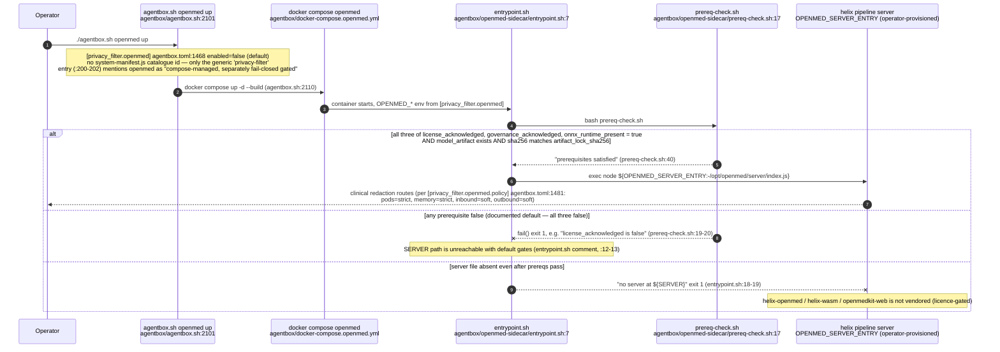

## AB-27.9 3D Gaussian Splatting / LichtFeld — two unrelated paths behind one skill name

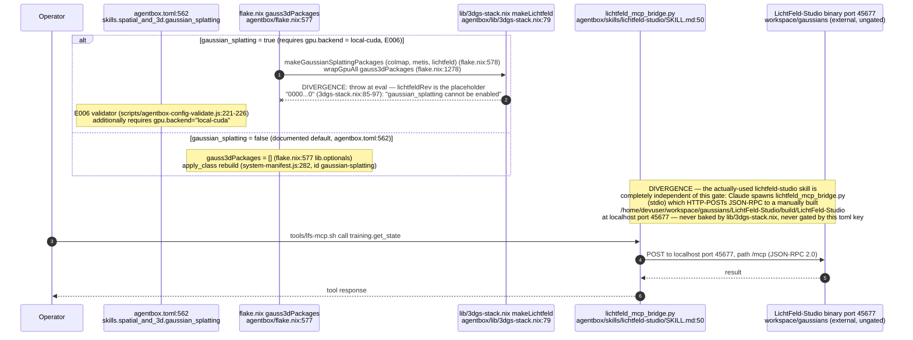

## AB-27.10 Supervision tree — media/GPU supervised programs, ports on the edges

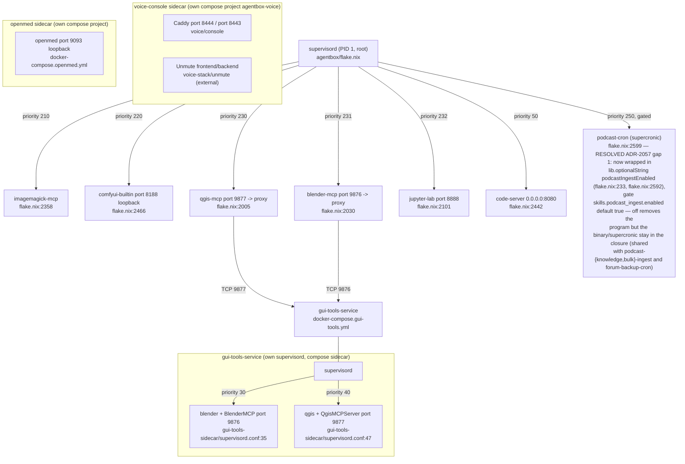

## AB-27.11 Manifest gate to apply_class — media/GPU capability catalogue

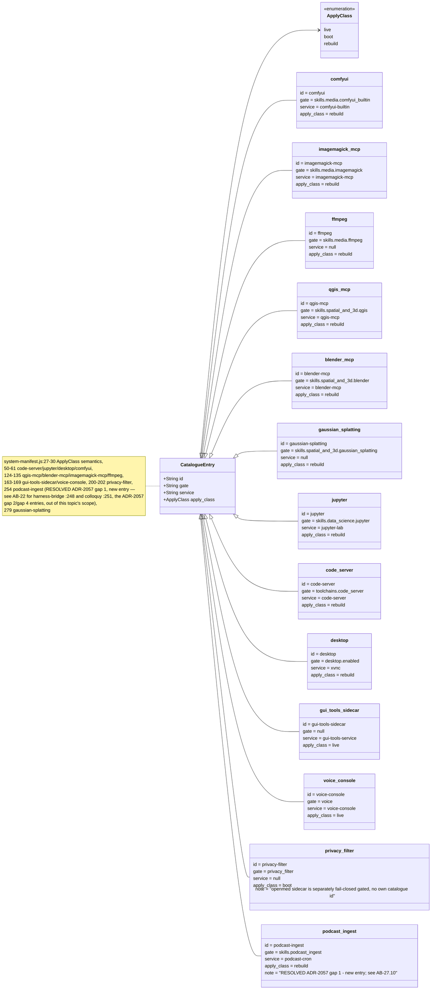

## AB-27.12 gui-tools sidecar GPU path — vglrun/nixGL, shared and unshared

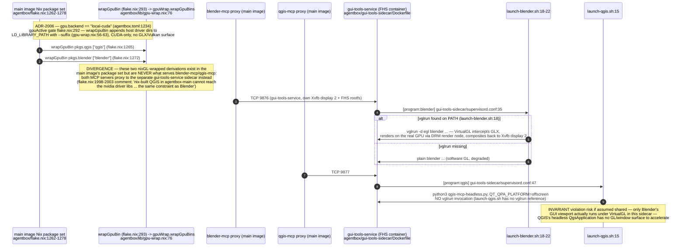


## AB-27.13 xr-runtime sidecar — Monado OpenXR plus Godot, behind Xvfb/VNC

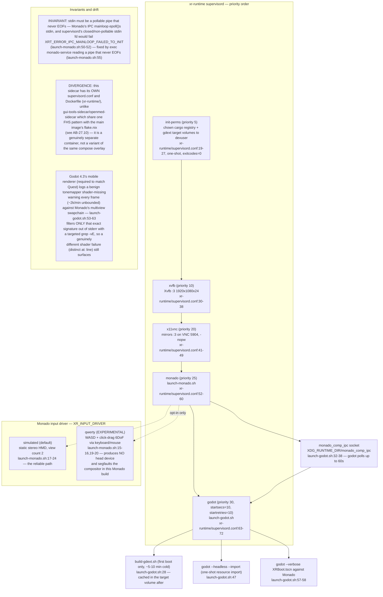
````

## DIFF

```diff
diff --git a/flake.nix b/flake.nix
index 24897c1c5..bc1bc90eb 100644
--- a/flake.nix
+++ b/flake.nix
@@ -39,7 +39,7 @@
     # Pin the parent VisionClaw commit so the corpus door is reproducible and
     # cannot drift with a mutable branch.
     vaultSrc = {
-      url = "github:DreamLab-AI/VisionClaw/7ff259ca313ab019bdaef911fe3093156d978f34";
+      url = "github:DreamLab-AI/VisionClaw/f1147d91571193033fde23c435b1c84a31872afa";
       flake = false;
     };
```
