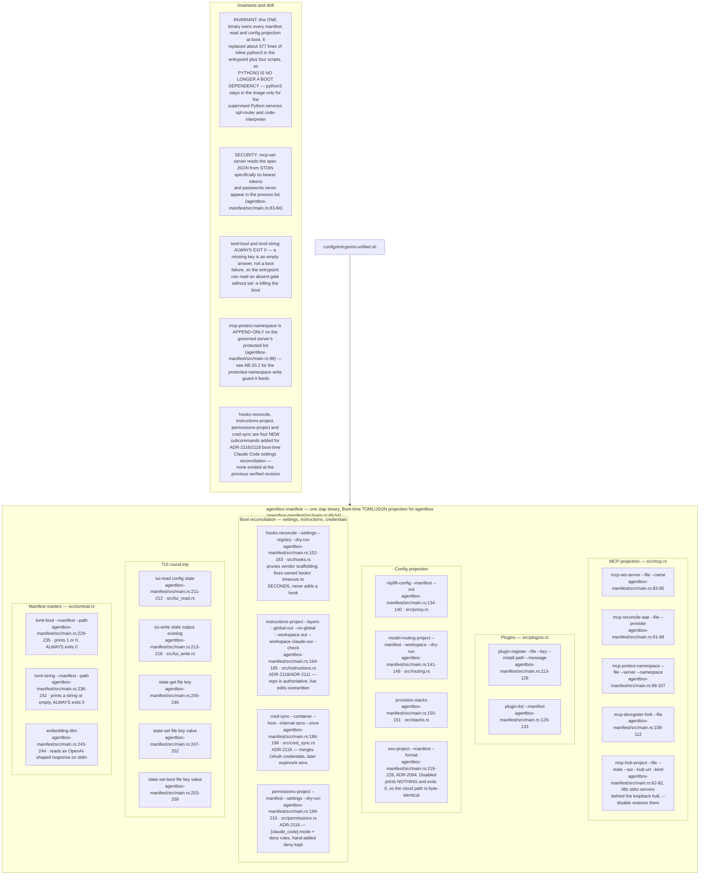
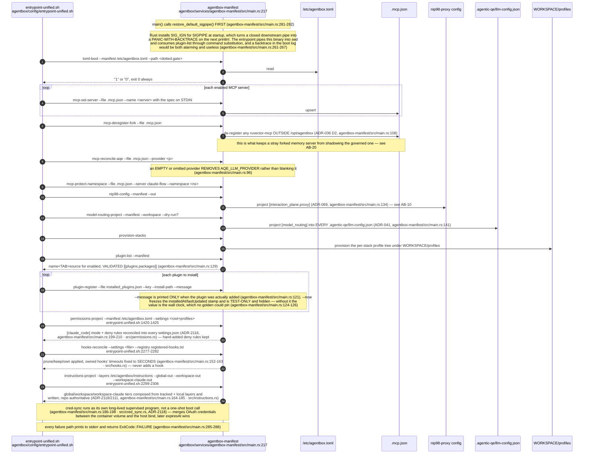
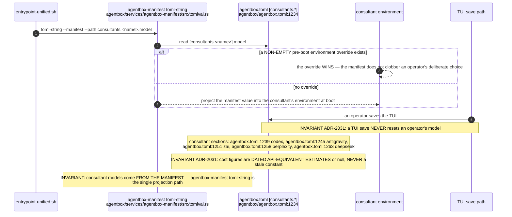
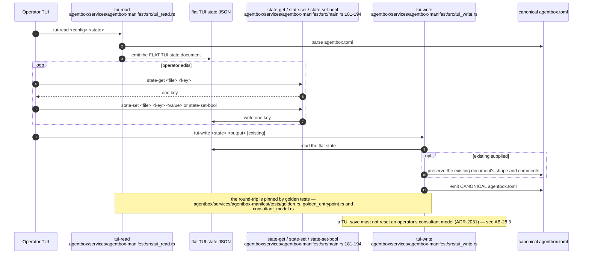
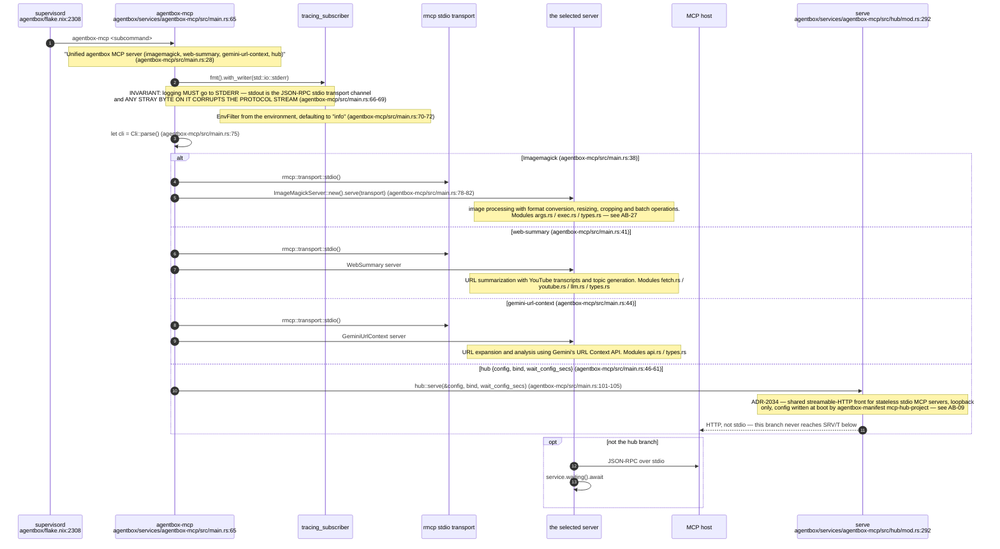
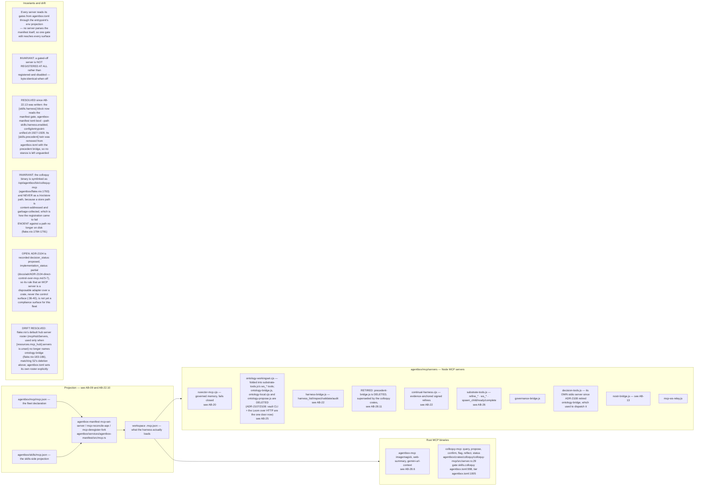
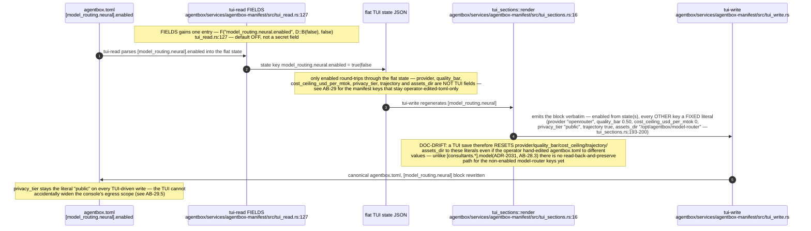
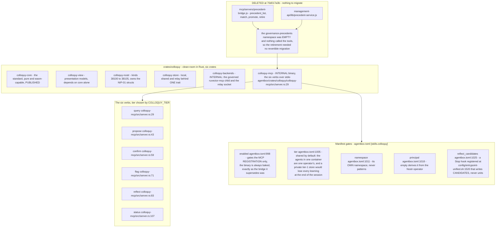
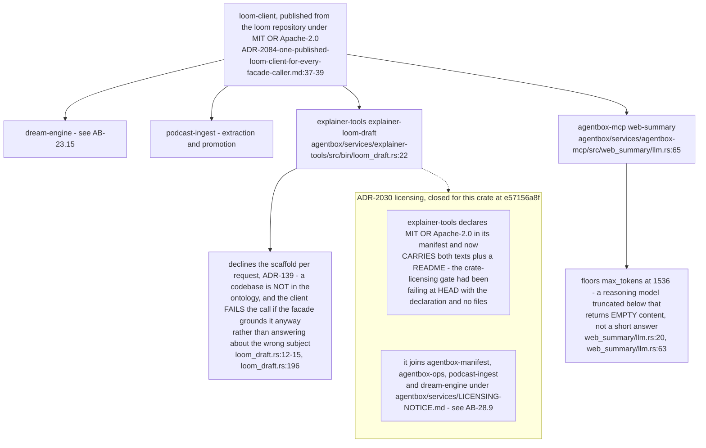

# Label ab-04

You are an independent labeller for a pre-registered experiment. Below are (1) a TOPIC: a Markdown file of Mermaid diagrams, with short prose notes, that document code, with `path:line` citations, where paths under `../project/` are in the VisionClaw repository and paths under `../project/agentbox/` are in the agentbox repository; and (2) a DIFF: one commit's changes in the agentbox repository, restricted to the files the topic lists under `sources:`. The topic was verified against a revision of that repository at or before this commit's parent, so the diff is a change made after the topic was written.

Answer exactly one question:

> **Did this change make anything this topic states wrong or misleading?**

Judge only from the two texts below; do not look anything else up. Reply with a single JSON object and nothing else:

```json
{"verdict": "yes" | "no", "statements": ["<diagram or section id>: <the statement, quoted>", ...], "line_anchors_only": true | false, "reason": "<one or two sentences>"}
```

`statements` lists every statement in the topic (a message, node, edge, guard, label or prose claim) that the change makes wrong or misleading; it is empty when the verdict is no. `line_anchors_only` is true when the only such statements are `path:line` anchors whose cited code merely moved.

## TOPIC (docs/diagrams/agentbox/28-agentbox-services-and-manifest-binary.md)

````markdown
---
id: AB-28
title: Agentbox service crates and the manifest binary
area: agentbox
governing:
  - ../project/agentbox/docs/BASELINE-container.md
adrs: [ADR-2030, ADR-2031, ADR-2032, ADR-2084, ADR-2085, ADR-2086, ADR-2104, ADR-2116, ADR-2118]
sources:
  - ../project/agentbox/services/agentbox-manifest/src/main.rs
  - ../project/agentbox/services/agentbox-manifest/src/mcp.rs
  - ../project/agentbox/services/agentbox-manifest/src/routing.rs
  - ../project/agentbox/services/agentbox-manifest/src/proxy.rs
  - ../project/agentbox/services/agentbox-manifest/src/stacks.rs
  - ../project/agentbox/services/agentbox-manifest/src/plugins.rs
  - ../project/agentbox/services/agentbox-manifest/src/hooks.rs
  - ../project/agentbox/services/agentbox-manifest/src/instructions.rs
  - ../project/agentbox/services/agentbox-manifest/src/cred_sync.rs
  - ../project/agentbox/services/agentbox-manifest/src/permissions.rs
  - ../project/agentbox/services/agentbox-manifest/src/tui_read.rs
  - ../project/agentbox/services/agentbox-manifest/src/tui_sections.rs
  - ../project/agentbox/services/agentbox-manifest/src/tui_write.rs
  - ../project/agentbox/services/agentbox-manifest/src/tomlval.rs
  - ../project/agentbox/services/agentbox-ops/src/lib.rs
  - ../project/agentbox/services/agentbox-mcp/src/main.rs
  - ../project/agentbox/services/agentbox-mcp/src/hub/mod.rs
  - ../project/agentbox/services/podcast-ingest/src/lib.rs
  - ../project/agentbox/services/explainer-tools/src/bin/loom_draft.rs
  - ../project/agentbox/services/agentbox-mcp/src/web_summary/llm.rs
  - ../project/agentbox/crates/colloquy/colloquy-mcp/src/server.rs
  - ../project/agentbox/docs/adr/ADR-2104-direct-control-over-mcp.md
  - ../project/agentbox/docs/adr/ADR-2084-one-published-loom-client-for-every-facade-caller.md
  - ../project/agentbox/mcp/servers/harness-bridge.js
  - ../project/agentbox/mcp/servers/substrate-tools.js
  - ../project/agentbox/mcp/servers/governance-bridge.js
  - ../project/agentbox/mcp/servers/decision-tools.js
  - ../project/agentbox/mcp/servers/nostr-bridge.js
  - ../project/agentbox/mcp/servers/mcp-ws-relay.js
  - ../project/agentbox/config/entrypoint-unified.sh
  - ../project/agentbox/agentbox.toml
  - ../project/agentbox/.agentic-qe/llm-config.json
  - ../project/agentbox/flake.nix
  - ../project/agentbox/mcp/mcp.json
  - ../project/agentbox/services/agentbox-manifest/tests/golden.rs
  - ../project/agentbox/skills/mcp.json
  - scripts/diagram-index-gen.cjs
  - ../project/agentbox/lib/agentbox-manifest.nix
  - ../project/agentbox/lib/agentbox-mcp.nix
  - ../project/agentbox/lib/agentbox-ops.nix
  - ../project/agentbox/lib/dream-engine.nix
  - ../project/agentbox/lib/podcast-ingest.nix
  - ../project/agentbox/lib/skill-tools.nix
  - ../project/agentbox/mcp/servers/continual-harness.cjs
  - ../project/agentbox/mcp/servers/ontology-workingset.cjs
  - ../project/agentbox/mcp/servers/ruvector-mcp.cjs
  - ../project/agentbox/services/agentbox-manifest/tests/consultant_model.rs
  - ../project/agentbox/services/agentbox-manifest/tests/golden_entrypoint.rs
  - ../project/agentbox/services/agentbox-mcp/src/gemini_url_context/api.rs
  - ../project/agentbox/services/agentbox-mcp/src/imagemagick/args.rs
  - ../project/agentbox/services/agentbox-mcp/src/imagemagick/exec.rs
  - ../project/agentbox/services/agentbox-mcp/src/web_summary/fetch.rs
  - ../project/agentbox/services/agentbox-mcp/src/web_summary/youtube.rs
  - ../project/agentbox/services/skill-tools/src/docs_alignment/mermaid.rs
verified_commit: {agentbox: 5ab197a9d49e9721b85b791bf9efe30842c9e047, visionflow: e5987acc8337ddd64c72f775750d61fef46d8e0b}
---

## AB-28.1 agentbox-manifest — the boot-time projection surface



## AB-28.2 Boot projection sequence



## AB-28.3 Consultant model projection (ADR-2031)



## AB-28.4 TUI manifest round-trip



## AB-28.6 agentbox-mcp — one binary, three stdio MCP servers plus the streamable-HTTP hub



## AB-28.8 The MCP server fleet in mcp/servers



## AB-28.9 Service crate publishing posture

```mermaid
classDiagram
    class PublishableServiceCrate {
        <<ADR-2030>>
        +LICENSE-APACHE
        +LICENSE-MIT
        +README.md
        +Cargo.toml with repository metadata
        +inline rustdoc on every public item
    }
    class agentbox_manifest {
        boot-time TOML/JSON projection
        clap subcommands
        golden tests
    }
    class agentbox_ops {
        retired-Python tool suite
        12 binaries
        9 shared modules
    }
    class agentbox_mcp {
        3 stdio MCP servers
        rmcp transport
    }
    class skill_tools {
        uiux · wardley · docs_alignment
        12 binaries
    }
    class podcast_ingest {
        corpus ingest
        see AB-27
    }
    class explainer_tools {
        explainer-loom-draft
        LICENSE-APACHE and LICENSE-MIT
        see AB-28.8
    }
    class dream_engine {
        nightly cycle
        see AB-23
    }
    class headroom_napi {
        NAPI compression addon
        see AB-26
    }
    PublishableServiceCrate <|-- agentbox_manifest
    PublishableServiceCrate <|-- agentbox_ops
    PublishableServiceCrate <|-- agentbox_mcp
    PublishableServiceCrate <|-- skill_tools
    PublishableServiceCrate <|-- podcast_ingest
    PublishableServiceCrate <|-- explainer_tools
    PublishableServiceCrate <|-- dream_engine
    PublishableServiceCrate <|-- headroom_napi
    note for PublishableServiceCrate "ADR-2030 permissive licensing for publishable service crates. Dual LICENSE-APACHE +<br/>LICENSE-MIT are present in agentbox-manifest, agentbox-ops and podcast-ingest.<br/>ontology-tools left the set with its crate, deleted by ADR-2119 (2026-10-01). The estate-wide notice is agentbox/services/LICENSING-NOTICE.md"
    note for agentbox_manifest "Nix packaging for each crate lives in agentbox/lib — agentbox-manifest.nix,<br/>agentbox-ops.nix, agentbox-mcp.nix, skill-tools.nix,<br/>podcast-ingest.nix, dream-engine.nix, headroom-compress.nix. A crate is in the package<br/>set only when its manifest gate is on, which is what makes byte-identical-when-off real<br/>at IMAGE level, not just runtime"
    note for agentbox_ops "Each binary replaces a Python script retired by the 2026-09-02 estate legacy audit;<br/>the modules hold the behaviour worth unit-testing independently of the CLI shell<br/>(agentbox-ops/src/lib.rs:1-5)"
    note for skill_tools "docs_check_mermaid is the skill-side mermaid validator (docs_alignment/mermaid.rs:1-5);<br/>this diagrams tree is validated instead, and more strictly, by VisionFlow's<br/>scripts/diagram-index-gen.cjs --render, which shells every block through mmdc"
```



## AB-28.10 A new gate joins the TUI round-trip — [model_routing.neural] (ADR-2080)



## AB-28.11 The precedent bridge is retired, colloquy is the successor (ADR-2085/2086)



**Debt (corpus vs repo):** this topic listed the deleted `mcp/servers/precedent-bridge.js` in its own `sources:` until this pass, so every citation into it was an unresolvable warning and the file-existence check was failing the whole tree; the successor is `../project/agentbox/crates/colloquy/colloquy-mcp/src/server.rs:29`.

**Invariant:** mixing colloquy units into the `patterns` namespace would move the frozen recall band, so the shared tier gets its own (`../project/agentbox/agentbox.toml:1011`).

**Invariant:** an agent that authorises itself defeats principal collapse, so the principal must never equal the agent's own member id and the binary exits rather than start that way (`../project/agentbox/agentbox.toml:1015-1017`).

## AB-28.13 ADR-2084 - the facade client the service crates share



**Invariant:** `explainer-loom-draft` replaced `skills/explainer/scripts/loom-draft.mjs`, so the explainer path is a supervised Rust binary rather than a script, and the facade protocol it speaks comes from the published crate rather than being reimplemented (`../project/agentbox/services/explainer-tools/src/bin/loom_draft.rs:1-2`).
````

## DIFF

```diff
diff --git a/flake.nix b/flake.nix
index 24897c1c5..bc1bc90eb 100644
--- a/flake.nix
+++ b/flake.nix
@@ -39,7 +39,7 @@
     # Pin the parent VisionClaw commit so the corpus door is reproducible and
     # cannot drift with a mutable branch.
     vaultSrc = {
-      url = "github:DreamLab-AI/VisionClaw/7ff259ca313ab019bdaef911fe3093156d978f34";
+      url = "github:DreamLab-AI/VisionClaw/f1147d91571193033fde23c435b1c84a31872afa";
       flake = false;
     };
```
