# Label ab-05

You are an independent labeller for a pre-registered experiment. Below are (1) a TOPIC: a Markdown file of Mermaid diagrams, with short prose notes, that document code, with `path:line` citations, where paths under `../project/` are in the VisionClaw repository and paths under `../project/agentbox/` are in the agentbox repository; and (2) a DIFF: one commit's changes in the agentbox repository, restricted to the files the topic lists under `sources:`. The topic was verified against a revision of that repository at or before this commit's parent, so the diff is a change made after the topic was written.

Answer exactly one question:

> **Did this change make anything this topic states wrong or misleading?**

Judge only from the two texts below; do not look anything else up. Reply with a single JSON object and nothing else:

```json
{"verdict": "yes" | "no", "statements": ["<diagram or section id>: <the statement, quoted>", ...], "line_anchors_only": true | false, "reason": "<one or two sentences>"}
```

`statements` lists every statement in the topic (a message, node, edge, guard, label or prose claim) that the change makes wrong or misleading; it is empty when the verdict is no. `line_anchors_only` is true when the only such statements are `path:line` anchors whose cited code merely moved.

## TOPIC (docs/diagrams/agentbox/15-capability-gating-spend-consultants.md)

````markdown
---
id: AB-15
title: Capability gating, spend caps and consultants
area: agentbox
governing:
  - ../project/agentbox/docs/GOVERNANCE-capabilities.md
  - ../project/agentbox/docs/SECURITY-profiles.md
adrs: [ADR-2020, ADR-2031, ADR-2033, ADR-2080]
sources:
  - ../project/agentbox/agentbox.toml
  - ../project/agentbox/management-api/lib/system-manifest.js
  - ../project/agentbox/scripts/agentbox-config-validate.js
  - ../project/agentbox/services/agentbox-ops/src/cost_cap/mod.rs
  - ../project/agentbox/services/agentbox-ops/src/bin/tree-search-cap.rs
  - ../project/agentbox/management-api/lib/pay402.js
  - ../project/agentbox/management-api/routes/payments.js
  - ../project/agentbox/management-api/lib/llm-marketplace.js
  - ../project/agentbox/management-api/routes/llm-marketplace.js
  - ../project/agentbox/management-api/lib/headroom.js
  - ../project/agentbox/management-api/lib/headroom-mcp-tools.js
  - ../project/agentbox/management-api/routes/system.js
  - ../project/agentbox/mcp/consultants/shared/consultant-base.js
  - ../project/agentbox/mcp/consultants/shared/model-diversity.js
  - ../project/agentbox/mcp/consultants/shared/spawn-cli.js
  - ../project/agentbox/mcp/consultants/shared/memory-logger.js
  - ../project/agentbox/mcp/consultants/antigravity/server.js
  - ../project/agentbox/services/agentbox-manifest/src/main.rs
  - ../project/agentbox/services/agentbox-manifest/src/tomlval.rs
  - ../project/agentbox/services/agentbox-manifest/src/tui_write.rs
  - ../project/agentbox/config/entrypoint-unified.sh
  - ../project/agentbox/skills/tree-search-coder/SKILL.md
  - ../project/agentbox/skills/build-with-quality/scripts/deepsec-gate.sh
  - ../project/agentbox/docs/adr/ADR-2020-capability-gating.md
  - ../project/agentbox/docs/adr/ADR-2031-consultant-model-manifest-projection.md
  - ../project/agentbox/docs/adr/ADR-2033-deepsec-security-gate.md
  - ../project/agentbox/.deepsec-gate/deepsec.config.mjs
  - ../project/agentbox/lib/npm-cli.nix
  - ../project/agentbox/mcp/servers/lib/ontology-retrieval.js
  - ../project/agentbox/scripts/ci/check-manifest-catalogue.js
  - ../project/agentbox/services/agentbox-ops/src/cost_cap/ledger.rs
  - ../project/agentbox/management-api/lib/authority.js
  - ../project/agentbox/tests/sovereign/authority.test.js
  - ../project/agentbox/skills/mcp.json
  - ../project/agentbox/agentbox.sh
  - ../project/agentbox/flake.nix
  - ../project/agentbox/config/harness-wrappers/router.sh
  - ../project/agentbox/docs/adr/ADR-2080-metaharness-router-console-under-aoe.md
verified_commit: 5ab197a9d49e9721b85b791bf9efe30842c9e047
---

## AB-15.1 Gate lattice — manifest to package set to supervisor to runtime trace
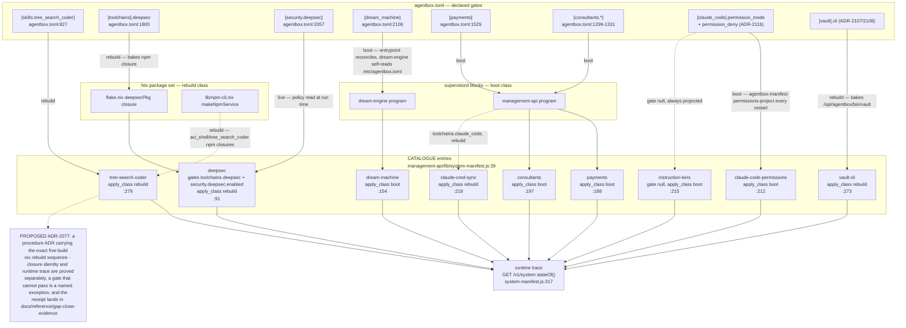

## AB-15.2 A gated tool call — off, on, and spend-capped branches
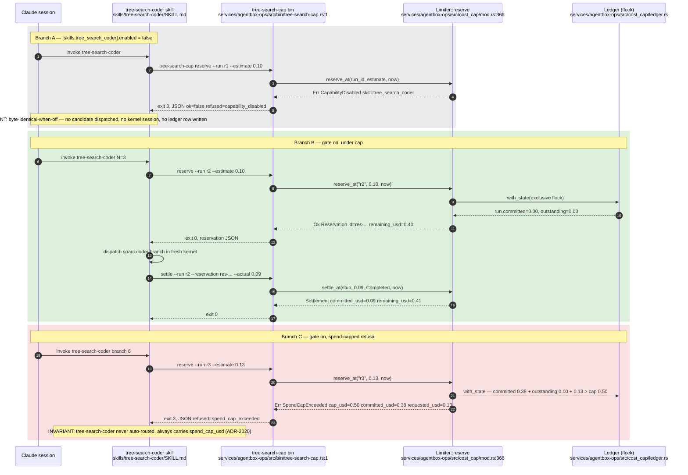

## AB-15.3 Boot projection — manifest to catalogue to runtime state
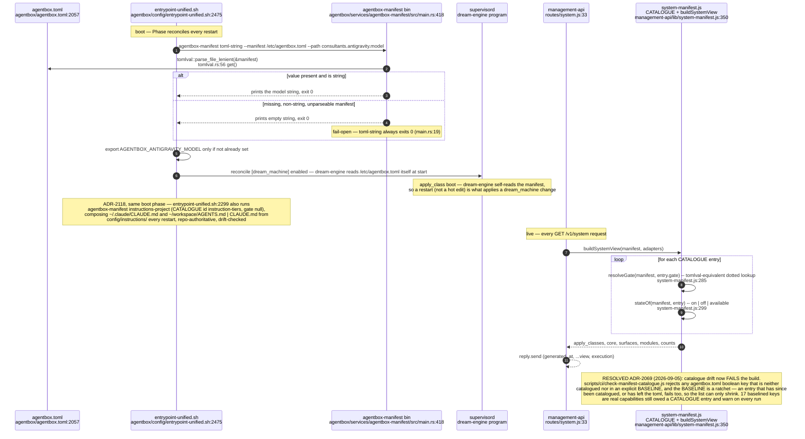

## AB-15.4 Apply-class lifecycle of a gate
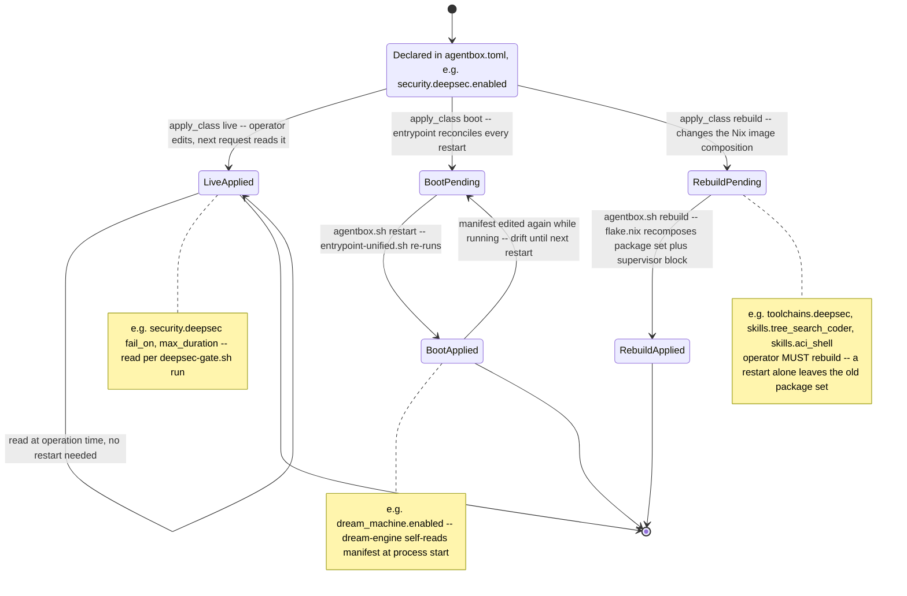

## AB-15.5 tree-search-coder spend cap — manifest to validator to enforcement
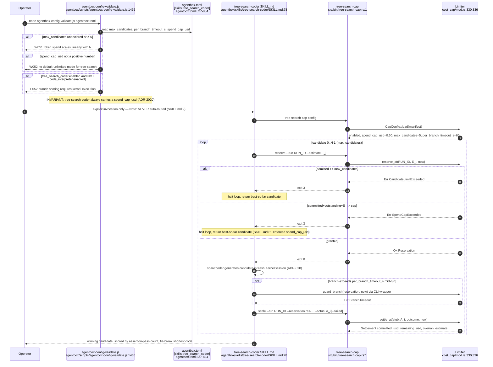

## AB-15.6 Full HTTP 402 challenge, payment, retry, settle
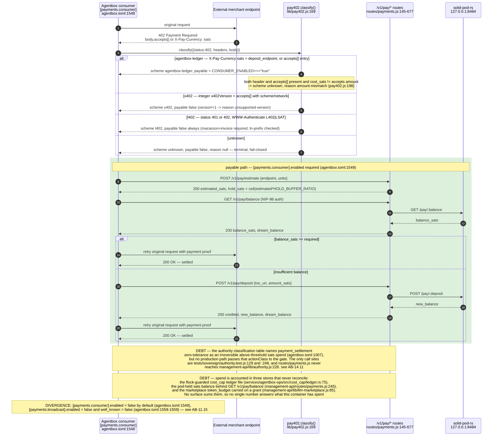

## AB-15.7 routes/payments.js — GET info, GET balance, POST deposit
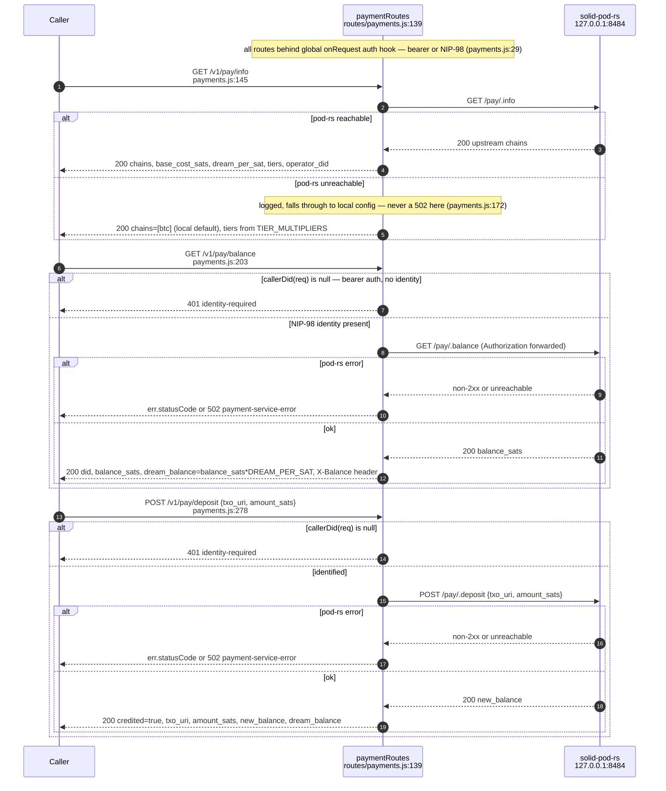

## AB-15.8 routes/payments.js — POST estimate, POST buy, POST withdraw
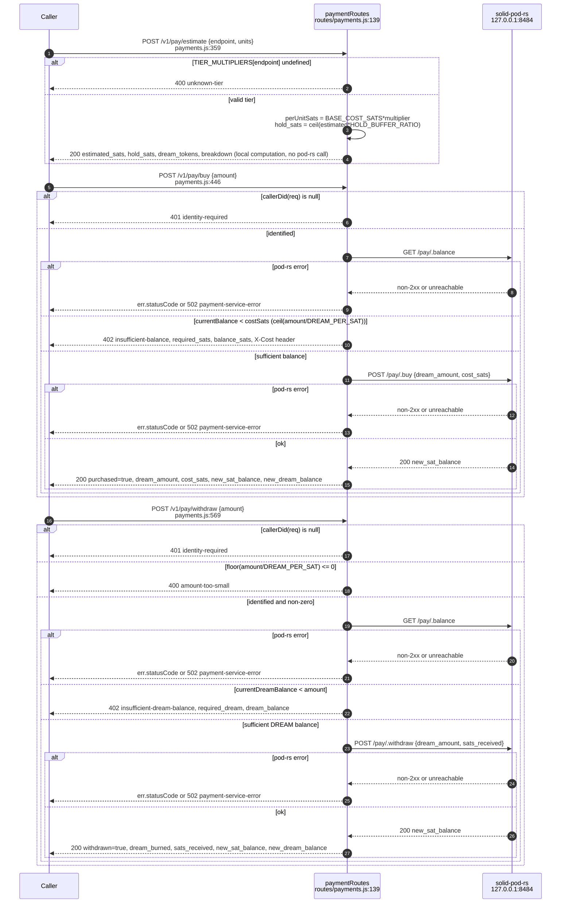

## AB-15.9 LLM marketplace — advertise, discover, request, grant, receipt, revoke
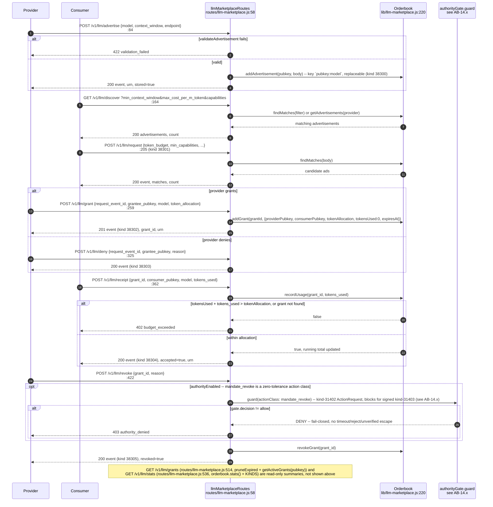

## AB-15.10 headroom compression-capacity model and its 3 MCP tools
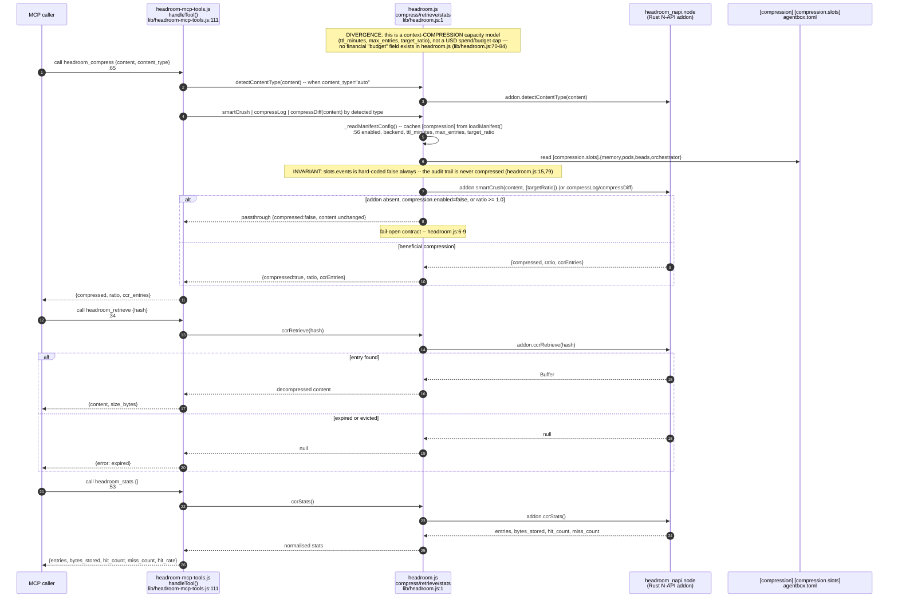

## AB-15.11 Consultant model projection at boot — env wins, TUI preserves (ADR-2031)
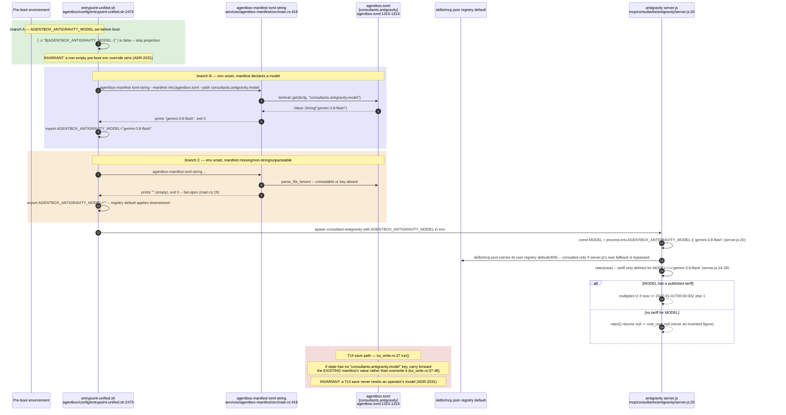

## AB-15.12 Consultant consult() call — consultant-base.js, model-diversity, memory-logger
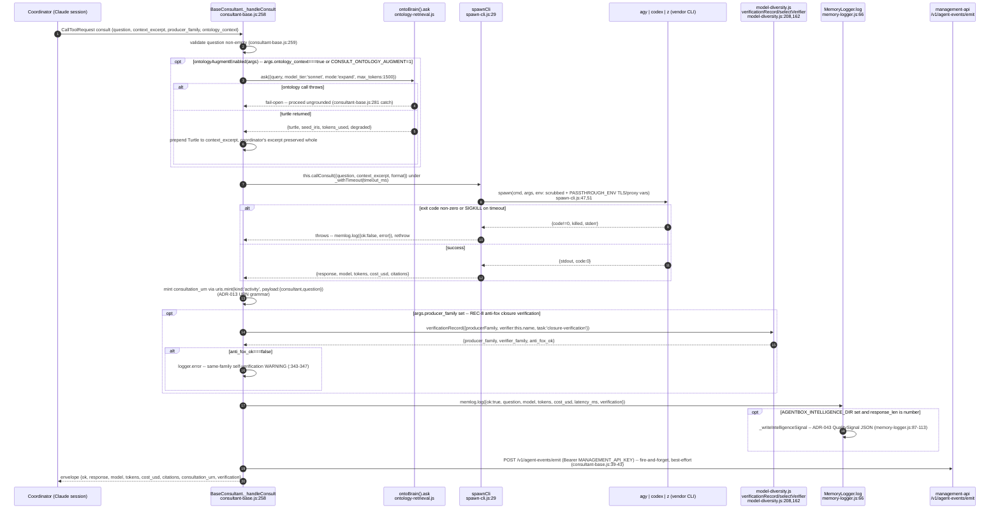

## AB-15.13 deepsec gate — invocation, route selection, egress bound
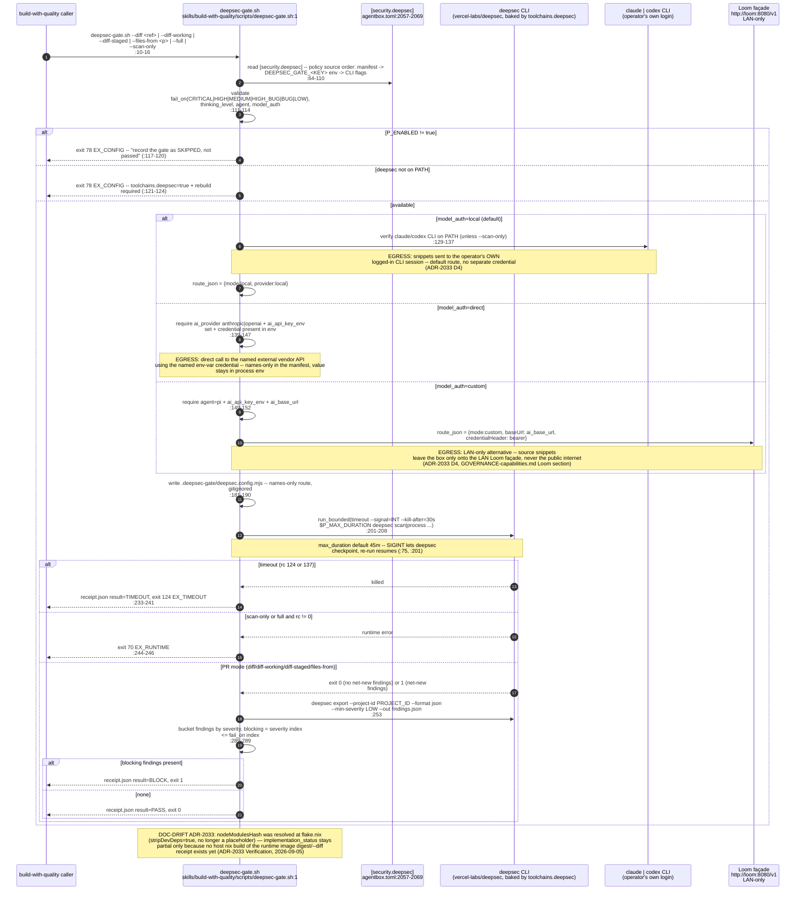

## AB-15.14 ADR-2080 — the metaharness router console gate (new since verified_commit)
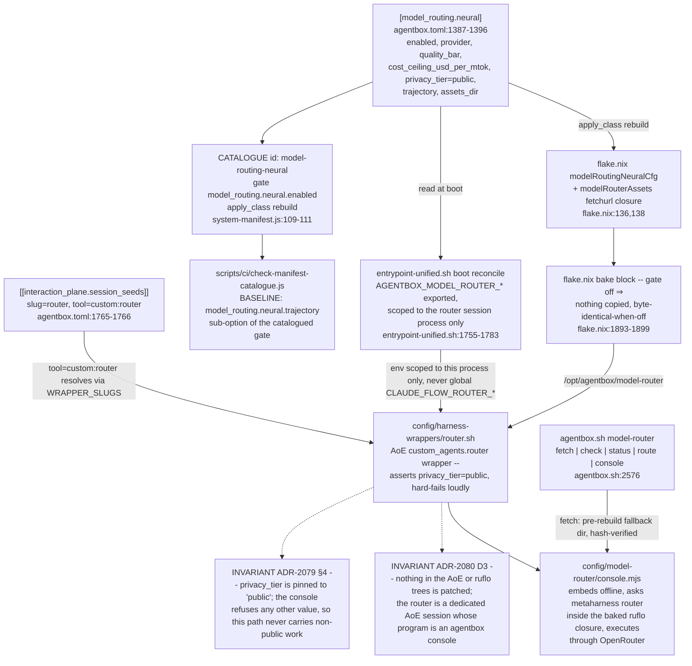


**Drift (spend gating vs the wallet that now exists):** the capability lattice above gates LLM spend and HTTP 402 settlement, and a second spend surface has since been published — `sidestr-wallet` consults a `SpendPolicy` before every signature and ships only a permissive implementation, leaving the authority gate (ADR-2100) to the caller, which nothing in this topic yet supplies (see AB-33.7). The level-2 review that reshaped the federation design was itself run through the consultant tier drawn at AB-15.12 (see AB-35).

**Drift (manifest comment vs pin):** the `[toolchains].deepsec` comment still names `vercel-labs/deepsec@2.3.9` (`../project/agentbox/agentbox.toml:1800`) while the flake's exact pin moved to `2.3.10` on 2026-10-01 (`../project/agentbox/flake.nix:542`); ADR-2033 was re-verified against the new pin, the manifest comment was not.
````

## DIFF

```diff
diff --git a/flake.nix b/flake.nix
index fd993b0a8..24897c1c5 100644
--- a/flake.nix
+++ b/flake.nix
@@ -39,7 +39,7 @@
     # Pin the parent VisionClaw commit so the corpus door is reproducible and
     # cannot drift with a mutable branch.
     vaultSrc = {
-      url = "github:DreamLab-AI/VisionClaw/f0ba2b2a54f2e64a567e5752e1720d74cc0b0b97";
+      url = "github:DreamLab-AI/VisionClaw/7ff259ca313ab019bdaef911fe3093156d978f34";
       flake = false;
     };
```
