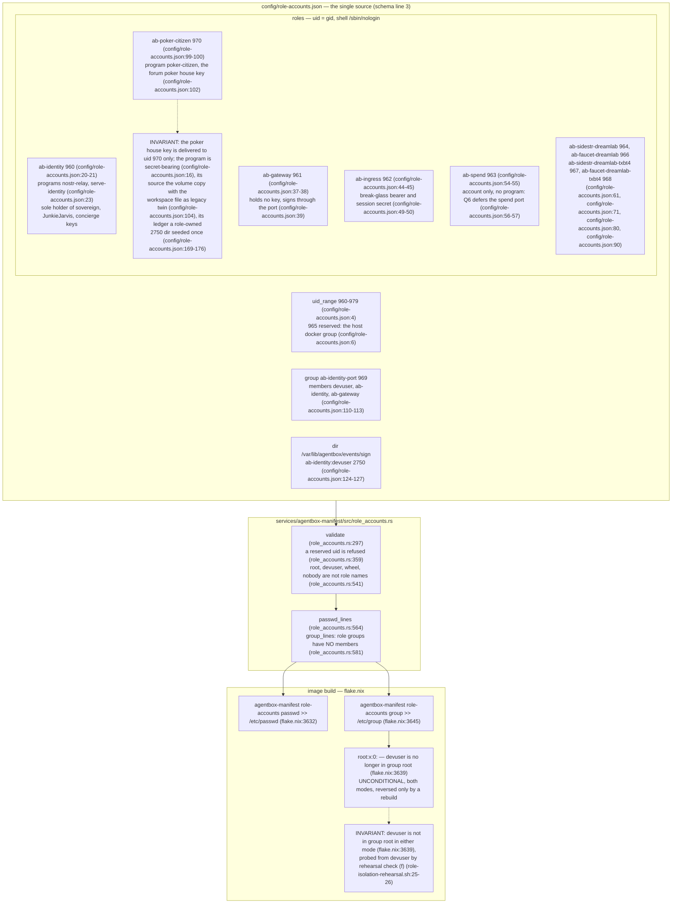
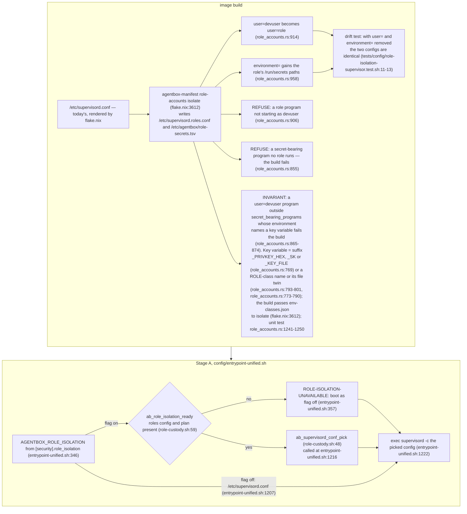
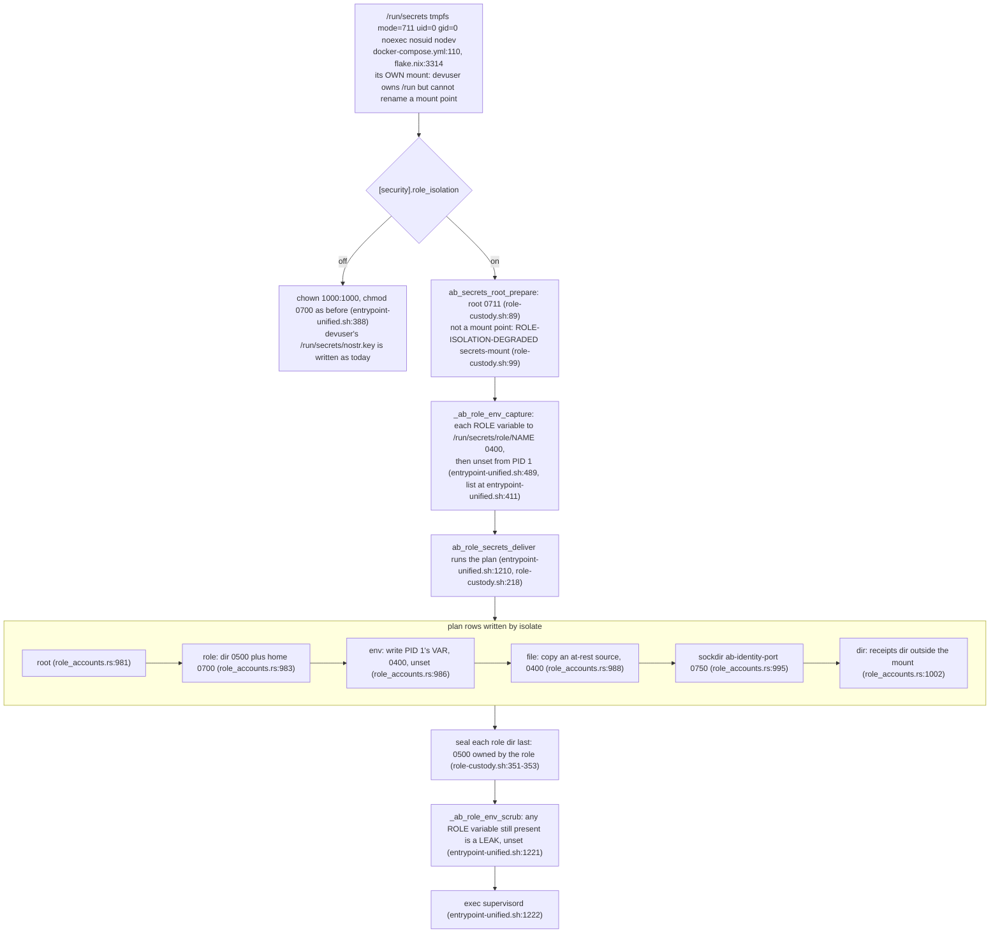
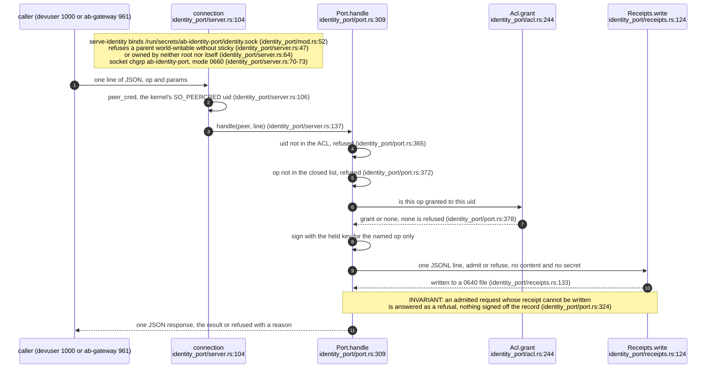
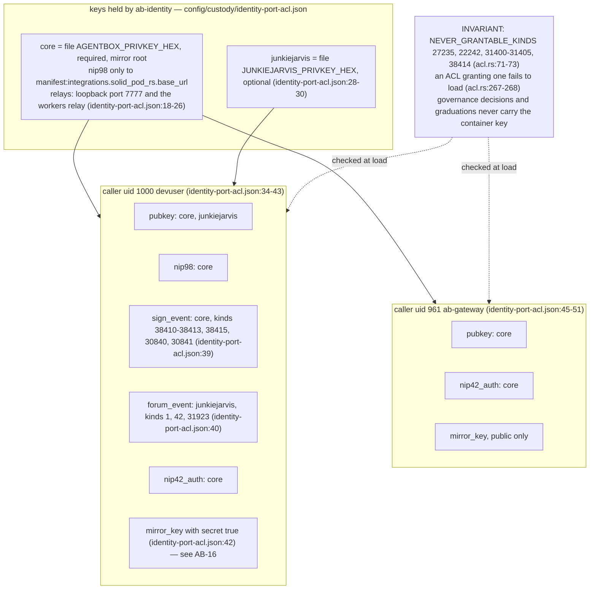
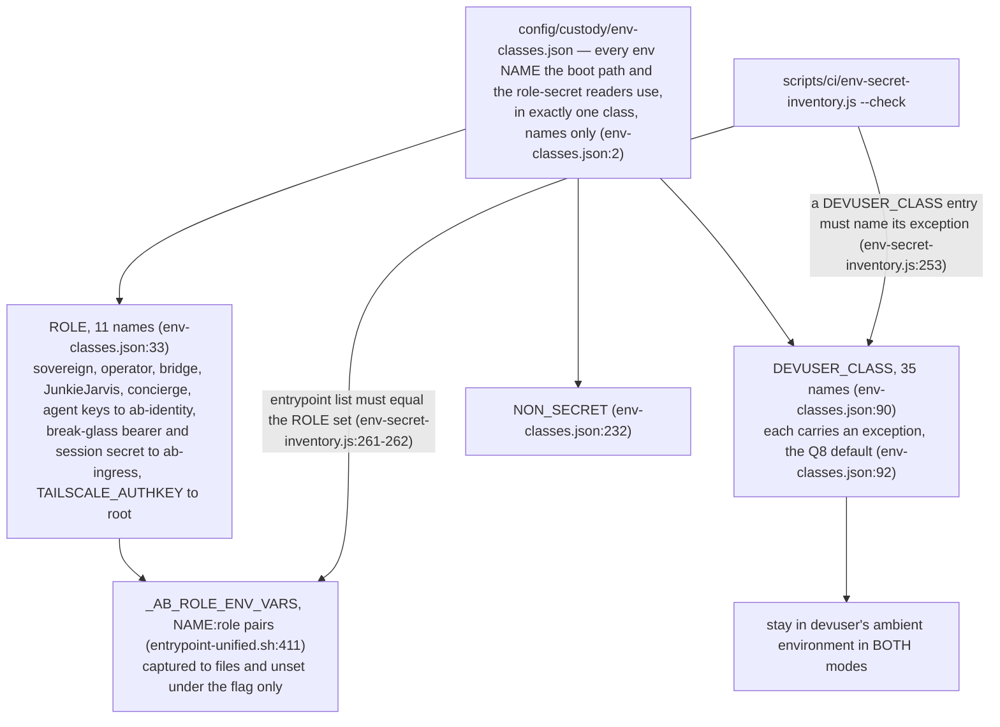
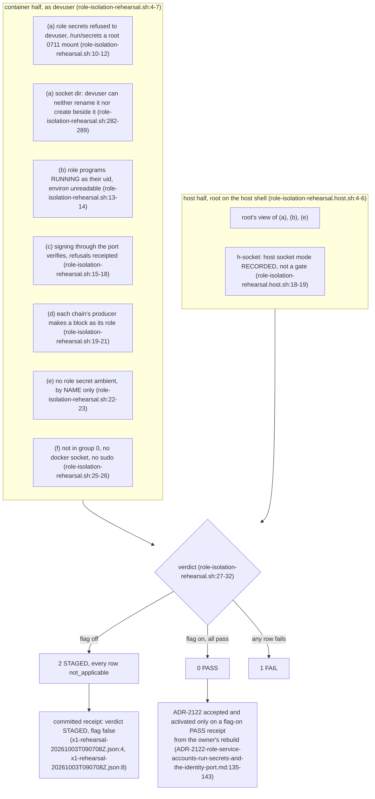

# Label ab-07

You are an independent labeller for a pre-registered experiment. Below are (1) a TOPIC: a Markdown file of Mermaid diagrams, with short prose notes, that document code, with `path:line` citations, where paths under `../project/` are in the VisionClaw repository and paths under `../project/agentbox/` are in the agentbox repository; and (2) a DIFF: one commit's changes in the agentbox repository, restricted to the files the topic lists under `sources:`. The topic was verified against a revision of that repository at or before this commit's parent, so the diff is a change made after the topic was written.

Answer exactly one question:

> **Did this change make anything this topic states wrong or misleading?**

Judge only from the two texts below; do not look anything else up. Reply with a single JSON object and nothing else:

```json
{"verdict": "yes" | "no", "statements": ["<diagram or section id>: <the statement, quoted>", ...], "line_anchors_only": true | false, "reason": "<one or two sentences>"}
```

`statements` lists every statement in the topic (a message, node, edge, guard, label or prose claim) that the change makes wrong or misleading; it is empty when the verdict is no. `line_anchors_only` is true when the only such statements are `path:line` anchors whose cited code merely moved.

## TOPIC (docs/diagrams/agentbox/36-role-isolation-and-identity-port.md)

````markdown
---
id: AB-36
title: Role isolation and the identity port
area: agentbox
governing:
  - ../project/agentbox/docs/adr/ADR-2122-role-service-accounts-run-secrets-and-the-identity-port.md
  - ../project/agentbox/docs/SECURITY-profiles.md
adrs: [ADR-2122, ADR-2027, ADR-2101, ADR-2078, ADR-2064]
sources:
  - ../project/agentbox/docs/adr/ADR-2122-role-service-accounts-run-secrets-and-the-identity-port.md
  - ../project/agentbox/config/role-accounts.json
  - ../project/agentbox/services/agentbox-manifest/src/role_accounts.rs
  - ../project/agentbox/flake.nix
  - ../project/agentbox/config/bake-devuser-privilege.sh
  - ../project/agentbox/docker-compose.yml
  - ../project/agentbox/docker-compose.override.yml
  - ../project/agentbox/agentbox.toml
  - ../project/agentbox/config/entrypoint-unified.sh
  - ../project/agentbox/config/lib/role-custody.sh
  - ../project/agentbox/config/custody/identity-port-acl.json
  - ../project/agentbox/config/custody/env-classes.json
  - ../project/agentbox/scripts/ci/env-secret-inventory.js
  - ../project/agentbox/services/nostr-pod-bridge/src/identity_port/mod.rs
  - ../project/agentbox/services/nostr-pod-bridge/src/identity_port/server.rs
  - ../project/agentbox/services/nostr-pod-bridge/src/identity_port/port.rs
  - ../project/agentbox/services/nostr-pod-bridge/src/identity_port/acl.rs
  - ../project/agentbox/services/nostr-pod-bridge/src/identity_port/receipts.rs
  - ../project/agentbox/scripts/activation/role-isolation-rehearsal.sh
  - ../project/agentbox/scripts/activation/role-isolation-rehearsal.host.sh
  - ../project/agentbox/tests/config/role-isolation-rehearsal.test.sh
  - ../project/agentbox/tests/config/role-isolation-supervisor.test.sh
  - ../project/agentbox/docs/estate-closeout/x1-rehearsal-20261003T090708Z.json
verified_commit: 8f55d9a435a1abdf6a2c77d362ba1379a8f2520f
---

## For developers

Until this change every secret in the container reached every process. Compose feeds `.env` to PID 1, supervisord passes its environment to every child, and every long-running program ran as devuser (uid 1000), so a 0600 key file protected nothing from a co-resident agent (AB-16.1, AB-16.7). ADR-2122 is X-1 step 1 of the custody programme (swarm `custody-isolation-2026-10-03`). It gives each secret-bearing role its own Unix account, delivers that role's secrets into a root-owned `/run/secrets/<role>/`, and moves the sovereign, operator and JunkieJarvis keys behind one process. That process, `nostr-pod-bridge serve-identity`, signs a closed set of named operations for callers it authorises by kernel peer uid. All of it sits behind `[security].role_isolation` (`agentbox.toml:2129`), which ships **false**. The flag is boot-class. The image always carries both supervisor configs, the accounts, the delivery plan and the port, and the entrypoint picks a shape at its final `exec`. With the flag off the boot is today's. Three changes ship unconditionally, because they close bypasses that would void any boundary: devuser leaves group `root`, the root boot `PATH` drops workspace paths and Stage B runs once per container start (AB-02), and `/run/secrets` becomes its own mount. A fourth bypass, the host Docker socket, only closes under the flag, and only fully once the host narrows the socket's mode (see the Open on AB-36.7).

This topic covers the accounts table, the two supervisor configs, the `/run/secrets` delivery, the identity port's transport, authorisation and receipts, the environment classes, and the activation rehearsal. Boot ordering is in AB-02, the manifest key in AB-05, the compose mount and the browser sidecar's own key (Podkey, K_browser) in AB-06, the secrets inventory and the mirror child key in AB-16, governance signing in AB-14, and the baked producer upstream in AB-34. Not read here: the pods signer cutover in `management-api/lib/pod-signer.js` (AB-14 and AB-16 cover it) and the per-op signing code inside `port.rs` beyond its dispatch. The design (custody design §2, the swarm's working document) is recorded in ADR-2122, which is `proposed` with `activation_status: inactive`. It may move only on a flag-on rehearsal receipt from the owner's rebuild.

## For the business

The assistant container holds keys that speak for the organisation: its Nostr identity, the forum house account, the payment chain's signing keys and the door's emergency credential. Until now any program in the container, including any AI agent's tool, could read all of them. One mistaken or compromised tool could therefore impersonate the organisation or move value. This change gives each of those keys a single owner. Only the program that needs a key can read it, and the identity keys never leave one dedicated signing service. Everyone else asks that service to sign for them. It signs only a fixed list of kinds of action and keeps a receipt of every decision. The agents keep working as before; they just no longer hold the keys. It is switched off today. It switches on only after the owner rebuilds the container and a rehearsal script proves every boundary from both sides. Two things remain outside its reach. Provider credentials (model APIs, GitHub and similar) stay with the agents by deliberate exception, because the agents are their users. And the host machine's Docker control socket has to be tightened on the host itself.

## AB-36.1 The accounts table: one uid per secret-bearing role, baked into the image



**What it shows.** One JSON table names every role, its uid, its programs and its secrets, and the image build turns it into `/etc/passwd` and `/etc/group` lines through a Rust subcommand that validates it first. The only shared group is the identity port's socket group. Role groups have no members, devuser included. **Why it is this way.** The rootfs is read-only and users are baked by Nix, so accounts cannot be switched at boot. They ship in both modes and are inert while the flag is off (ADR-2122 §1). uid 965 is skipped because a role with gid 965 would sit in the host Docker socket's group, and the Docker daemon is root on the host (`config/role-accounts.json:6`). Removing devuser from group `root` went first and alone, because no program documented a reason for the membership and only a rebuild reverses it.

## AB-36.2 Two supervisor configs from one transform, picked by the flag at exec



**What it shows.** The isolated config is a pure function of today's rendered config and the role table, computed at build time. It differs only in the role programs' `user=` and `environment=` lines, and the entrypoint chooses between the two configs at its last line. An image that lacks either artefact boots as if the flag were off, and says so loudly. **Why it is this way.** Making the flag boot-class rather than rebuild-class lets the owner flip it and roll it back with a restart (ADR-2122 §2). Deriving the second config instead of hand-writing it means the two cannot drift, and the build itself refuses a new secret-bearing program that has no role, so a new chain cannot ship without an account.

**Debt:** the design's `role-exec` launcher (environment clear, store-only `PATH`, umask 077) does not exist yet. The `only user= and environment= differ` contract is what keeps this step reviewable without it (`ADR-2122-role-service-accounts-run-secrets-and-the-identity-port.md:221-223`).

## AB-36.3 /run/secrets: its own root mount, one sealed directory per role



**What it shows.** Under the flag, Stage A turns every role secret into a 0400 file in a 0500 directory owned by its role, inside a mount only root can write. The variables it came from leave PID 1's environment before supervisord starts, so no child inherits them. With the flag off, the same mount is handed to devuser as before. **Why it is this way.** `/run` is a tmpfs owned by uid 1000, so devuser can rename anything directly under it, root's entries included. Only a separate mount point is safe (ADR-2122's correction, `ADR-2122-role-service-accounts-run-secrets-and-the-identity-port.md:328-335`). Delivery runs before supervisord, so no devuser process exists yet to race it, and it fails open with a counted, grep-able marker, leaving a role program with no secret to fail closed under supervisord (`config/lib/role-custody.sh:11-14`).

**Invariant:** under role_isolation, the runtime copy of each role secret is readable only by its role. The directory is sealed `0500` to the role (`config/lib/role-custody.sh:353`) inside a root `0711` mount (`docker-compose.yml:110`).

**Invariant (role_isolation vs the at-rest volume):** the flag confines the at-rest copies as well as the runtime ones. Under it the boot skips the devuser chown of the `agentbox-secrets` volume root (`config/entrypoint-unified.sh:548`) and calls `ab_custody_migrate` on the baked plan (`config/entrypoint-unified.sh:723`). The plan's `atrest` rows are every resolved file source plus each role's `at_rest` entries, and its `atrestdir` rows the table's `at_rest_dirs` (`role_accounts.rs:1011-1028`, `config/role-accounts.json:118-121`). `ab_custody_migrate` (`config/lib/role-custody.sh:447`) copies a missing canonical copy once from its legacy twin, hands every copy to its role at 0400 (`config/lib/role-custody.sh:556`) and each volume dir to root (`config/lib/role-custody.sh:567`); with the flag off `ab_custody_revert` (`config/lib/role-custody.sh:586`) hands them back (`config/entrypoint-unified.sh:725`). The faucets' sources are now the volume copies, the workspace files their legacy twins (`config/role-accounts.json:76`). Those twins are never deleted and stay devuser-readable by design until a manual purge (`ADR-2122-role-service-accounts-run-secrets-and-the-identity-port.md:212-215`).

## AB-36.4 The identity port: one request's life



**What it shows.** A caller writes one JSON line to a unix socket. The port takes the caller's uid from the kernel, not from anything the caller says, checks it against a static ACL and a closed operation list, signs only what the grant allows, and writes a receipt before it answers. A receipt that cannot be written turns an admission into a refusal. **Why it is this way.** ADR-2101 rules out a generic "sign this payload" port as a bypass, so the port offers named operations only. NIP-98 to a loopback HTTP port was rejected because the caller would need a key to sign the request, which brings back the key it must not hold (ADR-2122 §4). The existing Rust relay daemon became the service because it already loads the key and signs through an allowlist.

**Invariant:** authorisation is the peer uid from `SO_PEERCRED` (`services/nostr-pod-bridge/src/identity_port/server.rs:106`), never the socket mode. The socket group only narrows who can connect (`config/role-accounts.json:112`).

**Open (consumer cutover):** the pods signer moved to the port in W3, but JunkieJarvis, the live-mirror hook, the gateway and dream-engine are owed as W3b (`ADR-2122-role-service-accounts-run-secrets-and-the-identity-port.md:224-225`). Under the flag today the gateway holds no key and so signs nothing until then.

## AB-36.5 What each caller may ask for



**What it shows.** Two callers, each with an explicit list of operations, keys and, for raw event signing, kinds. Every other uid is refused before any parsing of the operation. Governance kinds, NIP-98 and NIP-42 kinds can never be reached through `sign_event`, because their dedicated operations carry URL and relay checks that a raw signature would bypass. **Why it is this way.** The ACL is keyed by numeric uid and loaded once at start, and a manifest reference that does not resolve grants nothing (`config/custody/identity-port-acl.json:12`). `dm_unwrap` is not an operation: decryption stays inside the relay process (ADR-2122, the port as built). The `mirror_key` grant to devuser returns the live-mirror child secret, which the design had specified as a `mirror_wrap` operation. That tension is recorded once, in AB-16.

## AB-36.6 Environment classes: what leaves PID 1 and what stays by exception



**What it shows.** The scrub is a denylist of role secrets, not an allowlist of the environment. Eleven names leave PID 1 under the flag. Thirty-five credentials stay in every devuser process by recorded exception. A CI check keeps the entrypoint's list and the table equal and refuses an exception without a reason. **Why it is this way.** A denylist leaves agent tooling working when the flag flips. The agents are the users of provider keys, so hiding those keys from devuser would break the agents and protect nothing (custody design §1, C8). Which of them should leave the ambient environment is owner question Q8, defaulted to "stay" for this step.

**Debt:** 35 DEVUSER_CLASS credentials, among them provider API keys, `BRIDGE_TOKEN` and `MANAGEMENT_API_KEY`, remain in the agent environment by exception Q8 (`config/custody/env-classes.json:90`, `config/custody/env-classes.json:92`, `ADR-2122-role-service-accounts-run-secrets-and-the-identity-port.md:158-159`).

## AB-36.7 The activation rehearsal: two halves, one receipt, flag still off



**What it shows.** The rehearsal decides whether the flag may stay on. Its container half probes as devuser and its host half probes as root. A flag-off run is STAGED, not PASS. The only receipt in the repository is a STAGED run with the flag off. **Why it is this way.** The flag removes root's view from inside the container, so positive probes (a role can read its own file) need the host, and negative probes (devuser cannot) need devuser. Rebuilds and activation belong to the owner. Agents stop at "staged", and peer agent messages are not approval (`ADR-2122-role-service-accounts-run-secrets-and-the-identity-port.md:142-143`).

**Open:** `role_isolation` ships off (`agentbox.toml:2129`) and is live only after the owner's boot rehearsal receipt. The decision is accepted only when both halves pass on a rebuilt image with the flag on, and `activation_status` moves only on that receipt (`ADR-2122-role-service-accounts-run-secrets-and-the-identity-port.md:135-143`). The committed receipt is STAGED with the flag false (`docs/estate-closeout/x1-rehearsal-20261003T090708Z.json:4`, `docs/estate-closeout/x1-rehearsal-20261003T090708Z.json:8`).

**Open (R2):** the host Docker socket inode stays world-accessible until the host chmods it. The socket is a bind of the host inode that earlier boots widened, and skipping the chmod under the flag does not narrow it (`docker-compose.override.yml:116-117`). The flag-on boot can only detect and record `degraded:docker-socket` (`config/entrypoint-unified.sh:605`). The host half records the mode for the owner without gating on it (`scripts/activation/role-isolation-rehearsal.host.sh:18-19`), while ADR-2122 counts `degraded:docker-socket` as a failure (`ADR-2122-role-service-accounts-run-secrets-and-the-identity-port.md:142`).

**Invariant:** the identity socket's directory cannot be renamed by devuser. It sits inside the root-owned `/run/secrets` mount (`docker-compose.yml:110`). Check (a) attempts the rename and a create beside it as devuser and passes only if both are refused (`scripts/activation/role-isolation-rehearsal.sh:282-289`). Test case 17 puts the directory under a devuser-writable parent, the `/run/agentbox` case, and shows (a) failing with the directory restored (`tests/config/role-isolation-rehearsal.test.sh:29-30`, `tests/config/role-isolation-rehearsal.test.sh:322`).

**Tension (sudoers vs the no-runtime-sudo design):** the sudo route now follows the BUILD-time flag, not the boot-time one. Built with `role_isolation` off, which is how it ships, the image keeps devuser in `wheel` (`../project/agentbox/flake.nix:3640`) and bakes a `NOPASSWD: ALL` drop-in (`../project/agentbox/config/bake-devuser-privilege.sh:44-47`, called at `../project/agentbox/flake.nix:3654`); built with it on, devuser leaves `wheel` and `root` and gets no drop-in (`../project/agentbox/config/bake-devuser-privilege.sh:29-39`). The same flake says the setuid wrapper is gone and there is no runtime escalation path (`../project/agentbox/flake.nix:968-973`). In the shipped image the grant is inert only because `no-new-privileges` is set (`../project/agentbox/docker-compose.yml:129`) and no setuid sudo ships, and an image built off but booted on records `degraded:devuser-sudo` rather than repairing it (`../project/agentbox/config/entrypoint-unified.sh:642`); check (f) probes `sudo -n true` (`../project/agentbox/scripts/activation/role-isolation-rehearsal.sh:591-592`). Reverting either guard on a flag-off build turns devuser back into root, past every role boundary in this topic.

**Drift (committed receipt vs rehearsal):** the committed receipt's uid table is "derived from /etc/agentbox.toml (design §2.2 numbering)" (`docs/estate-closeout/x1-rehearsal-20261003T090708Z.json:26`), from a run at an earlier commit (`docs/estate-closeout/x1-rehearsal-20261003T090708Z.json:16`). The rehearsal at this revision requires the baked table and plan, with no derived numbering (`scripts/activation/role-isolation-rehearsal.sh:41-43`). The receipt predates the rule it would now fail.
````

## DIFF

```diff
diff --git a/flake.nix b/flake.nix
index 8d617af5e..fd993b0a8 100644
--- a/flake.nix
+++ b/flake.nix
@@ -39,7 +39,7 @@
     # Pin the parent VisionClaw commit so the corpus door is reproducible and
     # cannot drift with a mutable branch.
     vaultSrc = {
-      url = "github:DreamLab-AI/VisionClaw/d33400fa6561efb08a0fdf015dde691252bd4835";
+      url = "github:DreamLab-AI/VisionClaw/f0ba2b2a54f2e64a567e5752e1720d74cc0b0b97";
       flake = false;
     };
```
