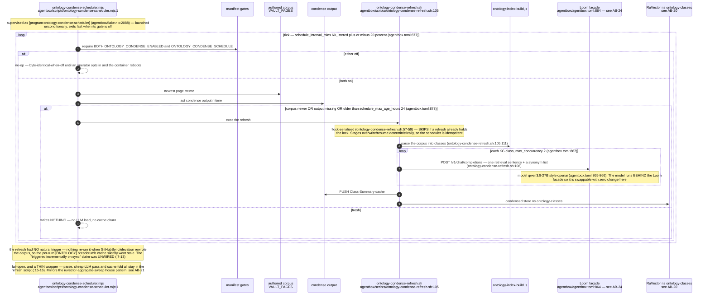
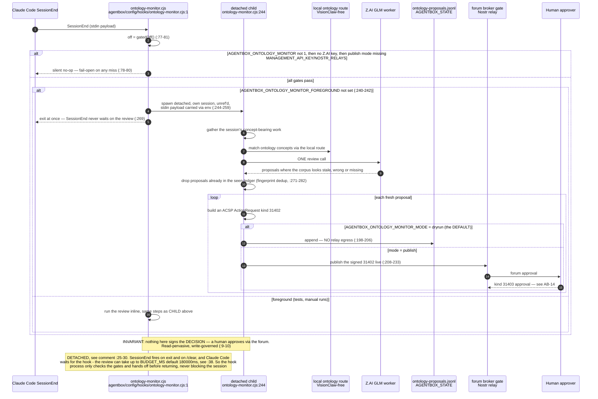
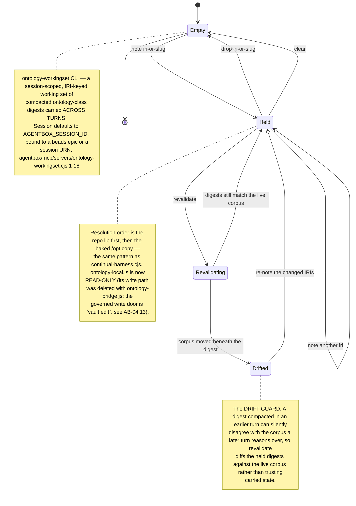
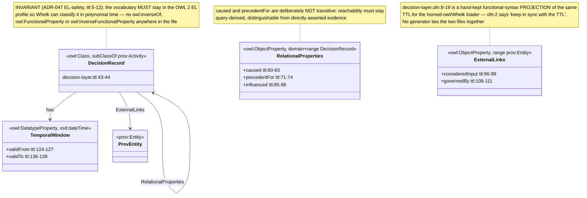
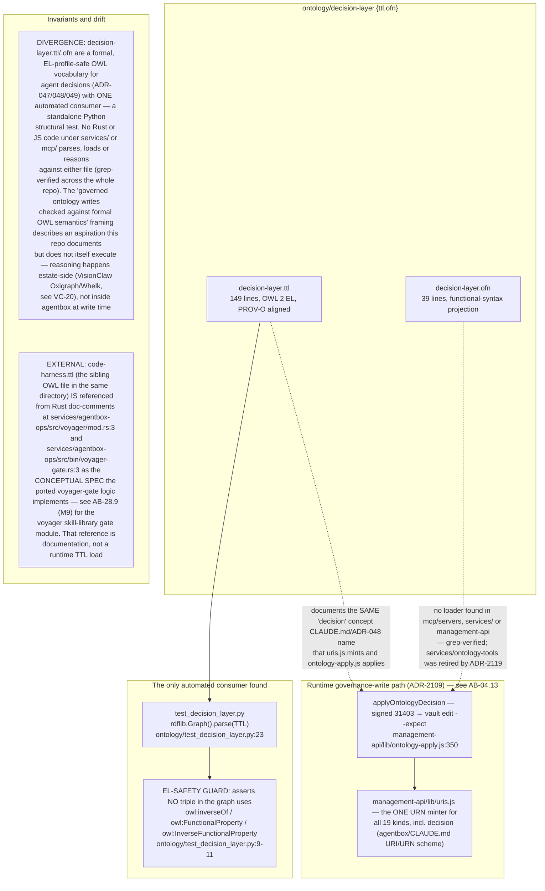

# Label ab-08

You are an independent labeller for a pre-registered experiment. Below are (1) a TOPIC: a Markdown file of Mermaid diagrams, with short prose notes, that document code, with `path:line` citations, where paths under `../project/` are in the VisionClaw repository and paths under `../project/agentbox/` are in the agentbox repository; and (2) a DIFF: one commit's changes in the agentbox repository, restricted to the files the topic lists under `sources:`. The topic was verified against a revision of that repository at or before this commit's parent, so the diff is a change made after the topic was written.

Answer exactly one question:

> **Did this change make anything this topic states wrong or misleading?**

Judge only from the two texts below; do not look anything else up. Reply with a single JSON object and nothing else:

```json
{"verdict": "yes" | "no", "statements": ["<diagram or section id>: <the statement, quoted>", ...], "line_anchors_only": true | false, "reason": "<one or two sentences>"}
```

`statements` lists every statement in the topic (a message, node, edge, guard, label or prose claim) that the change makes wrong or misleading; it is empty when the verdict is no. `line_anchors_only` is true when the only such statements are `path:line` anchors whose cited code merely moved.

## TOPIC (docs/diagrams/agentbox/25-ontology-tools-and-governed-writes.md)

````markdown
---
id: AB-25
title: Ontology tools and governed writes
area: agentbox
governing:
  - ../project/agentbox/docs/GOVERNANCE-capabilities.md
adrs: [ADR-2022, ADR-2023, ADR-2028, ADR-2054]
sources:
  - ../project/agentbox/mcp/servers/ontology-workingset.cjs
  - ../project/agentbox/scripts/ontology-condense-scheduler.mjs
  - ../project/agentbox/scripts/ontology-condense-refresh.sh
  - ../project/agentbox/config/hooks/ontology-monitor.cjs
  - ../project/agentbox/agentbox.toml
  - ../project/agentbox/flake.nix
  - ../project/agentbox/ontology/decision-layer.ttl
  - ../project/agentbox/ontology/decision-layer.ofn
  - ../project/agentbox/ontology/test_decision_layer.py
  - ../project/agentbox/services/agentbox-ops/src/bin/voyager-gate.rs
  - ../project/agentbox/services/agentbox-ops/src/voyager/mod.rs
  - ../project/agentbox/management-api/lib/uris.js
  - ../project/agentbox/management-api/lib/ontology-apply.js
verified_commit: 5ab197a9d49e9721b85b791bf9efe30842c9e047
---

Note: `ontology-bridge.js`, `ontology-propose.js`, `ontology-local.cjs`, `ontology-authoring-authority.js`
and `vault-frontmatter.js` — the whole MCP-tool authoring-authority surface this topic previously covered
(AB-25.1–.6, .10) — are deleted. The governed write door is now `vault edit --expect`, reached from a signed
kind-31403 forum decision through `applyOntologyDecision` (`management-api/lib/ontology-apply.js`); see
**AB-04.13** for the full sequence and **AB-14** for the 31402/31403 forum round-trip that precedes it.

## AB-25.7 Condensation index — the staleness scheduler



## AB-25.8 ontology-monitor — SessionEnd governed elevation



## AB-25.9 Session working set and the drift guard



## AB-25.11 The Decision Layer OWL vocabulary — a formal schema with no runtime consumer



## AB-25.12 Where this vocabulary is actually exercised — and where it is not


````

## DIFF

```diff
diff --git a/agentbox.toml b/agentbox.toml
index e77a4d8d6..e06979756 100644
--- a/agentbox.toml
+++ b/agentbox.toml
@@ -1895,7 +1895,6 @@ codex = true
 opencode = true
 code_server = true
 cuda = true
-ruflo_console = false  # ruflo's Claude Code mods (function hooks), baked from the pinned ruflo v3.51.1 tag (flake input rufloConsole): ruflo-console (the /ruflo cockpit) + ruflo-mods (/ruflo mods) + ruflo-swarm (/ruflo swarm …) in the `agentbox` marketplace, userConfig cli=ruflo (the baked bin; also pulls in the ruflo closure). Rebuild-class; needs Claude Code >= 2.1.287. Off = the three ids are unregistered at boot
 
 # ── Plugins (ruflo/claude-flow plugin system) ────────────────────────────────
 # Plugins are installed into $HOME/.claude-flow/plugins/ at container boot
```
