# Label ab-09

You are an independent labeller for a pre-registered experiment. Below are (1) a TOPIC: a Markdown file of Mermaid diagrams, with short prose notes, that document code, with `path:line` citations, where paths under `../project/` are in the VisionClaw repository and paths under `../project/agentbox/` are in the agentbox repository; and (2) a DIFF: one commit's changes in the agentbox repository, restricted to the files the topic lists under `sources:`. The topic was verified against a revision of that repository at or before this commit's parent, so the diff is a change made after the topic was written.

Answer exactly one question:

> **Did this change make anything this topic states wrong or misleading?**

Judge only from the two texts below; do not look anything else up. Reply with a single JSON object and nothing else:

```json
{"verdict": "yes" | "no", "statements": ["<diagram or section id>: <the statement, quoted>", ...], "line_anchors_only": true | false, "reason": "<one or two sentences>"}
```

`statements` lists every statement in the topic (a message, node, edge, guard, label or prose claim) that the change makes wrong or misleading; it is empty when the verdict is no. `line_anchors_only` is true when the only such statements are `path:line` anchors whose cited code merely moved.

## TOPIC (docs/diagrams/agentbox/23-dream-engine.md)

````markdown
---
id: AB-23
title: Dream machine — nightly cycle, gates and acceptance path
area: agentbox
governing:
  - ../project/agentbox/docs/GOVERNANCE-capabilities.md
adrs: [ADR-2024, ADR-2053, ADR-2071, ADR-2081, ADR-2084, ADR-2087, ADR-2122]
sources:
  - ../project/agentbox/services/dream-engine/src/engine.rs
  - ../project/agentbox/services/dream-engine/src/config.rs
  - ../project/agentbox/services/dream-engine/src/gate.rs
  - ../project/agentbox/services/dream-engine/src/verdict.rs
  - ../project/agentbox/services/dream-engine/src/runner.rs
  - ../project/agentbox/services/dream-engine/src/dispatch.rs
  - ../project/agentbox/services/dream-engine/src/runstate.rs
  - ../project/agentbox/services/dream-engine/src/readiness.rs
  - ../project/agentbox/services/dream-engine/src/manifest.rs
  - ../project/agentbox/services/dream-engine/src/receipts.rs
  - ../project/agentbox/services/dream-engine/src/candidate.rs
  - ../project/agentbox/services/dream-engine/src/persist.rs
  - ../project/agentbox/services/dream-engine/src/roster.rs
  - ../project/agentbox/dream.config.json
  - ../project/agentbox/agentbox.toml
  - ../project/agentbox/flake.nix
  - ../project/agentbox/config/hooks/dream-inbox-surface.cjs
  - ../project/agentbox/management-api/routes/dream.js
  - ../project/agentbox/management-api/lib/dream-ledger.js
  - ../project/agentbox/skills/dream-machine/commands/dream.md
  - ../project/agentbox/config/entrypoint-unified.sh
  - ../project/agentbox/services/dream-engine/src/ledger.rs
  - ../project/agentbox/services/dream-engine/src/llm.rs
  - ../project/agentbox/management-api/lib/action-plane.js
  - ../project/agentbox/scripts/dream-forum-suggestions.mjs
  - ../project/agentbox/scripts/dream-harvest.mjs
  - ../project/agentbox/scripts/dream-hooks-syntax.sh
  - ../project/agentbox/scripts/dream-inbox.mjs
  - ../project/agentbox/scripts/dream-machine-nightly.mjs
  - ../project/agentbox/services/dream-engine/src/digest.rs
  - ../project/agentbox/services/dream-engine/src/governance.rs
  - ../project/agentbox/services/dream-engine/src/inbox.rs
  - ../project/agentbox/services/dream-engine/src/relay.rs
  - ../project/agentbox/management-api/lib/role-secret.js
  - ../project/agentbox/config/custody/identity-port-acl.json
  - ../project/agentbox/services/nostr-pod-bridge/src/identity_port/acl.rs
  - ../project/agentbox/docs/adr/ADR-2122-role-service-accounts-run-secrets-and-the-identity-port.md
  - ../project/agentbox/services/dream-engine/src/main.rs
  - ../project/agentbox/services/dream-engine/src/journal.rs
  - ../project/agentbox/services/dream-engine/src/sweep.rs
  - ../project/agentbox/services/dream-engine/src/compile.rs
  - ../project/agentbox/management-api/routes/exec-record.js
  - ../project/agentbox/docs/GOVERNANCE-capabilities.md
  - ../project/agentbox/scripts/activation/adr-2071-api-down-night.sh
  - ../project/agentbox/skills/podcast-knowledge-ingest/crontab
  - ../project/agentbox/docs/adr/ADR-2071-journal-the-nightly-dream-cycle.md
verified_commit: d03defbeaca6c52d6bf3f7338d3f465a109fcdbf
---

## AB-23.1 One repo-night — run phases

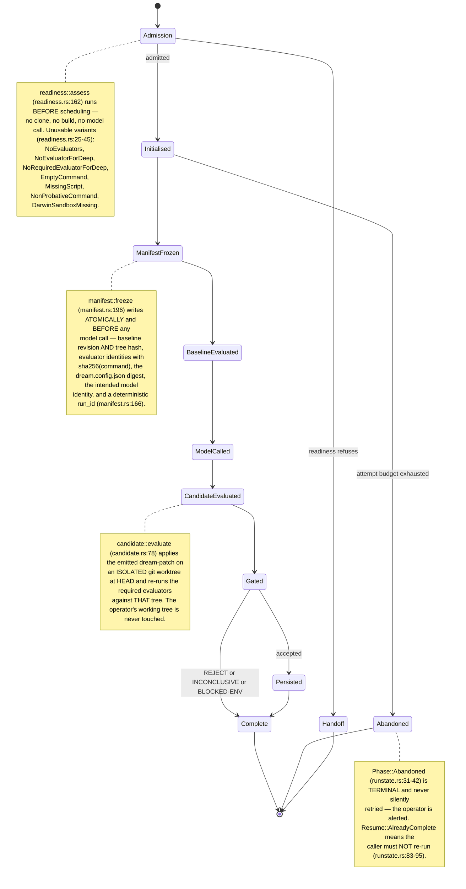
```mermaid
stateDiagram-v2
    [*] --> Admission
    Admission --> Handoff : readiness refuses
    note right of Admission
        readiness::assess (readiness.rs:162) runs BEFORE scheduling —
        no clone, no build, no model call. Unusable variants (readiness.rs:25-45):
        NoEvaluators, NoEvaluatorForDeep, NoRequiredEvaluatorForDeep,
        EmptyCommand, MissingScript, NonProbativeCommand, DarwinSandboxMissing.
    end note
    Admission --> Initialised : admitted
    Initialised --> ManifestFrozen
    note right of ManifestFrozen
        manifest::freeze (manifest.rs:196) writes ATOMICALLY and BEFORE any
        model call — baseline revision AND tree hash, evaluator identities with
        sha256(command), the dream.config.json digest, the intended model
        identity, and a deterministic run_id (manifest.rs:166).
    end note
    ManifestFrozen --> BaselineEvaluated
    BaselineEvaluated --> ModelCalled
    ModelCalled --> CandidateEvaluated
    note right of CandidateEvaluated
        candidate::evaluate (candidate.rs:78) applies the emitted dream-patch on
        an ISOLATED git worktree at HEAD and re-runs the required evaluators
        against THAT tree. The operator's working tree is never touched.
    end note
    CandidateEvaluated --> Gated
    Gated --> Persisted : accepted
    Gated --> Complete : REJECT or INCONCLUSIVE or BLOCKED-ENV
    Persisted --> Complete
    Complete --> [*]
    Initialised --> Abandoned : attempt budget exhausted
    note right of Abandoned
        Phase::Abandoned (runstate.rs:31-42) is TERMINAL and never silently
        retried — the operator is alerted. Resume::AlreadyComplete means the
        caller must NOT re-run (runstate.rs:83-95).
    end note
    Abandoned --> [*]
    Handoff --> [*]
```

## AB-23.2 Nightly cycle — every gate as a branch

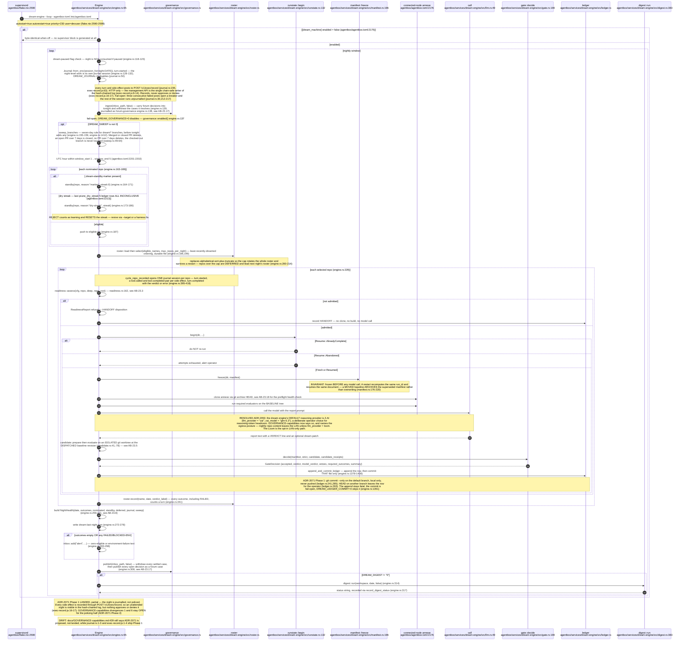
```mermaid
sequenceDiagram
    autonumber
    participant SUP as supervisord<br/>agentbox/flake.nix:2590
    participant ENG as Engine<br/>agentbox/services/dream-engine/src/engine.rs:65
    participant GOV as governance<br/>agentbox/services/dream-engine/src/governance.rs
    participant ROS as roster<br/>agentbox/services/dream-engine/src/roster.rs
    participant RS as runstate::begin<br/>agentbox/services/dream-engine/src/runstate.rs:132
    participant MAN as manifest::freeze<br/>agentbox/services/dream-engine/src/manifest.rs:196
    participant HP as connected-node annexe<br/>agentbox/agentbox.toml:2176
    participant LLM as call<br/>agentbox/services/dream-engine/src/llm.rs:49
    participant GATE as gate::decide<br/>agentbox/services/dream-engine/src/gate.rs:190
    participant LED as ledger<br/>agentbox/services/dream-engine/src/ledger.rs
    participant DIG as digest::run<br/>agentbox/services/dream-engine/src/digest.rs:383

    SUP->>ENG: dream-engine --loop --agentbox-toml /etc/agentbox.toml
    Note over SUP,ENG: autostart=true autorestart=true priority=230 user=devuser (flake.nix:2590-2599)
    alt [dream_machine] enabled = false (agentbox/agentbox.toml:2175)
        ENG-->>SUP: byte-identical-when-off — no supervisor block is generated at all
    else enabled
        loop nightly window
            ENG->>ENG: dream-paused flag check — night is NOT consumed if paused (engine.rs:118-123)
            ENG->>ENG: Journal::from_env(session_for(night-DATE)), turn.started — the<br/>night-level work is its own journal session (engine.rs:128-132),<br/>DREAM_JOURNAL=0 disables (journal.rs:50)
            Note over ENG,GOV: every turn and side effect posts to POST /v1/exec/record (journal.rs:235,<br/>exec-record.js:63). HTTP only — the management API is the single chain-safe writer of<br/>the hash-chained log (exec-record.js:9-14). Records, never approves or denies<br/>(exec-record.js:16-17). Fail-open: three consecutive failed posts open a breaker and<br/>the rest of the session runs unjournalled (journal.rs:30,212-217)
            ENG->>GOV: ingest(inbox_path, false) — carry forum decisions into<br/>tonight and withdraw the cases it resolves (engine.rs:139,<br/>journalled as forum.governance engine.rs:138, see AB-23.17)
            Note over ENG,GOV: fail-open, DREAM_GOVERNANCE=0 disables — governance::enabled() engine.rs:137
            opt DREAM_SWEEP is not 0
                ENG->>ENG: sweep_branches — seven-day rule for dream/* branches, before tonight<br/>adds any (engine.rs:155-159, engine.rs:1412). Merged or closed PR deletes,<br/>an open PR over 7 days is closed, no PR over 7 days deletes, the checked-out<br/>branch is never touched (sweep.rs:49-64)
            end
            ENG->>ENG: UTC hour within window_start 1 .. window_end 5 (agentbox.toml:2201-2202)
            loop each nominated repo (engine.rs:163-189)
                alt .dream-standby marker present
                    ENG->>ENG: standby{repo, reason:"marker", streak:0} (engine.rs:164-171)
                else dry streak — last prune_dry_streak 5 ledger rows ALL INCONCLUSIVE (agentbox.toml:2213)
                    ENG->>ENG: standby{repo, reason:"dry-streak", streak} (engine.rs:173-186)
                    Note over ENG: REJECT counts as learning and RESETS the streak — revive via --target or a harness fix
                else eligible
                    ENG->>ENG: push to eligible list (engine.rs:187)
                end
            end
            ENG->>ROS: roster::load then select(eligible_names, max_repos_per_night) — least-recently-dreamed<br/>ordering, durable file (engine.rs:196,199)
            Note over ROS: replaces alphabetical-sort-plus-truncate so the cap rotates the whole roster and<br/>survives a restart — repos over the cap are DEFERRED and lead next night's roster (engine.rs:200-214)
            loop each selected repo (engine.rs:229)
                Note over ENG,ROS: cycle_repo_recorded opens ONE journal session per repo — turn.started,<br/>a tool.called and tool.completed pair per side effect, turn.completed<br/>with the verdict or error (engine.rs:395-418)
                ENG->>ENG: readiness::assess(cfg, repo, deep, repo_root) — readiness.rs:162, see AB-23.3
                alt not admitted
                    ENG->>ENG: ReadinessReport refusal — HANDOFF disposition
                    ENG->>LED: record HANDOFF — no clone, no build, no model call
                else admitted
                    ENG->>RS: begin(dir, ...)
                    alt Resume::AlreadyComplete
                        RS-->>ENG: do NOT re-run
                    else Resume::Abandoned
                        RS-->>ENG: attempts exhausted, alert operator
                    else Fresh or Resumed
                        ENG->>MAN: freeze(dir, manifest)
                        Note over MAN: INVARIANT: frozen BEFORE any model call. A restart recomputes the same run_id and<br/>resumes the same document — a MOVED baseline ARCHIVES the superseded manifest rather<br/>than overwriting (manifest.rs:176-220)
                        ENG->>HP: clone annexe via git archive HEAD, see AB-23.18 for the preflight health check
                        ENG->>HP: run required evaluators on the BASELINE tree
                        ENG->>LLM: call the model with the report prompt
                        Note over ENG,LLM: RESOLVED ADR-2053: the dream engine's DEFAULT reasoning provider is Z.AI<br/>(llm_provider = "zai", zai_model = "glm-5.3"), a deliberate operator choice for<br/>reasoning-token headroom. GOVERNANCE-capabilities now says so, and names the<br/>egress posture — nightly repo content leaves the LAN unless llm_provider = loom.<br/>The Loom is the opt-in LAN-only path.
                        LLM-->>ENG: report text with a VERDICT line and an optional dream-patch
                        ENG->>ENG: candidate::prepare then evaluate on an ISOLATED git worktree at the<br/>DISPATCHED baseline revision (candidate.rs:41,:78) — see AB-23.5
                        ENG->>GATE: decide(manifest, strict, candidate, candidate_receipts)
                        GATE-->>ENG: GateDecision {accepted, verdict, model_verdict, vetoes, required_outcomes, summary}
                        ENG->>LED: append_and_commit_ledger — append the row, then commit<br/>THAT file only (engine.rs:1378-1408)
                        Note over ENG,LED: ADR-2071 Phase 1: git commit --only on the default branch, local only,<br/>never pushed (ledger.rs:241,285). HEAD on another branch leaves the row<br/>for the operator (ledger.rs:263). The append stays fatal, the commit is<br/>fail-open, DREAM_LEDGER_COMMIT=0 skips it (engine.rs:1391)
                    end
                end
                ENG->>ROS: roster.record(name, date, verdict_label) — every outcome, including FAILED,<br/>counts a turn (engine.rs:241)
            end
            ENG->>ENG: build NightHealth{date, outcomes, nominated, standby, deferred, journal, sweep}<br/>(engine.rs:256-271, see AB-23.8)
            ENG->>ENG: write dream-last-night.json (engine.rs:272-278)
            alt outcomes empty OR any FAILED/BLOCKED-ENV
                ENG->>ENG: inbox::add("alert", ...) — zero-eligible or environment-failure text<br/>(engine.rs:283-298)
            end
            ENG->>GOV: publish(inbox_path, false) — withdraw every settled case,<br/>then publish every open decision as a forum case<br/>(engine.rs:308, see AB-23.17)
            alt DREAM_DIGEST != "0"
                ENG->>DIG: digest::run(workspace, date, false) (engine.rs:314)
                DIG-->>ENG: status string, recorded via record_digest_status (engine.rs:317)
            end
        end
    end
    Note over ENG: ADR-2071 Phase 1 LANDED, partial — the night is journalled, not policed.<br/>Every side effect is recorded through POST /v1/exec/record, so an unattended<br/>night is visible in the hash-chained log, but nothing approves or denies it<br/>(exec-record.js:16-17). GOVERNANCE-capabilities divergences 1 and 6 stay OPEN<br/>for the policing half (ADR-2071 Phase 2)
    Note over ENG: DRIFT: docs/GOVERNANCE-capabilities.md:439 still says ADR-2071 is<br/>proposed, not landed, while journal.rs:1-3 and exec-record.js:1-4 ship Phase 1
```

## AB-23.3 Evaluator-readiness admission — refusal before scheduling

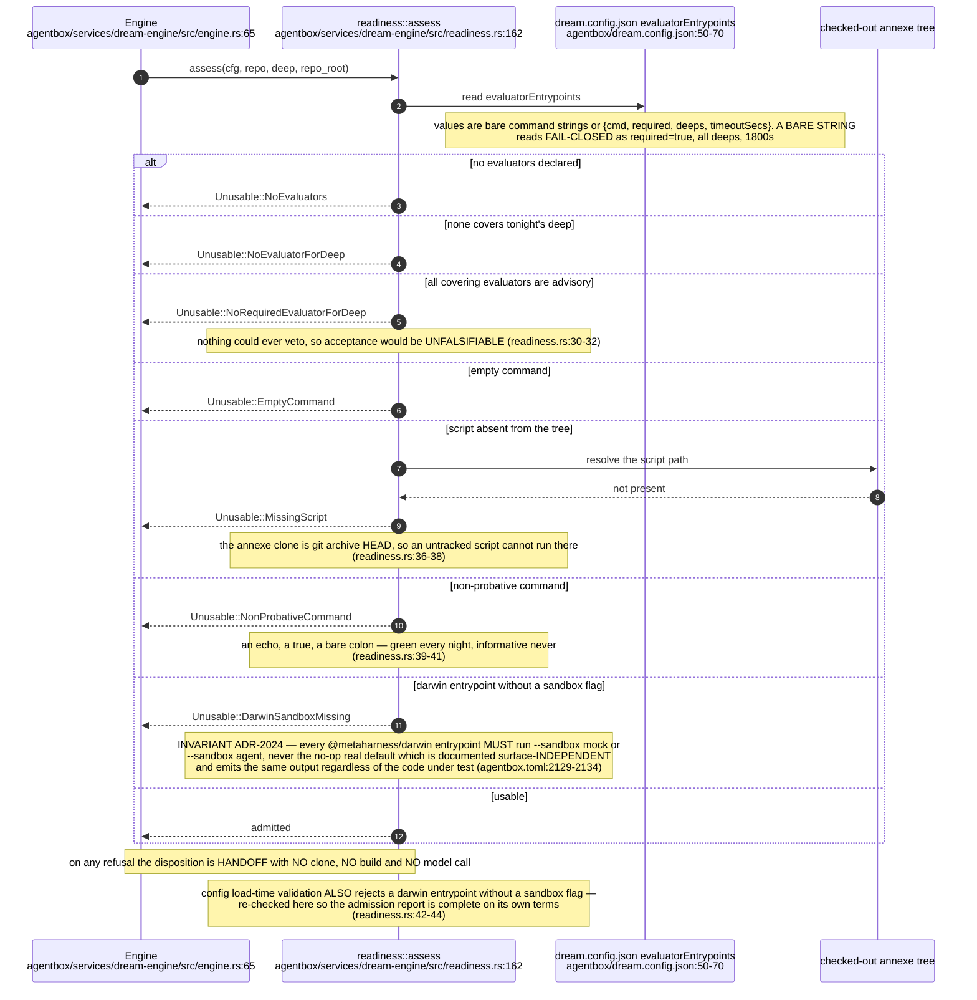
```mermaid
sequenceDiagram
    autonumber
    participant ENG as Engine<br/>agentbox/services/dream-engine/src/engine.rs:65
    participant RDY as readiness::assess<br/>agentbox/services/dream-engine/src/readiness.rs:162
    participant CFG as dream.config.json evaluatorEntrypoints<br/>agentbox/dream.config.json:50-70
    participant TREE as checked-out annexe tree

    ENG->>RDY: assess(cfg, repo, deep, repo_root)
    RDY->>CFG: read evaluatorEntrypoints
    Note over CFG: values are bare command strings or {cmd, required, deeps, timeoutSecs}. A BARE STRING<br/>reads FAIL-CLOSED as required=true, all deeps, 1800s
    alt no evaluators declared
        RDY-->>ENG: Unusable::NoEvaluators
    else none covers tonight's deep
        RDY-->>ENG: Unusable::NoEvaluatorForDeep
    else all covering evaluators are advisory
        RDY-->>ENG: Unusable::NoRequiredEvaluatorForDeep
        Note over RDY: nothing could ever veto, so acceptance would be UNFALSIFIABLE (readiness.rs:30-32)
    else empty command
        RDY-->>ENG: Unusable::EmptyCommand
    else script absent from the tree
        RDY->>TREE: resolve the script path
        TREE-->>RDY: not present
        RDY-->>ENG: Unusable::MissingScript
        Note over RDY: the annexe clone is git archive HEAD, so an untracked script cannot run there<br/>(readiness.rs:36-38)
    else non-probative command
        RDY-->>ENG: Unusable::NonProbativeCommand
        Note over RDY: an echo, a true, a bare colon — green every night, informative never<br/>(readiness.rs:39-41)
    else darwin entrypoint without a sandbox flag
        RDY-->>ENG: Unusable::DarwinSandboxMissing
        Note over RDY: INVARIANT ADR-2024 — every @metaharness/darwin entrypoint MUST run --sandbox mock or<br/>--sandbox agent, never the no-op real default which is documented surface-INDEPENDENT<br/>and emits the same output regardless of the code under test (agentbox.toml:2129-2134)
    else usable
        RDY-->>ENG: admitted
    end
    Note over ENG,RDY: on any refusal the disposition is HANDOFF with NO clone, NO build and NO model call
    Note over RDY: config load-time validation ALSO rejects a darwin entrypoint without a sandbox flag —<br/>re-checked here so the admission report is complete on its own terms<br/>(readiness.rs:42-44)
```

## AB-23.4 The deterministic required-check gate

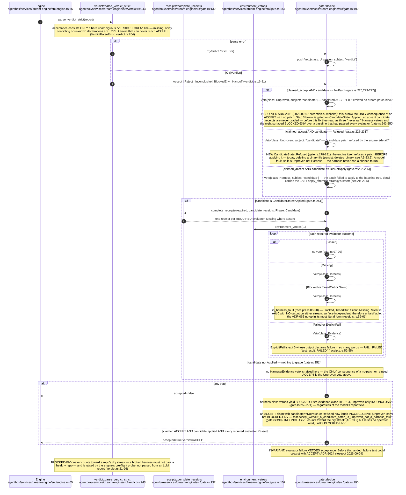
```mermaid
sequenceDiagram
    autonumber
    participant ENG as Engine<br/>agentbox/services/dream-engine/src/engine.rs:65
    participant VP as verdict::parse_verdict_strict<br/>agentbox/services/dream-engine/src/verdict.rs:243
    participant CR as receipts::complete_receipts<br/>agentbox/services/dream-engine/src/gate.rs:132
    participant EV as environment_vetoes<br/>agentbox/services/dream-engine/src/gate.rs:157
    participant G as gate::decide<br/>agentbox/services/dream-engine/src/gate.rs:190

    ENG->>VP: parse_verdict_strict(report)
    Note over VP: acceptance consults ONLY a bare unambiguous "VERDICT: TOKEN" line — missing, noisy,<br/>conflicting or unknown declarations are TYPED errors that can never reach ACCEPT<br/>(VerdictParseError, verdict.rs:204)
    alt parse error
        VP-->>G: Err(VerdictParseError)
        G->>G: push Veto{class: Unproven, subject: "verdict"}
    else Ok(Verdict)
        VP-->>G: Accept | Reject | Inconclusive | BlockedEnv | Handoff (verdict.rs:16-31)
    end
    alt claimed_accept AND candidate == NoPatch (gate.rs:220,223-227)
        G->>G: Veto{class: Unproven, subject: "candidate"} — "declared ACCEPT but emitted no dream-patch block"
        Note over G: RESOLVED ADR-2081 (2026-09-07 dreamlab-ai-website): this is now the ONLY consequence of an<br/>ACCEPT with no patch. Step 3 below is gated on CandidateState::Applied, so absent candidate<br/>receipts are never graded — before this fix they read as three "never ran" Harness vetoes and<br/>the night surfaced BLOCKED-ENV over a baseline that had passed every evaluator (gate.rs:243-250)
    else claimed_accept AND candidate == Refused (gate.rs:228-231)
        G->>G: Veto{class: Unproven, subject: "candidate"} — "candidate patch refused by the engine: {detail}"
        Note over G: NEW CandidateState::Refused (gate.rs:178-181): the engine itself refuses a patch BEFORE<br/>applying it — today, deleting a binary file (persist::deletes_binary, see AB-23.5). A model<br/>fault, so it is Unproven not Harness — the harness never had a chance to run
    else claimed_accept AND candidate == DidNotApply (gate.rs:232-235)
        G->>G: Veto{class: Harness, subject: "candidate"} — the patch failed to apply to the baseline tree, detail<br/>carries the LAST apply_attempts strategy's stderr (see AB-23.5)
    end
    alt candidate is CandidateState::Applied (gate.rs:251)
        G->>CR: complete_receipts(required, candidate_receipts, Phase::Candidate)
        CR-->>G: one receipt per REQUIRED evaluator, Missing where absent
        G->>EV: environment_vetoes(...)
        loop each required evaluator outcome
            alt Passed
                G->>G: no veto (gate.rs:97-99)
            else Missing
                G->>G: Veto{class: Harness}
            else Blocked or TimedOut or Silent
                G->>G: Veto{class: Harness}
                Note over G: is_harness_fault (receipts.rs:88-98) — Blocked, TimedOut, Silent, Missing. Silent is<br/>exit 0 with NO output on either stream: surface-independent, therefore unfalsifiable,<br/>the ADR-065 no-op in its most literal form (receipts.rs:59-61)
            else Failed or ExplicitFail
                G->>G: Veto{class: Evidence}
                Note over G: ExplicitFail is exit 0 whose output declares failure in so many words — FAIL:, FAILED,<br/>"test result: FAILED" (receipts.rs:52-55)
            end
        end
    else candidate not Applied — nothing to grade (gate.rs:251)
        Note over G: no Harness/Evidence veto is raised here — the ONLY consequence of a no-patch or refused<br/>ACCEPT is the Unproven veto above
    end
    alt any veto
        G-->>ENG: accepted=false
        Note over G: harness-class vetoes yield BLOCKED-ENV, evidence-class REJECT, unproven-only INCONCLUSIVE<br/>(gate.rs:259-274) — regardless of the model's report text
        Note over G: an ACCEPT claim with candidate==NoPatch or Refused now lands INCONCLUSIVE (unproven-only),<br/>not BLOCKED-ENV — test accept_without_a_candidate_patch_is_unproven_not_a_harness_fault<br/>(gate.rs:490). INCONCLUSIVE counts toward the dry streak (AB-23.2) but raises no operator<br/>alert, unlike BLOCKED-ENV
    else claimed ACCEPT AND candidate applied AND every required evaluator Passed
        G-->>ENG: accepted=true verdict=ACCEPT
    end
    Note over G: INVARIANT: evaluator failure VETOES acceptance. Before this landed, failure text could<br/>coexist with ACCEPT (ADR-2024 closeout 2026-09-04)
    Note over VP: BLOCKED-ENV never counts toward a repo's dry streak — a broken harness must not park a<br/>healthy repo — and is raised by the engine's pre-flight probe, not parsed from an LLM<br/>report (verdict.rs:21-26)
```

## AB-23.5 Candidate re-evaluation on an isolated worktree

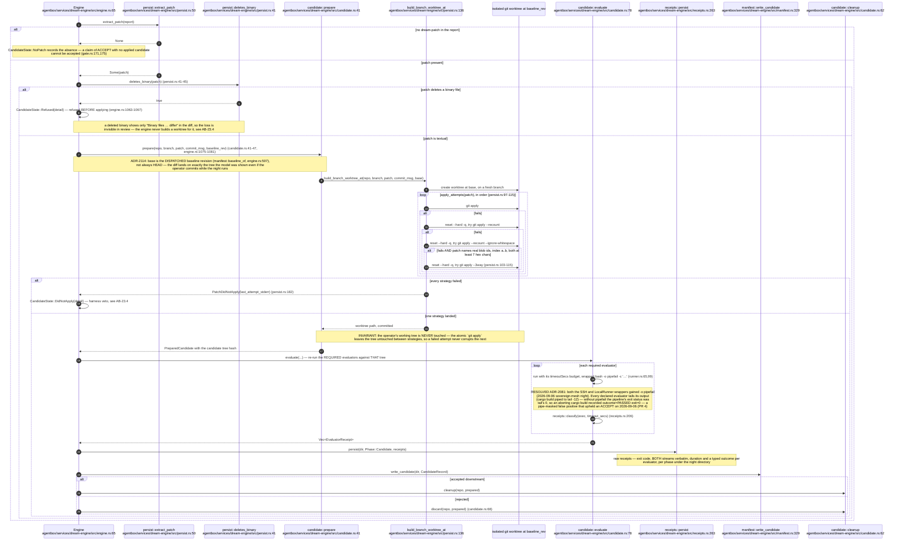
```mermaid
sequenceDiagram
    autonumber
    participant ENG as Engine<br/>agentbox/services/dream-engine/src/engine.rs:65
    participant PP as persist::extract_patch<br/>agentbox/services/dream-engine/src/persist.rs:50
    participant PB as persist::deletes_binary<br/>agentbox/services/dream-engine/src/persist.rs:41
    participant PREP as candidate::prepare<br/>agentbox/services/dream-engine/src/candidate.rs:41
    participant BW as build_branch_worktree_at<br/>agentbox/services/dream-engine/src/persist.rs:136
    participant WT as isolated git worktree at baseline_rev
    participant EVAL as candidate::evaluate<br/>agentbox/services/dream-engine/src/candidate.rs:78
    participant REC as receipts::persist<br/>agentbox/services/dream-engine/src/receipts.rs:263
    participant MW as manifest::write_candidate<br/>agentbox/services/dream-engine/src/manifest.rs:329
    participant CL as candidate::cleanup<br/>agentbox/services/dream-engine/src/candidate.rs:62

    ENG->>PP: extract_patch(report)
    alt no dream-patch in the report
        PP-->>ENG: None
        Note over ENG: CandidateState::NoPatch records the absence — a claim of ACCEPT with no applied candidate<br/>cannot be accepted (gate.rs:171,175)
    else patch present
        PP-->>ENG: Some(patch)
        ENG->>PB: deletes_binary(patch) (persist.rs:41-45)
        alt patch deletes a binary file
            PB-->>ENG: true
            ENG->>ENG: CandidateState::Refused{detail} — refused BEFORE applying (engine.rs:1063-1067)
            Note over ENG,PB: a deleted binary shows only "Binary files … differ" in the diff, so the loss is<br/>invisible in review — the engine never builds a worktree for it, see AB-23.4
        else patch is textual
            ENG->>PREP: prepare(repo, branch, patch, commit_msg, baseline_rev) (candidate.rs:41-47,<br/>engine.rs:1075-1081)
            Note over ENG,PREP: ADR-2114: base is the DISPATCHED baseline revision (manifest::baseline_of, engine.rs:507),<br/>not always HEAD — the diff lands on exactly the tree the model was shown even if the<br/>operator commits while the night runs
            PREP->>BW: build_branch_worktree_at(repo, branch, patch, commit_msg, base)
            BW->>WT: create worktree at base, on a fresh branch
            loop apply_attempts(patch), in order (persist.rs:97-115)
                BW->>WT: git apply
                alt fails
                    BW->>WT: reset --hard -q, try git apply --recount
                    alt fails
                        BW->>WT: reset --hard -q, try git apply --recount --ignore-whitespace
                        alt fails AND patch names real blob ids, index a..b, both at least 7 hex chars
                            BW->>WT: reset --hard -q, try git apply --3way (persist.rs:103-115)
                        end
                    end
                end
            end
            alt every strategy failed
                BW-->>ENG: PatchDidNotApply(last_attempt_stderr) (persist.rs:182)
                ENG->>ENG: CandidateState::DidNotApply{detail} — harness veto, see AB-23.4
            else one strategy landed
                BW-->>PREP: worktree path, committed
                Note over PREP,WT: INVARIANT: the operator's working tree is NEVER touched — the atomic `git apply`<br/>leaves the tree untouched between strategies, so a failed attempt never corrupts the next
                PREP-->>ENG: PreparedCandidate with the candidate tree hash
                ENG->>EVAL: evaluate(...) — re-run the REQUIRED evaluators against THAT tree
                loop each required evaluator
                    EVAL->>EVAL: run with its timeoutSecs budget, wrapped bash -o pipefail -c '…' (runner.rs:65,99)
                    Note over EVAL: RESOLVED ADR-2081: both the SSH and LocalRunner wrappers gained -o pipefail<br/>(2026-09-06 sovereign-mesh night). Every declared evaluator tails its output<br/>(cargo build piped to tail -12) — without pipefail the pipeline's exit status was<br/>tail's 0, so an aborting cargo build recorded outcome=PASSED exit=0 — a<br/>pipe-masked false positive that upheld an ACCEPT on 2026-09-06 (PR 4)
                    EVAL->>EVAL: receipts::classify(exec, timeout_secs) (receipts.rs:206)
                end
                EVAL-->>ENG: Vec<EvaluatorReceipt>
                ENG->>REC: persist(dir, Phase::Candidate, receipts)
                Note over REC: raw receipts — exit code, BOTH streams verbatim, duration and a typed outcome per<br/>evaluator, per phase under the night directory
                ENG->>MW: write_candidate(dir, CandidateRecord)
                alt accepted downstream
                    ENG->>CL: cleanup(repo, prepared)
                else rejected
                    ENG->>CL: discard(repo, prepared) (candidate.rs:68)
                end
            end
        end
    end
```

## AB-23.6 Persistence and the human merge gate

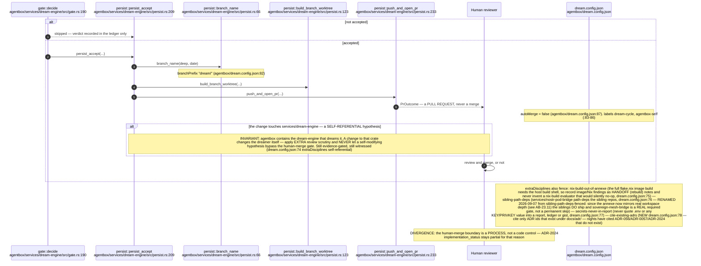
```mermaid
sequenceDiagram
    autonumber
    participant G as gate::decide<br/>agentbox/services/dream-engine/src/gate.rs:190
    participant PA as persist::persist_accept<br/>agentbox/services/dream-engine/src/persist.rs:209
    participant BN as persist::branch_name<br/>agentbox/services/dream-engine/src/persist.rs:66
    participant BW as persist::build_branch_worktree<br/>agentbox/services/dream-engine/src/persist.rs:123
    participant PR as persist::push_and_open_pr<br/>agentbox/services/dream-engine/src/persist.rs:233
    participant H as Human reviewer
    participant CFG as dream.config.json<br/>agentbox/dream.config.json

    alt not accepted
        G-->>PA: skipped — verdict recorded in the ledger only
    else accepted
        G->>PA: persist_accept(...)
        PA->>BN: branch_name(deep, date)
        Note over BN: branchPrefix "dream/" (agentbox/dream.config.json:82)
        PA->>BW: build_branch_worktree(...)
        PA->>PR: push_and_open_pr(...)
        PR-->>H: PrOutcome — a PULL REQUEST, never a merge
        Note over CFG: autoMerge = false (agentbox/dream.config.json:87). labels dream-cycle, agentbox-self<br/>(:83-86)
        alt the change touches services/dream-engine — a SELF-REFERENTIAL hypothesis
            Note over PA,H: INVARIANT: agentbox contains the dream-engine that dreams it. A change to that crate<br/>changes the dreamer itself — apply EXTRA review scrutiny and NEVER let a self-modifying<br/>hypothesis bypass the human-merge gate. Still evidence-gated, still witnessed<br/>(dream.config.json:74 extraDisciplines self-referential)
        end
        H->>H: review and merge, or not
    end
    Note over CFG: extraDisciplines also fence: nix-build-out-of-annexe (the full flake.nix image build<br/>needs the host build shell, so record image/Nix findings as HANDOFF (rebuild) notes and<br/>never invent a nix-build evaluator that would silently no-op, dream.config.json:75) —<br/>sibling-path-deps (services/nostr-pod-bridge path-deps the sibling repos, dream.config.json:76 — RENAMED<br/>2026-09-07 from sibling-path-deps-fenced: since the annexe now mirrors real workspace<br/>depth #40;see AB-23.11#41; the siblings DO ship and sovereign-mesh-bridge is a REAL required<br/>gate, not a permanent skip) — secrets-never-in-report (never quote .env or any<br/>KEY/PRIVKEY value into a report, ledger or gist, dream.config.json:77) — cite-existing-adrs (NEW dream.config.json:78 —<br/>cite only ADR ids that exist under docs/adr/ — nights have cited ADR-056/ADR-0057/ADR-2024<br/>that do not exist)
    Note over H: DIVERGENCE: the human-merge boundary is a PROCESS, not a code control — ADR-2024<br/>implementation_status stays partial for that reason
```

**Tension (dream.config.json vs compile.rs):** agentbox's own `cite-existing-adrs` discipline lists ADR-2024 among ids that "do not exist" (`../project/agentbox/dream.config.json:78`), yet every night's prompt now cites "agentbox ADR-2024" for the required-evaluator veto (`../project/agentbox/services/dream-engine/src/compile.rs:56`, commit `383a471cc`) and the record is `ADR-2024-dream-cycle-gating.md` in agentbox's ledger. The discipline text was written for nights in other repos, where the bare id was a phantom; in agentbox it now contradicts the prompt.

## AB-23.7 Run journal — restart, resume and abandonment

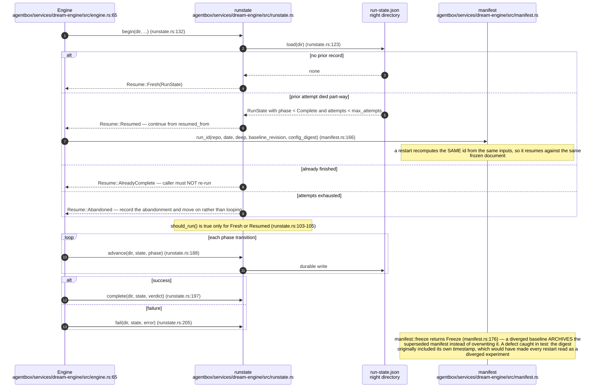
```mermaid
sequenceDiagram
    autonumber
    participant ENG as Engine<br/>agentbox/services/dream-engine/src/engine.rs:65
    participant RS as runstate<br/>agentbox/services/dream-engine/src/runstate.rs
    participant F as run-state.json<br/>night directory
    participant MAN as manifest<br/>agentbox/services/dream-engine/src/manifest.rs

    ENG->>RS: begin(dir, ...) (runstate.rs:132)
    RS->>F: load(dir) (runstate.rs:123)
    alt no prior record
        F-->>RS: none
        RS-->>ENG: Resume::Fresh(RunState)
    else prior attempt died part-way
        F-->>RS: RunState with phase < Complete and attempts < max_attempts
        RS-->>ENG: Resume::Resumed — continue from resumed_from
        ENG->>MAN: run_id(repo, date, deep, baseline_revision, config_digest) (manifest.rs:166)
        Note over MAN: a restart recomputes the SAME id from the same inputs, so it resumes against the same<br/>frozen document
    else already finished
        RS-->>ENG: Resume::AlreadyComplete — caller must NOT re-run
    else attempts exhausted
        RS-->>ENG: Resume::Abandoned — record the abandonment and move on rather than looping
    end
    Note over RS: should_run() is true only for Fresh or Resumed (runstate.rs:103-105)
    loop each phase transition
        ENG->>RS: advance(dir, state, phase) (runstate.rs:188)
        RS->>F: durable write
    end
    alt success
        ENG->>RS: complete(dir, state, verdict) (runstate.rs:197)
    else failure
        ENG->>RS: fail(dir, state, error) (runstate.rs:205)
    end
    Note over MAN: manifest::freeze returns Freeze (manifest.rs:176) — a diverged baseline ARCHIVES the<br/>superseded manifest instead of overwriting it. A defect caught in test: the digest<br/>originally included its own timestamp, which would have made every restart read as a<br/>diverged experiment
```

## AB-23.8 Core types

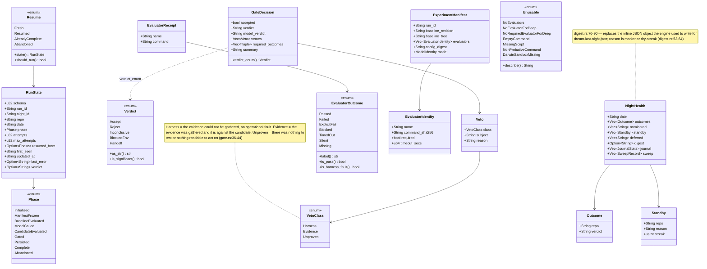
```mermaid
classDiagram
    class RunState {
        +u32 schema
        +String run_id
        +String night_id
        +String repo
        +String date
        +Phase phase
        +u32 attempts
        +u32 max_attempts
        +Option~Phase~ resumed_from
        +String first_seen
        +String updated_at
        +Option~String~ last_error
        +Option~String~ verdict
    }
    class Phase {
        <<enum>>
        Initialised
        ManifestFrozen
        BaselineEvaluated
        ModelCalled
        CandidateEvaluated
        Gated
        Persisted
        Complete
        Abandoned
    }
    class Resume {
        <<enum>>
        Fresh
        Resumed
        AlreadyComplete
        Abandoned
        +state() RunState
        +should_run() bool
    }
    class Verdict {
        <<enum>>
        Accept
        Reject
        Inconclusive
        BlockedEnv
        Handoff
        +as_str() str
        +is_significant() bool
    }
    class GateDecision {
        +bool accepted
        +String verdict
        +String model_verdict
        +Vec~Veto~ vetoes
        +Vec~Tuple~ required_outcomes
        +String summary
        +verdict_enum() Verdict
    }
    class Veto {
        +VetoClass class
        +String subject
        +String reason
    }
    class VetoClass {
        <<enum>>
        Harness
        Evidence
        Unproven
    }
    class EvaluatorOutcome {
        <<enum>>
        Passed
        Failed
        ExplicitFail
        Blocked
        TimedOut
        Silent
        Missing
        +label() str
        +is_pass() bool
        +is_harness_fault() bool
    }
    class EvaluatorReceipt {
        +String name
        +String command
    }
    class ExperimentManifest {
        +String run_id
        +String baseline_revision
        +String baseline_tree
        +Vec~EvaluatorIdentity~ evaluators
        +String config_digest
        +ModelIdentity model
    }
    class EvaluatorIdentity {
        +String name
        +String command_sha256
        +bool required
        +u64 timeout_secs
    }
    class Unusable {
        <<enum>>
        NoEvaluators
        NoEvaluatorForDeep
        NoRequiredEvaluatorForDeep
        EmptyCommand
        MissingScript
        NonProbativeCommand
        DarwinSandboxMissing
        +describe() String
    }
    class NightHealth {
        +String date
        +Vec~Outcome~ outcomes
        +Vec~String~ nominated
        +Vec~Standby~ standby
        +Vec~String~ deferred
        +Option~String~ digest
        +Vec~JournalStats~ journal
        +Vec~SweepRecord~ sweep
    }
    class Outcome {
        +String repo
        +String verdict
    }
    class Standby {
        +String repo
        +String reason
        +usize streak
    }
    RunState --> Phase
    Resume --> RunState
    GateDecision --> Veto
    Veto --> VetoClass
    GateDecision ..> Verdict : verdict_enum
    EvaluatorReceipt --> EvaluatorOutcome
    ExperimentManifest --> EvaluatorIdentity
    NightHealth --> Outcome
    NightHealth --> Standby
    note for VetoClass "Harness = the evidence could not be gathered, an operational fault. Evidence = the<br/>evidence was gathered and it is against the candidate. Unproven = there was nothing to<br/>test or nothing readable to act on (gate.rs:36-44)"
    note for NightHealth "digest.rs:70-90 — replaces the inline JSON object the engine used to write for<br/>dream-last-night.json; reason is marker or dry-streak (digest.rs:52-64)"
```

## AB-23.9 Dream-inbox surfacing hook

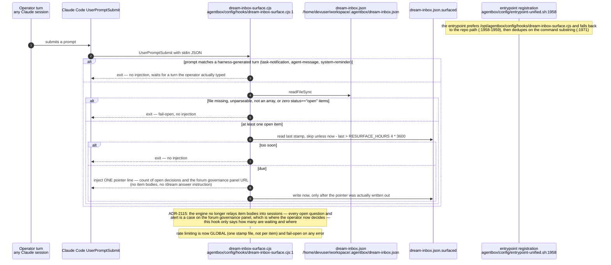
```mermaid
sequenceDiagram
    autonumber
    participant U as Operator turn<br/>any Claude session
    participant CC as Claude Code UserPromptSubmit
    participant HK as dream-inbox-surface.cjs<br/>agentbox/config/hooks/dream-inbox-surface.cjs:1
    participant INBOX as dream-inbox.json<br/>/home/devuser/workspace/.agentbox/dream-inbox.json
    participant STAMP as dream-inbox.json.surfaced
    participant EP as entrypoint registration<br/>agentbox/config/entrypoint-unified.sh:1958

    Note over EP: the entrypoint prefers /opt/agentbox/config/hooks/dream-inbox-surface.cjs and falls back<br/>to the repo path (:1958-1959), then dedupes on the command substring (:1971)
    U->>CC: submits a prompt
    CC->>HK: UserPromptSubmit with stdin JSON
    alt prompt matches a harness-generated turn (task-notification, agent-message, system-reminder)
        HK-->>CC: exit — no injection, waits for a turn the operator actually typed
    else
        HK->>INBOX: readFileSync
        alt file missing, unparseable, not an array, or zero status=="open" items
            HK-->>CC: exit — fail-open, no injection
        else at least one open item
            HK->>STAMP: read last stamp, skip unless now - last > RESURFACE_HOURS 4 * 3600
            alt too soon
                HK-->>CC: exit — no injection
            else due
                HK-->>CC: inject ONE pointer line — count of open decisions and the forum governance panel URL<br/>(no item bodies, no /dream answer instruction)
                HK->>STAMP: write now, only after the pointer was actually written out
            end
        end
    end
    Note over HK: ADR-2115: the engine no longer relays item bodies into sessions — every open question and<br/>alert is a case on the forum governance panel, which is where the operator now decides —<br/>this hook only says how many are waiting and where
    Note over HK: rate limiting is now GLOBAL (one stamp file, not per item) and fail-open on any error
```

## AB-23.10 Control and reporting surfaces

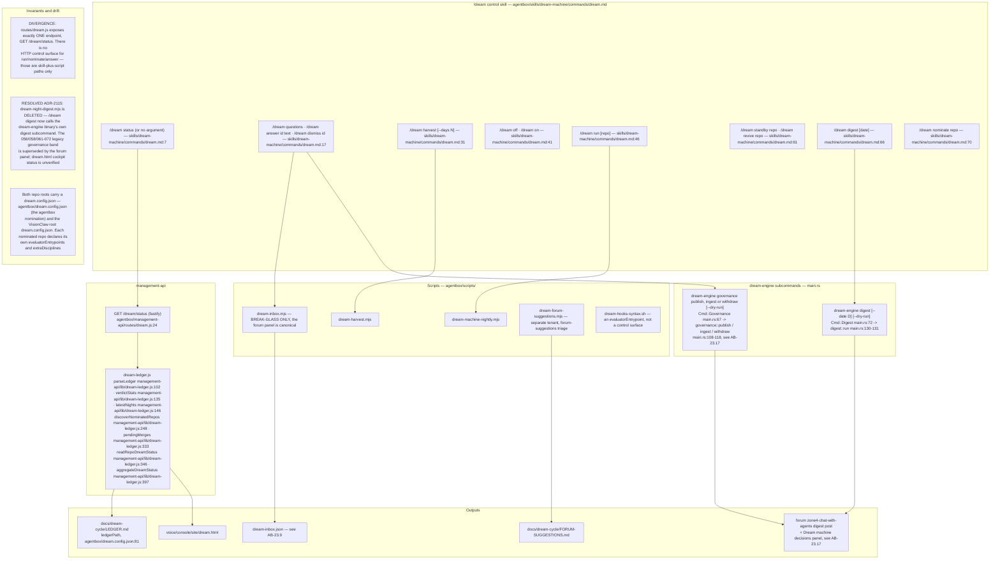
```mermaid
flowchart TB
    subgraph skill["/dream control skill — agentbox/skills/dream-machine/commands/dream.md"]
        S1["/dream status (or no argument) — skills/dream-machine/commands/dream.md:7"]
        S2["/dream questions · /dream answer id text · /dream dismiss id — skills/dream-machine/commands/dream.md:17"]
        S3["/dream harvest [--days N] — skills/dream-machine/commands/dream.md:31"]
        S4["/dream off · /dream on — skills/dream-machine/commands/dream.md:41"]
        S5["/dream run [repo] — skills/dream-machine/commands/dream.md:46"]
        S6["/dream standby repo · /dream revive repo — skills/dream-machine/commands/dream.md:61"]
        S7["/dream digest [date] — skills/dream-machine/commands/dream.md:66"]
        S8["/dream nominate repo — skills/dream-machine/commands/dream.md:70"]
    end
    subgraph scripts["Scripts — agentbox/scripts/"]
        N1["dream-machine-nightly.mjs"]
        N2["dream-inbox.mjs — BREAK-GLASS ONLY, the forum panel is canonical"]
        N3["dream-harvest.mjs"]
        N4["dream-forum-suggestions.mjs — separate tenant, forum-suggestions triage"]
        N6["dream-hooks-syntax.sh — an evaluatorEntrypoint, not a control surface"]
    end
    subgraph cli["dream-engine subcommands — main.rs"]
        C1["dream-engine digest #91;--date D#93; #91;--dry-run#93;<br/>Cmd::Digest main.rs:72 -&gt; digest::run main.rs:130-131"]
        C2["dream-engine governance publish, ingest or withdraw #91;--dry-run#93;<br/>Cmd::Governance main.rs:67 -&gt; governance::publish / ingest / withdraw<br/>main.rs:108-118, see AB-23.17"]
    end
    subgraph api["management-api"]
        R1["GET /dream/status (fastify)<br/>agentbox/management-api/routes/dream.js:24"]
        L1["dream-ledger.js parseLedger management-api/lib/dream-ledger.js:102 · verdictStats management-api/lib/dream-ledger.js:135 · latestNights management-api/lib/dream-ledger.js:146<br/>discoverNominatedRepos management-api/lib/dream-ledger.js:248 · pendingMerges management-api/lib/dream-ledger.js:333<br/>readRepoDreamStatus management-api/lib/dream-ledger.js:346 · aggregateDreamStatus management-api/lib/dream-ledger.js:397"]
    end
    subgraph out["Outputs"]
        O1["docs/dream-cycle/LEDGER.md<br/>ledgerPath, agentbox/dream.config.json:81"]
        O2["docs/dream-cycle/FORUM-SUGGESTIONS.md"]
        O3["dream-inbox.json — see AB-23.9"]
        O4["voice/console/site/dream.html"]
        O5["forum zone4-chat-with-agents digest post<br/>+ Dream machine decisions panel, see AB-23.17"]
    end
    S1 --> R1
    R1 --> L1
    L1 --> O1
    S3 --> N3
    S2 --> N2
    S2 --> C2
    N2 --> O3
    S7 --> C1
    C1 --> O5
    C2 --> O5
    S5 --> N1
    N4 --> O2
    L1 --> O4
    subgraph notes["Invariants and drift"]
        direction TB
        ND1["DIVERGENCE: routes/dream.js exposes exactly ONE endpoint, GET /dream/status. There is no<br/>HTTP control surface for run/nominate/answer — those are skill-plus-script paths only"]
        ND2["RESOLVED ADR-2115: dream-night-digest.mjs is DELETED — /dream digest now calls the<br/>dream-engine binary's own digest subcommand. The 056/058/061-072 legacy governance band<br/>is superseded by the forum panel; dream.html cockpit status is unverified"]
        ND3["Both repo roots carry a dream.config.json — agentbox/dream.config.json (the agentbox<br/>nomination) and the VisionClaw root dream.config.json. Each nominated repo declares its<br/>own evaluatorEntrypoints and extraDisciplines"]
        ND1 ~~~ ND2 ~~~ ND3
    end
```

**Invariant (2026-10-02, owner decision Q10):** the forum-suggestions tenant asks a member to clarify only when JunkieJarvis may speak; it reads the same `junkiejarvisEnabled(manifest)` that management-api uses, and with it off an unclear post is held — no DM, no ledger row, not parked — so it is asked once JunkieJarvis is on (`../project/agentbox/scripts/dream-forum-suggestions.mjs:225-231`, `../project/agentbox/scripts/dream-forum-suggestions.mjs:388-391`).

## AB-23.11 ADR-2081 — the annexe mirrors real workspace depth

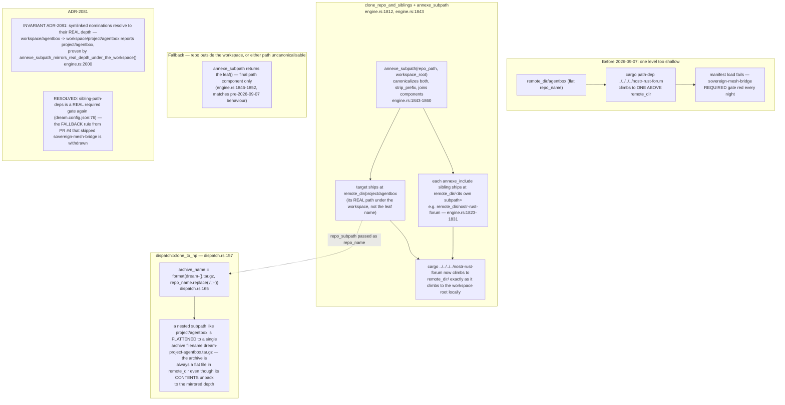
```mermaid
flowchart TB
    subgraph before["Before 2026-09-07: one level too shallow"]
        B1["remote_dir/agentbox #40;flat repo_name#41;"]
        B2["cargo path-dep ../../../../nostr-rust-forum<br/>climbs to ONE ABOVE remote_dir"]
        B3["manifest load fails — sovereign-mesh-bridge<br/>REQUIRED gate red every night"]
        B1 --> B2 --> B3
    end
    subgraph after["clone_repo_and_siblings + annexe_subpath<br/>engine.rs:1812, engine.rs:1843"]
        A1["annexe_subpath#40;repo_path, workspace_root#41;<br/>canonicalizes both, strip_prefix, joins components<br/>engine.rs:1843-1860"]
        A2["target ships at remote_dir/project/agentbox<br/>#40;its REAL path under the workspace, not the leaf name#41;"]
        A3["each annexe_include sibling ships at remote_dir/&lt;its own subpath&gt;<br/>e.g. remote_dir/nostr-rust-forum — engine.rs:1823-1831"]
        A4["cargo ../../../../nostr-rust-forum now climbs to<br/>remote_dir/ exactly as it climbs to the workspace root locally"]
        A1 --> A2
        A1 --> A3
        A2 --> A4
        A3 --> A4
    end
    subgraph dispatch["dispatch::clone_to_hp — dispatch.rs:157"]
        D1["archive_name = format#40;dream-{}.tar.gz, repo_name.replace#40;'/','-'#41;#41;<br/>dispatch.rs:165"]
        D2["a nested subpath like project/agentbox is FLATTENED to a single<br/>archive filename dream-project-agentbox.tar.gz — the archive is<br/>always a flat file in remote_dir even though its CONTENTS unpack<br/>to the mirrored depth"]
        D1 --> D2
    end
    A2 -.->|"repo_subpath passed as repo_name"| D1
    subgraph fallback["Fallback — repo outside the workspace, or either path uncanonicalisable"]
        F1["annexe_subpath returns the leaf#40;#41; — final path component only<br/>#40;engine.rs:1846-1852, matches pre-2026-09-07 behaviour#41;"]
    end
    subgraph notes["ADR-2081"]
        direction TB
        N1["INVARIANT ADR-2081: symlinked nominations resolve to their REAL depth —<br/>workspace/agentbox -> workspace/project/agentbox reports project/agentbox,<br/>proven by annexe_subpath_mirrors_real_depth_under_the_workspace#40;#41;<br/>engine.rs:2000"]
        N2["RESOLVED: sibling-path-deps is a REAL required gate again (dream.config.json:76) —<br/>the FALLBACK rule from PR #4 that skipped sovereign-mesh-bridge is withdrawn"]
        N1 ~~~ N2
    end
```

## AB-23.12 ADR-2081 — pipefail closes the tail-masking false positive

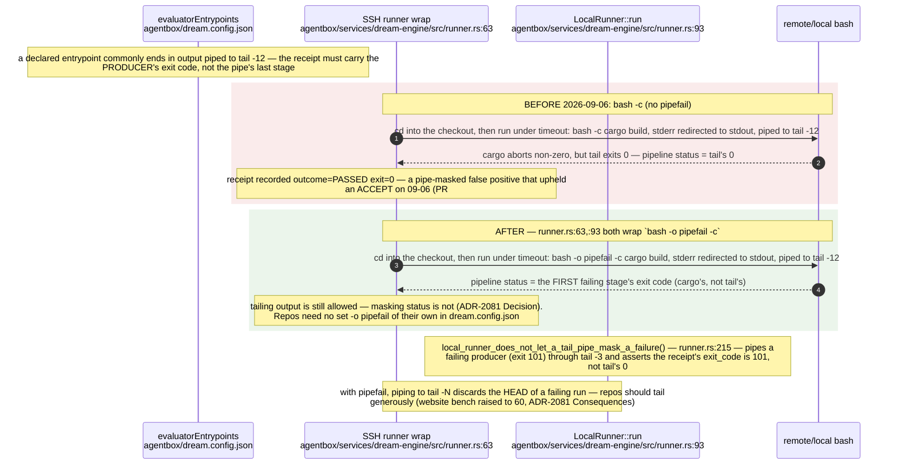
```mermaid
sequenceDiagram
    autonumber
    participant CFG as evaluatorEntrypoints<br/>agentbox/dream.config.json
    participant SSH as SSH runner wrap<br/>agentbox/services/dream-engine/src/runner.rs:63
    participant LOC as LocalRunner::run<br/>agentbox/services/dream-engine/src/runner.rs:93
    participant SH as remote/local bash

    Note over CFG: a declared entrypoint commonly ends in output piped to tail -12 — the receipt must carry the<br/>PRODUCER's exit code, not the pipe's last stage
    rect rgb(250,235,235)
        Note over SSH,SH: BEFORE 2026-09-06: bash -c (no pipefail)
        SSH->>SH: cd into the checkout, then run under timeout: bash -c cargo build, stderr redirected to stdout, piped to tail -12
        SH-->>SSH: cargo aborts non-zero, but tail exits 0 — pipeline status = tail's 0
        Note over SSH: receipt recorded outcome=PASSED exit=0 — a pipe-masked false positive that upheld<br/>an ACCEPT on 09-06 (PR #4)
    end
    rect rgb(235,245,235)
        Note over SSH,SH: AFTER — runner.rs:63,:93 both wrap `bash -o pipefail -c`
        SSH->>SH: cd into the checkout, then run under timeout: bash -o pipefail -c cargo build, stderr redirected to stdout, piped to tail -12
        SH-->>SSH: pipeline status = the FIRST failing stage's exit code (cargo's, not tail's)
        Note over SSH: tailing output is still allowed — masking status is not (ADR-2081 Decision).<br/>Repos need no set -o pipefail of their own in dream.config.json
    end
    Note over LOC: local_runner_does_not_let_a_tail_pipe_mask_a_failure#40;#41; — runner.rs:215 — pipes a<br/>failing producer #40;exit 101#41; through tail -3 and asserts the receipt's exit_code is 101,<br/>not tail's 0
    Note over SSH,LOC: with pipefail, piping to tail -N discards the HEAD of a failing run — repos should tail<br/>generously #40;website bench raised to 60, ADR-2081 Consequences#41;
```

## AB-23.13 ADR-2081 — a no-patch ACCEPT is unproven, not a harness fault

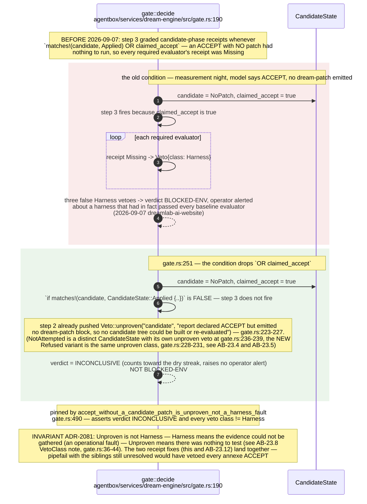
```mermaid
sequenceDiagram
    autonumber
    participant G as gate::decide<br/>agentbox/services/dream-engine/src/gate.rs:190
    participant C as CandidateState

    Note over G: BEFORE 2026-09-07: step 3 graded candidate-phase receipts whenever<br/>`matches!(candidate, Applied) OR claimed_accept` — an ACCEPT with NO patch had<br/>nothing to run, so every required evaluator's receipt was Missing
    rect rgb(250,235,235)
        Note over G,C: the old condition — measurement night, model says ACCEPT, no dream-patch emitted
        G->>C: candidate = NoPatch, claimed_accept = true
        G->>G: step 3 fires because claimed_accept is true
        loop each required evaluator
            G->>G: receipt Missing -> Veto{class: Harness}
        end
        G-->>G: three false Harness vetoes -> verdict BLOCKED-ENV, operator alerted<br/>about a harness that had in fact passed every baseline evaluator<br/>#40;2026-09-07 dreamlab-ai-website#41;
    end
    rect rgb(235,245,235)
        Note over G,C: gate.rs:251 — the condition drops `OR claimed_accept`
        G->>C: candidate = NoPatch, claimed_accept = true
        G->>G: `if matches!#40;candidate, CandidateState::Applied {..}#41;` is FALSE — step 3 does not fire
        Note over G: step 2 already pushed Veto::unproven#40;"candidate", "report declared ACCEPT but emitted<br/>no dream-patch block, so no candidate tree could be built or re-evaluated"#41; — gate.rs:223-227.<br/>#40;NotAttempted is a distinct CandidateState with its own unproven veto at gate.rs:236-239, the NEW<br/>Refused variant is the same unproven class, gate.rs:228-231, see AB-23.4 and AB-23.5#41;
        G-->>G: verdict = INCONCLUSIVE #40;counts toward the dry streak, raises no operator alert#41;<br/>NOT BLOCKED-ENV
    end
    Note over G: pinned by accept_without_a_candidate_patch_is_unproven_not_a_harness_fault<br/>gate.rs:490 — asserts verdict INCONCLUSIVE and every veto class != Harness
    Note over G: INVARIANT ADR-2081: Unproven is not Harness — Harness means the evidence could not be<br/>gathered #40;an operational fault#41; — Unproven means there was nothing to test #40;see AB-23.8<br/>VetoClass note, gate.rs:36-44#41;. The two receipt fixes #40;this and AB-23.12#41; land together —<br/>pipefail with the siblings still unresolved would have vetoed every annexe ACCEPT
```

## AB-23.14 ADR-2081 — Step-19 ledger cell provenance

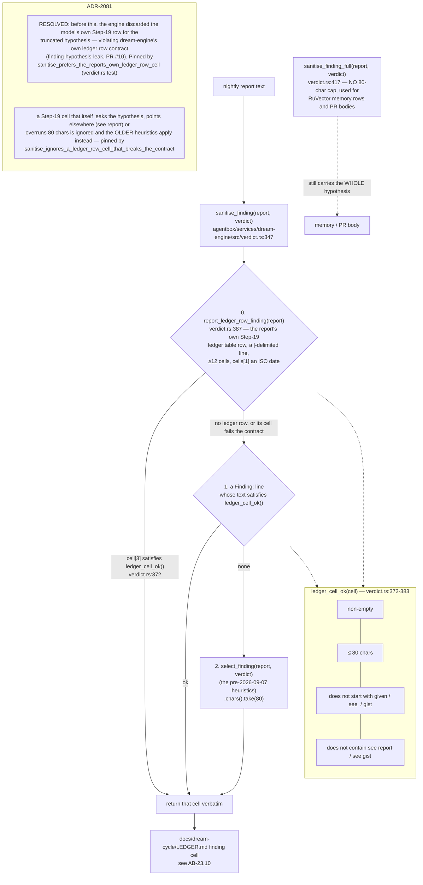
```mermaid
flowchart TB
    R["nightly report text"] --> SF["sanitise_finding#40;report, verdict#41;<br/>agentbox/services/dream-engine/src/verdict.rs:347"]
    SF --> Q0{"0. report_ledger_row_finding#40;report#41;<br/>verdict.rs:387 — the report's own Step-19<br/>ledger table row, a #124;-delimited line,<br/>&ge;12 cells, cells#91;1#93; an ISO date"}
    Q0 -->|"cell#91;3#93; satisfies ledger_cell_ok#40;#41;<br/>verdict.rs:372"| CELL["return that cell verbatim"]
    Q0 -->|"no ledger row, or its cell fails the contract"| Q1{"1. a Finding: line<br/>whose text satisfies ledger_cell_ok#40;#41;"}
    Q1 -->|"ok"| CELL
    Q1 -->|"none"| Q2["2. select_finding#40;report, verdict#41;<br/>#40;the pre-2026-09-07 heuristics#41;<br/>.chars#40;#41;.take#40;80#41;"]
    Q2 --> CELL
    subgraph contract["ledger_cell_ok#40;cell#41; — verdict.rs:372-383"]
        direction TB
        C1["non-empty"]
        C2["&le; 80 chars"]
        C3["does not start with given / see  / gist"]
        C4["does not contain see report / see gist"]
        C1 --- C2 --- C3 --- C4
    end
    Q0 -.-> contract
    Q1 -.-> contract
    CELL --> LEDGER["docs/dream-cycle/LEDGER.md finding cell<br/>see AB-23.10"]
    FULL["sanitise_finding_full#40;report, verdict#41;<br/>verdict.rs:417 — NO 80-char cap, used for<br/>RuVector memory rows and PR bodies"] -.->|"still carries the WHOLE hypothesis"| MEM["memory / PR body"]
    subgraph notes["ADR-2081"]
        direction TB
        N1["RESOLVED: before this, the engine discarded the model's own Step-19 row for the<br/>truncated hypothesis — violating dream-engine's own ledger row contract<br/>#40;finding-hypothesis-leak, PR #10#41;. Pinned by<br/>sanitise_prefers_the_reports_own_ledger_row_cell #40;verdict.rs test#41;"]
        N2["a Step-19 cell that itself leaks the hypothesis, points elsewhere #40;see report#41; or<br/>overruns 80 chars is ignored and the OLDER heuristics apply instead — pinned by<br/>sanitise_ignores_a_ledger_row_cell_that_breaks_the_contract"]
        N1 ~~~ N2
    end
```

## AB-23.15 ADR-2084 - the Loom call goes through the published loom-client

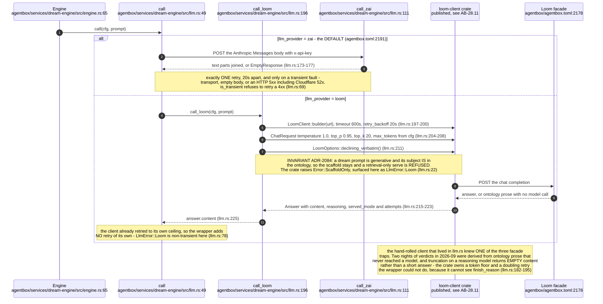
```mermaid
sequenceDiagram
    autonumber
    participant ENG as Engine<br/>agentbox/services/dream-engine/src/engine.rs:65
    participant CALL as call<br/>agentbox/services/dream-engine/src/llm.rs:49
    participant LOOM as call_loom<br/>agentbox/services/dream-engine/src/llm.rs:196
    participant ZAI as call_zai<br/>agentbox/services/dream-engine/src/llm.rs:111
    participant CRATE as loom-client crate<br/>published, see AB-28.11
    participant F as Loom facade<br/>agentbox/agentbox.toml:2178

    ENG->>CALL: call(cfg, prompt)
    alt llm_provider = zai - the DEFAULT (agentbox.toml:2191)
        CALL->>ZAI: POST the Anthropic Messages body with x-api-key
        ZAI-->>CALL: text parts joined, or EmptyResponse (llm.rs:173-177)
        Note over CALL,ZAI: exactly ONE retry, 20s apart, and only on a transient fault -<br/>transport, empty body, or an HTTP 5xx including Cloudflare 52x.<br/>is_transient refuses to retry a 4xx (llm.rs:69)
    else llm_provider = loom
        CALL->>LOOM: call_loom(cfg, prompt)
        LOOM->>CRATE: LoomClient::builder(url), timeout 600s, retry_backoff 20s (llm.rs:197-200)
        LOOM->>CRATE: ChatRequest temperature 1.0, top_p 0.95, top_k 20, max_tokens from cfg (llm.rs:204-208)
        LOOM->>CRATE: LoomOptions::declining_verbatim() (llm.rs:211)
        Note over LOOM,CRATE: INVARIANT ADR-2084: a dream prompt is generative and its subject IS in<br/>the ontology, so the scaffold stays and a retrieval-only serve is REFUSED.<br/>The crate raises Error::ScaffoldOnly, surfaced here as LlmError::Loom (llm.rs:22)
        CRATE->>F: POST the chat completion
        F-->>CRATE: answer, or ontology prose with no model call
        CRATE-->>LOOM: Answer with content, reasoning, served_mode and attempts (llm.rs:215-223)
        LOOM-->>CALL: answer.content (llm.rs:225)
        Note over CALL: the client already retried to its own ceiling, so the wrapper adds<br/>NO retry of its own - LlmError::Loom is non-transient here (llm.rs:78)
    end
    Note over CRATE: the hand-rolled client that lived in llm.rs knew ONE of the three facade<br/>traps. Two nights of verdicts in 2026-09 were derived from ontology prose that<br/>never reached a model, and truncation on a reasoning model returns EMPTY content<br/>rather than a short answer - the crate owns a token floor and a doubling retry<br/>the wrapper could not do, because it cannot see finish_reason (llm.rs:182-195)
```

**Debt:** `agentbox/agentbox.toml:2191` keeps `llm_provider = "zai"` as the default, so nightly repository content leaves the LAN on every unattended night; the LAN-only Loom path at `../project/agentbox/services/dream-engine/src/llm.rs:196` is opt-in.

## AB-23.16 Placeholder resolution and the refusal to dispatch to nowhere

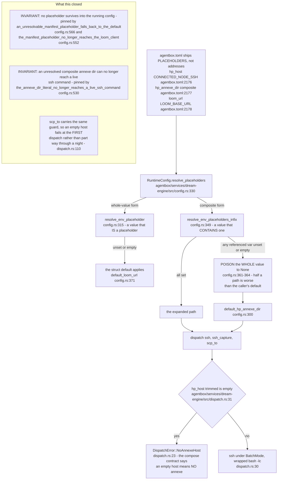
```mermaid
flowchart TB
    TOML["agentbox.toml ships PLACEHOLDERS, not addresses<br/>hp_host CONNECTED_NODE_SSH agentbox.toml:2176<br/>hp_annexe_dir composite agentbox.toml:2177<br/>loom_url LOOM_BASE_URL agentbox.toml:2178"]
    TOML --> RP["RuntimeConfig.resolve_placeholders<br/>agentbox/services/dream-engine/src/config.rs:330"]
    RP -->|"whole-value form"| W["resolve_env_placeholder<br/>config.rs:315 - a value that IS a placeholder"]
    RP -->|"composite form"| I["resolve_env_placeholders_infix<br/>config.rs:349 - a value that CONTAINS one"]
    W -->|"unset or empty"| D1["the struct default applies<br/>default_loom_url config.rs:371"]
    I -->|"any referenced var unset or empty"| D2["POISON the WHOLE value to None<br/>config.rs:361-364 - half a path is worse<br/>than the caller's default"]
    D2 --> D3["default_hp_annexe_dir config.rs:300"]
    I -->|"all set"| OK["the expanded path"]
    OK --> DISP["dispatch ssh, ssh_capture, scp_to"]
    D3 --> DISP
    DISP --> GUARD{"hp_host trimmed is empty<br/>agentbox/services/dream-engine/src/dispatch.rs:31"}
    GUARD -->|"yes"| NAH["DispatchError::NoAnnexeHost<br/>dispatch.rs:23 - the compose contract says<br/>an empty host means NO annexe"]
    GUARD -->|"no"| SSH["ssh under BatchMode, wrapped bash -lc<br/>dispatch.rs:30"]
    subgraph notes["What this closed"]
        direction TB
        N1["INVARIANT: no placeholder survives into the running config -<br/>pinned by an_unresolvable_manifest_placeholder_falls_back_to_the_default<br/>config.rs:566 and the_manifest_placeholder_no_longer_reaches_the_loom_client<br/>config.rs:552"]
        N2["INVARIANT: an unresolved composite annexe dir can no longer reach a live<br/>ssh command - pinned by<br/>the_annexe_dir_literal_no_longer_reaches_a_live_ssh_command config.rs:530"]
        N3["scp_to carries the same guard, so an empty host fails at the FIRST<br/>dispatch rather than part way through a night - dispatch.rs:110"]
        N1 ~~~ N2 ~~~ N3
    end
```

**Invariant:** every dispatch entry point refuses an empty annexe host with a typed error rather than shelling out (`../project/agentbox/services/dream-engine/src/dispatch.rs:31`, `../project/agentbox/services/dream-engine/src/dispatch.rs:110`).

**Drift (diagram corpus vs repo):** `2899b3b7e` generalised estate addressing out of this public repository, so `../project/agentbox/dream.config.json:75` now says "the connected node annexe" where the corpus previously named a host and a rail address.

## AB-23.17 ADR-2115 — the forum governance round trip

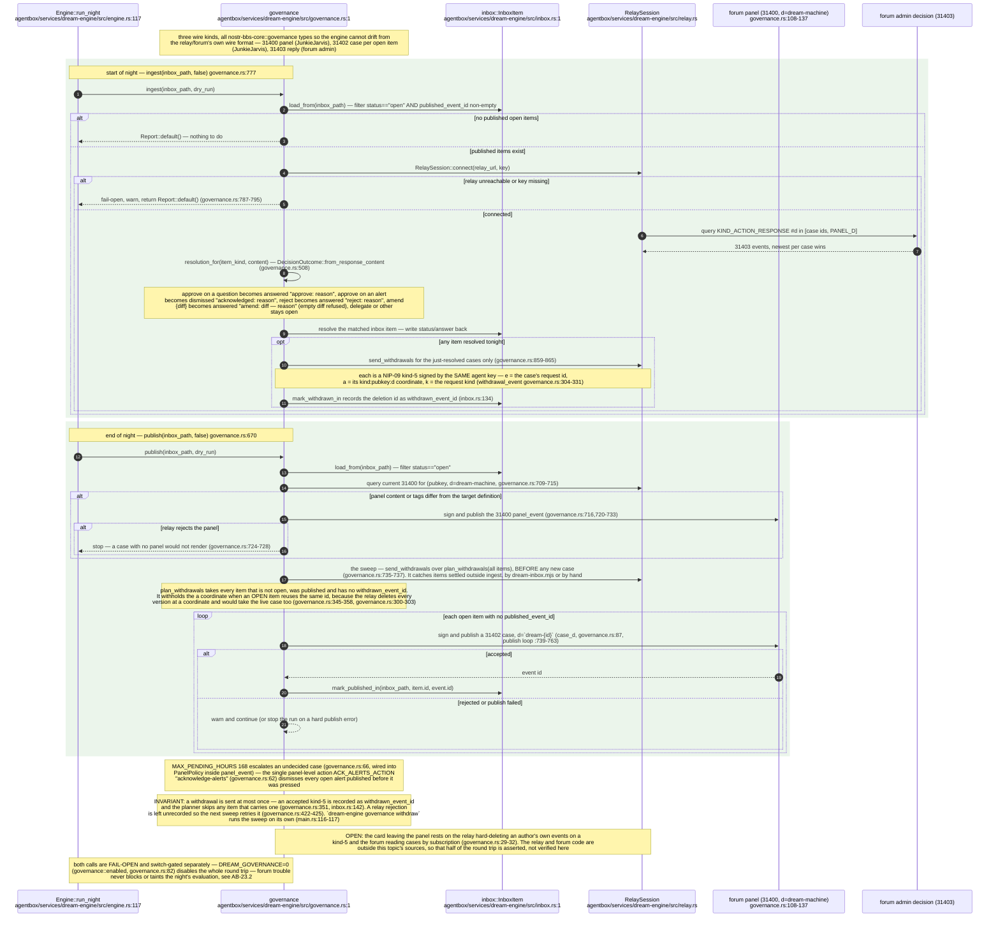
```mermaid
sequenceDiagram
    autonumber
    participant ENG as Engine::run_night<br/>agentbox/services/dream-engine/src/engine.rs:117
    participant GOV as governance<br/>agentbox/services/dream-engine/src/governance.rs:1
    participant INBOX as inbox::InboxItem<br/>agentbox/services/dream-engine/src/inbox.rs:1
    participant REL as RelaySession<br/>agentbox/services/dream-engine/src/relay.rs
    participant PANEL as forum panel #40;31400, d=dream-machine#41;<br/>governance.rs:108-137
    participant ADMIN as forum admin decision #40;31403#41;

    Note over GOV: three wire kinds, all nostr-bbs-core::governance types so the engine cannot drift from<br/>the relay/forum's own wire format — 31400 panel #40;JunkieJarvis#41;, 31402 case per open item<br/>#40;JunkieJarvis#41;, 31403 reply #40;forum admin#41;
    rect rgb(235,245,235)
        Note over ENG,GOV: start of night — ingest(inbox_path, false) governance.rs:777
        ENG->>GOV: ingest(inbox_path, dry_run)
        GOV->>INBOX: load_from(inbox_path) — filter status=="open" AND published_event_id non-empty
        alt no published open items
            GOV-->>ENG: Report::default#40;#41; — nothing to do
        else published items exist
            GOV->>REL: RelaySession::connect(relay_url, key)
            alt relay unreachable or key missing
                GOV-->>ENG: fail-open, warn, return Report::default#40;#41; (governance.rs:787-795)
            else connected
                REL->>ADMIN: query KIND_ACTION_RESPONSE #35;d in #91;case ids, PANEL_D#93;
                ADMIN-->>REL: 31403 events, newest per case wins
                GOV->>GOV: resolution_for(item_kind, content) — DecisionOutcome::from_response_content<br/>(governance.rs:508)
                Note over GOV: approve on a question becomes answered "approve: reason", approve on an alert<br/>becomes dismissed "acknowledged: reason", reject becomes answered "reject: reason", amend<br/>#123;diff#125; becomes answered "amend: diff — reason" #40;empty diff refused#41;, delegate or other<br/>stays open
                GOV->>INBOX: resolve the matched inbox item — write status/answer back
                opt any item resolved tonight
                    GOV->>REL: send_withdrawals for the just-resolved cases only (governance.rs:859-865)
                    Note over GOV,REL: each is a NIP-09 kind-5 signed by the SAME agent key — e = the case's request id,<br/>a = its kind:pubkey:d coordinate, k = the request kind (withdrawal_event governance.rs:304-331)
                    GOV->>INBOX: mark_withdrawn_in records the deletion id as withdrawn_event_id (inbox.rs:134)
                end
            end
        end
    end
    rect rgb(235,245,235)
        Note over ENG,GOV: end of night — publish(inbox_path, false) governance.rs:670
        ENG->>GOV: publish(inbox_path, dry_run)
        GOV->>INBOX: load_from(inbox_path) — filter status=="open"
        GOV->>REL: query current 31400 for #40;pubkey, d=dream-machine, governance.rs:709-715#41;
        alt panel content or tags differ from the target definition
            GOV->>PANEL: sign and publish the 31400 panel_event (governance.rs:716,720-733)
            alt relay rejects the panel
                GOV-->>ENG: stop — a case with no panel would not render (governance.rs:724-728)
            end
        end
        GOV->>REL: the sweep — send_withdrawals over plan_withdrawals(all items), BEFORE any new case<br/>(governance.rs:735-737). It catches items settled outside ingest, by dream-inbox.mjs or by hand
        Note over GOV: plan_withdrawals takes every item that is not open, was published and has no withdrawn_event_id.<br/>It withholds the a coordinate when an OPEN item reuses the same id, because the relay deletes every<br/>version at a coordinate and would take the live case too (governance.rs:345-358, governance.rs:300-303)
        loop each open item with no published_event_id
            GOV->>PANEL: sign and publish a 31402 case, d=`dream-#123;id#125;` #40;case_d, governance.rs:87,<br/>publish loop :739-763#41;
            alt accepted
                PANEL-->>GOV: event id
                GOV->>INBOX: mark_published_in#40;inbox_path, item.id, event.id#41;
            else rejected or publish failed
                GOV-->>GOV: warn and continue #40;or stop the run on a hard publish error#41;
            end
        end
    end
    Note over GOV: MAX_PENDING_HOURS 168 escalates an undecided case #40;governance.rs:66, wired into<br/>PanelPolicy inside panel_event#41; — the single panel-level action ACK_ALERTS_ACTION<br/>"acknowledge-alerts" #40;governance.rs:62#41; dismisses every open alert published before it<br/>was pressed
    Note over GOV: INVARIANT: a withdrawal is sent at most once — an accepted kind-5 is recorded as withdrawn_event_id<br/>and the planner skips any item that carries one (governance.rs:351, inbox.rs:142). A relay rejection<br/>is left unrecorded so the next sweep retries it (governance.rs:422-425). `dream-engine governance withdraw`<br/>runs the sweep on its own (main.rs:116-117)
    Note over GOV,REL: OPEN: the card leaving the panel rests on the relay hard-deleting an author's own events on a<br/>kind-5 and the forum reading cases by subscription (governance.rs:29-32). The relay and forum code are<br/>outside this topic's sources, so that half of the round trip is asserted, not verified here
    Note over ENG,GOV: both calls are FAIL-OPEN and switch-gated separately — DREAM_GOVERNANCE=0<br/>#40;governance::enabled, governance.rs:82#41; disables the whole round trip — forum trouble<br/>never blocks or taints the night's evaluation, see AB-23.2
```

## AB-23.18 Annexe preflight — the write-then-measure health probe

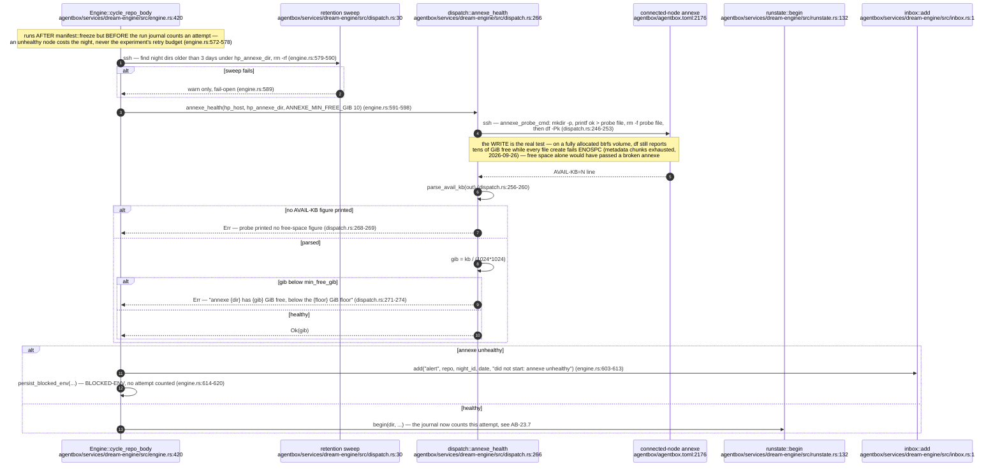
```mermaid
sequenceDiagram
    autonumber
    participant ENG as Engine::cycle_repo_body<br/>agentbox/services/dream-engine/src/engine.rs:420
    participant SWEEP as retention sweep<br/>agentbox/services/dream-engine/src/dispatch.rs:30
    participant AH as dispatch::annexe_health<br/>agentbox/services/dream-engine/src/dispatch.rs:266
    participant HP as connected-node annexe<br/>agentbox/agentbox.toml:2176
    participant RS as runstate::begin<br/>agentbox/services/dream-engine/src/runstate.rs:132
    participant INBOX as inbox::add<br/>agentbox/services/dream-engine/src/inbox.rs:1

    Note over ENG: runs AFTER manifest::freeze but BEFORE the run journal counts an attempt —<br/>an unhealthy node costs the night, never the experiment's retry budget (engine.rs:572-578)
    ENG->>SWEEP: ssh — find night dirs older than 3 days under hp_annexe_dir, rm -rf (engine.rs:579-590)
    alt sweep fails
        SWEEP-->>ENG: warn only, fail-open (engine.rs:589)
    end
    ENG->>AH: annexe_health(hp_host, hp_annexe_dir, ANNEXE_MIN_FREE_GIB 10) (engine.rs:591-598)
    AH->>HP: ssh — annexe_probe_cmd: mkdir -p, printf ok > probe file, rm -f probe file,<br/>then df -Pk (dispatch.rs:246-253)
    Note over AH,HP: the WRITE is the real test — on a fully allocated btrfs volume, df still reports<br/>tens of GiB free while every file create fails ENOSPC #40;metadata chunks exhausted,<br/>2026-09-26#41; — free space alone would have passed a broken annexe
    HP-->>AH: AVAIL-KB=N line
    AH->>AH: parse_avail_kb(out) (dispatch.rs:256-260)
    alt no AVAIL-KB figure printed
        AH-->>ENG: Err — probe printed no free-space figure (dispatch.rs:268-269)
    else parsed
        AH->>AH: gib = kb / (1024*1024)
        alt gib below min_free_gib
            AH-->>ENG: Err — "annexe {dir} has {gib} GiB free, below the {floor} GiB floor" (dispatch.rs:271-274)
        else healthy
            AH-->>ENG: Ok(gib)
        end
    end
    alt annexe unhealthy
        ENG->>INBOX: add("alert", repo, night_id, date, "did not start: annexe unhealthy") (engine.rs:603-613)
        ENG->>ENG: persist_blocked_env(...) — BLOCKED-ENV, no attempt counted (engine.rs:614-620)
    else healthy
        ENG->>RS: begin(dir, ...) — the journal now counts this attempt, see AB-23.7
    end
```

**Invariant:** the annexe probe writes and deletes a file before it trusts `df`'s free-space figure, so a metadata-exhausted btrfs volume that still reports free capacity is still caught (`../project/agentbox/services/dream-engine/src/dispatch.rs:246-253`).

## AB-23.19 ADR-2071 clause (c) — the one-shot night with management-api stopped

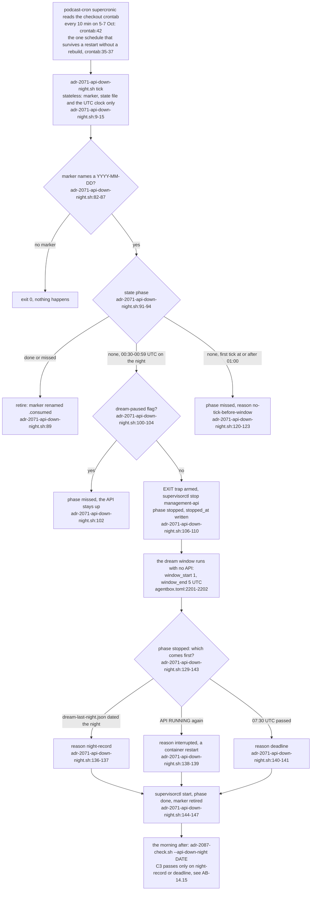
```mermaid
flowchart TB
    CRON["podcast-cron supercronic reads the checkout crontab<br/>every 10 min on 5-7 Oct: crontab:42<br/>the one schedule that survives a restart without a rebuild, crontab:35-37"]
    CRON --> TICK["adr-2071-api-down-night.sh tick<br/>stateless: marker, state file and the UTC clock only<br/>adr-2071-api-down-night.sh:9-15"]
    TICK --> MK{"marker names a YYYY-MM-DD?<br/>adr-2071-api-down-night.sh:82-87"}
    MK -->|"no marker"| NOOP["exit 0, nothing happens"]
    MK -->|"yes"| PH{"state phase<br/>adr-2071-api-down-night.sh:91-94"}
    PH -->|"done or missed"| RET["retire: marker renamed .consumed<br/>adr-2071-api-down-night.sh:89"]
    PH -->|"none, 00:30-00:59 UTC on the night"| PAUSE{"dream-paused flag?<br/>adr-2071-api-down-night.sh:100-104"}
    PAUSE -->|"yes"| MISS["phase missed, the API stays up<br/>adr-2071-api-down-night.sh:102"]
    PAUSE -->|"no"| STOP["EXIT trap armed, supervisorctl stop management-api<br/>phase stopped, stopped_at written<br/>adr-2071-api-down-night.sh:106-110"]
    PH -->|"none, first tick at or after 01:00"| MISS2["phase missed, reason no-tick-before-window<br/>adr-2071-api-down-night.sh:120-123"]
    STOP --> NIGHT["the dream window runs with no API:<br/>window_start 1, window_end 5 UTC<br/>agentbox.toml:2201-2202"]
    NIGHT --> RS{"phase stopped: which comes first?<br/>adr-2071-api-down-night.sh:129-143"}
    RS -->|"dream-last-night.json dated the night"| R1["reason night-record<br/>adr-2071-api-down-night.sh:136-137"]
    RS -->|"API RUNNING again"| R2["reason interrupted, a container restart<br/>adr-2071-api-down-night.sh:138-139"]
    RS -->|"07:30 UTC passed"| R3["reason deadline<br/>adr-2071-api-down-night.sh:140-141"]
    R1 --> START["supervisorctl start, phase done, marker retired<br/>adr-2071-api-down-night.sh:144-147"]
    R2 --> START
    R3 --> START
    START --> CHK["the morning after: adr-2087-check.sh --api-down-night DATE<br/>C3 passes only on night-record or deadline, see AB-14.15"]
```

**What it shows.** How the estate will run its first dream night with the management API deliberately down: a marker file names the night, a ten-minute cron tick stops the API in the half-hour before the window, and the first tick that sees the night record, the 07:30 UTC deadline or an API that came back on its own restarts it and retires the marker.
**Why it is this way.** ADR-2071 can only be accepted once clause (c) shows the night still completes, and journals its failures, with nothing to journal to. The owner fixed the night of Monday 5 October (owner decision 2026-10-02, Q9; `../project/agentbox/docs/adr/ADR-2071-journal-the-nightly-dream-cycle.md:191`). The schedule rides the checkout crontab rather than the image so that a container restart neither loses it nor needs a rebuild (`../project/agentbox/skills/podcast-knowledge-ingest/crontab:34-42`). The tick is pure bash plus coreutils because that cron PATH has no `sed` or `awk` (`../project/agentbox/scripts/activation/adr-2071-api-down-night.sh:59-60`).

**Invariant:** the API is never left down by a dying tick: an EXIT trap restarts management-api from the moment the stop is attempted until the state write lands (`../project/agentbox/scripts/activation/adr-2071-api-down-night.sh:105-109`).

**Debt:** the crontab block is a dated one-shot that has to be removed by hand ("Remove this block after 7 Oct 2026", `../project/agentbox/skills/podcast-knowledge-ingest/crontab:41`). The same checkout crontab now also ticks the EXP-B8 label-log experiment every 30 minutes until its own PR merges (`../project/agentbox/skills/podcast-knowledge-ingest/crontab:44-54`), so a supervised program named for podcast ingest carries two schedules that have nothing to do with podcasts.

## AB-23.20 Which key signs the forum round trip — role isolation off and on

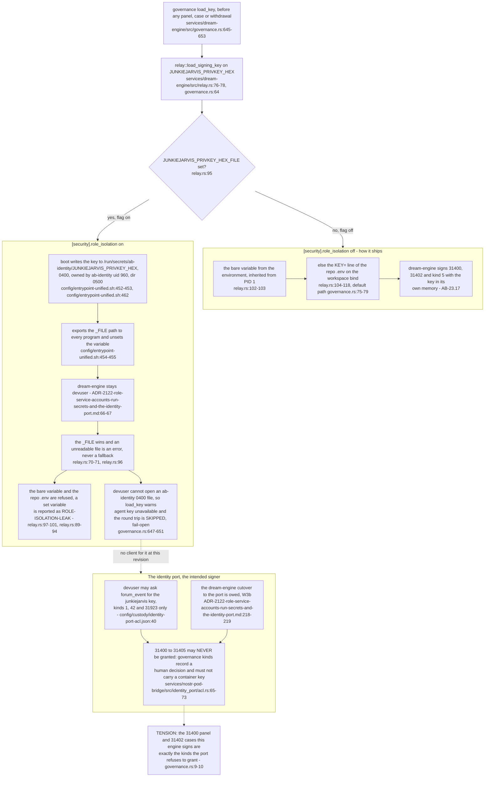
```mermaid
flowchart TB
    GOVN["governance load_key, before any panel, case or withdrawal<br/>services/dream-engine/src/governance.rs:645-653"]
    LSK["relay::load_signing_key on JUNKIEJARVIS_PRIVKEY_HEX<br/>services/dream-engine/src/relay.rs:76-78, governance.rs:64"]
    FV{"JUNKIEJARVIS_PRIVKEY_HEX_FILE set?<br/>relay.rs:95"}
    GOVN --> LSK --> FV
    subgraph off["[security].role_isolation off - how it ships"]
        O1["the bare variable from the environment, inherited from PID 1<br/>relay.rs:102-103"]
        O2["else the KEY= line of the repo .env on the workspace bind<br/>relay.rs:104-118, default path governance.rs:75-79"]
        O3["dream-engine signs 31400, 31402 and kind 5 with the key in its<br/>own memory - AB-23.17"]
        O1 --> O2 --> O3
    end
    subgraph on["[security].role_isolation on"]
        E1["boot writes the key to /run/secrets/ab-identity/JUNKIEJARVIS_PRIVKEY_HEX,<br/>0400, owned by ab-identity uid 960, dir 0500<br/>config/entrypoint-unified.sh:452-453, config/entrypoint-unified.sh:462"]
        E2["exports the _FILE path to every program and unsets the variable<br/>config/entrypoint-unified.sh:454-455"]
        E3["dream-engine stays devuser - ADR-2122-role-service-accounts-run-secrets-and-the-identity-port.md:66-67"]
        E4["the _FILE wins and an unreadable file is an error, never a fallback<br/>relay.rs:70-71, relay.rs:96"]
        E5["the bare variable and the repo .env are refused, a set variable<br/>is reported as ROLE-ISOLATION-LEAK - relay.rs:97-101, relay.rs:89-94"]
        E6["devuser cannot open an ab-identity 0400 file, so load_key warns<br/>agent key unavailable and the round trip is SKIPPED, fail-open<br/>governance.rs:647-651"]
        E1 --> E2 --> E3 --> E4 --> E6
        E4 --> E5
    end
    FV -->|"no, flag off"| off
    FV -->|"yes, flag on"| on
    subgraph port["The identity port, the intended signer"]
        P1["devuser may ask forum_event for the junkiejarvis key,<br/>kinds 1, 42 and 31923 only - config/custody/identity-port-acl.json:40"]
        P2["31400 to 31405 may NEVER be granted: governance kinds record a<br/>human decision and must not carry a container key<br/>services/nostr-pod-bridge/src/identity_port/acl.rs:65-73"]
        P3["the dream-engine cutover to the port is owed, W3b<br/>ADR-2122-role-service-accounts-run-secrets-and-the-identity-port.md:218-219"]
        P1 --> P2
        P3 --> P2
    end
    E6 -.->|"no client for it at this revision"| port
    P2 -.-> T["TENSION: the 31400 panel and 31402 cases this engine signs are<br/>exactly the kinds the port refuses to grant - governance.rs:9-10"]
```

**Invariant (under role_isolation):** dream-engine never reads the JunkieJarvis key from its environment or from the repo `.env` on the workspace bind: with the flag on only `JUNKIEJARVIS_PRIVKEY_HEX_FILE` is consulted, and its absence is an error (`../project/agentbox/services/dream-engine/src/relay.rs:95-101`). With the flag off, which is how it ships, the pre-W2 order stands: the bare variable, then the `.env` line (`../project/agentbox/services/dream-engine/src/relay.rs:102-118`), the same loader contract as `scripts/dream-forum-suggestions.mjs`, which reads it through `role-secret.js` (`../project/agentbox/scripts/dream-forum-suggestions.mjs:194-200`, `../project/agentbox/management-api/lib/role-secret.js:120`).

**Tension (identity port ACL vs the forum governance round trip):** the port's loader refuses to grant kinds 31400-31405 to anyone, because a governance event records a human decision and must not carry a container key (`../project/agentbox/services/nostr-pod-bridge/src/identity_port/acl.rs:65-73`). Yet the dream engine publishes the 31400 panel and 31402 cases signed with the JunkieJarvis key (`../project/agentbox/services/dream-engine/src/governance.rs:9-10`), and ADR-2122 still plans to move dream-engine onto the port in W3b (`../project/agentbox/docs/adr/ADR-2122-role-service-accounts-run-secrets-and-the-identity-port.md:218-219`). As written, the port can never sign what AB-23.17 sends.

**Open:** under `[security].role_isolation` the forum governance round trip stops without an error. The delivered key file belongs to `ab-identity`, dream-engine runs as devuser, and `load_key` treats the refusal as fail-open and skips (`../project/agentbox/config/entrypoint-unified.sh:452-454`, `../project/agentbox/services/dream-engine/src/governance.rs:645-653`). Nothing at this revision says whether that is the intended state until W3b, or a gap the boot rehearsal must catch.

## Audit qualification - 2026-09-07

ADR-2081 source corrections above remain **staged** for the supervised nightly loop. Its loaded Nix-store binary requires an image rebuild and process-identity receipt before these source fixes can be called live. This audit did not rebuild or activate it.
````

## DIFF

```diff
diff --git a/agentbox.toml b/agentbox.toml
index 8876ec67c..10942b249 100644
--- a/agentbox.toml
+++ b/agentbox.toml
@@ -1638,6 +1638,21 @@ key_file  = "/home/devuser/workspace/sidestr/agents/poker-citizen.key"
 relay     = "wss://dreamlab-nostr-relay.solitary-paper-764d.workers.dev"
 daily_cap = 20000    # DREAM the house pays out per day at most
 
+# [poker_citizen.<name>]: a further seat, one per sidestr chain (kit ADR-2021,
+# website ADR-2009). <name> is the [sidechain.<name>] it settles on; its
+# program is poker-citizen-<name>, its files poker-citizen-<name>.{key,json}.
+# asset_id is the chain's asset issue txid (BLAKES7 on dreamlab-txbt4) and is
+# required: the seat refuses to deal until the asset exists.
+[poker_citizen.dreamlab-txbt4]
+enabled   = true
+chain_id  = "sidestr:dreamlab-txbt4"
+ticker    = "BLAKES7"
+asset_id  = ""        # set to the BLAKES7 issue txid once issued (2026-10-03 pending)
+key_file  = "/home/devuser/workspace/sidestr/agents/poker-citizen-txbt4.key"
+port      = 3451
+relay     = "wss://dreamlab-nostr-relay.solitary-paper-764d.workers.dev"
+daily_cap = 200000   # BLAKES7 the house pays out per day at most
+
 [payments.sidestr]
 enabled                 = true
 # chain_id: the SC1 demo chain; sidestr:dreamlab is the live one on :3450
diff --git a/flake.nix b/flake.nix
index 505404a07..4675c6751 100644
--- a/flake.nix
+++ b/flake.nix
@@ -296,6 +296,24 @@
         pokerCitizenState = unplaceheld (pokerCitizenCfg.state or "");
         pokerCitizenRelay = unplaceheld (pokerCitizenCfg.relay or "");
         pokerCitizenCap = toString (pokerCitizenCfg.daily_cap or 20000);
+        # [poker_citizen.<name>]: one further seat per sidestr chain (kit
+        # ADR-2021). Each bakes [program:poker-citizen-<name>] on its chain's
+        # producer port with its own key, ledger and asset. Gated on the chain's
+        # own [sidechain.<name>].enabled as well.
+        pokerCitizenSeats = lib.mapAttrs (name: c: rec {
+            chainOn = (sidechainChains.${name} or { enabled = false; }).enabled;
+            enabled = chainOn && (c.enabled or false);
+            chainId = c.chain_id or "sidestr:${name}";
+            ticker = c.ticker or "";
+            assetId = unplaceheld (c.asset_id or "");
+            keyFile = unplaceheld (c.key_file or "/home/devuser/workspace/sidestr/agents/poker-citizen-${name}.key");
+            state = unplaceheld (c.state or "");
+            relay = unplaceheld (c.relay or "");
+            port = toString (c.port or 3450);
+            cap = toString (c.daily_cap or 20000);
+            instance = "poker-citizen-${name}";
+          }) (lib.filterAttrs (_: v: builtins.isAttrs v) pokerCitizenCfg);
+        pokerCitizenAnySeat = lib.any (c: c.enabled) (lib.attrValues pokerCitizenSeats);
         securityCfg = agentboxConfig.security or {};
         securityExceptions = securityCfg.exceptions or {};
         consultantsCfg = agentboxConfig.consultants or {};
@@ -1674,7 +1692,7 @@
         # nostr-bbs-poker-citizen — the poker table's house seat ([poker_citizen]).
         # Baked from the kit at the website's KIT_REF; see lib/poker-citizen.nix.
         pokerCitizenPkg = import ./lib/poker-citizen.nix { inherit lib; pkgs = rustPkgs; };
-        pokerCitizenPackages = lib.optionals pokerCitizenEnabled [ pokerCitizenPkg ];
+        pokerCitizenPackages = lib.optionals (pokerCitizenEnabled || pokerCitizenAnySeat) [ pokerCitizenPkg ];
         # factrail — Jev compaction with fact rails ([features.jev_compaction],
         # ADR-2121). One pinned commit gives the binary and the
         # Claude Code shim that calls it; see lib/factrail.nix.
@@ -2893,6 +2911,21 @@ stderr_logfile_maxbytes=5MB
 ''}
 ${lib.concatMapStrings (c: lib.optionalString c.enabled ''
 
+[program:${c.instance}]
+command=/opt/agentbox/config/poker/run-citizen.sh
+user=devuser
+environment=HOME="/home/devuser",PATH="${lib.makeBinPath [ pokerCitizenPkg pkgs.curl pkgs.bash pkgs.coreutils ]}:/usr/local/bin:/bin:/usr/bin",POKER_CHAIN_ID="${c.chainId}",POKER_INSTANCE="${c.instance}",POKER_TICKER="${c.ticker}",POKER_ASSET_ID="${c.assetId}",SIDESTR_PORT="${c.port}",POKER_CITIZEN_KEY_FILE="${c.keyFile}"${lib.optionalString (c.state != "") ",POKER_CITIZEN_STATE=\"${c.state}\""}${lib.optionalString (c.relay != "") ",POKER_CITIZEN_RELAY=\"${c.relay}\""},POKER_DAILY_CAP="${c.cap}"
+autostart=true
+autorestart=true
+startsecs=10
+priority=265
+stdout_logfile=/var/log/${c.instance}.log
+stderr_logfile=/var/log/${c.instance}.error.log
+stdout_logfile_maxbytes=5MB
+stderr_logfile_maxbytes=5MB
+'') (lib.attrValues pokerCitizenSeats)}
+${lib.concatMapStrings (c: lib.optionalString c.enabled ''
+
 ; [sidechain.${c.name}] (ADR-2103): sidestr:${c.name}'s producer beside ${c.parent}.
 ; Same runner as sidestr:dreamlab's, keyed by SIDESTR_CHAIN. It refuses to start
 ; on a baked upstream that disagrees with upstream-pins, on a document sealed beside a parent other
```
