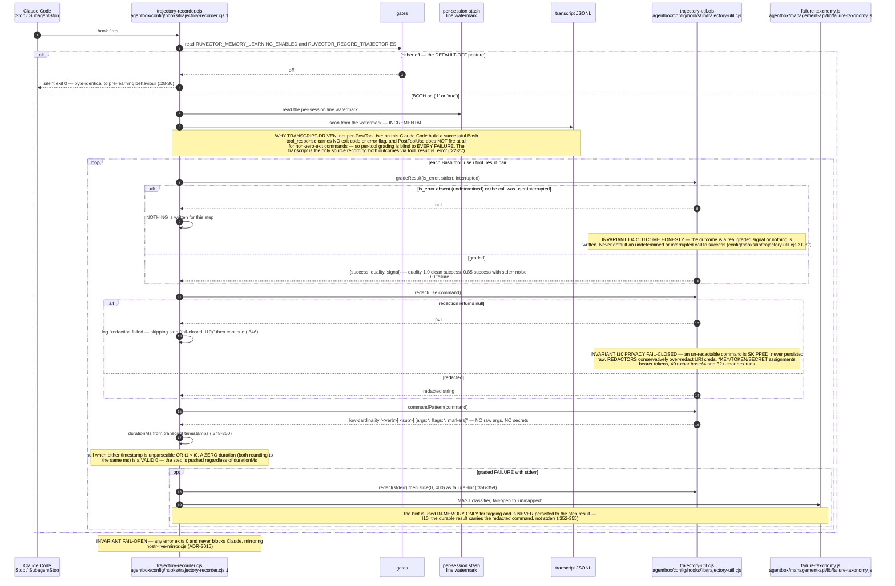
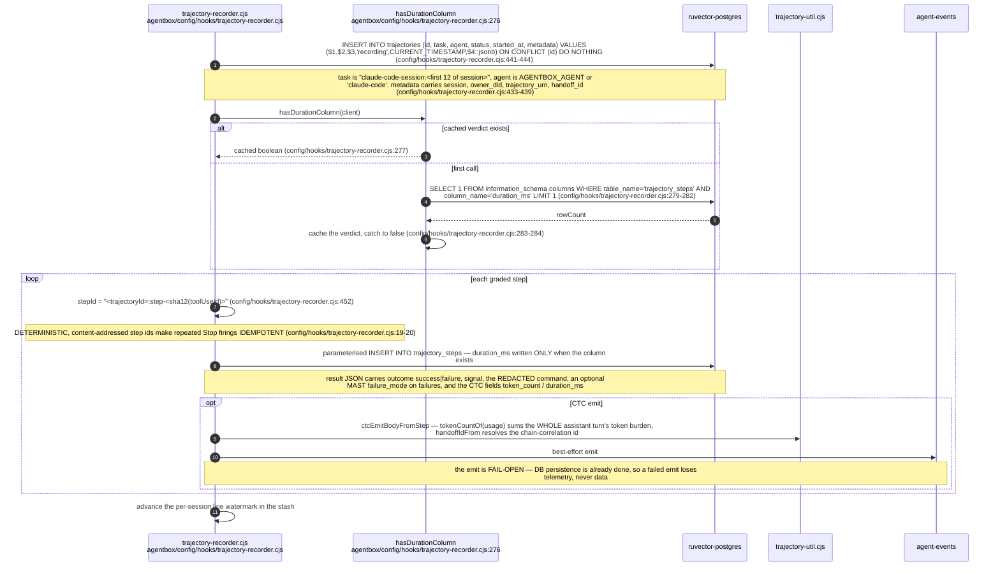
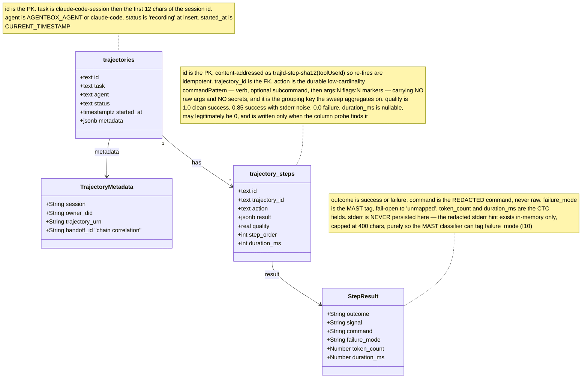
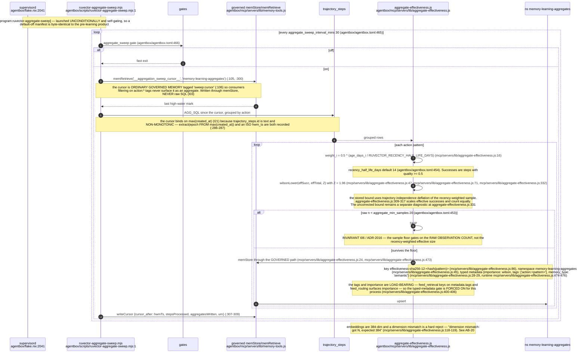
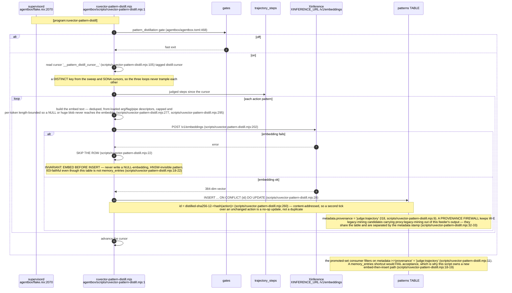
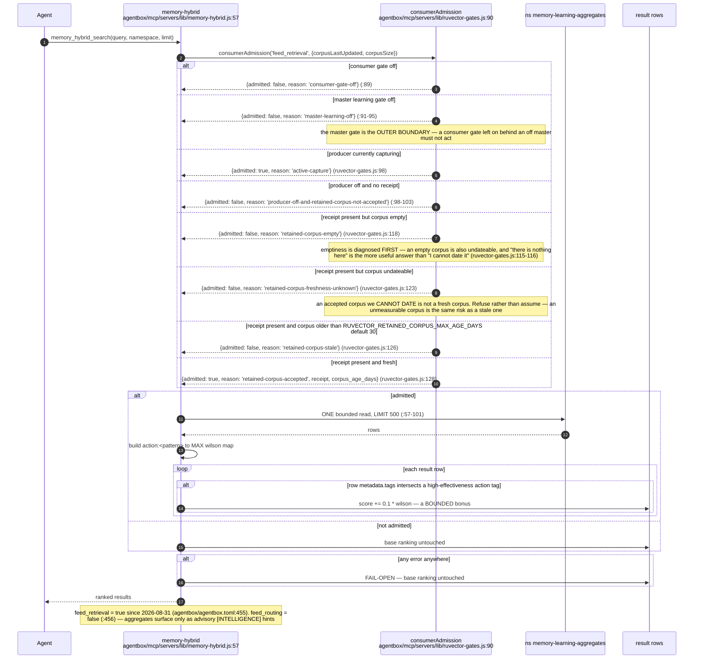
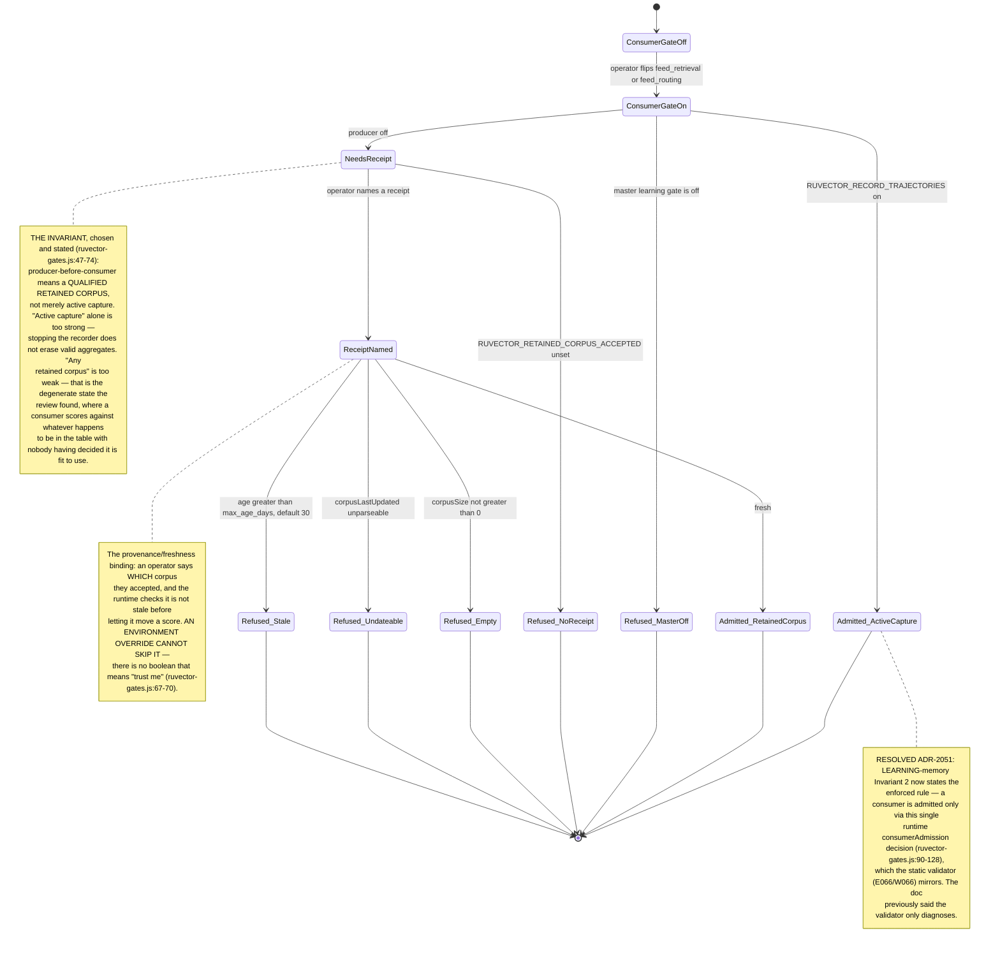
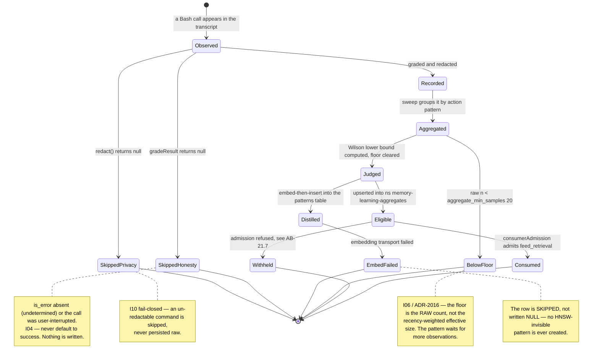
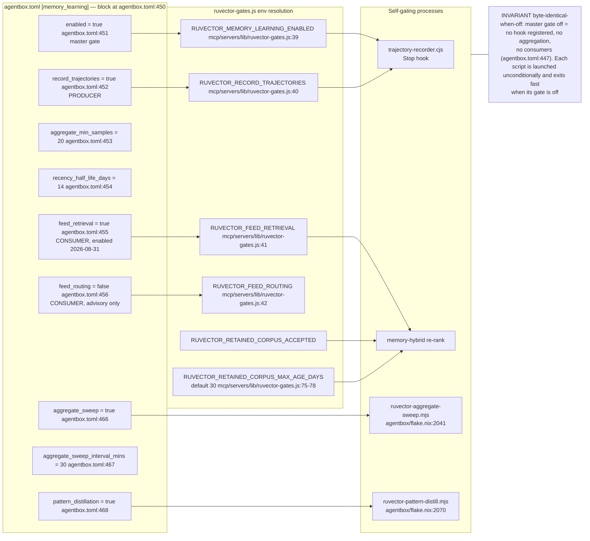
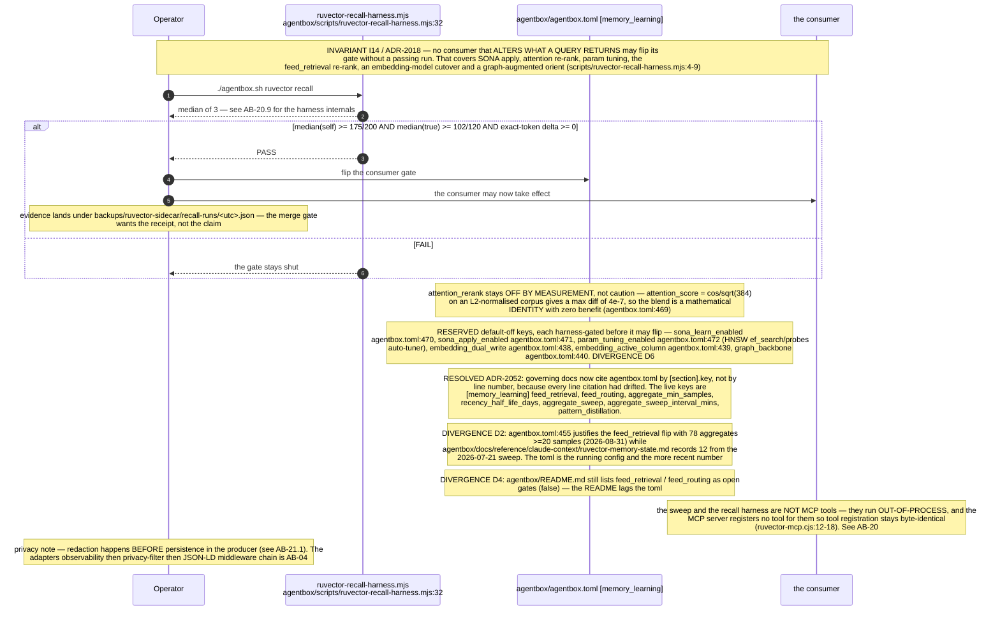

# Label ab-12

You are an independent labeller for a pre-registered experiment. Below are (1) a TOPIC: a Markdown file of Mermaid diagrams, with short prose notes, that document code, with `path:line` citations, where paths under `../project/` are in the VisionClaw repository and paths under `../project/agentbox/` are in the agentbox repository; and (2) a DIFF: one commit's changes in the agentbox repository, restricted to the files the topic lists under `sources:`. The topic was verified against a revision of that repository at or before this commit's parent, so the diff is a change made after the topic was written.

Answer exactly one question:

> **Did this change make anything this topic states wrong or misleading?**

Judge only from the two texts below; do not look anything else up. Reply with a single JSON object and nothing else:

```json
{"verdict": "yes" | "no", "statements": ["<diagram or section id>: <the statement, quoted>", ...], "line_anchors_only": true | false, "reason": "<one or two sentences>"}
```

`statements` lists every statement in the topic (a message, node, edge, guard, label or prose claim) that the change makes wrong or misleading; it is empty when the verdict is no. `line_anchors_only` is true when the only such statements are `path:line` anchors whose cited code merely moved.

## TOPIC (docs/diagrams/agentbox/21-learning-loop.md)

````markdown
---
id: AB-21
title: Learning loop — capture, judge, distil, consume
area: agentbox
governing:
  - ../project/agentbox/docs/LEARNING-memory.md
adrs: [ADR-2015, ADR-2016, ADR-2017, ADR-2018, ADR-2051, ADR-2052]
sources:
  - ../project/agentbox/config/hooks/trajectory-recorder.cjs
  - ../project/agentbox/config/hooks/lib/trajectory-util.cjs
  - ../project/agentbox/management-api/lib/failure-taxonomy.js
  - ../project/agentbox/scripts/ruvector-aggregate-sweep.mjs
  - ../project/agentbox/scripts/ruvector-pattern-distill.mjs
  - ../project/agentbox/mcp/servers/lib/aggregate-effectiveness.js
  - ../project/agentbox/mcp/servers/lib/memory-hybrid.js
  - ../project/agentbox/mcp/servers/lib/memory-tools.js
  - ../project/agentbox/mcp/servers/lib/ruvector-gates.js
  - ../project/agentbox/scripts/ruvector-recall-harness.mjs
  - ../project/agentbox/agentbox.toml
  - ../project/agentbox/flake.nix
  - ../project/agentbox/agentbox.sh
  - ../project/agentbox/config/hooks/nostr-live-mirror.cjs
  - ../project/agentbox/mcp/servers/ruvector-mcp.cjs
verified_commit: 5ab197a9d49e9721b85b791bf9efe30842c9e047
---

## AB-21.1 Capture — transcript-driven grading



## AB-21.2 Capture — persistence



## AB-21.3 Trajectory schema



## AB-21.4 Judge — the aggregate sweep



## AB-21.5 Distil — patterns table



## AB-21.6 Consume — the feed_retrieval re-rank



## AB-21.7 ADR-2017 producer-before-consumer



## AB-21.8 A trajectory's life



## AB-21.9 Gate topology



## AB-21.10 The recall gate on any consumer flip



## Audit qualification — 2026-09-07

ADR-2015 is transcript-driven but uses the **structured `tool_result.is_error` flag**, not an LLM's error prose. Unknown or interrupted outcomes are skipped. Current source keeps the watermark unchanged when pg is unavailable and records `usage_id`, turn-level scope and queue overflow metadata. The 57 selected Jest assertions in the [audit](../../estate-review/2026-09-07-agentbox-audit.md) passed. They do not establish a complete failure denominator or live recorder-to-dashboard delivery: non-Bash work, skipped outcomes, crash-before-Stop, HTTP status handling and downstream usage deduplication remain separate obligations.
````

## DIFF

```diff
diff --git a/agentbox.toml b/agentbox.toml
index c3a3ef129..20d4e0fbb 100644
--- a/agentbox.toml
+++ b/agentbox.toml
@@ -1586,7 +1586,7 @@ faucet_sats     = 2000    # fee sats per grant: about two settlements at ~1,010
 # sidestr-producer-dreamlab-txbt4 (and the mirror/faucet below) on the next
 # rebuild. NOT ANCHORED: checkpoint_every = 0 (owner SC5, cost; ADR-2103 Open).
 [sidechain.dreamlab-txbt4]
-enabled                = false   # [program:sidestr-producer-dreamlab-txbt4]
+enabled                = true    # [program:sidestr-producer-dreamlab-txbt4]; live 2026-10-03 (BLAKES7 / second poker chain)
 parent                 = "txbt4" # must equal the sealed document's parent (ADR-2103 D3)
 port                   = 3451    # loopback; dreamlab holds 3450
 interval               = 600
@@ -1866,6 +1866,7 @@ unmute_build_context = "../voice-stack/unmute"  # external web/backend source ch
 claude = true
 claude_code = true
 ruflo = true
+ruflo_console = true
 claude_flow = true  # legacy alias gate: claude-flow IS ruflo (upstream rename, github.com/ruvnet/ruflo) — either gate bakes the ONE consolidated closure, which ships `ruflo` + `claude-flow` + `claude-flow-mcp` bins
 agentic_qe = false  # 2026-09-25: 0 MCP calls in 14 days; build-with-quality supersedes the aqe fleet. Rebuild-class (drops the aqe CLI + root-session agentic-qe MCP)
 metaharness = true  # ADR-064: bakes metaharness@0.3.2 + @metaharness/darwin@0.8.3 CLIs (the versions the ruflo-metaharness plugin pins); pin discipline per ADR-067
```
