# Label ab-14

You are an independent labeller for a pre-registered experiment. Below are (1) a TOPIC: a Markdown file of Mermaid diagrams, with short prose notes, that document code, with `path:line` citations, where paths under `../project/` are in the VisionClaw repository and paths under `../project/agentbox/` are in the agentbox repository; and (2) a DIFF: one commit's changes in the agentbox repository, restricted to the files the topic lists under `sources:`. The topic was verified against a revision of that repository at or before this commit's parent, so the diff is a change made after the topic was written.

Answer exactly one question:

> **Did this change make anything this topic states wrong or misleading?**

Judge only from the two texts below; do not look anything else up. Reply with a single JSON object and nothing else:

```json
{"verdict": "yes" | "no", "statements": ["<diagram or section id>: <the statement, quoted>", ...], "line_anchors_only": true | false, "reason": "<one or two sentences>"}
```

`statements` lists every statement in the topic (a message, node, edge, guard, label or prose claim) that the change makes wrong or misleading; it is empty when the verdict is no. `line_anchors_only` is true when the only such statements are `path:line` anchors whose cited code merely moved.

## TOPIC (docs/diagrams/agentbox/10-ingress-nip98-proxy-and-aoe.md)

````markdown
---
id: AB-10
title: Ingress — nip98-proxy and the AoE door
area: agentbox
governing:
  - ../project/agentbox/docs/INGRESS-identity.md
  - ../project/agentbox/docs/SECURITY-profiles.md
adrs: [ADR-2002, ADR-2009, ADR-2010, ADR-2011, ADR-2013, ADR-2047, ADR-2080]
sources:
  - ../project/agentbox/docs/INGRESS-identity.md
  - ../project/agentbox/agentbox.toml
  - ../project/agentbox/config/nip98-proxy/proxy.mjs
  - ../project/agentbox/config/nip98-proxy/README.md
  - ../project/agentbox/config/nip98-proxy/selftest.mjs
  - ../project/agentbox/mcp/servers/nostr-bridge.js
  - ../project/agentbox/config/nostr-gateway/gateway.cjs
  - ../project/agentbox/scripts/aoe-seed-sessions.mjs
  - ../project/agentbox/config/entrypoint-unified.sh
  - ../project/agentbox/management-api/server.js
  - ../project/agentbox/management-api/middleware/auth.js
  - ../project/agentbox/scripts/ci/check-ports-loopback.sh
  - ../project/agentbox/scripts/ci/check-ports-loopback.mjs
  - ../project/agentbox/flake.nix
  - ../project/agentbox/docs/adr/ADR-2002-aoe-token-auth-boundary.md
  - ../project/agentbox/docs/adr/ADR-2009-nip98-proxy-identity-boundary.md
  - ../project/agentbox/docs/adr/ADR-2010-bearer-gated-behind-nip98.md
  - ../project/agentbox/docs/adr/ADR-2011-hex-canonical-identity.md
  - ../project/agentbox/docs/adr/ADR-2013-loopback-publish-except-9096.md
  - ../project/agentbox/docker-compose.voice.yml
  - ../project/agentbox/voice/console/Caddyfile
  - ../project/agentbox/management-api/lib/agent-event-auth.js
  - ../project/agentbox/management-api/lib/action-plane.js
verified_commit: c4ed3ec6505858e1e5ead651c29115d2f74e5546
---

## AB-10.1 Door inventory and port topology

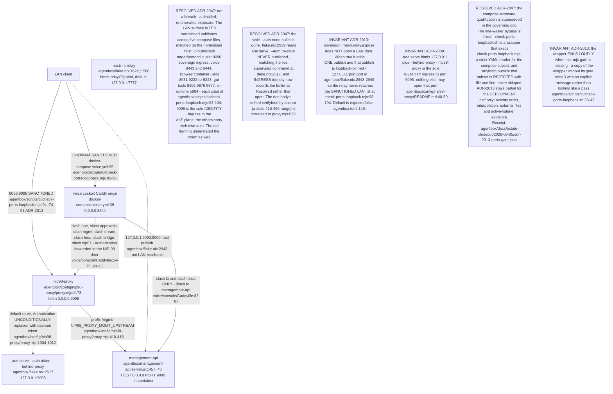

## AB-10.2 proxy.mjs boot sequence — config, routes, verifier load

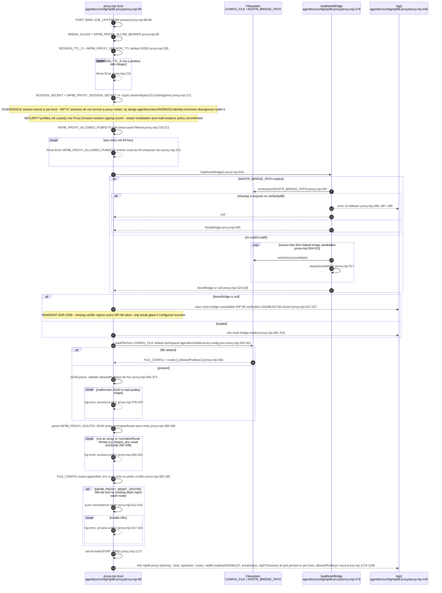

## AB-10.3 verifyIdentity — full auth precedence

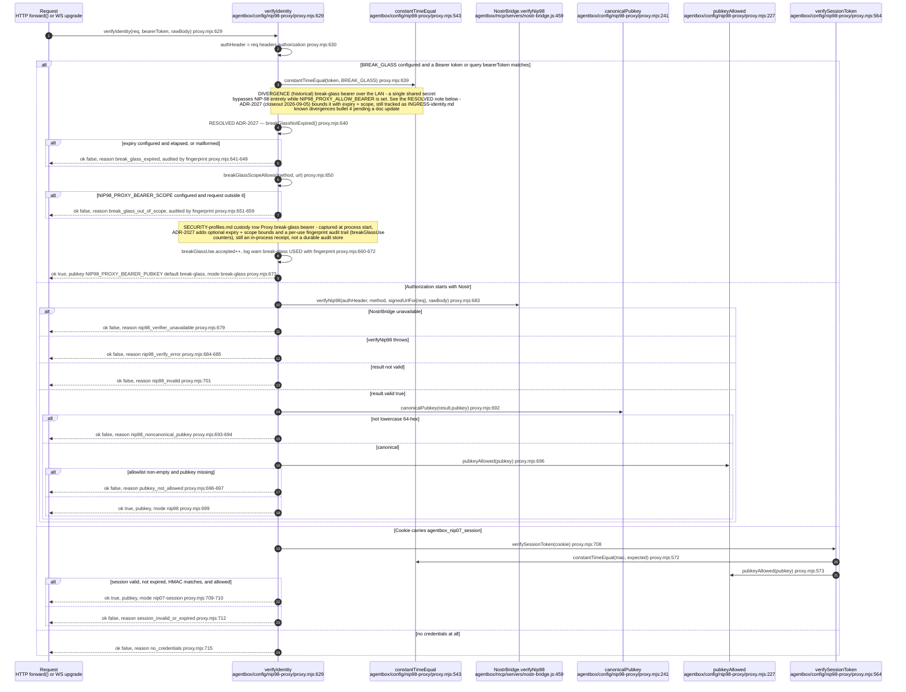

## AB-10.4 verifyNip98 internals — header, tags, payload, signature, replay

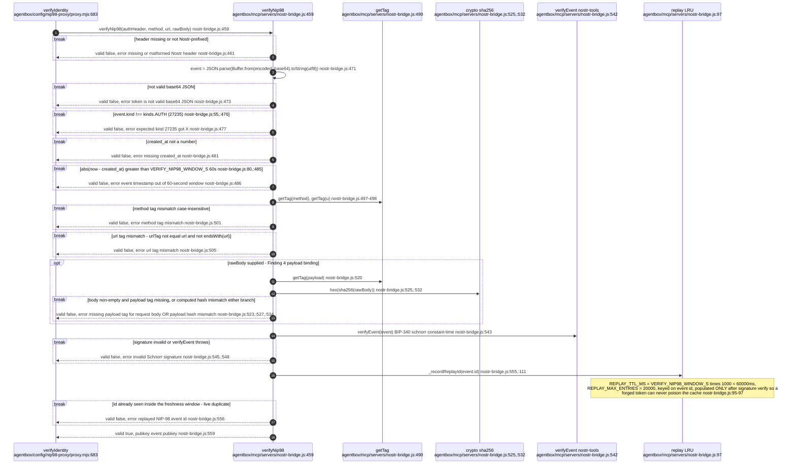

## AB-10.5 Request auth state machine

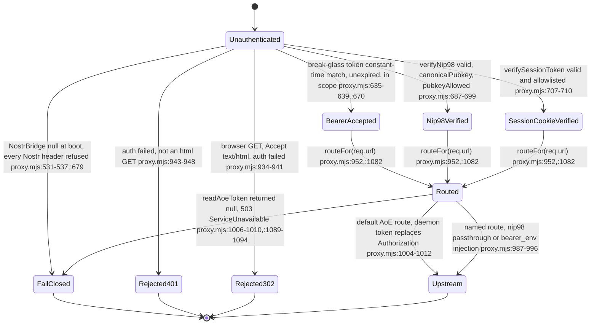

Every anchor above was re-derived in the 2026-09-07 pass; the previous set pointed
into the HANDSHAKE_PAGE string literal and into constantTimeEqual, not at the
transitions it named.

## AB-10.6 AoE board door — default upstream, daemon-token replacement

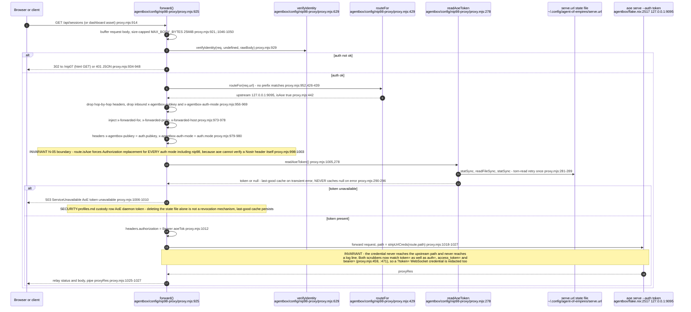

## AB-10.7 /mgmt/* router door — bearer_env gated behind NIP-98

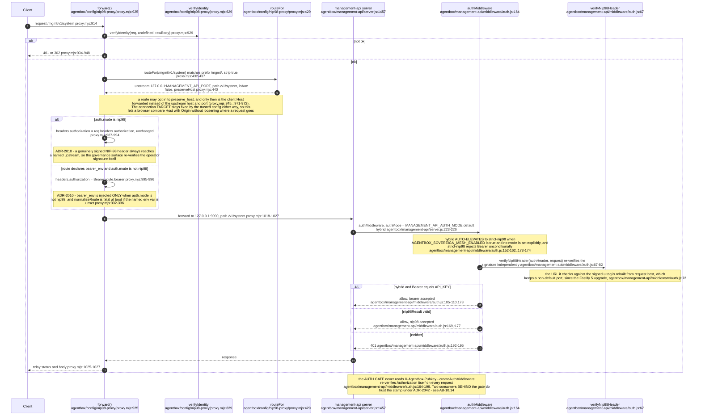

## AB-10.8 NIP-07 browser session handshake

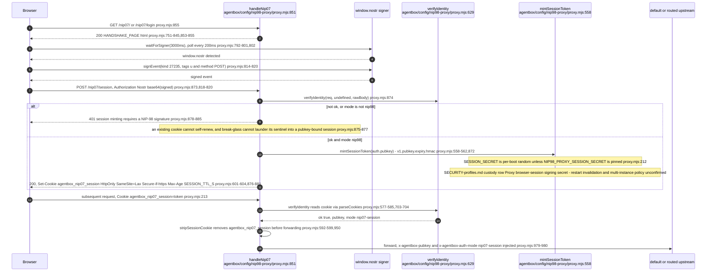

GET `/nip07/session` is a separate, unauthenticated-upstream probe: it reads the
cookie and calls `verifySessionToken` itself, nothing else, proxy.mjs:861-863.
INVARIANT: unrelated upstream availability or authorisation must not make a
signed-in browser start prompting its signer again — the probe never touches the
route or upstream, proxy.mjs:862-863. Response is `cache-control: no-store`,
proxy.mjs:867, so a cached 200 can never stand in for a live check.

## AB-10.9 WebSocket upgrade auth path

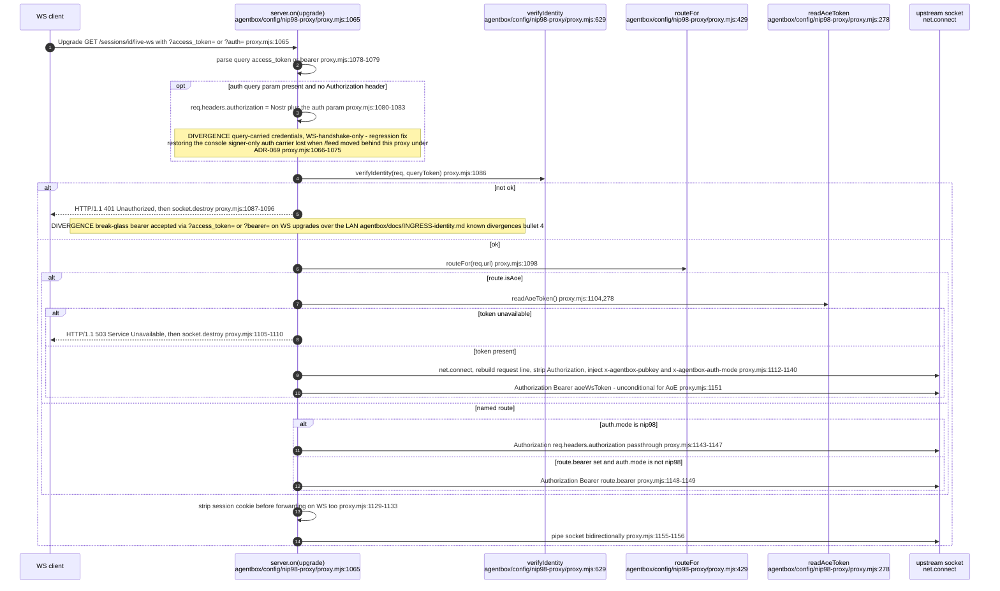

## AB-10.10 Direct :9090 path vs proxied :9090 path

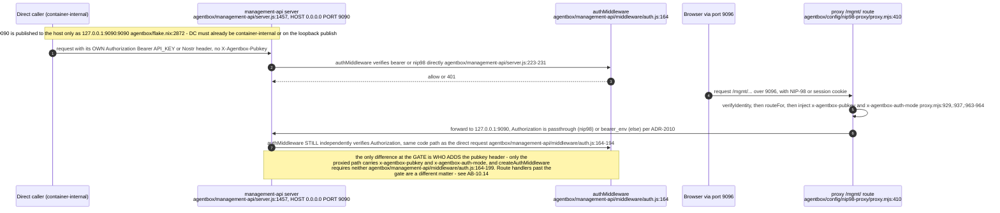

## AB-10.11 Direct :9095 token-bearing consumer — nostr-gateway aoeRequest

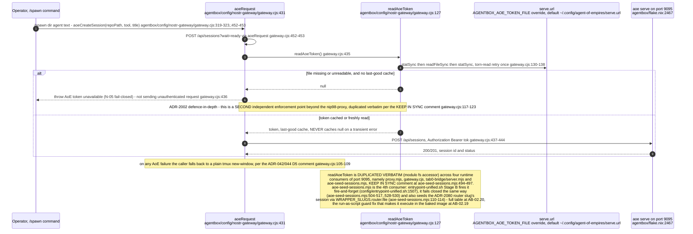

## AB-10.12 selftest.mjs assertion families

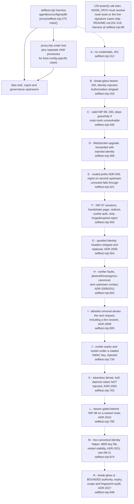

The A-to-N chain is execution order: `main()` runs the families in sequence, so a
failure in an early family short-circuits the ones after it.

## AB-10.14 ADR-2042 — who actually trusts X-Agentbox-Pubkey

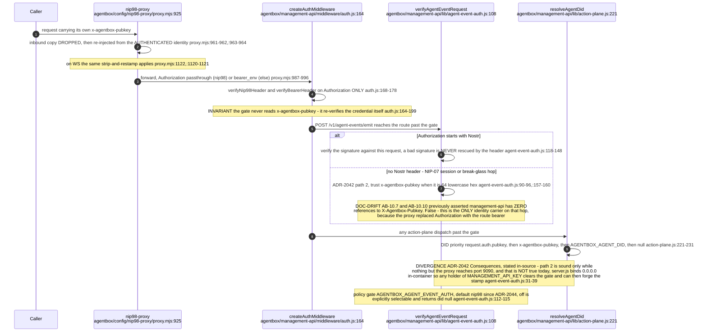

The governing doc states Invariant 2 as "X-Agentbox-Pubkey always proxy-injected,
never trusted inbound" — true at the ingress, and the two ADR-2042 consumers above
are the deliberate, documented exception on the far side of the gate.
````

## DIFF

```diff
diff --git a/docs/adr/ADR-2002-aoe-token-auth-boundary.md b/docs/adr/ADR-2002-aoe-token-auth-boundary.md
index 741539b56..a5d5a5ad8 100644
--- a/docs/adr/ADR-2002-aoe-token-auth-boundary.md
+++ b/docs/adr/ADR-2002-aoe-token-auth-boundary.md
@@ -7,7 +7,7 @@ implementation_status: complete
 activation_status: live
 supersedes: []
 superseded_by: []
-verified_commit: caab741c6858c4e2d08eb513a773fad75fa79b70
+verified_commit: c7b5d5f5535c9203f21b24ed710705a3fe16dcf2
 verified_paths: [config/nip98-proxy/proxy.mjs, scripts/aoe-curl.sh, flake.nix]
 owner: jjohare
 review_trigger: next image rebuild (activation), or any new consumer of :9095, or per-process isolation becoming available
diff --git a/docs/adr/ADR-2009-nip98-proxy-identity-boundary.md b/docs/adr/ADR-2009-nip98-proxy-identity-boundary.md
index 8c26fc201..dda2e2697 100644
--- a/docs/adr/ADR-2009-nip98-proxy-identity-boundary.md
+++ b/docs/adr/ADR-2009-nip98-proxy-identity-boundary.md
@@ -7,7 +7,7 @@ implementation_status: complete
 activation_status: live
 supersedes: []
 superseded_by: []
-verified_commit: f63760e1976deef544bb08b13bcf3ce30aca578c
+verified_commit: c7b5d5f5535c9203f21b24ed710705a3fe16dcf2
 verified_paths: [config/nip98-proxy/proxy.mjs, flake.nix, docs/INGRESS-identity.md]
 owner: jjohare
 review_trigger: A second identity ingress is proposed, or aoe serve stops binding loopback
diff --git a/docs/adr/ADR-2013-loopback-publish-except-9096.md b/docs/adr/ADR-2013-loopback-publish-except-9096.md
index cf35ce8bb..4cde9be2c 100644
--- a/docs/adr/ADR-2013-loopback-publish-except-9096.md
+++ b/docs/adr/ADR-2013-loopback-publish-except-9096.md
@@ -7,7 +7,7 @@ implementation_status: partial
 activation_status: live
 supersedes: []
 superseded_by: []
-verified_commit: caab741c6858c4e2d08eb513a773fad75fa79b70
+verified_commit: c7b5d5f5535c9203f21b24ed710705a3fe16dcf2
 verified_paths: [scripts/ci/check-ports-loopback.sh, .github/workflows/invariants.yml, flake.nix, docker-compose.yml]
 owner: jjohare
 review_trigger: Any new entry on the SANCTIONED list, or a new compose overlay file
```
