# Label vc-08

You are an independent labeller for a pre-registered experiment. Below are (1) a TOPIC: a Markdown file of Mermaid diagrams, with short prose notes, that document code, with `path:line` citations, where paths under `../project/` are in the VisionClaw repository and paths under `../project/agentbox/` are in the agentbox repository; and (2) a DIFF: one commit's changes in the visionclaw repository, restricted to the files the topic lists under `sources:`. The topic was verified against a revision of that repository at or before this commit's parent, so the diff is a change made after the topic was written.

Answer exactly one question:

> **Did this change make anything this topic states wrong or misleading?**

Judge only from the two texts below; do not look anything else up. Reply with a single JSON object and nothing else:

```json
{"verdict": "yes" | "no", "statements": ["<diagram or section id>: <the statement, quoted>", ...], "line_anchors_only": true | false, "reason": "<one or two sentences>"}
```

`statements` lists every statement in the topic (a message, node, edge, guard, label or prose claim) that the change makes wrong or misleading; it is empty when the verdict is no. `line_anchors_only` is true when the only such statements are `path:line` anchors whose cited code merely moved.

## TOPIC (docs/diagrams/visionclaw/04-handlers-graph-and-state.md)

````markdown
---
id: VC-04
title: Handler internals — graph, state, and domain route families
area: visionclaw
governing:
  - ../project/docs/BASELINE-architecture.md
adrs: [ADR-2005, ADR-2007, ADR-2011, ADR-2111]
sources:
  - ../project/src/handlers/api_handler/graph/mod.rs
  - ../project/src/handlers/api_handler/files/mod.rs
  - ../project/src/handlers/bots_handler.rs
  - ../project/src/handlers/api_handler/bots/mod.rs
  - ../project/src/handlers/api_handler/analytics/mod.rs
  - ../project/src/handlers/api_handler/ontology_physics/mod.rs
  - ../project/src/handlers/api_handler/semantic_forces.rs
  - ../project/src/handlers/ragflow_handler.rs
  - ../project/src/handlers/constraints_handler.rs
  - ../project/src/handlers/graph_state_handler.rs
  - ../project/src/handlers/graph_export_handler.rs
  - ../project/src/handlers/layout_handler.rs
  - ../project/src/handlers/physics_handler.rs
  - ../project/src/application/physics_service.rs
  - ../project/src/adapters/actix_physics_adapter.rs
  - ../project/crates/visionclaw-domain/src/ports/gpu_physics_adapter.rs
  - ../project/src/handlers/kpi_handler.rs
  - ../project/src/services/kpi_compute.rs
  - ../project/src/adapters/sqlite_kpi_repository.rs
  - ../project/src/services/file_service.rs
  - ../project/src/services/ragflow_service.rs
  - ../project/src/services/provenance_trace.rs
  - ../project/src/services/intent_match.rs
  - ../project/docs/adr/ADR-2111-re-sequence-rgb-for-bridged-assets-and-delete-the-host-payment-store.md
  - ../project/src/handlers/consolidated_health_handler.rs
  - ../project/src/handlers/liveness_harness_handler.rs
  - ../project/src/services/liveness_harness.rs
  - ../project/src/handlers/trace_handler.rs
  - ../project/src/handlers/validation_handler.rs
  - ../project/src/handlers/schema_handler.rs
  - ../project/src/handlers/semantic_handler.rs
  - ../project/src/handlers/workspace_handler.rs
  - ../project/src/handlers/pages_handler.rs
  - ../project/src/handlers/client_log_handler.rs
  - ../project/src/handlers/client_messages_handler.rs
  - ../project/src/handlers/pay_handler.rs
  - ../project/src/handlers/quic_transport_handler.rs
  - ../project/src/handlers/mod.rs
  - ../project/src/main.rs
  - ../project/src/actors/gpu/analytics_telemetry.rs
  - ../project/src/handlers/api_handler/analytics/performance_handlers.rs
  - ../project/src/handlers/api_handler/analytics/sssp_handlers.rs
  - ../project/src/utils/binary_protocol.rs
  - ../project/src/utils/validation/sanitization.rs
  - ../project/src/handlers/fastwebsockets_handler.rs
verified_commit: 7d3ea2edb067432a57e6fe1fd951fd8254380bb8
---

## VC-04.1 api_handler graph — read path (data, paginated, positions, fold, relations, expand, pattern)
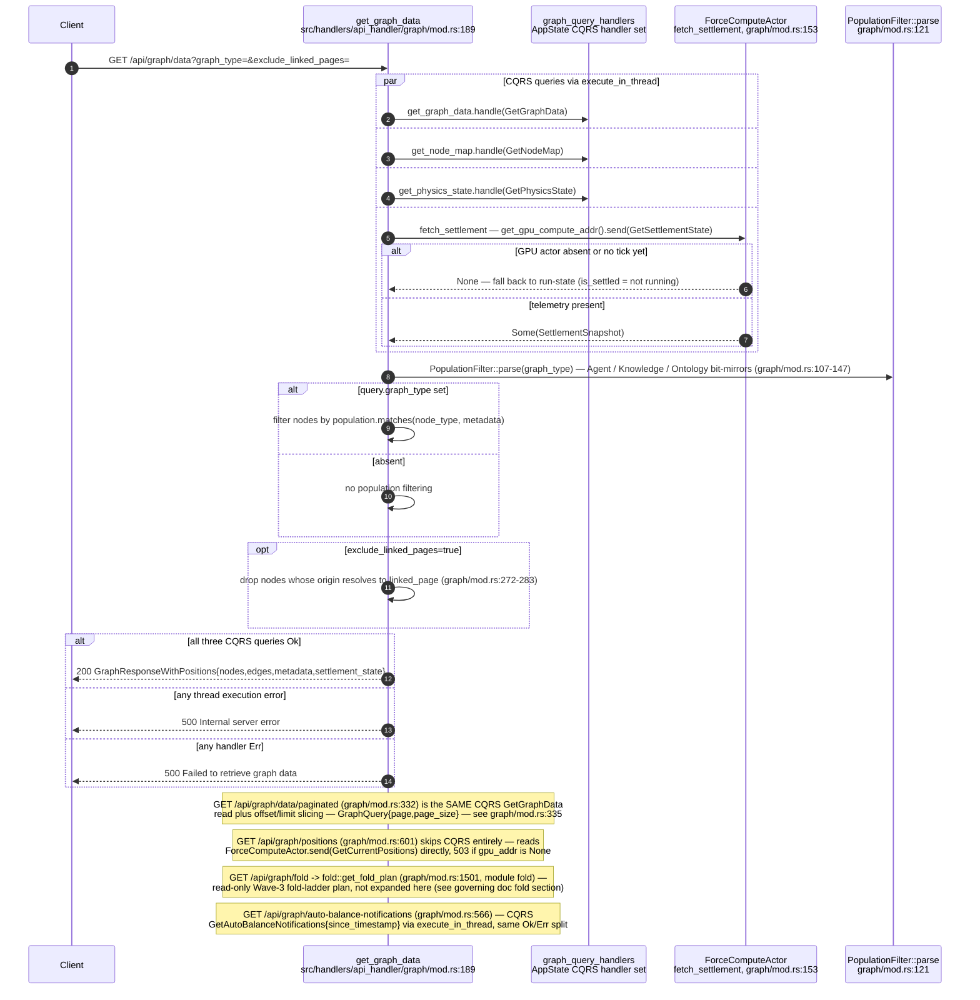
```mermaid
sequenceDiagram
    autonumber
    participant C as Client
    participant H as get_graph_data<br/>src/handlers/api_handler/graph/mod.rs:189
    participant QH as graph_query_handlers<br/>AppState CQRS handler set
    participant GPU as ForceComputeActor<br/>fetch_settlement, graph/mod.rs:153
    participant POP as PopulationFilter::parse<br/>graph/mod.rs:121

    C->>H: GET /api/graph/data?graph_type=&exclude_linked_pages=
    par CQRS queries via execute_in_thread
        H->>QH: get_graph_data.handle(GetGraphData)
    and
        H->>QH: get_node_map.handle(GetNodeMap)
    and
        H->>QH: get_physics_state.handle(GetPhysicsState)
    and
        H->>GPU: fetch_settlement — get_gpu_compute_addr().send(GetSettlementState)
        alt GPU actor absent or no tick yet
            GPU-->>H: None — fall back to run-state (is_settled = not running)
        else telemetry present
            GPU-->>H: Some(SettlementSnapshot)
        end
    end
    H->>POP: PopulationFilter::parse(graph_type) — Agent / Knowledge / Ontology bit-mirrors (graph/mod.rs:107-147)
    alt query.graph_type set
        H->>H: filter nodes by population.matches(node_type, metadata)
    else absent
        H->>H: no population filtering
    end
    opt exclude_linked_pages=true
        H->>H: drop nodes whose origin resolves to linked_page (graph/mod.rs:272-283)
    end
    alt all three CQRS queries Ok
        H-->>C: 200 GraphResponseWithPositions{nodes,edges,metadata,settlement_state}
    else any thread execution error
        H-->>C: 500 Internal server error
    else any handler Err
        H-->>C: 500 Failed to retrieve graph data
    end
    Note over H: GET /api/graph/data/paginated (graph/mod.rs:332) is the SAME CQRS GetGraphData<br/>read plus offset/limit slicing — GraphQuery{page,page_size} — see graph/mod.rs:335
    Note over H: GET /api/graph/positions (graph/mod.rs:601) skips CQRS entirely — reads<br/>ForceComputeActor.send(GetCurrentPositions) directly, 503 if gpu_addr is None
    Note over H: GET /api/graph/fold -> fold::get_fold_plan (graph/mod.rs:1501, module fold) —<br/>read-only Wave-3 fold-ladder plan, not expanded here (see governing doc fold section)
    Note over H: GET /api/graph/auto-balance-notifications (graph/mod.rs:566) — CQRS<br/>GetAutoBalanceNotifications{since_timestamp} via execute_in_thread, same Ok/Err split
```

## VC-04.2 api_handler graph — node/{id} relations, expand, pattern-query (RateLimit 120/min)
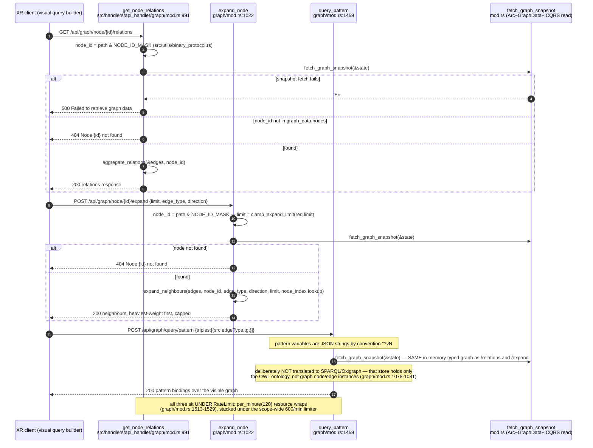
```mermaid
sequenceDiagram
    autonumber
    participant C as XR client (visual query builder)
    participant GR as get_node_relations<br/>src/handlers/api_handler/graph/mod.rs:991
    participant EX as expand_node<br/>graph/mod.rs:1022
    participant QP as query_pattern<br/>graph/mod.rs:1459
    participant SNAP as fetch_graph_snapshot<br/>mod.rs (Arc~GraphData~ CQRS read)

    C->>GR: GET /api/graph/node/{id}/relations
    GR->>GR: node_id = path & NODE_ID_MASK (src/utils/binary_protocol.rs)
    GR->>SNAP: fetch_graph_snapshot(&state)
    alt snapshot fetch fails
        SNAP-->>GR: Err
        GR-->>C: 500 Failed to retrieve graph data
    else node_id not in graph_data.nodes
        GR-->>C: 404 Node {id} not found
    else found
        GR->>GR: aggregate_relations(&edges, node_id)
        GR-->>C: 200 relations response
    end
    C->>EX: POST /api/graph/node/{id}/expand {limit, edge_type, direction}
    EX->>EX: node_id = path & NODE_ID_MASK — limit = clamp_expand_limit(req.limit)
    EX->>SNAP: fetch_graph_snapshot(&state)
    alt node not found
        EX-->>C: 404 Node {id} not found
    else found
        EX->>EX: expand_neighbours(edges, node_id, edge_type, direction, limit, node_index lookup)
        EX-->>C: 200 neighbours, heaviest-weight first, capped
    end
    C->>QP: POST /api/graph/query/pattern {triples:[{src,edgeType,tgt}]}
    Note over QP: pattern variables are JSON strings by convention #quot;?vN#quot —<br/>concrete ids are JSON numbers, masked with NODE_ID_MASK (graph/mod.rs:1083-1089)
    QP->>SNAP: fetch_graph_snapshot(&state) — SAME in-memory typed graph as /relations and /expand
    Note over QP: deliberately NOT translated to SPARQL/Oxigraph — that store holds only<br/>the OWL ontology, not graph node/edge instances (graph/mod.rs:1078-1081)
    QP-->>C: 200 pattern bindings over the visible graph
    Note over GR,QP: all three sit UNDER RateLimit::per_minute(120) resource wraps<br/>(graph/mod.rs:1513-1529), stacked under the scope-wide 600/min limiter
```

## VC-04.3 api_handler graph — update (power_user bulk reload) and refresh (authenticated read-back)
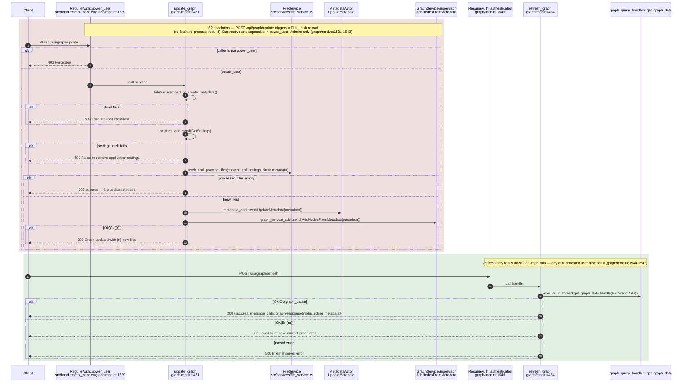
```mermaid
sequenceDiagram
    autonumber
    participant C as Client
    participant RA as RequireAuth::power_user<br/>src/handlers/api_handler/graph/mod.rs:1539
    participant UG as update_graph<br/>graph/mod.rs:471
    participant FS as FileService<br/>src/services/file_service.rs
    participant MD as MetadataActor<br/>UpdateMetadata
    participant GS as GraphServiceSupervisor<br/>AddNodesFromMetadata
    participant RG as RequireAuth::authenticated<br/>graph/mod.rs:1546
    participant RF as refresh_graph<br/>graph/mod.rs:434
    participant QH as graph_query_handlers.get_graph_data

    rect rgb(240,225,225)
    Note over RA,GS: S2 escalation — POST /api/graph/update triggers a FULL bulk reload<br/>(re-fetch, re-process, rebuild). Destructive and expensive -> power_user (Admin) only (graph/mod.rs:1531-1543)
    C->>RA: POST /api/graph/update
    alt caller is not power_user
        RA-->>C: 403 Forbidden
    else power_user
        RA->>UG: call handler
        UG->>UG: FileService::load_or_create_metadata()
        alt load fails
            UG-->>C: 500 Failed to load metadata
        end
        UG->>UG: settings_addr.send(GetSettings)
        alt settings fetch fails
            UG-->>C: 500 Failed to retrieve application settings
        end
        UG->>FS: fetch_and_process_files(content_api, settings, &mut metadata)
        alt processed_files empty
            UG-->>C: 200 success — No updates needed
        else new files
            UG->>MD: metadata_addr.send(UpdateMetadata{metadata})
            UG->>GS: graph_service_addr.send(AddNodesFromMetadata{metadata})
            alt Ok(Ok(()))
                UG-->>C: 200 Graph updated with {n} new files
            end
        end
    end
    end
    rect rgb(225,240,225)
    Note over RG,QH: /refresh only reads back GetGraphData — any authenticated user may call it (graph/mod.rs:1544-1547)
    C->>RG: POST /api/graph/refresh
    RG->>RF: call handler
    RF->>QH: execute_in_thread(get_graph_data.handle(GetGraphData))
    alt Ok(Ok(graph_data))
        RF-->>C: 200 {success, message, data: GraphResponse{nodes,edges,metadata}}
    else Ok(Err(e))
        RF-->>C: 500 Failed to retrieve current graph data
    else thread error
        RF-->>C: 500 Internal server error
    end
    end
```

## VC-04.4 `files` scope — process/get_content/refresh_graph/update_graph
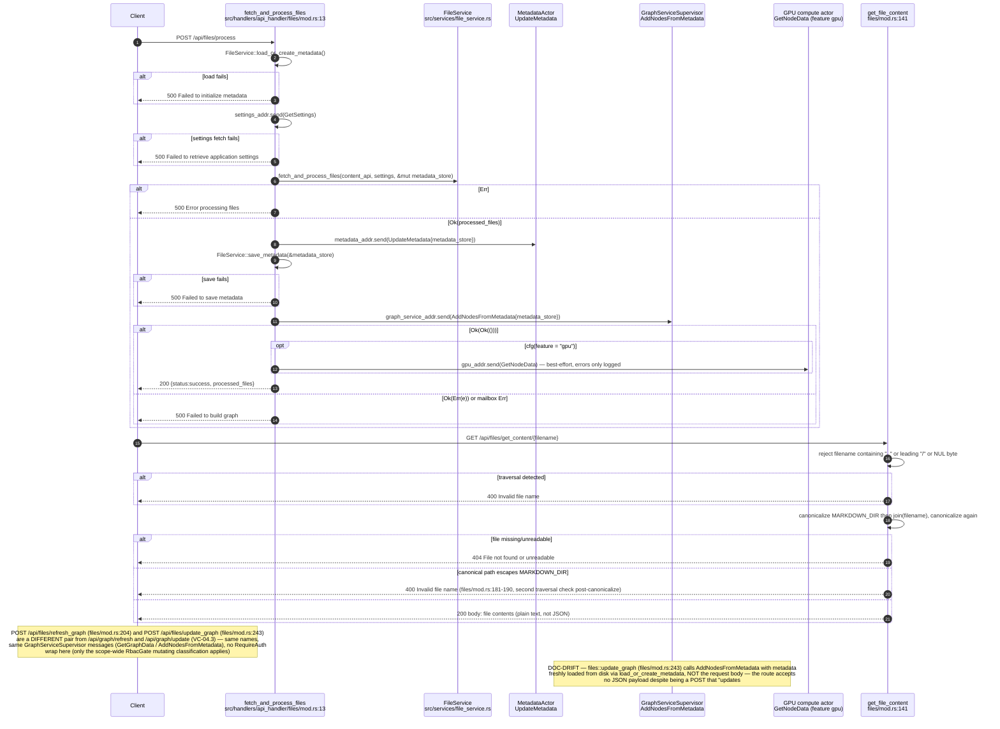
```mermaid
sequenceDiagram
    autonumber
    participant C as Client
    participant FP as fetch_and_process_files<br/>src/handlers/api_handler/files/mod.rs:13
    participant FS as FileService<br/>src/services/file_service.rs
    participant MD as MetadataActor<br/>UpdateMetadata
    participant GS as GraphServiceSupervisor<br/>AddNodesFromMetadata
    participant GPU as GPU compute actor<br/>GetNodeData (feature gpu)
    participant GC as get_file_content<br/>files/mod.rs:141

    C->>FP: POST /api/files/process
    FP->>FP: FileService::load_or_create_metadata()
    alt load fails
        FP-->>C: 500 Failed to initialize metadata
    end
    FP->>FP: settings_addr.send(GetSettings)
    alt settings fetch fails
        FP-->>C: 500 Failed to retrieve application settings
    end
    FP->>FS: fetch_and_process_files(content_api, settings, &mut metadata_store)
    alt Err
        FP-->>C: 500 Error processing files
    else Ok(processed_files)
        FP->>MD: metadata_addr.send(UpdateMetadata{metadata_store})
        FP->>FP: FileService::save_metadata(&metadata_store)
        alt save fails
            FP-->>C: 500 Failed to save metadata
        end
        FP->>GS: graph_service_addr.send(AddNodesFromMetadata{metadata_store})
        alt Ok(Ok(()))
            opt cfg(feature = "gpu")
                FP->>GPU: gpu_addr.send(GetNodeData) — best-effort, errors only logged
            end
            FP-->>C: 200 {status:success, processed_files}
        else Ok(Err(e)) or mailbox Err
            FP-->>C: 500 Failed to build graph
        end
    end
    C->>GC: GET /api/files/get_content/{filename}
    GC->>GC: reject filename containing ".." or leading "/" or NUL byte
    alt traversal detected
        GC-->>C: 400 Invalid file name
    end
    GC->>GC: canonicalize MARKDOWN_DIR then join(filename), canonicalize again
    alt file missing/unreadable
        GC-->>C: 404 File not found or unreadable
    else canonical path escapes MARKDOWN_DIR
        GC-->>C: 400 Invalid file name (files/mod.rs:181-190, second traversal check post-canonicalize)
    else
        GC-->>C: 200 body: file contents (plain text, not JSON)
    end
    Note over C: POST /api/files/refresh_graph (files/mod.rs:204) and POST /api/files/update_graph (files/mod.rs:243)<br/>are a DIFFERENT pair from /api/graph/refresh and /api/graph/update (VC-04.3) — same names,<br/>same GraphServiceSupervisor messages (GetGraphData / AddNodesFromMetadata), no RequireAuth<br/>wrap here (only the scope-wide RbacGate mutating classification applies)
    Note over GS: DOC-DRIFT — files::update_graph (files/mod.rs:243) calls AddNodesFromMetadata with metadata<br/>freshly loaded from disk via load_or_create_metadata, NOT the request body — the route accepts<br/>no JSON payload despite being a POST that #quot;updates#quot the graph
```

## VC-04.5 `bots` scope — data, initialize-swarm, spawn-agent-hybrid, submit/interrupt/status/remove task
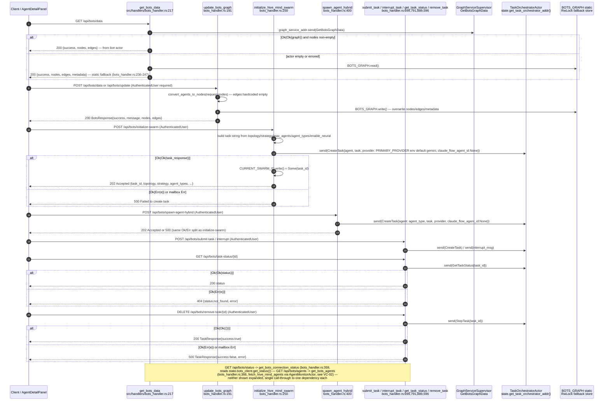
```mermaid
sequenceDiagram
    autonumber
    participant C as Client / AgentDetailPanel
    participant GD as get_bots_data<br/>src/handlers/bots_handler.rs:217
    participant UD as update_bots_graph<br/>bots_handler.rs:191
    participant IH as initialize_hive_mind_swarm<br/>bots_handler.rs:250
    participant SA as spawn_agent_hybrid<br/>bots_handler.rs:400
    participant ST as submit_task / interrupt_task / get_task_status / remove_task<br/>bots_handler.rs:699,791,889,596
    participant GS as GraphServiceSupervisor<br/>GetBotsGraphData
    participant TO as TaskOrchestratorActor<br/>state.get_task_orchestrator_addr()
    participant BG as BOTS_GRAPH static<br/>RwLock fallback store

    C->>GD: GET /api/bots/data
    GD->>GS: graph_service_addr.send(GetBotsGraphData)
    alt Ok(Ok(graph)) and nodes non-empty
        GD-->>C: 200 {success, nodes, edges} — from live actor
    else actor empty or errored
        GD->>BG: BOTS_GRAPH.read()
        GD-->>C: 200 {success, nodes, edges, metadata} — static fallback (bots_handler.rs:236-247)
    end
    C->>UD: POST /api/bots/data or /api/bots/update (AuthenticatedUser required)
    UD->>UD: convert_agents_to_nodes(request.nodes) — edges hardcoded empty
    UD->>BG: BOTS_GRAPH.write() — overwrite nodes/edges/metadata
    UD-->>C: 200 BotsResponse{success, message, nodes, edges}
    C->>IH: POST /api/bots/initialize-swarm (AuthenticatedUser)
    IH->>IH: build task string from topology/strategy/max_agents/agent_types/enable_neural
    IH->>TO: send(CreateTask{agent, task, provider: PRIMARY_PROVIDER env default gemini, claude_flow_agent_id:None})
    alt Ok(Ok(task_response))
        IH->>IH: CURRENT_SWARM_ID.write() = Some(task_id)
        IH-->>C: 202 Accepted {task_id, topology, strategy, agent_types, ...}
    else Ok(Err(e)) or mailbox Err
        IH-->>C: 500 Failed to create task
    end
    C->>SA: POST /api/bots/spawn-agent-hybrid (AuthenticatedUser)
    SA->>TO: send(CreateTask{agent: agent_type, task, provider, claude_flow_agent_id:None})
    SA-->>C: 202 Accepted or 500 (same Ok/Err split as initialize-swarm)
    C->>ST: POST /api/bots/submit-task / interrupt (AuthenticatedUser)
    ST->>TO: send(CreateTask) / send(interrupt_msg)
    C->>ST: GET /api/bots/task-status/{id}
    ST->>TO: send(GetTaskStatus{task_id})
    alt Ok(Ok(status))
        ST-->>C: 200 status
    else Ok(Err(e))
        ST-->>C: 404 {status:not_found, error}
    end
    C->>ST: DELETE /api/bots/remove-task/{id} (AuthenticatedUser)
    ST->>TO: send(StopTask{task_id})
    alt Ok(Ok(()))
        ST-->>C: 200 TaskResponse{success:true}
    else Ok(Err(e)) or mailbox Err
        ST-->>C: 500 TaskResponse{success:false, error}
    end
    Note over GD,ST: GET /api/bots/status -> get_bots_connection_status (bots_handler.rs:359,<br/>reads state.bots_client.get_status()) — GET /api/bots/agents -> get_bots_agents<br/>(bots_handler.rs:366, fetch_hive_mind_agents via AgentMonitorActor, see VC-02) —<br/>neither shown expanded, single call-through to one dependency each
```

## VC-04.6 `analytics` scope — GPU-touching compute triggers and telemetry reads
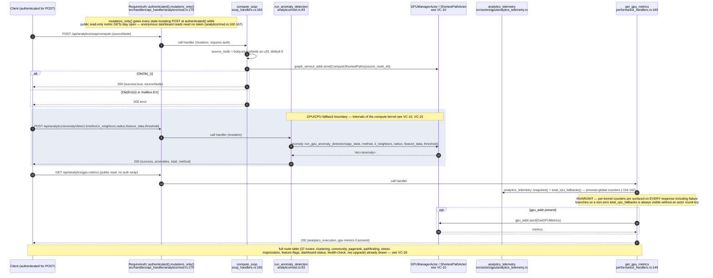
```mermaid
sequenceDiagram
    autonumber
    participant C as Client (authenticated for POST)
    participant W as RequireAuth::authenticated().mutations_only()<br/>src/handlers/api_handler/analytics/mod.rs:170
    participant SS as compute_sssp<br/>sssp_handlers.rs:165
    participant AN as run_anomaly_detection<br/>analytics/mod.rs:93
    participant GM as GPUManagerActor / ShortestPathActor<br/>see VC-10
    participant GT as analytics_telemetry<br/>src/actors/gpu/analytics_telemetry.rs
    participant PM as get_gpu_metrics<br/>performance_handlers.rs:149

    Note over W: mutations_only() gates every state-mutating POST at authenticated() while<br/>public read-only metric GETs stay open — anonymous dashboard reads need no token (analytics/mod.rs:162-167)
    C->>W: POST /api/analytics/sssp/compute {sourceNode}
    W->>SS: call handler (mutation, requires auth)
    SS->>SS: source_node = body.sourceNode as u32, default 0
    SS->>GM: graph_service_addr.send(ComputeShortestPaths{source_node_id})
    alt Ok(Ok(_))
        SS-->>C: 200 {success:true, sourceNode}
    else Ok(Err(e)) or mailbox Err
        SS-->>C: 500 error
    end
    rect rgb(232,236,244)
    Note over AN,GM: GPU/CPU-fallback boundary — internals of the compute kernel see VC-10, VC-15
    C->>W: POST /api/analytics/anomaly/detect {method,k_neighbors,radius,feature_data,threshold}
    W->>AN: call handler (mutation)
    AN->>GM: anomaly::run_gpu_anomaly_detection(app_state, method, k_neighbors, radius, feature_data, threshold)
    GM-->>AN: Vec<anomaly>
    AN-->>C: 200 {success, anomalies, total, method}
    end
    C->>W: GET /api/analytics/gpu-metrics (public read, no auth wrap)
    W->>PM: call handler
    PM->>GT: analytics_telemetry::snapshot() + total_cpu_fallbacks() — process-global counters (:154-162)
    Note over PM: INVARIANT — per-kernel counters are surfaced on EVERY response including failure<br/>branches so a non-zero total_cpu_fallbacks is always visible without an actor round-trip
    opt gpu_addr present
        PM->>GM: gpu_addr.send(GetGPUMetrics)
        GM-->>PM: metrics
    end
    PM-->>C: 200 {analytics_execution, gpu metrics if present}
    Note over C,PM: full route table (37 routes: clustering, community, pagerank, pathfinding, stress-<br/>majorization, feature-flags, dashboard-status, health-check, /ws upgrade) already drawn — see VC-18
```

## VC-04.7 `ontology-physics` and `semantic-forces` — constraint application and DAG/collision config
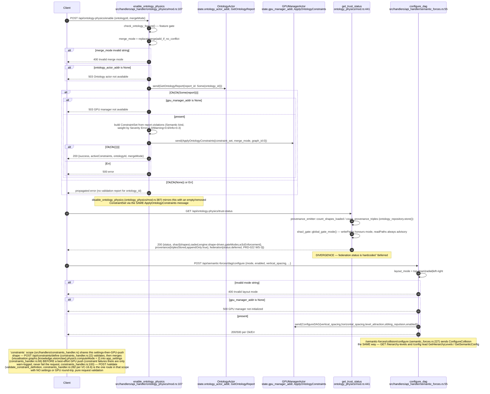
```mermaid
sequenceDiagram
    autonumber
    participant C as Client
    participant EN as enable_ontology_physics<br/>src/handlers/api_handler/ontology_physics/mod.rs:107
    participant OA as OntologyActor<br/>state.ontology_actor_addr, GetOntologyReport
    participant GMA as GPUManagerActor<br/>state.gpu_manager_addr, ApplyOntologyConstraints
    participant TS as get_trust_status<br/>ontology_physics/mod.rs:441
    participant DAG as configure_dag<br/>src/handlers/api_handler/semantic_forces.rs:55

    C->>EN: POST /api/ontology-physics/enable {ontologyId, mergeMode}
    EN->>EN: check_ontology_feature() — feature gate
    EN->>EN: merge_mode = replace|merge|add_if_no_conflict
    alt merge_mode invalid string
        EN-->>C: 400 Invalid merge mode
    end
    alt ontology_actor_addr is None
        EN-->>C: 503 Ontology actor not available
    end
    EN->>OA: send(GetOntologyReport{report_id: Some(ontology_id)})
    alt Ok(Ok(Some(report)))
        alt gpu_manager_addr is None
            EN-->>C: 503 GPU manager not available
        else present
            EN->>EN: build ConstraintSet from report.violations (Semantic kind,<br/>weight by Severity Error=1.0/Warning=0.6/Info=0.3)
            EN->>GMA: send(ApplyOntologyConstraints{constraint_set, merge_mode, graph_id:0})
            alt Ok(Ok(()))
                EN-->>C: 200 {success, activeConstraints, ontologyId, mergeMode}
            else Err
                EN-->>C: 500 error
            end
        end
    else Ok(Ok(None)) or Err
        EN-->>C: propagated error (no validation report for ontology_id)
    end
    Note over EN: disable_ontology_physics (ontology_physics/mod.rs:387) mirrors this with an empty/removed<br/>ConstraintSet via the SAME ApplyOntologyConstraints message
    C->>TS: GET /api/ontology-physics/trust-status
    TS->>TS: provenance_emitter::count_shapes_loaded / count_provenance_triples (ontology_repository.store())
    TS->>TS: shacl_gate::global_gate_mode() — writePaths honours mode, readPaths always advisory
    TS-->>C: 200 {status, shacl{shapesLoaded,engine:shape-driven,gateModes,w3cEnforcement},<br/>provenance{triplesStored,appendOnly:true}, federation{status:deferred, PRD-022 WS-3}}
    Note over TS: DIVERGENCE — federation.status is hardcoded #quot;deferred#quot — SPARQL federation is<br/>relay-mediated future work, not wired in this commit (ontology_physics/mod.rs:492-495)
    C->>DAG: POST /api/semantic-forces/dag/configure {mode, enabled, vertical_spacing, ...}
    DAG->>DAG: layout_mode = top-down|radial|left-right
    alt invalid mode string
        DAG-->>C: 400 Invalid layout mode
    end
    alt gpu_manager_addr is None
        DAG-->>C: 500 GPU manager not initialized
    else present
        DAG->>GMA: send(ConfigureDAG{vertical_spacing,horizontal_spacing,level_attraction,sibling_repulsion,enabled})
        DAG-->>C: 200/500 per Ok/Err
    end
    Note over DAG: /semantic-forces/collision/configure (semantic_forces.rs:227) sends ConfigureCollision<br/>the SAME way — GET /hierarchy-levels and /config read GetHierarchyLevels / GetSemanticConfig
    Note over C: `constraints` scope (src/handlers/constraints_handler.rs) shares this settings-then-GPU-push<br/>shape — POST /api/constraints/define (constraints_handler.rs:22) validates, then merges<br/>{visualisation.graphs.{knowledge,visionclaw}.physics.computeMode = 2} into app_settings<br/>(constraints_handler.rs:66) BEFORE a best-effort GPU push (constraint failures there are only<br/>warn-logged, never fail the request, constraints_handler.rs:100) — POST /validate<br/>(validate_constraint_definition, constraints_handler.rs:282 per VC-16.6) is the one route in that scope<br/>with NO settings or GPU round-trip, pure request validation
```

## VC-04.8 `ragflow` scope — external HTTP boundary (RAGFlow API)
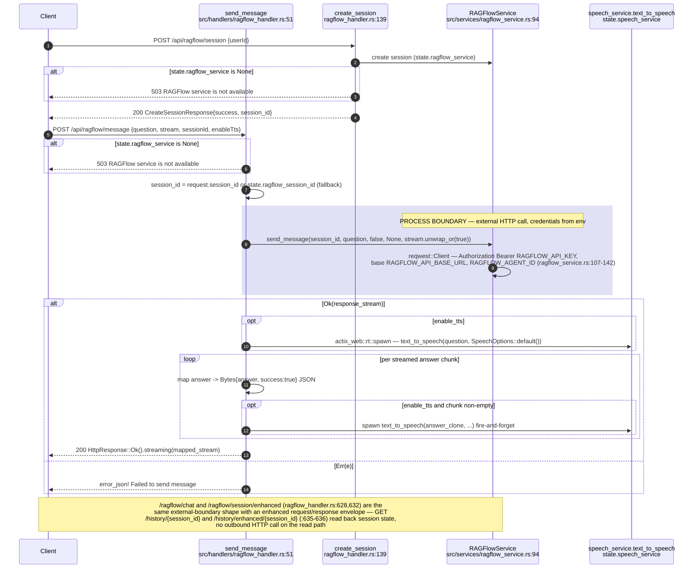
```mermaid
sequenceDiagram
    autonumber
    participant C as Client
    participant SM as send_message<br/>src/handlers/ragflow_handler.rs:51
    participant CS as create_session<br/>ragflow_handler.rs:139
    participant RS as RAGFlowService<br/>src/services/ragflow_service.rs:94
    participant TTS as speech_service.text_to_speech<br/>state.speech_service

    C->>CS: POST /api/ragflow/session {userId}
    CS->>RS: create session (state.ragflow_service)
    alt state.ragflow_service is None
        CS-->>C: 503 RAGFlow service is not available
    end
    CS-->>C: 200 CreateSessionResponse{success, session_id}
    C->>SM: POST /api/ragflow/message {question, stream, sessionId, enableTts}
    alt state.ragflow_service is None
        SM-->>C: 503 RAGFlow service is not available
    end
    SM->>SM: session_id = request.session_id or state.ragflow_session_id (fallback)
    rect rgb(225,225,245)
    Note over RS: PROCESS BOUNDARY — external HTTP call, credentials from env
    SM->>RS: send_message(session_id, question, false, None, stream.unwrap_or(true))
    RS->>RS: reqwest::Client — Authorization Bearer RAGFLOW_API_KEY,<br/>base RAGFLOW_API_BASE_URL, RAGFLOW_AGENT_ID (ragflow_service.rs:107-142)
    end
    alt Ok(response_stream)
        opt enable_tts
            SM->>TTS: actix_web::rt::spawn — text_to_speech(question, SpeechOptions::default())
        end
        loop per streamed answer chunk
            SM->>SM: map answer -> Bytes{answer, success:true} JSON
            opt enable_tts and chunk non-empty
                SM->>TTS: spawn text_to_speech(answer_clone, ...) fire-and-forget
            end
        end
        SM-->>C: 200 HttpResponse::Ok().streaming(mapped_stream)
    else Err(e)
        SM-->>C: error_json! Failed to send message
    end
    Note over C,RS: /ragflow/chat and /ragflow/session/enhanced (ragflow_handler.rs:628,632) are the<br/>same external-boundary shape with an enhanced request/response envelope — GET<br/>/history/{session_id} and /history/enhanced/{session_id} (:635-636) read back session state,<br/>no outbound HTTP call on the read path
```

## VC-04.10 `graph_state_handler` — CQRS directive/query path via `graph_adapter`
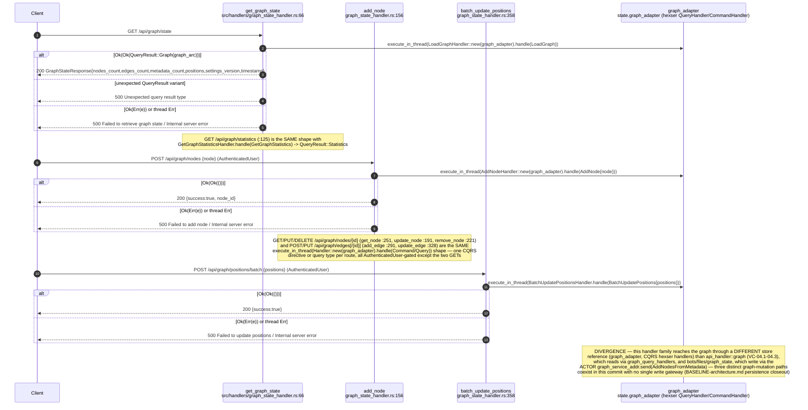
```mermaid
sequenceDiagram
    autonumber
    participant C as Client
    participant GS as get_graph_state<br/>src/handlers/graph_state_handler.rs:66
    participant AN as add_node<br/>graph_state_handler.rs:156
    participant BP as batch_update_positions<br/>graph_state_handler.rs:358
    participant GA as graph_adapter<br/>state.graph_adapter (hexser QueryHandler/CommandHandler)

    C->>GS: GET /api/graph/state
    GS->>GA: execute_in_thread(LoadGraphHandler::new(graph_adapter).handle(LoadGraph))
    alt Ok(Ok(QueryResult::Graph(graph_arc)))
        GS-->>C: 200 GraphStateResponse{nodes_count,edges_count,metadata_count,positions,settings_version,timestamp}
    else unexpected QueryResult variant
        GS-->>C: 500 Unexpected query result type
    else Ok(Err(e)) or thread Err
        GS-->>C: 500 Failed to retrieve graph state / Internal server error
    end
    Note over GS: GET /api/graph/statistics (:125) is the SAME shape with<br/>GetGraphStatisticsHandler.handle(GetGraphStatistics) -> QueryResult::Statistics
    C->>AN: POST /api/graph/nodes {node} (AuthenticatedUser)
    AN->>GA: execute_in_thread(AddNodeHandler::new(graph_adapter).handle(AddNode{node}))
    alt Ok(Ok(()))
        AN-->>C: 200 {success:true, node_id}
    else Ok(Err(e)) or thread Err
        AN-->>C: 500 Failed to add node / Internal server error
    end
    Note over AN: GET/PUT/DELETE /api/graph/nodes/{id} (get_node :251, update_node :191, remove_node :221)<br/>and POST/PUT /api/graph/edges[/{id}] (add_edge :291, update_edge :328) are the SAME<br/>execute_in_thread(Handler::new(graph_adapter).handle(Command/Query)) shape — one CQRS<br/>directive or query type per route, all AuthenticatedUser-gated except the two GETs
    C->>BP: POST /api/graph/positions/batch {positions} (AuthenticatedUser)
    BP->>GA: execute_in_thread(BatchUpdatePositionsHandler.handle(BatchUpdatePositions{positions}))
    alt Ok(Ok(()))
        BP-->>C: 200 {success:true}
    else Ok(Err(e)) or thread Err
        BP-->>C: 500 Failed to update positions / Internal server error
    end
    Note over GA: DIVERGENCE — this handler family reaches the graph through a DIFFERENT store<br/>reference (graph_adapter, CQRS hexser handlers) than api_handler::graph (VC-04.1-04.3),<br/>which reads via graph_query_handlers, and bots/files/graph_state, which write via the<br/>ACTOR graph_service_addr.send(AddNodesFromMetadata) — three distinct graph-mutation paths<br/>coexist in this commit with no single write gateway (BASELINE-architecture.md persistence closeout)
```

## VC-04.11 `graph-export` scope — rate limit, serialization, shared-link lifecycle
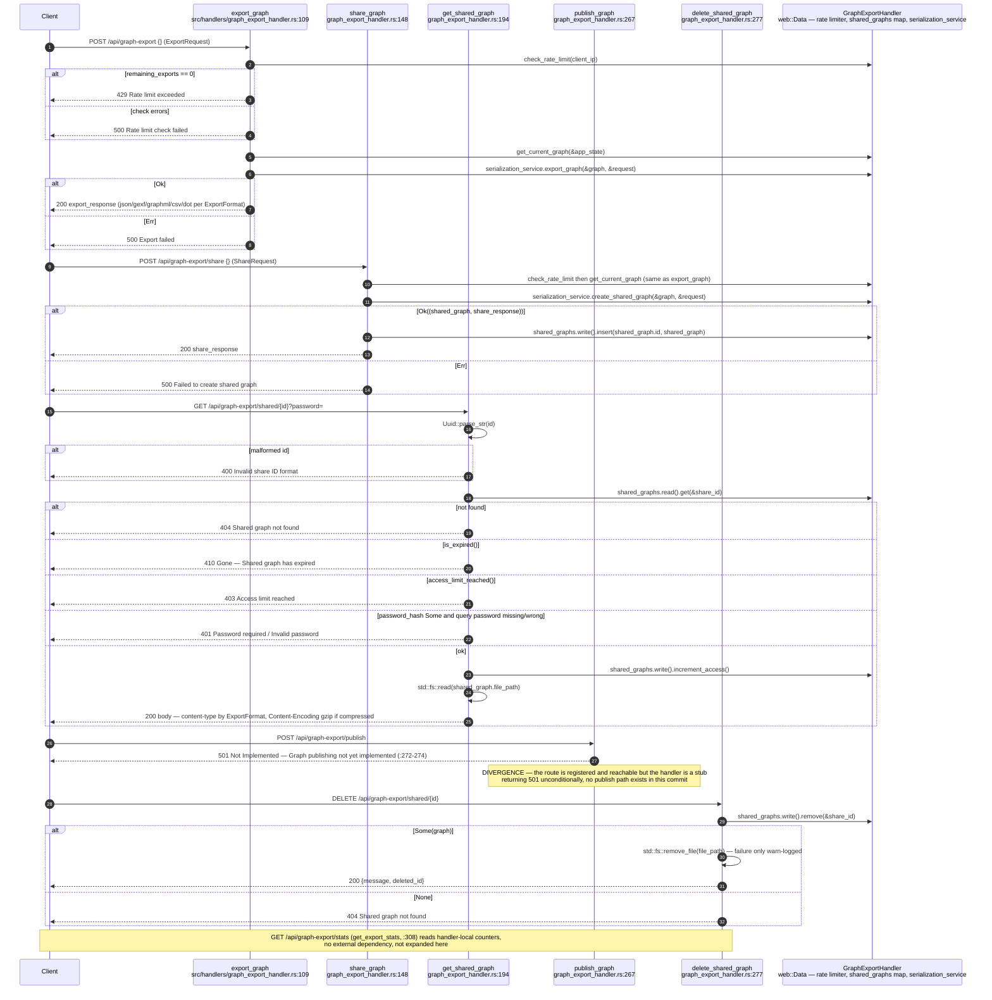
```mermaid
sequenceDiagram
    autonumber
    participant C as Client
    participant EX as export_graph<br/>src/handlers/graph_export_handler.rs:109
    participant SH as share_graph<br/>graph_export_handler.rs:148
    participant GET as get_shared_graph<br/>graph_export_handler.rs:194
    participant PUB as publish_graph<br/>graph_export_handler.rs:267
    participant DEL as delete_shared_graph<br/>graph_export_handler.rs:277
    participant H as GraphExportHandler<br/>web::Data — rate limiter, shared_graphs map, serialization_service

    C->>EX: POST /api/graph-export {} (ExportRequest)
    EX->>H: check_rate_limit(client_ip)
    alt remaining_exports == 0
        EX-->>C: 429 Rate limit exceeded
    else check errors
        EX-->>C: 500 Rate limit check failed
    end
    EX->>H: get_current_graph(&app_state)
    EX->>H: serialization_service.export_graph(&graph, &request)
    alt Ok
        EX-->>C: 200 export_response (json/gexf/graphml/csv/dot per ExportFormat)
    else Err
        EX-->>C: 500 Export failed
    end
    C->>SH: POST /api/graph-export/share {} (ShareRequest)
    SH->>H: check_rate_limit then get_current_graph (same as export_graph)
    SH->>H: serialization_service.create_shared_graph(&graph, &request)
    alt Ok((shared_graph, share_response))
        SH->>H: shared_graphs.write().insert(shared_graph.id, shared_graph)
        SH-->>C: 200 share_response
    else Err
        SH-->>C: 500 Failed to create shared graph
    end
    C->>GET: GET /api/graph-export/shared/{id}?password=
    GET->>GET: Uuid::parse_str(id)
    alt malformed id
        GET-->>C: 400 Invalid share ID format
    end
    GET->>H: shared_graphs.read().get(&share_id)
    alt not found
        GET-->>C: 404 Shared graph not found
    else is_expired()
        GET-->>C: 410 Gone — Shared graph has expired
    else access_limit_reached()
        GET-->>C: 403 Access limit reached
    else password_hash Some and query password missing/wrong
        GET-->>C: 401 Password required / Invalid password
    else ok
        GET->>H: shared_graphs.write().increment_access()
        GET->>GET: std::fs::read(shared_graph.file_path)
        GET-->>C: 200 body — content-type by ExportFormat, Content-Encoding gzip if compressed
    end
    C->>PUB: POST /api/graph-export/publish
    PUB-->>C: 501 Not Implemented — Graph publishing not yet implemented (:272-274)
    Note over PUB: DIVERGENCE — the route is registered and reachable but the handler is a stub<br/>returning 501 unconditionally, no publish path exists in this commit
    C->>DEL: DELETE /api/graph-export/shared/{id}
    DEL->>H: shared_graphs.write().remove(&share_id)
    alt Some(graph)
        DEL->>DEL: std::fs::remove_file(file_path) — failure only warn-logged
        DEL-->>C: 200 {message, deleted_id}
    else None
        DEL-->>C: 404 Shared graph not found
    end
    Note over C,DEL: GET /api/graph-export/stats (get_export_stats, :308) reads handler-local counters,<br/>no external dependency, not expanded here
```

## VC-04.12 `layout` scope — mode/radial/zones/reset, GPU SimParams sync (ADR-031)
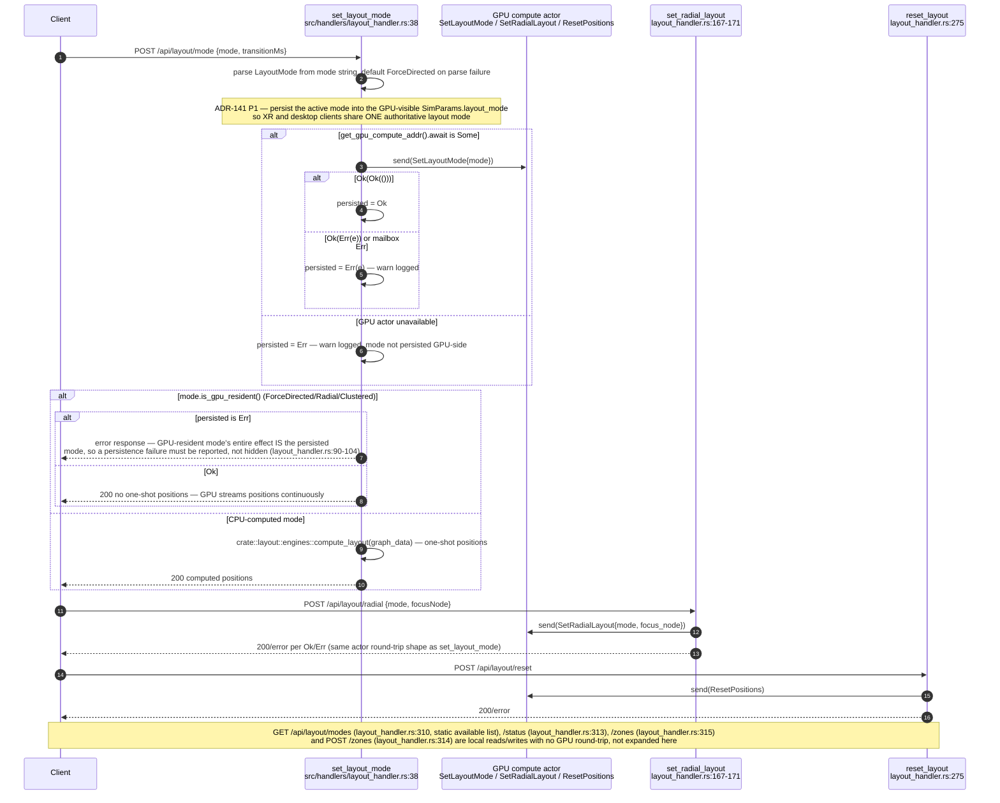
```mermaid
sequenceDiagram
    autonumber
    participant C as Client
    participant SM as set_layout_mode<br/>src/handlers/layout_handler.rs:38
    participant GPU as GPU compute actor<br/>SetLayoutMode / SetRadialLayout / ResetPositions
    participant RL as set_radial_layout<br/>layout_handler.rs:167-171
    participant RS as reset_layout<br/>layout_handler.rs:275

    C->>SM: POST /api/layout/mode {mode, transitionMs}
    SM->>SM: parse LayoutMode from mode string, default ForceDirected on parse failure
    Note over SM: ADR-141 P1 — persist the active mode into the GPU-visible SimParams.layout_mode<br/>so XR and desktop clients share ONE authoritative layout mode
    alt get_gpu_compute_addr().await is Some
        SM->>GPU: send(SetLayoutMode{mode})
        alt Ok(Ok(()))
            SM->>SM: persisted = Ok
        else Ok(Err(e)) or mailbox Err
            SM->>SM: persisted = Err(e) — warn logged
        end
    else GPU actor unavailable
        SM->>SM: persisted = Err — warn logged, mode not persisted GPU-side
    end
    alt mode.is_gpu_resident() (ForceDirected/Radial/Clustered)
        alt persisted is Err
            SM-->>C: error response — GPU-resident mode's entire effect IS the persisted<br/>mode, so a persistence failure must be reported, not hidden (layout_handler.rs:90-104)
        else Ok
            SM-->>C: 200 no one-shot positions — GPU streams positions continuously
        end
    else CPU-computed mode
        SM->>SM: crate::layout::engines::compute_layout(graph_data) — one-shot positions
        SM-->>C: 200 computed positions
    end
    C->>RL: POST /api/layout/radial {mode, focusNode}
    RL->>GPU: send(SetRadialLayout{mode, focus_node})
    RL-->>C: 200/error per Ok/Err (same actor round-trip shape as set_layout_mode)
    C->>RS: POST /api/layout/reset
    RS->>GPU: send(ResetPositions)
    RS-->>C: 200/error
    Note over C,RS: GET /api/layout/modes (layout_handler.rs:310, static available list), /status (layout_handler.rs:313), /zones (layout_handler.rs:315)<br/>and POST /zones (layout_handler.rs:314) are local reads/writes with no GPU round-trip, not expanded here
```

## VC-04.13 `physics` scope — port/adapter hop, PhysicsService to ActixPhysicsAdapter to PhysicsOrchestratorActor
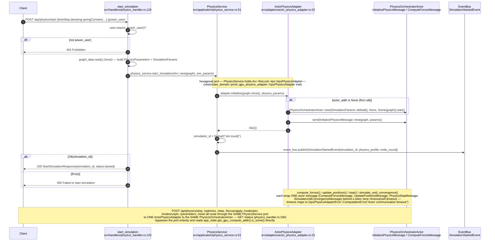
```mermaid
sequenceDiagram
    autonumber
    participant C as Client
    participant SS as start_simulation<br/>src/handlers/physics_handler.rs:120
    participant PS as PhysicsService<br/>src/application/physics_service.rs:51
    participant PA as ActixPhysicsAdapter<br/>src/adapters/actix_physics_adapter.rs:23
    participant POA as PhysicsOrchestratorActor<br/>InitializePhysicsMessage / ComputeForcesMessage
    participant EB as EventBus<br/>SimulationStartedEvent

    C->>SS: POST /api/physics/start {timeStep,damping,springConstant,...} (power_user)
    SS->>SS: user.require_power_user()?
    alt not power_user
        SS-->>C: 403 Forbidden
    end
    SS->>SS: graph_data.read().clone() — build PhysicsParameters + SimulationParams
    SS->>PS: physics_service.start_simulation(Arc::new(graph), sim_params)
    Note over PS,PA: hexagonal port — PhysicsService holds Arc~RwLock~dyn GpuPhysicsAdapter~~<br/>(visionclaw_domain::ports::gpu_physics_adapter::GpuPhysicsAdapter trait)
    PS->>PA: adapter.initialize(graph.clone(), physics_params)
    alt actor_addr is None (first call)
        PA->>POA: PhysicsOrchestratorActor::new(SimulationParams::default(), None, Some(graph)).start()
    end
    PA->>POA: send(InitializePhysicsMessage::new(graph, params))
    PA-->>PS: Ok(())
    PS->>PS: simulation_id = format!("sim-{uuid}")
    PS->>EB: event_bus.publish(SimulationStartedEvent{simulation_id, physics_profile, node_count})
    alt Ok(simulation_id)
        SS-->>C: 200 StartSimulationResponse{simulation_id, status:started}
    else Err(e)
        SS-->>C: 500 Failed to start simulation
    end
    Note over PA,POA: compute_forces() / update_positions() / step() / simulate_until_convergence()<br/>each wrap ONE actor message (ComputeForcesMessage, UpdatePositionsMessage, PhysicsStepMessage,<br/>SimulateUntilConvergenceMessage) behind a tokio::time::timeout(self.timeout) —<br/>timeout maps to GpuPhysicsAdapterError::ComputationError("Actor communication timeout")
    Note over C,POA: POST /api/physics/stop, /optimize, /step, /forces/apply, /nodes/pin,<br/>/nodes/unpin, /parameters, /reset all route through the SAME PhysicsService port<br/>to ONE ActixPhysicsAdapter to the SAME PhysicsOrchestratorActor — GET /status (physics_handler.rs:190)<br/>bypasses the port entirely and reads app_state.get_gpu_compute_addr().is_some() directly
```

## VC-04.14 `kpi` scope — compute-on-read, agent-event volume tap, SQLite lineage
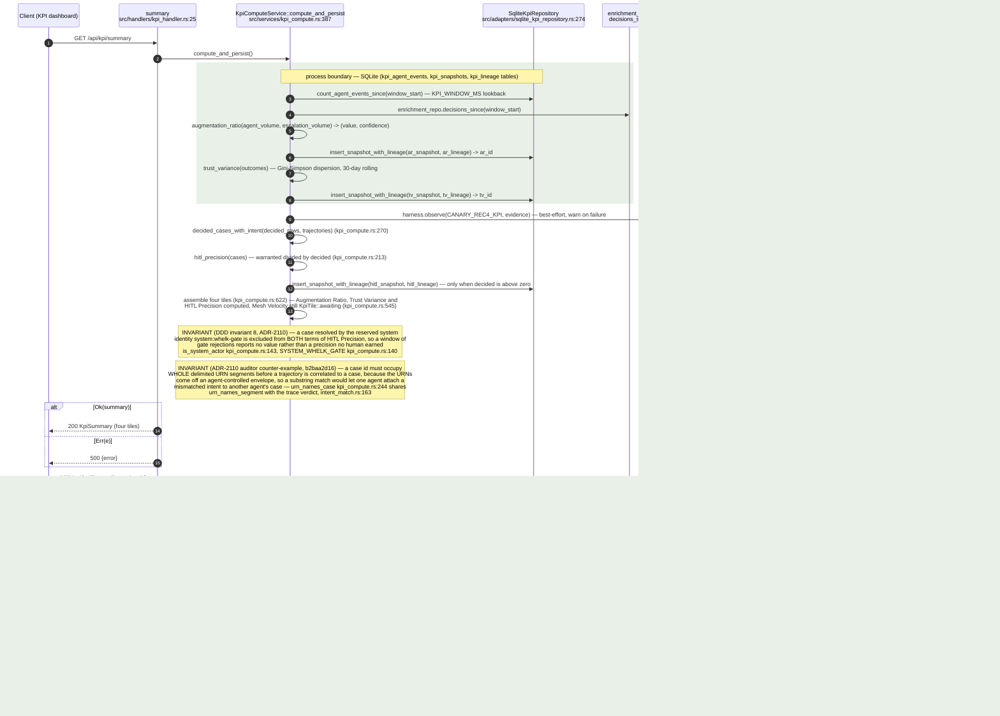
```mermaid
sequenceDiagram
    autonumber
    participant C as Client (KPI dashboard)
    participant SU as summary<br/>src/handlers/kpi_handler.rs:25
    participant KC as KpiComputeService::compute_and_persist<br/>src/services/kpi_compute.rs:387
    participant KR as SqliteKpiRepository<br/>src/adapters/sqlite_kpi_repository.rs:274
    participant EN as enrichment_repo<br/>decisions_since
    participant LH as LivenessHarness<br/>observe(CANARY-VC-REC4-KPI)
    participant TAP as run_agent_event_tap<br/>kpi_compute.rs:646
    participant HUB as agent_events::hub<br/>subscribe()

    C->>SU: GET /api/kpi/summary
    SU->>KC: compute_and_persist()
    rect rgb(232,240,232)
    Note over KC,KR: process boundary — SQLite (kpi_agent_events, kpi_snapshots, kpi_lineage tables)
    KC->>KR: count_agent_events_since(window_start) — KPI_WINDOW_MS lookback
    KC->>EN: enrichment_repo.decisions_since(window_start)
    KC->>KC: augmentation_ratio(agent_volume, escalation_volume) -> (value, confidence)
    KC->>KR: insert_snapshot_with_lineage(ar_snapshot, ar_lineage) -> ar_id
    KC->>KC: trust_variance(outcomes) — Gini-Simpson dispersion, 30-day rolling
    KC->>KR: insert_snapshot_with_lineage(tv_snapshot, tv_lineage) -> tv_id
    end
    KC->>LH: harness.observe(CANARY_REC4_KPI, evidence) — best-effort, warn on failure
    KC->>KC: decided_cases_with_intent(decided_rows, trajectories) (kpi_compute.rs:270)
    KC->>KC: hitl_precision(cases) — warranted divided by decided (kpi_compute.rs:213)
    KC->>KR: insert_snapshot_with_lineage(hitl_snapshot, hitl_lineage) — only when decided is above zero
    KC->>KC: assemble four tiles (kpi_compute.rs:622) — Augmentation Ratio, Trust Variance and<br/>HITL Precision computed, Mesh Velocity still KpiTile::awaiting (kpi_compute.rs:545)
    Note over KC: INVARIANT (DDD invariant 8, ADR-2110) — a case resolved by the reserved system<br/>identity system:whelk-gate is excluded from BOTH terms of HITL Precision, so a window of<br/>gate rejections reports no value rather than a precision no human earned<br/>is_system_actor kpi_compute.rs:143, SYSTEM_WHELK_GATE kpi_compute.rs:140
    Note over KC: INVARIANT (ADR-2110 auditor counter-example, b2baa2d16) — a case id must occupy<br/>WHOLE delimited URN segments before a trajectory is correlated to a case, because the URNs<br/>come off an agent-controlled envelope, so a substring match would let one agent attach a<br/>mismatched intent to another agent's case — urn_names_case kpi_compute.rs:244 shares<br/>urn_names_segment with the trace verdict, intent_match.rs:163
    alt Ok(summary)
        SU-->>C: 200 KpiSummary (four tiles)
    else Err(e)
        SU-->>C: 500 {error}
    end
    C->>SU: GET /api/kpi/lineage/{snapshot_id}
    SU->>KC: lineage_for(snapshot_id)
    KC->>KR: lineage_for(snapshot_id) — DERIVED_FROM trail (WP-8 AC3)
    SU-->>C: 200 {snapshot_id, lineage}
    par background volume tap — src/main.rs:1257 tokio::spawn(run_agent_event_tap(kpi_repo))
        TAP->>HUB: subscribe() — same seam the render actor uses
        loop rx.recv().await — never returns, fail-open on lagged/closed channel
            HUB-->>TAP: AgentEventEnvelope
            TAP->>TAP: derive agent_did — did:nostr from pubkey (x-only hex) or source_urn fallback
            TAP->>KR: record_agent_trajectory(NewAgentTrajectory{...}) — one row per envelope
        end
    end
    Note over KC: REC-4 ADR-130 D5 — numerator is wss/agent-events window count, denominator<br/>is ACSP escalation volume (enrichment_decisions) — see VC-24, VC-25 for the elevation<br/>and insight-loop producers of these source events
```

## VC-04.16 `consolidated_health` — unified_health_check, physics probe, MCP relay controls
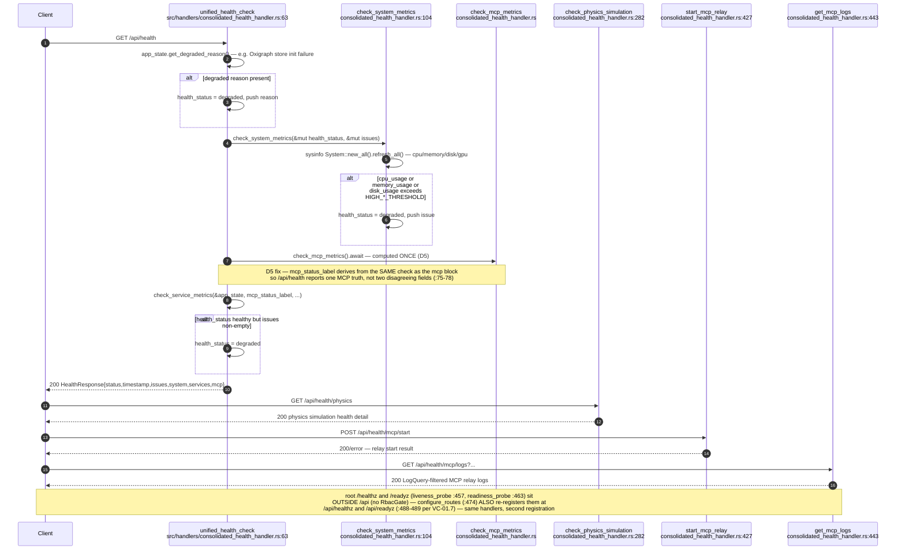
```mermaid
sequenceDiagram
    autonumber
    participant C as Client
    participant UH as unified_health_check<br/>src/handlers/consolidated_health_handler.rs:63
    participant SYS as check_system_metrics<br/>consolidated_health_handler.rs:104
    participant MCP as check_mcp_metrics<br/>consolidated_health_handler.rs
    participant PH as check_physics_simulation<br/>consolidated_health_handler.rs:282
    participant SR as start_mcp_relay<br/>consolidated_health_handler.rs:427
    participant GL as get_mcp_logs<br/>consolidated_health_handler.rs:443

    C->>UH: GET /api/health
    UH->>UH: app_state.get_degraded_reason() — e.g. Oxigraph store init failure
    alt degraded reason present
        UH->>UH: health_status = degraded, push reason
    end
    UH->>SYS: check_system_metrics(&mut health_status, &mut issues)
    SYS->>SYS: sysinfo System::new_all().refresh_all() — cpu/memory/disk/gpu
    alt cpu_usage or memory_usage or disk_usage exceeds HIGH_*_THRESHOLD
        SYS->>SYS: health_status = degraded, push issue
    end
    UH->>MCP: check_mcp_metrics().await — computed ONCE (D5)
    Note over UH,MCP: D5 fix — mcp_status_label derives from the SAME check as the mcp block<br/>so /api/health reports one MCP truth, not two disagreeing fields (:75-78)
    UH->>UH: check_service_metrics(&app_state, mcp_status_label, ...)
    alt health_status healthy but issues non-empty
        UH->>UH: health_status = degraded
    end
    UH-->>C: 200 HealthResponse{status,timestamp,issues,system,services,mcp}
    C->>PH: GET /api/health/physics
    PH-->>C: 200 physics simulation health detail
    C->>SR: POST /api/health/mcp/start
    SR-->>C: 200/error — relay start result
    C->>GL: GET /api/health/mcp/logs?...
    GL-->>C: 200 LogQuery-filtered MCP relay logs
    Note over C,GL: root /healthz and /readyz (liveness_probe :457, readiness_probe :463) sit<br/>OUTSIDE /api (no RbacGate) — configure_routes (:474) ALSO re-registers them at<br/>/api/healthz and /api/readyz (:488-489 per VC-01.7) — same handlers, second registration
```

## VC-04.17 `canary` scope (`liveness_harness_handler`) — X-Agent-Key gate, register/observe/status
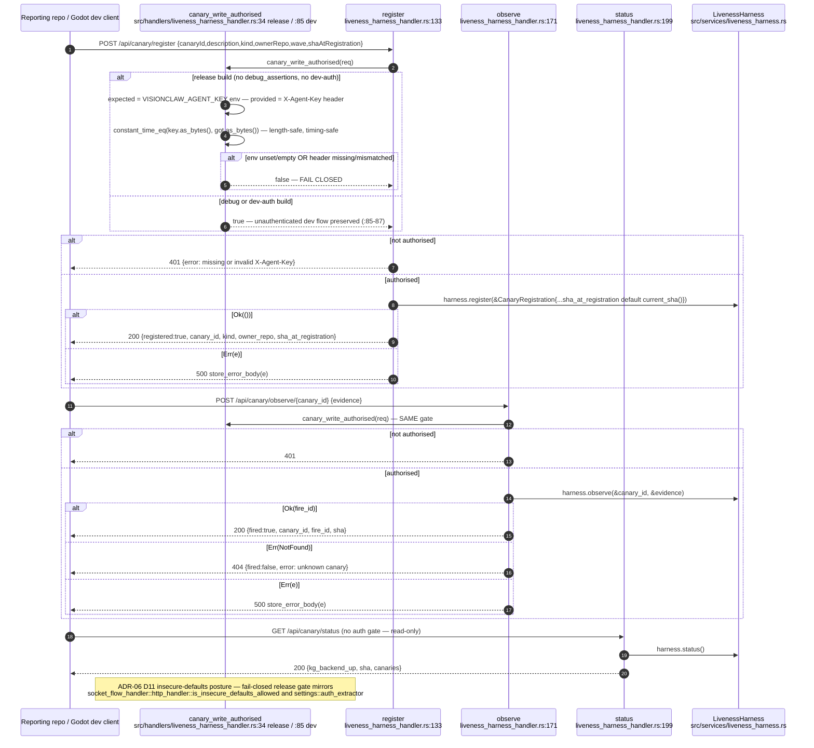
```mermaid
sequenceDiagram
    autonumber
    participant C as Reporting repo / Godot dev client
    participant AU as canary_write_authorised<br/>src/handlers/liveness_harness_handler.rs:34 release / :85 dev
    participant RG as register<br/>liveness_harness_handler.rs:133
    participant OB as observe<br/>liveness_harness_handler.rs:171
    participant ST as status<br/>liveness_harness_handler.rs:199
    participant LH as LivenessHarness<br/>src/services/liveness_harness.rs

    C->>RG: POST /api/canary/register {canaryId,description,kind,ownerRepo,wave,shaAtRegistration}
    RG->>AU: canary_write_authorised(req)
    alt release build (no debug_assertions, no dev-auth)
        AU->>AU: expected = VISIONCLAW_AGENT_KEY env — provided = X-Agent-Key header
        AU->>AU: constant_time_eq(key.as_bytes(), got.as_bytes()) — length-safe, timing-safe
        alt env unset/empty OR header missing/mismatched
            AU-->>RG: false — FAIL CLOSED
        end
    else debug or dev-auth build
        AU-->>RG: true — unauthenticated dev flow preserved (:85-87)
    end
    alt not authorised
        RG-->>C: 401 {error: missing or invalid X-Agent-Key}
    else authorised
        RG->>LH: harness.register(&CanaryRegistration{...sha_at_registration default current_sha()})
        alt Ok(())
            RG-->>C: 200 {registered:true, canary_id, kind, owner_repo, sha_at_registration}
        else Err(e)
            RG-->>C: 500 store_error_body(e)
        end
    end
    C->>OB: POST /api/canary/observe/{canary_id} {evidence}
    OB->>AU: canary_write_authorised(req) — SAME gate
    alt not authorised
        OB-->>C: 401
    else authorised
        OB->>LH: harness.observe(&canary_id, &evidence)
        alt Ok(fire_id)
            OB-->>C: 200 {fired:true, canary_id, fire_id, sha}
        else Err(NotFound)
            OB-->>C: 404 {fired:false, error: unknown canary}
        else Err(e)
            OB-->>C: 500 store_error_body(e)
        end
    end
    C->>ST: GET /api/canary/status (no auth gate — read-only)
    ST->>LH: harness.status()
    ST-->>C: 200 {kg_backend_up, sha, canaries}
    Note over AU: ADR-06 D11 insecure-defaults posture — fail-closed release gate mirrors<br/>socket_flow_handler::http_handler::is_insecure_defaults_allowed and settings::auth_extractor
```

## VC-04.18 `GET /api/trace` — REC-11 unified provenance join (did:nostr key)
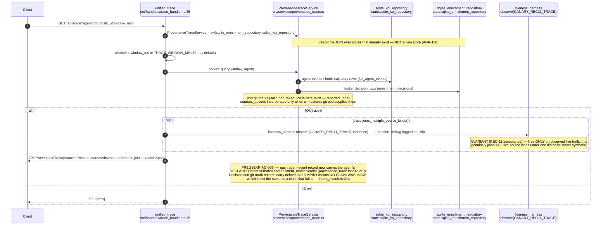
```mermaid
sequenceDiagram
    autonumber
    participant C as Client
    participant UT as unified_trace<br/>src/handlers/trace_handler.rs:35
    participant PTS as ProvenanceTraceService<br/>src/services/provenance_trace.rs
    participant KR as sqlite_kpi_repository<br/>state.sqlite_kpi_repository
    participant ER as sqlite_enrichment_repository<br/>state.sqlite_enrichment_repository
    participant LH as liveness_harness<br/>observe(CANARY_REC11_TRACE)

    C->>UT: GET /api/trace?agent=did:nostr:...&window_ms=
    UT->>PTS: ProvenanceTraceService::new(sqlite_enrichment_repository, sqlite_kpi_repository)
    Note over PTS,ER: read-time JOIN over stores that already exist — NOT a new store (ADR-130)
    UT->>UT: window = window_ms or TRACE_WINDOW_MS (30-day default)
    UT->>PTS: service.query(window, agent)
    PTS->>KR: agent-events / hook-trajectory rows (kpi_agent_events)
    PTS->>ER: broker decision rows (enrichment_decisions)
    Note over PTS: pod git-marks (solid-pod-rs) source is default-off — reported under<br/>sources_absent, incorporated only when a --features git pod supplies them
    alt Ok(trace)
        opt trace.joins_multiple_source_kinds()
            UT->>LH: liveness_harness.observe(CANARY_REC11_TRACE, evidence) — best-effort, debug-logged on skip
            Note over LH: INVARIANT (REC-11 acceptance) — fires ONLY on observed live traffic that<br/>genuinely joins >= 2 live source kinds under one did:nostr, never synthetic
        end
        UT-->>C: 200 ProvenanceTrace{sourcesPresent,sourcesAbsent,totalRecords,joins,maxJoinSpan}
        Note over PTS: FR5.2 (EXP-AC-005) — each agent-event record now carries the agent's<br/>DECLARED intent verbatim and an intent_match verdict (provenance_trace.rs:202-210).<br/>Decision and git-mark records carry neither. A null verdict means NO CLAIM WAS MADE,<br/>which is not the same as a claim that failed — intent_match.rs:214
    else Err(e)
        UT-->>C: 500 {error}
    end
```

## VC-04.19 `validation` scope — schema dry-run test and static capability stats
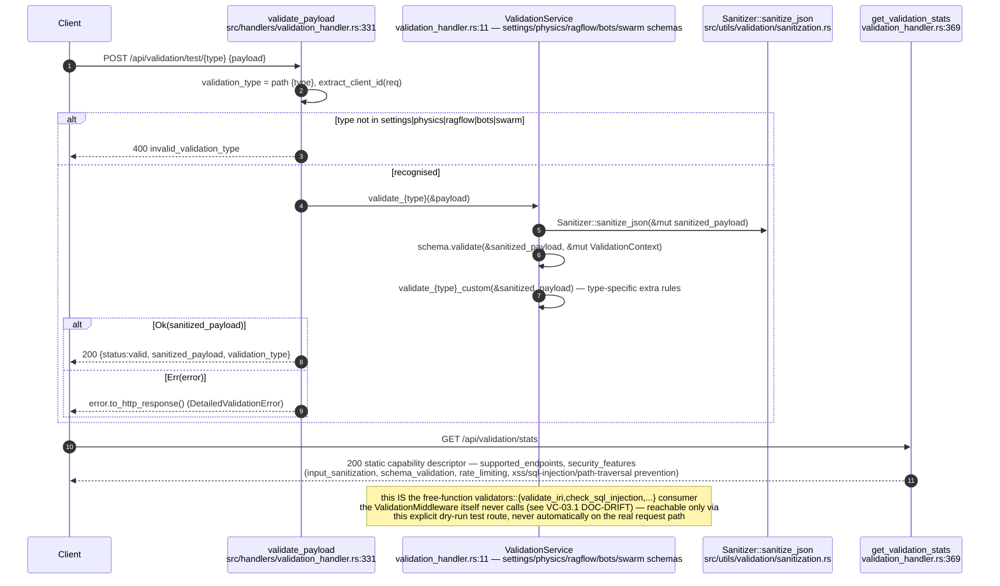
```mermaid
sequenceDiagram
    autonumber
    participant C as Client
    participant VP as validate_payload<br/>src/handlers/validation_handler.rs:331
    participant VS as ValidationService<br/>validation_handler.rs:11 — settings/physics/ragflow/bots/swarm schemas
    participant SAN as Sanitizer::sanitize_json<br/>src/utils/validation/sanitization.rs
    participant GS as get_validation_stats<br/>validation_handler.rs:369

    C->>VP: POST /api/validation/test/{type} {payload}
    VP->>VP: validation_type = path {type}, extract_client_id(req)
    alt type not in settings|physics|ragflow|bots|swarm
        VP-->>C: 400 invalid_validation_type
    else recognised
        VP->>VS: validate_{type}(&payload)
        VS->>SAN: Sanitizer::sanitize_json(&mut sanitized_payload)
        VS->>VS: schema.validate(&sanitized_payload, &mut ValidationContext)
        VS->>VS: validate_{type}_custom(&sanitized_payload) — type-specific extra rules
        alt Ok(sanitized_payload)
            VP-->>C: 200 {status:valid, sanitized_payload, validation_type}
        else Err(error)
            VP-->>C: error.to_http_response() (DetailedValidationError)
        end
    end
    C->>GS: GET /api/validation/stats
    GS-->>C: 200 static capability descriptor — supported_endpoints, security_features<br/>(input_sanitization, schema_validation, rate_limiting, xss/sql-injection/path-traversal prevention)
    Note over VS: this IS the free-function validators::{validate_iri,check_sql_injection,...} consumer<br/>the ValidationMiddleware itself never calls (see VC-03.1 DOC-DRIFT) — reachable only via<br/>this explicit dry-run test route, never automatically on the real request path
```

## VC-04.20 `schema` scope — GraphStateActor read, SchemaService cache refresh
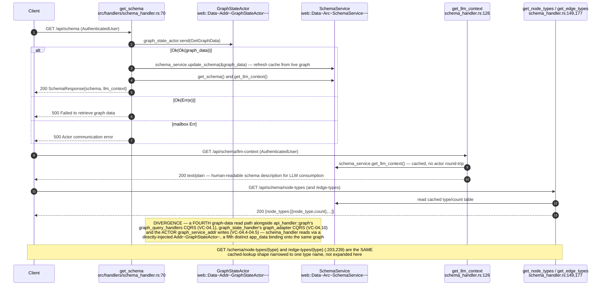
```mermaid
sequenceDiagram
    autonumber
    participant C as Client
    participant GS as get_schema<br/>src/handlers/schema_handler.rs:70
    participant GSA as GraphStateActor<br/>web::Data~Addr~GraphStateActor~~
    participant SS as SchemaService<br/>web::Data~Arc~SchemaService~~
    participant LC as get_llm_context<br/>schema_handler.rs:126
    participant NT as get_node_types / get_edge_types<br/>schema_handler.rs:149,177

    C->>GS: GET /api/schema (AuthenticatedUser)
    GS->>GSA: graph_state_actor.send(GetGraphData)
    alt Ok(Ok(graph_data))
        GS->>SS: schema_service.update_schema(&graph_data) — refresh cache from live graph
        GS->>SS: get_schema() and get_llm_context()
        GS-->>C: 200 SchemaResponse{schema, llm_context}
    else Ok(Err(e))
        GS-->>C: 500 Failed to retrieve graph data
    else mailbox Err
        GS-->>C: 500 Actor communication error
    end
    C->>LC: GET /api/schema/llm-context (AuthenticatedUser)
    LC->>SS: schema_service.get_llm_context() — cached, no actor round-trip
    LC-->>C: 200 text/plain — human-readable schema description for LLM consumption
    C->>NT: GET /api/schema/node-types (and /edge-types)
    NT->>SS: read cached type/count table
    NT-->>C: 200 {node_types:[{node_type,count},...]}
    Note over GSA: DIVERGENCE — a FOURTH graph-data read path alongside api_handler::graph's<br/>graph_query_handlers CQRS (VC-04.1), graph_state_handler's graph_adapter CQRS (VC-04.10)<br/>and the ACTOR graph_service_addr writes (VC-04.4-04.5) — schema_handler reads via a<br/>directly-injected Addr~GraphStateActor~, a fifth distinct app_data binding onto the same graph
    Note over C,NT: GET /schema/node-types/{type} and /edge-types/{type} (:203,239) are the SAME<br/>cached-lookup shape narrowed to one type name, not expanded here
```

## VC-04.22 `semantic` — graph-analysis service, and the removed inference stack
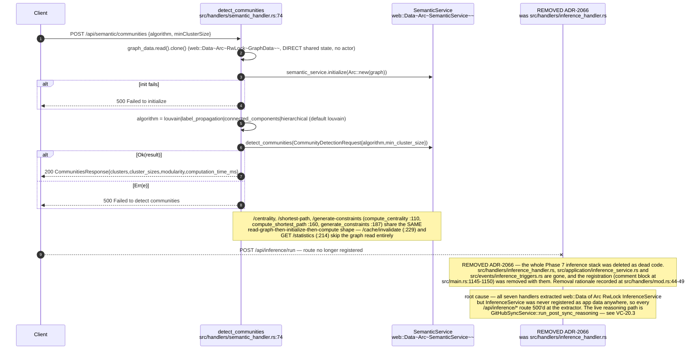
```mermaid
sequenceDiagram
    autonumber
    participant C as Client
    participant DC as detect_communities<br/>src/handlers/semantic_handler.rs:74
    participant SEM as SemanticService<br/>web::Data~Arc~SemanticService~~
    participant RI as REMOVED ADR-2066<br/>was src/handlers/inference_handler.rs

    C->>DC: POST /api/semantic/communities {algorithm, minClusterSize}
    DC->>DC: graph_data.read().clone() (web::Data~Arc~RwLock~GraphData~~, DIRECT shared state, no actor)
    DC->>SEM: semantic_service.initialize(Arc::new(graph))
    alt init fails
        DC-->>C: 500 Failed to initialize
    end
    DC->>DC: algorithm = louvain|label_propagation|connected_components|hierarchical (default louvain)
    DC->>SEM: detect_communities(CommunityDetectionRequest{algorithm,min_cluster_size})
    alt Ok(result)
        DC-->>C: 200 CommunitiesResponse{clusters,cluster_sizes,modularity,computation_time_ms}
    else Err(e)
        DC-->>C: 500 Failed to detect communities
    end
    Note over DC,SEM: /centrality, /shortest-path, /generate-constraints (compute_centrality :110,<br/>compute_shortest_path :160, generate_constraints :187) share the SAME<br/>read-graph-then-initialize-then-compute shape — /cache/invalidate (:229) and<br/>GET /statistics (:214) skip the graph read entirely

C--xRI: POST /api/inference/run — route no longer registered
    Note over RI: REMOVED ADR-2066 — the whole Phase 7 inference stack was deleted as dead code.<br/>src/handlers/inference_handler.rs, src/application/inference_service.rs and<br/>src/events/inference_triggers.rs are gone, and the registration (comment block at<br/>src/main.rs:1145-1150) was removed with them. Removal rationale recorded at src/handlers/mod.rs:44-49
    Note over RI: root cause — all seven handlers extracted web::Data of Arc RwLock InferenceService<br/>but InferenceService was never registered as app data anywhere, so every<br/>/api/inference/* route 500'd at the extractor. The live reasoning path is<br/>GitHubSyncService::run_post_sync_reasoning — see VC-20.3
```

## VC-04.23 `workspace` scope — RequireAuth + RateLimit(60/min), WorkspaceActor CRUD with timeout
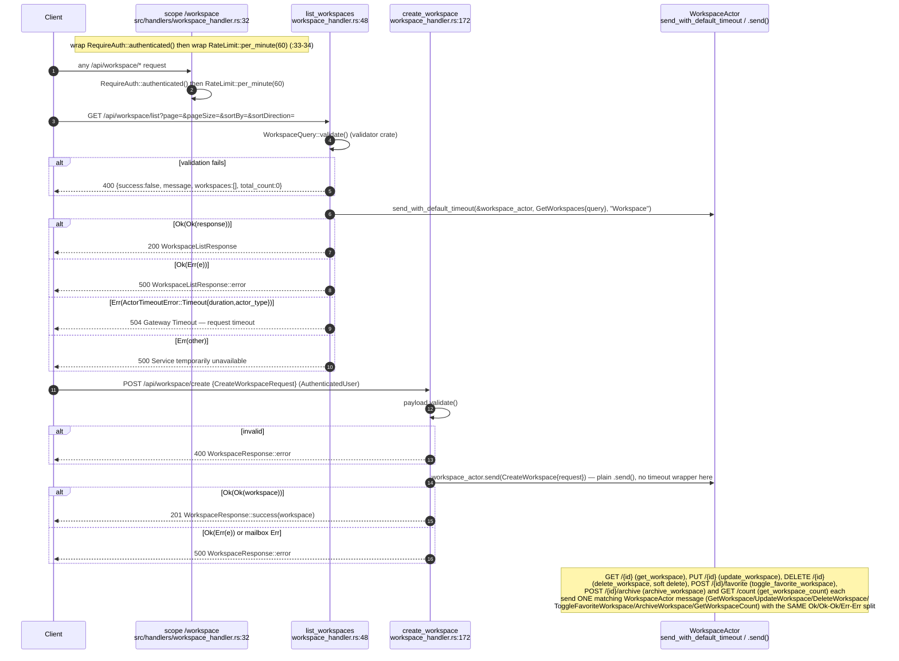
```mermaid
sequenceDiagram
    autonumber
    participant C as Client
    participant W as scope /workspace<br/>src/handlers/workspace_handler.rs:32
    participant LW as list_workspaces<br/>workspace_handler.rs:48
    participant CW as create_workspace<br/>workspace_handler.rs:172
    participant WA as WorkspaceActor<br/>send_with_default_timeout / .send()

    Note over W: wrap RequireAuth::authenticated() then wrap RateLimit::per_minute(60) (:33-34)
    C->>W: any /api/workspace/* request
    W->>W: RequireAuth::authenticated() then RateLimit::per_minute(60)
    C->>LW: GET /api/workspace/list?page=&pageSize=&sortBy=&sortDirection=
    LW->>LW: WorkspaceQuery::validate() (validator crate)
    alt validation fails
        LW-->>C: 400 {success:false, message, workspaces:[], total_count:0}
    end
    LW->>WA: send_with_default_timeout(&workspace_actor, GetWorkspaces{query}, "Workspace")
    alt Ok(Ok(response))
        LW-->>C: 200 WorkspaceListResponse
    else Ok(Err(e))
        LW-->>C: 500 WorkspaceListResponse::error
    else Err(ActorTimeoutError::Timeout{duration,actor_type})
        LW-->>C: 504 Gateway Timeout — request timeout
    else Err(other)
        LW-->>C: 500 Service temporarily unavailable
    end
    C->>CW: POST /api/workspace/create {CreateWorkspaceRequest} (AuthenticatedUser)
    CW->>CW: payload.validate()
    alt invalid
        CW-->>C: 400 WorkspaceResponse::error
    end
    CW->>WA: workspace_actor.send(CreateWorkspace{request}) — plain .send(), no timeout wrapper here
    alt Ok(Ok(workspace))
        CW-->>C: 201 WorkspaceResponse::success(workspace)
    else Ok(Err(e)) or mailbox Err
        CW-->>C: 500 WorkspaceResponse::error
    end
    Note over WA: GET /{id} (get_workspace), PUT /{id} (update_workspace), DELETE /{id}<br/>(delete_workspace, soft delete), POST /{id}/favorite (toggle_favorite_workspace),<br/>POST /{id}/archive (archive_workspace) and GET /count (get_workspace_count) each<br/>send ONE matching WorkspaceActor message (GetWorkspace/UpdateWorkspace/DeleteWorkspace/<br/>ToggleFavoriteWorkspace/ArchiveWorkspace/GetWorkspaceCount) with the SAME Ok/Ok-Ok/Err-Err split
```

## VC-04.24 `GET /api/pages` — metadata fan-out over the content API
```mermaid
sequenceDiagram
    autonumber
    participant C as Client
    participant GP as get_pages<br/>src/handlers/pages_handler.rs:21
    participant SE as settings_addr<br/>GetSettings
    participant MD as metadata_addr<br/>GetMetadata
    participant CA as content_api<br/>app_state.content_api (per-file fetch)

    C->>GP: GET /api/pages
    GP->>SE: settings_addr.send(GetSettings)
    alt mailbox error or Err
        GP-->>C: 500 Settings actor mailbox error / settings error
    end
    GP->>MD: metadata_addr.send(GetMetadata)
    alt mailbox error or Err
        GP-->>C: 500 Metadata actor mailbox error
    end
    GP->>GP: is_debug_enabled() gates verbose logging only
    par one future per metadata entry
        GP->>CA: content_api.clone() fetch per (id, meta.file_name) — join_all(futures)
    end
    GP-->>C: 200 {pages: [PageInfo{id,title,path,parent,modified}, ...]}
    Note over GP: no auth wrap on this route — /api/pages sits under the scope-wide RbacGate<br/>only (VC-03.6), classified as a public GET read like /api/graph/data
```

## VC-04.25 `client-logs` (REST) and `client-messages` (WebSocket) — telemetry ingest and outbound stream
```mermaid
sequenceDiagram
    autonumber
    participant C as Client
    participant CL as handle_client_logs<br/>src/handlers/client_log_handler.rs:38
    participant TL as telemetry logger<br/>get_telemetry_logger()
    participant WS as websocket_client_messages<br/>src/handlers/client_messages_handler.rs:106
    participant CW as ClientMessagesWs actor<br/>client_messages_handler.rs:10

    C->>CL: POST /api/client-logs {logs:[...], sessionId, timestamp}
    alt logs.len() > MAX_LOG_ENTRIES (1000)
        CL-->>C: 413 Too many log entries
    end
    CL->>CL: client_session_id = X-Session-ID header or payload.sessionId
    CL->>CL: correlation_id = Uuid::parse_str(client_session_id) or new_v4() fallback
    opt telemetry logger present
        CL->>TL: TelemetryEvent::new(...).with_client_session_id(...).with_metadata(log_count,...)
    end
    CL->>CL: append entries to /app/logs/client.log
    CL-->>C: 200 {status:success}
    Note over CL: registered EARLY in the /api scope (src/main.rs:1106) specifically to avoid<br/>scope-registration-order conflicts (VC-01.10) — RBAC-allowlisted (VC-03.6 has_segment_prefix)

    C->>WS: GET /ws/client-messages (Upgrade: websocket)
    WS->>WS: token = Authorization Bearer OR ?token= query param
    alt token empty or missing
        WS-->>C: 401 {error: Authentication required} — client_ip logged as SECURITY warning
    else token present (NOT actually verified against NostrService here)
        WS->>CW: ws::start(ClientMessagesWs::new(app_state), req, stream)
        CW->>C: 101 Switching Protocols, text {type:init, status:connected}
        CW->>CW: start_heartbeat() — ctx.run_interval(30s) ping, 90s no-pong -> ctx.stop()
        CW->>CW: start_message_stream() — ctx.run_interval(100ms) drains app_state.client_message_rx
        loop every 100ms while messages queued
            CW->>C: text {type:client_message, content, timestamp, session_id, agent_id}
        end
        loop client frames
            C->>CW: Ping/Pong/Text/Binary/Close
            alt Binary
                CW->>CW: warn — binary messages not supported on this stream
            end
        end
    end
    Note over WS: DOC-DRIFT — the in-code comment (client_messages_handler.rs:114-116) says<br/>#quot;Currently allows but logs unauthenticated connections#quot but the code (:131-142)<br/>actually REJECTS an empty token with 401 — the token's CONTENTS are never verified<br/>against NostrService, only its presence, so any non-empty string passes
```

## VC-04.27 `pay` scope — L402-style balance/debit gate, unconditionally mounted, inert until PAY_ENABLED
```mermaid
sequenceDiagram
    autonumber
    participant C as Client
    participant CFG as VcPayConfig::from_env<br/>src/handlers/pay_handler.rs:93 — PAY_ENABLED, PAY_COST_SATS, PAY_LEDGER_DIR
    participant INFO as pay_info_handler<br/>GET /pay/.info
    participant BAL as pay_balance_handler<br/>pay_handler.rs:453
    participant RES as pay_resource_handler<br/>pay_handler.rs:506
    participant DEP as pay_deposit_handler<br/>pay_handler.rs:480
    participant ST as FsPaymentStore<br/>web::Data~Arc~FsPaymentStore~~ — get_balance/debit

    Note over CFG: routes mounted UNCONDITIONALLY at src/main.rs:1068 (VC-01) — inert until<br/>PAY_ENABLED=true, gated handler-by-handler rather than by a scope-level middleware
    C->>INFO: GET /pay/.info (always reachable, no gate)
    INFO-->>C: 200 {enabled, methods:[lightning], costTiers} — reports the REAL enabled flag
    C->>BAL: GET /pay/.balance
    alt !config.enabled
        BAL-->>C: 403 Payment system is disabled
    else enabled
        BAL->>BAL: extract_caller_pubkey(req) — NIP-98 Authorization header
        alt no pubkey
            BAL-->>C: 401 Authentication required
        else
            BAL->>BAL: did = pubkey_to_did(pubkey)
            BAL->>ST: store.get_balance(&did)
            BAL-->>C: 200 balance_response(did, balance, cost_sats)
        end
    end
    C->>RES: GET /pay/{resource_path}
    alt !config.enabled
        RES-->>C: 403 Payment system is disabled
    else enabled and authenticated
        RES->>RES: cost = config.cost_for_endpoint(#quot;/{resource}#quot) — P2-05 per-endpoint cost tier<br/>(inference=cost*10, image-gen=cost*100, analytics=cost*5, default=cost_sats)
        RES->>ST: store.debit(&did, cost)
        alt Ok(remaining)
            RES-->>C: 200 {resource,charged,balance:remaining} — headers X-Balance, X-Cost
        else insufficient balance
            RES-->>C: error response (payment_required_body-shaped)
        end
        Note over RES: resource proxying is a STUB — this confirms and charges but never<br/>forwards to the underlying resource handler (pay_handler.rs:503-505)
    Note over CFG,ST: PROPOSED, NOT LIVE — ADR-2111 (decision_status proposed, implementation_status<br/>none, 2026-09-21) would DELETE FsPaymentStore and the whole /pay/* route set and replace<br/>them with a thin proxy to the agentbox wallet surface, carrying the caller's NIP-98 identity<br/>through, so this repo stops owning a sats ledger. Everything drawn above is the LIVE state<br/>today — docs/adr/ADR-2111-re-sequence-rgb-for-bridged-assets-and-delete-the-host-payment-store.md:38<br/>Re-qualified 2026-10-01: the sidestr-rs parity release does not implement it, FsPaymentStore<br/>and /pay/* stay host-owned and the record stays proposed (ADR-2111-re-sequence-rgb-for-bridged-assets-and-delete-the-host-payment-store.md:83, :95-96)
    end
    C->>DEP: POST /pay/.deposit
    DEP-->>C: 501 Not Implemented — #quot;Contact the server operator for manual funding#quot (:487-492)
    Note over DEP: DIVERGENCE — Lightning deposit is a stub in this commit, spec link only (webledgers.org)
```

## VC-04.28 `quic_transport_handler` — DOC-DRIFT: the QUIC transport was removed under ADR-2066, two Postcard structs survive
```mermaid
flowchart TB
    Q["quic_transport_handler.rs (102 lines) — now holds ONLY PostcardNodeUpdate and<br/>PostcardBatchUpdate plus their BinaryNodeData round-trip impls (quic_transport_handler.rs:22-75)"]
    FIELDS["PostcardNodeUpdate: id,x,y,z,vx,vy,vz,cluster_id,anomaly_score,community_id (:22-36)<br/>PostcardBatchUpdate: frame_id,timestamp_ms,nodes:Vec~PostcardNodeUpdate~ (:70-75)<br/>round-trip impls From/Into BinaryNodeData (:38-67), one #[cfg(test)] unit test (:82-100)"]
    IMP["imported directly by (fastwebsockets_handler.rs:34)<br/>`use super::quic_transport_handler::{PostcardBatchUpdate, PostcardNodeUpdate}`<br/>— never by any HTTP/WS route in this file"]
    MODRS["src/handlers/mod.rs:111-117 — module doc comment records the removal;<br/>NO pub use re-export of anything from this module exists"]
    NONE["NO configure fn, no route, scope, or .service() call anywhere in src/main.rs<br/>registers this module — it never had one even before the removal"]
    Q --> FIELDS --> IMP
    Q --> MODRS --> NONE
    D1["DOC-DRIFT (pre-dates this verification window, commit 35c2448a8) — the previously-diagrammed<br/>QuicTransportServer, QuicServerConfig, QuicClientSession, ControlMessage, TopologyNode,<br/>TopologyEdge, PostcardDeltaUpdate and the encode/decode/calculate_deltas free functions do<br/>NOT exist in this file any more. ADR-2066 removed the whole QUIC/WebTransport server as dead<br/>code — constructed nowhere, routed nowhere, only ever re-exported (never called). Only the two<br/>Postcard wire-format structs survive, kept because fastwebsockets_handler.rs's own<br/>postcard-serialized position broadcasts import them directly."]
    NONE --- D1
```
````

## DIFF

```diff
diff --git a/docs/adr/ADR-2111-re-sequence-rgb-for-bridged-assets-and-delete-the-host-payment-store.md b/docs/adr/ADR-2111-re-sequence-rgb-for-bridged-assets-and-delete-the-host-payment-store.md
index 5de838f2e..d9556a7b1 100644
--- a/docs/adr/ADR-2111-re-sequence-rgb-for-bridged-assets-and-delete-the-host-payment-store.md
+++ b/docs/adr/ADR-2111-re-sequence-rgb-for-bridged-assets-and-delete-the-host-payment-store.md
@@ -208,6 +208,61 @@ waits on a running stack, the S3 route and an S4b receipt. On 2 October
 `visionclaw_container` was not running, so neither the live diff nor the
 screenshot was taken.
 
+## Blocktrails alignment and the solid-pod-rs pin — 2026-10-03 (stream S4)
+
+This amends D2 and D8 and applies D9 to `src/web_contract`. It adds no
+decision and leaves the record `proposed / none / inactive`: no confirmer
+answers from `sidestr-node` yet.
+
+- **D8, the pin, is met.** `Cargo.toml` pins every solid-pod-rs crate the host
+  uses (`solid-pod-rs`, `-nostr`, `-idp`, `-server`) at `=0.5.0-alpha.12`,
+  the forum's pin at nostr-rust-forum `b73ec8c`. `crates/vault` reaches
+  solid-pod-rs through `nostr-bbs-core`, which pins it exactly, and every
+  published `nostr-bbs-core` pins an older alpha. `nostr-bbs-core` is
+  therefore patched to the forum at `b73ec8c` until a release carrying alpha.12
+  is published. The `extraction/solid-pod-rs` half of D8 is unchanged.
+- **D2, restated: the trail is walked, not its tip.** The earlier seam asked
+  whether the tip was confirmed and, at L1, whether a prevout was spent once.
+  A confirmed tip shows only that someone paid the tip's key. Under
+  Blocktrails (blocktrails/spec `ef54a08`, "the rule as it is") every mark's
+  output key `x(P_i)` is the base key tweaked by every state so far, so the
+  check that matters is per link. `AnchorConfirmer` is now `is_confirmed`,
+  `output_key(txid, vout)` and `spends(txid, prev_txid, prev_vout)`;
+  `prevout_spent_once` is removed, since a mark spending its predecessor is
+  what it was standing in for. `verify` recomputes every `x(P_i)` from
+  `pubkeyBase` and the states with solid-pod-rs's walker
+  (`solid_pod_rs::blocktrail::walk_blocktrail`). It reports
+  blocktrails/verify `043e7af`'s verdict: `verified`, `confirmed` (marks
+  on-chain, no `pubkeyBase` to recompute from) or `partial`. L0 accepts
+  `verified` or `confirmed`; L1 accepts only `verified`.
+- **The words.** `TrustLevel::L1SingleUseSeal` is `L1Anchored` (serialised
+  `l1_anchored`; nothing serialised the old name). The "single-use seal"
+  wording and the "C6 reconstruction" label on `blocktrails.json` are gone
+  from `src/web_contract`. A unit test (`no_seal_vocabulary_in_the_module`)
+  is the vocabulary lint the Verification list asks for, over that module.
+  `docs/archive` keeps its historical wording.
+- **The trail type.** `Blocktrails` wraps solid-pod-rs's shared `Blocktrail`,
+  the gitmark profile §5.2 shape (`@type`, `version`, `profile`, `pubkeyBase`,
+  `chain`, `states`, `txo` as TXO URIs
+  `txo:<chain>:<txid>:<vout>?amount=&commit=`). Files in the host's earlier
+  `{txid, vout, address}` form still load and are written back as TXO URIs.
+- **Evidence.** `tests/fixtures/blocktrails/` vendors solid-pod-rs
+  0.5.0-alpha.12's `verify-trail-vectors.json` (blocktrails/verify `043e7af`
+  run as published) and `live-trail-txs.json` (blocktrails/git-mark `b852d7d`'s
+  live trail, captured from mempool.space testnet4). The host walker gives the
+  page's labels and verdict on all 13 cases except two documented ones. On a
+  mark that does not spend its predecessor it says `broken link`, as
+  solid-pod-rs does. It does not check recorded amounts, because the
+  confirmer reports no output values. The live trail is `verified`. With two
+  states swapped it is `partial` (`verified`, `wrong key`, `wrong key`) while
+  its tip stays confirmed.
+- **D9.** `src/web_contract`'s module header now states that it is not
+  `crates/visionclaw-contracts`.
+
+The Verification item on `prevout_spent_once` now reads: `verify` at L1 passes
+a live trail and refuses a reordered one through a confirmer that answers from a
+running `sidestr-node`, with no test double in the path.
+
 ## Disposition — 2026-10-02
 
 - **Suitability:** fits, needs revision
```
