# Label vc-10

You are an independent labeller for a pre-registered experiment. Below are (1) a TOPIC: a Markdown file of Mermaid diagrams, with short prose notes, that document code, with `path:line` citations, where paths under `../project/` are in the VisionClaw repository and paths under `../project/agentbox/` are in the agentbox repository; and (2) a DIFF: one commit's changes in the visionclaw repository, restricted to the files the topic lists under `sources:`. The topic was verified against a revision of that repository at or before this commit's parent, so the diff is a change made after the topic was written.

Answer exactly one question:

> **Did this change make anything this topic states wrong or misleading?**

Judge only from the two texts below; do not look anything else up. Reply with a single JSON object and nothing else:

```json
{"verdict": "yes" | "no", "statements": ["<diagram or section id>: <the statement, quoted>", ...], "line_anchors_only": true | false, "reason": "<one or two sentences>"}
```

`statements` lists every statement in the topic (a message, node, edge, guard, label or prose claim) that the change makes wrong or misleading; it is empty when the verdict is no. `line_anchors_only` is true when the only such statements are `path:line` anchors whose cited code merely moved.

## TOPIC (docs/diagrams/visionclaw/32-client-websocket-and-binary.md)

````markdown
---
id: VC-32
title: Client WebSocket transport and binary position protocol
area: visionclaw
governing:
  - ../project/docs/PROTOCOL-registry.md
  - ../project/docs/BASELINE-architecture.md
adrs: [ADR-2002, ADR-2019, ADR-2020, ADR-2047, ADR-2057, ADR-2078, ADR-2080]
sources:
  - ../project/docs/BASELINE-architecture.md
  - ../project/docs/PROTOCOL-registry.md
  - ../project/client/src/store/websocket/connectionManager.ts
  - ../project/client/src/store/websocketStore.ts
  - ../project/client/src/store/websocket/index.ts
  - ../project/client/src/store/websocket/storeState.ts
  - ../project/client/src/store/websocket/types.ts
  - ../project/client/src/store/websocket/binaryFrameDispatcher.ts
  - ../project/client/src/store/websocket/binaryProtocol.ts
  - ../project/client/src/store/agentTargetStore.ts
  - ../project/client/src/store/websocket/filterSync.ts
  - ../project/client/src/store/websocket/textMessageHandler.ts
  - ../project/client/src/store/websocket/solidWebSocket.ts
  - ../project/client/src/services/solidPod/podNotifications.ts
  - ../project/client/src/services/BinaryWebSocketProtocol.ts
  - ../project/client/src/services/binaryProtocol/frameTypes.ts
  - ../project/client/src/services/binaryProtocol/agentMessages.ts
  - ../project/client/src/services/binaryProtocol/backpressure.ts
  - ../project/client/src/services/binaryProtocol/ssspVoice.ts
  - ../project/client/src/services/nostrAuthService.ts
  - ../project/client/src/types/binaryProtocol.ts
  - ../project/client/src/features/graph/hooks/useGraphEventHandlers.ts
  - ../project/client/src/app/AppInitializer.tsx
  - ../project/client/src/store/transientBeamStore.ts
  - ../project/xr-client/rust/src/binary_protocol.rs
  - ../project/src/utils/binary_protocol.rs
  - ../project/docs/IDENTIFIER-taxonomy.md
  - ../project/client/src/utils/validation.ts
  - ../project/src/handlers/socket_flow_handler/http_handler.rs
  - ../project/src/settings/api/settings_routes.rs
verified_commit: {visionclaw: 58f04f2eb272a2707737f2065f8241b931229e81}
---
## VC-32.1 Connect + NIP-98 WS authenticate handshake
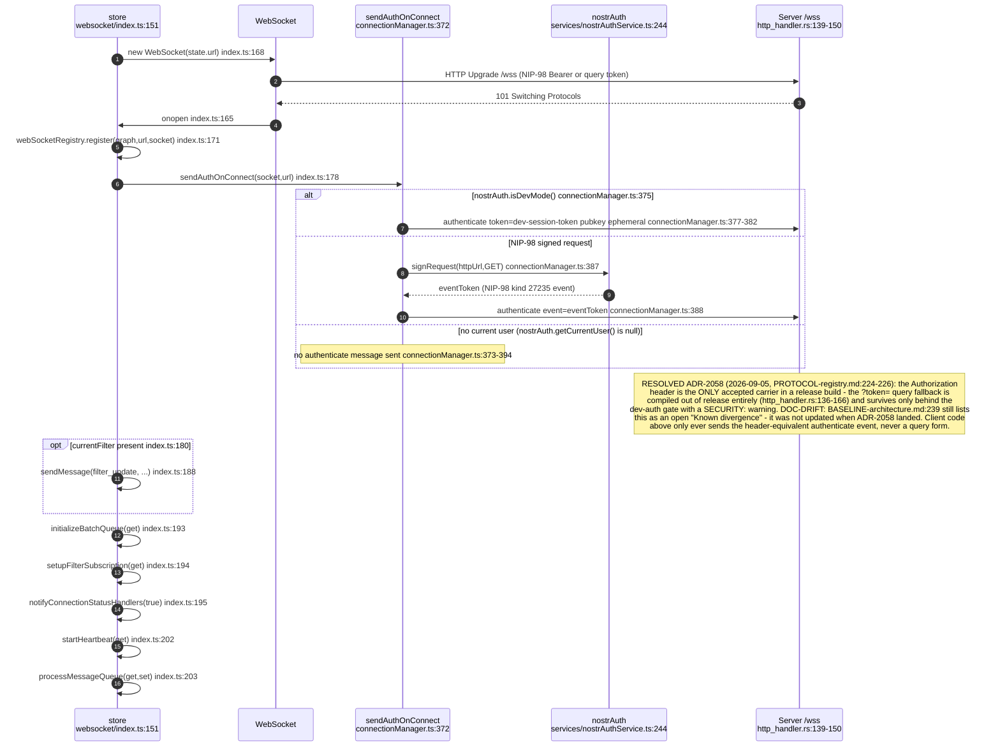
## VC-32.2 Reconnect backoff and heartbeat / binary-silence watchdog
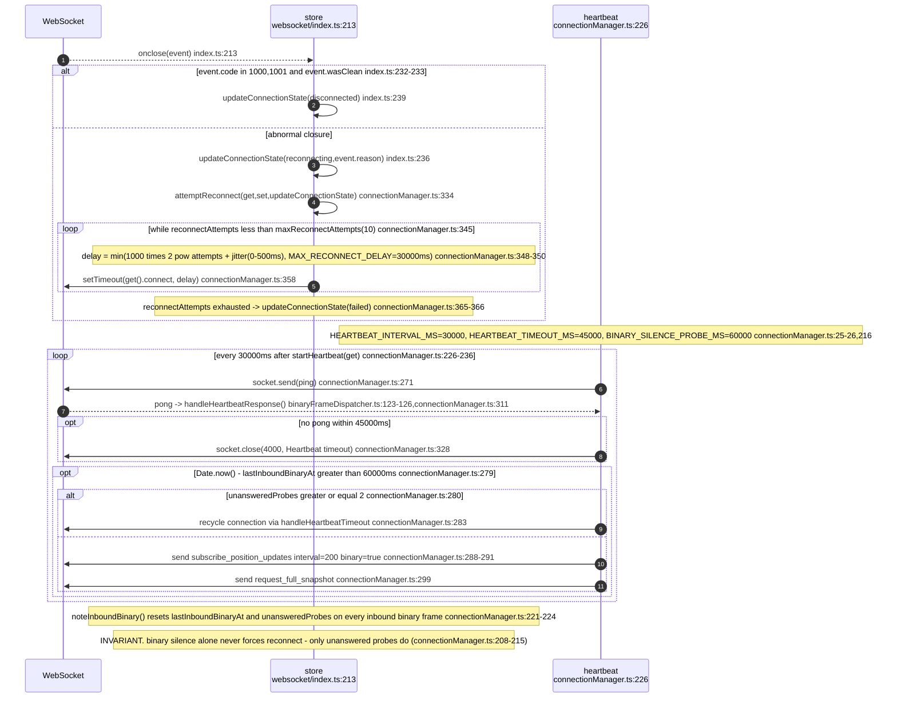
## VC-32.3 Binary frame demux: onmessage tag dispatch and single-flight discipline
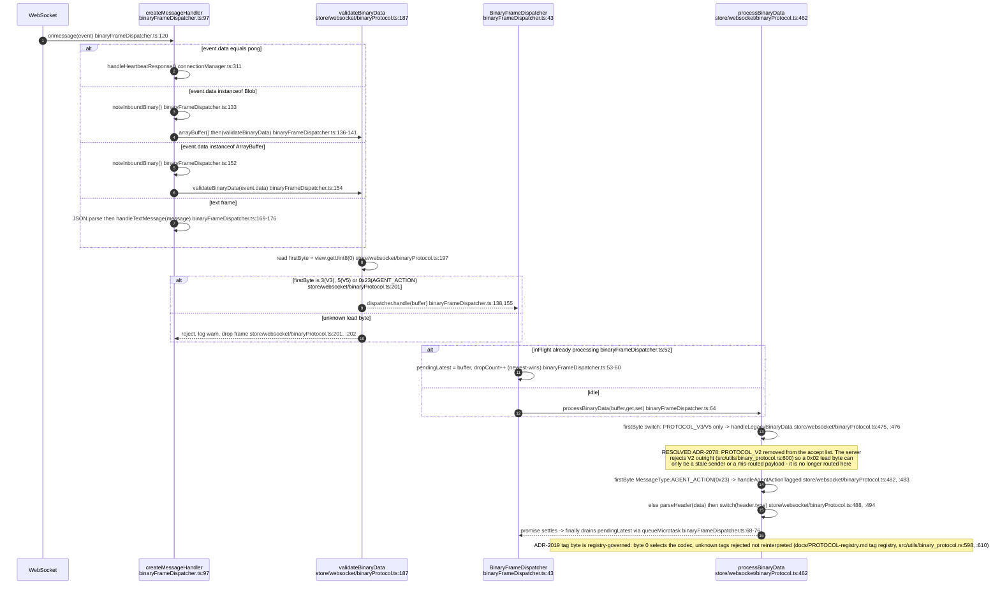
## VC-32.4 Outbound framed-message header (client-originated only)
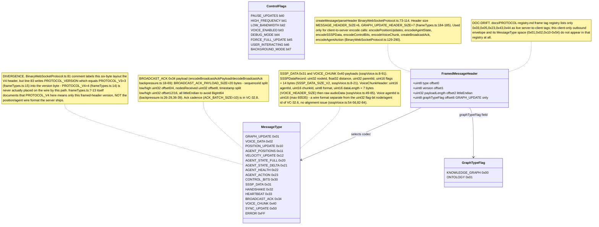
## VC-32.5 Server-to-client position wire records: V3, V4 delta, V5 envelope (V2 declined)
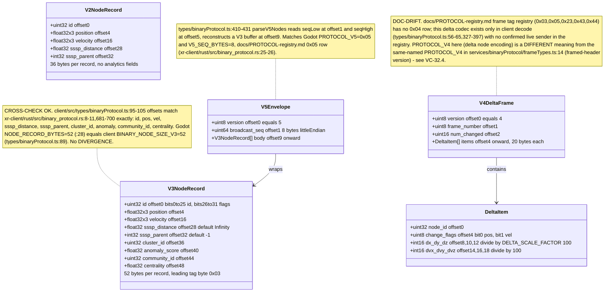
## VC-32.6 Wire node-id: type flag bits over the 26-bit id
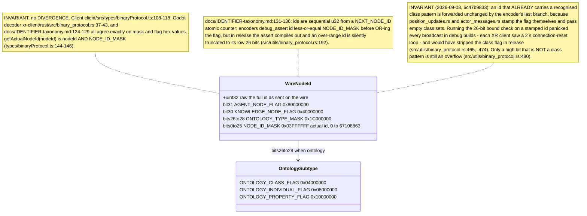
## VC-32.7 getNodeType(): flag precedence decision order
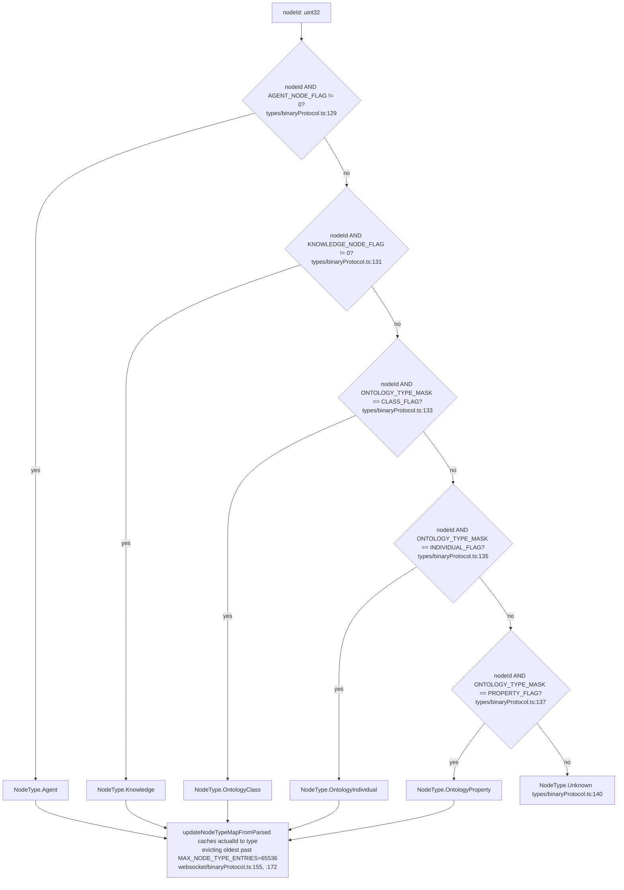
## VC-32.8 Live position frame processing: parse, analytics ingest, ack
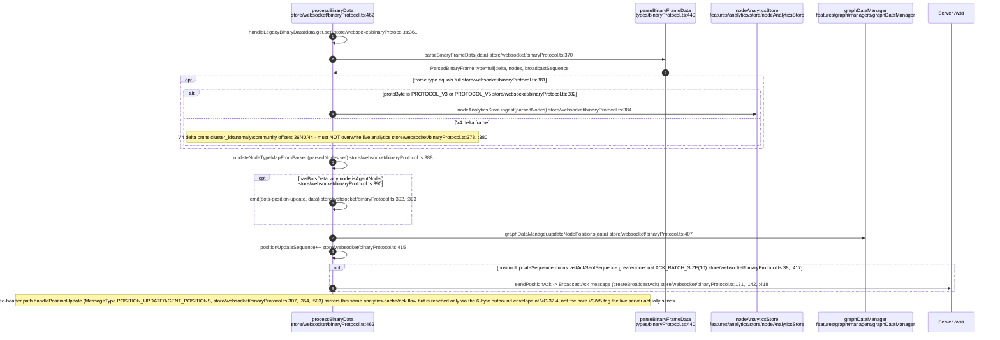
## VC-32.9 Position subscription: idempotent one-shot subscribe, filter sync, shrink-guard
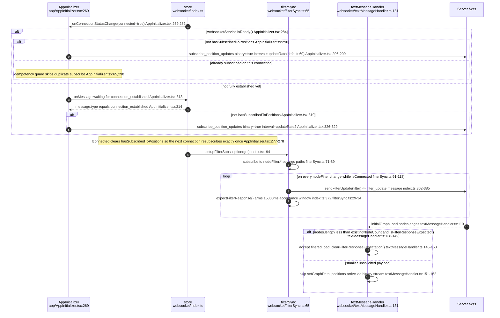
## VC-32.10 Drag / pin send path: server-authoritative pin over JSON control frames
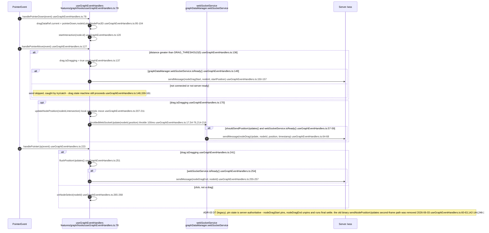
## VC-32.11 Agent frame 0x23 (AGENT_ACTION): decode and beam dispatch
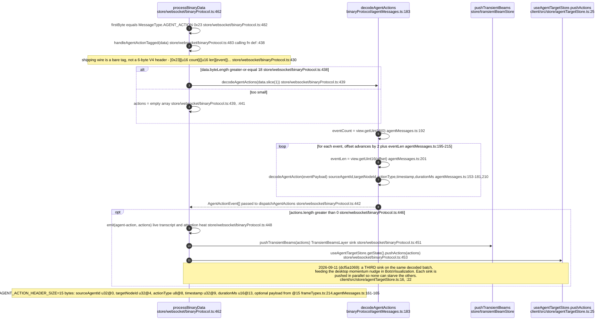
## VC-32.15 JSON control-frame catalogue
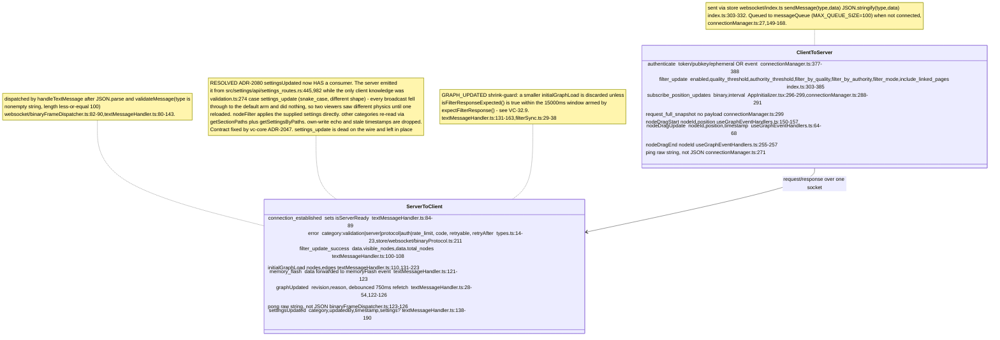
## VC-32.16 solidWebSocket: JSS resource-notification boundary
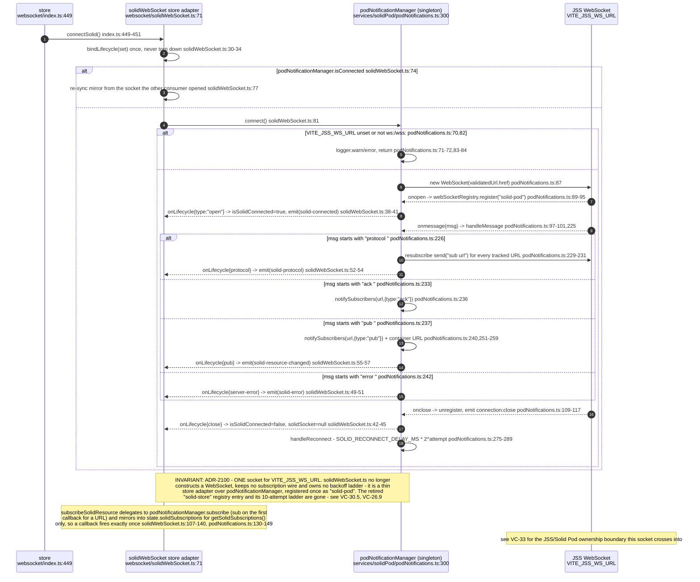
````

## DIFF

```diff
diff --git a/docs/BASELINE-architecture.md b/docs/BASELINE-architecture.md
index c77e00615..4d28782df 100644
--- a/docs/BASELINE-architecture.md
+++ b/docs/BASELINE-architecture.md
@@ -233,8 +233,10 @@ read-only guard defaults off (`public_demo.rs:29-33`, `unwrap_or(false)`).
 
 - **The sidestr library release does not replace VisionClaw's payment host.** The
   `FsPaymentStore` ledger and `/pay/*` routes still exist in
-  `src/handlers/pay_handler.rs:198-900`, while `AnchorConfirmer` remains an interface backed
-  only by test doubles (`src/web_contract/ritual.rs:144`, `:319-328`). ADR-2111 therefore
+  `src/handlers/pay_handler.rs:199-905`, while `AnchorConfirmer` remains an interface backed
+  only by test doubles (`src/web_contract/ritual.rs:182`; the captured-testnet4 double at
+  `:527`). Since 2026-10-03 `verify` walks every trail link with solid-pod-rs's Blocktrails
+  walker (ADR-2111, S4 amendment), but no confirmer answers from a node yet. ADR-2111 therefore
   remains `proposed / none / inactive`: the host still needs the authenticated agentbox proxy
   and a real sidestr-backed confirmer. The master estate board tracks this as N-3.
```
