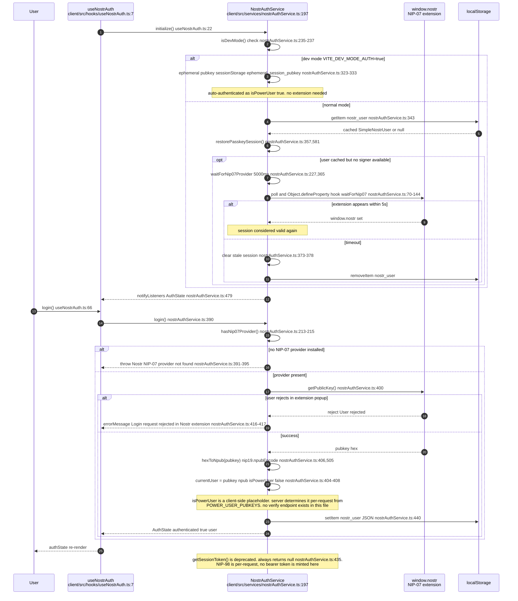
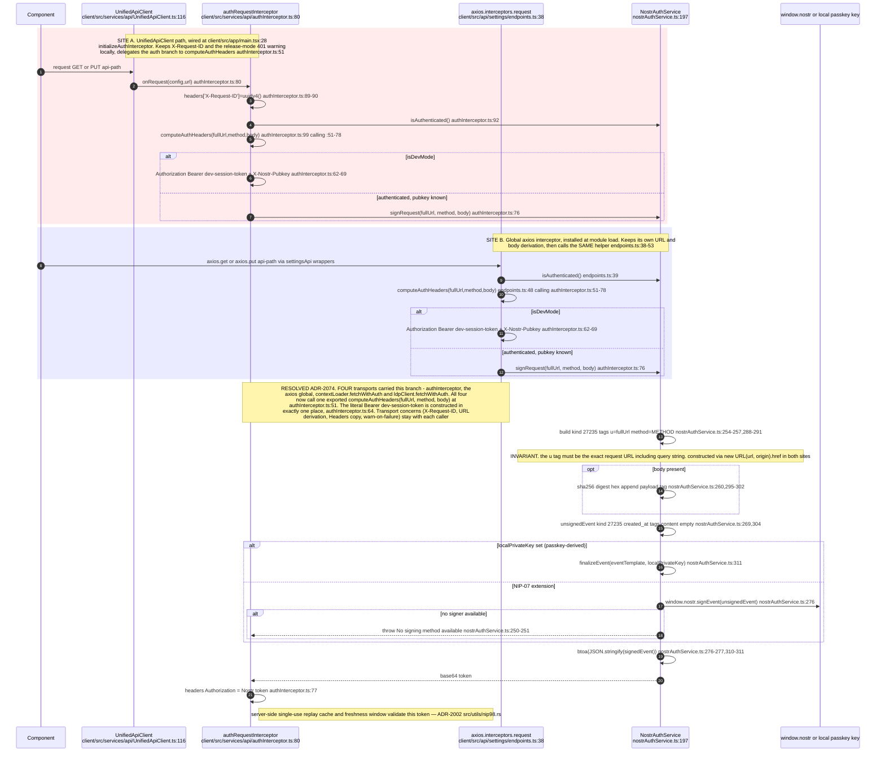
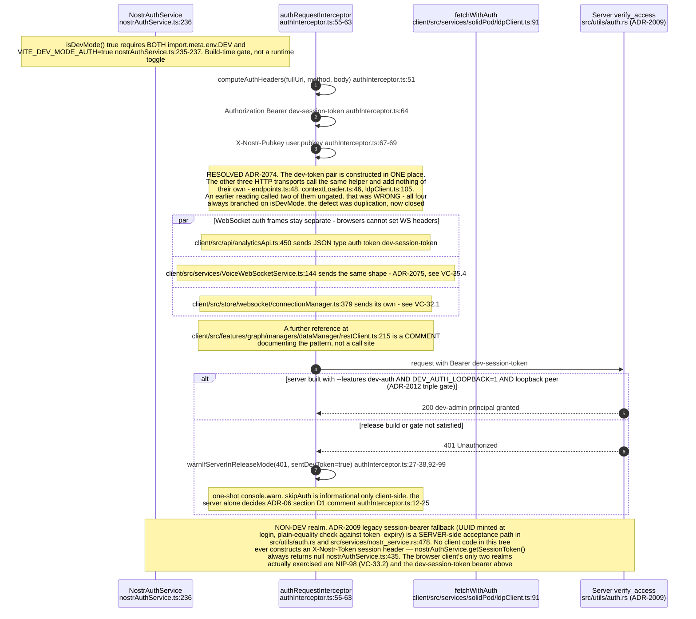
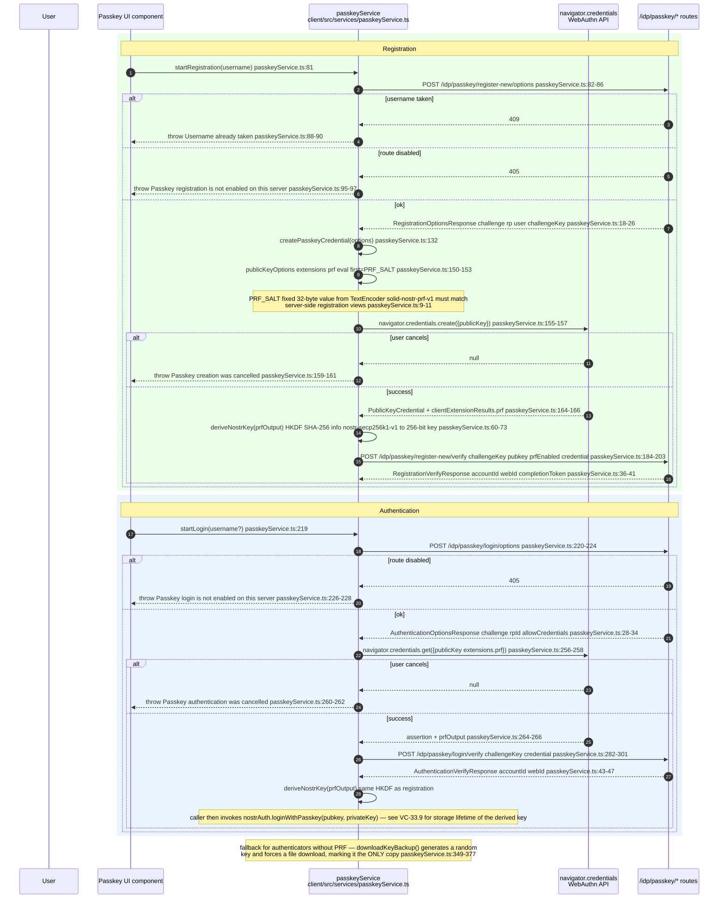
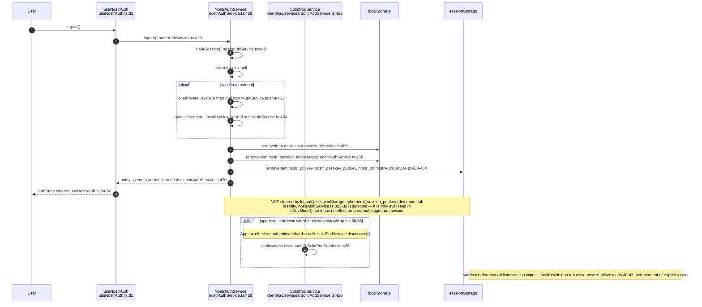
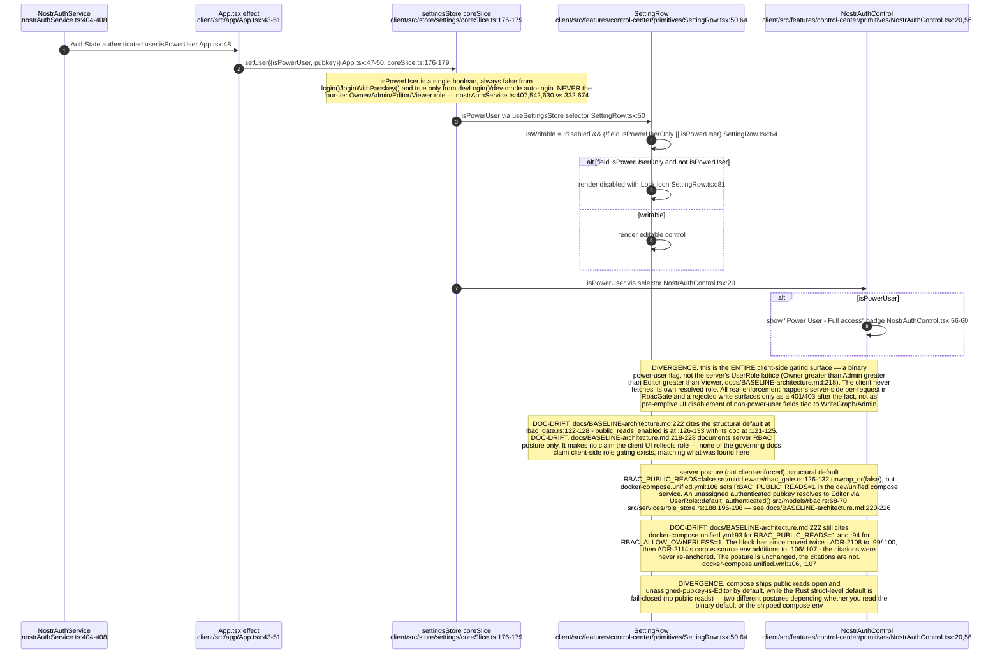
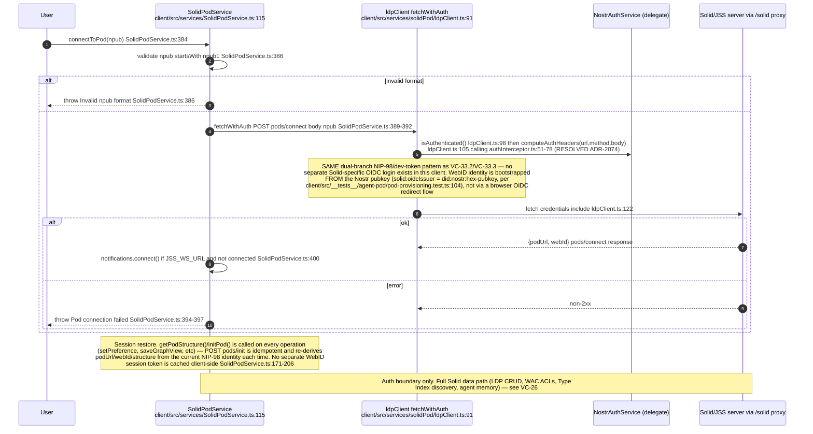

# Label vc-11

You are an independent labeller for a pre-registered experiment. Below are (1) a TOPIC: a Markdown file of Mermaid diagrams, with short prose notes, that document code, with `path:line` citations, where paths under `../project/` are in the VisionClaw repository and paths under `../project/agentbox/` are in the agentbox repository; and (2) a DIFF: one commit's changes in the visionclaw repository, restricted to the files the topic lists under `sources:`. The topic was verified against a revision of that repository at or before this commit's parent, so the diff is a change made after the topic was written.

Answer exactly one question:

> **Did this change make anything this topic states wrong or misleading?**

Judge only from the two texts below; do not look anything else up. Reply with a single JSON object and nothing else:

```json
{"verdict": "yes" | "no", "statements": ["<diagram or section id>: <the statement, quoted>", ...], "line_anchors_only": true | false, "reason": "<one or two sentences>"}
```

`statements` lists every statement in the topic (a message, node, edge, guard, label or prose claim) that the change makes wrong or misleading; it is empty when the verdict is no. `line_anchors_only` is true when the only such statements are `path:line` anchors whose cited code merely moved.

## TOPIC (docs/diagrams/visionclaw/33-client-auth-and-identity.md)

````markdown
---
id: VC-33
title: Browser-client identity — NIP-07, NIP-98, passkeys, RBAC gating
area: visionclaw
governing:
  - ../project/docs/IDENTITY-authority-chain.md
  - ../project/docs/SECURITY-profiles.md
adrs: [ADR-2002, ADR-2009, ADR-2011, ADR-2012, ADR-2074, ADR-2075]
sources:
  - ../project/client/src/services/nostrAuthService.ts
  - ../project/client/src/hooks/useNostrAuth.ts
  - ../project/client/src/services/api/authInterceptor.ts
  - ../project/client/src/api/settings/endpoints.ts
  - ../project/client/src/services/passkeyService.ts
  - ../project/client/src/services/SolidPodService.ts
  - ../project/client/src/services/solidPod/ldpClient.ts
  - ../project/client/src/app/App.tsx
  - ../project/client/src/store/settings/coreSlice.ts
  - ../project/client/src/features/control-center/primitives/SettingRow.tsx
  - ../project/client/src/features/control-center/primitives/NostrAuthControl.tsx
  - ../project/client/src/store/websocket/connectionManager.ts
  - ../project/client/src/__tests__/agent-pod/pod-provisioning.test.ts
  - ../project/src/middleware/rbac_gate.rs
  - ../project/src/services/role_store.rs
  - ../project/src/models/rbac.rs
  - ../project/docker-compose.unified.yml
  - ../project/docs/BASELINE-architecture.md
  - ../project/docs/IDENTIFIER-taxonomy.md
  - ../project/client/src/api/analyticsApi.ts
  - ../project/client/src/app/main.tsx
  - ../project/client/src/features/graph/managers/dataManager/restClient.ts
  - ../project/client/src/features/ontology/services/jss/contextLoader.ts
  - ../project/client/src/services/VoiceWebSocketService.ts
  - ../project/client/src/services/api/UnifiedApiClient.ts
  - ../project/src/services/nostr_service.rs
  - ../project/src/utils/auth.rs
  - ../project/src/utils/nip98.rs
verified_commit: {visionclaw: 58f04f2eb272a2707737f2065f8241b931229e81}
---
## VC-33.1 NIP-07 extension login (client-asserted, no server verify round-trip)


## VC-33.2 NIP-98 per-request signing — two independent signing sites (DIVERGENCE)


## VC-33.3 Session bearer / dev-token realm — the non-NIP-98 auth path


## VC-33.4 Passkey / WebAuthn registration and authentication ceremonies


## VC-33.5 Logout / session teardown — what survives


## VC-33.6 RBAC-driven UI gating — client has no role model, only isPowerUser (DIVERGENCE)


## VC-33.8 Solid login boundary — OIDC-shaped WebID, session restore


## VC-33.9 Identity-bearing types held by the browser client

```mermaid
classDiagram
    class SimpleNostrUser {
        +string pubkey
        +string npub optional
        +bool isPowerUser
        storage localStorage key nostr_user JSON
        lifetime survives reload until logout or stale-session detect
        definedAt nostrAuthService.ts:149-153
    }
    class LocalPrivateKeyMaterial {
        +Uint8Array localPrivateKey
        +string _localKeyHex module closure
        storage in-memory only, never sessionStorage
        lifetime cleared on logout, tab close beforeunload
        definedAt nostrAuthService.ts:14,200
    }
    class PasskeyPubkeyMarker {
        +string pubkey hex
        storage sessionStorage key nostr_passkey_pubkey
        lifetime tab session, verified against derived pubkey on restore
        definedAt nostrAuthService.ts:549,604
    }
    class DevSessionToken {
        +string literal Bearer dev-session-token
        storage not stored, recomputed per-request from isDevMode
        lifetime request-scoped, no expiry field
        definedAt authInterceptor.ts:62-69 (ONE literal, ADR-2074);<br/>endpoints.ts:48 and ldpClient.ts:105 delegate there
    }
    class Nip98EventToken {
        +string base64 signed kind 27235 event
        storage not stored, minted per-request in signRequest/signWithLocalKey
        lifetime single-use, server-enforced via replay cache ADR-2002
        definedAt nostrAuthService.ts:244,283
    }
    class WebIdUrl {
        +string webId URL
        storage returned by pods/connect and pods/init, not independently cached
        lifetime re-derived from current Nostr identity on every pod operation
        definedAt SolidPodService.ts:88,104,108
    }
    class PasskeyCredentialId {
        +string id base64url
        +ArrayBuffer rawId
        storage held only in the WebAuthn PublicKeyCredential object during ceremony
        lifetime ceremony-scoped, not persisted by this client
        definedAt passkeyService.ts:49-52
    }
    class LegacySessionBearer {
        +string X-Nostr-Token header value
        +UUID minted at login, plain-equality check vs token_expiry
        storage NEVER constructed by this client
        lifetime N per ADR-2009 server accepts it but no client code path exists
        definedAt ADR-2009 verified_paths list, nostr_service.rs:478
    }

    SimpleNostrUser --> LocalPrivateKeyMaterial : signs with when passkey path chosen
    SimpleNostrUser --> PasskeyPubkeyMarker : cross-checked on restore
    LocalPrivateKeyMaterial --> Nip98EventToken : produces via signWithLocalKey
    SimpleNostrUser --> Nip98EventToken : produces via window.nostr signEvent
    SimpleNostrUser --> DevSessionToken : substitutes in dev builds
    SimpleNostrUser --> WebIdUrl : bootstraps did-nostr issuer for
    PasskeyCredentialId --> LocalPrivateKeyMaterial : PRF output HKDF-derives

    note for SimpleNostrUser "DOC-DRIFT-adjacent co-storage risk. taxonomy line 57 makes pubkey 64-char<br/>lowercase hex and line 92 makes npub UI-display-only, yet nostr_user persists BOTH<br/>together. Not a breach - taxonomy line 178-179 scopes hex-canonical to persisted<br/>URN, DID and ACL entries, not a browser-local UI cache - but it is exactly the<br/>mixing pattern taxonomy line 169-171 warns about."
    note for LegacySessionBearer "DOC-DRIFT-adjacent. ADR-2009 lists authInterceptor, restClient, endpoints,<br/>ldpClient and contextLoader as client dependents of this realm, but none of them<br/>builds an X-Nostr-Token header. They emit only Bearer dev-session-token or a<br/>NIP-98 Nostr token. Verified by reading every cited client file in this diagram<br/>set."
```

````

## DIFF

```diff
diff --git a/docs/BASELINE-architecture.md b/docs/BASELINE-architecture.md
index c77e00615..4d28782df 100644
--- a/docs/BASELINE-architecture.md
+++ b/docs/BASELINE-architecture.md
@@ -233,8 +233,10 @@ read-only guard defaults off (`public_demo.rs:29-33`, `unwrap_or(false)`).
 
 - **The sidestr library release does not replace VisionClaw's payment host.** The
   `FsPaymentStore` ledger and `/pay/*` routes still exist in
-  `src/handlers/pay_handler.rs:198-900`, while `AnchorConfirmer` remains an interface backed
-  only by test doubles (`src/web_contract/ritual.rs:144`, `:319-328`). ADR-2111 therefore
+  `src/handlers/pay_handler.rs:199-905`, while `AnchorConfirmer` remains an interface backed
+  only by test doubles (`src/web_contract/ritual.rs:182`; the captured-testnet4 double at
+  `:527`). Since 2026-10-03 `verify` walks every trail link with solid-pod-rs's Blocktrails
+  walker (ADR-2111, S4 amendment), but no confirmer answers from a node yet. ADR-2111 therefore
   remains `proposed / none / inactive`: the host still needs the authenticated agentbox proxy
   and a real sidestr-backed confirmer. The master estate board tracks this as N-3.
```
