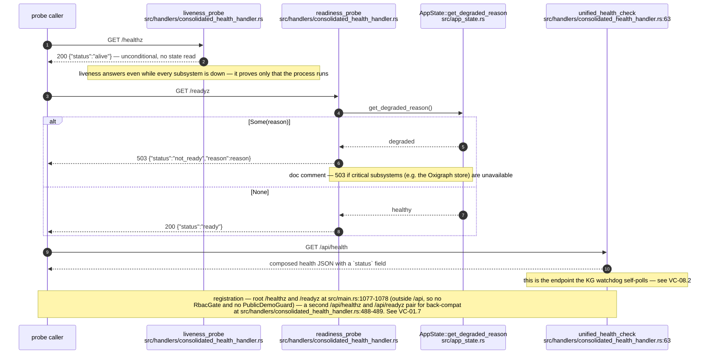
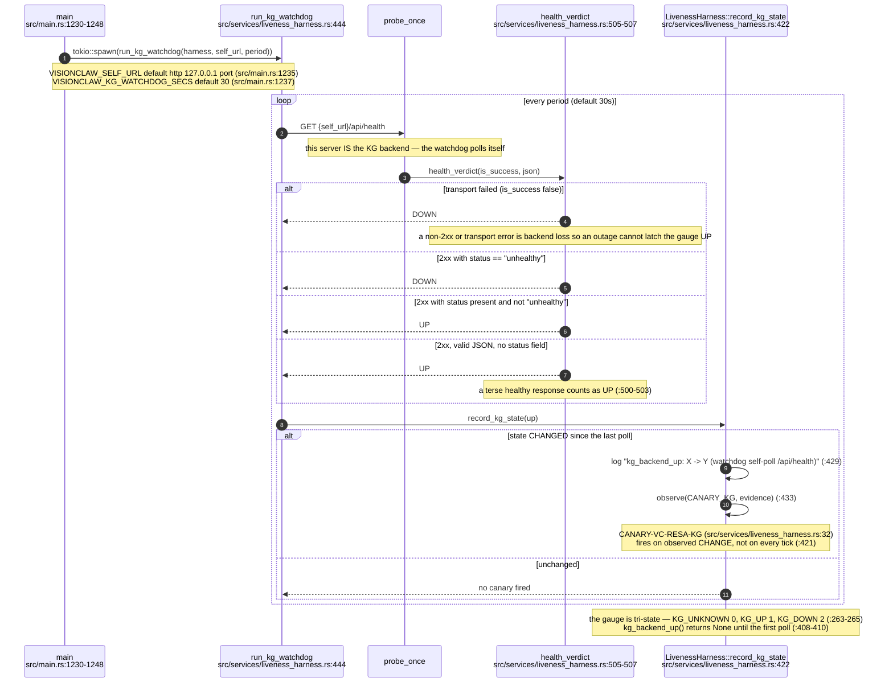
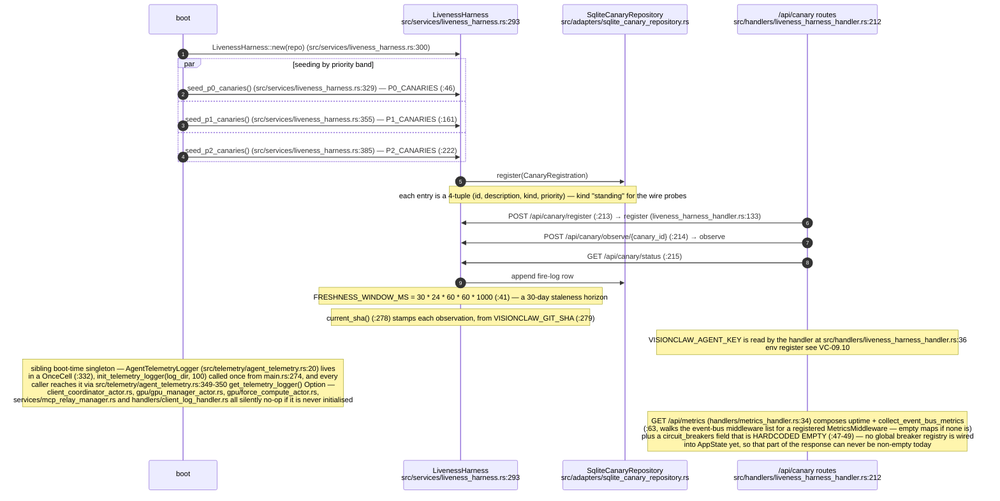
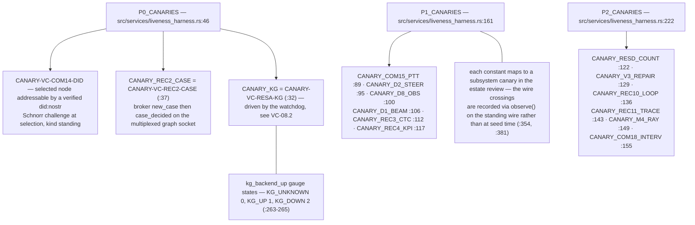
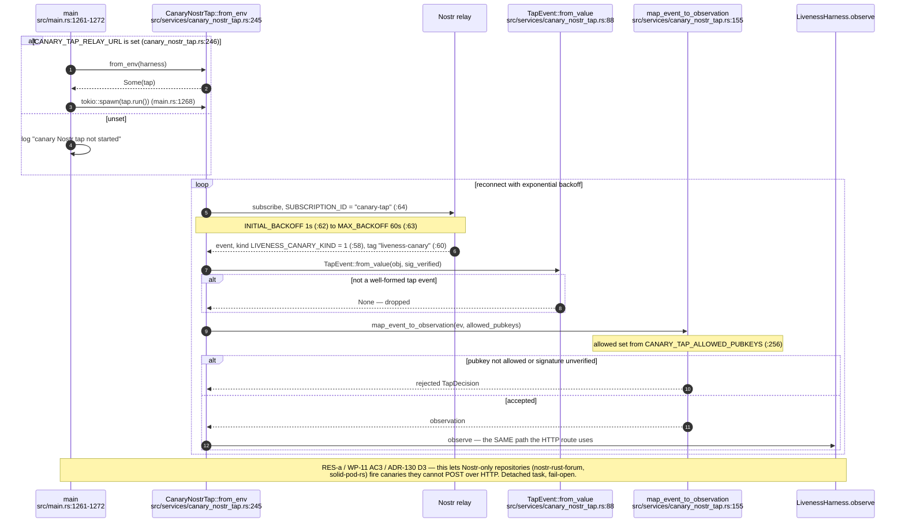
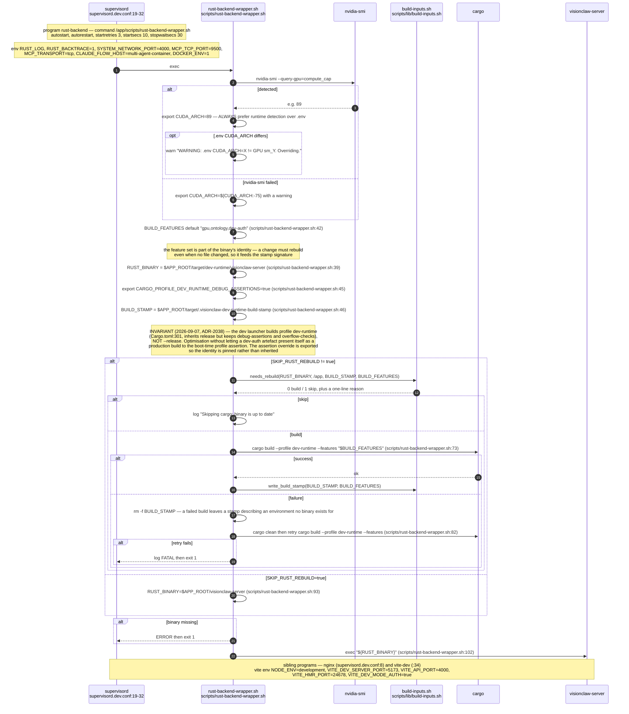
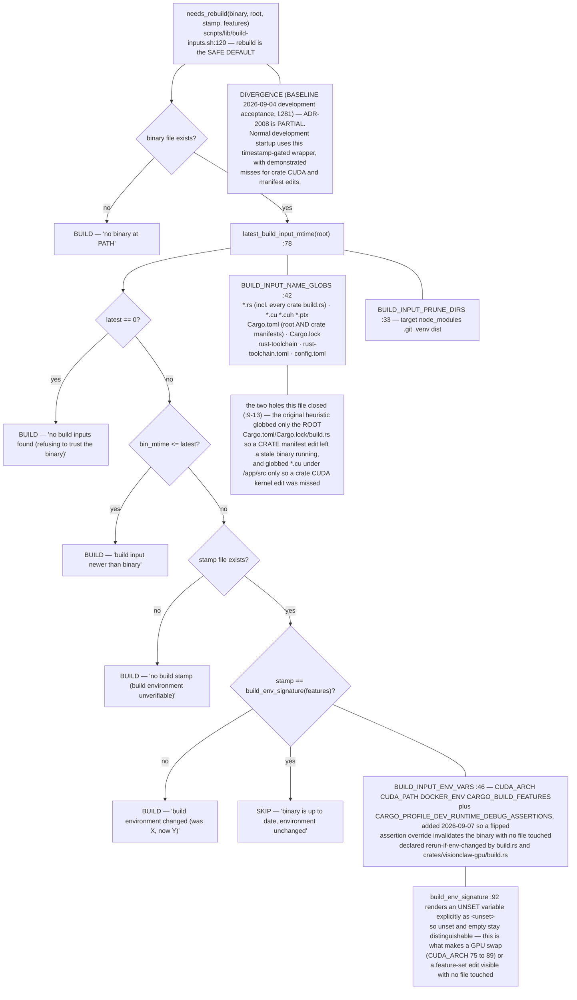
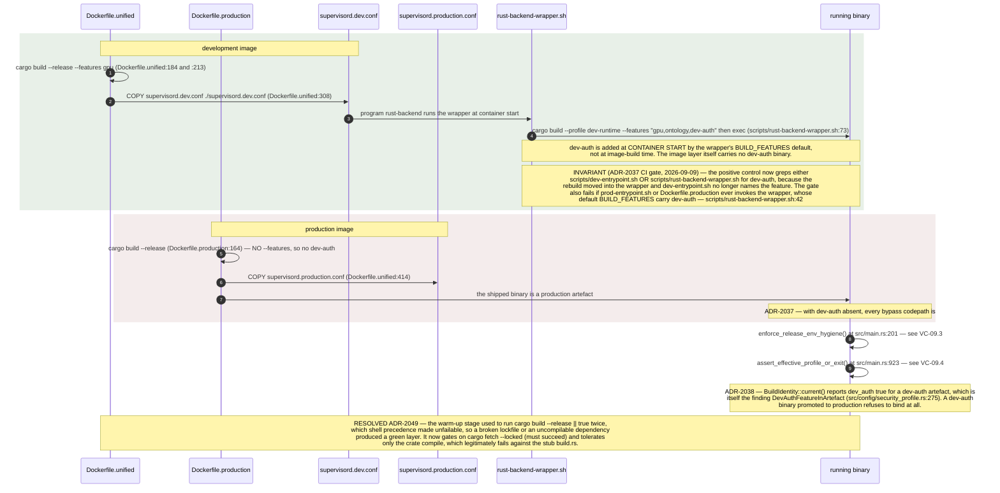
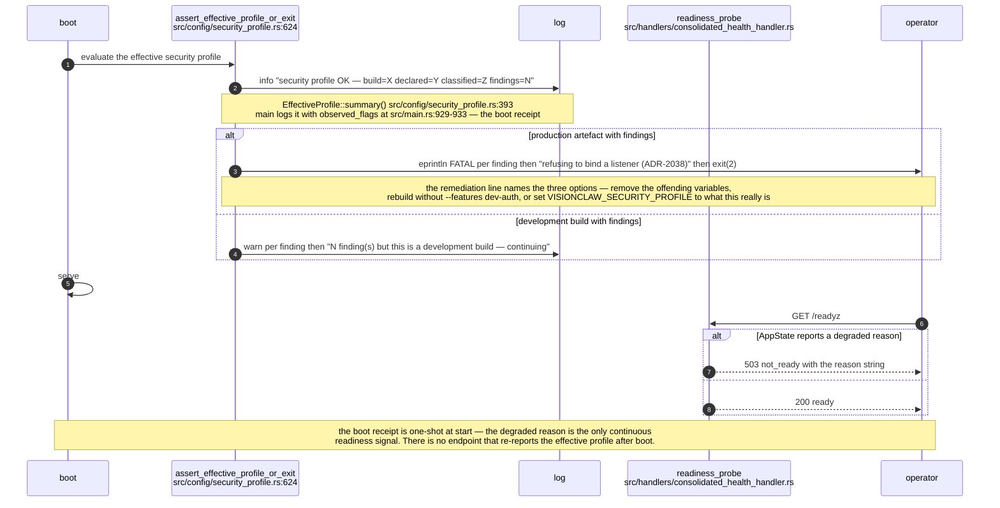

# Label vc-13

You are an independent labeller for a pre-registered experiment. Below are (1) a TOPIC: a Markdown file of Mermaid diagrams, with short prose notes, that document code, with `path:line` citations, where paths under `../project/` are in the VisionClaw repository and paths under `../project/agentbox/` are in the agentbox repository; and (2) a DIFF: one commit's changes in the visionclaw repository, restricted to the files the topic lists under `sources:`. The topic was verified against a revision of that repository at or before this commit's parent, so the diff is a change made after the topic was written.

Answer exactly one question:

> **Did this change make anything this topic states wrong or misleading?**

Judge only from the two texts below; do not look anything else up. Reply with a single JSON object and nothing else:

```json
{"verdict": "yes" | "no", "statements": ["<diagram or section id>: <the statement, quoted>", ...], "line_anchors_only": true | false, "reason": "<one or two sentences>"}
```

`statements` lists every statement in the topic (a message, node, edge, guard, label or prose claim) that the change makes wrong or misleading; it is empty when the verdict is no. `line_anchors_only` is true when the only such statements are `path:line` anchors whose cited code merely moved.

## TOPIC (docs/diagrams/visionclaw/08-observability-health-and-dev-loop.md)

````markdown
---
id: VC-08
title: Observability, liveness canaries, health composition and the dev/production build loop
area: visionclaw
governing:
  - ../project/docs/BASELINE-architecture.md
  - ../project/docs/SECURITY-profiles.md
adrs: [ADR-2008, ADR-2026, ADR-2037, ADR-2038, ADR-2049]
sources:
  - ../project/src/main.rs
  - ../project/src/telemetry/agent_telemetry.rs
  - ../project/src/handlers/metrics_handler.rs
  - ../project/src/handlers/consolidated_health_handler.rs
  - ../project/src/handlers/liveness_harness_handler.rs
  - ../project/src/services/liveness_harness.rs
  - ../project/src/services/canary_nostr_tap.rs
  - ../project/src/adapters/sqlite_canary_repository.rs
  - ../project/src/app_state.rs
  - ../project/scripts/rust-backend-wrapper.sh
  - ../project/Cargo.toml
  - ../project/scripts/lib/build-inputs.sh
  - ../project/supervisord.dev.conf
  - ../project/supervisord.production.conf
  - ../project/Dockerfile.unified
  - ../project/Dockerfile.production
  - ../project/src/config/security_profile.rs
  - ../project/crates/visionclaw-gpu/build.rs
verified_commit: 58f04f2eb272a2707737f2065f8241b931229e81
---

## VC-08.1 Health and readiness — what each probe actually asserts


## VC-08.2 KG watchdog — the self-poll that drives kg_backend_up


## VC-08.3 LivenessHarness — the canary registry and observation surface


## VC-08.4 Canary identifier register


## VC-08.5 Canary Nostr tap — the relay-side observation path


## VC-08.9 ADR-2008 dev restart loop — the timestamp-gated wrapper


## VC-08.10 ADR-2008 build-input inventory — what counts as a build input


## VC-08.11 Image builds and the dev-auth exclusion (ADR-2037)


## VC-08.12 Degraded-state and boot-receipt observability

````

## DIFF

```diff
diff --git a/Cargo.toml b/Cargo.toml
index 4532deae9..727de4d12 100644
--- a/Cargo.toml
+++ b/Cargo.toml
@@ -218,8 +218,10 @@ clap = { version = "4.5", features = ["derive"] }
 #
 # All four deps are `optional = true` and only pulled in when the
 # solid-pod-rs 0.5.0-alpha.12 — embedded Solid Pod (LDP, WAC, NIP-98, fs-backend).
+# `mrc20` brings the Blocktrails walker (`solid_pod_rs::blocktrail`) that
+# `src/web_contract` verifies trails with (rust-bitcoin's libsecp256k1).
 # JSS sidecar fully removed; all storage is in-process via FsBackend.
-solid-pod-rs = { version = "=0.5.0-alpha.12", default-features = false, optional = true, features = ["fs-backend", "memory-backend", "nip98-schnorr", "notifications", "legacy-notifications", "config-loader", "did-nostr", "did-nostr-types", "quota", "security-primitives", "rate-limit"] }
+solid-pod-rs = { version = "=0.5.0-alpha.12", default-features = false, optional = true, features = ["fs-backend", "memory-backend", "nip98-schnorr", "notifications", "legacy-notifications", "config-loader", "did-nostr", "did-nostr-types", "quota", "security-primitives", "rate-limit", "mrc20"] }
 solid-pod-rs-nostr = { version = "=0.5.0-alpha.12", default-features = false, optional = true }
 solid-pod-rs-idp = { version = "=0.5.0-alpha.12", default-features = false, optional = true }
 solid-pod-rs-server = { version = "=0.5.0-alpha.12", default-features = false, optional = true }
```
