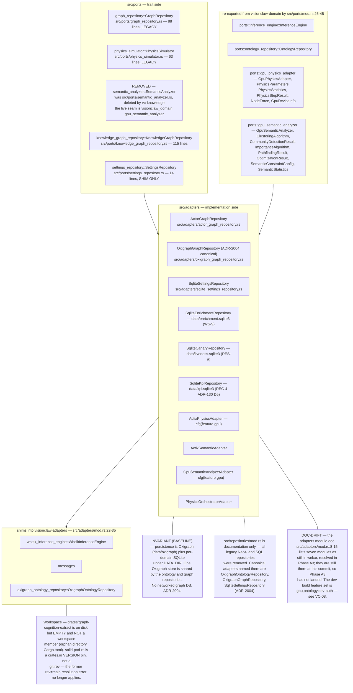
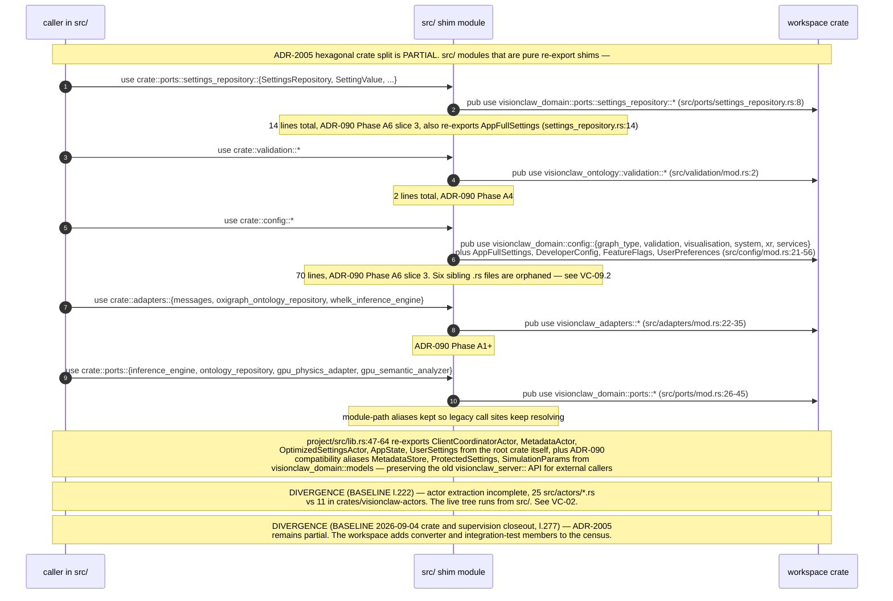
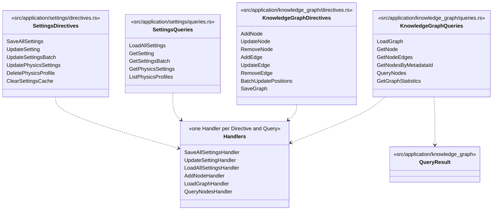
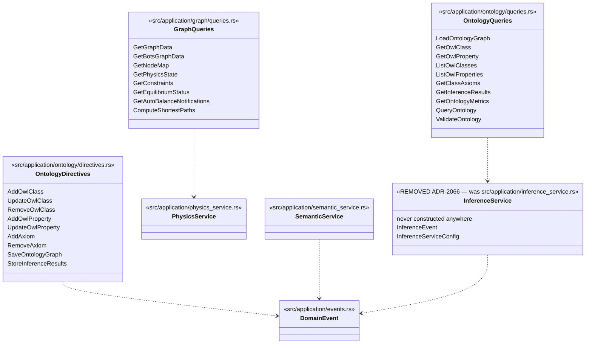
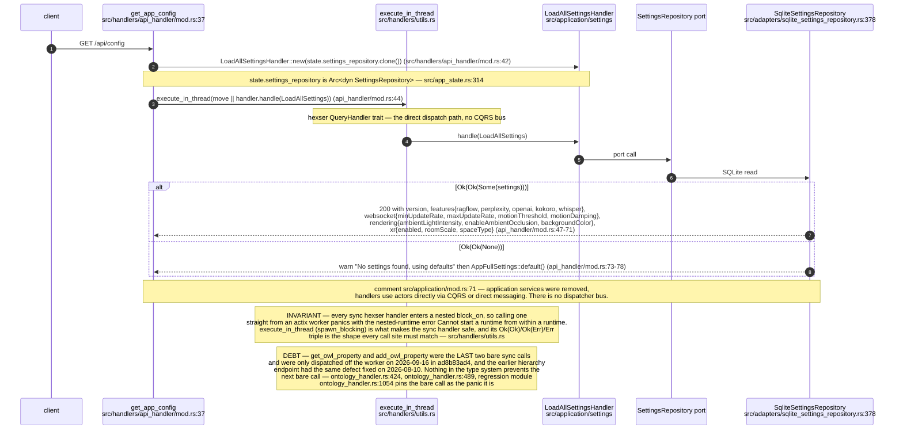
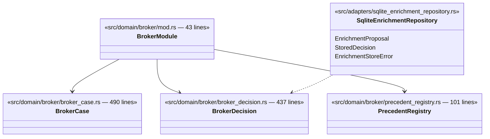
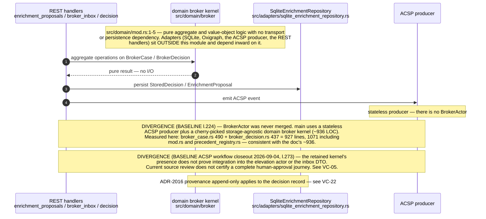
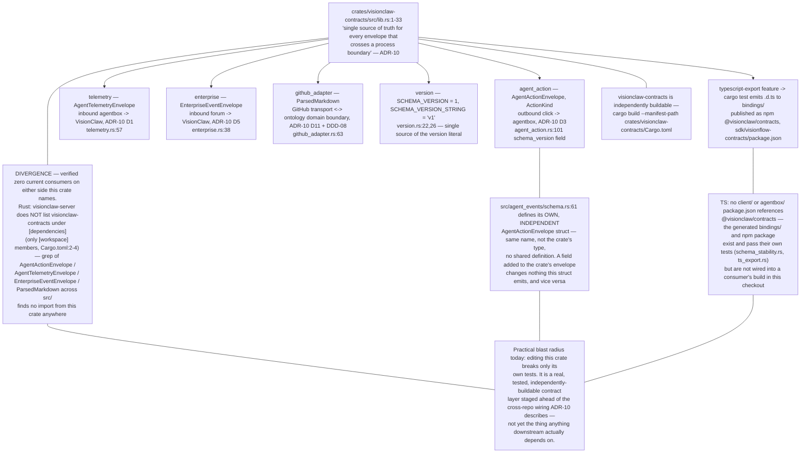
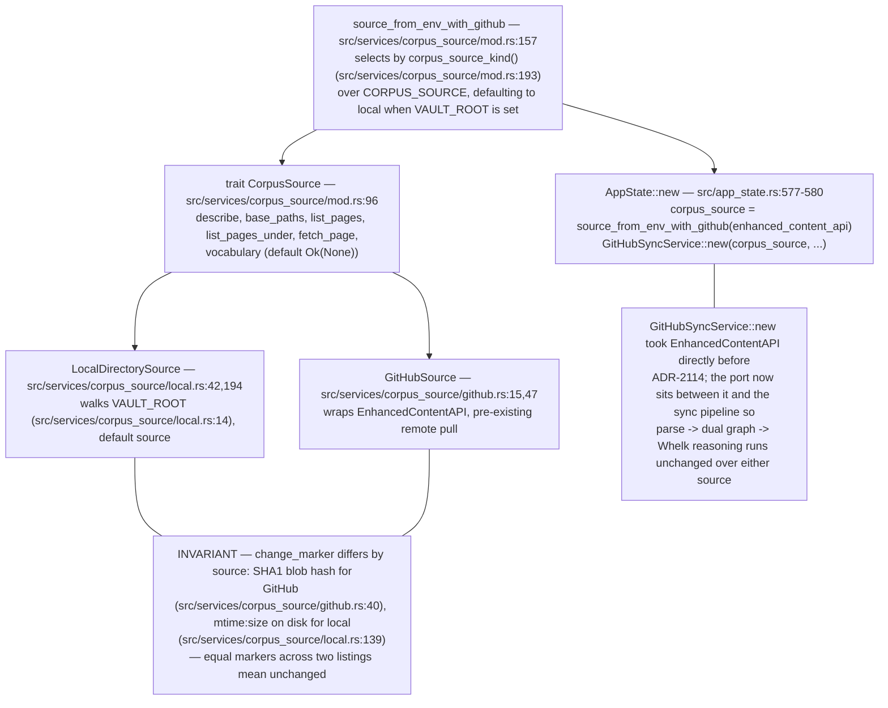

# Label vc-16

You are an independent labeller for a pre-registered experiment. Below are (1) a TOPIC: a Markdown file of Mermaid diagrams, with short prose notes, that document code, with `path:line` citations, where paths under `../project/` are in the VisionClaw repository and paths under `../project/agentbox/` are in the agentbox repository; and (2) a DIFF: one commit's changes in the visionclaw repository, restricted to the files the topic lists under `sources:`. The topic was verified against a revision of that repository at or before this commit's parent, so the diff is a change made after the topic was written.

Answer exactly one question:

> **Did this change make anything this topic states wrong or misleading?**

Judge only from the two texts below; do not look anything else up. Reply with a single JSON object and nothing else:

```json
{"verdict": "yes" | "no", "statements": ["<diagram or section id>: <the statement, quoted>", ...], "line_anchors_only": true | false, "reason": "<one or two sentences>"}
```

`statements` lists every statement in the topic (a message, node, edge, guard, label or prose claim) that the change makes wrong or misleading; it is empty when the verdict is no. `line_anchors_only` is true when the only such statements are `path:line` anchors whose cited code merely moved.

## TOPIC (docs/diagrams/visionclaw/07-hexagonal-ports-and-crates.md)

````markdown
---
id: VC-07
title: Hexagonal ports, adapters, the CQRS application layer and the crate split
area: visionclaw
governing:
  - ../project/docs/BASELINE-architecture.md
adrs: [ADR-2004, ADR-2005, ADR-2016]
sources:
  - ../project/src/lib.rs
  - ../project/src/ports/mod.rs
  - ../project/src/ports/settings_repository.rs
  - ../project/src/ports/knowledge_graph_repository.rs
  - ../project/src/ports/graph_repository.rs
  - ../project/src/ports/physics_simulator.rs
  - ../project/src/adapters/mod.rs
  - ../project/src/adapters/actor_graph_repository.rs
  - ../project/src/adapters/oxigraph_graph_repository.rs
  - ../project/src/adapters/sqlite_settings_repository.rs
  - ../project/src/adapters/sqlite_enrichment_repository.rs
  - ../project/src/adapters/sqlite_canary_repository.rs
  - ../project/src/adapters/sqlite_kpi_repository.rs
  - ../project/src/adapters/actix_physics_adapter.rs
  - ../project/src/adapters/actix_semantic_adapter.rs
  - ../project/src/adapters/gpu_semantic_analyzer.rs
  - ../project/src/adapters/physics_orchestrator_adapter.rs
  - ../project/src/application/mod.rs
  - ../project/src/application/physics_service.rs
  - ../project/src/application/semantic_service.rs
  - ../project/src/application/events.rs
  - ../project/src/domain/mod.rs
  - ../project/src/domain/broker/mod.rs
  - ../project/src/domain/broker/broker_case.rs
  - ../project/src/domain/broker/broker_decision.rs
  - ../project/src/domain/broker/precedent_registry.rs
  - ../project/src/repositories/mod.rs
  - ../project/src/validation/mod.rs
  - ../project/src/config/mod.rs
  - ../project/Cargo.toml
  - ../project/src/app_state.rs
  - ../project/src/application/graph/queries.rs
  - ../project/src/application/knowledge_graph/directives.rs
  - ../project/src/application/knowledge_graph/queries.rs
  - ../project/src/application/ontology/directives.rs
  - ../project/src/application/ontology/queries.rs
  - ../project/src/application/settings/directives.rs
  - ../project/src/application/settings/queries.rs
  - ../project/src/handlers/utils.rs
  - ../project/src/handlers/ontology_handler.rs
  - ../project/src/handlers/api_handler/mod.rs
  - ../project/crates/visionclaw-contracts/src/lib.rs
  - ../project/crates/visionclaw-contracts/src/agent_action.rs
  - ../project/crates/visionclaw-contracts/src/telemetry.rs
  - ../project/crates/visionclaw-contracts/src/enterprise.rs
  - ../project/crates/visionclaw-contracts/src/github_adapter.rs
  - ../project/crates/visionclaw-contracts/src/version.rs
  - ../project/src/agent_events/schema.rs
  - ../project/sdk/visionflow-contracts/package.json
  - ../project/src/services/corpus_source/mod.rs
  - ../project/src/services/corpus_source/local.rs
  - ../project/src/services/corpus_source/github.rs
verified_commit: 7d3ea2edb067432a57e6fe1fd951fd8254380bb8
---

## VC-07.1 The hexagon — ports, adapters and where each canonical type lives


## VC-07.2 ADR-2005 extraction state — what is actually a shim


## VC-07.5 CQRS application layer — settings and knowledge-graph domains


## VC-07.6 CQRS application layer — ontology, graph and services


## VC-07.7 A CQRS call in flight — GET /api/config


## VC-07.8 Storage-agnostic domain kernel — src/domain/broker


## VC-07.9 Broker kernel placement and the never-merged BrokerActor


## VC-07.12 `visionclaw-contracts` — the cross-boundary DTO crate and its actual blast radius


## VC-07.13 CorpusSource — the ADR-2114 ingest port

````

## DIFF

```diff
diff --git a/Cargo.toml b/Cargo.toml
index d7958add4..4532deae9 100644
--- a/Cargo.toml
+++ b/Cargo.toml
@@ -200,8 +200,8 @@ horned-functional = { version = "0.4.0" }
 clap = { version = "4.5", features = ["derive"] }
 
 # --- Solid Pod (ADR-032 M3) — embed solid-pod-rs as in-process library ---
-# Published crates.io dependency at 0.4.0-alpha.15 (superseding the former
-# alpha.11 pin). M3 (JSS sidecar removal) is COMPLETE: the JSS sidecar has been
+# Published crates.io dependency at =0.5.0-alpha.12, in lockstep with
+# nostr-rust-forum (b73ec8c), superseding the former 0.4.0-alpha.15 pin. M3 (JSS sidecar removal) is COMPLETE: the JSS sidecar has been
 # removed and Solid Pod runs in-process (ADR-032 Implemented, default-on).
 # AGPL-3.0-only — see ADR-032 §"Licence implications".
 #
@@ -217,12 +217,12 @@ clap = { version = "4.5", features = ["derive"] }
 #   - solid-pod-rs-didkey      — not in scope for VisionClaw (Nostr-first)
 #
 # All four deps are `optional = true` and only pulled in when the
-# solid-pod-rs 0.4.0-alpha.15 — embedded Solid Pod (LDP, WAC, NIP-98, fs-backend).
+# solid-pod-rs 0.5.0-alpha.12 — embedded Solid Pod (LDP, WAC, NIP-98, fs-backend).
 # JSS sidecar fully removed; all storage is in-process via FsBackend.
-solid-pod-rs = { version = "0.4.0-alpha.15", default-features = false, optional = true, features = ["fs-backend", "memory-backend", "nip98-schnorr", "notifications", "legacy-notifications", "config-loader", "did-nostr", "did-nostr-types", "quota", "security-primitives", "rate-limit"] }
-solid-pod-rs-nostr = { version = "0.4.0-alpha.15", default-features = false, optional = true }
-solid-pod-rs-idp = { version = "0.4.0-alpha.15", default-features = false, optional = true }
-solid-pod-rs-server = { version = "0.4.0-alpha.15", default-features = false, optional = true }
+solid-pod-rs = { version = "=0.5.0-alpha.12", default-features = false, optional = true, features = ["fs-backend", "memory-backend", "nip98-schnorr", "notifications", "legacy-notifications", "config-loader", "did-nostr", "did-nostr-types", "quota", "security-primitives", "rate-limit"] }
+solid-pod-rs-nostr = { version = "=0.5.0-alpha.12", default-features = false, optional = true }
+solid-pod-rs-idp = { version = "=0.5.0-alpha.12", default-features = false, optional = true }
+solid-pod-rs-server = { version = "=0.5.0-alpha.12", default-features = false, optional = true }
 
 
 [dev-dependencies]
@@ -289,6 +289,15 @@ solid-pod-embed = [
     "dep:solid-pod-rs-server",
 ]
 
+# nostr-bbs-core (via crates/vault) pins solid-pod-rs exactly, and one lockfile
+# holds a single 0.5.x solid-pod-rs. Every published nostr-bbs-core pins an
+# older alpha (1.0.0-beta.12 pins =0.5.0-alpha.10), so take the forum's
+# nostr-bbs-core at the commit that moved to =0.5.0-alpha.12 (b73ec8c). Replace
+# with a plain version pin once a nostr-bbs-core release carrying alpha.12 is
+# on crates.io.
+[patch.crates-io]
+nostr-bbs-core = { git = "https://github.com/DreamLab-AI/nostr-rust-forum", rev = "b73ec8c" }
+
 [profile.release]
 opt-level = 3
 lto = true
```
