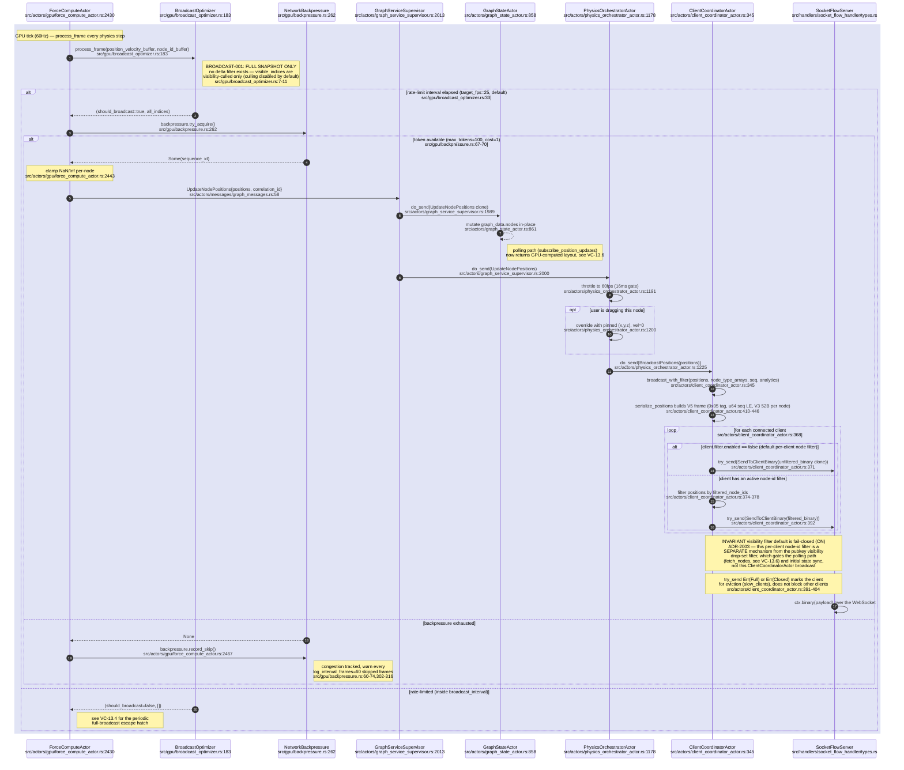
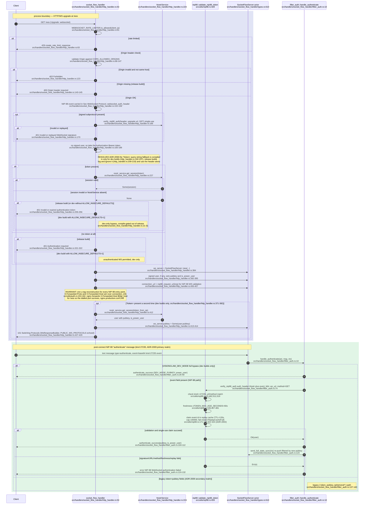
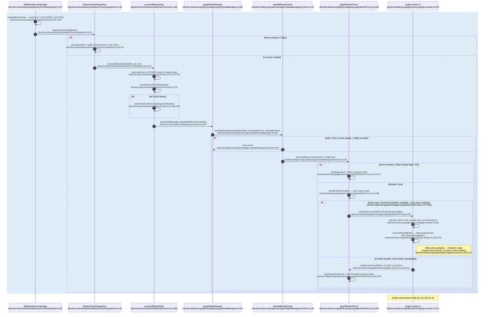
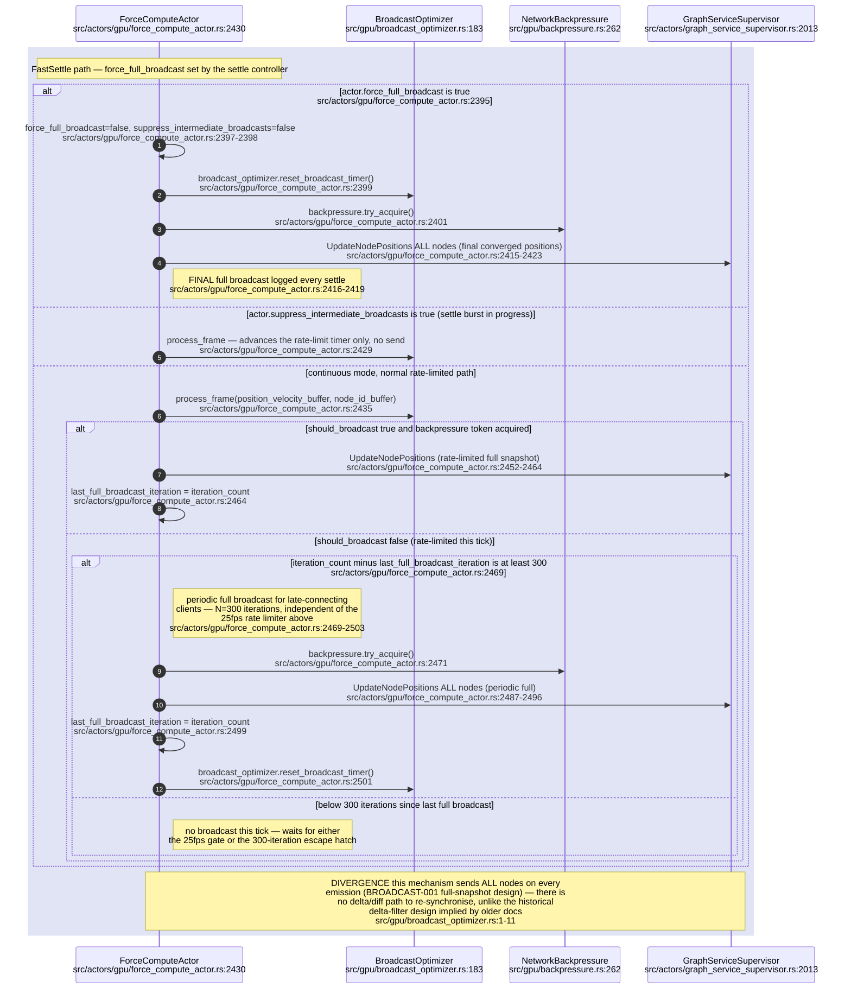
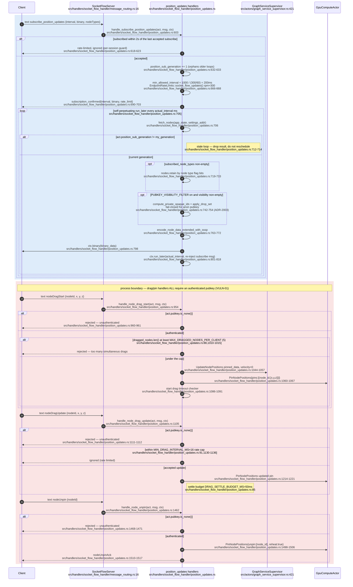
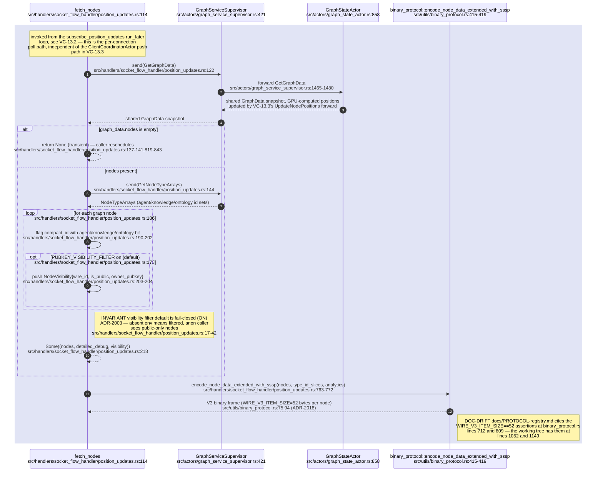
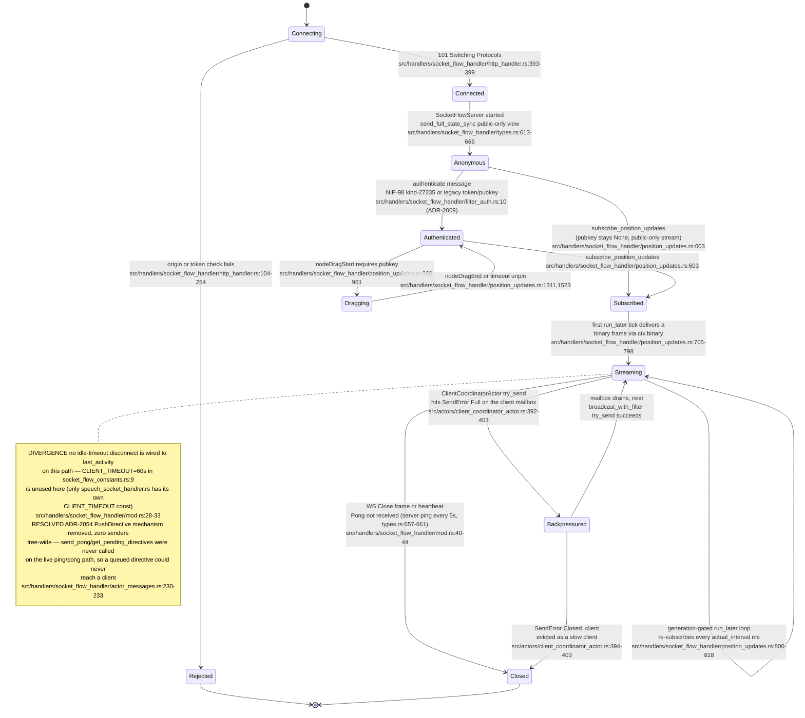

# Label vc-22

You are an independent labeller for a pre-registered experiment. Below are (1) a TOPIC: a Markdown file of Mermaid diagrams, with short prose notes, that document code, with `path:line` citations, where paths under `../project/` are in the VisionClaw repository and paths under `../project/agentbox/` are in the agentbox repository; and (2) a DIFF: one commit's changes in the visionclaw repository, restricted to the files the topic lists under `sources:`. The topic was verified against a revision of that repository at or before this commit's parent, so the diff is a change made after the topic was written.

Answer exactly one question:

> **Did this change make anything this topic states wrong or misleading?**

Judge only from the two texts below; do not look anything else up. Reply with a single JSON object and nothing else:

```json
{"verdict": "yes" | "no", "statements": ["<diagram or section id>: <the statement, quoted>", ...], "line_anchors_only": true | false, "reason": "<one or two sentences>"}
```

`statements` lists every statement in the topic (a message, node, edge, guard, label or prose claim) that the change makes wrong or misleading; it is empty when the verdict is no. `line_anchors_only` is true when the only such statements are `path:line` anchors whose cited code merely moved.

## TOPIC (docs/diagrams/visionclaw/13-broadcast-pipeline-and-websocket.md)

````markdown
---
id: VC-13
title: Position broadcast pipeline and WebSocket
area: visionclaw
governing:
  - ../project/docs/PROTOCOL-registry.md
  - ../project/docs/BASELINE-architecture.md
adrs: [ADR-2003, ADR-2018, ADR-2009, ADR-2002]
sources:
  - ../project/src/gpu/broadcast_optimizer.rs
  - ../project/src/gpu/backpressure.rs
  - ../project/src/actors/gpu/force_compute_actor.rs
  - ../project/src/actors/graph_service_supervisor.rs
  - ../project/src/actors/physics_orchestrator_actor.rs
  - ../project/src/actors/client_coordinator_actor.rs
  - ../project/src/actors/graph_state_actor.rs
  - ../project/src/actors/messages/graph_messages.rs
  - ../project/src/handlers/socket_flow_handler/mod.rs
  - ../project/src/handlers/socket_flow_handler/http_handler.rs
  - ../project/src/handlers/socket_flow_handler/types.rs
  - ../project/src/handlers/socket_flow_handler/message_routing.rs
  - ../project/src/handlers/socket_flow_handler/position_updates.rs
  - ../project/src/handlers/socket_flow_handler/filter_auth.rs
  - ../project/src/utils/nip98.rs
  - ../project/src/utils/socket_flow_constants.rs
  - ../project/src/utils/binary_protocol.rs
  - ../project/src/gpu/mod.rs
  - ../project/client/src/store/websocket/binaryFrameDispatcher.ts
  - ../project/client/src/store/websocket/binaryProtocol.ts
  - ../project/client/src/features/graph/managers/graphDataManager.ts
  - ../project/client/src/features/graph/managers/dataManager/wsClient.ts
  - ../project/client/src/features/graph/managers/graphWorkerProxy.ts
  - ../project/client/src/features/graph/workers/graph.worker.ts
  - ../project/client/src/services/BinaryWebSocketProtocol.ts
  - ../project/src/handlers/socket_flow_handler/actor_messages.rs
  - ../project/src/utils/auth.rs
  - ../project/nginx.production.conf
verified_commit: dd420fbc722a7a4a50e968162ac6c3eaff6972b2
---

## VC-13.3 GPU broadcast frame end to end


## VC-13.1 WS connect, upgrade and authentication


## VC-13.7 Client decode: binary frame to SharedArrayBuffer


## VC-13.4 Periodic full-broadcast escape hatch


## VC-13.2 Subscribe to position updates, and drag/pin control messages


## VC-13.6 Polling path — GetGraphData to binary encode


## VC-13.8 Client session lifecycle

````

## DIFF

```diff
diff --git a/src/actors/gpu/force_compute_actor.rs b/src/actors/gpu/force_compute_actor.rs
index 151e89e4f..8d7eac10d 100644
--- a/src/actors/gpu/force_compute_actor.rs
+++ b/src/actors/gpu/force_compute_actor.rs
@@ -4662,6 +4662,7 @@ mod dag_rank_tests {
         }
         for label in [
             "domain_member",
+            "chain_payment",
             "equivalent_class",
             "same_as",
             "sub_property_of",
diff --git a/src/actors/graph_service_supervisor.rs b/src/actors/graph_service_supervisor.rs
index 08965fd97..a5ac51fb0 100644
--- a/src/actors/graph_service_supervisor.rs
+++ b/src/actors/graph_service_supervisor.rs
@@ -1976,6 +1976,19 @@ impl Handler<msgs::UpdateBotsGraph> for GraphServiceSupervisor {
     }
 }
 
+/// Handler for UpdateChainPayments - delegates to GraphStateActor (S5).
+impl Handler<msgs::UpdateChainPayments> for GraphServiceSupervisor {
+    type Result = ();
+
+    fn handle(&mut self, msg: msgs::UpdateChainPayments, _ctx: &mut Self::Context) -> Self::Result {
+        if let Some(ref graph_state_addr) = self.graph_state {
+            graph_state_addr.do_send(msg);
+        } else {
+            warn!("Cannot forward UpdateChainPayments: GraphStateActor not initialized");
+        }
+    }
+}
+
 /// Handler for UpdateNodePositions - delegates to PhysicsOrchestratorActor AND GraphStateActor.
 /// PhysicsOrchestratorActor forwards to ClientCoordinatorActor for WebSocket push (BroadcastPositions).
 /// GraphStateActor stores positions so the polling path (subscribe_position_updates → GetGraphData)
diff --git a/src/actors/graph_state_actor.rs b/src/actors/graph_state_actor.rs
index 661aab340..153057eee 100644
--- a/src/actors/graph_state_actor.rs
+++ b/src/actors/graph_state_actor.rs
@@ -71,6 +71,9 @@ pub struct GraphStateActor {
     node_map: Arc<HashMap<u32, Node>>,
 
     bots_graph_data: Arc<GraphData>,
+    /// S5: latest sidechain payment projection, re-applied on every roster
+    /// update because bots node ids are reassigned each time.
+    chain_payments: Option<Arc<crate::services::chain_payments::ChainPaymentsSnapshot>>,
 
     next_node_id: std::sync::atomic::AtomicU32,
 
@@ -108,6 +111,7 @@ impl GraphStateActor {
             graph_data: Arc::new(GraphData::new()),
             node_map: Arc::new(HashMap::new()),
             bots_graph_data: Arc::new(GraphData::new()),
+            chain_payments: None,
             next_node_id: std::sync::atomic::AtomicU32::new(1),
             metadata_store: HashMap::new(),
             knowledge_node_ids: HashSet::new(),
@@ -1170,6 +1174,12 @@ impl Handler<UpdateBotsGraph> for GraphStateActor {
         let bots_graph_data_mut = Arc::make_mut(&mut self.bots_graph_data);
         bots_graph_data_mut.nodes = nodes;
         bots_graph_data_mut.edges = edges;
+        // S5: node ids are reassigned on every roster update, so the sidechain
+        // payment edges are re-resolved by did:nostr against the new nodes.
+        crate::services::chain_payments::apply_to_bots_graph(
+            bots_graph_data_mut,
+            self.chain_payments.as_deref(),
+        );
 
         // Classify all bots_graph_data nodes as agent nodes so binary protocol
         // sets bit 31 for them via NodeTypeArrays.
@@ -1186,6 +1196,24 @@ impl Handler<UpdateBotsGraph> for GraphStateActor {
     }
 }
 
+impl Handler<UpdateChainPayments> for GraphStateActor {
+    type Result = ();
+
+    fn handle(&mut self, msg: UpdateChainPayments, _ctx: &mut Context<Self>) -> Self::Result {
+        self.chain_payments = msg.snapshot;
+        let bots = Arc::make_mut(&mut self.bots_graph_data);
+        crate::services::chain_payments::apply_to_bots_graph(bots, self.chain_payments.as_deref());
+        debug!(
+            "Applied chain payments to bots graph: {} chain_payment edges",
+            bots.edges
+                .iter()
+                .filter(|e| e.edge_type.as_deref()
+                    == Some(visionclaw_domain::models::edge::CHAIN_PAYMENT_EDGE_TYPE))
+                .count()
+        );
+    }
+}
+
 impl Handler<ReloadGraphFromDatabase> for GraphStateActor {
     type Result = ResponseActFuture<Self, Result<(), String>>;
```
