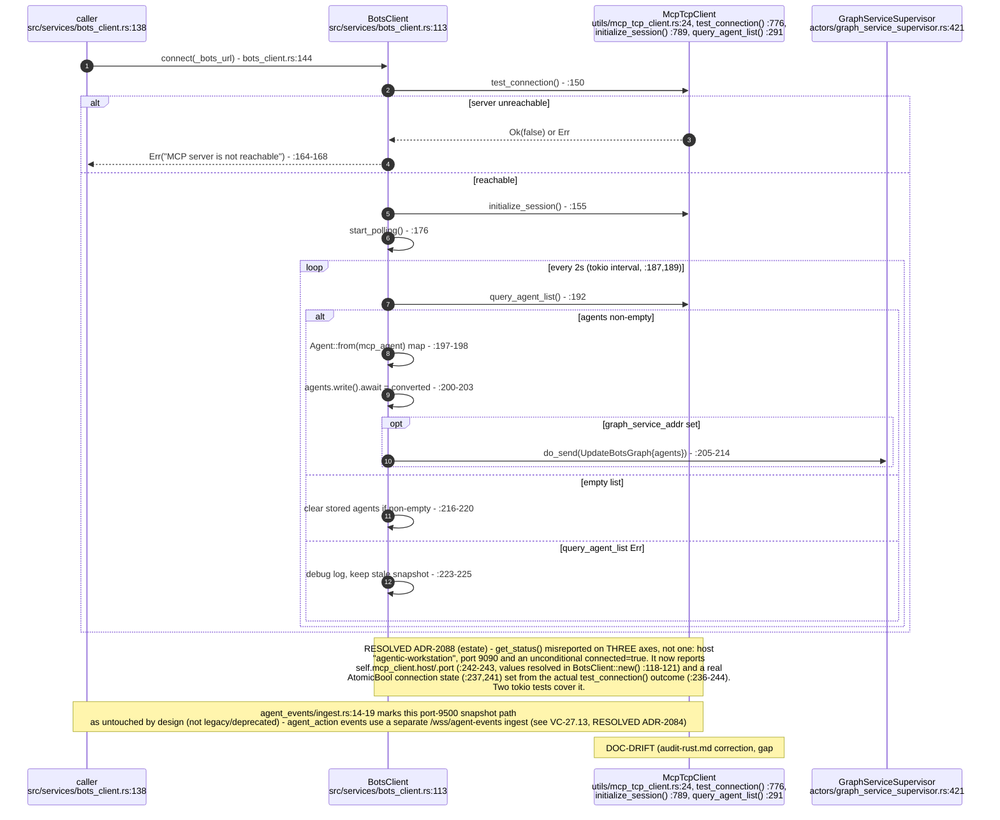
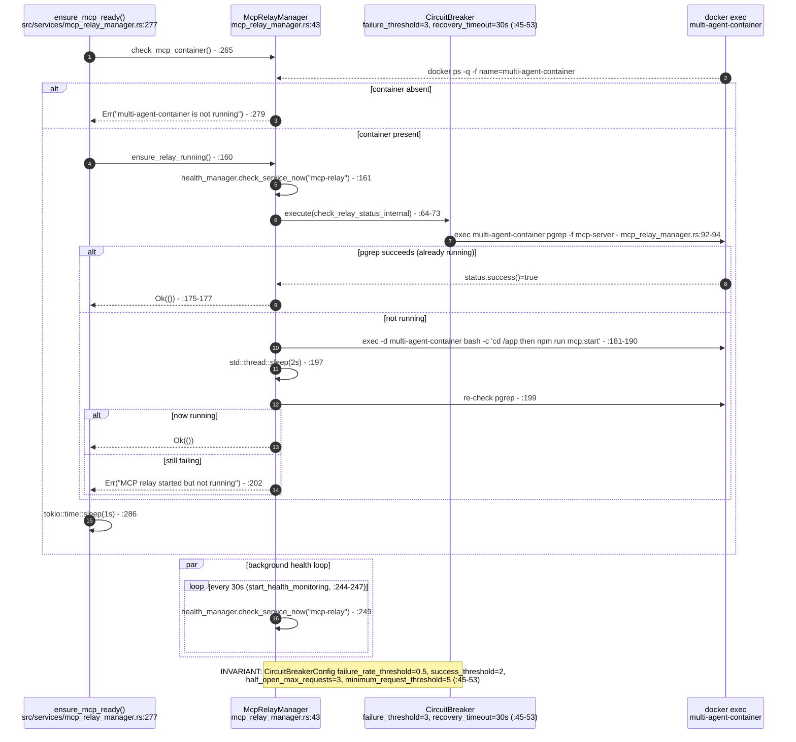
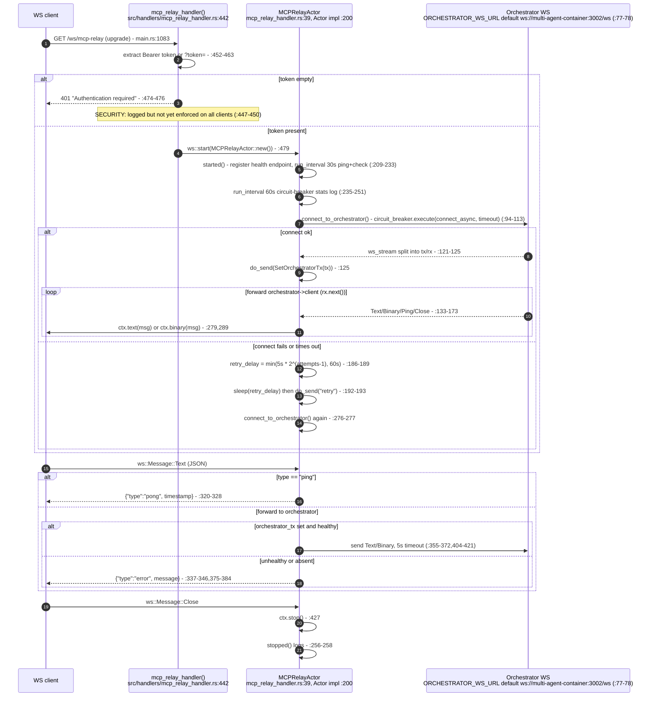
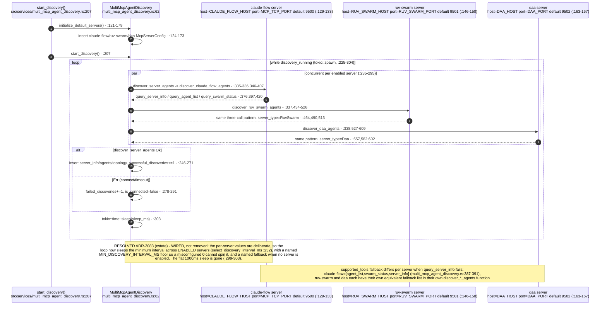
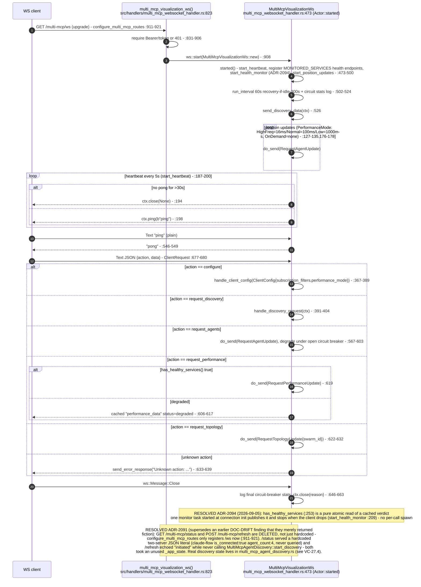
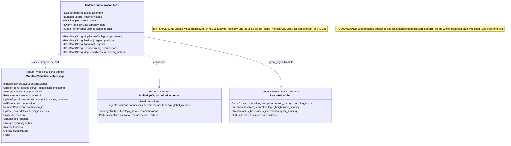
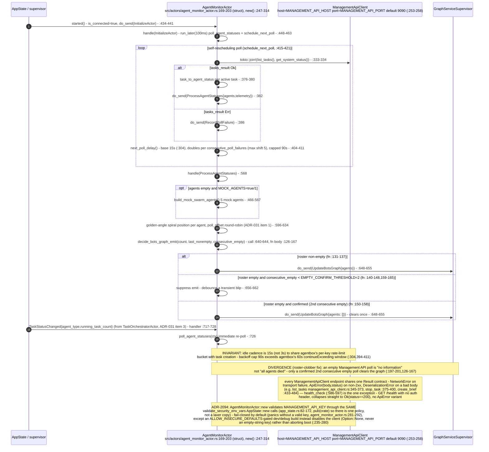
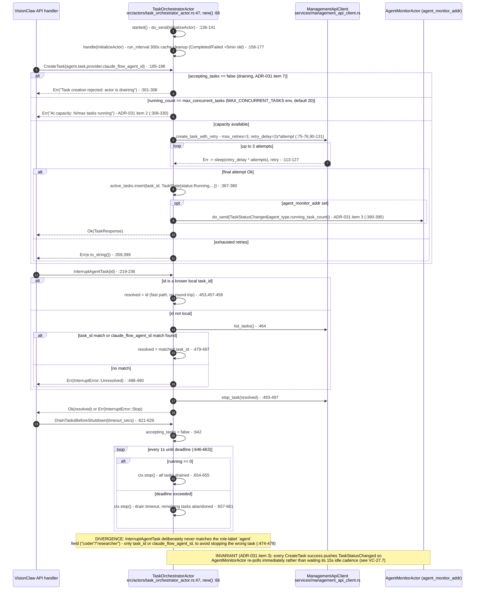
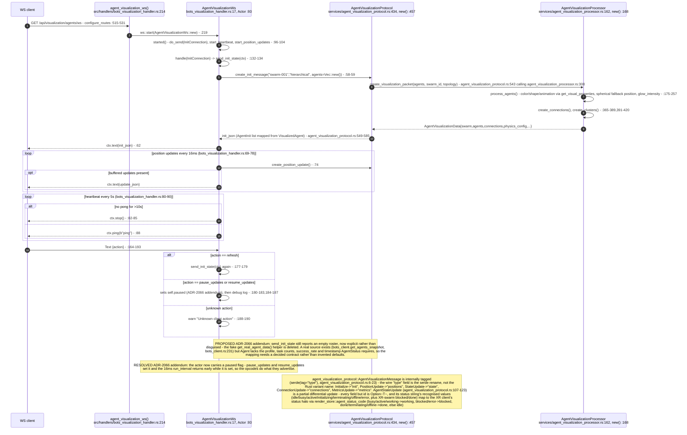
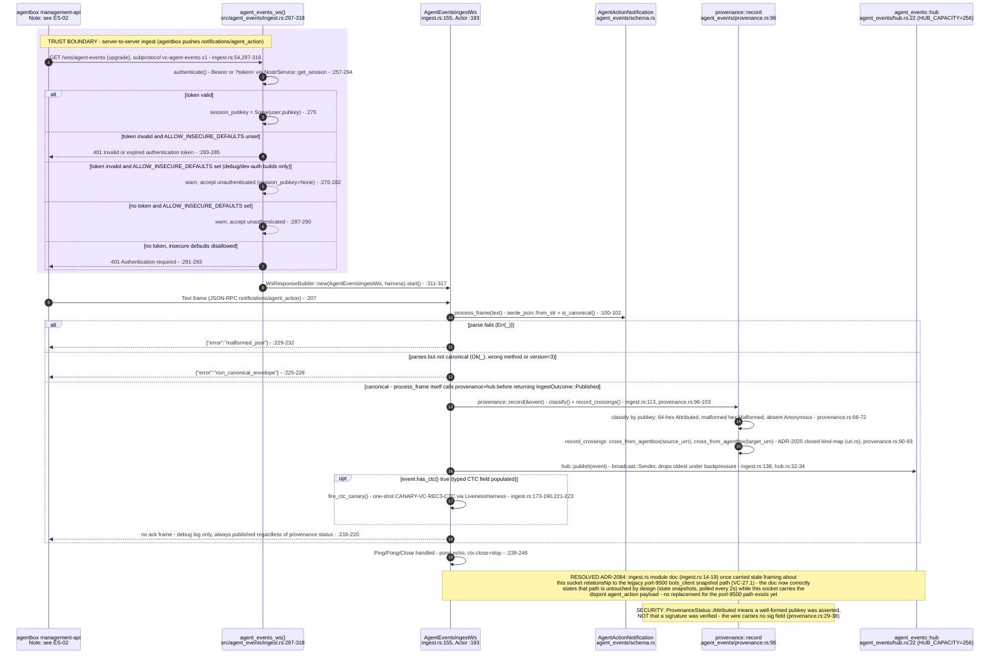

# Label vc-24

You are an independent labeller for a pre-registered experiment. Below are (1) a TOPIC: a Markdown file of Mermaid diagrams, with short prose notes, that document code, with `path:line` citations, where paths under `../project/` are in the VisionClaw repository and paths under `../project/agentbox/` are in the agentbox repository; and (2) a DIFF: one commit's changes in the visionclaw repository, restricted to the files the topic lists under `sources:`. The topic was verified against a revision of that repository at or before this commit's parent, so the diff is a change made after the topic was written.

Answer exactly one question:

> **Did this change make anything this topic states wrong or misleading?**

Judge only from the two texts below; do not look anything else up. Reply with a single JSON object and nothing else:

```json
{"verdict": "yes" | "no", "statements": ["<diagram or section id>: <the statement, quoted>", ...], "line_anchors_only": true | false, "reason": "<one or two sentences>"}
```

`statements` lists every statement in the topic (a message, node, edge, guard, label or prose claim) that the change makes wrong or misleading; it is empty when the verdict is no. `line_anchors_only` is true when the only such statements are `path:line` anchors whose cited code merely moved.

## TOPIC (docs/diagrams/visionclaw/27-agent-integration-mcp-relay.md)

````markdown
---
id: VC-27
title: Agent estate integration — MCP relay, discovery, monitoring, ingest
area: visionclaw
governing:
  - ../project/docs/BASELINE-architecture.md
  - ../project/docs/IDENTIFIER-taxonomy.md
adrs: [ADR-2025, ADR-2058, ADR-2090, ADR-2091, ADR-2094]
sources:
  - ../project/src/services/bots_client.rs
  - ../project/src/actors/graph_service_supervisor.rs
  - ../project/src/utils/mcp_tcp_client.rs
  - ../project/src/client/mod.rs
  - ../project/src/client/mcp_tcp_client.rs
  - ../project/src/services/mcp_relay_manager.rs
  - ../project/src/handlers/mcp_relay_handler.rs
  - ../project/src/services/multi_mcp_agent_discovery.rs
  - ../project/src/handlers/multi_mcp_websocket_handler.rs
  - ../project/src/actors/multi_mcp_visualization_actor.rs
  - ../project/src/actors/agent_monitor_actor.rs
  - ../project/src/actors/task_orchestrator_actor.rs
  - ../project/src/services/management_api_client.rs
  - ../project/src/app_state.rs
  - ../project/src/services/agent_visualization_protocol.rs
  - ../project/src/services/agent_visualization_processor.rs
  - ../project/src/handlers/bots_visualization_handler.rs
  - ../project/src/agent_events/ingest.rs
  - ../project/src/agent_events/hub.rs
  - ../project/src/agent_events/schema.rs
  - ../project/src/agent_events/provenance.rs
  - ../project/src/main.rs
verified_commit: {visionclaw: 58f04f2eb272a2707737f2065f8241b931229e81}
---

## VC-27.1 BotsClient — legacy `:9500` MCP-TCP poller (superseded path)



## VC-27.2 McpRelayManager — multi-agent-container lifecycle via docker exec



## VC-27.3 MCPRelayActor — `/ws/mcp-relay` session lifecycle (connect/retry/teardown)



## VC-27.4 MultiMcpAgentDiscovery — per-server agent + tool discovery



## VC-27.5 MultiMcpVisualizationWs — `/multi-mcp/ws` session and opcodes



## VC-27.6 MultiMcpVisualizationActor — message set and periodic ticks



## VC-27.7 AgentMonitorActor — Management API poll loop and debounce



## VC-27.8 TaskOrchestratorActor — CreateTask/Interrupt/Drain message handlers



## VC-27.11 AgentVisualizationProcessor — `/api/visualization/agents/ws` init/refresh



## VC-27.13 `/wss/agent-events` ingest — schema validation, hub fan-out, provenance


````

## DIFF

```diff
diff --git a/src/actors/agent_monitor_actor.rs b/src/actors/agent_monitor_actor.rs
index b11ce13bf..1f9f27d86 100644
--- a/src/actors/agent_monitor_actor.rs
+++ b/src/actors/agent_monitor_actor.rs
@@ -4,6 +4,9 @@
 //! - Polling the Management API (port 9090) for active task statuses
 //! - Converting tasks to agent nodes
 //! - Forwarding updates to GraphServiceSupervisor
+//! - Reading sidechain payments between agents (`GET /v1/chain/payments`, S5)
+//!   and projecting them onto the bots graph as `chain_payment` edges between
+//!   agent nodes keyed by verified `did:nostr` (see `services::chain_payments`)
 //!
 //! All task management is handled by TaskOrchestratorActor.
 //! This actor only monitors and displays running agents.
@@ -11,10 +14,12 @@
 use actix::prelude::*;
 use chrono::{DateTime, Utc};
 use log::{debug, error, info, warn};
-use std::collections::HashMap;
+use std::collections::{HashMap, HashSet};
+use std::sync::Arc;
 use std::time::Duration;
 
 use crate::actors::messages::*;
+use crate::services::chain_payments::{self, ChainPaymentsResponse, ChainPaymentsSnapshot};
 use crate::services::management_api_client::{ManagementApiClient, TaskInfo};
 use crate::utils::time;
 use visionclaw_domain::types::claude_flow::{
@@ -95,6 +100,31 @@ fn task_to_agent_status(task: TaskInfo, telemetry: &ContainerTelemetry) -> Agent
     }
 }
 
+/// Task id → canonical `did:nostr` for every task whose echoed DID survives the
+/// `uri::did_nostr()` round-trip. A malformed claim is dropped, so the agent node
+/// is drawn without a DID and no payment edge can attach to it.
+fn verified_task_dids(tasks: &[TaskInfo]) -> HashMap<String, String> {
+    tasks
+        .iter()
+        .filter_map(|t| {
+            let did = t
+                .did_nostr
+                .as_deref()
+                .and_then(crate::services::bots_client::validate_did_nostr)?;
+            Some((t.task_id.clone(), did))
+        })
+        .collect()
+}
+
+/// Fold one projection into the served view: replace the snapshot and add this
+/// poll's drops to the cumulative counters.
+fn record_projection(view: &mut ChainPaymentsView, snapshot: ChainPaymentsSnapshot) {
+    view.dropped_unverified_total += u64::from(snapshot.dropped_unverified);
+    view.dropped_malformed_total += u64::from(snapshot.dropped_malformed);
+    view.route_available = true;
+    view.snapshot = Some(Arc::new(snapshot));
+}
+
 /// Debounce threshold for a confirmed-empty roster (defect: agent roster clobber).
 /// An empty management-API task list is treated as *no information* on the first
 /// poll; only after this many CONSECUTIVE empty polls following a non-empty roster
@@ -200,6 +230,10 @@ pub struct AgentMonitorActor {
     /// not clobber the bots graph to zero. See `decide_bots_graph_emit`.
     last_bots_emit_nonempty: bool,
     consecutive_empty_polls: u32,
+
+    /// S5: latest sidechain payment projection plus cumulative drop counters,
+    /// served by `GetChainPaymentsView`.
+    chain_view: ChainPaymentsView,
 }
 
 /// Whether insecure defaults may relax a security failure in this build.
@@ -310,6 +344,7 @@ impl AgentMonitorActor {
             poll_offset: 0,
             last_bots_emit_nonempty: false,
             consecutive_empty_polls: 0,
+            chain_view: ChainPaymentsView::default(),
         }
     }
 
@@ -330,8 +365,11 @@ impl AgentMonitorActor {
         ctx.spawn(
             async move {
                 // Fetch tasks and system status concurrently
-                let (tasks_result, status_result) =
-                    tokio::join!(api_client.list_tasks(), api_client.get_system_status());
+                let (tasks_result, status_result, chain_result) = tokio::join!(
+                    api_client.list_tasks(),
+                    api_client.get_system_status(),
+                    api_client.get_chain_payments()
+                );
 
                 // Extract container telemetry from system status
                 let telemetry = match &status_result {
@@ -373,19 +411,35 @@ impl AgentMonitorActor {
                             active_count
                         );
 
+                        let dids = verified_task_dids(&task_list.active_tasks);
                         let agents: Vec<AgentStatus> = task_list
                             .active_tasks
                             .into_iter()
                             .map(|task| task_to_agent_status(task, &telemetry))
                             .collect();
 
-                        ctx_addr.do_send(ProcessAgentStatuses { agents, telemetry });
+                        ctx_addr.do_send(ProcessAgentStatuses {
+                            agents,
+                            telemetry,
+                            dids,
+                        });
                     }
                     Err(e) => {
                         error!("[AgentMonitorActor] Management API query failed: {}", e);
                         ctx_addr.do_send(RecordPollFailure);
                     }
                 }
+
+                // Sent after ProcessAgentStatuses so the roster update reaches
+                // the graph before the payments are matched against it.
+                match chain_result {
+                    Ok(response) => ctx_addr.do_send(ProcessChainPayments { response }),
+                    Err(e) => warn!(
+                        "[AgentMonitorActor] /v1/chain/payments read failed, keeping the \
+                         last projection: {}",
+                        e
+                    ),
+                }
             }
             .into_actor(self),
         );
@@ -426,6 +480,15 @@ impl AgentMonitorActor {
 struct ProcessAgentStatuses {
     agents: Vec<AgentStatus>,
     telemetry: ContainerTelemetry,
+    /// Task id → verified `did:nostr` (see [`verified_task_dids`]).
+    dids: HashMap<String, String>,
+}
+
+/// One read of `/v1/chain/payments`; `None` when the route is not deployed.
+#[derive(Message)]
+#[rtype(result = "()")]
+struct ProcessChainPayments {
+    response: Option<ChainPaymentsResponse>,
 }
 
 impl Actor for AgentMonitorActor {
@@ -627,8 +690,9 @@ impl Handler<ProcessAgentStatuses> for AgentMonitorActor {
                     age: Some(
                         (time::timestamp_seconds() - status.timestamp.timestamp()) as u64 * 1000,
                     ),
-                    // Local monitor snapshot carries no agentbox DID (COM-14).
-                    did_nostr: None,
+                    // The task's DID when the Management API echoes one and it
+                    // passed the uri::did_nostr() round-trip (COM-14, S5).
+                    did_nostr: msg.dids.get(&status.agent_id).cloned(),
                 }
             })
             .collect();
@@ -675,6 +739,76 @@ impl Handler<ProcessAgentStatuses> for AgentMonitorActor {
     }
 }
 
+impl Handler<ProcessChainPayments> for AgentMonitorActor {
+    type Result = ();
+
+    fn handle(&mut self, msg: ProcessChainPayments, ctx: &mut Self::Context) {
+        let Some(response) = msg.response else {
+            if self.chain_view.route_available || self.chain_view.snapshot.is_some() {
+                info!(
+                    "[AgentMonitorActor] /v1/chain/payments not deployed; clearing payment edges"
+                );
+                self.graph_service_addr
+                    .do_send(UpdateChainPayments { snapshot: None });
+            }
+            self.chain_view.route_available = false;
+            self.chain_view.snapshot = None;
+            return;
+        };
+
+        let graph = self.graph_service_addr.clone();
+        ctx.spawn(
+            async move { graph.send(GetBotsGraphData).await }
+                .into_actor(self)
+                .map(move |reply, act, _ctx| {
+                    let bots = match reply {
+                        Ok(Ok(bots)) => bots,
+                        Ok(Err(e)) => {
+                            warn!(
+                                "[AgentMonitorActor] bots graph unavailable for payments: {}",
+                                e
+                            );
+                            return;
+                        }
+                        Err(e) => {
+                            warn!("[AgentMonitorActor] bots graph mailbox error: {}", e);
+                            return;
+                        }
+                    };
+                    let verified: HashSet<String> = chain_payments::verified_agent_dids(&bots)
+                        .into_keys()
+                        .collect();
+                    match chain_payments::project(&response, &verified) {
+                        Ok(snapshot) => {
+                            if snapshot.dropped_unverified + snapshot.dropped_malformed > 0 {
+                                info!(
+                                    "[AgentMonitorActor] chain payments: {} drawn, {} dropped \
+                                     (unverified agent), {} dropped (malformed did)",
+                                    snapshot.payments.len(),
+                                    snapshot.dropped_unverified,
+                                    snapshot.dropped_malformed
+                                );
+                            }
+                            record_projection(&mut act.chain_view, snapshot);
+                            act.graph_service_addr.do_send(UpdateChainPayments {
+                                snapshot: act.chain_view.snapshot.clone(),
+                            });
+                        }
+                        Err(e) => warn!("[AgentMonitorActor] refusing chain payments: {}", e),
+                    }
+                }),
+        );
+    }
+}
+
+impl Handler<GetChainPaymentsView> for AgentMonitorActor {
+    type Result = MessageResult<GetChainPaymentsView>;
+
+    fn handle(&mut self, _msg: GetChainPaymentsView, _ctx: &mut Self::Context) -> Self::Result {
+        MessageResult(self.chain_view.clone())
+    }
+}
+
 impl Handler<RecordPollFailure> for AgentMonitorActor {
     type Result = ();
 
@@ -807,6 +941,103 @@ mod tests {
         assert_eq!(d3.next_consecutive_empty, 0);
     }
 
+    // ── S5: sidechain payments ────────────────────────────────────────────────
+
+    const DID_A: &str =
+        "did:nostr:3bf34d40533c4da9e7d23f05c47573ac302e60d26910f3f2d9fb2cca5a7caa8e";
+    const DID_B: &str =
+        "did:nostr:30d89dcc39e2a9aa35f1b0d941aa2eedd939f0949b2bb31eedfe0aee7fd20098";
+
+    fn task(id: &str, did: Option<&str>) -> TaskInfo {
+        serde_json::from_value(serde_json::json!({
+            "taskId": id, "agent": "coder", "task": "t", "provider": "p",
+            "status": "running", "startTime": 0, "duration": 0,
+            "didNostr": did,
+        }))
+        .expect("TaskInfo shape")
+    }
+
+    #[test]
+    fn task_dids_are_carried_only_when_canonical() {
+        let tasks = vec![
+            task("t-a-0000", Some(DID_A)),
+            task("t-x-0000", Some("did:nostr:not-hex")),
+            task("t-n-0000", None),
+        ];
+        let dids = verified_task_dids(&tasks);
+        assert_eq!(dids.len(), 1);
+        assert_eq!(dids["t-a-0000"], DID_A);
+    }
+
+    #[test]
+    fn task_did_accepts_the_spawn_response_spelling() {
+        let t: TaskInfo = serde_json::from_value(serde_json::json!({
+            "taskId": "t-b-0000", "agent": "coder", "task": "t", "provider": "p",
+            "status": "running", "startTime": 0, "duration": 0,
+            "did_nostr": DID_B,
+        }))
+        .unwrap();
+        assert_eq!(t.did_nostr.as_deref(), Some(DID_B));
+    }
+
+    /// Fixture payments → edges through the same path the actor runs: the
+    /// roster (as UpdateBotsGraph builds it) supplies the verified DIDs, the
+    /// projection drops and counts the rest, and the counters accumulate.
+    #[test]
+    fn fixture_payments_map_to_edges_between_verified_agent_nodes() {
+        use visionclaw_domain::models::graph::GraphData;
+        use visionclaw_domain::models::node::Node;
+        let response: ChainPaymentsResponse = serde_json::from_str(include_str!(
+            "../../tests/fixtures/sidechain/chain-payments.v1.json"
+        ))
+        .unwrap();
+
+        let mut bots = GraphData::new();
+        for (i, did) in [Some(DID_A), Some(DID_B), None].into_iter().enumerate() {
+            let mut n = Node::new_with_id(format!("task-{i}"), Some(10_000 + i as u32));
+            n.metadata.insert("is_agent".into(), "true".into());
+            if let Some(d) = did {
+                n.metadata.insert("did_nostr".into(), d.into());
+            }
+            bots.nodes.push(n);
+        }
+        let verified: HashSet<String> = chain_payments::verified_agent_dids(&bots)
+            .into_keys()
+            .collect();
+        let snapshot = chain_payments::project(&response, &verified).unwrap();
+
+        let mut view = ChainPaymentsView::default();
+        record_projection(&mut view, snapshot.clone());
+        record_projection(&mut view, snapshot);
+        assert_eq!(view.dropped_unverified_total, 2, "one per poll accumulates");
+        assert_eq!(view.dropped_malformed_total, 2);
+        assert!(view.route_available);
+
+        let snap = view.snapshot.clone().unwrap();
+        chain_payments::apply_to_bots_graph(&mut bots, Some(&snap));
+        let settled: Vec<(&str, &str)> = bots
+            .edges
+            .iter()
+            .map(|e| {
+                let md = e.metadata.as_ref().unwrap();
+                (md["txid"].get(..6).unwrap(), md["settled"].as_str())
+            })
+            .collect();
+        assert_eq!(
+            settled,
+            vec![
+                ("1cdea0", "false"),
+                ("c4ee63", "false"),
+                ("d5587b", "true"),
+                ("579eff", "true")
+            ]
+        );
+        assert!(bots
+            .edges
+            .iter()
+            .all(|e| e.source != 10_002 && e.target != 10_002));
+    }
+
     // ── ADR-2094: Management API credential is fail-closed ───────────────────
 
     /// A validated key is used verbatim, whichever build this is.
diff --git a/src/actors/graph_service_supervisor.rs b/src/actors/graph_service_supervisor.rs
index 08965fd97..a5ac51fb0 100644
--- a/src/actors/graph_service_supervisor.rs
+++ b/src/actors/graph_service_supervisor.rs
@@ -1976,6 +1976,19 @@ impl Handler<msgs::UpdateBotsGraph> for GraphServiceSupervisor {
     }
 }
 
+/// Handler for UpdateChainPayments - delegates to GraphStateActor (S5).
+impl Handler<msgs::UpdateChainPayments> for GraphServiceSupervisor {
+    type Result = ();
+
+    fn handle(&mut self, msg: msgs::UpdateChainPayments, _ctx: &mut Self::Context) -> Self::Result {
+        if let Some(ref graph_state_addr) = self.graph_state {
+            graph_state_addr.do_send(msg);
+        } else {
+            warn!("Cannot forward UpdateChainPayments: GraphStateActor not initialized");
+        }
+    }
+}
+
 /// Handler for UpdateNodePositions - delegates to PhysicsOrchestratorActor AND GraphStateActor.
 /// PhysicsOrchestratorActor forwards to ClientCoordinatorActor for WebSocket push (BroadcastPositions).
 /// GraphStateActor stores positions so the polling path (subscribe_position_updates → GetGraphData)
diff --git a/src/services/bots_client.rs b/src/services/bots_client.rs
index c3012e657..89a82aa15 100644
--- a/src/services/bots_client.rs
+++ b/src/services/bots_client.rs
@@ -52,7 +52,7 @@ pub struct Agent {
 /// `None` rather than carried onto a trusted surface (WP-1, invariant 2). This
 /// is the well-formedness gate at carry time; control of the key is proven
 /// separately by the Schnorr challenge in `nostr_identity_verifier`.
-fn validate_did_nostr(claimed: &str) -> Option<String> {
+pub(crate) fn validate_did_nostr(claimed: &str) -> Option<String> {
     match crate::uri::parse(claimed) {
         Ok(crate::uri::ParsedUri::DidNostr { pubkey }) => crate::uri::did_nostr(&pubkey)
             .ok()
diff --git a/src/services/management_api_client.rs b/src/services/management_api_client.rs
index a8f0624f7..fc85f74c2 100644
--- a/src/services/management_api_client.rs
+++ b/src/services/management_api_client.rs
@@ -91,6 +91,12 @@ pub struct TaskInfo {
     /// hazard. `None` for role-only spawns (no interruptible-by-agent-id join).
     #[serde(default)]
     pub claude_flow_agent_id: Option<String>,
+    /// The task's agent `did:nostr`, when the Management API echoes one
+    /// (`didNostr`, or `did_nostr` as on the spawn response). Unvalidated here;
+    /// the monitor carries it only after the `uri::did_nostr()` round-trip, and
+    /// sidechain payment edges attach only to agents that have one (S5).
+    #[serde(default, alias = "did_nostr")]
+    pub did_nostr: Option<String>,
 }
 
 #[derive(Debug, Clone, Serialize, Deserialize)]
@@ -372,6 +378,45 @@ impl ManagementApiClient {
         }
     }
 
+    /// Sidechain payments between agents (`GET /v1/chain/payments`, S5).
+    ///
+    /// `Ok(None)` when the route is not deployed (404), so a Management API that
+    /// predates the route is quiet rather than a poll failure. The body is the
+    /// contract in [`crate::services::chain_payments`].
+    pub async fn get_chain_payments(
+        &self,
+    ) -> Result<Option<crate::services::chain_payments::ChainPaymentsResponse>, ManagementApiError>
+    {
+        let url = format!(
+            "{}{}",
+            self.base_url,
+            crate::services::chain_payments::CHAIN_PAYMENTS_PATH
+        );
+        let response = self
+            .client
+            .get(&url)
+            .header("Authorization", format!("Bearer {}", self.api_key))
+            .send()
+            .await
+            .map_err(|e| ManagementApiError::NetworkError(e.to_string()))?;
+        let status = response.status();
+        if status == StatusCode::NOT_FOUND {
+            return Ok(None);
+        }
+        if status == StatusCode::OK {
+            return response
+                .json()
+                .await
+                .map(Some)
+                .map_err(|e| ManagementApiError::DeserializationError(e.to_string()));
+        }
+        let error_text = response
+            .text()
+            .await
+            .unwrap_or_else(|_| "Unknown error".to_string());
+        Err(ManagementApiError::ApiError(error_text, status))
+    }
+
     pub async fn stop_task(&self, task_id: &str) -> Result<(), ManagementApiError> {
         let url = format!("{}/v1/tasks/{}", self.base_url, task_id);
```
