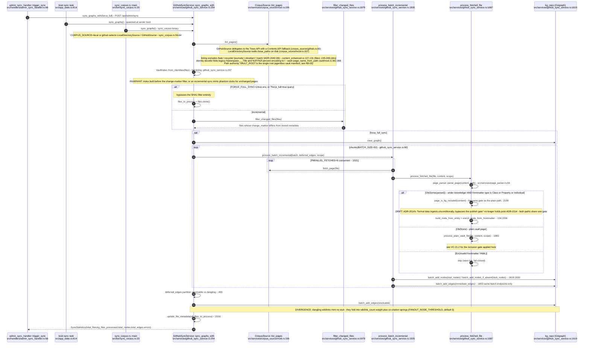
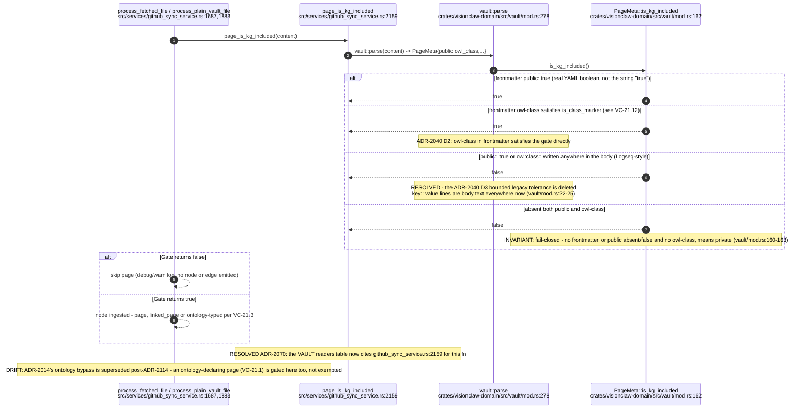
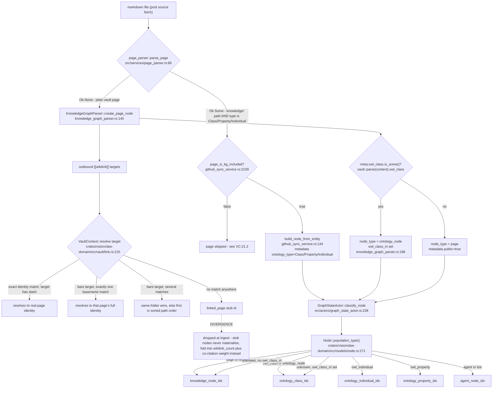
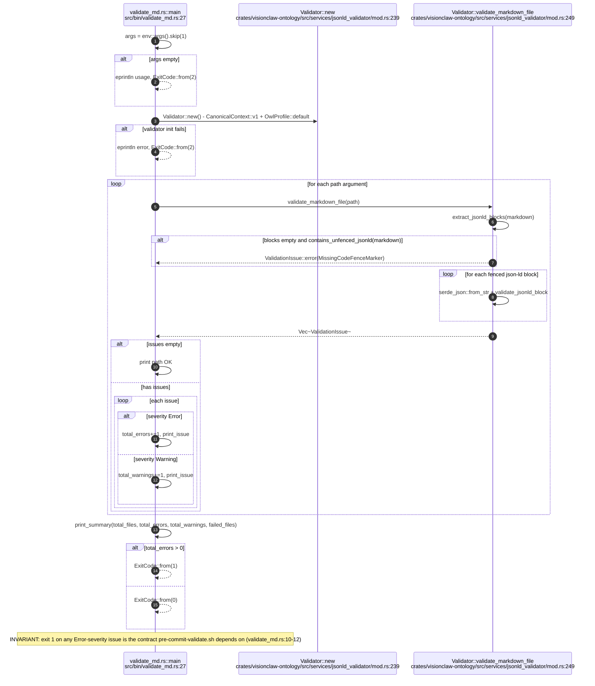
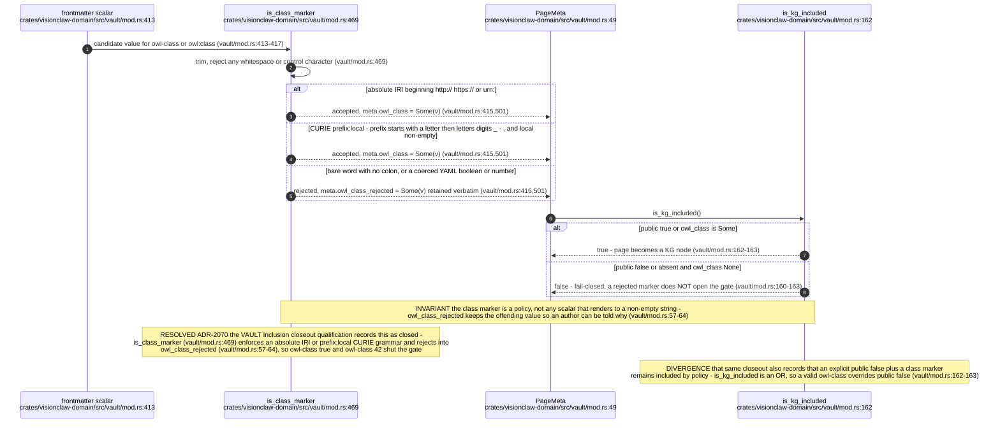

# Label vc-30

You are an independent labeller for a pre-registered experiment. Below are (1) a TOPIC: a Markdown file of Mermaid diagrams, with short prose notes, that document code, with `path:line` citations, where paths under `../project/` are in the VisionClaw repository and paths under `../project/agentbox/` are in the agentbox repository; and (2) a DIFF: one commit's changes in the visionclaw repository, restricted to the files the topic lists under `sources:`. The topic was verified against a revision of that repository at or before this commit's parent, so the diff is a change made after the topic was written.

Answer exactly one question:

> **Did this change make anything this topic states wrong or misleading?**

Judge only from the two texts below; do not look anything else up. Reply with a single JSON object and nothing else:

```json
{"verdict": "yes" | "no", "statements": ["<diagram or section id>: <the statement, quoted>", ...], "line_anchors_only": true | false, "reason": "<one or two sentences>"}
```

`statements` lists every statement in the topic (a message, node, edge, guard, label or prose claim) that the change makes wrong or misleading; it is empty when the verdict is no. `line_anchors_only` is true when the only such statements are `path:line` anchors whose cited code merely moved.

## TOPIC (docs/diagrams/visionclaw/21-corpus-ingest-and-vault.md)

````markdown
---
id: VC-21
title: Corpus ingest (CorpusSource port, ADR-2114) and the frontmatter inclusion gate
area: visionclaw
governing:
  - ../project/docs/VAULT-corpus-format.md
  - ../project/docs/BASELINE-architecture.md
adrs: [ADR-2014, ADR-2040, ADR-2070, ADR-2112, ADR-2113, ADR-2114]
sources:
  - ../project/crates/visionclaw-ontology/src/services/jsonld_validator/mod.rs
  - ../project/src/services/github_sync_service.rs
  - ../project/src/services/github/content_enhanced.rs
  - ../project/src/services/corpus_source/mod.rs
  - ../project/src/services/corpus_source/github.rs
  - ../project/src/services/corpus_source/local.rs
  - ../project/src/services/page_parser.rs
  - ../project/src/services/parsers/knowledge_graph_parser.rs
  - ../project/src/handlers/admin_sync_handler.rs
  - ../project/src/app_state.rs
  - ../project/src/bin/sync_corpus.rs
  - ../project/src/bin/validate_md.rs
  - ../project/src/actors/graph_state_actor.rs
  - ../project/crates/visionclaw-domain/src/vault/mod.rs
  - ../project/crates/visionclaw-domain/src/vault/link.rs
  - ../project/crates/visionclaw-domain/src/models/node.rs
  - ../project/scripts/pre-commit-validate.sh
verified_commit: {visionclaw: 58f04f2eb272a2707737f2065f8241b931229e81}
---

## VC-21.1 Corpus sync entry points and the CorpusSource ingest path

<!-- 2026-09-29: rewritten for ADR-2114 - GitHubSyncService now reads through the CorpusSource port (GitHubSource / LocalDirectorySource) instead of calling the GitHub API directly, and the sync_github/sync_local binaries and local_file_sync_service.rs are gone, replaced by one sync_corpus.rs binary plus a boot task and an HTTP admin endpoint that all call the same sync_graphs(_with) -->


## VC-21.2 Frontmatter inclusion gate — one gate, both ingest paths

<!-- RESOLVED 2026-09-29: the ADR-2040 D3 legacy Logseq `key:: value` tolerance is deleted - the vault/mod.rs module doc now states such lines are body text and never the publish gate -->


## VC-21.3 Node-type derivation: file to page / linked_page / ontology-typed

<!-- 2026-09-29: the JSON-LD Page/Class fence entry is gone (ADR-2112/2113); ontology classification now reads frontmatter `type: Class|Property|Individual` under knowledge/ via page_parser::parse_page. The downstream classify/population-type path (knowledge_graph_parser.rs, graph_state_actor.rs, node.rs, vault/link.rs) is unchanged and its citations still land on the same lines -->


## VC-21.6 validate_md binary (JSON-LD validator CLI)


## VC-21.12 `owl-class` class-marker grammar — the typed inclusion half

````

## DIFF

```diff
diff --git a/src/services/github_sync_service.rs b/src/services/github_sync_service.rs
index a5ca47155..966cd2029 100644
--- a/src/services/github_sync_service.rs
+++ b/src/services/github_sync_service.rs
@@ -35,7 +35,7 @@ use std::time::{Duration, Instant};
 use tokio::sync::RwLock;
 use vault_core::vocabulary::Vocabulary;
 use visionclaw_domain::models::canonical_entity::{CanonicalEntity, EntityKind};
-use visionclaw_domain::models::edge::Edge;
+use visionclaw_domain::models::edge::{Edge, DOMAIN_MEMBER_EDGE_TYPE};
 use visionclaw_domain::ports::inference_engine::InferenceEngine;
 use visionclaw_domain::ports::ontology_repository::{AxiomType, OntologyRepository, OwlAxiom};
 
@@ -916,16 +916,7 @@ impl GitHubSyncService {
             let slug = domain_slugs[idx];
             if let Some(members) = domain_members.get(slug) {
                 for &member_id in members {
-                    let edge = Edge {
-                        id: format!("domain_{}_{}", root_id, member_id),
-                        source: root_id,
-                        target: member_id,
-                        weight: 1.5,
-                        edge_type: Some("hierarchical".to_string()),
-                        owl_property_iri: None,
-                        metadata: None,
-                    };
-                    domain_edges.push(edge);
+                    domain_edges.push(domain_membership_edge(root_id, member_id));
                 }
             }
             created += 1;
@@ -2239,6 +2230,23 @@ fn enrich_node_from_frontmatter(
     }
 }
 
+/// The edge joining a synthetic domain root to one of its member pages.
+///
+/// Labelled [`DOMAIN_MEMBER_EDGE_TYPE`], not `hierarchical`: membership is not
+/// subsumption, so the DAG ranker, the fold ladder and the edge palette must
+/// not read it as a subclass edge (ADR-2035, amended 2026-10-02).
+pub(crate) fn domain_membership_edge(root_id: u32, member_id: u32) -> Edge {
+    Edge {
+        id: format!("domain_{}_{}", root_id, member_id),
+        source: root_id,
+        target: member_id,
+        weight: 1.5,
+        edge_type: Some(DOMAIN_MEMBER_EDGE_TYPE.to_string()),
+        owl_property_iri: None,
+        metadata: None,
+    }
+}
+
 /// Map a fully-expanded predicate IRI to a canonical edge-type label.
 /// Returns `""` for predicates that should not create graph edges.
 /// The label is looked up in `SEMANTIC_TYPE_REGISTRY` for force config;
```
