# Label vc-33

You are an independent labeller for a pre-registered experiment. Below are (1) a TOPIC: a Markdown file of Mermaid diagrams, with short prose notes, that document code, with `path:line` citations, where paths under `../project/` are in the VisionClaw repository and paths under `../project/agentbox/` are in the agentbox repository; and (2) a DIFF: one commit's changes in the visionclaw repository, restricted to the files the topic lists under `sources:`. The topic was verified against a revision of that repository at or before this commit's parent, so the diff is a change made after the topic was written.

Answer exactly one question:

> **Did this change make anything this topic states wrong or misleading?**

Judge only from the two texts below; do not look anything else up. Reply with a single JSON object and nothing else:

```json
{"verdict": "yes" | "no", "statements": ["<diagram or section id>: <the statement, quoted>", ...], "line_anchors_only": true | false, "reason": "<one or two sentences>"}
```

`statements` lists every statement in the topic (a message, node, edge, guard, label or prose claim) that the change makes wrong or misleading; it is empty when the verdict is no. `line_anchors_only` is true when the only such statements are `path:line` anchors whose cited code merely moved.

## TOPIC (docs/diagrams/visionclaw/36-godot-xr-client.md)

````markdown
---
id: VC-36
title: Godot + gdext OpenXR immersive client
area: visionclaw
governing:
  - ../project/docs/XR-client.md
  - ../project/docs/BASELINE-architecture.md
adrs: [ADR-2032, ADR-2033, ADR-2034, ADR-2035, ADR-2036, ADR-2039, ADR-2076, ADR-2079, ADR-2107, ADR-2108, ADR-2109]
sources:
  - ../project/docs/XR-client.md
  - ../project/docs/BASELINE-architecture.md
  - ../project/xr-client/project.godot
  - ../project/xr-client/scripts/xr_boot.gd
  - ../project/xr-client/scripts/graph_scene.gd
  - ../project/xr-client/scripts/hud.gd
  - ../project/xr-client/openxr_action_map.tres
  - ../project/xr-client/rust/src/lib.rs
  - ../project/xr-client/rust/src/binary_protocol.rs
  - ../project/xr-client/rust/src/render_store.rs
  - ../project/xr-client/rust/src/transport.rs
  - ../project/xr-client/rust/src/presence.rs
  - ../project/xr-client/rust/src/signer.rs
  - ../project/xr-client/rust/src/webrtc_audio.rs
  - ../project/xr-client/rust/perf-regression/src/main.rs
  - ../project/xr-client/rust/Cargo.toml
  - ../project/xr-client/tests/unit
  - ../project/src/actors/gpu/force_compute_actor.rs
  - ../project/src/handlers/layout_handler.rs
  - ../project/src/utils/auth.rs
  - ../project/src/main.rs
  - ../project/docker-compose.unified.yml
  - ../project/crates/visionclaw-xr-presence/benches/baseline.json
  - ../project/src/actors/presence_actor.rs
  - ../project/xr-client/rust/src/avatar_state.rs
  - ../project/xr-client/rust/src/gaze.rs
  - ../project/xr-client/rust/src/interaction.rs
  - ../project/xr-client/rust/src/lod.rs
  - ../project/xr-client/rust/src/proxemics.rs
  - ../project/xr-client/rust/src/selection.rs
  - ../project/xr-client/scripts/plane_manager.gd
  - ../project/xr-client/scripts/query_builder.gd
  - ../project/xr-client/tests/run_gut.gd
  - ../project/xr-client/scenes/GraphScene.tscn
  - ../project/xr-client/materials/node_halo.gdshader
  - ../project/xr-client/scripts/spatial_environment.gd
  - ../project/xr-client/scripts/xr_theme.gd
  - ../project/xr-client/scripts/radial_menu.gd
  - ../project/xr-client/scripts/dwell_reticle.gd
  - ../project/xr-client/scripts/agent_avatar.gd
  - ../project/xr-client/materials/spatial_floor.gdshader
  - ../project/xr-client/materials/edge_flow.gdshader
  - ../project/xr-client/tests/spatial_visual_fixture.gd
  - ../project/xr-client/tests/visual/hud_gallery.gd
  - ../project/xr-client/scripts/agent_choreography.gd
  - ../project/xr-client/scripts/agent_demo_director.gd
  - ../project/xr-client/scripts/agent_role.gd
  - ../project/xr-client/scripts/agent_effects.gd
  - ../project/xr-client/tests/unit/test_agent_choreography.gd
  - ../project/xr-client/tests/unit/test_agent_demo_director.gd
  - ../project/xr-client/tests/unit/test_write_denied_notice.gd
  - ../project/docs/adr/ADR-2108-dev-profile-arms-visionclaw-dev-mode-by-default.md
  - ../project/docs/adr/ADR-2109-xr-agent-embodiment-single-pose-owner-and-demo-via-ingest.md
verified_commit: {visionclaw: 58f04f2eb272a2707737f2065f8241b931229e81}
---

## VC-36.1 Boot — OpenXR init, capability probe, deferred scene swap (ADR-2036)

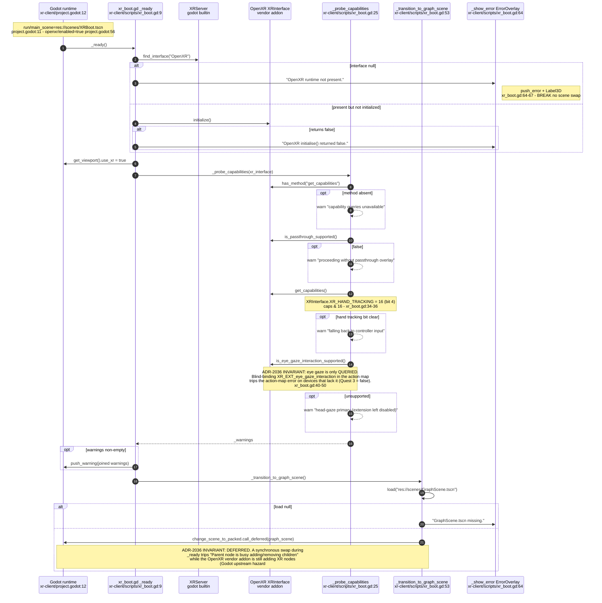
```mermaid
sequenceDiagram
    autonumber
    participant G as Godot runtime<br/>xr-client/project.godot:12
    participant B as xr_boot.gd _ready<br/>xr-client/scripts/xr_boot.gd:9
    participant XS as XRServer<br/>godot builtin
    participant XI as OpenXR XRInterface<br/>vendor addon
    participant P as _probe_capabilities<br/>xr-client/scripts/xr_boot.gd:25
    participant T as _transition_to_graph_scene<br/>xr-client/scripts/xr_boot.gd:53
    participant E as _show_error ErrorOverlay<br/>xr-client/scripts/xr_boot.gd:64

    Note over G: run/main_scene=res://scenes/XRBoot.tscn<br/>project.godot:11 - openxr/enabled=true project.godot:56
    G->>B: _ready()
    B->>XS: find_interface("OpenXR")
    alt interface null
        B->>E: "OpenXR runtime not present."
        Note right of E: push_error + Label3D<br/>xr_boot.gd:64-67 - BREAK no scene swap
    else present but not initialized
        B->>XI: initialize()
        alt returns false
            B->>E: "OpenXR initialise() returned false."
        end
    end
    B->>G: get_viewport().use_xr = true
    B->>P: _probe_capabilities(xr_interface)
    P->>XI: has_method("get_capabilities")
    opt method absent
        P-->>P: warn "capability queries unavailable"
    end
    P->>XI: is_passthrough_supported()
    opt false
        P-->>P: warn "proceeding without passthrough overlay"
    end
    P->>XI: get_capabilities()
    Note over P: XRInterface.XR_HAND_TRACKING = 16 (bit 4)<br/>caps & 16 - xr_boot.gd:34-36
    opt hand tracking bit clear
        P-->>P: warn "falling back to controller input"
    end
    P->>XI: is_eye_gaze_interaction_supported()
    Note over P,XI: ADR-2036 INVARIANT: eye gaze is only QUERIED.<br/>Blind-binding XR_EXT_eye_gaze_interaction in the action map<br/>trips the action-map error on devices that lack it (Quest 3 = false).<br/>xr_boot.gd:40-50
    opt unsupported
        P-->>P: warn "head-gaze primary (extension left disabled)"
    end
    P-->>B: _warnings
    opt warnings non-empty
        B->>G: push_warning(joined warnings)
    end
    B->>T: _transition_to_graph_scene()
    T->>T: load("res://scenes/GraphScene.tscn")
    alt load null
        T->>E: "GraphScene.tscn missing."
    else
        T->>G: change_scene_to_packed.call_deferred(graph_scene)
        Note over T,G: ADR-2036 INVARIANT: DEFERRED. A synchronous swap during<br/>_ready trips "Parent node is busy adding/removing children"<br/>while the OpenXR vendor addon is still adding XR nodes<br/>(Godot upstream hazard #113717). xr_boot.gd:58-61
    end
```

## VC-36.2 Renderer and XR project configuration (ADR-2032, forced Compatibility)

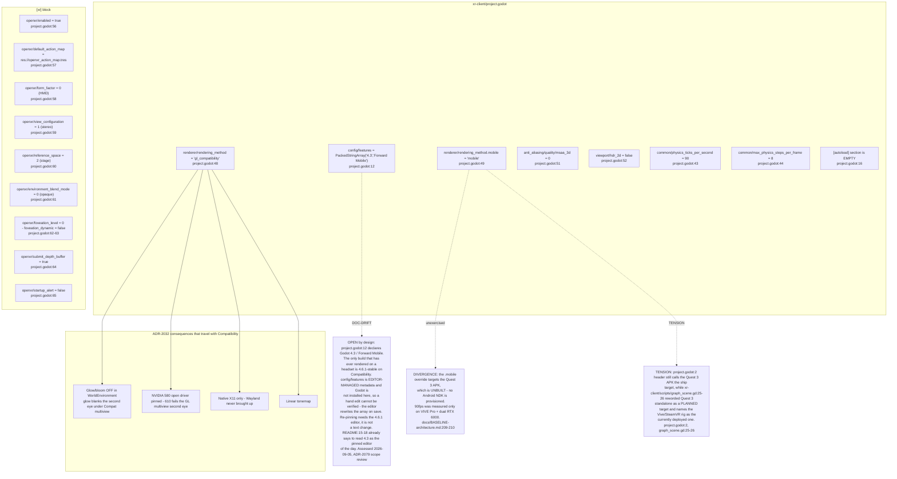
```mermaid
flowchart TB
    subgraph cfg["xr-client/project.godot"]
        A["config/features = PackedStringArray('4.3','Forward Mobile')<br/>project.godot:12"]
        R["renderer/rendering_method = 'gl_compatibility'<br/>project.godot:48"]
        RM["renderer/rendering_method.mobile = 'mobile'<br/>project.godot:49"]
        M["anti_aliasing/quality/msaa_3d = 0<br/>project.godot:51"]
        H["viewport/hdr_2d = false<br/>project.godot:52"]
        PH["common/physics_ticks_per_second = 90<br/>project.godot:43"]
        MS["common/max_physics_steps_per_frame = 8<br/>project.godot:44"]
        AL["[autoload] section is EMPTY<br/>project.godot:16"]
    end
    subgraph xr["[xr] block"]
        X1["openxr/enabled = true<br/>project.godot:56"]
        X2["openxr/default_action_map = res://openxr_action_map.tres<br/>project.godot:57"]
        X3["openxr/form_factor = 0 (HMD)<br/>project.godot:58"]
        X4["openxr/view_configuration = 1 (stereo)<br/>project.godot:59"]
        X5["openxr/reference_space = 2 (stage)<br/>project.godot:60"]
        X6["openxr/environment_blend_mode = 0 (opaque)<br/>project.godot:61"]
        X7["openxr/foveation_level = 0 - foveation_dynamic = false<br/>project.godot:62-63"]
        X8["openxr/submit_depth_buffer = true<br/>project.godot:64"]
        X9["openxr/startup_alert = false<br/>project.godot:65"]
    end
    subgraph inv["ADR-2032 consequences that travel with Compatibility"]
        C1["Glow/bloom OFF in WorldEnvironment<br/>glow blanks the second eye under Compat multiview"]
        C2["NVIDIA 580 open driver pinned - 610 fails the GL multiview second eye"]
        C3["Native X11 only - Wayland never brought up"]
        C4["Linear tonemap"]
    end
    R --> C1
    R --> C2
    R --> C3
    R --> C4
    A -. "DOC-DRIFT" .-> D1
    D1["OPEN by design: project.godot:12 declares Godot 4.3 / Forward Mobile.<br/>The only build that has ever rendered on a headset is 4.6.1-stable on<br/>Compatibility. config/features is EDITOR-MANAGED metadata and Godot is<br/>not installed here, so a hand edit cannot be verified - the editor<br/>rewrites the array on save. Re-pinning needs the 4.6.1 editor, it is not<br/>a text change. README:15-18 already says to read 4.3 as the pinned editor<br/>of the day. Assessed 2026-09-05, ADR-2079 scope review"]
    RM -. "unexercised" .-> D2
    D2["DIVERGENCE: the .mobile override targets the Quest 3 APK,<br/>which is UNBUILT - no Android NDK is provisioned.<br/>90fps was measured only on VIVE Pro + dual RTX 6000.<br/>docs/BASELINE-architecture.md:209-210"]
    RM -. "TENSION" .-> D3
    D3["TENSION: project.godot:2 header still calls the Quest 3 APK the ship<br/>target, while xr-client/scripts/graph_scene.gd:25-26 reworded Quest 3<br/>standalone as a PLANNED target and names the Vive/SteamVR rig as the<br/>currently deployed one. project.godot:2, graph_scene.gd:25-26"]
```

## VC-36.3 Transport — /wss graph socket connect, subscribe, NIP-98 authenticate

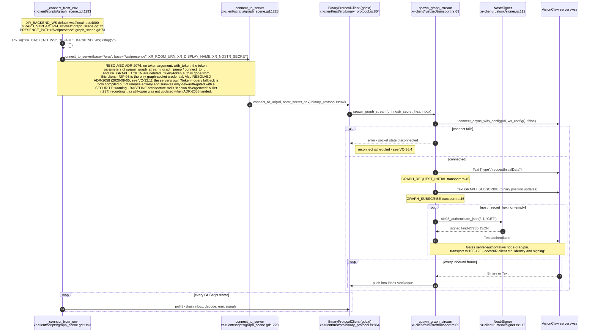
```mermaid
sequenceDiagram
    autonumber
    participant GS as _connect_from_env<br/>xr-client/scripts/graph_scene.gd:1193
    participant CT as connect_to_server<br/>xr-client/scripts/graph_scene.gd:1223
    participant BP as BinaryProtocolClient (gdext)<br/>xr-client/rust/src/binary_protocol.rs:864
    participant TR as spawn_graph_stream<br/>xr-client/rust/src/transport.rs:69
    participant SG as NostrSigner<br/>xr-client/rust/src/signer.rs:112
    participant SV as VisionClaw server /wss

    Note over GS: XR_BACKEND_WS default ws://localhost:4000<br/>GRAPH_STREAM_PATH="/wss" graph_scene.gd:72<br/>PRESENCE_PATH="/ws/presence" graph_scene.gd:73
    GS->>GS: _env_or("XR_BACKEND_WS", DEFAULT_BACKEND_WS).rstrip("/")
    GS->>CT: connect_to_server(base+"/wss", base+"/ws/presence", XR_ROOM_URN, XR_DISPLAY_NAME, XR_NOSTR_SECRET)
    Note over GS,CT: RESOLVED ADR-2076: no token argument. with_token, the token<br/>parameters of spawn_graph_stream / graph_pump / connect_to_url,<br/>and XR_GRAPH_TOKEN are deleted. Query-token auth is gone from<br/>this client - NIP-98 is the only graph-socket credential. Also RESOLVED<br/>ADR-2058 (2026-09-05, see VC-32.1): the server's own ?token= query fallback is<br/>now compiled out of release entirely and survives only dev-auth-gated with a<br/>SECURITY: warning - BASELINE-architecture.md's "Known divergences" bullet<br/>(:237) recording it as still-open was not updated when ADR-2058 landed.
    CT->>BP: connect_to_url(url, nostr_secret_hex) binary_protocol.rs:948
    BP->>TR: spawn_graph_stream(url, nostr_secret_hex, inbox)
    TR->>SV: connect_async_with_config(url, ws_config(), false)
    alt connect fails
        TR-->>BP: error - socket state disconnected
        Note right of BP: reconnect scheduled - see VC-36.4
    else connected
        TR->>SV: Text {"type":"requestInitialData"}
        Note over TR: GRAPH_REQUEST_INITIAL transport.rs:45
        TR->>SV: Text GRAPH_SUBSCRIBE (binary position updates)
        Note over TR: GRAPH_SUBSCRIBE transport.rs:46
        opt nostr_secret_hex non-empty
            TR->>SG: nip98_authenticate_json(full, "GET")
            SG-->>TR: signed kind-27235 JSON
            TR->>SV: Text authenticate
            Note over TR,SV: Gates server-authoritative node drag/pin.<br/>transport.rs:106-120 - docs/XR-client.md 'Identity and signing'
        end
        loop every inbound frame
            SV-->>TR: Binary or Text
            TR->>BP: push into inbox VecDeque
        end
    end
    loop every GDScript frame
        GS->>BP: poll() - drain inbox, decode, emit signals
    end
```

## VC-36.4 Per-socket independent reconnect backoff

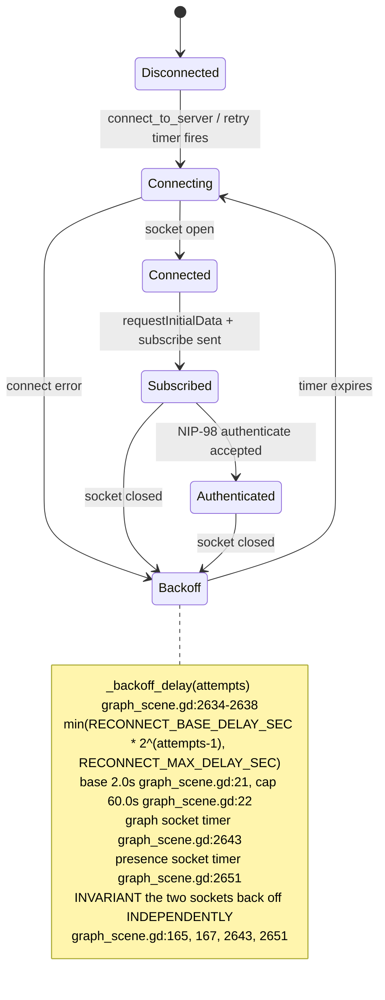
```mermaid
stateDiagram-v2
    [*] --> Disconnected
    Disconnected --> Connecting: connect_to_server / retry timer fires
    Connecting --> Connected: socket open
    Connecting --> Backoff: connect error
    Connected --> Subscribed: requestInitialData + subscribe sent
    Subscribed --> Authenticated: NIP-98 authenticate accepted
    Subscribed --> Backoff: socket closed
    Authenticated --> Backoff: socket closed
    Backoff --> Connecting: timer expires
    note right of Backoff
        _backoff_delay(attempts) graph_scene.gd:2634-2638
        min(RECONNECT_BASE_DELAY_SEC * 2^(attempts-1), RECONNECT_MAX_DELAY_SEC)
        base 2.0s graph_scene.gd:21, cap 60.0s graph_scene.gd:22
        graph socket timer graph_scene.gd:2643
        presence socket timer graph_scene.gd:2651
        INVARIANT the two sockets back off INDEPENDENTLY
        graph_scene.gd:165, 167, 2643, 2651
    end note
```

## VC-36.5 V3 / V5 wire records decoded by the gdext crate

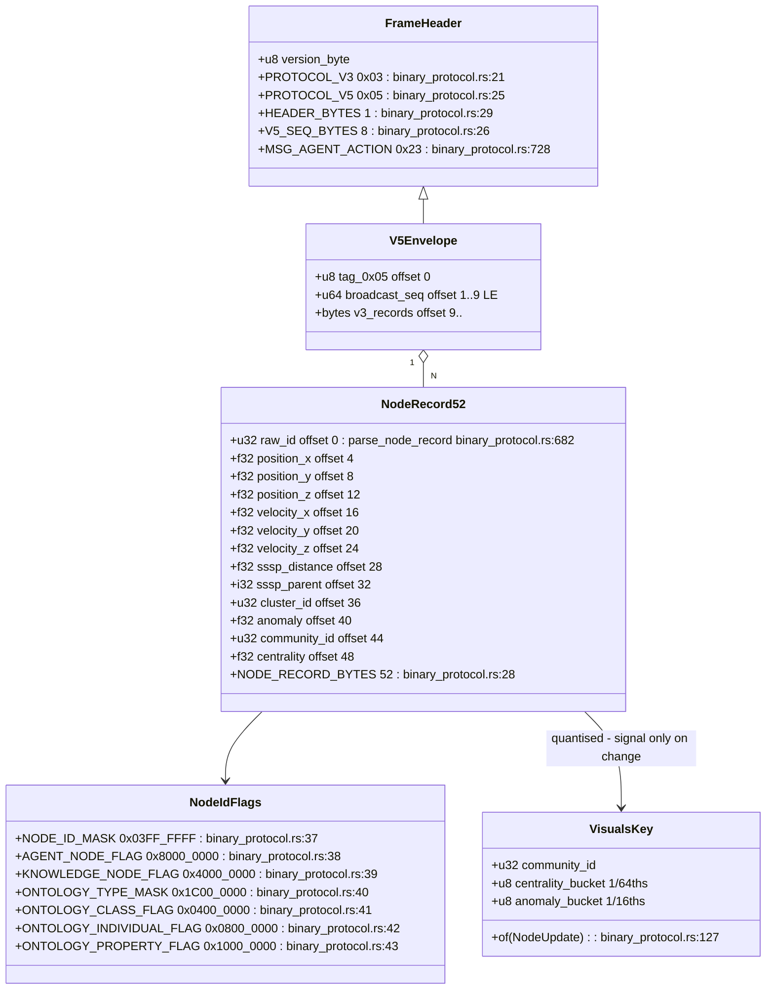
```mermaid
classDiagram
    class FrameHeader {
        +u8 version_byte
        +PROTOCOL_V3 0x03 : binary_protocol.rs:21
        +PROTOCOL_V5 0x05 : binary_protocol.rs:25
        +HEADER_BYTES 1 : binary_protocol.rs:29
        +V5_SEQ_BYTES 8 : binary_protocol.rs:26
        +MSG_AGENT_ACTION 0x23 : binary_protocol.rs:728
    }
    class V5Envelope {
        +u8 tag_0x05 offset 0
        +u64 broadcast_seq offset 1..9 LE
        +bytes v3_records offset 9..
    }
    class NodeRecord52 {
        +u32 raw_id offset 0 : parse_node_record binary_protocol.rs:682
        +f32 position_x offset 4
        +f32 position_y offset 8
        +f32 position_z offset 12
        +f32 velocity_x offset 16
        +f32 velocity_y offset 20
        +f32 velocity_z offset 24
        +f32 sssp_distance offset 28
        +i32 sssp_parent offset 32
        +u32 cluster_id offset 36
        +f32 anomaly offset 40
        +u32 community_id offset 44
        +f32 centrality offset 48
        +NODE_RECORD_BYTES 52 : binary_protocol.rs:28
    }
    class NodeIdFlags {
        +NODE_ID_MASK 0x03FF_FFFF : binary_protocol.rs:37
        +AGENT_NODE_FLAG 0x8000_0000 : binary_protocol.rs:38
        +KNOWLEDGE_NODE_FLAG 0x4000_0000 : binary_protocol.rs:39
        +ONTOLOGY_TYPE_MASK 0x1C00_0000 : binary_protocol.rs:40
        +ONTOLOGY_CLASS_FLAG 0x0400_0000 : binary_protocol.rs:41
        +ONTOLOGY_INDIVIDUAL_FLAG 0x0800_0000 : binary_protocol.rs:42
        +ONTOLOGY_PROPERTY_FLAG 0x1000_0000 : binary_protocol.rs:43
    }
    class VisualsKey {
        +u32 community_id
        +u8 centrality_bucket 1/64ths
        +u8 anomaly_bucket 1/16ths
        +of(NodeUpdate) : binary_protocol.rs:127
    }
    V5Envelope "1" o-- "N" NodeRecord52
    NodeRecord52 --> NodeIdFlags
    NodeRecord52 --> VisualsKey : quantised - signal only on change
    FrameHeader <|-- V5Envelope
```

## VC-36.6 Frame ingest — version dispatch, sanitise, freshness admission

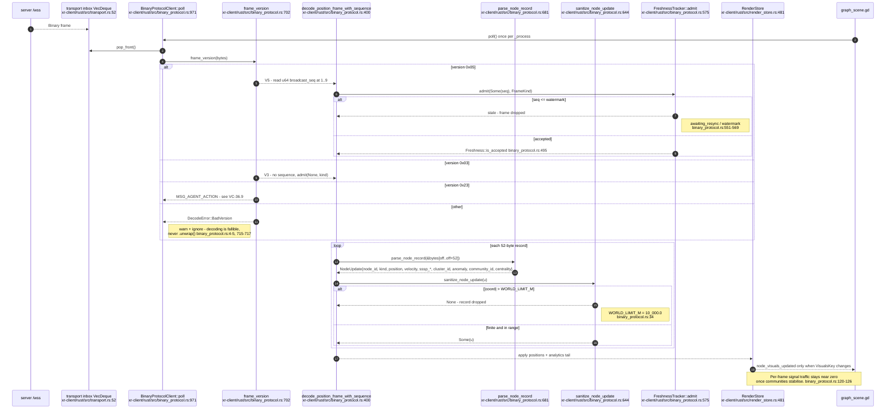
```mermaid
sequenceDiagram
    autonumber
    participant SV as server /wss
    participant IX as transport inbox VecDeque<br/>xr-client/rust/src/transport.rs:52
    participant PL as BinaryProtocolClient::poll<br/>xr-client/rust/src/binary_protocol.rs:971
    participant FV as frame_version<br/>xr-client/rust/src/binary_protocol.rs:702
    participant DP as decode_position_frame_with_sequence<br/>xr-client/rust/src/binary_protocol.rs:400
    participant PR as parse_node_record<br/>xr-client/rust/src/binary_protocol.rs:681
    participant SN as sanitize_node_update<br/>xr-client/rust/src/binary_protocol.rs:644
    participant AD as FreshnessTracker::admit<br/>xr-client/rust/src/binary_protocol.rs:575
    participant RS as RenderStore<br/>xr-client/rust/src/render_store.rs:481
    participant GD as graph_scene.gd

    SV-->>IX: Binary frame
    GD->>PL: poll() once per _process
    PL->>IX: pop_front()
    PL->>FV: frame_version(bytes)
    alt version 0x05
        FV-->>DP: V5 - read u64 broadcast_seq at 1..9
        DP->>AD: admit(Some(seq), FrameKind)
        alt seq <= watermark
            AD-->>DP: stale - frame dropped
            Note right of AD: awaiting_resync / watermark<br/>binary_protocol.rs:551-569
        else accepted
            AD-->>DP: Freshness::is_accepted binary_protocol.rs:495
        end
    else version 0x03
        FV-->>DP: V3 - no sequence, admit(None, kind)
    else version 0x23
        FV-->>PL: MSG_AGENT_ACTION - see VC-36.9
    else other
        FV-->>PL: DecodeError::BadVersion
        Note right of PL: warn + ignore - decoding is fallible,<br/>never .unwrap() binary_protocol.rs:4-5, 715-717
    end
    loop each 52-byte record
        DP->>PR: parse_node_record(&bytes[off..off+52])
        PR-->>DP: NodeUpdate{node_id, kind, position, velocity, sssp_*, cluster_id, anomaly, community_id, centrality}
        DP->>SN: sanitize_node_update(u)
        alt |coord| > WORLD_LIMIT_M
            SN-->>DP: None - record dropped
            Note right of SN: WORLD_LIMIT_M = 10_000.0<br/>binary_protocol.rs:34
        else finite and in range
            SN-->>DP: Some(u)
        end
    end
    DP-->>RS: apply positions + analytics tail
    RS-->>GD: node_visuals_updated only when VisualsKey changes
    Note over RS,GD: Per-frame signal traffic stays near zero<br/>once communities stabilise. binary_protocol.rs:120-126
```

## VC-36.7 RenderStore instance packing and the stride-16 invariant (ADR-2034)

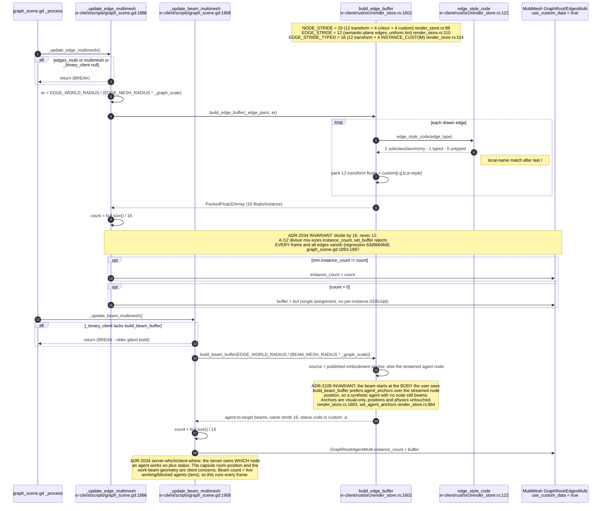
```mermaid
sequenceDiagram
    autonumber
    participant GD as graph_scene.gd _process
    participant UE as _update_edge_multimesh<br/>xr-client/scripts/graph_scene.gd:1886
    participant UB as _update_beam_multimesh<br/>xr-client/scripts/graph_scene.gd:1908
    participant RS as build_edge_buffer<br/>xr-client/rust/src/render_store.rs:1602
    participant SC as edge_style_code<br/>xr-client/rust/src/render_store.rs:122
    participant MM as MultiMesh GraphRoot/EdgesMulti<br/>use_custom_data = true

    Note over RS: NODE_STRIDE = 20 (12 transform + 4 colour + 4 custom) render_store.rs:98<br/>EDGE_STRIDE = 12 (semantic-plane edges, uniform tint) render_store.rs:110<br/>EDGE_STRIDE_TYPED = 16 (12 transform + 4 INSTANCE_CUSTOM) render_store.rs:114
    GD->>UE: _update_edge_multimesh()
    alt edges_multi or multimesh or _binary_client null
        UE-->>GD: return (BREAK)
    end
    UE->>UE: er = EDGE_WORLD_RADIUS / (EDGE_MESH_RADIUS * _graph_scale)
    UE->>RS: build_edge_buffer(_edge_pairs, er)
    loop each drawn edge
        RS->>SC: edge_style_code(edge_type)
        SC-->>RS: 2 subclass/taxonomy - 1 typed - 0 untyped
        Note right of SC: local-name match after last / # or :<br/>case-insensitive render_store.rs:116-124
        RS->>RS: pack 12 transform floats + custom[r,g,b,a=style]
    end
    RS-->>UE: PackedFloat32Array (16 floats/instance)
    UE->>UE: count = buf.size() / 16
    Note over UE,MM: ADR-2034 INVARIANT: divide by 16, never 12.<br/>A /12 divisor mis-sizes instance_count, set_buffer rejects<br/>EVERY frame and all edges vanish (regression 63d9bb9b8).<br/>graph_scene.gd:1893-1897
    opt mm.instance_count != count
        UE->>MM: instance_count = count
    end
    opt count > 0
        UE->>MM: buffer = buf (single assignment, no per-instance GDScript)
    end
    GD->>UB: _update_beam_multimesh()
    alt _binary_client lacks build_beam_buffer
        UB-->>GD: return (BREAK - older gdext build)
    end
    UB->>RS: build_beam_buffer(EDGE_WORLD_RADIUS / (BEAM_MESH_RADIUS * _graph_scale))
    RS->>RS: source = published embodiment anchor, else the streamed agent node
    Note over RS: ADR-2109 INVARIANT: the beam starts at the BODY the user sees.<br/>build_beam_buffer prefers agent_anchors over the streamed node<br/>position, so a synthetic agent with no node still beams.<br/>Anchors are visual-only, positions and physics untouched.<br/>render_store.rs:1693, set_agent_anchors render_store.rs:884
    RS-->>UB: agent-to-target beams, same stride 16, status code in custom .a
    UB->>UB: count = buf.size() / 16
    UB->>MM: GraphRoot/AgentMulti instance_count + buffer
    Note over UB: ADR-2034 server-which/client-where: the server owns WHICH node<br/>an agent works on plus status. The capsule room-position and the<br/>work-beam geometry are client concerns. Beam count = live<br/>working/blocked agents (tens), so this runs every frame.
```

## VC-36.8 HUD, shared instrument theme, eight tabs and press-mode controls

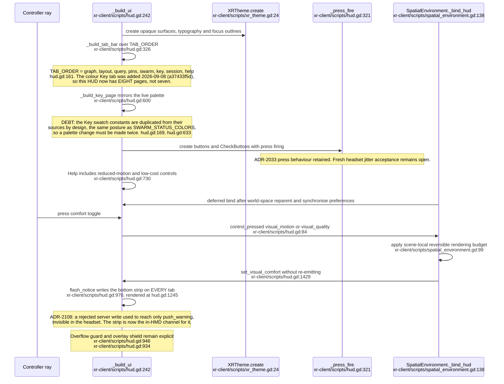
```mermaid
sequenceDiagram
    participant W as Controller ray
    participant HUD as _build_ui<br/>xr-client/scripts/hud.gd:242
    participant Theme as XRTheme.create<br/>xr-client/scripts/xr_theme.gd:24
    participant Press as _press_fire<br/>xr-client/scripts/hud.gd:321
    participant Env as SpatialEnvironment._bind_hud<br/>xr-client/scripts/spatial_environment.gd:138
    HUD->>Theme: create opaque surfaces, typography and focus outlines
    HUD->>HUD: _build_tab_bar over TAB_ORDER<br/>xr-client/scripts/hud.gd:326
    Note over HUD: TAB_ORDER = graph, layout, query, pins, swarm, key, session, help<br/>hud.gd:161. The colour Key tab was added 2026-09-08 (a37433f5d),<br/>so this HUD now has EIGHT pages, not seven.
    HUD->>HUD: _build_key_page mirrors the live palette<br/>xr-client/scripts/hud.gd:600
    Note over HUD: DEBT: the Key swatch constants are duplicated from their<br/>sources by design, the same posture as SWARM_STATUS_COLORS,<br/>so a palette change must be made twice. hud.gd:169, hud.gd:633
    HUD->>Press: create buttons and CheckButtons with press firing
    Note over Press: ADR-2033 press behaviour retained. Fresh headset jitter acceptance remains open.
    HUD->>HUD: Help includes reduced-motion and low-cost controls<br/>xr-client/scripts/hud.gd:730
    Env->>HUD: deferred bind after world-space reparent and synchronise preferences
    W->>HUD: press comfort toggle
    HUD->>Env: control_pressed visual_motion or visual_quality<br/>xr-client/scripts/hud.gd:84
    Env->>Env: apply scene-local reversible rendering budget<br/>xr-client/scripts/spatial_environment.gd:99
    Env->>HUD: set_visual_comfort without re-emitting<br/>xr-client/scripts/hud.gd:1429
    HUD->>HUD: flash_notice writes the bottom strip on EVERY tab<br/>xr-client/scripts/hud.gd:970, rendered at hud.gd:1245
    Note over HUD: ADR-2108: a rejected server write used to reach only push_warning,<br/>invisible in the headset. The strip is now the in-HMD channel for it.
    Note over HUD: Overflow guard and overlay shield remain explicit<br/>xr-client/scripts/hud.gd:946<br/>xr-client/scripts/hud.gd:934
```

## VC-36.9 Agent co-presence and the 0x23 work-beam data plane

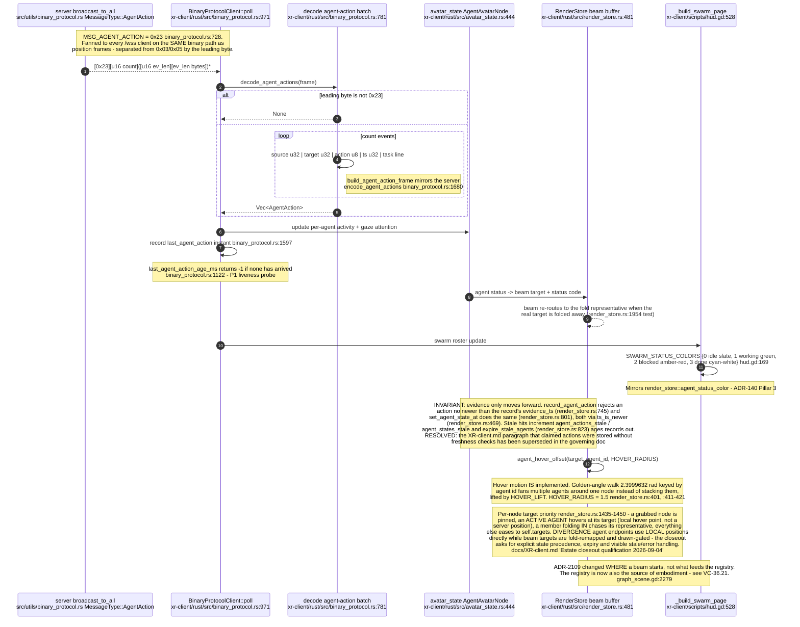
```mermaid
sequenceDiagram
    autonumber
    participant SV as server broadcast_to_all<br/>src/utils/binary_protocol.rs MessageType::AgentAction
    participant BP as BinaryProtocolClient::poll<br/>xr-client/rust/src/binary_protocol.rs:971
    participant DA as decode agent-action batch<br/>xr-client/rust/src/binary_protocol.rs:781
    participant AS as avatar_state AgentAvatarNode<br/>xr-client/rust/src/avatar_state.rs:444
    participant RS as RenderStore beam buffer<br/>xr-client/rust/src/render_store.rs:481
    participant HD as _build_swarm_page<br/>xr-client/scripts/hud.gd:528

    Note over SV,BP: MSG_AGENT_ACTION = 0x23 binary_protocol.rs:728.<br/>Fanned to every /wss client on the SAME binary path as<br/>position frames - separated from 0x03/0x05 by the leading byte.
    SV-->>BP: [0x23][u16 count]([u16 ev_len][ev_len bytes])*
    BP->>DA: decode_agent_actions(frame)
    alt leading byte is not 0x23
        DA-->>BP: None
    else
        loop count events
            DA->>DA: source u32 | target u32 | action u8 | ts u32 | task line
            Note right of DA: build_agent_action_frame mirrors the server<br/>encode_agent_actions binary_protocol.rs:1680
        end
        DA-->>BP: Vec<AgentAction>
    end
    BP->>AS: update per-agent activity + gaze attention
    BP->>BP: record last_agent_action instant binary_protocol.rs:1597
    Note over BP: last_agent_action_age_ms returns -1 if none has arrived<br/>binary_protocol.rs:1122 - P1 liveness probe
    AS->>RS: agent status -> beam target + status code
    RS-->>RS: beam re-routes to the fold representative when the<br/>real target is folded away (render_store.rs:1954 test)
    BP->>HD: swarm roster update
    HD->>HD: SWARM_STATUS_COLORS {0 idle slate, 1 working green,<br/>2 blocked amber-red, 3 done cyan-white} hud.gd:169
    Note over HD: Mirrors render_store::agent_status_color - ADR-140 Pillar 3
    Note over AS,RS: INVARIANT: evidence only moves forward. record_agent_action rejects an<br/>action no newer than the record's evidence_ts (render_store.rs:745) and<br/>set_agent_state_at does the same (render_store.rs:801), both via ts_is_newer<br/>(render_store.rs:469). Stale hits increment agent_actions_stale /<br/>agent_states_stale and expire_stale_agents (render_store.rs:823) ages records out.<br/>RESOLVED: the XR-client.md paragraph that claimed actions were stored without<br/>freshness checks has been superseded in the governing doc
    RS->>RS: agent_hover_offset(target, agent_id, HOVER_RADIUS)
    Note over RS: Hover motion IS implemented. Golden-angle walk 2.3999632 rad keyed by<br/>agent id fans multiple agents around one node instead of stacking them,<br/>lifted by HOVER_LIFT. HOVER_RADIUS = 1.5 render_store.rs:401, :411-421
    Note over RS: Per-node target priority render_store.rs:1435-1450 - a grabbed node is<br/>pinned, an ACTIVE AGENT hovers at its target (local hover point, not a<br/>server position), a member folding IN chases its representative, everything<br/>else eases to self.targets. DIVERGENCE agent endpoints use LOCAL positions<br/>directly while beam targets are fold-remapped and drawn-gated - the closeout<br/>asks for explicit state precedence, expiry and visible stale/error handling.<br/>docs/XR-client.md 'Estate closeout qualification 2026-09-04'
    Note over RS,HD: ADR-2109 changed WHERE a beam starts, not what feeds the registry.<br/>The registry is now also the source of embodiment - see VC-36.21.<br/>graph_scene.gd:2279
```

## VC-36.10 Presence socket — challenge/auth/joined handshake and 0x43 pose traffic

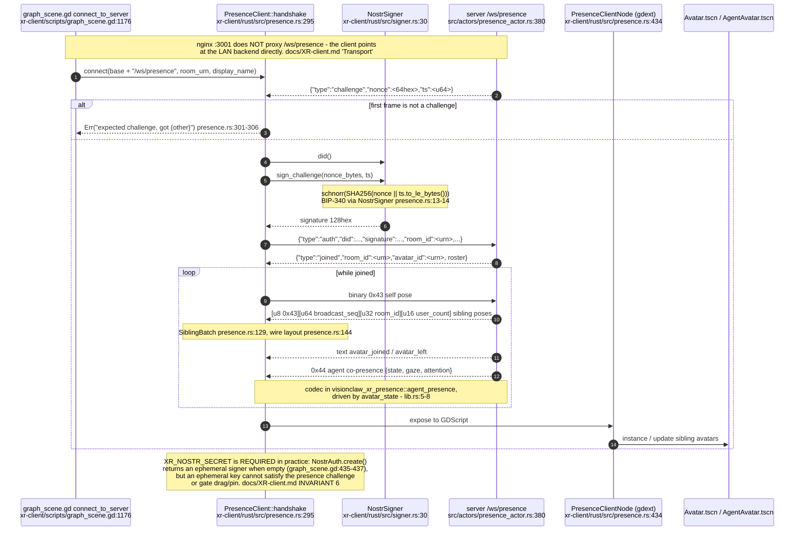
```mermaid
sequenceDiagram
    autonumber
    participant GS as graph_scene.gd connect_to_server<br/>xr-client/scripts/graph_scene.gd:1176
    participant PC as PresenceClient::handshake<br/>xr-client/rust/src/presence.rs:295
    participant SG as NostrSigner<br/>xr-client/rust/src/signer.rs:30
    participant SV as server /ws/presence<br/>src/actors/presence_actor.rs:380
    participant PN as PresenceClientNode (gdext)<br/>xr-client/rust/src/presence.rs:434
    participant AV as Avatar.tscn / AgentAvatar.tscn

    Note over GS,SV: nginx :3001 does NOT proxy /ws/presence - the client points<br/>at the LAN backend directly. docs/XR-client.md 'Transport'
    GS->>PC: connect(base + "/ws/presence", room_urn, display_name)
    SV-->>PC: {"type":"challenge","nonce":<64hex>,"ts":<u64>}
    alt first frame is not a challenge
        PC-->>GS: Err("expected challenge, got {other}") presence.rs:301-306
    else
        PC->>SG: did()
        PC->>SG: sign_challenge(nonce_bytes, ts)
        Note over SG: schnorr(SHA256(nonce || ts.to_le_bytes()))<br/>BIP-340 via NostrSigner presence.rs:13-14
        SG-->>PC: signature 128hex
        PC->>SV: {"type":"auth","did":...,"signature":...,"room_id":<urn>,...}
        SV-->>PC: {"type":"joined","room_id":<urn>,"avatar_id":<urn>, roster}
        loop while joined
            PC->>SV: binary 0x43 self pose
            SV-->>PC: [u8 0x43][u64 broadcast_seq][u32 room_id][u16 user_count] sibling poses
            Note over PC: SiblingBatch presence.rs:129, wire layout presence.rs:144
            SV-->>PC: text avatar_joined / avatar_left
            SV-->>PC: 0x44 agent co-presence {state, gaze, attention}
            Note over SV,PC: codec in visionclaw_xr_presence::agent_presence,<br/>driven by avatar_state - lib.rs:5-8
        end
        PC->>PN: expose to GDScript
        PN->>AV: instance / update sibling avatars
    end
    Note over PC: XR_NOSTR_SECRET is REQUIRED in practice: NostrAuth.create()<br/>returns an ephemeral signer when empty (graph_scene.gd:435-437),<br/>but an ephemeral key cannot satisfy the presence challenge<br/>or gate drag/pin. docs/XR-client.md INVARIANT 6
```

## VC-36.11 HTTP writes — NIP-98 per-request header and the dev-bearer fallback

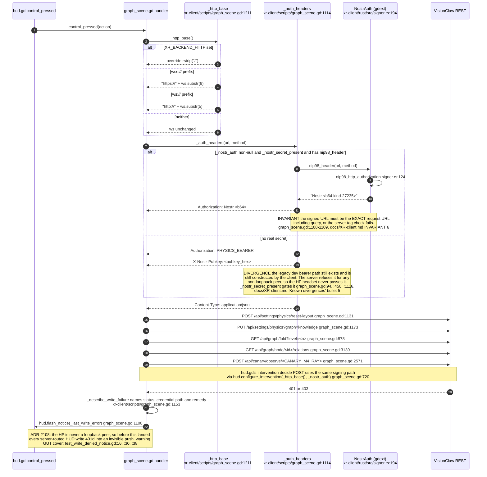
```mermaid
sequenceDiagram
    autonumber
    participant HD as hud.gd control_pressed
    participant GS as graph_scene.gd handler
    participant HB as _http_base<br/>xr-client/scripts/graph_scene.gd:1211
    participant AH as _auth_headers<br/>xr-client/scripts/graph_scene.gd:1114
    participant NA as NostrAuth (gdext)<br/>xr-client/rust/src/signer.rs:194
    participant SV as VisionClaw REST

    HD->>GS: control_pressed(action)
    GS->>HB: _http_base()
    alt XR_BACKEND_HTTP set
        HB-->>GS: override.rstrip("/")
    else wss:// prefix
        HB-->>GS: "https://" + ws.substr(6)
    else ws:// prefix
        HB-->>GS: "http://" + ws.substr(5)
    else neither
        HB-->>GS: ws unchanged
    end
    GS->>AH: _auth_headers(url, method)
    alt _nostr_auth non-null and _nostr_secret_present and has nip98_header
        AH->>NA: nip98_header(url, method)
        NA->>NA: nip98_http_authorization signer.rs:124
        NA-->>AH: "Nostr <b64 kind-27235>"
        AH-->>GS: Authorization: Nostr <b64>
        Note over AH,NA: INVARIANT the signed URL must be the EXACT request URL<br/>including query, or the server tag check fails.<br/>graph_scene.gd:1108-1109, docs/XR-client.md INVARIANT 6
    else no real secret
        AH-->>GS: Authorization: PHYSICS_BEARER
        AH-->>GS: X-Nostr-Pubkey: <pubkey_hex>
        Note over AH: DIVERGENCE the legacy dev bearer path still exists and is<br/>still constructed by the client. The server refuses it for any<br/>non-loopback peer, so the HP headset never passes it.<br/>_nostr_secret_present gates it graph_scene.gd:94, :450, :1116.<br/>docs/XR-client.md 'Known divergences' bullet 5
    end
    AH-->>GS: Content-Type: application/json
    GS->>SV: POST /api/settings/physics/reset-layout graph_scene.gd:1131
    GS->>SV: PUT /api/settings/physics?graph=knowledge graph_scene.gd:1173
    GS->>SV: GET /api/graph/fold?level=<n> graph_scene.gd:878
    GS->>SV: GET /api/graph/node/<id>/relations graph_scene.gd:3139
    GS->>SV: POST /api/canary/observe/<CANARY_M4_RAY> graph_scene.gd:2571
    Note over GS,SV: hud.gd's intervention decide POST uses the same signing path<br/>via hud.configure_intervention(_http_base(), _nostr_auth) graph_scene.gd:720
    SV-->>GS: 401 or 403
    GS->>GS: _describe_write_failure names status, credential path and remedy<br/>xr-client/scripts/graph_scene.gd:1153
    GS->>HD: hud.flash_notice(_last_write_error) graph_scene.gd:1100
    Note over GS,HD: ADR-2108: the HP is never a loopback peer, so before this landed<br/>every server-routed HUD write 401d into an invisible push_warning.<br/>GUT cover: test_write_denied_notice.gd:16, :30, :38
```

## VC-36.12 Constrained layouts and the DAG-rank label accept (ADR-2035)

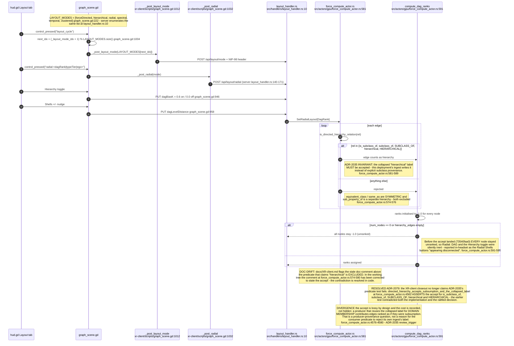
```mermaid
sequenceDiagram
    autonumber
    participant HD as hud.gd Layout tab
    participant GS as graph_scene.gd
    participant PM as _post_layout_mode<br/>xr-client/scripts/graph_scene.gd:1012
    participant PR as _post_radial<br/>xr-client/scripts/graph_scene.gd:1032
    participant LH as layout_handler.rs<br/>src/handlers/layout_handler.rs:10
    participant FC as force_compute_actor.rs<br/>src/actors/gpu/force_compute_actor.rs:581
    participant DR as compute_dag_ranks<br/>src/actors/gpu/force_compute_actor.rs:591

    Note over GS: LAYOUT_MODES = [forceDirected, hierarchical, radial, spectral,<br/>temporal, clustered] graph_scene.gd:222 - server enumerates the<br/>same list at layout_handler.rs:10
    HD->>GS: control_pressed("layout_cycle")
    GS->>GS: next_idx = (_layout_mode_idx + 1) % LAYOUT_MODES.size() graph_scene.gd:1004
    GS->>PM: _post_layout_mode(LAYOUT_MODES[next_idx])
    PM->>LH: POST /api/layout/mode + NIP-98 header
    HD->>GS: control_pressed("radial:<dagRank|typeTier|ego>")
    GS->>PR: _post_radial(mode)
    PR->>LH: POST /api/layout/radial (server layout_handler.rs:140-171)
    HD->>GS: Hierarchy toggle
    GS->>LH: PUT dagBiasK = 0.6 on / 0.0 off graph_scene.gd:946
    HD->>GS: Shells +/- nudge
    GS->>LH: PUT dagLevelDistance graph_scene.gd:958
    LH->>FC: SetRadialLayout{DagRank}
    loop each edge
        FC->>FC: is_directed_hierarchy_relation(rel)
        alt rel in {is_subclass_of, subclass_of, SUBCLASS_OF, hierarchical, HIERARCHICAL}
            FC-->>DR: edge counts as hierarchy
            Note right of FC: ADR-2035 INVARIANT: the collapsed "hierarchical" label<br/>MUST be accepted - this deployment's ingest writes it<br/>instead of explicit subclass provenance.<br/>force_compute_actor.rs:581-589
        else anything else
            FC-->>DR: rejected
            Note right of FC: equivalent_class / same_as are SYMMETRIC and<br/>sub_property_of is a separate hierarchy - both excluded<br/>force_compute_actor.rs:574-576
        end
    end
    DR->>DR: ranks initialised to -1.0 for every node
    alt num_nodes == 0 or hierarchy_edges empty
        DR-->>LH: all nodes stay -1.0 (unranked)
        Note right of DR: Before the accept landed (73540faa0) EVERY node stayed<br/>unranked, so Radial: DAG and the Hierarchy toggle were<br/>silently inert - reported in-headset as the Radial Shells<br/>buttons "appearing disconnected". force_compute_actor.rs:591-595
    else
        DR-->>LH: ranks assigned
    end
    Note over FC: DOC-DRIFT: docs/XR-client.md flags the stale doc-comment above<br/>the predicate that claims "hierarchical" is EXCLUDED. In the working<br/>tree the comment at force_compute_actor.rs:574-580 has been corrected<br/>to state the accept - the contradiction is resolved in code.
    Note over DR: RESOLVED ADR-2079: the XR-client closeout no longer claims ADR-2035's<br/>predicate test fails. directed_hierarchy_accepts_subsumption_and_the_collapsed_label<br/>at force_compute_actor.rs:4562 ASSERTS the accept for is_subclass_of,<br/>subclass_of, SUBCLASS_OF, hierarchical and HIERARCHICAL - the earlier<br/>test contradicted both the implementation and the ratified decision.
    Note over FC,DR: DIVERGENCE the accept is lossy by design and the cost is recorded,<br/>not hidden: a producer that reuses the collapsed label for DOMAIN<br/>MEMBERSHIP contributes edges ranked as if they were subsumption.<br/>That is a producer-provenance question, not a reason for the<br/>consumer predicate to reject its own ingest's label.<br/>force_compute_actor.rs:4576-4580 - ADR-2035 review_trigger
```

## VC-36.13 gdext class surface (GDScript composes, Rust owns the wire)


```mermaid
classDiagram
    class VisionclawXrExtension {
        <<gdextension>>
        on_level_init(InitLevel) : lib.rs:46
        init_tracing at InitLevel::Scene : lib.rs:56
    }
    class BinaryProtocolClient {
        base RefCounted : binary_protocol.rs:864
        poll()
        build_edge_buffer(pairs, radius)
        build_beam_buffer(radius)
        last_agent_action_age_ms() : binary_protocol.rs:1120
    }
    class PresenceClientNode {
        base RefCounted : presence.rs:434
        handshake challenge-auth-joined
        0x43 pose - 0x44 agent co-presence
    }
    class NostrAuth {
        base RefCounted : signer.rs:194
        from_secret_hex(hex) : signer.rs:30
        generate() ephemeral : signer.rs:50
        nip98_authenticate_json(url, method) : signer.rs:112
        nip98_http_authorization(url, method) : signer.rs:124
    }
    class XrInteraction {
        base RefCounted : interaction.rs:118
        hand ray cast + pinch detection
        HandRay:24 TargetCandidate:32 RaycastHit:38
    }
    class GazeTracker {
        base RefCounted : gaze.rs:211
        GazeResolver:111 OneEuroFilter:45
        degrades eye-gaze to head when unsupported
    }
    class SelectionArbiterNode {
        base RefCounted : selection.rs:407
        three-resolver arbiter selection.rs:236
        DwellCharger:121 SelectionConfig:81
    }
    class ProxemicsSolver {
        base RefCounted : proxemics.rs:195
        Hall's-zones arc solver
    }
    class AgentAvatarNode {
        base RefCounted : avatar_state.rs:444
        per-agent activity + gaze attention
    }
    class LodPolicy {
        base RefCounted : lod.rs:169
        distance-bucket LOD
    }
    class SpatialVoiceRouter {
        base RefCounted : webrtc_audio.rs:140
        SpatialVoiceRouterCore:39
        ListenerTransform:26 VoiceTrackState:33
    }
    class RenderStore {
        plain struct : render_store.rs:481
        NODE_STRIDE 20 - EDGE_STRIDE 12 - EDGE_STRIDE_TYPED 16
    }
    VisionclawXrExtension --> BinaryProtocolClient
    VisionclawXrExtension --> PresenceClientNode
    VisionclawXrExtension --> NostrAuth
    VisionclawXrExtension --> XrInteraction
    VisionclawXrExtension --> GazeTracker
    VisionclawXrExtension --> SelectionArbiterNode
    VisionclawXrExtension --> ProxemicsSolver
    VisionclawXrExtension --> AgentAvatarNode
    VisionclawXrExtension --> LodPolicy
    VisionclawXrExtension --> SpatialVoiceRouter
    BinaryProtocolClient --> RenderStore
    PresenceClientNode --> NostrAuth
    SpatialVoiceRouter --> AgentAvatarNode
```

## VC-36.14 OpenXR action map and input bindings

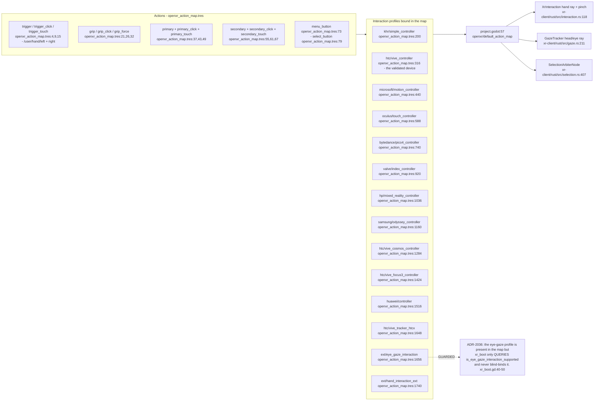
```mermaid
flowchart LR
    subgraph acts["Actions - openxr_action_map.tres"]
        A1["trigger / trigger_click / trigger_touch<br/>openxr_action_map.tres:4,9,15 - /user/hand/left + right"]
        A2["grip / grip_click / grip_force<br/>openxr_action_map.tres:21,26,32"]
        A3["primary + primary_click + primary_touch<br/>openxr_action_map.tres:37,43,49"]
        A4["secondary + secondary_click + secondary_touch<br/>openxr_action_map.tres:55,61,67"]
        A5["menu_button openxr_action_map.tres:73 - select_button openxr_action_map.tres:79"]
    end
    subgraph prof["Interaction profiles bound in the map"]
        P1["khr/simple_controller openxr_action_map.tres:200"]
        P2["htc/vive_controller openxr_action_map.tres:316 - the validated device"]
        P3["microsoft/motion_controller openxr_action_map.tres:440"]
        P4["oculus/touch_controller openxr_action_map.tres:588"]
        P5["bytedance/pico4_controller openxr_action_map.tres:740"]
        P6["valve/index_controller openxr_action_map.tres:920"]
        P7["hp/mixed_reality_controller openxr_action_map.tres:1036"]
        P8["samsung/odyssey_controller openxr_action_map.tres:1160"]
        P9["htc/vive_cosmos_controller openxr_action_map.tres:1284"]
        P10["htc/vive_focus3_controller openxr_action_map.tres:1424"]
        P11["huawei/controller openxr_action_map.tres:1516"]
        P12["htc/vive_tracker_htcx openxr_action_map.tres:1648"]
        P13["ext/eye_gaze_interaction openxr_action_map.tres:1656"]
        P14["ext/hand_interaction_ext openxr_action_map.tres:1740"]
    end
    acts --> prof
    prof --> XI["project.godot:57<br/>openxr/default_action_map"]
    P13 -. "GUARDED" .-> EG["ADR-2036: the eye-gaze profile is present in the map but<br/>xr_boot only QUERIES is_eye_gaze_interaction_supported<br/>and never blind-binds it. xr_boot.gd:40-50"]
    XI --> XR["XrInteraction hand ray + pinch<br/>xr-client/rust/src/interaction.rs:118"]
    XI --> GZ["GazeTracker head/eye ray<br/>xr-client/rust/src/gaze.rs:211"]
    XI --> SA["SelectionArbiterNode<br/>xr-client/rust/src/selection.rs:407"]
```

## VC-36.15 VISIONCLAW_DEV_MODE LAN bypass from the headset's perspective (ADR-2039, ADR-2108)

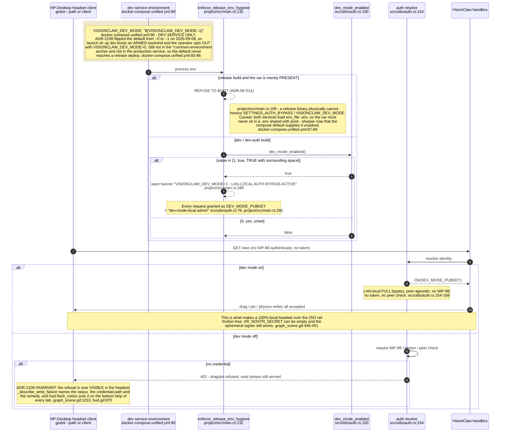
```mermaid
sequenceDiagram
    autonumber
    participant HP as HP-Desktop headset client<br/>godot --path xr-client
    participant CO as dev service environment<br/>docker-compose.unified.yml:90
    participant MN as enforce_release_env_hygiene<br/>project/src/main.rs:132
    participant DM as dev_mode_enabled<br/>src/utils/auth.rs:100
    participant AU as auth resolve<br/>src/utils/auth.rs:154
    participant SV as VisionClaw handlers

    rect rgb(240, 232, 210)
        Note over CO: VISIONCLAW_DEV_MODE: "${VISIONCLAW_DEV_MODE:-1}"<br/>docker-compose.unified.yml:90 - DEV SERVICE ONLY.<br/>ADR-2108 flipped the default from :-0 to :-1 on 2026-09-08, so<br/>launch.sh up dev boots an ARMED backend and the operator opts OUT<br/>with VISIONCLAW_DEV_MODE=0. Still not in the *common-environment<br/>anchor and not in the production service, so the default never<br/>reaches a release deploy. docker-compose.unified.yml:83-86
    end
    CO->>MN: process env
    alt release build and the var is merely PRESENT
        MN-->>MN: REFUSE TO BOOT (ADR-06 D11)
        Note right of MN: project/src/main.rs:109 - a release binary physically cannot<br/>honour SETTINGS_AUTH_BYPASS / VISIONCLAW_DEV_MODE.<br/>Caveat: both services load env_file .env, so the var must<br/>never sit in a .env shared with prod - sharper now that the<br/>compose default supplies it unasked.<br/>docker-compose.unified.yml:87-89
    else dev / dev-auth build
        MN->>DM: dev_mode_enabled()
        alt value in {1, true, TRUE with surrounding space}
            DM-->>MN: true
            MN-->>MN: warn banner "VISIONCLAW_DEV_MODE=1 - LAN-LOCAL AUTH BYPASS ACTIVE"<br/>project/src/main.rs:288
            Note over MN: Every request granted as DEV_MODE_PUBKEY<br/>= "dev-mode-local-admin" src/utils/auth.rs:79, project/src/main.rs:291
        else 0, yes, unset
            DM-->>MN: false
        end
    end
    HP->>SV: GET /wss (no NIP-98 authenticate, no token)
    SV->>AU: resolve identity
    alt dev mode on
        AU-->>SV: Ok(DEV_MODE_PUBKEY)
        Note over AU: LAN-local FULL bypass, peer-agnostic: no NIP-98,<br/>no token, no peer check. src/utils/auth.rs:154-169
        SV-->>HP: drag / pin / physics writes all accepted
        Note over HP,SV: This is what makes a 100%-local headset over the 25G rail<br/>friction-free: XR_NOSTR_SECRET can be empty and the<br/>ephemeral signer still works. graph_scene.gd:446-451
    else dev mode off
        AU->>AU: require NIP-98 / bearer / peer check
        alt no credential
            AU-->>HP: 401 - drag/pin refused, read stream still served
            Note over HP: ADR-2108 INVARIANT: the refusal is now VISIBLE in the headset.<br/>_describe_write_failure names the status, the credential path and<br/>the remedy, and hud.flash_notice puts it on the bottom strip of<br/>every tab. graph_scene.gd:1153, hud.gd:970
        end
    end
```

## VC-36.16 Deploy ceremony and the perf-regression gate

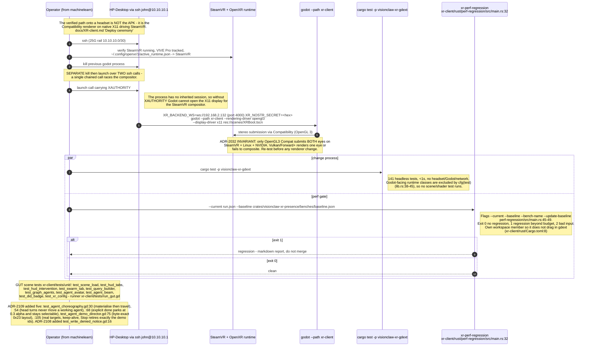
```mermaid
sequenceDiagram
    autonumber
    participant OP as Operator (from machinelearn)
    participant HP as HP-Desktop via ssh john@10.10.10.1
    participant SVR as SteamVR + OpenXR runtime
    participant GD as godot --path xr-client
    participant CT as cargo test -p visionclaw-xr-gdext
    participant PR as xr-perf-regression<br/>xr-client/rust/perf-regression/src/main.rs:32

    Note over OP,HP: The verified path onto a headset is NOT the APK - it is the<br/>Compatibility renderer on native X11 driving SteamVR.<br/>docs/XR-client.md 'Deploy ceremony'
    OP->>HP: ssh (25G rail 10.10.10.0/30)
    OP->>SVR: verify SteamVR running, VIVE Pro tracked,<br/>~/.config/openxr/1/active_runtime.json -> SteamVR
    OP->>HP: kill previous godot process
    Note over OP,HP: SEPARATE kill then launch over TWO ssh calls -<br/>a single chained call races the compositor.
    OP->>HP: launch call carrying XAUTHORITY
    Note right of HP: The process has no inherited session, so without<br/>XAUTHORITY Godot cannot open the X11 display for<br/>the SteamVR compositor.
    HP->>GD: XR_BACKEND_WS=ws://192.168.2.132 (port 4000) XR_NOSTR_SECRET=<hex><br/>godot --path xr-client --rendering-driver opengl3<br/>--display-driver x11 res://scenes/XRBoot.tscn
    GD->>SVR: stereo submission via Compatibility (OpenGL 3)
    Note over GD,SVR: ADR-2032 INVARIANT: only OpenGL3 Compat submits BOTH eyes on<br/>SteamVR + Linux + NVIDIA. Vulkan/Forward+ renders one eye or<br/>fails to composite. Re-test before any renderer change.
    par change process
        OP->>CT: cargo test -p visionclaw-xr-gdext
        Note right of CT: 141 headless tests, <1s, no headset/Godot/network.<br/>Godot-facing runtime classes are excluded by cfg(test)<br/>(lib.rs:38-45), so no scene/shader test runs.
    and perf gate
        OP->>PR: --current run.json --baseline crates/visionclaw-xr-presence/benches/baseline.json
        Note right of PR: Flags --current --baseline --bench-name --update-baseline<br/>perf-regression/src/main.rs:45-49.<br/>Exit 0 no regression, 1 regression beyond budget, 2 bad input.<br/>Own workspace member so it does not drag in gdext<br/>(xr-client/rust/Cargo.toml:8)
        alt exit 1
            PR-->>OP: regression - markdown report, do not merge
        else exit 0
            PR-->>OP: clean
        end
    end
    Note over OP: GUT scene tests xr-client/tests/unit/: test_scene_load, test_hud_tabs,<br/>test_hud_intervention, test_swarm_tab, test_query_builder,<br/>test_graph_agents, test_agent_avatar, test_agent_beam,<br/>test_did_badge, test_xr_config - runner xr-client/tests/run_gut.gd
    Note over OP: ADR-2109 added five: test_agent_choreography.gd:30 (materialise then travel),<br/>:54 (head turns never move a working agent), :68 (explicit done parks at<br/>0.3 alpha and stays selectable), test_agent_demo_director.gd:75 (byte-exact<br/>0x23 layout), :105 (real targets, keep-alive, Stop retires exactly the demo<br/>ids). ADR-2108 added test_write_denied_notice.gd:16
```

## VC-36.18 Query builder execute path — implemented, acceptance open

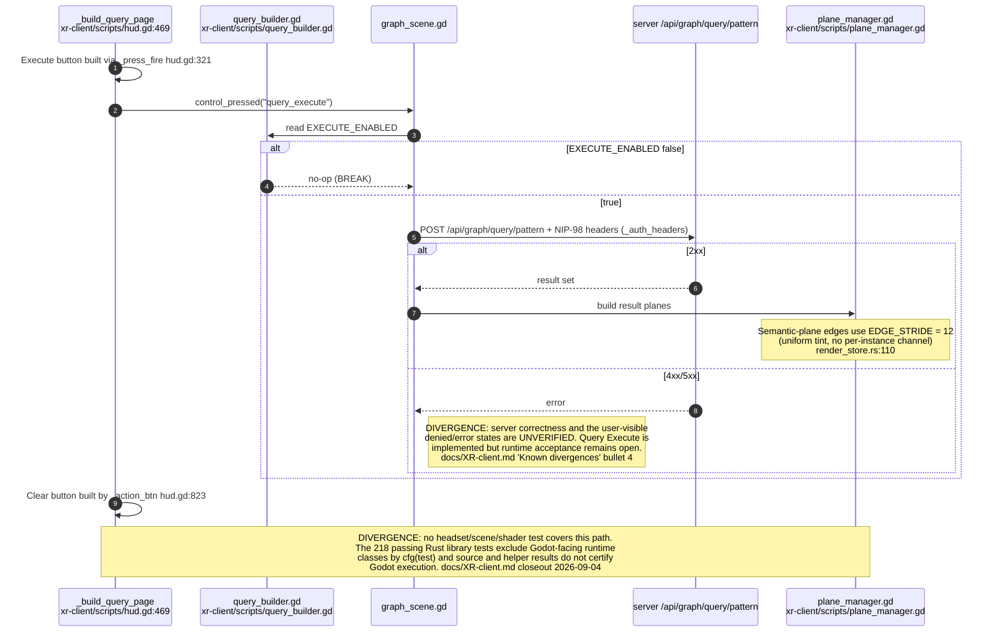
```mermaid
sequenceDiagram
    autonumber
    participant HD as _build_query_page<br/>xr-client/scripts/hud.gd:469
    participant QB as query_builder.gd<br/>xr-client/scripts/query_builder.gd
    participant GS as graph_scene.gd
    participant SV as server /api/graph/query/pattern
    participant PM as plane_manager.gd<br/>xr-client/scripts/plane_manager.gd

    HD->>HD: Execute button built via _press_fire hud.gd:321
    HD->>GS: control_pressed("query_execute")
    GS->>QB: read EXECUTE_ENABLED
    alt EXECUTE_ENABLED false
        QB-->>GS: no-op (BREAK)
    else true
        GS->>SV: POST /api/graph/query/pattern + NIP-98 headers (_auth_headers)
        alt 2xx
            SV-->>GS: result set
            GS->>PM: build result planes
            Note over PM: Semantic-plane edges use EDGE_STRIDE = 12<br/>(uniform tint, no per-instance channel)<br/>render_store.rs:110
        else 4xx/5xx
            SV-->>GS: error
            Note right of GS: DIVERGENCE: server correctness and the user-visible<br/>denied/error states are UNVERIFIED. Query Execute is<br/>implemented but runtime acceptance remains open.<br/>docs/XR-client.md 'Known divergences' bullet 4
        end
    end
    HD->>HD: Clear button built by _action_btn hud.gd:823
    Note over HD,PM: DIVERGENCE: no headset/scene/shader test covers this path.<br/>The 218 passing Rust library tests exclude Godot-facing runtime<br/>classes by cfg(test) and source and helper results do not certify<br/>Godot execution. docs/XR-client.md closeout 2026-09-04
```

## VC-36.19 Co-proximate label fade — second MultiMesh, not a transparent gem.tres

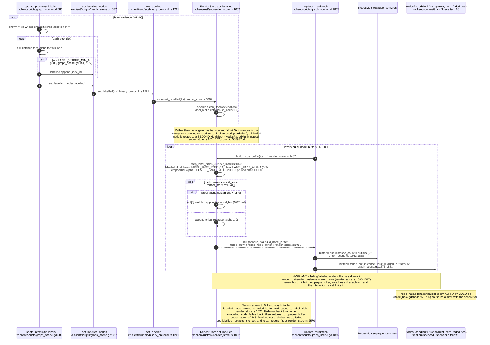
```mermaid
sequenceDiagram
    autonumber
    participant GS as _update_proximity_labels<br/>xr-client/scripts/graph_scene.gd:586
    participant SL as _set_labelled_nodes<br/>xr-client/scripts/graph_scene.gd:687
    participant BP as set_labelled<br/>xr-client/rust/src/binary_protocol.rs:1261
    participant RS as RenderStore.set_labelled<br/>xr-client/rust/src/render_store.rs:1002
    participant UM as _update_multimesh<br/>xr-client/scripts/graph_scene.gd:1855
    participant NM as NodesMulti (opaque, gem.tres)
    participant NF as NodesFadedMulti (transparent, gem_faded.tres)<br/>xr-client/scenes/GraphScene.tscn:98

    loop label cadence (~4 Hz)
        GS->>GS: shown = ids whose proximity/grab label text != ""
        loop each pool slot
            GS->>GS: a = distance-fade alpha for this label
            alt a > LABEL_VISIBLE_MIN_A (0.05) graph_scene.gd:151, :672
                GS->>SL: labelled.append(node_id)
            end
        end
        GS->>SL: _set_labelled_nodes(labelled)
        SL->>BP: set_labelled(ids) binary_protocol.rs:1261
        BP->>RS: store.set_labelled(&v) render_store.rs:1002
        RS->>RS: labelled.clear() then extend(ids)<br/>label_alpha.entry(id).or_insert(1.0)
    end
    Note over RS: Rather than make gem.tres transparent (all ~2.5k instances in the<br/>transparent queue, no depth write, broken overlap ordering), a labelled<br/>node is routed to a SECOND MultiMesh (NodesFadedMulti) instead.<br/>render_store.rs:103, :107, commit f508937dd
    loop every build_node_buffer (~45 Hz)
        UM->>RS: build_node_buffer(ids, ...) render_store.rs:1487
        RS->>RS: step_label_fades() render_store.rs:1023<br/>labelled id: alpha -= LABEL_FADE_STEP (0.1), floor LABEL_FADE_ALPHA (0.3)<br/>dropped id: alpha += LABEL_FADE_STEP, ceil 1.0, pruned once >= 1.0
        loop each drawn id (emit_node render_store.rs:1541)
            alt label_alpha has an entry for id
                RS->>RS: col[3] = alpha, append to faded_buf (NOT buf)
            else
                RS->>RS: append to buf (opaque, alpha 1.0)
            end
        end
        RS-->>UM: buf (opaque) via build_node_buffer<br/>faded_buf via faded_node_buffer() render_store.rs:1018
        UM->>NM: buffer = buf, instance_count = buf.size()/20<br/>graph_scene.gd:1863-1868
        UM->>NF: buffer = faded_buf, instance_count = faded_buf.size()/20<br/>graph_scene.gd:1875-1881
    end
    Note over RS,NF: INVARIANT a fading/labelled node still enters drawn +<br/>render_ids/render_positions in emit_node (render_store.rs:1595-1597)<br/>even though it left the opaque buffer, so edges still attach to it and<br/>the interaction ray still hits it.
    Note over NF: node_halo.gdshader multiplies rim ALPHA by COLOR.a<br/>(node_halo.gdshader:55, :86) so the halo dims with the sphere too.
    Note right of RS: Tests - fade-in to 0.3 and stay hittable<br/>labelled_node_moves_to_faded_buffer_and_eases_to_label_alpha<br/>render_store.rs:2525. Fade-out back to opaque<br/>unlabelled_node_fades_back_then_returns_to_opaque_buffer<br/>render_store.rs:2548. Replace-set and clear resets fades<br/>set_labelled_replaces_the_set_and_clear_resets_fades render_store.rs:2570
```

## VC-36.20 Spatial visual experience and its validation boundary (ADR-2107)

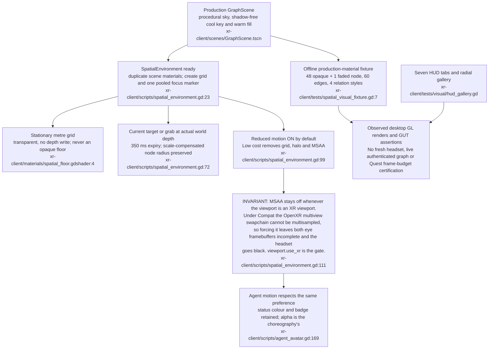
```mermaid
flowchart TB
    Scene["Production GraphScene<br/>procedural sky, shadow-free cool key and warm fill<br/>xr-client/scenes/GraphScene.tscn"]
    Env["SpatialEnvironment ready<br/>duplicate scene materials; create grid and one pooled focus marker<br/>xr-client/scripts/spatial_environment.gd:23"]
    Grid["Stationary metre grid<br/>transparent, no depth write; never an opaque floor<br/>xr-client/materials/spatial_floor.gdshader:4"]
    Focus["Current target or grab at actual world depth<br/>350 ms expiry; scale-compensated node radius preserved<br/>xr-client/scripts/spatial_environment.gd:72"]
    Comfort["Reduced motion ON by default<br/>Low cost removes grid, halo and MSAA<br/>xr-client/scripts/spatial_environment.gd:99"]
    MSAA["INVARIANT: MSAA stays off whenever the viewport is an XR viewport.<br/>Under Compat the OpenXR multiview swapchain cannot be multisampled,<br/>so forcing it leaves both eye framebuffers incomplete and the headset<br/>goes black. viewport.use_xr is the gate.<br/>xr-client/scripts/spatial_environment.gd:111"]
    Agents["Agent motion respects the same preference<br/>status colour and badge retained; alpha is the choreography's<br/>xr-client/scripts/agent_avatar.gd:169"]
    Fixture["Offline production-material fixture<br/>48 opaque + 1 faded node, 60 edges, 4 relation styles<br/>xr-client/tests/spatial_visual_fixture.gd:7"]
    Gallery["Seven HUD tabs and radial gallery<br/>xr-client/tests/visual/hud_gallery.gd"]
    Limits["Observed desktop GL renders and GUT assertions<br/>No fresh headset, live authenticated graph or Quest frame-budget certification"]
    Scene --> Env
    Env --> Grid
    Env --> Focus
    Env --> Comfort
    Comfort --> MSAA
    MSAA --> Agents
    Scene --> Fixture
    Fixture --> Limits
    Gallery --> Limits
```

## VC-36.21 Registry to embodiment, the ~4 Hz reconcile (ADR-2109)

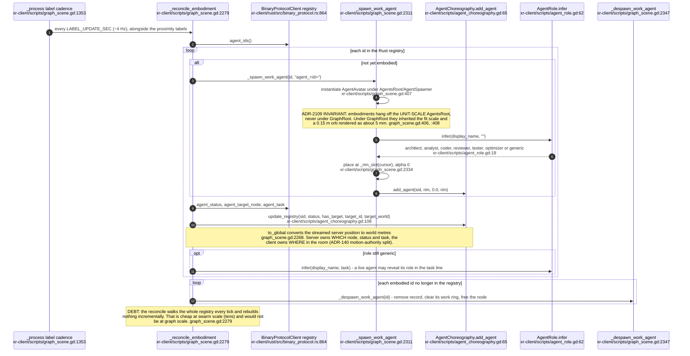
```mermaid
sequenceDiagram
    autonumber
    participant PR as _process label cadence<br/>xr-client/scripts/graph_scene.gd:1353
    participant RC as _reconcile_embodiment<br/>xr-client/scripts/graph_scene.gd:2279
    participant BP as BinaryProtocolClient registry<br/>xr-client/rust/src/binary_protocol.rs:864
    participant SP as _spawn_work_agent<br/>xr-client/scripts/graph_scene.gd:2311
    participant CH as AgentChoreography.add_agent<br/>xr-client/scripts/agent_choreography.gd:65
    participant RL as AgentRole.infer<br/>xr-client/scripts/agent_role.gd:62
    participant DS as _despawn_work_agent<br/>xr-client/scripts/graph_scene.gd:2347

    PR->>RC: every LABEL_UPDATE_SEC (~4 Hz), alongside the proximity labels
    RC->>BP: agent_ids()
    loop each id in the Rust registry
        alt not yet embodied
            RC->>SP: _spawn_work_agent(id, "agent_<id>")
            SP->>SP: instantiate AgentAvatar under AgentsRoot/AgentSpawner<br/>xr-client/scripts/graph_scene.gd:407
            Note over SP: ADR-2109 INVARIANT: embodiments hang off the UNIT-SCALE AgentsRoot,<br/>never under GraphRoot. Under GraphRoot they inherited the fit scale and<br/>a 0.15 m orb rendered as about 5 mm. graph_scene.gd:406, :408
            SP->>RL: infer(display_name, "")
            RL-->>SP: architect, analyst, coder, reviewer, tester, optimizer or generic<br/>xr-client/scripts/agent_role.gd:18
            SP->>SP: place at _rim_slot(cursor), alpha 0<br/>xr-client/scripts/graph_scene.gd:2334
            SP->>CH: add_agent(sid, rim, 0.0, rim)
        end
        RC->>BP: agent_status, agent_target_node, agent_task
        RC->>CH: update_registry(sid, status, has_target, target_id, target_world)<br/>xr-client/scripts/agent_choreography.gd:108
        Note over RC,CH: to_global converts the streamed server position to world metres<br/>graph_scene.gd:2268. Server owns WHICH node, status and task, the<br/>client owns WHERE in the room (ADR-140 motion-authority split).
        opt role still generic
            RC->>RL: infer(display_name, task) - a live agent may reveal its role in the task line
        end
    end
    loop each embodied id no longer in the registry
        RC->>DS: _despawn_work_agent(id) - remove record, clear its work ring, free the node
    end
    Note over RC: DEBT: the reconcile walks the whole registry every tick and rebuilds<br/>nothing incrementally. That is cheap at swarm scale (tens) and would not<br/>be at graph scale. graph_scene.gd:2279
```

## VC-36.22 The single pose owner, one embodiment's phase machine

```mermaid
stateDiagram-v2
    [*] --> Materialise
    Materialise --> Travel: settled and live with a target
    Materialise --> Rest: settled but idle or no target
    Travel --> Arrive: move finished
    Arrive --> Work: ARRIVE_SEC elapsed
    Work --> Travel: registry target changed, hand-off
    Work --> Complete: status becomes done
    Work --> Park: target lost or status idle
    Arrive --> Complete: status becomes done
    Complete --> Park: COMPLETE_SEC elapsed
    Park --> Travel: live again with a target
    Park --> Rest: move finished
    Rest --> Travel: live again with a target
    note right of Work
        agent_choreography.gd is the SOLE writer of a work-layer
        embodiment's position and alpha. tick agent_choreography.gd:120
        pose agent_choreography.gd:126, applied graph_scene.gd:2443
        INVARIANT the proxemics arc places CONVERSATION-layer avatars only
        graph_scene.gd:2159, graph_scene.gd:2416
        INVARIANT nudge targets, idle radial drift and random graph points
        are deleted and must not return, ADR-2109 Consequences
    end note
    note left of Park
        TRAVEL_SPEED 0.32 m per second agent_choreography.gd:36
        SLOT_DISTANCE 0.32 m off the node agent_choreography.gd:42
        HEAD_EXCLUSION 1.0 m agent_choreography.gd:45
        ALPHA_PARKED 0.3, parked agents stay selectable
        agent_choreography.gd:46
        Reduced motion replaces travel with fade, relocate, fade
        agent_choreography.gd:49
        Explicit done is the completion beat, the 30 s evidence TTL
        is the only other exit from working
        render_store.rs:823
    end note
```

## VC-36.23 Demo mode is a producer of synthetic 0x23 frames through the real door (ADR-2109)

```mermaid
sequenceDiagram
    autonumber
    participant HD as Swarm tab Start Agent Demo<br/>xr-client/scripts/hud.gd:534
    participant GS as _toggle_demo<br/>xr-client/scripts/graph_scene.gd:3669
    participant DD as AgentDemoDirector.start<br/>xr-client/scripts/agent_demo_director.gd:104
    participant EN as encode_action_frame<br/>xr-client/scripts/agent_demo_director.gd:325
    participant BP as BinaryProtocolClient.ingest<br/>xr-client/rust/src/binary_protocol.rs:1105
    participant ST as RenderStore agent registry<br/>xr-client/rust/src/render_store.rs:731

    HD->>GS: control_pressed("toggle_demo") graph_scene.gd:794
    GS->>DD: start(_binary_client, _server_to_world)
    DD->>DD: _build_adjacency from get_edges, _pick_candidates, _separated_starts<br/>xr-client/scripts/agent_demo_director.gd:224
    alt no candidate nodes
        DD-->>GS: false, HUD flashes "Demo needs a loaded graph" graph_scene.gd:3675
    else running
        loop per role, staggered STAGGER_SEC
            DD->>EN: {source: 0x80000000 | 0xD001..0xD006, target: a REAL node id,<br/>action, ts, duration_ms, payload {"intent": caption}}
            Note over EN: [0x23][u16 count]([u16 len][u32 src][u32 tgt][u8 action]<br/>[u32 ts][u16 dur][payload])* - byte-for-byte the server's own<br/>encode_agent_actions layout. agent_demo_director.gd:325
            EN-->>DD: PackedByteArray
            DD->>BP: ingest(frame)
            BP->>ST: record_agent_action - the SAME door a live swarm uses
            DD->>DD: keep alive every KEEPALIVE_SEC 5.0 so evidence never ages out<br/>xr-client/scripts/agent_demo_director.gd:30
        end
        DD->>BP: server_clock_ms() stamps every ts from the ADR-2034 clock anchor<br/>xr-client/rust/src/binary_protocol.rs:1217
        Note over DD,BP: INVARIANT demo evidence orders and expires alongside live evidence<br/>because it rides the same clock. agent_demo_director.gd:211
        DD->>BP: apply_agent_state(wire, "done", caption) on completion<br/>xr-client/rust/src/binary_protocol.rs:1230
    end
    HD->>GS: press again
    GS->>DD: stop()
    DD->>BP: retire_agents(demo_wire_ids()) binary_protocol.rs:1206
    BP->>ST: remove record and anchor outright render_store.rs:908
    Note over DD,ST: ADR-2109 INVARIANT: no fake position frames, no scene-side demo<br/>branch, and the synthetic agents carry NO demo marker in names,<br/>frames, roster rows or payloads. Provenance is the reserved id<br/>range 0xD001-0xD0FF alone. agent_demo_director.gd:25, agent_demo_director.gd:87
    Note over DD,ST: A demo regression is therefore a production regression: the demo<br/>exercises exactly the live path. Cover: byte-exact layout<br/>test_agent_demo_director.gd:75, Stop retires exactly the demo ids<br/>test_agent_demo_director.gd:105
```

## VC-36.24 What an embodied agent is made of, and the effects that follow it

```mermaid
flowchart TB
    subgraph body["Body - one AgentAvatar under AgentsRoot"]
        CORE["Faceted core, CORE_RADIUS 0.14 m<br/>xr-client/scripts/agent_avatar.gd:52"]
        FRAME["Procedural role frame, six shapes plus generic hoop<br/>frame_mesh caches per role<br/>xr-client/scripts/agent_role.gd:80"]
        PTR["Pointer cone, POINTER_LENGTH 0.09 m, aimed at the target<br/>xr-client/scripts/agent_avatar.gd:53, set_aim agent_avatar.gd:267"]
        BADGE["World-size badge, two-letter role code plus name<br/>set_work_identity xr-client/scripts/agent_avatar.gd:240"]
        CAP["Task caption, shown only while announcing or selected<br/>set_caption_visible xr-client/scripts/agent_avatar.gd:227"]
    end
    subgraph fx["Work cues - AgentEffects under AgentEffectsRoot"]
        RING["Pulsing ring on the node being worked<br/>set_ring xr-client/scripts/agent_effects.gd:104"]
        BEADS["Hand-off packet beads along the REAL edge<br/>send_packets xr-client/scripts/agent_effects.gd:86"]
        FLASH["600 ms arrival flash on the body<br/>flash xr-client/scripts/agent_avatar.gd:219"]
        BURST["Completion burst<br/>burst xr-client/scripts/agent_effects.gd:118"]
        BEAM["Work beam on GraphRoot/AgentMulti, origin at the anchor<br/>xr-client/rust/src/render_store.rs:1693"]
    end
    EV["_choreo.take_events drains depart, arrive, handoff, complete, park<br/>xr-client/scripts/agent_choreography.gd:145"]
    RM["Reduced motion default ON: beads, flash and hover suppressed<br/>xr-client/scripts/graph_scene.gd:2394"]
    TOG["Agents layer toggle hides AgentsRoot and AgentEffectsRoot only<br/>choreography, registry, handles and physics keep running<br/>xr-client/scripts/graph_scene.gd:821"]
    CORE --> FRAME --> PTR --> BADGE --> CAP
    CAP --> EV
    EV --> RING --> BEADS --> FLASH --> BURST --> BEAM
    BEAM --> RM --> TOG
    TOG --> INV["INVARIANT: anchors are visual only. set_agent_anchors never<br/>touches node positions or physics, and an agent with no anchor<br/>falls back to its streamed node position.<br/>xr-client/rust/src/render_store.rs:884"]
```
````

## DIFF

```diff
diff --git a/docs/adr/ADR-2108-dev-profile-arms-visionclaw-dev-mode-by-default.md b/docs/adr/ADR-2108-dev-profile-arms-visionclaw-dev-mode-by-default.md
index 795e48c36..96e1bcb78 100644
--- a/docs/adr/ADR-2108-dev-profile-arms-visionclaw-dev-mode-by-default.md
+++ b/docs/adr/ADR-2108-dev-profile-arms-visionclaw-dev-mode-by-default.md
@@ -70,7 +70,12 @@ is the fingerprint of an auth gate rather than a dead HUD.
 
 ## Disposition — 2026-10-02
 
-- **Suitability:** fits, needs revision
-- **Priority:** P1 — this cycle (Track C item 10, CY-C fresh-host bring-up; §9 demonstrator path)
-- **Why:** For the owner's own rig the decision stands. `docker-compose.unified.yml:90` reads `${VISIONCLAW_DEV_MODE:-1}` and the XR write-denied notice shipped in `a37433f5d`. Its premise is that "the LAN is the trust boundary", and Track C now makes a client's network a deployment target. A residential host brought up with `launch.sh up dev` would make every peer on the Trust LAN an admin. The prod path forbids the flag (`scripts/launch.sh:165`) but requires `CLOUDFLARE_TUNNEL_TOKEN` and three other secrets (`:171`), which an offline Trust deployment may not have (unverified). The record needs one clause saying which profile a client-hardware deployment uses.
-- **Next:** The owner decides the residential profile (see the triage owner questions). Then take the joint runtime receipt with ADR-2039, after which the record is ready to accept.
+- **Suitability:** fits, as a dev-only default. The revision the triage asked for is supplied by the owner (below) and recorded in the amendment that follows.
+- **Priority:** P1 — this cycle (§9 demonstrator path on the owner's own rig). It is no longer a Track C or CY-C item.
+- **Owner decisions 2026-10-02, Q1 and Q3:** client hardware runs the **prod profile**. The Trust residential is never brought up with `launch.sh up dev`, so the "LAN is the trust boundary" premise never reaches a client's network. The headset there writes with an Owner/Admin `XR_NOSTR_SECRET` over NIP-98, which validates behind the prod nginx since `e7e6b61d8`.
+- **Why:** On the owner's own rig the decision stands. `docker-compose.unified.yml:90` reads `${VISIONCLAW_DEV_MODE:-1}`, and the XR write-denied notice shipped in `a37433f5d`. Since `e7e6b61d8` the notice names an Owner/Admin key as the remedy and marks dev mode as dev-only. The prod path forbids the flag (`scripts/launch.sh:165`).
+- **Next:** Take the joint runtime receipt with ADR-2039 on the dev rig. The record is then ready to accept.
+
+## Amendment — 2026-10-02 (owner decision, Q1)
+
+Decision 1 applies to the owner's own development rig only. A deployment on client hardware, starting with the Trust residential, uses the prod profile (`launch.sh up prod`), where `VISIONCLAW_DEV_MODE` is refused at launch and at boot. The armed-by-default dev profile must never be brought up on a client's network.
```
