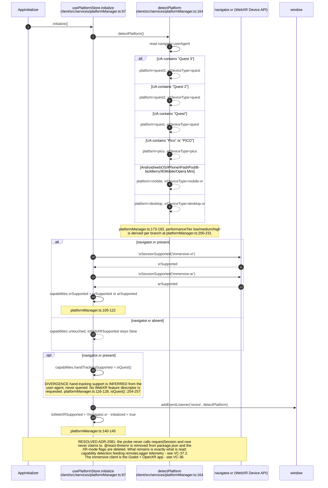
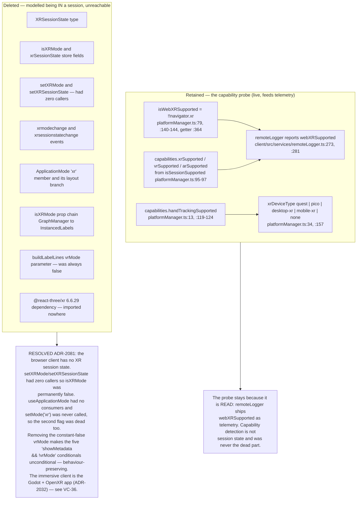
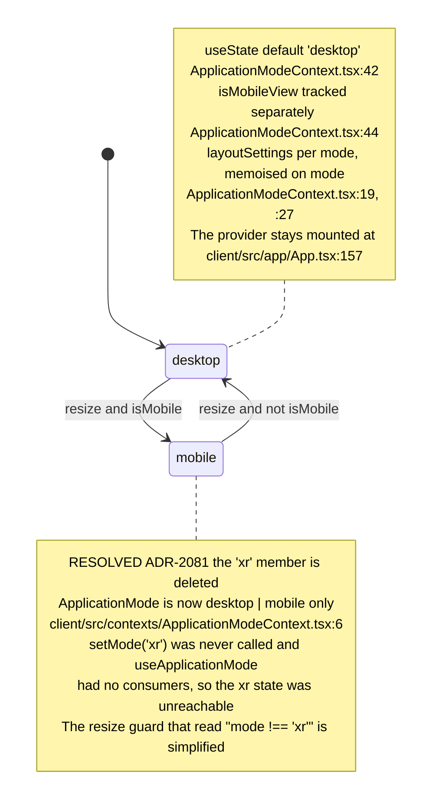
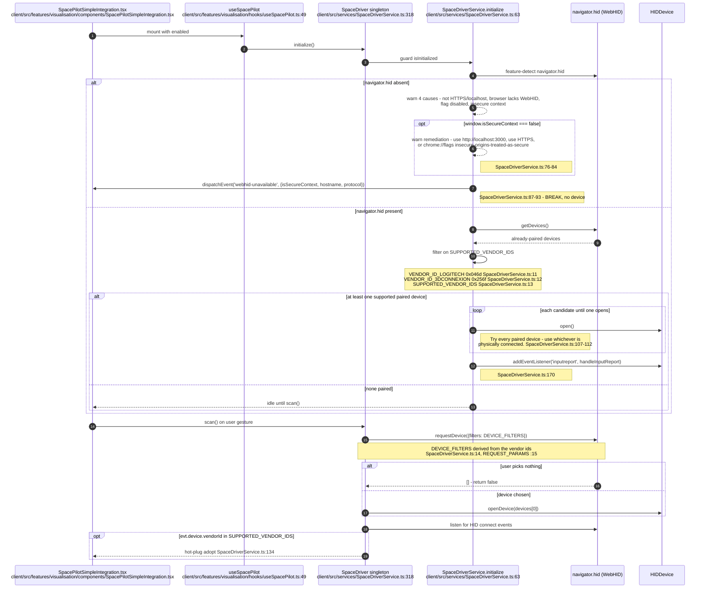
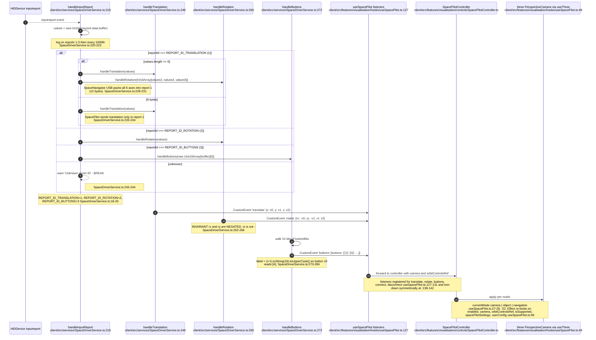
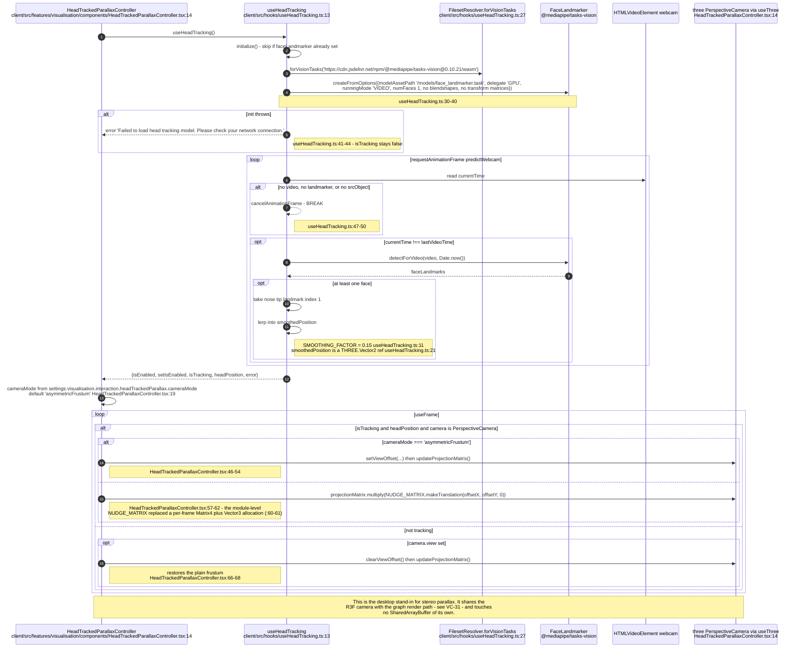
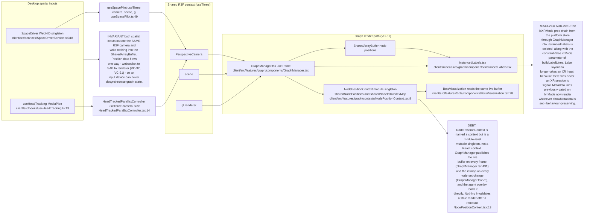
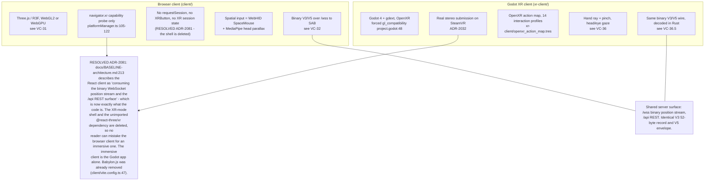
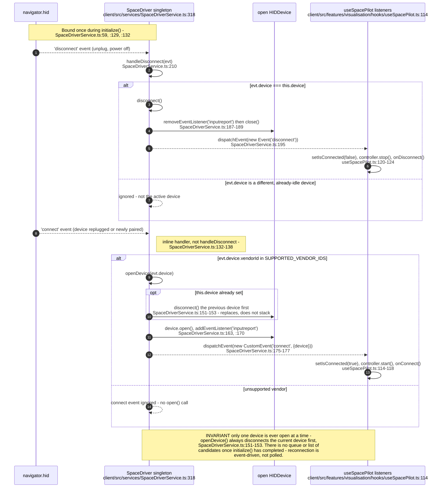
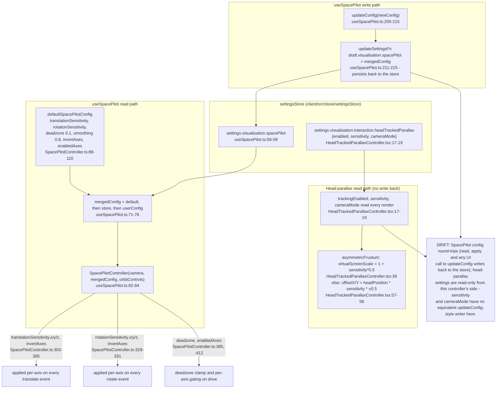

# Label vc-40

You are an independent labeller for a pre-registered experiment. Below are (1) a TOPIC: a Markdown file of Mermaid diagrams, with short prose notes, that document code, with `path:line` citations, where paths under `../project/` are in the VisionClaw repository and paths under `../project/agentbox/` are in the agentbox repository; and (2) a DIFF: one commit's changes in the visionclaw repository, restricted to the files the topic lists under `sources:`. The topic was verified against a revision of that repository at or before this commit's parent, so the diff is a change made after the topic was written.

Answer exactly one question:

> **Did this change make anything this topic states wrong or misleading?**

Judge only from the two texts below; do not look anything else up. Reply with a single JSON object and nothing else:

```json
{"verdict": "yes" | "no", "statements": ["<diagram or section id>: <the statement, quoted>", ...], "line_anchors_only": true | false, "reason": "<one or two sentences>"}
```

`statements` lists every statement in the topic (a message, node, edge, guard, label or prose claim) that the change makes wrong or misleading; it is empty when the verdict is no. `line_anchors_only` is true when the only such statements are `path:line` anchors whose cited code merely moved.

## TOPIC (docs/diagrams/visionclaw/37-browser-xr-and-desktop-input.md)

````markdown
---
id: VC-37
title: Browser XR surface and desktop spatial input
area: visionclaw
governing:
  - ../project/docs/BASELINE-architecture.md
  - ../project/docs/XR-client.md
adrs: [ADR-2032, ADR-2081]
sources:
  - ../project/docs/BASELINE-architecture.md
  - ../project/client/src/services/platformManager.ts
  - ../project/client/src/contexts/ApplicationModeContext.tsx
  - ../project/client/src/services/SpaceDriverService.ts
  - ../project/client/src/features/visualisation/hooks/useSpacePilot.ts
  - ../project/client/src/features/visualisation/controls/SpacePilotController.ts
  - ../project/client/src/features/visualisation/components/SpacePilotSimpleIntegration.tsx
  - ../project/client/src/hooks/useHeadTracking.ts
  - ../project/client/src/features/visualisation/components/HeadTrackedParallaxController.tsx
  - ../project/client/src/features/graph/components/GraphManager.tsx
  - ../project/client/src/features/graph/components/InstancedLabels.tsx
  - ../project/client/vite.config.ts
  - ../project/client/package.json
  - ../project/xr-client/project.godot
  - ../project/client/src/app/App.tsx
  - ../project/client/src/services/remoteLogger.ts
  - ../project/client/src/features/graph/contexts/NodePositionContext.tsx
  - ../project/client/src/features/bots/components/BotsVisualization.tsx
verified_commit: {visionclaw: 58f04f2eb272a2707737f2065f8241b931229e81}
---

## VC-37.1 Browser XR capability probe — what platformManager actually does



## VC-37.2 The XR-mode surface is gone (RESOLVED ADR-2081)



## VC-37.3 ApplicationMode transitions and the mobile guard



## VC-37.4 SpaceMouse / SpacePilot — WebHID acquisition and secure-context gate



## VC-37.5 SpacePilot HID report decode and camera drive



## VC-37.6 Head-tracked parallax — MediaPipe face landmarks to camera frustum



## VC-37.7 How the desktop XR-adjacent inputs share state with the R3F path



## VC-37.8 Browser path versus the shipped Godot path



## VC-37.9 SpaceDriver hot-plug — disconnect and reconnect lifecycle



## VC-37.10 Spatial-input settings — SpacePilot config round trip and head-parallax tuning


````

## DIFF

```diff
diff --git a/client/src/features/graph/components/InstancedLabels.tsx b/client/src/features/graph/components/InstancedLabels.tsx
index 905afc28e..c0590fd89 100644
--- a/client/src/features/graph/components/InstancedLabels.tsx
+++ b/client/src/features/graph/components/InstancedLabels.tsx
@@ -12,14 +12,7 @@ import type { GraphVisualMode } from '../hooks/useGraphVisualState';
 import { computeNodeScale } from '../utils/nodeScaling';
 import type { GraphTypeVisualsSettings } from '../../settings/config/settings';
 
-// --- Metadata overlay helpers (duplicated from GraphManager to avoid circular imports) ---
-const DOMAIN_COLORS: Record<string, string> = {
-  'AI': '#4FC3F7', 'BC': '#81C784', 'RB': '#FFB74D', 'MV': '#CE93D8',
-  'TC': '#FFD54F', 'DT': '#EF5350', 'NGM': '#4DB6AC',
-};
-const DEFAULT_DOMAIN_COLOR = '#90A4AE';
-const getDomainColor = (domain?: string): string =>
-  domain && DOMAIN_COLORS[domain] ? DOMAIN_COLORS[domain] : DEFAULT_DOMAIN_COLOR;
+import { getDomainColor } from '../utils/domainColors';
 
 const getQualityStars = (quality?: number | string): string => {
   if (quality === undefined || quality === null) return '';
```
