# Label vc-43

You are an independent labeller for a pre-registered experiment. Below are (1) a TOPIC: a Markdown file of Mermaid diagrams, with short prose notes, that document code, with `path:line` citations, where paths under `../project/` are in the VisionClaw repository and paths under `../project/agentbox/` are in the agentbox repository; and (2) a DIFF: one commit's changes in the visionclaw repository, restricted to the files the topic lists under `sources:`. The topic was verified against a revision of that repository at or before this commit's parent, so the diff is a change made after the topic was written.

Answer exactly one question:

> **Did this change make anything this topic states wrong or misleading?**

Judge only from the two texts below; do not look anything else up. Reply with a single JSON object and nothing else:

```json
{"verdict": "yes" | "no", "statements": ["<diagram or section id>: <the statement, quoted>", ...], "line_anchors_only": true | false, "reason": "<one or two sentences>"}
```

`statements` lists every statement in the topic (a message, node, edge, guard, label or prose claim) that the change makes wrong or misleading; it is empty when the verdict is no. `line_anchors_only` is true when the only such statements are `path:line` anchors whose cited code merely moved.

## TOPIC (docs/diagrams/visionclaw/26-solid-pod-and-jss.md)

````markdown
---
id: VC-26
title: Solid Pod integration — embedded pod, proxy, client stack
area: visionclaw
governing:
  - ../project/docs/DATA-authority-erasure.md
  - ../project/docs/IDENTITY-authority-chain.md
adrs: [ADR-2067, ADR-2068, ADR-2070, ADR-2098, ADR-2106]
sources:
  - ../project/client/src/services/api/authInterceptor.ts
  - ../project/Cargo.toml
  - ../project/docs/adr/ADR-2111-re-sequence-rgb-for-bridged-assets-and-delete-the-host-payment-store.md
  - ../project/src/main.rs
  - ../project/src/services/ontology_generation.rs
  - ../project/src/services/ontology_pull.rs
  - ../project/src/handlers/solid_proxy_handler.rs
  - ../project/src/utils/nip98.rs
  - ../project/client/src/services/SolidPodService.ts
  - ../project/client/src/services/solidPod/ldpClient.ts
  - ../project/client/src/services/solidPod/agentMemory.ts
  - ../project/client/src/services/solidPod/typeIndex.ts
  - ../project/client/src/services/solidPod/wacManager.ts
  - ../project/client/src/services/solidPod/podNotifications.ts
  - ../project/client/src/services/SolidGraphViewService.ts
  - ../project/client/src/features/ontology/services/jss/contextLoader.ts
  - ../project/client/src/features/solid/hooks/useSolidPod.ts
  - ../project/client/src/features/solid/hooks/useSolidContainer.ts
  - ../project/client/src/features/solid/hooks/useSolidResource.ts
  - ../project/client/src/features/solid/components/SolidTabContent.tsx
  - ../project/client/src/features/control-center/panels/SolidPanel.tsx
  - ../project/client/src/store/websocket/solidWebSocket.ts
  - ../project/client/src/features/ontology/services/jss/schemaParser.ts
  - ../project/client/src/features/solid/components/PodBrowser.tsx
  - ../project/client/src/features/solid/components/PodSettings.tsx
  - ../project/client/src/features/solid/components/ResourceEditor.tsx
  - ../project/src/handlers/image_gen_handler.rs
verified_commit: {visionclaw: 58f04f2eb272a2707737f2065f8241b931229e81}
---

## VC-26.1 Deployment topology — embedded pod vs feature-off stub
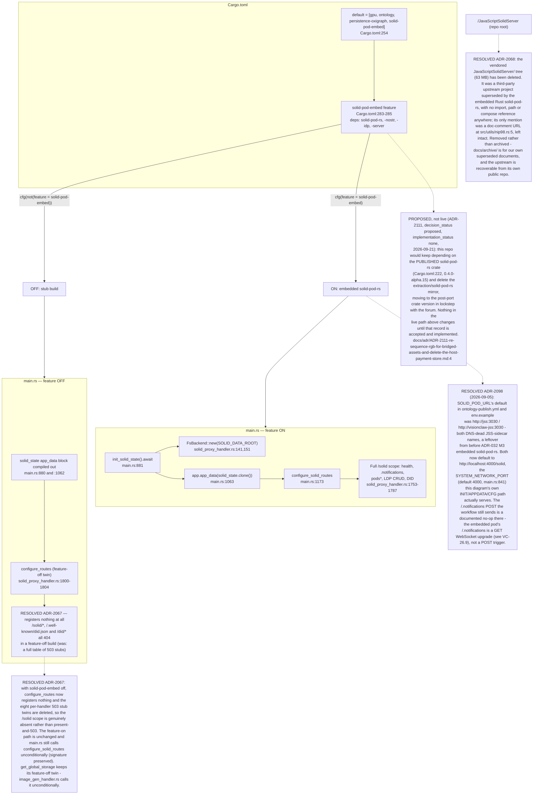

## VC-26.2 solid_proxy_handler — route dispatch, auth, WAC
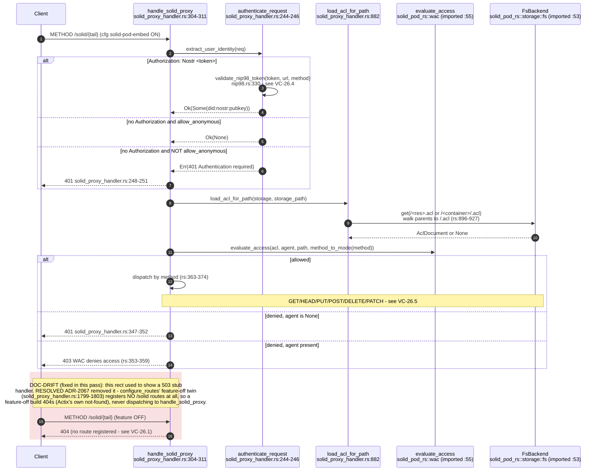

## VC-26.3 Login / pod session init — SolidPodService + useSolidPod
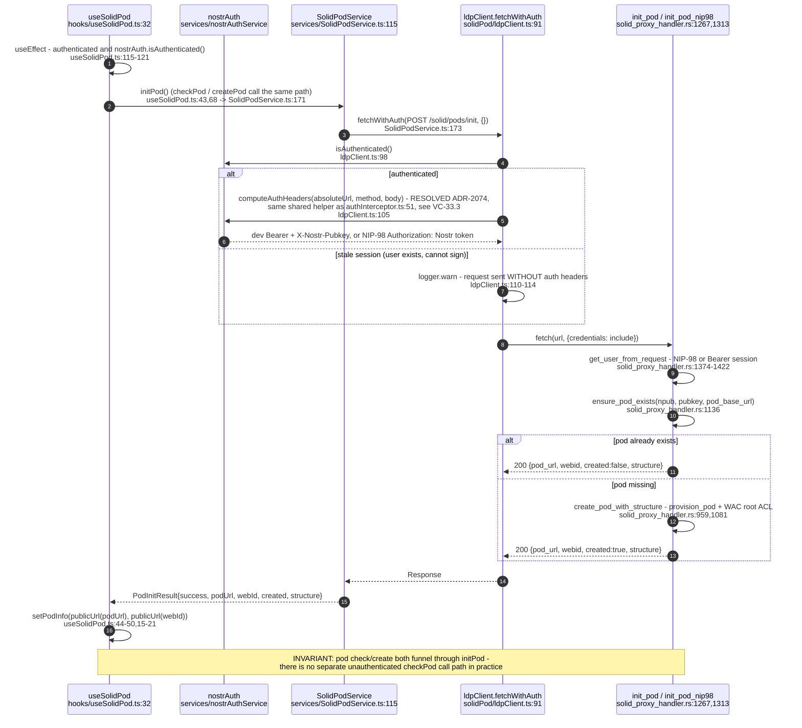

## VC-26.4 NIP-98 signed request reaching the pod — identity chain
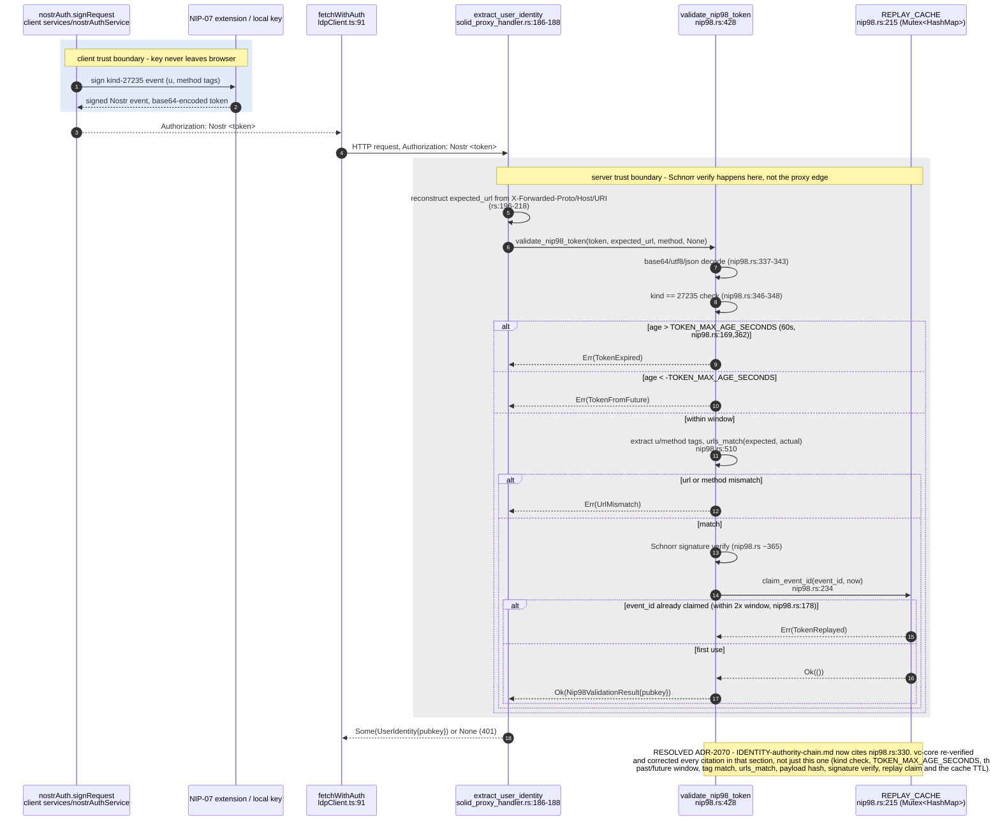

## VC-26.5 ldpClient CRUD — LDP resource operations
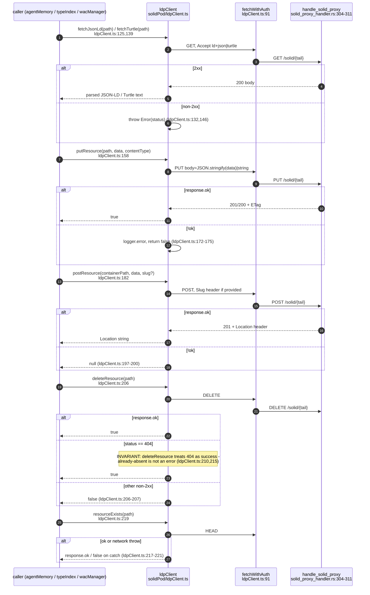

## VC-26.6 agentMemory — read / write / delete
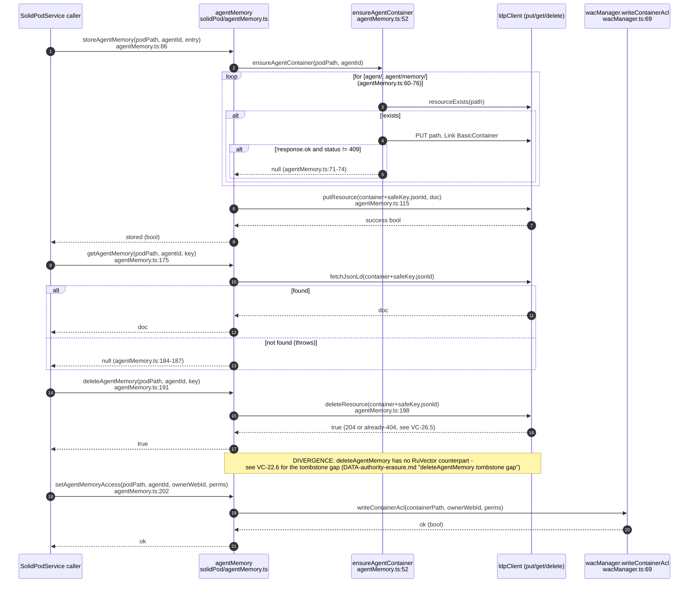

## VC-26.7 wacManager — WAC ACL write (client) and read (server)
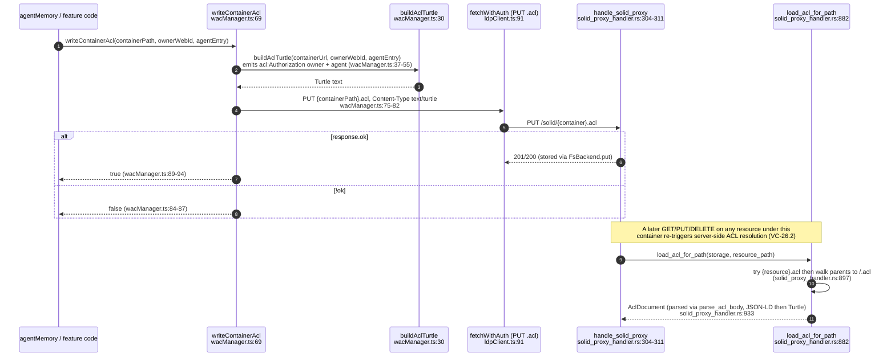

## VC-26.8 typeIndex — registration and discovery
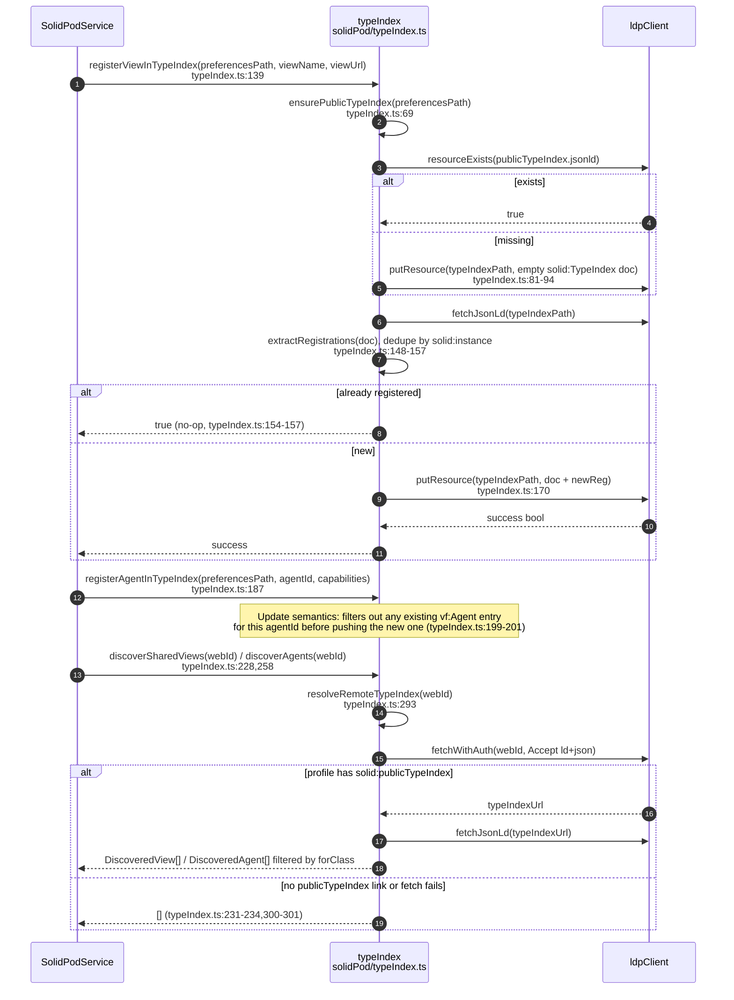

## VC-26.9 podNotifications subscription + solidWebSocket store
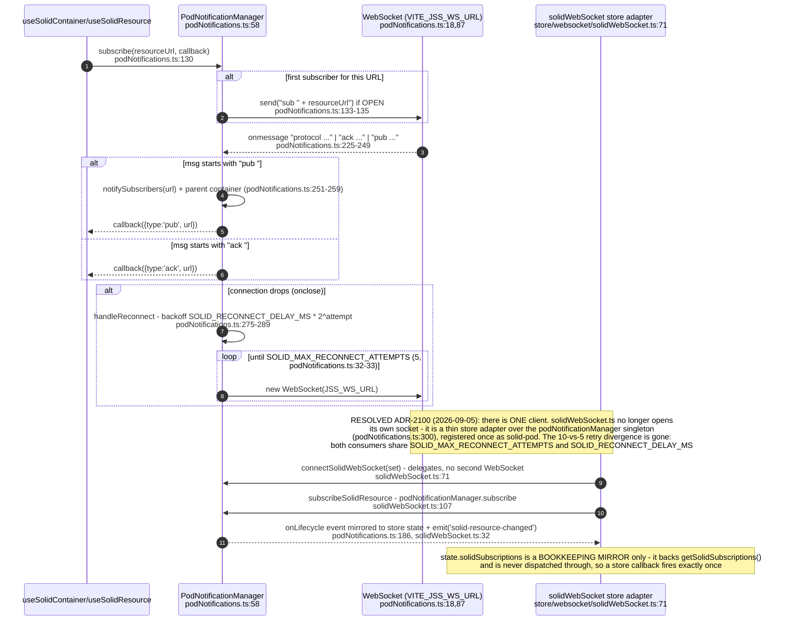

## VC-26.10 jss schemaParser — JSON-LD context load with cache
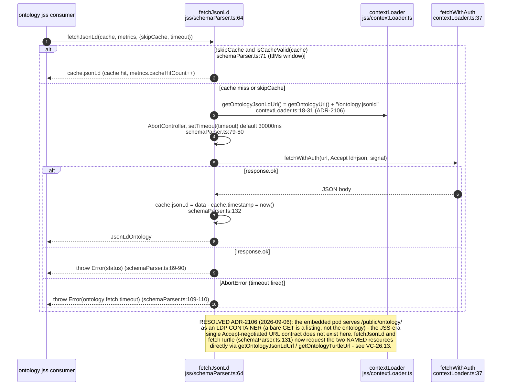

## VC-26.12 Client component/hook tree
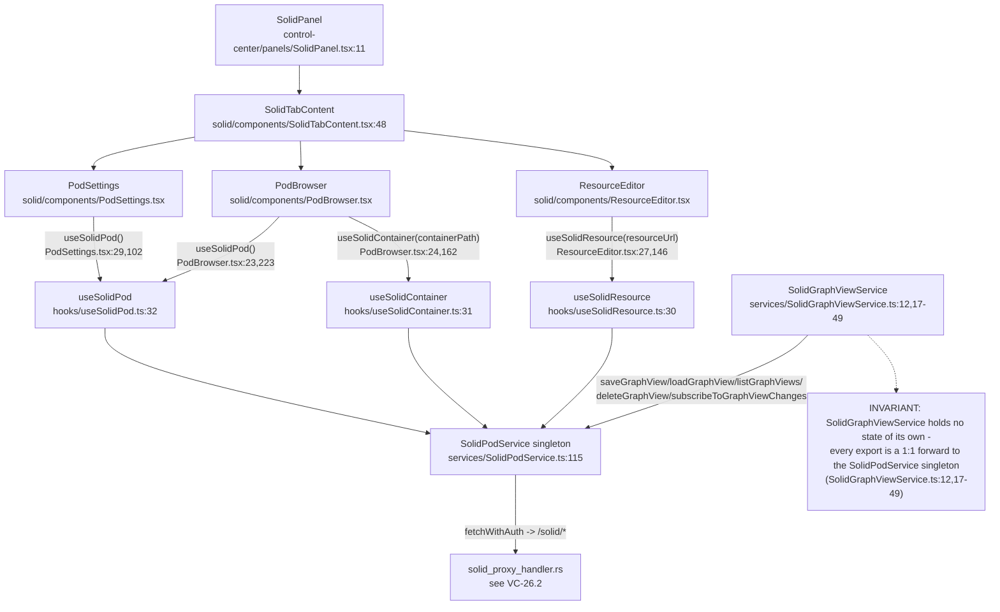

## VC-26.13 Ontology boot pull — GitHub release into the embedded pod (ADR-2106)
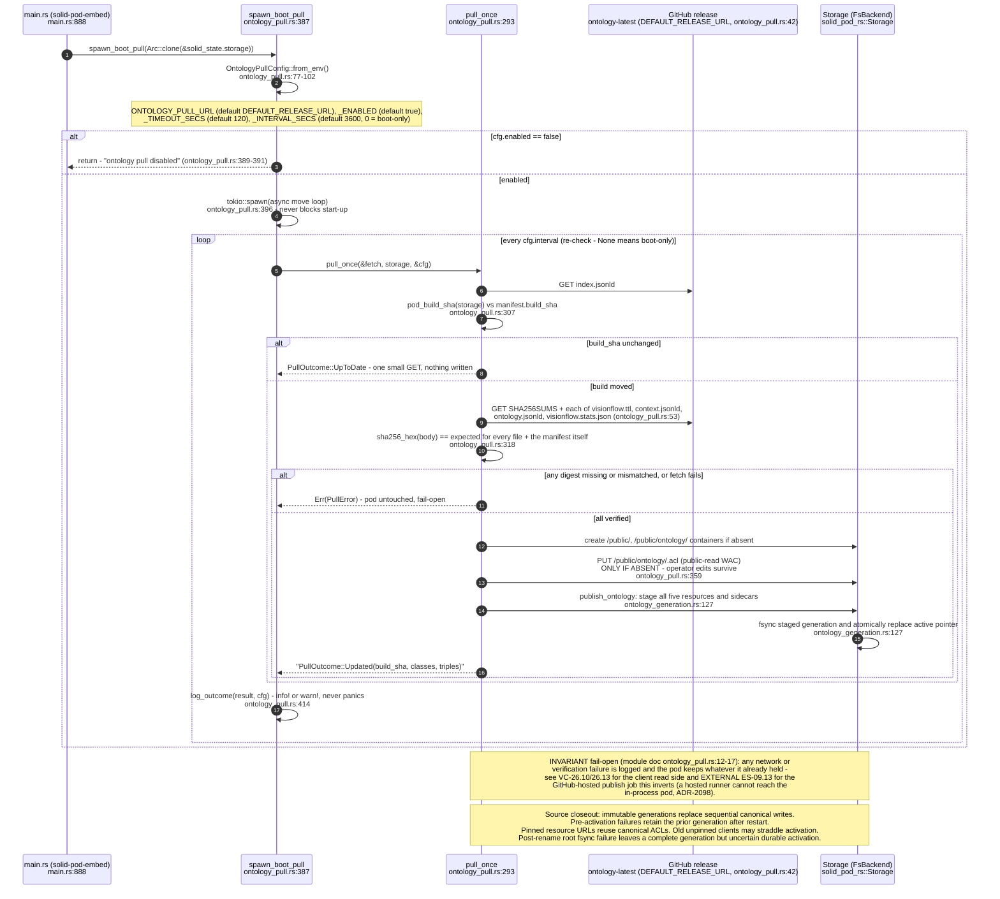

## VC-26.14 Ontology publication failure boundaries — verified bytes versus atomic visibility

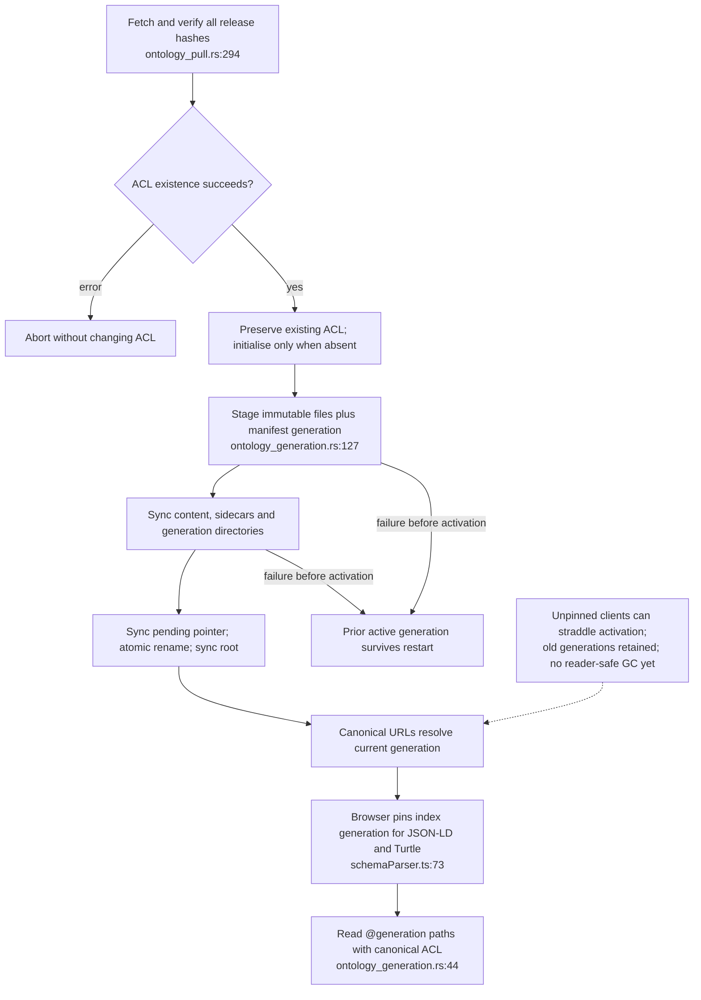
````

## DIFF

```diff
diff --git a/src/handlers/image_gen_handler.rs b/src/handlers/image_gen_handler.rs
index 12c11e52e..803f2b18f 100644
--- a/src/handlers/image_gen_handler.rs
+++ b/src/handlers/image_gen_handler.rs
@@ -1,8 +1,15 @@
 /// Image Generation Handler
-/// Submits Flux2 jobs to local ComfyUI, saves results to the user's Solid pod.
+/// Submits image jobs to local ComfyUI, saves results to the user's Solid pod.
+///
+/// Model selection (`IMAGE_GEN_MODEL`):
+///   `minimax-h3` (default) — MiniMax H3 text-to-video, rendering the shortest
+///       clip the model allows and saving frame 0 as the still. These are the
+///       weights the estate ComfyUI serves today.
+///   `flux2` — FLUX 2 Dev still-image graph; needs `flux2_dev_fp8mixed`,
+///       `mistral_3_small_flux2_fp8` and `flux2-vae` installed in ComfyUI.
 ///
 /// Flow (user session):
-///   POST /api/image-gen/submit → build Flux2 workflow → ComfyUI :8188/prompt
+///   POST /api/image-gen/submit → build workflow → ComfyUI :8188/prompt
 ///   → poll /history → fetch PNG → PUT to /api/solid/pods/{user}/images/
 ///   → return { job_id, pod_image_url, width, height, seed }
 ///
@@ -31,11 +38,6 @@ fn comfyui_base() -> String {
     std::env::var("COMFYUI_URL").unwrap_or_else(|_| "http://comfyui:8188".to_string())
 }
 
-fn comfyui_salad() -> String {
-    // Salad wrapper: synchronous, returns { id, images:[base64], filenames, stats }
-    std::env::var("COMFYUI_SALAD_URL").unwrap_or_else(|_| "http://comfyui:3000".to_string())
-}
-
 fn solid_base() -> String {
     // Internal base — goes through nginx→Rust solid proxy
     std::env::var("SOLID_INTERNAL_URL")
@@ -92,13 +94,34 @@ fn agent_key_authorised(_provided: Option<&str>) -> bool {
     true
 }
 
+/// Which ComfyUI model graph `/submit` builds.
+#[derive(Debug, Clone, Copy, PartialEq, Eq)]
+enum ImageModel {
+    MiniMaxH3,
+    Flux2,
+}
+
+impl ImageModel {
+    /// Parse `IMAGE_GEN_MODEL`; unset or unrecognised values select MiniMax H3.
+    fn parse(value: Option<&str>) -> Self {
+        match value.map(|v| v.trim().to_ascii_lowercase()).as_deref() {
+            Some("flux2") | Some("flux-2") => ImageModel::Flux2,
+            _ => ImageModel::MiniMaxH3,
+        }
+    }
+
+    fn from_env() -> Self {
+        Self::parse(std::env::var("IMAGE_GEN_MODEL").ok().as_deref())
+    }
+}
+
 // ─── Request / Response types ────────────────────────────────────────────────
 
 #[derive(Debug, Deserialize)]
 pub struct ImageGenRequest {
     /// The text prompt to generate
     pub prompt: String,
-    /// Negative prompt (optional, unused by Flux2 but stored for future use)
+    /// Negative prompt (optional, unused by Flux2 and MiniMax H3 but stored for future use)
     #[serde(default)]
     pub negative_prompt: Option<String>,
     /// Image width (default 1024)
@@ -110,7 +133,7 @@ pub struct ImageGenRequest {
     /// Number of steps (default 20)
     #[serde(default = "default_steps")]
     pub steps: u32,
-    /// CFG / guidance (default 3.5 for Flux2)
+    /// CFG / guidance (default 3.5 for Flux2; ignored by MiniMax H3)
     #[serde(default = "default_guidance")]
     pub guidance: f32,
     /// Random seed (-1 = random)
@@ -285,6 +308,293 @@ fn build_flux2_workflow(req: &ImageGenRequest, seed: u64, filename_prefix: &str)
     })
 }
 
+// ─── MiniMax H3 still workflow ────────────────────────────────────────────────
+
+/// Shortest clip MiniMax H3 accepts (its frame grid is 17k+5).
+const H3_STILL_FRAMES: u32 = 5;
+
+/// MiniMax H3 canvases step in 32 px; round down, never below 32.
+fn snap_to_32(px: u32) -> u32 {
+    (px / 32 * 32).max(32)
+}
+
+/// Canvas size the MiniMax H3 graph actually renders for a requested size.
+fn h3_canvas(width: u32, height: u32) -> (u32, u32) {
+    (snap_to_32(width), snap_to_32(height))
+}
+
+/// Build a MiniMax H3 graph that renders a still: the shortest text-to-video
+/// clip, decoded with the video VAE, with frame 0 saved as a PNG. The audio
+/// half of the AV latent is never decoded. `guidance` does not apply to this
+/// sampler (BasicGuider carries no CFG), matching the agentbox H3 reference
+/// workflow.
+fn build_minimax_h3_still_workflow(
+    req: &ImageGenRequest,
+    seed: u64,
+    filename_prefix: &str,
+) -> Value {
+    let (width, height) = h3_canvas(req.width, req.height);
+    json!({
+        "1": {
+            "class_type": "UNETLoader",
+            "inputs": {
+                "unet_name": "minimax_h3_fl2va_pruned_int8_convrot.safetensors",
+                "weight_dtype": "default"
+            }
+        },
+        "2": {
+            "class_type": "CLIPLoader",
+            "inputs": {
+                "clip_name": "qwen3vl_32b_minimax_h3_nvfp4_awq.safetensors",
+                "type": "minimax",
+                "device": "default"
+            }
+        },
+        "3": {
+            "class_type": "VAELoader",
+            "inputs": {
+                "vae_name": "minimax_h3_video_vae_fp16.safetensors"
+            }
+        },
+        "4": {
+            "class_type": "MiniMaxH3ImageToVideo",
+            "inputs": {
+                "clip": ["2", 0],
+                "vae": ["3", 0],
+                "prompt": req.prompt,
+                "width": width,
+                "height": height,
+                "length": H3_STILL_FRAMES
+            }
+        },
+        "5": {
+            "class_type": "RandomNoise",
+            "inputs": {
+                "noise_seed": seed
+            }
+        },
+        "6": {
+            "class_type": "BasicGuider",
+            "inputs": {
+                "model": ["1", 0],
+                "conditioning": ["4", 0]
+            }
+        },
+        "7": {
+            "class_type": "KSamplerSelect",
+            "inputs": {
+                "sampler_name": "res_multistep"
+            }
+        },
+        "8": {
+            "class_type": "BasicScheduler",
+            "inputs": {
+                "model": ["1", 0],
+                "scheduler": "simple",
+                "steps": req.steps,
+                "denoise": 1.0
+            }
+        },
+        "9": {
+            "class_type": "SamplerCustomAdvanced",
+            "inputs": {
+                "noise": ["5", 0],
+                "guider": ["6", 0],
+                "sampler": ["7", 0],
+                "sigmas": ["8", 0],
+                "latent_image": ["4", 1]
+            }
+        },
+        "10": {
+            "class_type": "VAEDecode",
+            "inputs": {
+                "samples": ["9", 0],
+                "vae": ["3", 0]
+            }
+        },
+        "11": {
+            "class_type": "ImageFromBatch",
+            "inputs": {
+                "image": ["10", 0],
+                "batch_index": 0,
+                "length": 1
+            }
+        },
+        "12": {
+            "class_type": "SaveImage",
+            "inputs": {
+                "images": ["11", 0],
+                "filename_prefix": filename_prefix
+            }
+        }
+    })
+}
+
+/// Build the workflow for the selected model, returning it with the canvas
+/// size it will render (H3 snaps to 32 px; Flux2 uses the request as given).
+fn build_workflow(
+    model: ImageModel,
+    req: &ImageGenRequest,
+    seed: u64,
+    filename_prefix: &str,
+) -> (Value, u32, u32) {
+    match model {
+        ImageModel::MiniMaxH3 => {
+            let (w, h) = h3_canvas(req.width, req.height);
+            (
+                build_minimax_h3_still_workflow(req, seed, filename_prefix),
+                w,
+                h,
+            )
+        }
+        ImageModel::Flux2 => (
+            build_flux2_workflow(req, seed, filename_prefix),
+            req.width,
+            req.height,
+        ),
+    }
+}
+
+// ─── Native ComfyUI job runner ────────────────────────────────────────────────
+
+/// Poll budget for `/history`: 60 × 5 s. A MiniMax H3 still takes ~60 s
+/// including a cold model load on the estate GPU.
+const HISTORY_POLLS: u32 = 60;
+const HISTORY_POLL_INTERVAL: Duration = Duration::from_secs(5);
+
+/// A finished ComfyUI job: its prompt id, first saved image and its bytes.
+struct ComfyJob {
+    prompt_id: String,
+    filename: String,
+    bytes: bytes::Bytes,
+}
+
+/// First image `SaveImage` recorded in a `/history/{prompt_id}` entry.
+fn first_saved_image(job: &Value) -> Option<(String, String)> {
+    let outputs = job.get("outputs")?.as_object()?;
+    outputs.values().find_map(|node_out| {
+        let first = node_out.get("images")?.as_array()?.first()?;
+        let filename = first.get("filename")?.as_str()?.to_string();
+        let subfolder = first
+            .get("subfolder")
+            .and_then(|v| v.as_str())
+            .unwrap_or("")
+            .to_string();
+        Some((filename, subfolder))
+    })
+}
+
+/// Submit `workflow` to ComfyUI's native API, poll `/history` until an image
+/// is saved, and fetch its bytes. Errors come back as the HTTP response the
+/// caller should return.
+async fn run_comfyui_job(workflow: Value, client_id: &str) -> Result<ComfyJob, HttpResponse> {
+    let client = Client::builder()
+        .timeout(Duration::from_secs(300))
+        .build()
+        .unwrap_or_default();
+
+    let submit_resp = client
+        .post(format!("{}/prompt", comfyui_base()))
+        .json(&json!({ "prompt": workflow, "client_id": client_id }))
+        .send()
+        .await
+        .map_err(|e| {
+            error!("ComfyUI submit failed: {}", e);
+            HttpResponse::ServiceUnavailable().json(json!({
+                "error": "ComfyUI unreachable",
+                "details": e.to_string()
+            }))
+        })?;
+
+    if !submit_resp.status().is_success() {
+        let body = submit_resp.text().await.unwrap_or_default();
+        error!("ComfyUI rejected workflow: {}", body);
+        return Err(HttpResponse::BadRequest().json(json!({
+            "error": "ComfyUI rejected workflow",
+            "details": body
+        })));
+    }
+
+    let submit_json: Value = submit_resp.json().await.map_err(|e| {
+        HttpResponse::InternalServerError().json(json!({
+            "error": "Failed to parse ComfyUI response",
+            "details": e.to_string()
+        }))
+    })?;
+
+    let prompt_id = submit_json
+        .get("prompt_id")
+        .and_then(|v| v.as_str())
+        .map(|s| s.to_string())
+        .ok_or_else(|| {
+            HttpResponse::InternalServerError().json(json!({
+                "error": "No prompt_id in ComfyUI response",
+                "raw": submit_json
+            }))
+        })?;
+
+    info!(
+        "ComfyUI accepted job {} → prompt_id {}",
+        client_id, prompt_id
+    );
+
+    let history_url = format!("{}/history/{}", comfyui_base(), prompt_id);
+    let mut saved: Option<(String, String)> = None;
+    for attempt in 0..HISTORY_POLLS {
+        sleep(HISTORY_POLL_INTERVAL).await;
+        let history = match client.get(&history_url).send().await {
+            Ok(r) => r.json::<Value>().await.unwrap_or_default(),
+            Err(e) => {
+                warn!(
+                    "History poll {}/{} failed: {}",
+                    attempt + 1,
+                    HISTORY_POLLS,
+                    e
+                );
+                continue;
+            }
+        };
+        if let Some(found) = history.get(&prompt_id).and_then(first_saved_image) {
+            saved = Some(found);
+            break;
+        }
+    }
+
+    let (filename, subfolder) = saved.ok_or_else(|| {
+        HttpResponse::GatewayTimeout().json(json!({
+            "error": "Timed out waiting for ComfyUI to finish",
+            "prompt_id": prompt_id
+        }))
+    })?;
+
+    info!("ComfyUI finished: {}", filename);
+
+    let view_url = format!(
+        "{}/view?filename={}&subfolder={}&type=output",
+        comfyui_base(),
+        urlencoding::encode(&filename),
+        urlencoding::encode(&subfolder)
+    );
+    let resp = client.get(&view_url).send().await.map_err(|e| {
+        HttpResponse::InternalServerError().json(json!({
+            "error": "Failed to GET image from ComfyUI",
+            "details": e.to_string()
+        }))
+    })?;
+    let bytes = resp.bytes().await.map_err(|e| {
+        HttpResponse::InternalServerError().json(json!({
+            "error": "Failed to fetch image bytes",
+            "details": e.to_string()
+        }))
+    })?;
+
+    Ok(ComfyJob {
+        prompt_id,
+        filename,
+        bytes,
+    })
+}
+
 // ─── Helper: get authenticated user from request ──────────────────────────────
 
 async fn get_user_npub(req: &HttpRequest, nostr_service: &NostrService) -> Option<String> {
@@ -339,146 +649,23 @@ pub async fn submit_image_job(
 
     let job_id = Uuid::new_v4().to_string();
     let filename_prefix = format!("visionclaw/{}/{}", user_npub, job_id);
-    let workflow = build_flux2_workflow(&body, seed, &filename_prefix);
-
-    let client = Client::builder()
-        .timeout(Duration::from_secs(300))
-        .build()
-        .unwrap_or_default();
+    let model = ImageModel::from_env();
+    let (workflow, width, height) = build_workflow(model, &body, seed, &filename_prefix);
 
-    let comfyui_url = format!("{}/prompt", comfyui_base());
     info!(
-        "Submitting image job {} for user {} to ComfyUI",
+        "Submitting image job {} ({:?}) for user {} to ComfyUI",
         job_id,
+        model,
         &user_npub[..8]
     );
 
-    // Submit to ComfyUI native API
-    let submit_resp = match client
-        .post(&comfyui_url)
-        .json(&json!({ "prompt": workflow, "client_id": job_id }))
-        .send()
-        .await
-    {
-        Ok(r) => r,
-        Err(e) => {
-            error!("ComfyUI submit failed: {}", e);
-            return HttpResponse::ServiceUnavailable().json(json!({
-                "error": "ComfyUI unreachable",
-                "details": e.to_string()
-            }));
-        }
-    };
-
-    if !submit_resp.status().is_success() {
-        let body = submit_resp.text().await.unwrap_or_default();
-        error!("ComfyUI rejected workflow: {}", body);
-        return HttpResponse::BadRequest().json(json!({
-            "error": "ComfyUI rejected workflow",
-            "details": body
-        }));
-    }
-
-    let submit_json: Value = match submit_resp.json().await {
-        Ok(v) => v,
-        Err(e) => {
-            return HttpResponse::InternalServerError().json(json!({
-                "error": "Failed to parse ComfyUI response",
-                "details": e.to_string()
-            }));
-        }
-    };
-
-    let prompt_id = match submit_json.get("prompt_id").and_then(|v| v.as_str()) {
-        Some(id) => id.to_string(),
-        None => {
-            return HttpResponse::InternalServerError().json(json!({
-                "error": "No prompt_id in ComfyUI response",
-                "raw": submit_json
-            }));
-        }
-    };
-
-    info!("ComfyUI accepted job {} → prompt_id {}", job_id, prompt_id);
-
-    // Poll /history/{prompt_id} until done (max ~5 min)
-    let history_url = format!("{}/history/{}", comfyui_base(), prompt_id);
-    let mut output_filename: Option<String> = None;
-    let mut output_subfolder: Option<String> = None;
-
-    for attempt in 0..60 {
-        sleep(Duration::from_secs(5)).await;
-
-        let history = match client.get(&history_url).send().await {
-            Ok(r) => r.json::<Value>().await.unwrap_or_default(),
-            Err(e) => {
-                warn!("History poll {}/60 failed: {}", attempt + 1, e);
-                continue;
-            }
-        };
-
-        if let Some(job) = history.get(&prompt_id) {
-            if let Some(outputs) = job.get("outputs") {
-                // Find SaveImage output
-                for (_node_id, node_out) in outputs.as_object().unwrap_or(&Default::default()) {
-                    if let Some(images) = node_out.get("images").and_then(|v| v.as_array()) {
-                        if let Some(first) = images.first() {
-                            output_filename = first
-                                .get("filename")
-                                .and_then(|v| v.as_str())
-                                .map(|s| s.to_string());
-                            output_subfolder = first
-                                .get("subfolder")
-                                .and_then(|v| v.as_str())
-                                .map(|s| s.to_string());
-                            break;
-                        }
-                    }
-                }
-                if output_filename.is_some() {
-                    break;
-                }
-            }
-        }
-    }
-
-    let filename = match output_filename {
-        Some(f) => f,
-        None => {
-            return HttpResponse::GatewayTimeout().json(json!({
-                "error": "Timed out waiting for ComfyUI to finish",
-                "prompt_id": prompt_id
-            }));
-        }
-    };
-
-    info!("ComfyUI finished: {}", filename);
-
-    // Fetch the PNG bytes from ComfyUI
-    let subfolder = output_subfolder.as_deref().unwrap_or("");
-    let view_url = format!(
-        "{}/view?filename={}&subfolder={}&type=output",
-        comfyui_base(),
-        urlencoding::encode(&filename),
-        urlencoding::encode(subfolder)
-    );
-    let image_bytes = match client.get(&view_url).send().await {
-        Ok(r) => match r.bytes().await {
-            Ok(b) => b,
-            Err(e) => {
-                return HttpResponse::InternalServerError().json(json!({
-                    "error": "Failed to fetch image bytes",
-                    "details": e.to_string()
-                }));
-            }
-        },
-        Err(e) => {
-            return HttpResponse::InternalServerError().json(json!({
-                "error": "Failed to GET image from ComfyUI",
-                "details": e.to_string()
-            }));
-        }
+    let job = match run_comfyui_job(workflow, &job_id).await {
+        Ok(job) => job,
+        Err(resp) => return resp,
     };
+    let prompt_id = job.prompt_id;
+    let filename = job.filename;
+    let image_bytes = job.bytes;
 
     // PUT to Solid pod — path: /solid/{user}/images/{job_id}.png
     let pod_path = format!(
@@ -491,6 +678,10 @@ pub async fn submit_image_job(
         &pod_path
     );
 
+    let client = Client::builder()
+        .timeout(Duration::from_secs(60))
+        .build()
+        .unwrap_or_default();
     let pod_store_resp = client
         .put(&solid_url)
         .header("Content-Type", "image/png")
@@ -525,16 +716,16 @@ pub async fn submit_image_job(
         status: "completed".to_string(),
         pod_image_url,
         comfyui_filename: Some(filename),
-        width: body.width,
-        height: body.height,
+        width,
+        height,
         seed,
         error: None,
     })
 }
 
 /// POST /api/image-gen/agent-submit
-/// Uses the ComfyUI Salad wrapper (:3000) — synchronous, returns base64 images
-/// in a single request. No polling needed.
+/// Same native ComfyUI pipeline as `/submit` (the former Salad wrapper on
+/// :3000 is not part of the ComfyUI sidecar, so this path never reached it).
 ///
 /// Used by MCP agents in the agentic-workstation container — no user Nostr session needed.
 /// Images are stored in the embedded solid-pod-rs storage under the `user_npub` pod.
@@ -575,98 +766,23 @@ pub async fn agent_submit_image_job(
         seed: body.seed,
         pod_folder: body.pod_folder.clone(),
     };
-    let workflow = build_flux2_workflow(&params, seed, &filename_prefix);
-
-    let client = Client::builder()
-        .timeout(Duration::from_secs(360))
-        .build()
-        .unwrap_or_default();
+    let model = ImageModel::from_env();
+    let (workflow, width, height) = build_workflow(model, &params, seed, &filename_prefix);
 
-    // Salad API: synchronous — one POST, get base64 images back directly
-    let salad_url = format!("{}/prompt", comfyui_salad());
     info!(
-        "[agent] Submitting image job {} for npub {} to ComfyUI Salad API",
+        "[agent] Submitting image job {} ({:?}) for npub {} to ComfyUI",
         job_id,
+        model,
         &user_npub[..8.min(user_npub.len())]
     );
 
-    let salad_resp = match client
-        .post(&salad_url)
-        .json(&json!({ "prompt": workflow }))
-        .send()
-        .await
-    {
-        Ok(r) => r,
-        Err(e) => {
-            error!("[agent] ComfyUI Salad API unreachable: {}", e);
-            return HttpResponse::ServiceUnavailable().json(json!({
-                "error": "ComfyUI Salad API unreachable", "details": e.to_string()
-            }));
-        }
-    };
-
-    if !salad_resp.status().is_success() {
-        let err_body = salad_resp.text().await.unwrap_or_default();
-        return HttpResponse::BadRequest().json(json!({
-            "error": "ComfyUI rejected workflow", "details": err_body
-        }));
-    }
-
-    // Salad response: { "id": "...", "images": ["base64..."], "filenames": ["..."], "stats": {...} }
-    let salad_json: Value = match salad_resp.json().await {
-        Ok(v) => v,
-        Err(e) => {
-            return HttpResponse::InternalServerError().json(json!({
-                "error": "Failed to parse Salad response", "details": e.to_string()
-            }))
-        }
-    };
-
-    let prompt_id = salad_json
-        .get("id")
-        .and_then(|v| v.as_str())
-        .unwrap_or(&job_id)
-        .to_string();
-
-    // Extract first base64 image
-    let b64_image = match salad_json
-        .get("images")
-        .and_then(|v| v.as_array())
-        .and_then(|arr| arr.first())
-        .and_then(|v| v.as_str())
-    {
-        Some(b64) => b64,
-        None => {
-            return HttpResponse::InternalServerError().json(json!({
-                "error": "No images in Salad response",
-                "raw": salad_json
-            }))
-        }
-    };
-
-    let comfyui_filename = salad_json
-        .get("filenames")
-        .and_then(|v| v.as_array())
-        .and_then(|arr| arr.first())
-        .and_then(|v| v.as_str())
-        .map(|s| s.to_string());
-
-    info!(
-        "[agent] ComfyUI Salad returned image ({} base64 chars), file: {:?}",
-        b64_image.len(),
-        comfyui_filename
-    );
-
-    // Decode base64 → PNG bytes
-    use base64::Engine;
-    let image_bytes = match base64::engine::general_purpose::STANDARD.decode(b64_image) {
-        Ok(bytes) => bytes,
-        Err(e) => {
-            return HttpResponse::InternalServerError().json(json!({
-                "error": "Failed to decode base64 image", "details": e.to_string()
-            }))
-        }
+    let job = match run_comfyui_job(workflow, &job_id).await {
+        Ok(job) => job,
+        Err(resp) => return resp,
     };
+    let prompt_id = job.prompt_id;
+    let comfyui_filename = Some(job.filename);
+    let image_bytes = job.bytes;
 
     // Store in embedded solid-pod-rs
     let pod_image_url = try_store_in_pod(&image_bytes, &user_npub, &body.pod_folder, &job_id).await;
@@ -676,8 +792,8 @@ pub async fn agent_submit_image_job(
         status: "completed".to_string(),
         pod_image_url,
         comfyui_filename,
-        width: body.width,
-        height: body.height,
+        width,
+        height,
         seed,
         error: None,
     })
@@ -866,3 +982,119 @@ mod agent_key_tests {
         assert!(constant_time_eq(b"", b""));
     }
 }
+
+#[cfg(test)]
+mod workflow_tests {
+    use super::*;
+
+    fn request(width: u32, height: u32) -> ImageGenRequest {
+        ImageGenRequest {
+            prompt: "a glass knowledge graph".to_string(),
+            negative_prompt: None,
+            width,
+            height,
+            steps: 20,
+            guidance: 3.5,
+            seed: 7,
+            pod_folder: "images".to_string(),
+        }
+    }
+
+    #[test]
+    fn model_defaults_to_minimax_h3() {
+        assert_eq!(ImageModel::parse(None), ImageModel::MiniMaxH3);
+        assert_eq!(ImageModel::parse(Some("")), ImageModel::MiniMaxH3);
+        assert_eq!(ImageModel::parse(Some("sdxl")), ImageModel::MiniMaxH3);
+        assert_eq!(ImageModel::parse(Some("minimax-h3")), ImageModel::MiniMaxH3);
+    }
+
+    #[test]
+    fn flux2_is_selectable() {
+        assert_eq!(ImageModel::parse(Some("flux2")), ImageModel::Flux2);
+        assert_eq!(ImageModel::parse(Some(" FLUX-2 ")), ImageModel::Flux2);
+    }
+
+    #[test]
+    fn h3_canvas_snaps_down_to_32_with_floor() {
+        assert_eq!(h3_canvas(1024, 1024), (1024, 1024));
+        assert_eq!(h3_canvas(1000, 770), (992, 768));
+        assert_eq!(h3_canvas(10, 0), (32, 32));
+    }
+
+    #[test]
+    fn h3_workflow_uses_installed_weights_and_saves_one_frame() {
+        let wf = build_minimax_h3_still_workflow(&request(1000, 770), 42, "visionclaw/u/j");
+        assert_eq!(
+            wf["1"]["inputs"]["unet_name"],
+            "minimax_h3_fl2va_pruned_int8_convrot.safetensors"
+        );
+        assert_eq!(
+            wf["2"]["inputs"]["clip_name"],
+            "qwen3vl_32b_minimax_h3_nvfp4_awq.safetensors"
+        );
+        assert_eq!(wf["2"]["inputs"]["type"], "minimax");
+        assert_eq!(
+            wf["3"]["inputs"]["vae_name"],
+            "minimax_h3_video_vae_fp16.safetensors"
+        );
+        assert_eq!(wf["4"]["inputs"]["prompt"], "a glass knowledge graph");
+        assert_eq!(wf["4"]["inputs"]["width"], 992);
+        assert_eq!(wf["4"]["inputs"]["height"], 768);
+        assert_eq!(wf["4"]["inputs"]["length"], H3_STILL_FRAMES);
+        assert_eq!(wf["5"]["inputs"]["noise_seed"], 42);
+        assert_eq!(wf["8"]["inputs"]["steps"], 20);
+        assert_eq!(wf["9"]["inputs"]["latent_image"], json!(["4", 1]));
+        assert_eq!(wf["11"]["class_type"], "ImageFromBatch");
+        assert_eq!(wf["11"]["inputs"]["length"], 1);
+        assert_eq!(wf["12"]["class_type"], "SaveImage");
+        assert_eq!(wf["12"]["inputs"]["images"], json!(["11", 0]));
+        assert_eq!(wf["12"]["inputs"]["filename_prefix"], "visionclaw/u/j");
+    }
+
+    #[test]
+    fn every_h3_link_points_at_an_existing_node() {
+        let wf = build_minimax_h3_still_workflow(&request(1024, 1024), 1, "p");
+        let nodes = wf.as_object().unwrap();
+        for (id, node) in nodes {
+            for (name, input) in node["inputs"].as_object().unwrap() {
+                if let Some(link) = input.as_array() {
+                    let target = link[0].as_str().unwrap();
+                    assert!(
+                        nodes.contains_key(target),
+                        "node {id} input {name} -> missing {target}"
+                    );
+                }
+            }
+        }
+    }
+
+    #[test]
+    fn first_saved_image_reads_history_entry() {
+        // Shape recorded from the live H3 acceptance run, 2026-09-30.
+        let job = json!({"outputs": {"12": {"images": [
+            {"filename": "h3-still_00001_.png", "subfolder": "visionclaw/e1-acceptance", "type": "output"}
+        ]}}});
+        assert_eq!(
+            first_saved_image(&job),
+            Some((
+                "h3-still_00001_.png".to_string(),
+                "visionclaw/e1-acceptance".to_string()
+            ))
+        );
+        assert_eq!(first_saved_image(&json!({"outputs": {}})), None);
+        assert_eq!(first_saved_image(&json!({"status": {}})), None);
+    }
+
+    #[test]
+    fn build_workflow_reports_rendered_canvas() {
+        let req = request(1000, 770);
+        let (_, w, h) = build_workflow(ImageModel::MiniMaxH3, &req, 1, "p");
+        assert_eq!((w, h), (992, 768));
+        let (wf, w, h) = build_workflow(ImageModel::Flux2, &req, 1, "p");
+        assert_eq!((w, h), (1000, 770));
+        assert_eq!(
+            wf["1"]["inputs"]["unet_name"],
+            "flux2_dev_fp8mixed.safetensors"
+        );
+    }
+}
```
