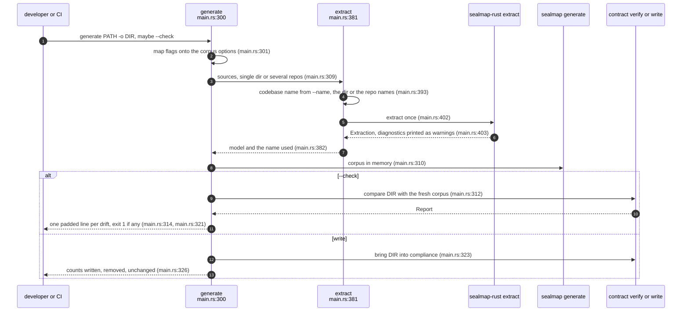
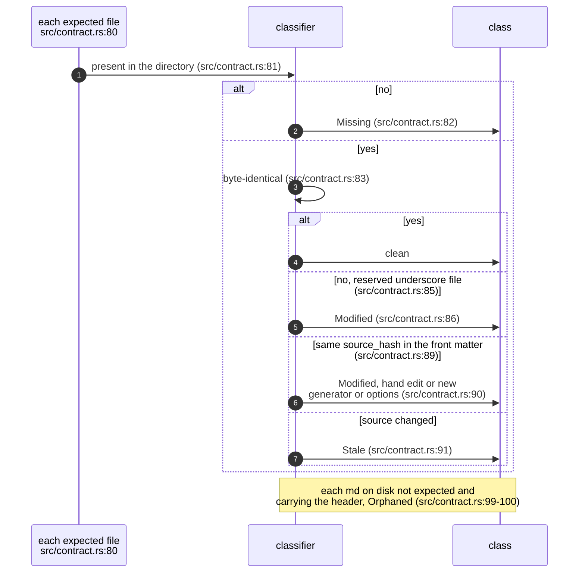
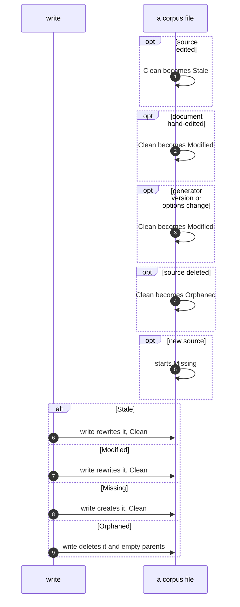
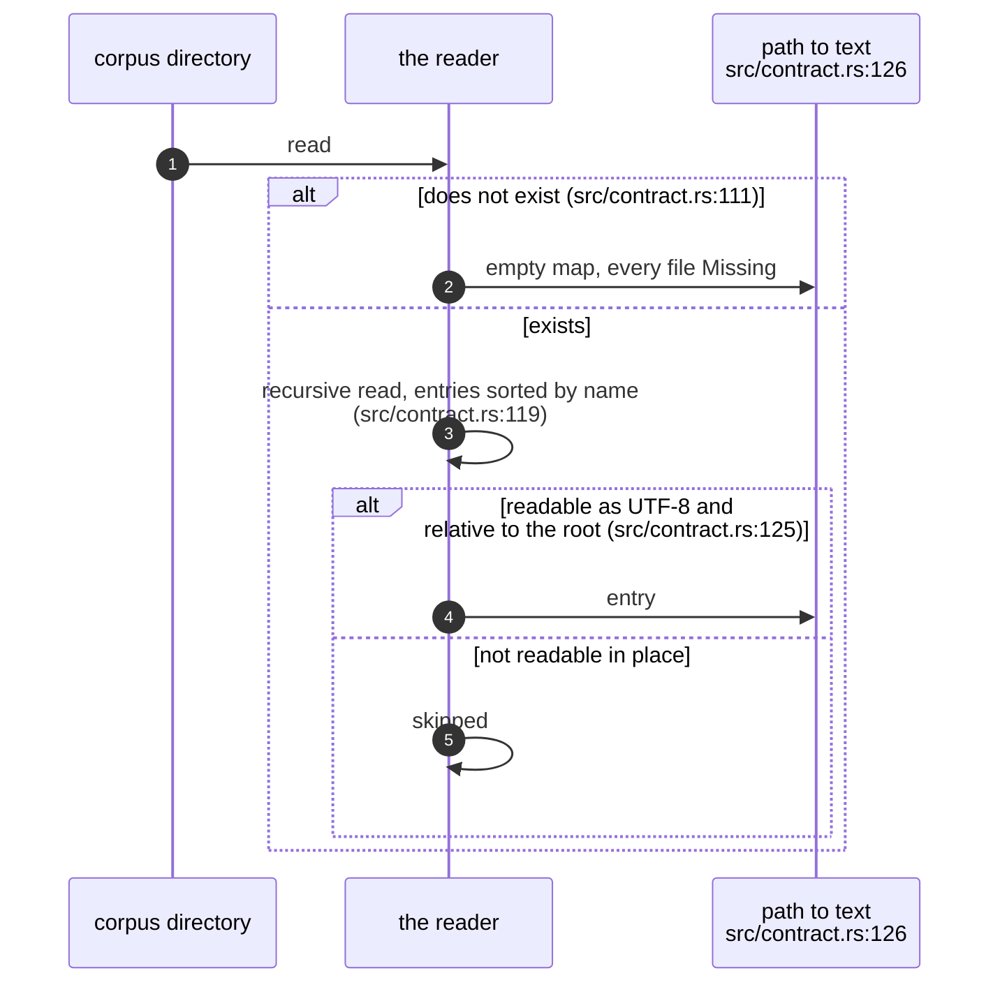
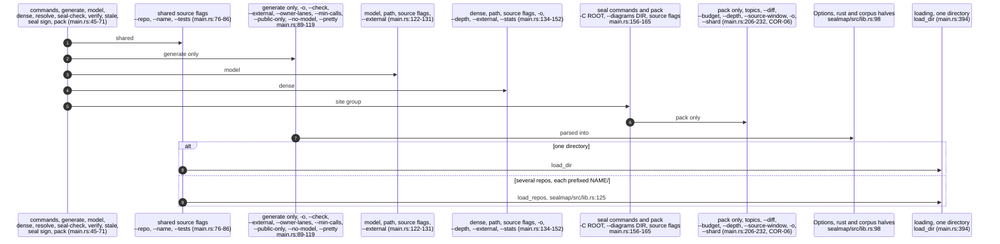

## For developers

`verify` and `write` in `contract.rs` are the 0.1 contract between a generated
corpus and a directory on disk. `verify_against` compares a freshly generated
`Corpus` with what a directory holds and classifies every difference as
missing, orphaned, stale or modified; `write` brings the directory into
compliance and only ever deletes files that carry the generator's header
(`crates/sealmap-corpus/src/contract.rs:1`-`2`,
`crates/sealmap-corpus/src/lib.rs:12`-`29`).

Since step 3 the command line reaches that contract only through
`sealmap generate`: plain `generate` writes, and `generate --check` compares
and writes nothing (`crates/sealmap/src/main.rs:311`-`322`). The name `verify`
now belongs to the seal gate (COR-04, COR-05), and nothing generated is
committed; CI checks instead that two fresh generations agree (DEL-01). This
topic draws the generate path, the drift classes and the shared flags.

## For the business

The generated corpus is a view, rebuilt in seconds whenever someone wants it,
and never a file set a pipeline has to keep in step. A developer who keeps a
copy on disk can ask whether it is still current with one flag, and gets an
exact answer: which files are missing, which are left over, which are out of
date because the code changed, and which were edited by hand or by a
different generator version.

For an adopter migrating from 0.1, the one change to plan for is the name:
a pipeline that ran `sealmap verify` against a committed corpus now wants
`sealmap generate --check`, and `sealmap verify` means the seal gate.

## COR-03.1 sealmap generate, end to end

**What it shows.** Both branches regenerate the whole corpus in memory first;
`--check` then compares and `write` repairs, and nothing is trusted from disk
except the bytes being compared.

**Why it is this way.** The extraction helper returns the codebase name it
used, so `stale --since` can read a second tree under the same name
(`crates/sealmap/src/main.rs:378`-`381`). Errors in arguments or IO exit 2,
drift under `--check` exits 1 (`crates/sealmap/src/main.rs:256`,
`crates/sealmap/src/main.rs:321`). A drift name is padded through
`to_string`, because `Drift`'s `Display` writes with `write_str` and ignores a
width (`crates/sealmap/src/main.rs:314`,
`crates/sealmap-corpus/src/contract.rs:32`).

## COR-03.2 Classifying a difference

**What it shows.** The front-matter source hash is what separates "the code
changed" from "the document was touched"; anything in the directory that is
not a generated document is ignored.

**Why it is this way.** Recording the source hash in each document makes drift
detectable without re-parsing the old state (`crates/sealmap-corpus/src/lib.rs:16`-`17`);
`verify_classifies_every_kind_of_drift` pins all four classes
(`crates/sealmap-corpus/tests/contract.rs:106`).

**Debt:** a reserved file is always `Modified` when it differs
(`crates/sealmap-corpus/src/contract.rs:85`-`86`), even when the difference is
that the code changed, so `_index.json` and `_model.json` never report stale.

## COR-03.3 A corpus file's drift states

**What it shows.** Every drift is repaired by `write` in one step: stale,
modified and missing files are written, orphaned generated documents are
deleted, and unchanged files are not touched.

**Why it is this way.** Untouched files keep their mtimes, so a re-run is cheap
for anything watching the directory (`crates/sealmap-corpus/src/contract.rs:138`-`141`);
`write_converges_and_is_idempotent` pins that a second `write` changes
nothing (`crates/sealmap-corpus/tests/contract.rs:138`).

**Invariant:** `write` deletes only Markdown files whose YAML front matter
opens on the first line (`---`) and whose first key is the `sealmap: `
marker; a file that merely mentions the marker anywhere else is never touched
(`crates/sealmap-corpus/src/contract.rs:99`, `crates/sealmap-corpus/src/document.rs:153`-`155`).

## COR-03.4 Reading a directory

**What it shows.** The directory is read into the same path-to-text map the
generator produces, in sorted order, so the comparison is a map diff.

**Why it is this way.** Sorting entries keeps the report order independent of
the file system (`crates/sealmap-corpus/src/contract.rs:119`); the whole corpus
can also be summarised as one hash for cheap cross-machine equality
(`crates/sealmap-corpus/src/contract.rs:174`-`183`).

## COR-03.5 Commands, flags and the facade

**What it shows.** Every command shares the flags that shape ids; only
`generate` carries the projection flags, and `model` takes the external-call
policy because it changes the flows it prints. The seal commands and `pack`
share one `Site` group (root, topic directory, source flags); the report
flags `--json` and `--all` sit beside it only where a command reports. Several repositories are
loaded into one `SourceSet` under name prefixes, so calls between them
resolve and the overview groups crates by repository
(`crates/sealmap/src/lib.rs:112`-`113`).

**Why it is this way.** The source flags decide which symbols exist and what
they are called, so a seal must be checked with the flags it was signed with
(`crates/sealmap/src/main.rs:73`-`74`); the facade exists so the common path
is one dependency (`crates/sealmap/src/lib.rs:35`-`36`), and the CLI is behind
the default `cli` feature, so a library user does not pull in clap.
