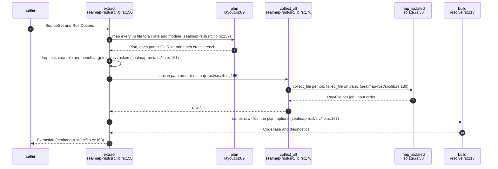
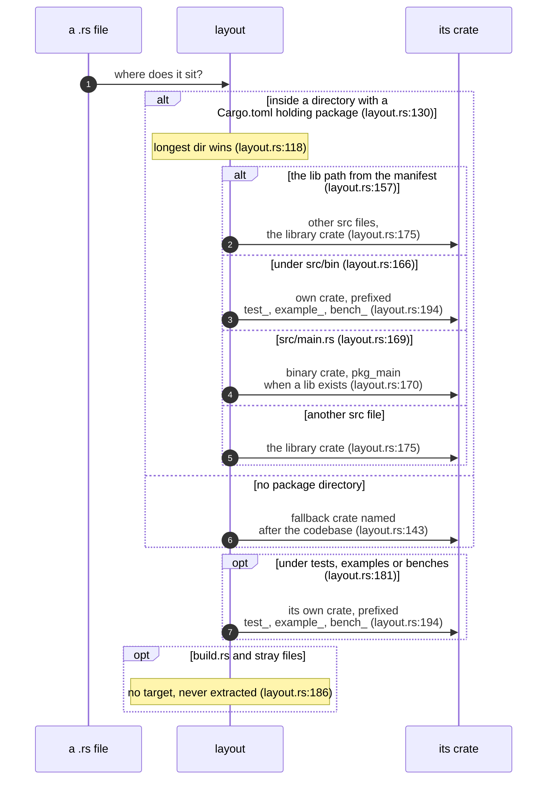
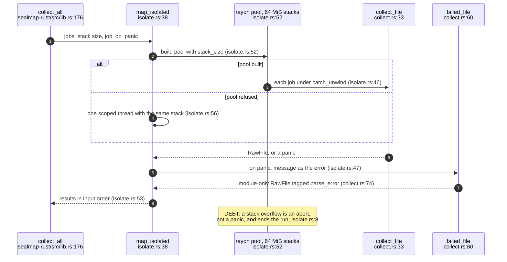
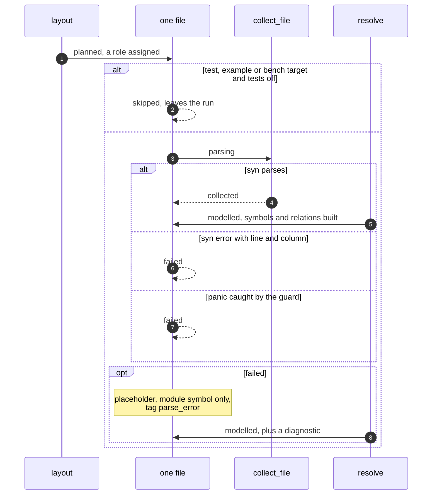
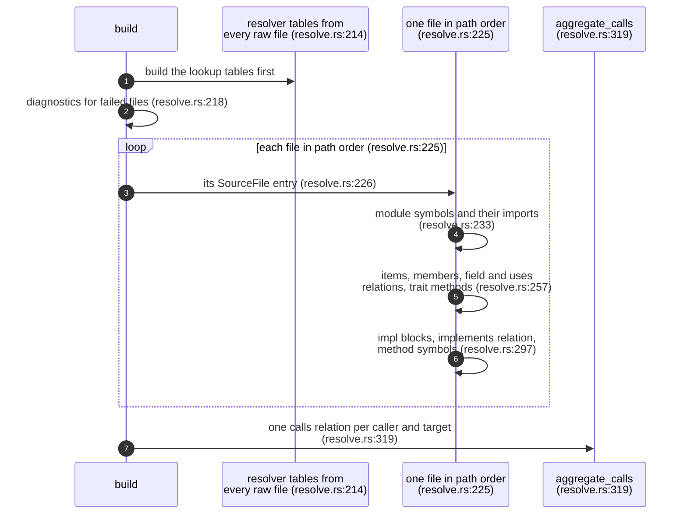

## For developers

A language adapter turns a `SourceSet` into a `Codebase` in three passes:
**layout** maps each file to a crate and module path by Cargo's conventions,
**collect** parses each file on its own into plain owned data, and
**resolve** builds the model from all of it in one sequential pass
(`crates/sealmap-rust/src/lib.rs:14`-`30`). `sealmap-rust` is the only adapter
today; the language-neutral half it shares with any future adapter lives in
`sealmap-extract`, split out in commit `a02b381` with byte-identical output
before and after (`docs/DESIGN.md:131`).

This topic is the skeleton those passes hang on: the `extract` entry point,
the Cargo layout rules, the panic-isolated big-stack collection that came
from the hardening work (`docs/DESIGN.md:232`), and the order in which
`resolve::build` assembles the model. The passes' insides are their own
topics: ids (EXT-02), the flow walker (EXT-03), lowering and confidence
(EXT-04), resolution (EXT-05) and fingerprints (EXT-06).

## For the business

The adapter is the part that reads an adopter's code, so it decides what
running sealmap costs and whether it can be trusted on a real repository.
Three properties come from this skeleton. It never compiles anything, so it
runs on any checkout, including one that does not build, and needs no
toolchain at run time. It never fails a whole run because of one bad file:
a file that does not parse, or that trips a bug, becomes a warning and a
placeholder entry. And it is fast enough to sit in CI: the README records
1.13 s for a 934-file workspace (`README.md:332`).

The residual risk is a file nested deeply enough to exhaust even the large
stack: that still ends the process, because a stack overflow cannot be
caught.

## EXT-01.1 One call from sources to model

**What it shows.** Extraction never fails: unparsable files surface in
`Extraction::diagnostics` (`crates/sealmap-rust/src/lib.rs:153`-`155`), and
everything between collection and resolution is owned data, so the parallel
and the sequential halves meet only in a `Vec<RawFile>`.

**Why it is this way.** Collecting to plain strings and vectors lets files be
parsed in parallel and resolved afterwards in one deterministic pass
(`crates/sealmap-rust/src/raw.rs:3`-`6`, drawn as the IR in EXT-3).

**Invariant:** parallel collection returns results in input order, so the
model is identical with or without the `parallel` feature
(`crates/sealmap-rust/src/lib.rs:72`-`75`).

## EXT-01.2 Where a file sits in the workspace

**What it shows.** Packages are discovered from every `Cargo.toml` that has a
`[package]` table; the longest matching directory wins, so nested packages
beat their parents; each binary, test, example and bench target becomes a
crate of its own.

**Why it is this way.** Separate crates per target mean a binary and the
library never share an id (`crates/sealmap-rust/src/lib.rs:36`-`38`); the
`_main` suffix applies only when a library exists to collide with
(`crates/sealmap-rust/src/layout.rs:170`). Crate names replace `-` with `_`,
as Rust paths do (`crates/sealmap-rust/src/layout.rs:110`). The plan also
records, per crate, the workspace crates its manifest lets it name, which
bounds the resolver's name-only guesses (`crates/sealmap-rust/src/layout.rs:135`, EXT-05).

**Open:** packages come from any manifest with a `[package]` table
(`crates/sealmap-rust/src/layout.rs:91`-`97`); `[workspace]` membership and
`exclude` are never read, so is a package the workspace excludes meant to
appear in the model?

## EXT-01.3 Big stacks and a panic guard

**What it shows.** Every file is collected on a thread with a 64 MiB stack;
a panic in one file becomes a placeholder `RawFile` whose error becomes a
diagnostic, and the run continues.

**Why it is this way.** The VisionClaw stack overflow came from deeply nested
generics on rayon's default 2 MiB stacks (`docs/DESIGN.md:232`); syn costs
about 40 KiB per nesting level in a debug build
(`crates/sealmap-extract/src/isolate.rs:3`-`7`). Address space is reserved,
not memory, so the large stack is cheap (`crates/sealmap-extract/src/isolate.rs:27`-`29`).
The flow walker's own depth cap is the second guard
(`crates/sealmap-rust/src/collect.rs:30`).

**Invariant:** behaviour does not depend on the `parallel` feature: without
it, or if the pool cannot be built, the same stack size is used on one scoped
thread (`crates/sealmap-extract/src/isolate.rs:34`-`37`).

## EXT-01.4 What becomes of one file

**What it shows.** A file either leaves the run because its target is
excluded, or ends up in the model; a failed file is represented by its module
alone, tagged `parse_error`, with its error reported.

**Why it is this way.** Keeping a module symbol for a failed file keeps the
1:1 corpus contract (one document per source) true even for broken code
(`crates/sealmap-rust/src/collect.rs:57`-`59`). The placeholder's
fingerprints hash the raw text, so any edit to a broken file still shows
(`crates/sealmap-rust/src/collect.rs:62`).

**Invariant:** a parse error's message carries the `line:col` of the error
(`crates/sealmap-rust/src/collect.rs:47`), and `build` emits one diagnostic
per failed file in file order (`crates/sealmap-rust/src/resolve.rs:218`-`222`).

## EXT-01.5 The order resolve builds the model in

**What it shows.** Lookup tables are built from all files first, then each
file contributes its file entry, modules, items and impls in that order, and
call edges are aggregated from the finished flows last.

**Why it is this way.** Modules and items go first so field types are known
before any flow is resolved (`crates/sealmap-rust/src/resolve.rs:224`); call
relations come from flows rather than being recorded during the walk, so the
edge confidence is the strongest of the calls behind it (EXT-4).
