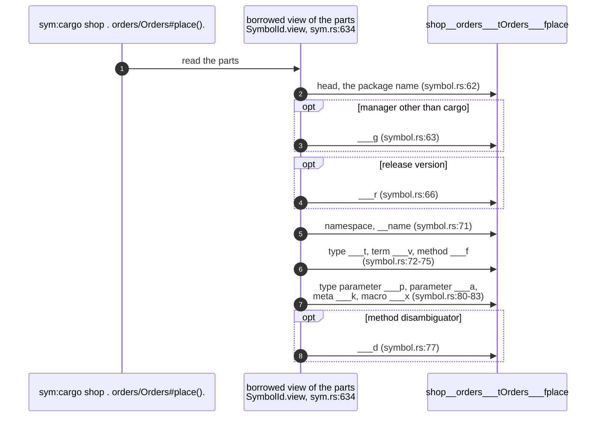
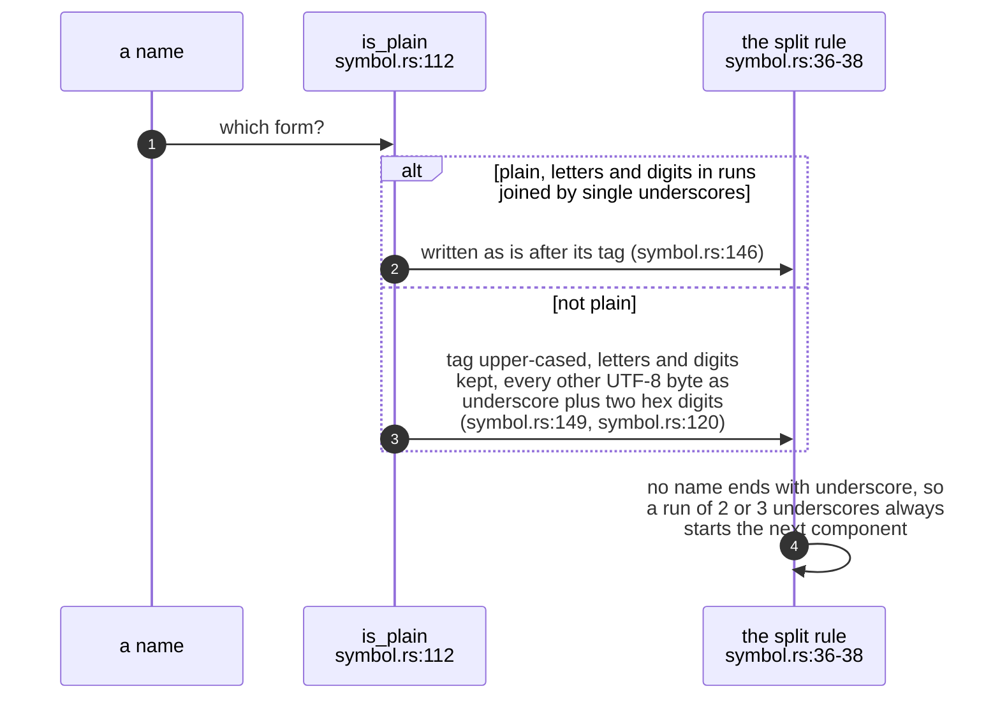
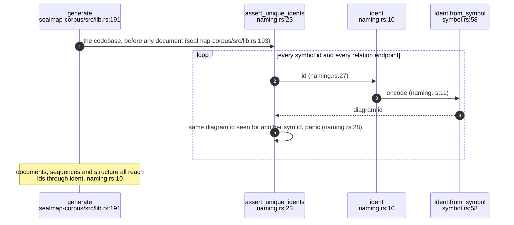
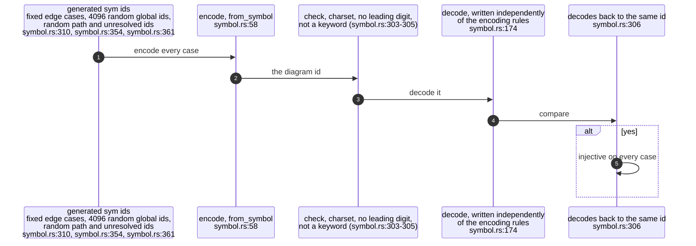
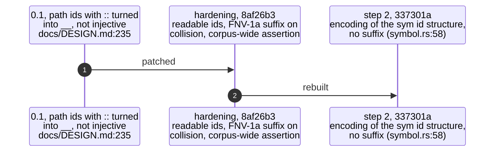

## For developers

A Mermaid id may hold only letters, digits and underscores, but a `sym:` id
holds spaces, slashes, hashes, brackets, backticks and arbitrary Unicode.
`Ident::from_symbol` maps one to the other by an encoding that is
**injective by construction**: two different `SymbolId`s never produce the
same diagram id, with no hash suffix and no collision handling
(`crates/sealmap-mermaid/src/symbol.rs:10`-`12`). Where names are plain the
id stays readable: `sym:cargo shop . orders/Orders#place().` becomes
`shop__orders___tOrders___fplace` (`crates/sealmap-mermaid/src/symbol.rs:49`).

This is what lets diagrams drawn separately, in different documents, be
concatenated, merged or diffed by id (`crates/sealmap-corpus/src/lib.rs:64`-`69`).
The encoding replaced, in commit `337301a`, a readable-plus-FNV-1a-suffix
scheme from the hardening commit `8af26b3`, which in turn replaced 0.1's
non-injective `::` → `__` mangling (`docs/DESIGN.md:235`). The corpus still
asserts uniqueness over every generated codebase as a guard. This topic draws
the encoding, why it cannot collide, the proof the tests give, and where ids
are still minted the lossy way.

## For the business

When two different functions share a diagram id, Mermaid silently draws them
as one box. Every arrow into either looks like an arrow into both, and a
reviewer reading the diagram is told something false with nothing on the page
to warn them. In 0.1 that could happen; the self-corpus test that pins the fix
uses exactly such a pair (`crates/sealmap-corpus/tests/contract.rs:165`).

For an adopter this closes a class of silent error rather than reducing its
odds: ids are distinct because of how they are written, not because a check
happened to pass. The readable form also keeps diagrams cheap for a model to
read, since most ids are just the path with separators.

## MER-02.1 Encoding a global id

**What it shows.** The package is the head; each descriptor appends one
component, a module with two underscores and every other kind with three plus a
tag letter; a non-default manager or a release version adds its own tagged
component after the head.

**Why it is this way.** The encoding reads the id through `SymbolId::view`, a
borrowed view that allocates nothing per call site, which was added for this
encoder (`crates/sealmap-model/src/sym.rs:615`-`618`). Path ids start with a
single `_` and unresolved ids with `__u`, so the three id forms never share a
head (`crates/sealmap-mermaid/src/symbol.rs:87`-`102`).

**Invariant:** an encoded id that equals a Mermaid keyword gets `___z`, which
no other rule produces (`crates/sealmap-mermaid/src/symbol.rs:104`-`106`).

## MER-02.2 Plain names and escaped names

**What it shows.** A plain name is copied; any other name is byte-escaped and
flagged by an upper-case tag (`___T`, `___F`, `___N`, `__P` for a head), so a
reader of the id knows which form follows.

**Why it is this way.** The split rule is what makes the encoding injective:
underscores after a name always open the next component, and inside an
escaped name an underscore is always followed by a hex digit, so an id splits
back into exactly one sequence of components
(`crates/sealmap-mermaid/src/symbol.rs:36`-`42`).

**Invariant:** `b__c#` and `b/c#`, and `foo/` and `foo().`, the pairs 0.1's
mangling merged, get different ids (`crates/sealmap-mermaid/src/symbol.rs:54`-`56`).

## MER-02.3 Where diagram ids are minted during generation

**What it shows.** Before writing anything, generation encodes every symbol
and every relation endpoint and panics if two distinct ids share a diagram id.

**Why it is this way.** The encoder is injective by construction; the guard
exists so a future change to either grammar cannot silently merge nodes
(`crates/sealmap-corpus/src/naming.rs:14`-`18`), and the design keeps it as an
explicit requirement (`docs/DESIGN.md:134`).

**Debt:** the overview's crate graph mints its node ids with the lossy
`Ident::new` from crate and external root names
(`crates/sealmap-corpus/src/overview.rs:109`,
`crates/sealmap-corpus/src/overview.rs:119`), outside the uniqueness guard,
so two external roots that differ only in characters outside the id charset
share one node.

## MER-02.4 The injectivity proof

**What it shows.** The tests carry an inverse of the encoding, written from the
rules rather than from the encoder, and require every generated id to decode
back to the symbol it came from.

**Why it is this way.** A function with a left inverse is injective, so
"every id decodes back" is the proof, not merely a sample of non-collisions
(`crates/sealmap-mermaid/src/symbol.rs:171`-`173`).

## MER-02.5 Three generations of diagram id

**What it shows.** The id scheme was replaced twice in one day: first patched
with a collision suffix, then rebuilt on the typed `sym:` id.

**Why it is this way.** Once ids had structure, the structure could be encoded
directly, and the suffix and its dead helper were removed (commit `337301a`).
The README describes the current scheme (`README.md:210`-`213`).

The design's hardening table now records the fix as it was built: injective
readable ids derived from `sym:` ids, with no hash suffix
(`docs/DESIGN.md:235`), as the code has it
(`crates/sealmap-mermaid/src/symbol.rs:10`-`12`).
