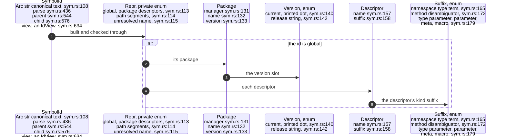
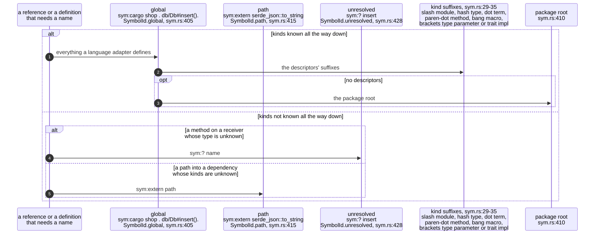
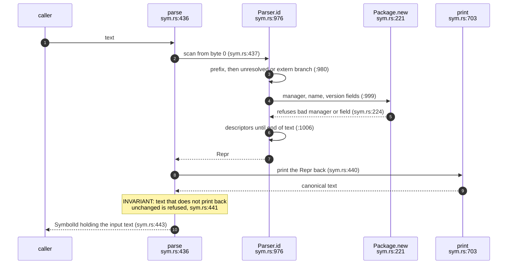
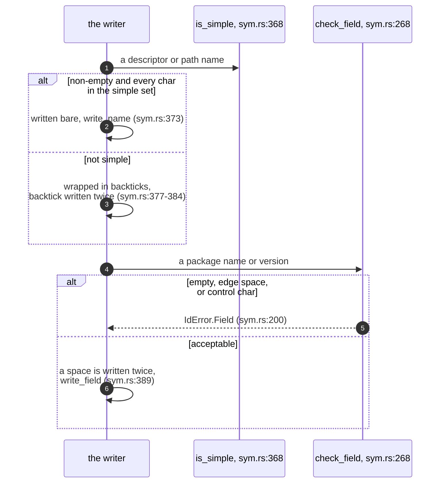
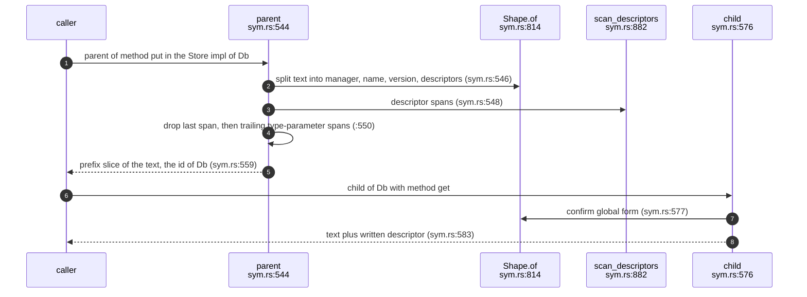
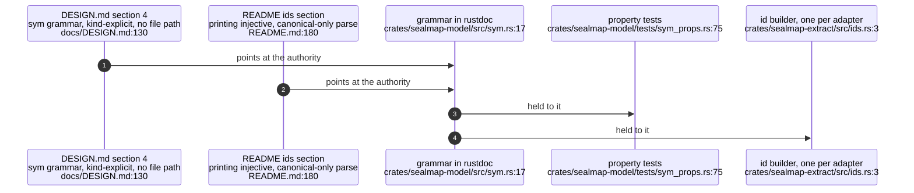

## For developers

Every symbol sealmap knows about is named by a `SymbolId`, a string in a
SCIP-descriptor-style grammar that carries no file path and no line number
(`crates/sealmap-model/src/sym.rs:18` holds the grammar). This topic is the
contract for that string: its three forms, how it is printed and parsed, why
printing is injective, and how a parent or child id is derived without
allocating. After reading it you should be able to read any id in a
generated model, predict the id a definition will get, and know which
operations are cheap.

The id is the identity half of rustc's identity/freshness split
(`crates/sealmap-model/src/sym.rs:3`-`9`): the content half lives in
fingerprints (MOD-02). It was introduced in commit `5973a4e` as step 2 of the
0.2 plan (`docs/DESIGN.md:296`), replacing the 0.1 `::` path ids whose
`::` → `__` mangling was not injective (`docs/DESIGN.md:235`).

The builder that mints ids for real definitions is `sealmap-extract`'s
`ids` module (EXT-02); this topic covers the grammar it targets. What this
topic does not cover: the Mermaid id derived from a `SymbolId` (MER-02) and
the JSON schema that carries ids (MOD-03).

## For the business

A diagram corpus is only as trustworthy as its citations. Today a citation
written as a file and line breaks the moment someone moves the code, and an
agent harness then pays to re-read and re-stamp topics that did not change in
substance. The `sym:` id is the part of sealmap that removes that cost at the
root: it names a function by where it sits in the program, so moving it
between files changes nothing, while renaming it or moving it to another
module is a visible change.

For a harness owner the property that matters is that the name is exact and
unambiguous. Two different functions can never print the same id, and a
mistyped id is refused rather than quietly matched to something close. That
is what later lets a seal say "this topic was reviewed against exactly these
functions" (built, see COR-04) and be believed in CI without a model
in the loop.

## MOD-01.1 The id's shape as types

**What it shows.** A `SymbolId` stores only its canonical text in an
`Arc<str>`; the structured `Repr` exists to build and validate that text and
is reconstructed on demand. A global id is a package (manager, name,
version) plus a list of descriptors, each a name with a kind suffix.

**Why it is this way.** Holding the text means equality, ordering and hashing
are plain string operations, and a parent sorts before its children because
its text is a prefix of theirs (`crates/sealmap-model/src/sym.rs:101`-`104`).
The owner chose SCIP's descriptor suffixes so a global id maps to a SCIP
symbol by swapping the prefix (`crates/sealmap-model/src/sym.rs:11`-`13`),
which is what keeps a later `export --scip` cheap (`docs/DESIGN.md:164`).

**Invariant:** two ids are equal exactly when their texts are, because only
canonical text is ever stored; `parse` refuses anything that does not print
back unchanged (`crates/sealmap-model/src/sym.rs:440`).

**Debt:** the structural accessors `package()` and `descriptors()` re-run the
full parser over the text on every call through `repr()`
(`crates/sealmap-model/src/sym.rs:456`, `crates/sealmap-model/src/sym.rs:475`),
and `repr()` panics through `expect` if the text were ever non-canonical; only
`view()` and the scanner avoid the reparse.

## MOD-01.2 Three forms and their suffixes

**What it shows.** Everything a language adapter defines gets a global id;
a path into a dependency whose kinds are unknown is a `sym:extern` path id;
a method called on a receiver of unknown type is `sym:? name`
(`crates/sealmap-model/src/sym.rs:50`-`57`).

**Why it is this way.** The version slot is `.` for "the tree being
analysed", so publishing a release does not churn every id
(`crates/sealmap-model/src/sym.rs:51`-`52`). The `[Trait]` descriptor doubles
as the marker of a trait-impl block, so `Db#[Store]put().` names `put` from
`impl Store for Db` and still has `Db#` as its parent
(`crates/sealmap-model/src/sym.rs:176`-`178`).

**Invariant:** `extern` can never be a manager name, so the path form cannot
be confused with a global id (`crates/sealmap-model/src/sym.rs:263`).

**Open:** `Version::Release` is part of the grammar
(`crates/sealmap-model/src/sym.rs:142`), but the only id builder mints
packages at the current tree (`crates/sealmap-extract/src/ids.rs:57`); no
record says when, or by whom, a release-versioned id is meant to be minted.

## MOD-01.3 Parsing is the exact inverse of printing

**What it shows.** The parser builds a `Repr`, then prints it and compares
the result with the input. Only text that survives the round trip becomes an
id, so a simple name wrapped in backticks, a doubled separator or a trailing
space is an error rather than an alias.

**Why it is this way.** Ids are compared by text, so two spellings of one
symbol would silently be two symbols. The round-trip guard makes that
impossible by construction; the parser also refuses a simple name that was
needlessly quoted (`crates/sealmap-model/src/sym.rs:1049`-`1051`). The
property tests state the same contract from outside: printing then parsing
gives the id back (`crates/sealmap-model/tests/sym_props.rs:79`) and any
accepted text is canonical (`crates/sealmap-model/tests/sym_props.rs:130`).

**Invariant:** two distinct ids never print the same text, checked over 4,096
generated cases (`crates/sealmap-model/tests/sym_props.rs:85`).

## MOD-01.4 Escaping names and package fields

**What it shows.** Names outside `[A-Za-z0-9_+$-]` are quoted in backticks
with backticks doubled; package fields keep their spaces but write each one
twice, so a single space always separates fields.

**Why it is this way.** SCIP's own space rule is ambiguous at field edges;
forbidding a leading or trailing space closes that ambiguity
(commit `5973a4e`, pinned by the edge-space assertion in
`crates/sealmap-model/tests/sym_props.rs:123`). The scanner relies on it: an
odd-length run of spaces is a separator
(`crates/sealmap-model/src/sym.rs:829`-`832`).

**Invariant:** pairs that the 0.1 `::` → `__` mangling merged, and pairs
SCIP's space escaping would merge, print differently
(`crates/sealmap-model/tests/sym_props.rs:102`).

## MOD-01.5 Navigating without reparsing

**What it shows.** `parent()` and `child()` work on the canonical text: the
parent is a prefix slice of the child's text, and a child is the parent's text
with one descriptor appended. Neither runs the parser.

**Why it is this way.** Corpus generation derives a parent or owner for every
call site, so these sit on the hot path; the borrowed scanner
(`crates/sealmap-model/src/sym.rs:796`-`800`) never allocates unless a name
needs unescaping. Dropping trailing type-parameter descriptors is what makes a
trait-impl method's parent its type rather than the impl block.

**Invariant:** a parent always sorts before its child, because its text is a
strict prefix of the child's (`crates/sealmap-model/tests/sym_props.rs:92`).

## MOD-01.6 Where the grammar is documented and claimed

**What it shows.** The design and the README both point at the rustdoc
grammar as the authority, and the property tests and the shared id builder
are the two things that hold the code to it.

**Why it is this way.** The README says the grammar "is documented in
`sealmap_model::sym`" (`README.md:181`) rather than restating it, so there is
one source; the README's example table (`README.md:169`-`175`) is
illustrative.
