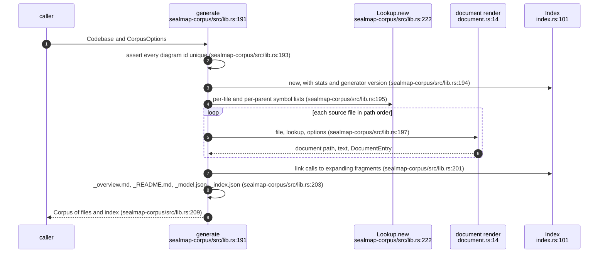
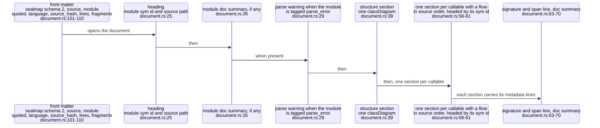
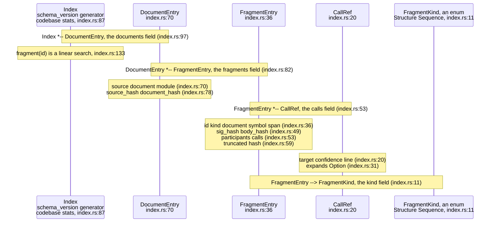
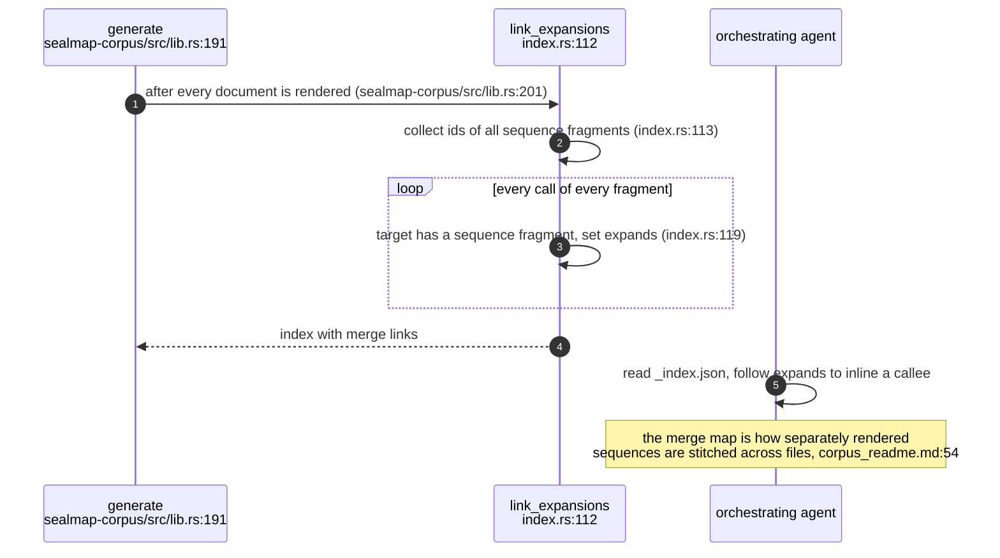
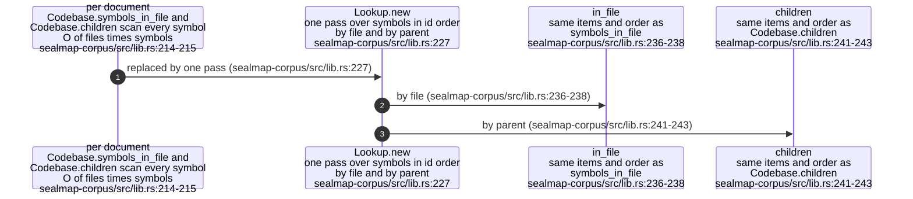

## For developers

`sealmap_corpus::generate` projects a `Codebase` into an in-memory map from
output path to text: exactly one Markdown document per source file, plus four
reserved files whose names start with `_` and so never collide with a source
(`crates/sealmap-corpus/src/lib.rs:12`-`58`). It is pure: equal inputs give
byte-identical output (`crates/sealmap-corpus/src/lib.rs:189`-`190`), and every
`CorpusOptions` field is part of that identity, so changing one is reported as
drift by `verify` (`crates/sealmap-corpus/src/lib.rs:130`-`132`).

This topic covers the orchestration, the anatomy of a document, and the
`_index.json` merge map that links every call to the fragment that expands it.
The diagrams inside a document are COR-02; checking and writing a directory is
COR-03. Under the accepted design this 1:1 corpus stopped being a committed,
CI-gated artefact and is an optional view under a gitignored `.sealmap/`
(`docs/DESIGN.md:41`, `docs/DESIGN.md:44`-`48`); the code that produces it was
unchanged by that decision.

## For the business

The generated corpus is the mechanical half of the workflow: it is what an
agent reads when it needs the facts about a file without opening the code, and
what an orchestrating agent stitches together to follow a request across
files. Its value to an adopter is that it costs no model tokens to produce and
is identical every time, so it can be regenerated on demand rather than stored
and maintained.

The design's own measurement is the caution: a one-document-per-file Mermaid
corpus is about the same size as the source (`README.md:59`), so it is not a
compression and not what people should read. Its job is to be a reliable,
linkable substrate, not the human map.

## COR-01.1 One call to generate

**What it shows.** Generation is a single pass over files in path order, with
the cross-document work (id uniqueness up front, expansion links and the
corpus-level files at the end) around it.

**Why it is this way.** `_model.json` is optional (`emit_model`), the others
are always written (`crates/sealmap-corpus/src/lib.rs:205`-`208`). JSON is
compact by default because it is roughly half the size of pretty output
(`crates/sealmap-corpus/src/lib.rs:153`-`155`).

**Debt:** the index records its generator as `sealmap-corpus` plus the crate
version (`crates/sealmap-corpus/src/index.rs:104`), so a version bump with no
other change rewrites `_index.json`, and a kept copy reports drift under
`generate --check` on every release.

## COR-01.2 Anatomy of a document

**What it shows.** A document is front matter, a heading naming the module by
its `sym:` id, an optional structure diagram and one sequence diagram per
callable that makes calls.

**Why it is this way.** Callables are ordered by span rather than id because
source order reads better inside one file (`crates/sealmap-corpus/src/document.rs:57`).
The module id is a JSON-quoted YAML scalar, so ids holding `: ` or ` #` cannot
be misread as structure or comments (`crates/sealmap-corpus/src/document.rs:124`-`128`),
and headings use a longer code fence when an id holds backticks
(`crates/sealmap-corpus/src/document.rs:130`-`134`).

**Invariant:** every generated document opens with `---` front matter whose
first key is the `sealmap: ` marker, and `write` only ever deletes files
whose front matter starts that way
(`crates/sealmap-corpus/src/document.rs:10`-`12`).

## COR-01.3 The index as types

**What it shows.** The index lists every document and fragment with its
participants, its calls in source order, the symbol's fingerprints and a hash
of the fragment's own Mermaid text.

**Why it is this way.** A fragment's id is its symbol's `sym:` id for a
sequence and `structure:<file>` for a structure diagram, unique across the
corpus (`crates/sealmap-corpus/src/index.rs:37`-`38`); the fragment hash exists
so an orchestrator can cache merged results (`crates/sealmap-corpus/src/index.rs:60`).
Fingerprints were added to fragments with schema v2
(`crates/sealmap-corpus/src/lib.rs:114`).

**Invariant:** `_index.json` and `_model.json` carry ids, spans and
fingerprints in schema v2, pinned by
`schema_v2_json_carries_ids_spans_and_fingerprints`
(`crates/sealmap-corpus/tests/contract.rs:190`).

## COR-01.4 Linking calls to the fragments that expand them

**What it shows.** Once all fragments exist, each call whose target has a
sequence of its own gets an `expands` link to it, which is the whole merge map.

**Why it is this way.** Because a fragment id is the callee's `sym:` id, the
link is a lookup, not a guess (`crates/sealmap-corpus/src/lib.rs:50`-`53`);
`index_links_calls_to_expanding_fragments` pins it
(`crates/sealmap-corpus/tests/contract.rs:79`).

## COR-01.5 Per-file lookups built once

**What it shows.** The corpus builds its own per-file and per-parent indexes
once per generation instead of calling the model's linear scans per document.

**Why it is this way.** It was part of the hardening (commit `8af26b3`); the
lists keep the order the linear scans produced, so output did not change
(`crates/sealmap-corpus/src/lib.rs:225`-`226`).

**Invariant:** generation is byte-identical across runs and regardless of the
order sources were inserted (`crates/sealmap-corpus/tests/contract.rs:93`).
