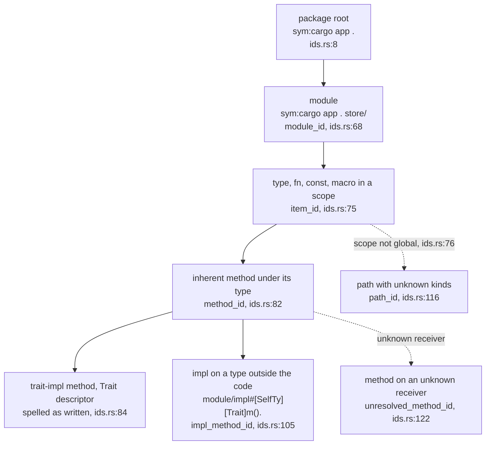
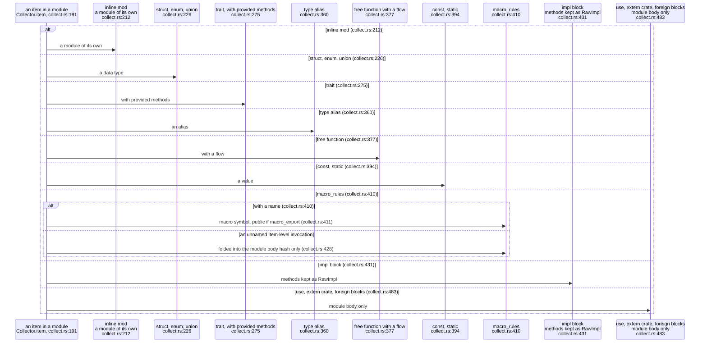
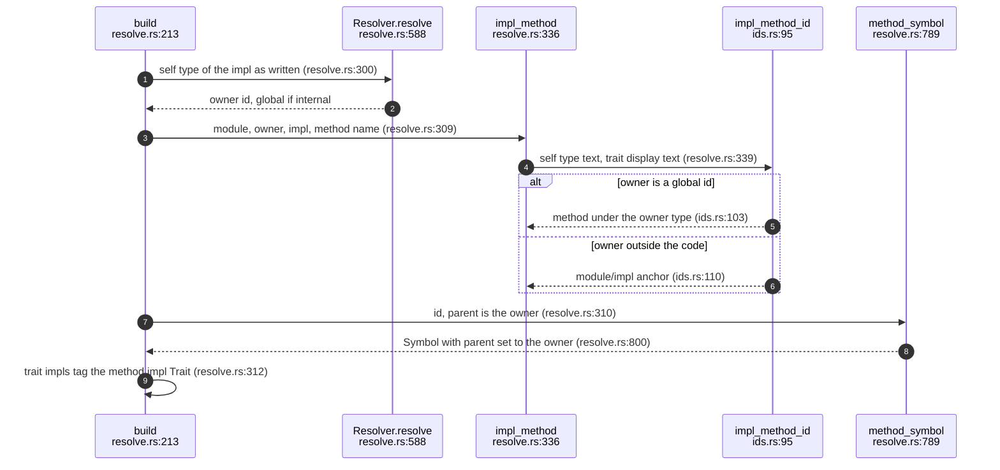
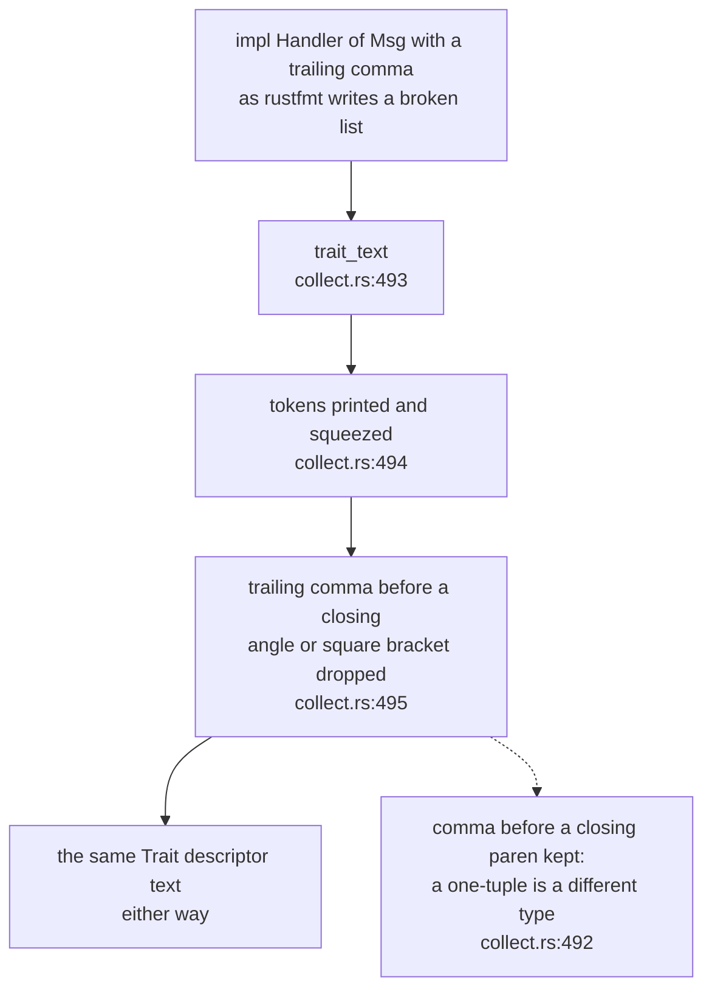
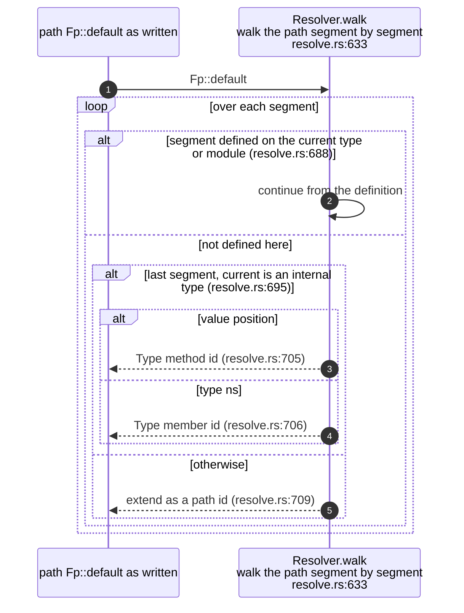

## For developers

The grammar in MOD-01 says what an id may look like; this topic says which id
each Rust definition actually gets. Every id an adapter mints goes through
`sealmap_extract::ids` (`crates/sealmap-extract/src/ids.rs:3`-`4`), so two
adapters can only ever disagree about what they collect, never about how an
id is spelled. The Rust collector decides which items become symbols, and the
resolver decides which type a method belongs to.

The rule that matters most is that a method sits under the type that owns
it, never under its `impl` block (`crates/sealmap-extract/src/ids.rs:20`-`28`):
splitting an `impl` or moving it to another file keeps every method id. The
README promises the same thing to users (`README.md:177`-`179`). This came
with the grammar in commit `5973a4e`; the undefined-member rule at the end of
this topic came with the dogfood fix in `6c8a9b0`.

## For the business

A seal is a promise about named functions, so the names have to stay put when
the code is merely tidied. This topic is where that is decided for Rust.
Reorganising methods across `impl` blocks or files, the most common
refactor in a growing Rust codebase, changes no name and therefore invalidates
no reviewed diagram. A real rename, or moving a function to another module,
does change the name, which is what a reviewer would expect to look at again.

One limit for adopters to know: items that a macro generates are not seen,
so they get no name and cannot be cited or sealed (`README.md:342`).

## EXT-02.1 The id table

**What it shows.** Each kind of definition and reference has one builder.
A trait-impl method adds a `[Trait]` descriptor before the method name; an
impl on a type the code does not define is anchored in the module holding
the impl, after rust-analyzer's `impl#[SelfType][Trait]` form
(`crates/sealmap-extract/src/ids.rs:25`-`28`).

**Why it is this way.** The trait is spelled as the impl writes it, generic
arguments kept, so `impl From<A>` and `impl From<B>` give two ids
(`crates/sealmap-extract/src/ids.rs:23`-`25`). A scope that is not a global id
degrades to a path id instead of failing (`crates/sealmap-extract/src/ids.rs:76`).

**Invariant:** building an id never fails: a package name the grammar cannot
hold is repaired to `_`, and an invalid manager falls back to `unknown _ .`
(`crates/sealmap-extract/src/ids.rs:57`-`63`).

## EXT-02.2 Which Rust items become symbols

**What it shows.** Modules, data types, traits, aliases, functions, constants,
statics and named macros become symbols; methods arrive through impl blocks
and are given ids in the resolve pass; everything else only feeds the
module's body fingerprint.

**Why it is this way.** An item-level macro invocation such as
`thread_local!` has no name to cite, so the only honest thing to record is
that the module changed when it changes (`crates/sealmap-rust/src/collect.rs:427`-`428`).

**Debt:** the test filter (`self.skip`) is applied to modules, structs,
enums, traits, functions and impls, but not to unions, type aliases,
constants, statics or macros (`crates/sealmap-rust/src/collect.rs:237`,
`crates/sealmap-rust/src/collect.rs:360`,
`crates/sealmap-rust/src/collect.rs:394`); a top-level `#[cfg(test)]` const
is modelled even when tests are excluded.

## EXT-02.3 A method's owner is resolved, then the id is built

**What it shows.** The impl's self type is resolved through imports and
modules first; only then is the method id built, so several inherent impls
of one type, in any files, produce methods under one owner.

**Why it is this way.** Inherent impls are registered before trait impls so
that an inherent method wins a name lookup over a trait method of the same
name (`crates/sealmap-rust/src/resolve.rs:557`-`559`).

**Invariant:** a trait-impl method is recorded as public whatever its
written visibility, because trait methods are as visible as the trait
(`crates/sealmap-rust/src/collect.rs:458`).

## EXT-02.4 Formatting never reaches an id

**What it shows.** The trait part of a method id is printed from tokens, with
the trailing commas rustfmt adds to a broken generic list removed.

**Why it is this way.** Ids must not change when rustfmt reflows a line; the
README's claim that reflowing tokio, VisionClaw and sealmap at
`max_width = 50` changes no id (`README.md:198`-`199`) depends on this rule
(`crates/sealmap-rust/src/collect.rs:488`-`492`).

**Invariant:** `(T,)` and `(T)` stay distinct in a trait's text, because only
commas before `>` and `]` are dropped (`crates/sealmap-rust/src/collect.rs:495`).

## EXT-02.5 A member the code does not define stays with its type

**What it shows.** `Fingerprint::default()` from a derive has no definition
in the code, but it still belongs to `Fingerprint`, so it becomes
`Fingerprint#default().` rather than a kind-free `sym:extern` path.

**Why it is this way.** Before `6c8a9b0` such calls were cut loose from their
type and drawn on an external lane in the self-corpus; the fix keeps them on
the type's lane (`crates/sealmap-rust/src/resolve.rs:699`-`703`).

**Debt:** such an id names a symbol the model does not contain, so it is not
internal and resolves with `Inferred` confidence inside the workspace or
`External` outside it (`crates/sealmap-rust/src/resolve.rs:597`-`599`); a seal
could cite an id that `Codebase::symbol` never returns.
