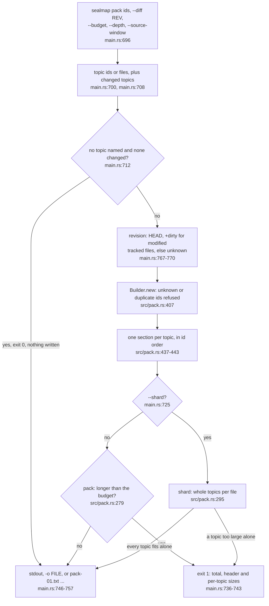
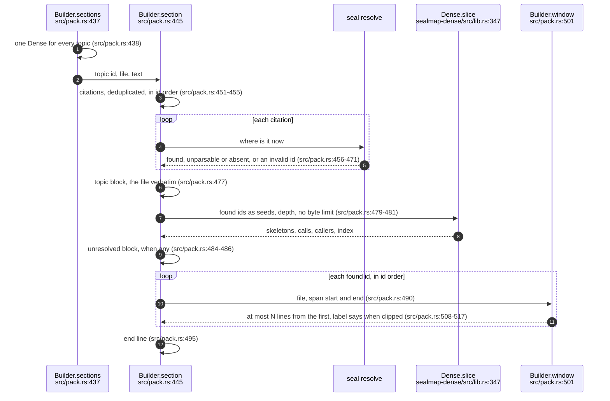
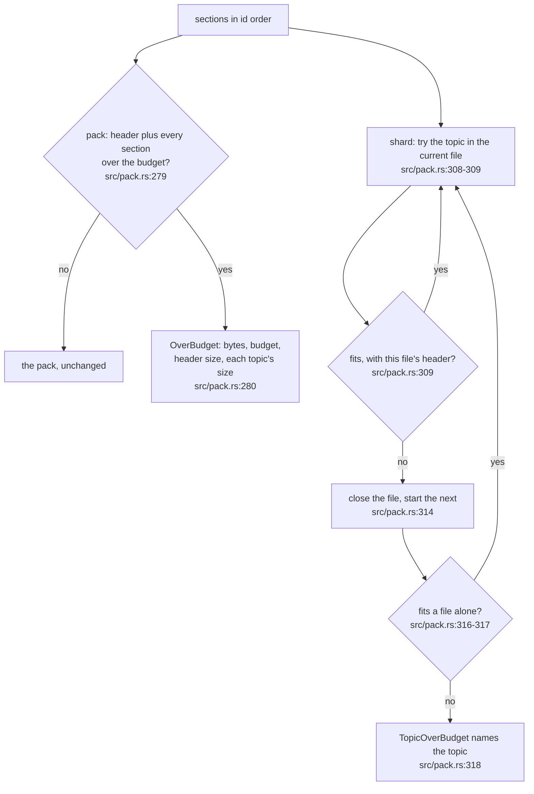
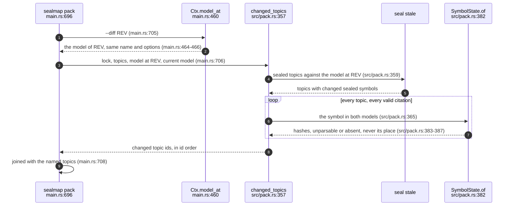
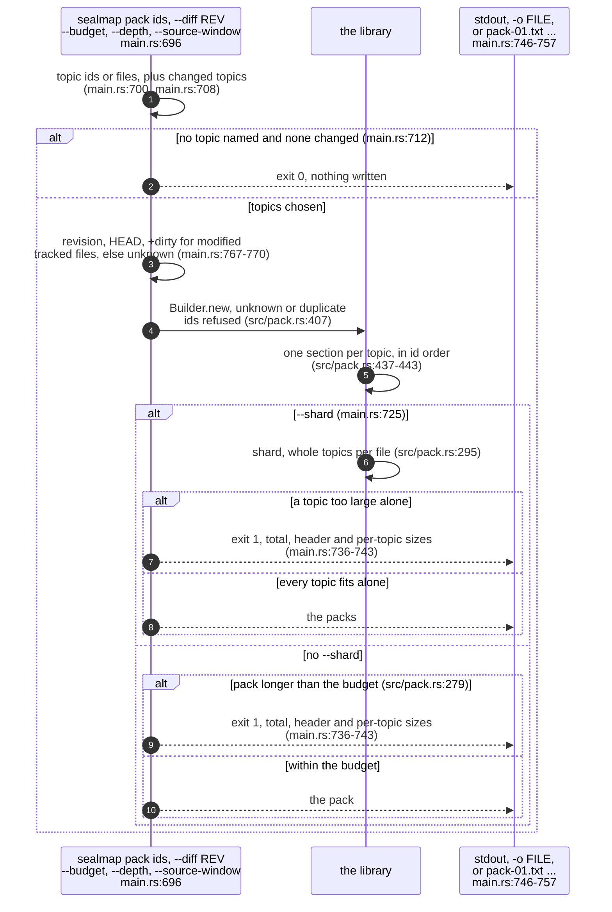
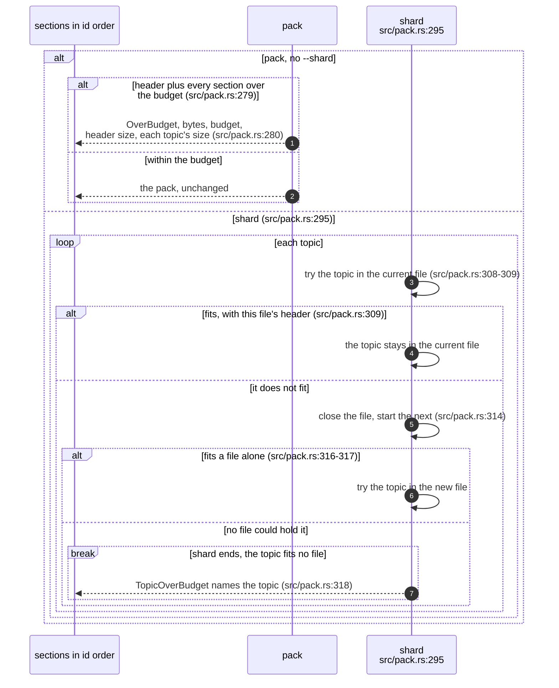

You are a blind fidelity judge for a diagram rewrite. Work alone and read only the two files named below.

- ORIGINAL topic: /home/devuser/workspace/.tmp/claude-1000/-home-devuser-workspace-project-agentbox/47520655-f105-4c26-b318-3f1103e004ae/scratchpad/es2/fidelity/inputs/corpus_06-review-packs/original.md
- REWRITE of the same topic: /home/devuser/workspace/.tmp/claude-1000/-home-devuser-workspace-project-agentbox/47520655-f105-4c26-b318-3f1103e004ae/scratchpad/es2/fidelity/inputs/corpus_06-review-packs/rewrite.md

Both are Markdown topic files from a diagrams-as-code corpus: prose sections plus ```mermaid diagrams that cite source code as `path:line`. The rewrite was supposed to turn every non-sequence diagram (flowchart, classDiagram, stateDiagram) into one or more `sequenceDiagram` blocks that carry the same facts and the same `path:line` citations, keep all prose verbatim, and add nothing that is not in the original topic. Extra diagram sections with new headings are allowed.

Compare the DIAGRAMS. For every original diagram that the rewrite changed, list each fact it states: a component, a call or message, an order, a condition or branch, a value, cap or constant, a type, field or variant, a state or transition, an outcome, or a relationship. Then check whether the rewrite's diagrams still state it, in any form (a participant, message, note, alt/opt/loop/break block). Then list each fact the rewrite's diagrams state that appears nowhere in the ORIGINAL topic, in its diagrams or its prose.

- facts_dropped: facts in an original diagram that no rewrite diagram states. Restated, merged or moved into a note does not count as dropped.
- facts_invented: facts in a rewrite diagram that the original topic does not state anywhere. Sequence scaffolding, such as a "caller" participant or an activation, is not a fact. An explicit claim of a call, order, condition, value, outcome or relationship that the original does not make is invented. So is a change of meaning, such as a reversed order, a different condition or the wrong outcome.
- citations_dropped: each `path:line` (or `path:a-b`, or a bare `file.rs:N`) present in an original diagram but absent from every rewrite diagram.
- citations_added: each citation in a rewrite diagram that appears nowhere in the original topic.
- prose_changed: true if any text outside the mermaid fences differs, apart from added headings and their new diagram sections.

Be exact and conservative. Quote the original or rewrite text for each fact (short). Do not judge whether the facts are true of the code.

Your answer is exactly one JSON object:
{"topic": "corpus/06-review-packs.md", "diagrams_rewritten": <n>, "facts_checked": <n>, "facts_dropped": [{"diagram": "<id>", "fact": "<short quote>"}], "facts_invented": [{"diagram": "<id>", "fact": "<short quote>", "why": "<one line>"}], "citations_dropped": ["<cite>"], "citations_added": ["<cite>"], "prose_changed": true|false, "notes": "<one line>"}
Reply with exactly that JSON object as your whole final message, and nothing else.

The shell is unavailable in this sandbox; the two files' contents follow.

----- /home/devuser/workspace/.tmp/claude-1000/-home-devuser-workspace-project-agentbox/47520655-f105-4c26-b318-3f1103e004ae/scratchpad/es2/fidelity/inputs/corpus_06-review-packs/original.md -----
````markdown
---
id: COR-06
title: Review packs
area: corpus
governing: [docs/DESIGN.md, README.md]
adrs: []
sources:
  - crates/sealmap-corpus/src/pack.rs
  - crates/sealmap-corpus/tests/pack.rs
  - crates/sealmap/src/main.rs
  - crates/sealmap/tests/cli.rs
  - crates/sealmap-dense/src/lib.rs
  - docs/DESIGN.md
  - README.md
verified_commit: 4ed7a51f92f7241a1c420e49e8036a8d9189912a
---
## For developers

`sealmap pack` turns chosen topics into one text a reviewer can read without
the repository (`docs/DESIGN.md:42`). For each topic the pack holds the file
verbatim, the `sealmap-dense` slice around the symbols it cites, the
citations that do not resolve, and a window of each cited symbol's current
source (`crates/sealmap-corpus/src/pack.rs:477`-`495`). The library half,
`sealmap_corpus::pack`, is pure: it takes the model, the source texts, the
topic texts and an opaque revision string, and never reads the disk or runs
git (`crates/sealmap-corpus/src/pack.rs:6`-`9`). The CLI half reads the
checkout, picks the topics and writes the result
(`crates/sealmap/src/main.rs:696`).

Three rules carry the design:

- **Identical inputs give identical bytes.** Topics are a set and are
  written in id order (`crates/sealmap-corpus/src/pack.rs:417`-`433`), and
  citations are deduplicated and sorted
  (`crates/sealmap-corpus/src/pack.rs:451`). A test feeds the ids in another
  order, with a duplicate, and from a freshly extracted model, and gets the
  same pack (`crates/sealmap-corpus/tests/pack.rs:163`). CI checks the
  same on this repository (COR-04 and DEN-01 in both orders, DEL-01).
- **Nothing is truncated.** Over budget, `pack` refuses with the header's
  size and each topic's (`crates/sealmap-corpus/src/pack.rs:278`-`282`).
  `shard` instead fills numbered packs with whole topics and refuses only a
  topic too large to fit alone (`crates/sealmap-corpus/src/pack.rs:295`-`331`).
- **Every block states its length.** A block line ends its fixed fields with
  the payload's byte count, so a reader can skip a block exactly even when a
  topic contains a line that looks like one
  (`crates/sealmap-corpus/src/pack.rs:561`-`571`). A test walks the golden
  pack by those lengths alone (`crates/sealmap-corpus/tests/pack.rs:130`).

`--diff REV` adds every topic whose sealed or cited symbols changed since a
revision. It reuses `stale` for sealed topics and compares each cited
symbol's hashes in the two models, ignoring moves
(`crates/sealmap-corpus/src/pack.rs:357`-`370`).

## For the business

A reviewer outside the team, a seal review or a debugging session needs the
claims and the code they rest on, and nothing else. Handing over the
repository costs far more context than the question needs, and an excerpt
cut to fit can hide the line that matters. A pack is the bounded, repeatable
alternative. The same request always produces the same file, so two
reviewers, or two runs of one reviewer, see the same thing. If the file
would be too big, the tool says by how much and which topics are largest,
or splits the request into whole topics. It never quietly drops content.

`sealmap pack --diff main` answers the routine question "what needs another
look after this branch?". It packs exactly the topics whose cited code
changed, and topics that merely share a file with the change stay out
(`README.md:42`-`45`).

## COR-06.1 From a request to a pack



**What it shows.** Selection and IO live in the CLI. Validation, rendering
and the budget decision live in the library, so another caller, such as the
`sealmap-review` skill, gets the same refusals from either.

**Why it is this way.** Git stays out of the libraries
(`docs/DESIGN.md:166`-`169`). The revision is therefore an opaque string the
CLI supplies. Untracked files do not make it dirty, so writing a pack into
the checkout does not change the next pack's header
(`crates/sealmap/src/main.rs:763`-`769`).

**Tension (revision vs reproducibility):** `+dirty` says that tracked files
differ from `HEAD`, not how (`crates/sealmap/src/main.rs:769`-`770`). Two
packs of different uncommitted edits carry the same header. Their bodies
differ, but the header alone cannot tell them apart.

**Debt:** when `--diff` finds nothing to pack, the command exits 0 and writes
nothing (`crates/sealmap/src/main.rs:712`-`714`). With `-o FILE` a pack from
an earlier run is left in place, where a caller may read it as current.

## COR-06.2 One topic's section



**What it shows.** A section is built from the model alone. Every citation
lands in exactly one place: the slice and a source window when it resolves,
the unresolved list when it does not.

**Why it is this way.** A pack is evidence for a review, so a citation that
no longer resolves must stay visible rather than vanish
(`docs/DESIGN.md:187`-`188`). The slice carries its own index, so the pack
needs no `_index.txt` beside it (`crates/sealmap-dense/src/lib.rs:75`-`79`).

**Invariant:** the dense slice is taken without a byte limit, so it cannot
fail on size. The only budget is the pack's
(`crates/sealmap-corpus/src/pack.rs:479`-`481`).

**Open:** a topic that cites `path:line` rather than `sym:` ids packs as its
text alone (`docs/DESIGN.md:190`-`191`). Every topic of this repository's
own corpus is such a topic today, so a pack of it carries no slices and no
source windows until the corpus migrates to `sym:` citations (step 6,
`docs/DESIGN.md:308`-`309`).

## COR-06.3 The budget: refuse, or shard by topic



**What it shows.** `pack` either fits whole or refuses with what a caller
needs to plan shards. `shard` does that planning itself, one topic at a time,
and fails only on a topic no file could hold.

**Why it is this way.** The design forbids silent truncation
(`docs/DESIGN.md:161`). Sizes are planned from the header's length and the
section lengths, so each file is assembled once
(`crates/sealmap-corpus/src/pack.rs:301`-`332`). The first version assembled
every candidate file in full. The dense projection of that code showed the
quadratic copy, and commit `673d58c` replaced it.

**Invariant:** at exactly the budget the pack is returned, one byte under it
is refused, and the refusal's sizes add up to the pack's length
(`crates/sealmap-corpus/tests/pack.rs:181`). Every topic lands in exactly one
shard, with its section unchanged (`crates/sealmap-corpus/tests/pack.rs:208`).

**Debt (designed, not built):** the diagrams-only `--review` pack for an
outside reviewer is in the design (`docs/DESIGN.md:42`) but not in the
binary (`docs/DESIGN.md:181`).

## COR-06.4 Choosing topics by change



**What it shows.** A topic is chosen when the lock says its sealed code
changed since REV, or when any symbol it cites was added, removed, made
unparsable, or given a new signature or body hash. A move is not a change.

**Why it is this way.** Sealed topics and topics that only cite symbols both
need review after a change, and this repository's corpus has no seals yet.
The CLI test commits a base, edits one function and sees only the topic
citing it chosen, with the current code in its source window. It then
commits the edit and sees nothing chosen against `HEAD`
(`crates/sealmap/tests/cli.rs:240`).
````

----- /home/devuser/workspace/.tmp/claude-1000/-home-devuser-workspace-project-agentbox/47520655-f105-4c26-b318-3f1103e004ae/scratchpad/es2/fidelity/inputs/corpus_06-review-packs/rewrite.md -----
````markdown
---
id: COR-06
title: Review packs
area: corpus
governing: [docs/DESIGN.md, README.md]
adrs: []
sources:
  - crates/sealmap-corpus/src/pack.rs
  - crates/sealmap-corpus/tests/pack.rs
  - crates/sealmap/src/main.rs
  - crates/sealmap/tests/cli.rs
  - crates/sealmap-dense/src/lib.rs
  - docs/DESIGN.md
  - README.md
verified_commit: 4ed7a51f92f7241a1c420e49e8036a8d9189912a
---
## For developers

`sealmap pack` turns chosen topics into one text a reviewer can read without
the repository (`docs/DESIGN.md:42`). For each topic the pack holds the file
verbatim, the `sealmap-dense` slice around the symbols it cites, the
citations that do not resolve, and a window of each cited symbol's current
source (`crates/sealmap-corpus/src/pack.rs:477`-`495`). The library half,
`sealmap_corpus::pack`, is pure: it takes the model, the source texts, the
topic texts and an opaque revision string, and never reads the disk or runs
git (`crates/sealmap-corpus/src/pack.rs:6`-`9`). The CLI half reads the
checkout, picks the topics and writes the result
(`crates/sealmap/src/main.rs:696`).

Three rules carry the design:

- **Identical inputs give identical bytes.** Topics are a set and are
  written in id order (`crates/sealmap-corpus/src/pack.rs:417`-`433`), and
  citations are deduplicated and sorted
  (`crates/sealmap-corpus/src/pack.rs:451`). A test feeds the ids in another
  order, with a duplicate, and from a freshly extracted model, and gets the
  same pack (`crates/sealmap-corpus/tests/pack.rs:163`). CI checks the
  same on this repository (COR-04 and DEN-01 in both orders, DEL-01).
- **Nothing is truncated.** Over budget, `pack` refuses with the header's
  size and each topic's (`crates/sealmap-corpus/src/pack.rs:278`-`282`).
  `shard` instead fills numbered packs with whole topics and refuses only a
  topic too large to fit alone (`crates/sealmap-corpus/src/pack.rs:295`-`331`).
- **Every block states its length.** A block line ends its fixed fields with
  the payload's byte count, so a reader can skip a block exactly even when a
  topic contains a line that looks like one
  (`crates/sealmap-corpus/src/pack.rs:561`-`571`). A test walks the golden
  pack by those lengths alone (`crates/sealmap-corpus/tests/pack.rs:130`).

`--diff REV` adds every topic whose sealed or cited symbols changed since a
revision. It reuses `stale` for sealed topics and compares each cited
symbol's hashes in the two models, ignoring moves
(`crates/sealmap-corpus/src/pack.rs:357`-`370`).

## For the business

A reviewer outside the team, a seal review or a debugging session needs the
claims and the code they rest on, and nothing else. Handing over the
repository costs far more context than the question needs, and an excerpt
cut to fit can hide the line that matters. A pack is the bounded, repeatable
alternative. The same request always produces the same file, so two
reviewers, or two runs of one reviewer, see the same thing. If the file
would be too big, the tool says by how much and which topics are largest,
or splits the request into whole topics. It never quietly drops content.

`sealmap pack --diff main` answers the routine question "what needs another
look after this branch?". It packs exactly the topics whose cited code
changed, and topics that merely share a file with the change stay out
(`README.md:42`-`45`).

## COR-06.1 From a request to a pack



**What it shows.** Selection and IO live in the CLI. Validation, rendering
and the budget decision live in the library, so another caller, such as the
`sealmap-review` skill, gets the same refusals from either.

**Why it is this way.** Git stays out of the libraries
(`docs/DESIGN.md:166`-`169`). The revision is therefore an opaque string the
CLI supplies. Untracked files do not make it dirty, so writing a pack into
the checkout does not change the next pack's header
(`crates/sealmap/src/main.rs:763`-`769`).

**Tension (revision vs reproducibility):** `+dirty` says that tracked files
differ from `HEAD`, not how (`crates/sealmap/src/main.rs:769`-`770`). Two
packs of different uncommitted edits carry the same header. Their bodies
differ, but the header alone cannot tell them apart.

**Debt:** when `--diff` finds nothing to pack, the command exits 0 and writes
nothing (`crates/sealmap/src/main.rs:712`-`714`). With `-o FILE` a pack from
an earlier run is left in place, where a caller may read it as current.

## COR-06.2 One topic's section


**What it shows.** A section is built from the model alone. Every citation
lands in exactly one place: the slice and a source window when it resolves,
the unresolved list when it does not.

**Why it is this way.** A pack is evidence for a review, so a citation that
no longer resolves must stay visible rather than vanish
(`docs/DESIGN.md:187`-`188`). The slice carries its own index, so the pack
needs no `_index.txt` beside it (`crates/sealmap-dense/src/lib.rs:75`-`79`).

**Invariant:** the dense slice is taken without a byte limit, so it cannot
fail on size. The only budget is the pack's
(`crates/sealmap-corpus/src/pack.rs:479`-`481`).

**Open:** a topic that cites `path:line` rather than `sym:` ids packs as its
text alone (`docs/DESIGN.md:190`-`191`). Every topic of this repository's
own corpus is such a topic today, so a pack of it carries no slices and no
source windows until the corpus migrates to `sym:` citations (step 6,
`docs/DESIGN.md:308`-`309`).

## COR-06.3 The budget: refuse, or shard by topic



**What it shows.** `pack` either fits whole or refuses with what a caller
needs to plan shards. `shard` does that planning itself, one topic at a time,
and fails only on a topic no file could hold.

**Why it is this way.** The design forbids silent truncation
(`docs/DESIGN.md:161`). Sizes are planned from the header's length and the
section lengths, so each file is assembled once
(`crates/sealmap-corpus/src/pack.rs:301`-`332`). The first version assembled
every candidate file in full. The dense projection of that code showed the
quadratic copy, and commit `673d58c` replaced it.

**Invariant:** at exactly the budget the pack is returned, one byte under it
is refused, and the refusal's sizes add up to the pack's length
(`crates/sealmap-corpus/tests/pack.rs:181`). Every topic lands in exactly one
shard, with its section unchanged (`crates/sealmap-corpus/tests/pack.rs:208`).

**Debt (designed, not built):** the diagrams-only `--review` pack for an
outside reviewer is in the design (`docs/DESIGN.md:42`) but not in the
binary (`docs/DESIGN.md:181`).

## COR-06.4 Choosing topics by change


**What it shows.** A topic is chosen when the lock says its sealed code
changed since REV, or when any symbol it cites was added, removed, made
unparsable, or given a new signature or body hash. A move is not a change.

**Why it is this way.** Sealed topics and topics that only cite symbols both
need review after a change, and this repository's corpus has no seals yet.
The CLI test commits a base, edits one function and sees only the topic
citing it chosen, with the current code in its source window. It then
commits the edit and sees nothing chosen against `HEAD`
(`crates/sealmap/tests/cli.rs:240`).
````
