You are a blind fidelity judge for a diagram rewrite. Work alone and read only the two files named below.

- ORIGINAL topic: /home/devuser/workspace/.tmp/claude-1000/-home-devuser-workspace-project-agentbox/47520655-f105-4c26-b318-3f1103e004ae/scratchpad/es2/fidelity/inputs/delivery_02-design-versus-code/original.md
- REWRITE of the same topic: /home/devuser/workspace/.tmp/claude-1000/-home-devuser-workspace-project-agentbox/47520655-f105-4c26-b318-3f1103e004ae/scratchpad/es2/fidelity/inputs/delivery_02-design-versus-code/rewrite.md

Both are Markdown topic files from a diagrams-as-code corpus: prose sections plus ```mermaid diagrams that cite source code as `path:line`. The rewrite was supposed to turn every non-sequence diagram (flowchart, classDiagram, stateDiagram) into one or more `sequenceDiagram` blocks that carry the same facts and the same `path:line` citations, keep all prose verbatim, and add nothing that is not in the original topic. Extra diagram sections with new headings are allowed.

Compare the DIAGRAMS. For every original diagram that the rewrite changed, list each fact it states: a component, a call or message, an order, a condition or branch, a value, cap or constant, a type, field or variant, a state or transition, an outcome, or a relationship. Then check whether the rewrite's diagrams still state it, in any form (a participant, message, note, alt/opt/loop/break block). Then list each fact the rewrite's diagrams state that appears nowhere in the ORIGINAL topic, in its diagrams or its prose.

- facts_dropped: facts in an original diagram that no rewrite diagram states. Restated, merged or moved into a note does not count as dropped.
- facts_invented: facts in a rewrite diagram that the original topic does not state anywhere. Sequence scaffolding, such as a "caller" participant or an activation, is not a fact. An explicit claim of a call, order, condition, value, outcome or relationship that the original does not make is invented. So is a change of meaning, such as a reversed order, a different condition or the wrong outcome.
- citations_dropped: each `path:line` (or `path:a-b`, or a bare `file.rs:N`) present in an original diagram but absent from every rewrite diagram.
- citations_added: each citation in a rewrite diagram that appears nowhere in the original topic.
- prose_changed: true if any text outside the mermaid fences differs, apart from added headings and their new diagram sections.

Be exact and conservative. Quote the original or rewrite text for each fact (short). Do not judge whether the facts are true of the code.

Your answer is exactly one JSON object:
{"topic": "delivery/02-design-versus-code.md", "diagrams_rewritten": <n>, "facts_checked": <n>, "facts_dropped": [{"diagram": "<id>", "fact": "<short quote>"}], "facts_invented": [{"diagram": "<id>", "fact": "<short quote>", "why": "<one line>"}], "citations_dropped": ["<cite>"], "citations_added": ["<cite>"], "prose_changed": true|false, "notes": "<one line>"}
Reply with exactly that JSON object as your whole final message, and nothing else.

The shell is unavailable in this sandbox; the two files' contents follow.

----- /home/devuser/workspace/.tmp/claude-1000/-home-devuser-workspace-project-agentbox/47520655-f105-4c26-b318-3f1103e004ae/scratchpad/es2/fidelity/inputs/delivery_02-design-versus-code/original.md -----
````markdown
---
id: DEL-02
title: Design versus code after the seal surface
area: delivery
governing: [docs/DESIGN.md, README.md]
adrs: []
sources:
  - docs/DESIGN.md
  - README.md
  - .gitignore
  - Cargo.toml
  - .github/workflows/ci.yml
  - crates/sealmap/Cargo.toml
  - crates/sealmap/src/main.rs
  - crates/sealmap-corpus/src/seal/lock.rs
  - crates/sealmap-corpus/src/seal/check.rs
  - crates/sealmap-corpus/src/pack.rs
verified_commit: 6cefaf431511f380d989b93790241b903077d673
---
## For developers

`docs/DESIGN.md` was accepted on 2026-10-05 with every recommendation taken
(`docs/DESIGN.md:3`). Steps 1 and 2 of its order of work landed the same day,
and step 3 followed in the tree: the lock, `resolve`, `stale`, `seal-check`,
`verify`, `seal sign`, the retirement of the committed generated corpus,
`sealmap-dense` with its `sealmap dense` subcommand, and `pack`
(`docs/DESIGN.md:298`-`303`, `README.md:364`-`367`). Step 3 closed with
the 0.2.0 publish (`docs/DESIGN.md:302`-`303`). This topic is the catalogue of the gap once `pack`
landed: what the design still describes that the code does not do, and the
questions the design leaves open.

It is a catalogue, not a plan. The design's order of work
(`docs/DESIGN.md:289`-`315`) is the plan. Where the build settled something
the design left loose, DESIGN now records it as built (`docs/DESIGN.md:72`-`74`,
`docs/DESIGN.md:80`-`94`, `docs/DESIGN.md:113`-`121`, `docs/DESIGN.md:171`-`191`), and the subsystem topics carry the detail: the
seal module in COR-04, the seal commands in COR-05, `generate --check` in
COR-03, `pack` in COR-06.

## For the business

An adopter can now use what the project is *for*: hand-written diagram topics
cite functions by stable id, a lockfile records the exact versions a reviewer
checked them against, and one command in CI says whether every seal still
holds, with no model involved. After a commit, a second command lists only
the topics whose sealed functions changed.

The dense agent projection exists: an agent can read the shape of the code
at about a quarter of the source's size. So do review packs: one bounded,
reproducible file holding the topics to review and the code they cite. The
designed variant that holds diagrams alone, for an outside reviewer who
should not see code, is still to come. The headline
cost saving is not measured yet; that is step 4. And this repository has not
sealed its own diagrams yet, so its CI does not run the seal gate (step 6).

## DEL-02.1 The design's layers against the tree

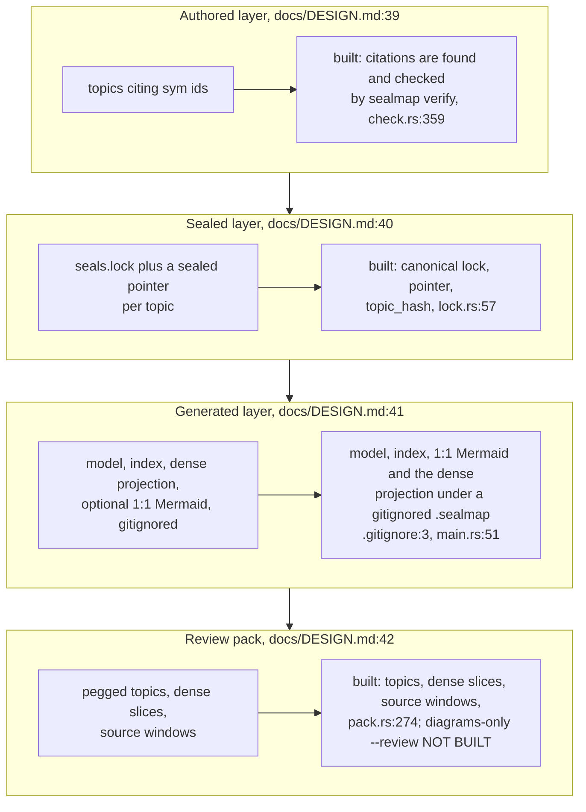

**What it shows.** All four layers exist, the generated one no longer
committed; of the review pack, only the diagrams-only mode is missing.

**Why it is this way.** Step 3 split in two: the seal surface first, then
`pack` and `sealmap-dense` (`docs/DESIGN.md:277`-`279`); `sealmap-dense` was
built on a branch and merged after the seal surface. The generated corpus
is rebuilt on demand and never trusted from disk (`docs/DESIGN.md:44`-`48`).

`sealmap-dense` came in under its estimate. The README now reports the
measured 0.17–0.29× source (`README.md:60`) where it quoted the research's
0.45×, and DESIGN records why the built projection is smaller: each callable
is expanded once and each signature printed once (`docs/DESIGN.md:139`-`144`).

**Debt (designed, not built):** `--review`, a pack of diagrams only, is in
the layer table (`docs/DESIGN.md:42`) but not in the binary
(`docs/DESIGN.md:181`, `crates/sealmap/src/main.rs:45`-`65`).

## DEL-02.2 The order of work and where the tree stands

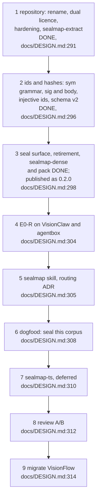

**What it shows.** Three steps done in the tree, the third short of its
publish. The first
number the design is built to produce, topics flagged per commit file-level
against sealed, comes at step 4; `stale --since` is the tool it needs, and it
exists.

**Why it is this way.** The evidence endpoints are a fixed sequence, each
tested only if the previous one holds (`docs/DESIGN.md:262`-`263`).

**Open:** the endpoints are to be pre-registered in `PREREG.md` before any run
(`docs/DESIGN.md:263`), and the design cites its evidence as `research/01`
to `05` in a design-session scratchpad (`docs/DESIGN.md:4`-`5`); neither is in
the repository, so where do the pre-registration and the evidence live?

## DEL-02.3 Planned commands against present ones

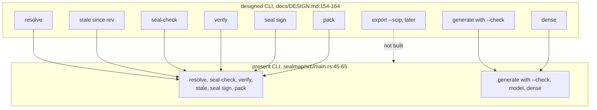

**What it shows.** Every designed command except the later `export --scip`
exists, and `verify` now means the seal gate only; the old drift check is
`generate --check`.

**Why it is this way.** Git stays out of the libraries: `--since` and
`--diff` export the revision with `git archive` and read it as a second model
(`docs/DESIGN.md:166`-`169`, `crates/sealmap/src/main.rs:608`-`617`). `pack`
was built to its own flags rather than the planned ones: `--diff REV`
against the working tree instead of two named trees, and `--budget` instead
of `--max-bytes`. DESIGN records both (`docs/DESIGN.md:161`,
`docs/DESIGN.md:171`-`180`).

## DEL-02.4 A sealed topic's life, as built

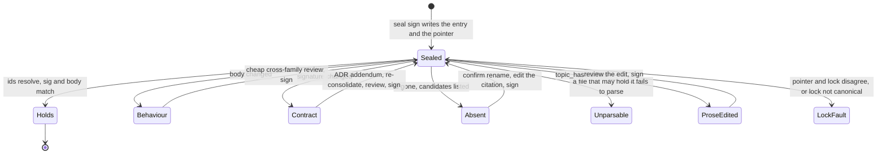

**What it shows.** The lifecycle the design gives a sealed topic
(`docs/DESIGN.md:99`-`111`), now with every state reachable from the code;
the review between a failing state and the next seal is the skill's step, not
the crate's.

**Why it is this way.** Code, topic and lock land in one commit, ending the
two-commit "change then re-stamp" routine (`README.md:105`-`106`); `seal sign`
re-derives the entry from the code, so the lock is never hand-edited
(`docs/DESIGN.md:80`-`85`).

**Open:** reviewer family, evidence and signatures are left to a skill script,
`seal-gate.mjs`, next to `verify` (`docs/DESIGN.md:123`-`124`); `seal sign`
records whatever reviewer string it is given, so until that script exists
nothing enforces the cross-family rule.

## DEL-02.5 Crates planned against crates present

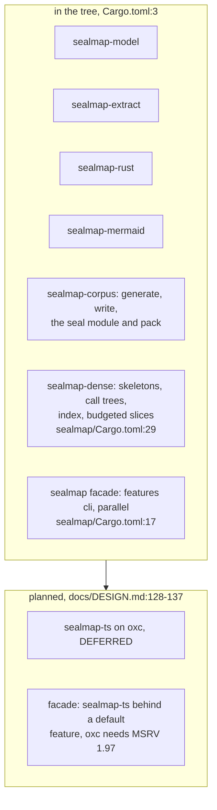

**What it shows.** Seven crates exist, `sealmap-dense` the newest, and the
corpus crate has gained `pack`; one crate is deferred.

**Why it is this way.** The owner deferred `sealmap-ts` on 2026-10-05: it is
built only if E0-R on the Rust repositories shows the precise-staleness gain
is real (`docs/DESIGN.md:310`-`311`, `README.md:258`).

Closed in the 0.2.0 release: the workspace is at `0.2.0` (`Cargo.toml:6`),
so a lock signed by this tree names `sealmap` 0.2.0, the first release that
has the seal module (`crates/sealmap-corpus/src/seal/lock.rs:21`).

**Open:** `sealmap-ts` is deferred (`docs/DESIGN.md:133`), yet the crate
surface still plans it behind a *default* facade feature because oxc needs
MSRV 1.97 (`docs/DESIGN.md:137`); if it is ever built, does the facade's 1.85
MSRV survive a default feature that needs 1.97?

## DEL-02.6 Dogfooding the gate on this repository

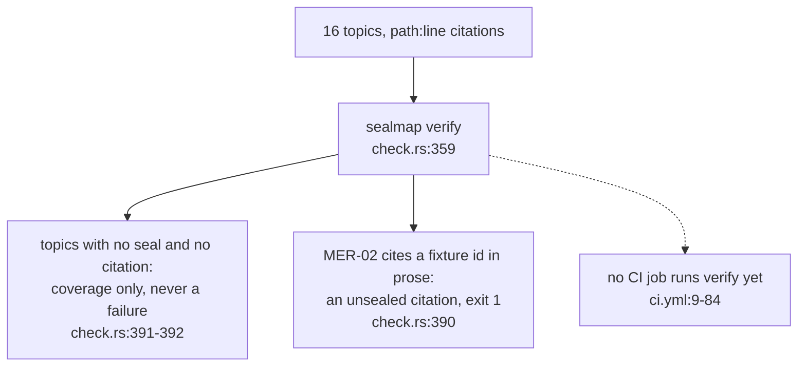

**What it shows.** Run on this repository at `ae478d9`, `sealmap verify` treats
fifteen topics as legacy coverage and fails on one: MER-02 writes an example
id from a fixture crate (`shop`) as an inline code span, which reads as a
citation of a symbol nobody sealed.

**Why it is this way.** Legacy `path:line` topics must not fail the gate, or
a corpus could not migrate one topic at a time (`docs/DESIGN.md:119`-`121`);
a global-shaped id in a code span is always a citation, so a mistyped one
fails rather than vanishing (COR-04).

**Debt:** step 6 needs MER-02's example id moved into a fenced block or
reworded before `verify` can run in CI on this repository
(`crates/sealmap-corpus/src/seal/check.rs:390`, `docs/DESIGN.md:308`-`309`).
````

----- /home/devuser/workspace/.tmp/claude-1000/-home-devuser-workspace-project-agentbox/47520655-f105-4c26-b318-3f1103e004ae/scratchpad/es2/fidelity/inputs/delivery_02-design-versus-code/rewrite.md -----
````markdown
---
id: DEL-02
title: Design versus code after the seal surface
area: delivery
governing: [docs/DESIGN.md, README.md]
adrs: []
sources:
  - docs/DESIGN.md
  - README.md
  - .gitignore
  - Cargo.toml
  - .github/workflows/ci.yml
  - crates/sealmap/Cargo.toml
  - crates/sealmap/src/main.rs
  - crates/sealmap-corpus/src/seal/lock.rs
  - crates/sealmap-corpus/src/seal/check.rs
  - crates/sealmap-corpus/src/pack.rs
verified_commit: 6cefaf431511f380d989b93790241b903077d673
---
## For developers

`docs/DESIGN.md` was accepted on 2026-10-05 with every recommendation taken
(`docs/DESIGN.md:3`). Steps 1 and 2 of its order of work landed the same day,
and step 3 followed in the tree: the lock, `resolve`, `stale`, `seal-check`,
`verify`, `seal sign`, the retirement of the committed generated corpus,
`sealmap-dense` with its `sealmap dense` subcommand, and `pack`
(`docs/DESIGN.md:298`-`303`, `README.md:364`-`367`). Step 3 closed with
the 0.2.0 publish (`docs/DESIGN.md:302`-`303`). This topic is the catalogue of the gap once `pack`
landed: what the design still describes that the code does not do, and the
questions the design leaves open.

It is a catalogue, not a plan. The design's order of work
(`docs/DESIGN.md:289`-`315`) is the plan. Where the build settled something
the design left loose, DESIGN now records it as built (`docs/DESIGN.md:72`-`74`,
`docs/DESIGN.md:80`-`94`, `docs/DESIGN.md:113`-`121`, `docs/DESIGN.md:171`-`191`), and the subsystem topics carry the detail: the
seal module in COR-04, the seal commands in COR-05, `generate --check` in
COR-03, `pack` in COR-06.

## For the business

An adopter can now use what the project is *for*: hand-written diagram topics
cite functions by stable id, a lockfile records the exact versions a reviewer
checked them against, and one command in CI says whether every seal still
holds, with no model involved. After a commit, a second command lists only
the topics whose sealed functions changed.

The dense agent projection exists: an agent can read the shape of the code
at about a quarter of the source's size. So do review packs: one bounded,
reproducible file holding the topics to review and the code they cite. The
designed variant that holds diagrams alone, for an outside reviewer who
should not see code, is still to come. The headline
cost saving is not measured yet; that is step 4. And this repository has not
sealed its own diagrams yet, so its CI does not run the seal gate (step 6).

## DEL-02.1 The design's layers against the tree

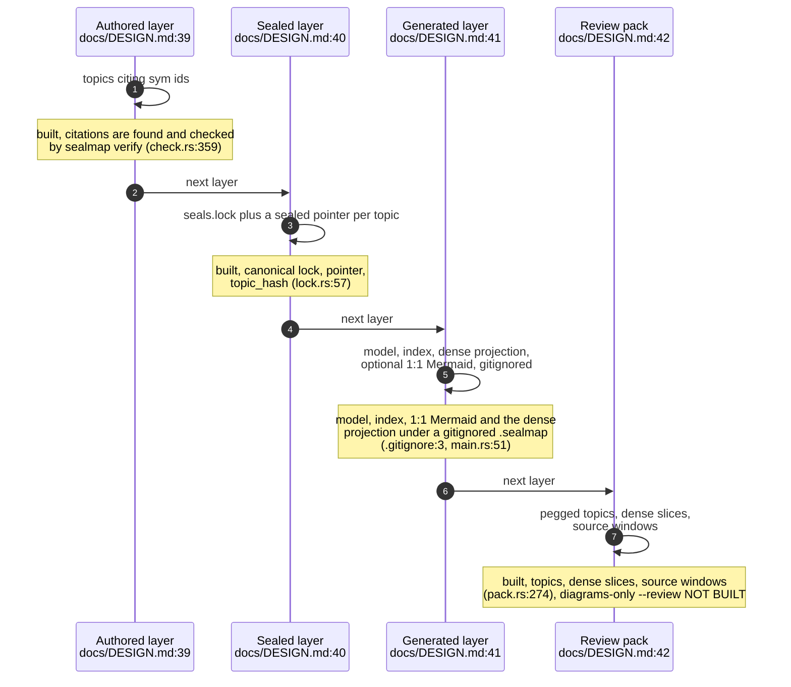

**What it shows.** All four layers exist, the generated one no longer
committed; of the review pack, only the diagrams-only mode is missing.

**Why it is this way.** Step 3 split in two: the seal surface first, then
`pack` and `sealmap-dense` (`docs/DESIGN.md:277`-`279`); `sealmap-dense` was
built on a branch and merged after the seal surface. The generated corpus
is rebuilt on demand and never trusted from disk (`docs/DESIGN.md:44`-`48`).

`sealmap-dense` came in under its estimate. The README now reports the
measured 0.17–0.29× source (`README.md:60`) where it quoted the research's
0.45×, and DESIGN records why the built projection is smaller: each callable
is expanded once and each signature printed once (`docs/DESIGN.md:139`-`144`).

**Debt (designed, not built):** `--review`, a pack of diagrams only, is in
the layer table (`docs/DESIGN.md:42`) but not in the binary
(`docs/DESIGN.md:181`, `crates/sealmap/src/main.rs:45`-`65`).

## DEL-02.2 The order of work and where the tree stands

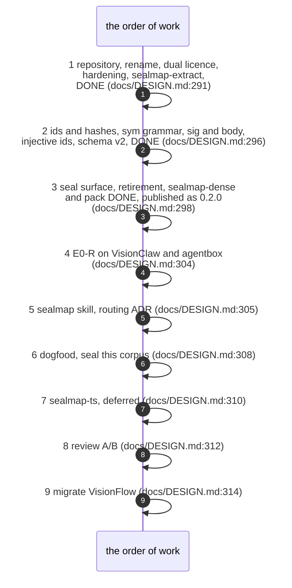

**What it shows.** Three steps done in the tree, the third short of its
publish. The first
number the design is built to produce, topics flagged per commit file-level
against sealed, comes at step 4; `stale --since` is the tool it needs, and it
exists.

**Why it is this way.** The evidence endpoints are a fixed sequence, each
tested only if the previous one holds (`docs/DESIGN.md:262`-`263`).

**Open:** the endpoints are to be pre-registered in `PREREG.md` before any run
(`docs/DESIGN.md:263`), and the design cites its evidence as `research/01`
to `05` in a design-session scratchpad (`docs/DESIGN.md:4`-`5`); neither is in
the repository, so where do the pre-registration and the evidence live?

## DEL-02.3 Planned commands against present ones

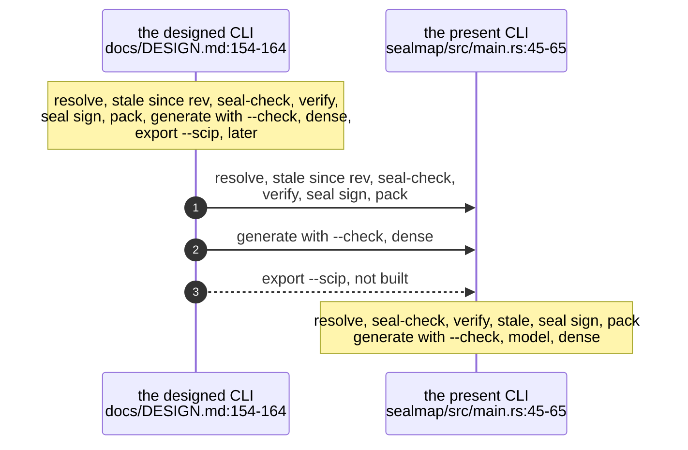

**What it shows.** Every designed command except the later `export --scip`
exists, and `verify` now means the seal gate only; the old drift check is
`generate --check`.

**Why it is this way.** Git stays out of the libraries: `--since` and
`--diff` export the revision with `git archive` and read it as a second model
(`docs/DESIGN.md:166`-`169`, `crates/sealmap/src/main.rs:608`-`617`). `pack`
was built to its own flags rather than the planned ones: `--diff REV`
against the working tree instead of two named trees, and `--budget` instead
of `--max-bytes`. DESIGN records both (`docs/DESIGN.md:161`,
`docs/DESIGN.md:171`-`180`).

## DEL-02.4 A sealed topic's life, as built

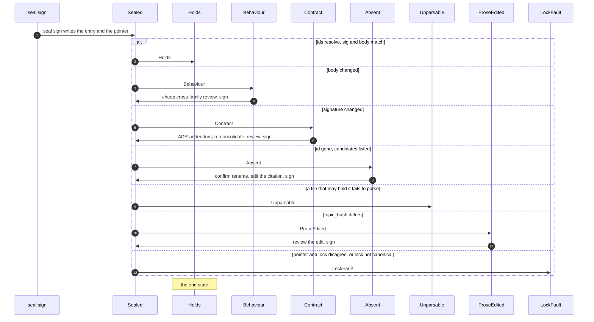

**What it shows.** The lifecycle the design gives a sealed topic
(`docs/DESIGN.md:99`-`111`), now with every state reachable from the code;
the review between a failing state and the next seal is the skill's step, not
the crate's.

**Why it is this way.** Code, topic and lock land in one commit, ending the
two-commit "change then re-stamp" routine (`README.md:105`-`106`); `seal sign`
re-derives the entry from the code, so the lock is never hand-edited
(`docs/DESIGN.md:80`-`85`).

**Open:** reviewer family, evidence and signatures are left to a skill script,
`seal-gate.mjs`, next to `verify` (`docs/DESIGN.md:123`-`124`); `seal sign`
records whatever reviewer string it is given, so until that script exists
nothing enforces the cross-family rule.

## DEL-02.5 Crates planned against crates present

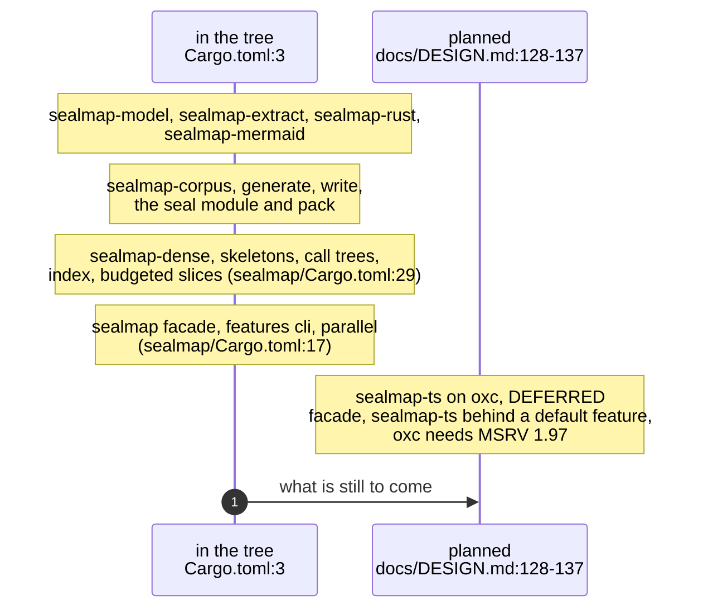

**What it shows.** Seven crates exist, `sealmap-dense` the newest, and the
corpus crate has gained `pack`; one crate is deferred.

**Why it is this way.** The owner deferred `sealmap-ts` on 2026-10-05: it is
built only if E0-R on the Rust repositories shows the precise-staleness gain
is real (`docs/DESIGN.md:310`-`311`, `README.md:258`).

Closed in the 0.2.0 release: the workspace is at `0.2.0` (`Cargo.toml:6`),
so a lock signed by this tree names `sealmap` 0.2.0, the first release that
has the seal module (`crates/sealmap-corpus/src/seal/lock.rs:21`).

**Open:** `sealmap-ts` is deferred (`docs/DESIGN.md:133`), yet the crate
surface still plans it behind a *default* facade feature because oxc needs
MSRV 1.97 (`docs/DESIGN.md:137`); if it is ever built, does the facade's 1.85
MSRV survive a default feature that needs 1.97?

## DEL-02.6 Dogfooding the gate on this repository

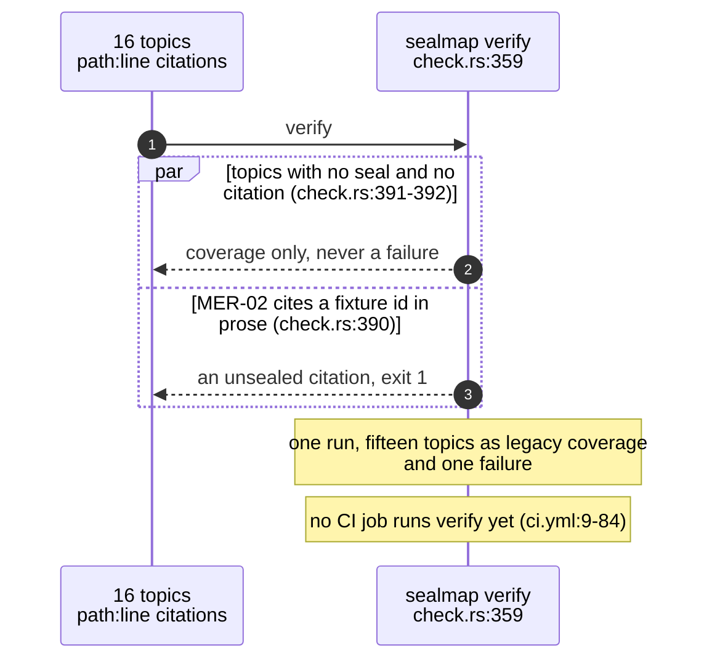

**What it shows.** Run on this repository at `ae478d9`, `sealmap verify` treats
fifteen topics as legacy coverage and fails on one: MER-02 writes an example
id from a fixture crate (`shop`) as an inline code span, which reads as a
citation of a symbol nobody sealed.

**Why it is this way.** Legacy `path:line` topics must not fail the gate, or
a corpus could not migrate one topic at a time (`docs/DESIGN.md:119`-`121`);
a global-shaped id in a code span is always a citation, so a mistyped one
fails rather than vanishing (COR-04).

**Debt:** step 6 needs MER-02's example id moved into a fenced block or
reworded before `verify` can run in CI on this repository
(`crates/sealmap-corpus/src/seal/check.rs:390`, `docs/DESIGN.md:308`-`309`).
````
