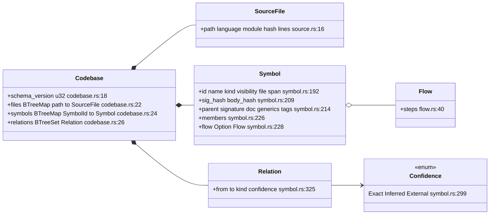
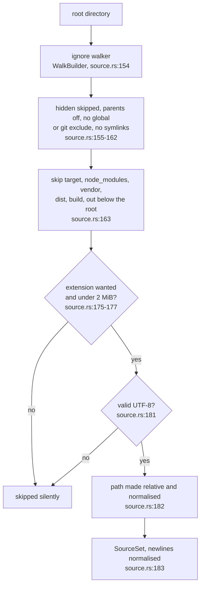
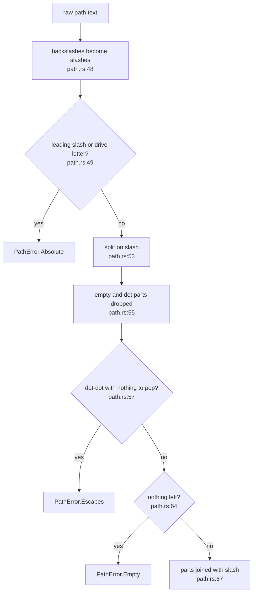
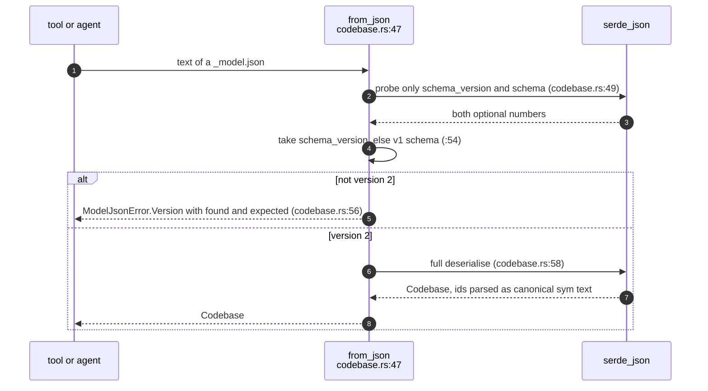
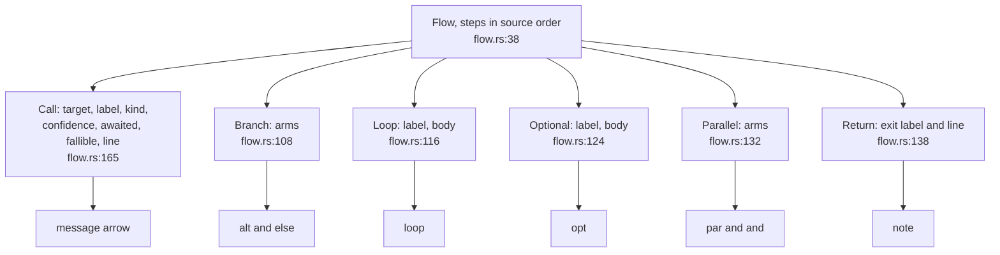
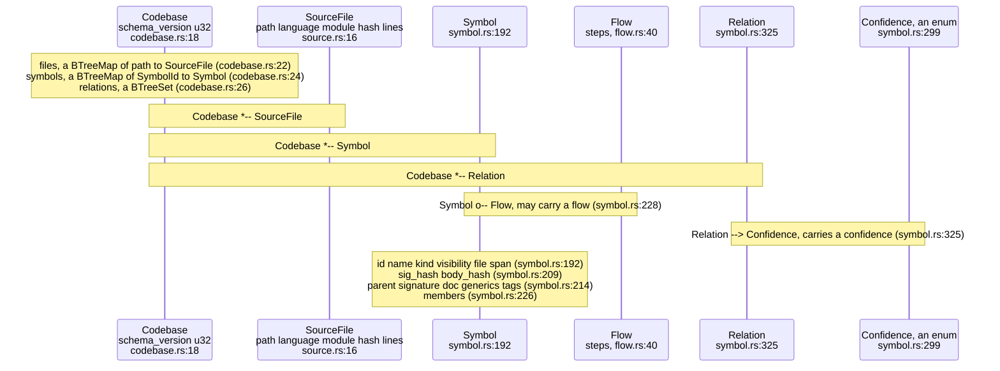
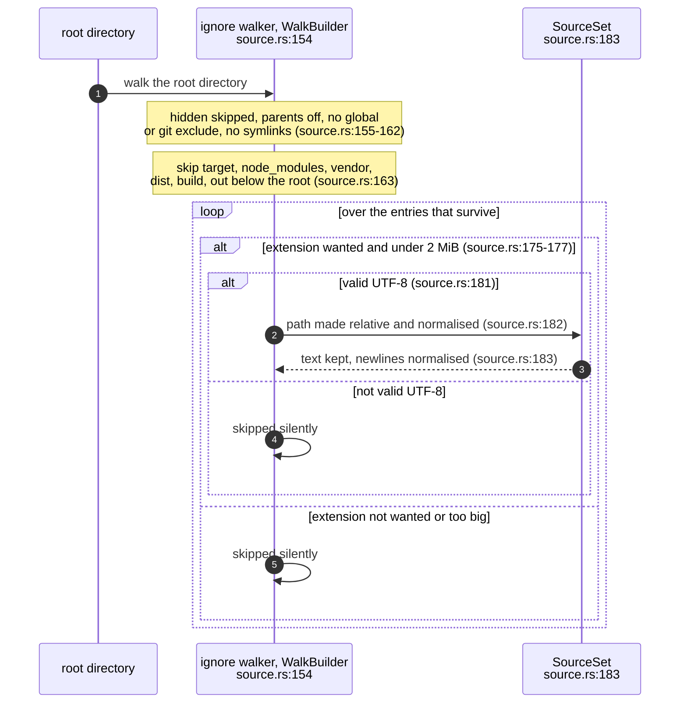
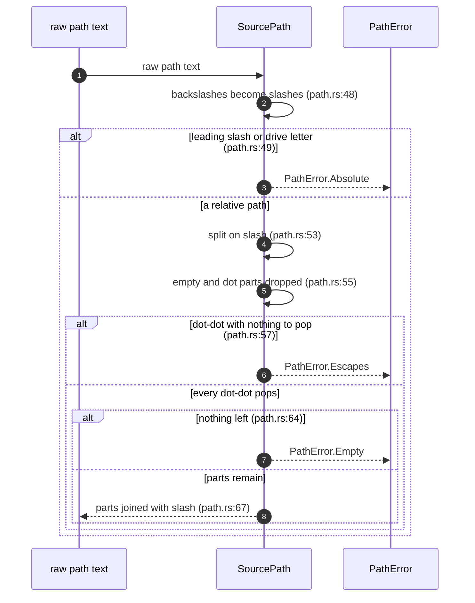
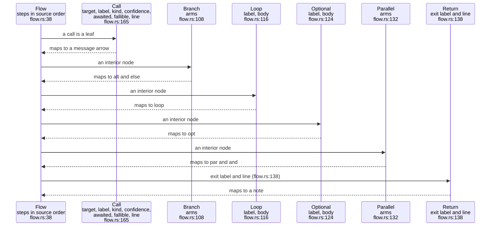

You are a blind fidelity judge for a diagram rewrite. Work alone and read only the two files named below.

- ORIGINAL topic: /home/devuser/workspace/.tmp/claude-1000/-home-devuser-workspace-project-agentbox/47520655-f105-4c26-b318-3f1103e004ae/scratchpad/es2/fidelity/inputs/model_03-the-codebase-model-and-schema-v2/original.md
- REWRITE of the same topic: /home/devuser/workspace/.tmp/claude-1000/-home-devuser-workspace-project-agentbox/47520655-f105-4c26-b318-3f1103e004ae/scratchpad/es2/fidelity/inputs/model_03-the-codebase-model-and-schema-v2/rewrite.md

Both are Markdown topic files from a diagrams-as-code corpus: prose sections plus ```mermaid diagrams that cite source code as `path:line`. The rewrite was supposed to turn every non-sequence diagram (flowchart, classDiagram, stateDiagram) into one or more `sequenceDiagram` blocks that carry the same facts and the same `path:line` citations, keep all prose verbatim, and add nothing that is not in the original topic. Extra diagram sections with new headings are allowed.

Compare the DIAGRAMS. For every original diagram that the rewrite changed, list each fact it states: a component, a call or message, an order, a condition or branch, a value, cap or constant, a type, field or variant, a state or transition, an outcome, or a relationship. Then check whether the rewrite's diagrams still state it, in any form (a participant, message, note, alt/opt/loop/break block). Then list each fact the rewrite's diagrams state that appears nowhere in the ORIGINAL topic, in its diagrams or its prose.

- facts_dropped: facts in an original diagram that no rewrite diagram states. Restated, merged or moved into a note does not count as dropped.
- facts_invented: facts in a rewrite diagram that the original topic does not state anywhere. Sequence scaffolding, such as a "caller" participant or an activation, is not a fact. An explicit claim of a call, order, condition, value, outcome or relationship that the original does not make is invented. So is a change of meaning, such as a reversed order, a different condition or the wrong outcome.
- citations_dropped: each `path:line` (or `path:a-b`, or a bare `file.rs:N`) present in an original diagram but absent from every rewrite diagram.
- citations_added: each citation in a rewrite diagram that appears nowhere in the original topic.
- prose_changed: true if any text outside the mermaid fences differs, apart from added headings and their new diagram sections.

Be exact and conservative. Quote the original or rewrite text for each fact (short). Do not judge whether the facts are true of the code.

Your answer is exactly one JSON object:
{"topic": "model/03-the-codebase-model-and-schema-v2.md", "diagrams_rewritten": <n>, "facts_checked": <n>, "facts_dropped": [{"diagram": "<id>", "fact": "<short quote>"}], "facts_invented": [{"diagram": "<id>", "fact": "<short quote>", "why": "<one line>"}], "citations_dropped": ["<cite>"], "citations_added": ["<cite>"], "prose_changed": true|false, "notes": "<one line>"}
Reply with exactly that JSON object as your whole final message, and nothing else.

The shell is unavailable in this sandbox; the two files' contents follow.

----- /home/devuser/workspace/.tmp/claude-1000/-home-devuser-workspace-project-agentbox/47520655-f105-4c26-b318-3f1103e004ae/scratchpad/es2/fidelity/inputs/model_03-the-codebase-model-and-schema-v2/original.md -----
````markdown
---
id: MOD-03
title: The codebase model, its sources and schema v2
area: model
governing: [docs/DESIGN.md, README.md]
adrs: []
sources:
  - crates/sealmap-model/src/lib.rs
  - crates/sealmap-model/src/codebase.rs
  - crates/sealmap-model/src/symbol.rs
  - crates/sealmap-model/src/flow.rs
  - crates/sealmap-model/src/path.rs
  - crates/sealmap-model/src/source.rs
  - crates/sealmap-model/Cargo.toml
  - docs/DESIGN.md
  - README.md
verified_commit: 4ed7a51f92f7241a1c420e49e8036a8d9189912a
---
## For developers

`sealmap-model` is the vocabulary both halves of the workspace meet in:
language adapters produce a `Codebase`, projections consume one, and neither
side knows the other (`crates/sealmap-model/src/lib.rs:6`-`10`). This topic
draws that value: files, symbols, relations and the ordered call `Flow` of
every callable; the `SourceSet` adapters read from instead of the disk; the
path normalisation that makes keys identical on every platform; and the
schema-v2 JSON reader that refuses anything else.

The crate's determinism contract has four clauses: ordered collections only,
normalised paths, stable hashing, no ambient data
(`crates/sealmap-model/src/lib.rs:18`-`34`). Every diagram here is one of
those clauses made concrete. Schema v2 came with commit `01f82b4`; v1 has no
reader because nothing outside the workspace consumed it
(`crates/sealmap-model/src/lib.rs:106`-`111`).

Not covered: the id grammar (MOD-01), the fingerprints (MOD-02), and how an
adapter fills the model (EXT-01 onwards).

## For the business

Everything sealmap claims about a codebase is a claim about this one value.
An adopter can persist it (`_model.json`), diff it, or feed it to a tool of
their own, and the same checkout produces the same bytes on any machine.
That is what makes the output safe to cache and cheap to compare in CI: no
timestamps, no machine paths, no user names.

Two properties lower risk directly. The loader honours the repository's own
ignore files, so vendored and generated trees do not inflate the model (the
design measured 47,229 files walked instead of 934 before this,
`docs/DESIGN.md:233`). And a model written by another version is refused
outright rather than half-read, so a stale artefact cannot be mistaken for a
current one.

## MOD-03.1 The model as types



**What it shows.** Three ordered maps or sets and nothing else. A symbol may
carry a flow; a relation always carries a confidence.

**Why it is this way.** Ordered collections make serialisation deterministic
and every query iterate in key order (`crates/sealmap-model/src/codebase.rs:12`-`14`).
Confidence is on every relation because there is no type checker behind the
model, and nothing is meant to be guessed silently (`README.md:318`-`320`).

**Invariant:** a relation from a symbol to itself is never stored
(`crates/sealmap-model/src/codebase.rs:91`).

**Debt:** `relations_from` is a range scan because `Relation` orders by
`from` first (`crates/sealmap-model/src/codebase.rs:130`-`133`), but
`relations_to`, `children` and `symbols_in_file` scan everything
(`crates/sealmap-model/src/codebase.rs:136`,
`crates/sealmap-model/src/codebase.rs:122`,
`crates/sealmap-model/src/codebase.rs:112`); projections that call them per
document have had to build their own indexes (COR-01).

## MOD-03.2 Loading a directory



**What it shows.** `SourceSet::load_dir` walks with the `ignore` crate,
honouring `.gitignore` and `.ignore` files under the root only, then keeps
files by extension and size and stores their text with `\n` line endings.

**Why it is this way.** Reading only what is under the root, and never the
user's global excludes, keeps the result a function of the checkout's bytes
(`crates/sealmap-model/src/source.rs:53`-`57`). The ignore support was the
hardening fix for the 48-second VisionClaw walk (`docs/DESIGN.md:233`). It
also makes `ignore` a dependency of the model crate
(`crates/sealmap-model/Cargo.toml:21`), which DEL-01 follows to the MSRV.

**Debt:** a file that is not valid UTF-8 is skipped with no diagnostic
(`crates/sealmap-model/src/source.rs:181`), so it disappears from the model
and from every count, while one unreadable directory entry aborts the whole
load (`crates/sealmap-model/src/source.rs:170`).

## MOD-03.3 Normalising a path



**What it shows.** Every path becomes relative, slash-separated and free of
`.` and `..` before it is used as a key, or it is refused.

**Why it is this way.** `src\lib.rs` on Windows and `src/lib.rs` on Linux
must be the same key for the corpus to be byte-identical across machines
(`crates/sealmap-model/src/lib.rs:27`-`29`). The same type names the 1:1
corpus documents, by appending a suffix (`crates/sealmap-model/src/path.rs:109`).

**Invariant:** no `SourcePath` can escape the codebase root, because a `..`
with nothing to pop is an error rather than a clamp
(`crates/sealmap-model/src/path.rs:57`-`58`).

## MOD-03.4 Reading a persisted model



**What it shows.** The reader looks at the version first, through a two-field
probe, and only then deserialises; a v1 file is reported as "found 1" rather
than failing on a missing field.

**Why it is this way.** Schema v2 changed the meaning of every id, so a v1
model read as v2 would be wrong in every row. The README states the refusal
for users (`README.md:203`-`206`). Every `SymbolId` inside is parsed through
the canonical-only parser, so a hand-edited id fails the whole read.

**Invariant:** `Codebase::new` always stamps the current schema version
(`crates/sealmap-model/src/codebase.rs:32`), so nothing written by this build
can fail its own reader on version.

## MOD-03.5 A flow is the skeleton of a sequence diagram



**What it shows.** Calls are leaves; branches, loops, optional blocks and
parallel arms are interior nodes that map one to one onto Mermaid fragments.

**Why it is this way.** A flow holds only what contains calls, so it is
already the minimal "who talks to whom, in what order, under which
condition" (`crates/sealmap-model/src/flow.rs:4`-`8`). Every call target is a
canonical id, which is what lets an orchestrator inline one function's
sequence into another's without guessing (`crates/sealmap-model/src/flow.rs:10`-`13`).

**Debt:** `Flow::calls` collects every call into a fresh vector before
iterating, and `call_count` builds that vector just to count it
(`crates/sealmap-model/src/flow.rs:55`-`64`); `Codebase::stats` does this
once per symbol (`crates/sealmap-model/src/codebase.rs:169`).
````

----- /home/devuser/workspace/.tmp/claude-1000/-home-devuser-workspace-project-agentbox/47520655-f105-4c26-b318-3f1103e004ae/scratchpad/es2/fidelity/inputs/model_03-the-codebase-model-and-schema-v2/rewrite.md -----
````markdown
---
id: MOD-03
title: The codebase model, its sources and schema v2
area: model
governing: [docs/DESIGN.md, README.md]
adrs: []
sources:
  - crates/sealmap-model/src/lib.rs
  - crates/sealmap-model/src/codebase.rs
  - crates/sealmap-model/src/symbol.rs
  - crates/sealmap-model/src/flow.rs
  - crates/sealmap-model/src/path.rs
  - crates/sealmap-model/src/source.rs
  - crates/sealmap-model/Cargo.toml
  - docs/DESIGN.md
  - README.md
verified_commit: 4ed7a51f92f7241a1c420e49e8036a8d9189912a
---
## For developers

`sealmap-model` is the vocabulary both halves of the workspace meet in:
language adapters produce a `Codebase`, projections consume one, and neither
side knows the other (`crates/sealmap-model/src/lib.rs:6`-`10`). This topic
draws that value: files, symbols, relations and the ordered call `Flow` of
every callable; the `SourceSet` adapters read from instead of the disk; the
path normalisation that makes keys identical on every platform; and the
schema-v2 JSON reader that refuses anything else.

The crate's determinism contract has four clauses: ordered collections only,
normalised paths, stable hashing, no ambient data
(`crates/sealmap-model/src/lib.rs:18`-`34`). Every diagram here is one of
those clauses made concrete. Schema v2 came with commit `01f82b4`; v1 has no
reader because nothing outside the workspace consumed it
(`crates/sealmap-model/src/lib.rs:106`-`111`).

Not covered: the id grammar (MOD-01), the fingerprints (MOD-02), and how an
adapter fills the model (EXT-01 onwards).

## For the business

Everything sealmap claims about a codebase is a claim about this one value.
An adopter can persist it (`_model.json`), diff it, or feed it to a tool of
their own, and the same checkout produces the same bytes on any machine.
That is what makes the output safe to cache and cheap to compare in CI: no
timestamps, no machine paths, no user names.

Two properties lower risk directly. The loader honours the repository's own
ignore files, so vendored and generated trees do not inflate the model (the
design measured 47,229 files walked instead of 934 before this,
`docs/DESIGN.md:233`). And a model written by another version is refused
outright rather than half-read, so a stale artefact cannot be mistaken for a
current one.

## MOD-03.1 The model as types



**What it shows.** Three ordered maps or sets and nothing else. A symbol may
carry a flow; a relation always carries a confidence.

**Why it is this way.** Ordered collections make serialisation deterministic
and every query iterate in key order (`crates/sealmap-model/src/codebase.rs:12`-`14`).
Confidence is on every relation because there is no type checker behind the
model, and nothing is meant to be guessed silently (`README.md:318`-`320`).

**Invariant:** a relation from a symbol to itself is never stored
(`crates/sealmap-model/src/codebase.rs:91`).

**Debt:** `relations_from` is a range scan because `Relation` orders by
`from` first (`crates/sealmap-model/src/codebase.rs:130`-`133`), but
`relations_to`, `children` and `symbols_in_file` scan everything
(`crates/sealmap-model/src/codebase.rs:136`,
`crates/sealmap-model/src/codebase.rs:122`,
`crates/sealmap-model/src/codebase.rs:112`); projections that call them per
document have had to build their own indexes (COR-01).

## MOD-03.2 Loading a directory



**What it shows.** `SourceSet::load_dir` walks with the `ignore` crate,
honouring `.gitignore` and `.ignore` files under the root only, then keeps
files by extension and size and stores their text with `\n` line endings.

**Why it is this way.** Reading only what is under the root, and never the
user's global excludes, keeps the result a function of the checkout's bytes
(`crates/sealmap-model/src/source.rs:53`-`57`). The ignore support was the
hardening fix for the 48-second VisionClaw walk (`docs/DESIGN.md:233`). It
also makes `ignore` a dependency of the model crate
(`crates/sealmap-model/Cargo.toml:21`), which DEL-01 follows to the MSRV.

**Debt:** a file that is not valid UTF-8 is skipped with no diagnostic
(`crates/sealmap-model/src/source.rs:181`), so it disappears from the model
and from every count, while one unreadable directory entry aborts the whole
load (`crates/sealmap-model/src/source.rs:170`).

## MOD-03.3 Normalising a path



**What it shows.** Every path becomes relative, slash-separated and free of
`.` and `..` before it is used as a key, or it is refused.

**Why it is this way.** `src\lib.rs` on Windows and `src/lib.rs` on Linux
must be the same key for the corpus to be byte-identical across machines
(`crates/sealmap-model/src/lib.rs:27`-`29`). The same type names the 1:1
corpus documents, by appending a suffix (`crates/sealmap-model/src/path.rs:109`).

**Invariant:** no `SourcePath` can escape the codebase root, because a `..`
with nothing to pop is an error rather than a clamp
(`crates/sealmap-model/src/path.rs:57`-`58`).

## MOD-03.4 Reading a persisted model


**What it shows.** The reader looks at the version first, through a two-field
probe, and only then deserialises; a v1 file is reported as "found 1" rather
than failing on a missing field.

**Why it is this way.** Schema v2 changed the meaning of every id, so a v1
model read as v2 would be wrong in every row. The README states the refusal
for users (`README.md:203`-`206`). Every `SymbolId` inside is parsed through
the canonical-only parser, so a hand-edited id fails the whole read.

**Invariant:** `Codebase::new` always stamps the current schema version
(`crates/sealmap-model/src/codebase.rs:32`), so nothing written by this build
can fail its own reader on version.

## MOD-03.5 A flow is the skeleton of a sequence diagram



**What it shows.** Calls are leaves; branches, loops, optional blocks and
parallel arms are interior nodes that map one to one onto Mermaid fragments.

**Why it is this way.** A flow holds only what contains calls, so it is
already the minimal "who talks to whom, in what order, under which
condition" (`crates/sealmap-model/src/flow.rs:4`-`8`). Every call target is a
canonical id, which is what lets an orchestrator inline one function's
sequence into another's without guessing (`crates/sealmap-model/src/flow.rs:10`-`13`).

**Debt:** `Flow::calls` collects every call into a fresh vector before
iterating, and `call_count` builds that vector just to count it
(`crates/sealmap-model/src/flow.rs:55`-`64`); `Codebase::stats` does this
once per symbol (`crates/sealmap-model/src/codebase.rs:169`).
````
