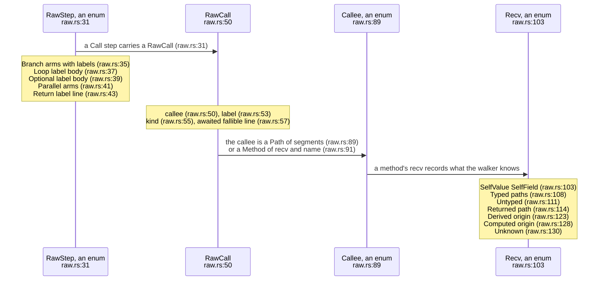
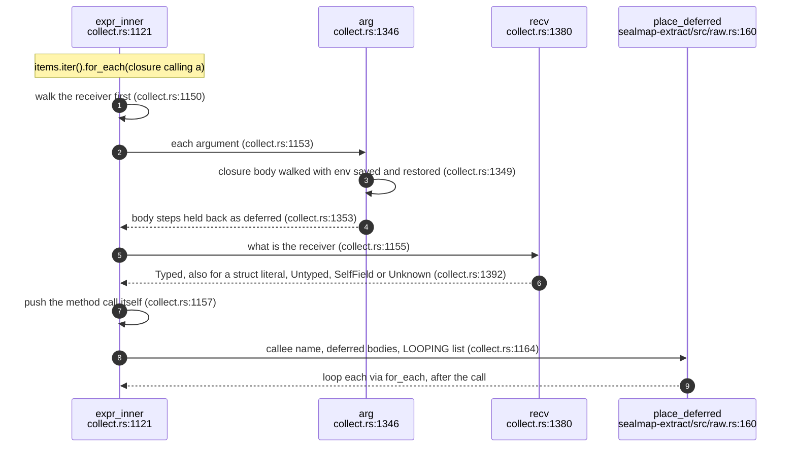
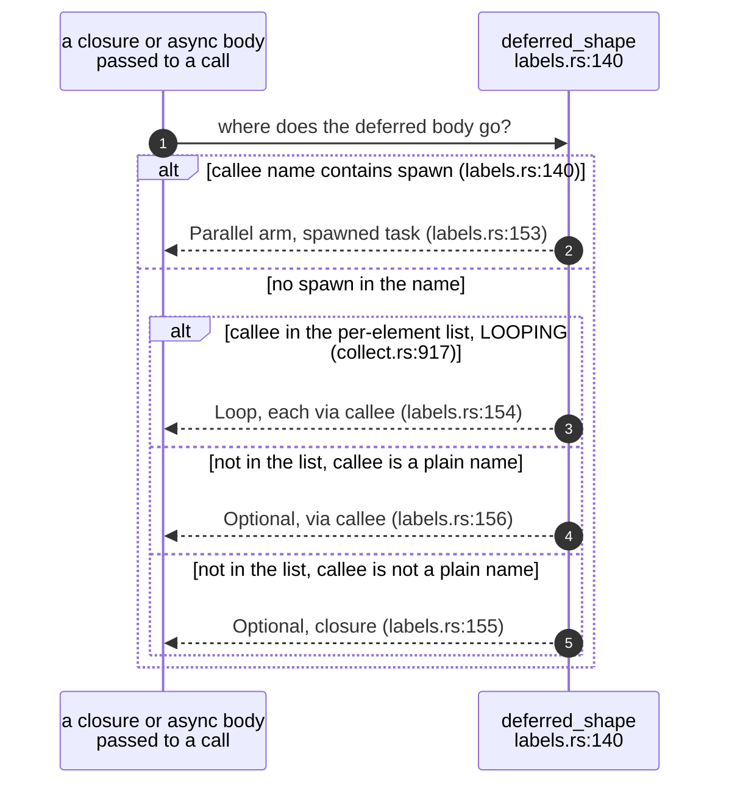
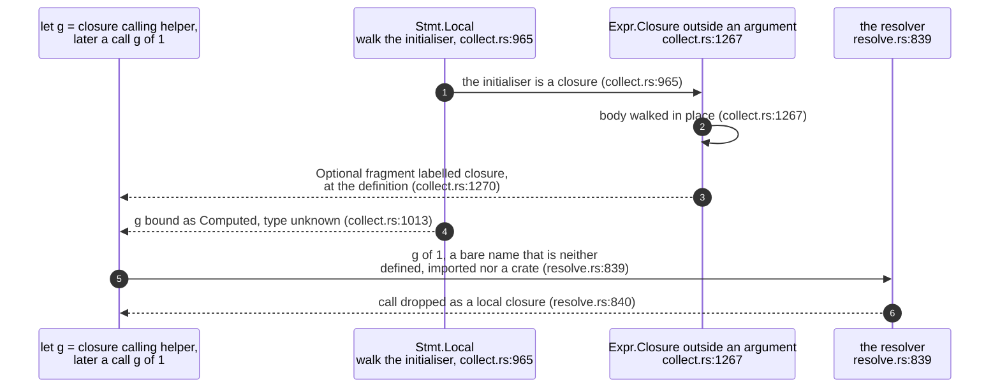
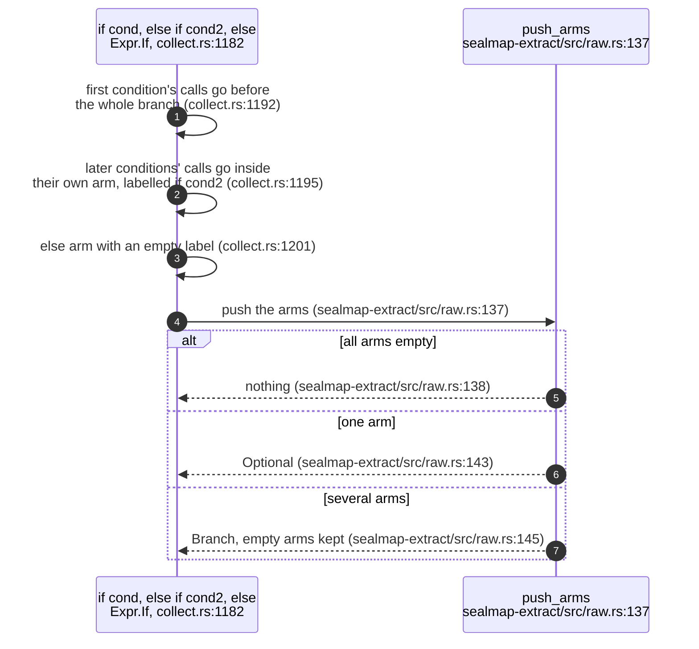
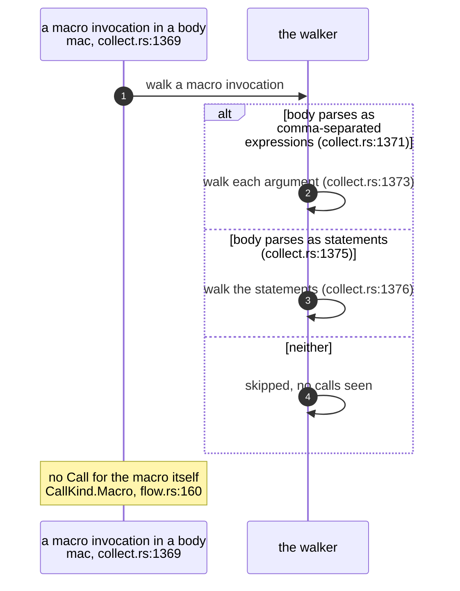
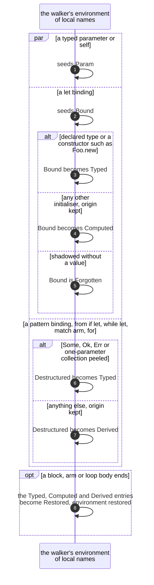

## For developers

The flow walker is what turns a function body into the ordered skeleton a
sequence diagram is drawn from. It runs in the collect pass, per file and
without any name resolution, so its output is the raw IR in
`sealmap-extract::raw`: calls with an unresolved callee, branches, loops,
optional blocks, parallel arms and early returns, all as owned strings and
vectors (`crates/sealmap-extract/src/raw.rs:1`-`7`). Resolution and lowering
happen later (EXT-04, EXT-05).

Two things the walker decides shape every diagram. First, **evaluation
order**: receivers and arguments are walked before the call that consumes
them, and closure bodies passed as arguments are placed *after* the call,
because they run during it. Second, **what is known about receivers**: the
walker keeps a small environment from local names to `Recv` values, which is
the only type information resolution will ever have. This topic draws both,
and records where the walker's view of the code diverges from what runs.

The walker was hardened with a depth cap (`crates/sealmap-rust/src/collect.rs:26`-`30`)
and taught destructuring provenance in commit `5aac8a8`.

## For the business

Sequence diagrams are the densest review material sealmap produces, and they
are only useful if their order matches what the code does. The walker gets
the common Rust shapes right: `?` and `.await` on the call they apply to,
`if`/`else` and `match` as alternatives, loops, closures run per element,
spawned tasks as parallel work.

Adopters should know the shapes it gets wrong, because a reviewer reading a
diagram cannot see them. A closure saved in a variable is drawn where it is
written, not where it is called. A macro invocation is never drawn as a call
of its own, only the calls inside its arguments, and only when those
arguments look like ordinary expressions. Both are recorded below as debt.

## EXT-03.1 The raw IR

**What it shows.** A raw call knows what was written, not what it means: a
path, or a method name plus what the walker could tell about the receiver.
`Derived` and `Computed` carry their origin, so resolution can still ask
whether a value came from internal code.

**Why it is this way.** No syn node survives the collect pass, so files can be
walked in parallel and resolved afterwards in one deterministic pass
(`crates/sealmap-extract/src/raw.rs:4`-`7`). The IR moved from `sealmap-rust`
to the shared crate unchanged in `a02b381`; the Rust collector imports its
shapers from there (`crates/sealmap-rust/src/collect.rs:24`).

**Invariant:** an empty branch arm is kept in the raw IR, so lowering can
still name the arm that survives resolution
(`crates/sealmap-extract/src/raw.rs:32`-`34`).

## EXT-03.2 Walking a method call with a closure argument

**What it shows.** Receivers and ordinary arguments are walked before the
call, so nested calls appear as earlier steps; closure and async-block
arguments are held back and placed after the call they are passed to.

**Why it is this way.** A closure passed to a call runs during it, not before
(`crates/sealmap-rust/src/collect.rs:1344`-`1345`); drawing its calls ahead of
the call would invert the order a reader sees. `?` and `.await` mark the call
they apply to through `last_call_mut`, which skips any deferred fragment
pushed after it (`crates/sealmap-extract/src/raw.rs:149`-`153`).

**Invariant:** walking stops below 1,024 levels of expression nesting, so
generated code cannot overflow the collector's stack; deeper calls are
omitted (`crates/sealmap-rust/src/collect.rs:1113`).

## EXT-03.3 Where a deferred closure body goes

**What it shows.** A body passed to anything with `spawn` in its name becomes
a parallel arm; a body passed to an iterator adaptor that runs it once per
element becomes a loop; anything else may run, so it is optional.

**Why it is this way.** The shape and the label are shared rules in
`sealmap-extract::labels`, so every adapter draws deferred bodies the same way
(`crates/sealmap-extract/src/raw.rs:155`-`159`). The per-element list is the
Rust adapter's own (`crates/sealmap-rust/src/collect.rs:916`-`941`).

**Debt:** the parallel rule is a substring test on the callee's name
(`crates/sealmap-extract/src/labels.rs:140`), so a closure passed to any
method whose name merely contains `spawn` is drawn as a concurrent task.

## EXT-03.4 A closure stored with let is drawn where it is defined

**What it shows.** The body of a closure assigned to a local is walked where
the `let` is, and appears there as an optional fragment; the later call
through the variable is recognised as a local closure and dropped.

**Why it is this way.** The walker has no data-flow analysis, and dropping
bare calls to unknown local names keeps closures and function pointers from
appearing as calls to nothing (`crates/sealmap-rust/src/resolve.rs:837`-`838`).
The test that pins the default drops `g(1)` explicitly
(`crates/sealmap-rust/tests/extract.rs:108`-`116`).

**Debt:** a closure stored with `let` is drawn where it is defined, not where
it is called (`crates/sealmap-rust/src/collect.rs:1267`-`1272`): its calls
appear once, at the definition, inside an `opt` labelled `closure`, even when
it is called many times later or never.

## EXT-03.5 if and else-if chains

**What it shows.** The first condition is always evaluated, so its calls run
before the branch; a later `else if` condition only runs when the earlier
ones failed, so its calls sit inside that arm.

**Why it is this way.** This keeps the evaluation order exact without a
control-flow graph; `match` follows the same idea with the scrutinee walked
first and one arm per pattern. The guard is in the arm's label, and its calls
open the arm, since it runs once the pattern has matched
(`crates/sealmap-rust/src/collect.rs:1209`-`1226`). Until `d227dd8` a guard was
only labelled, never walked (DEN-01.6). The shape is pinned by
`flow_shapes_follow_control_flow` (`crates/sealmap-rust/tests/extract.rs:143`).

## EXT-03.6 Macros in a body

**What it shows.** Calls inside `vec![f()]`, `assert!(g())` or
`format!("{}", h())` are seen; a macro whose body is neither an expression
list nor a statement block contributes nothing; the macro invocation itself
is never a call step.

**Why it is this way.** Without expansion, the only thing that can be walked
is a body that happens to parse as Rust (`crates/sealmap-rust/src/collect.rs:1366`-`1368`).

**Debt:** the model defines `CallKind::Macro` for "macro invocations the
adapter chose to keep" (`crates/sealmap-model/src/flow.rs:158`-`160`), but the
Rust walker never emits one: every call it pushes is a function or a method
(`crates/sealmap-rust/src/collect.rs:1140`, `crates/sealmap-rust/src/collect.rs:1161`).

## EXT-03.7 What the walker remembers about local names

**What it shows.** Parameters seed the environment; a `let` records a type
when one is declared or constructed and otherwise records where the value came
from; patterns peel one wrapper where the shape says which type the bound
name gets; every block, arm and loop body restores the environment on exit.

**Why it is this way.** Recording origins rather than guessing types was the
`Path::parent` fix: a part taken from a std value must never be matched to an
internal method of the same name (`crates/sealmap-extract/src/raw.rs:115`-`122`,
and EXT-05). Peeling rules are listed in the walker
(`crates/sealmap-rust/src/collect.rs:1025`-`1032`).

**Debt:** a `use` inside a function body is widened to the whole module's
imports (`crates/sealmap-rust/src/collect.rs:155`-`160`), so a local import in
one function can resolve a same-named path in another.
