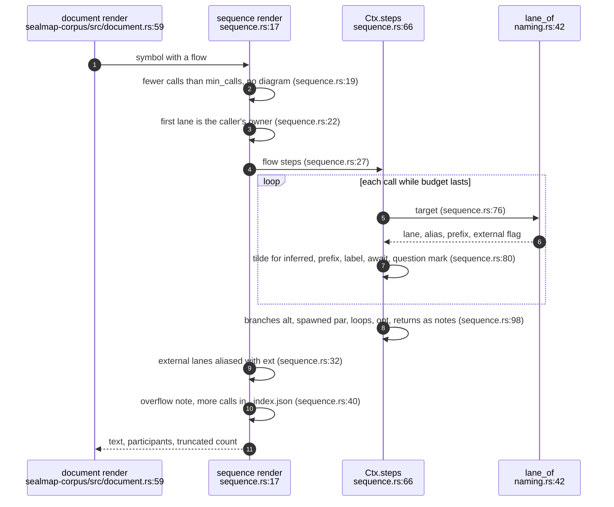
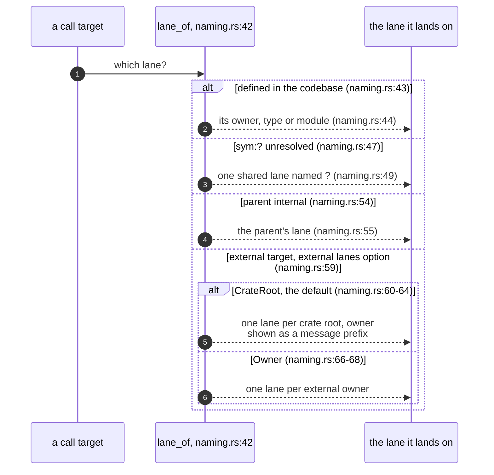
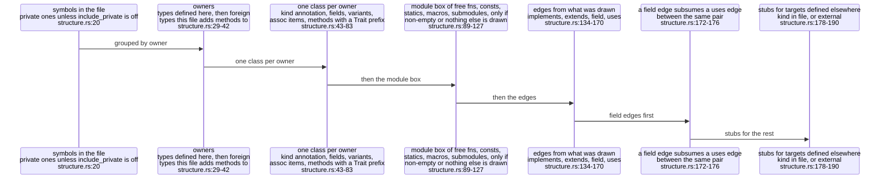
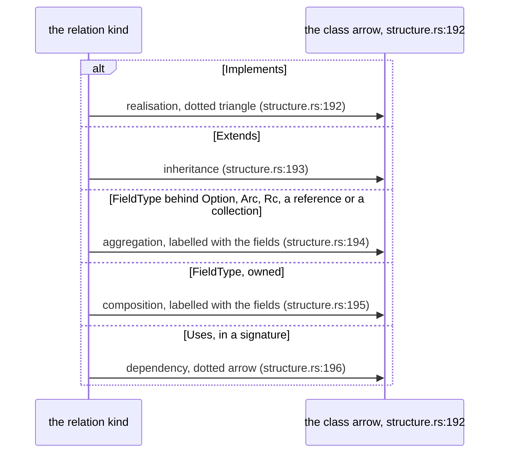
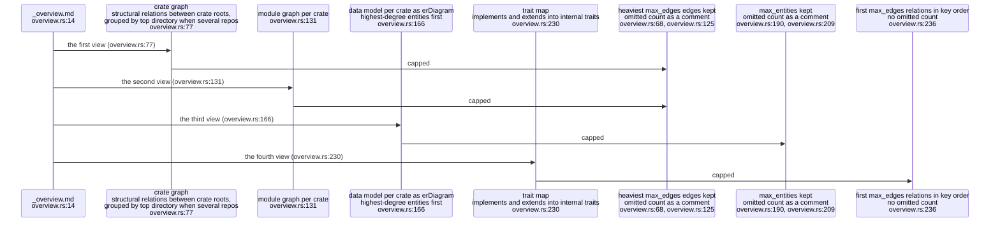

## For developers

Three projections turn the model into Mermaid through the typed writers
(MER-01) and the injective ids (MER-02):

- **sequence** (`crates/sealmap-corpus/src/sequence.rs:17`): one
  `sequenceDiagram` per callable whose flow makes at least `min_calls` calls,
  with lanes for the caller's owner, the internal types it talks to and one
  lane per external crate;
- **structure** (`crates/sealmap-corpus/src/structure.rs:14`): one
  `classDiagram` per file of what it defines, with stubs for what it touches;
- **overview** (`crates/sealmap-corpus/src/overview.rs:14`): the crate graph,
  per-crate module graphs, data models as `erDiagram` and a trait map, each
  capped so Mermaid can render it.

The agent-facing legend for all three ships inside every corpus as
`_README.md` (`crates/sealmap-corpus/src/corpus_readme.md:19`-`30`). The
dogfood fix in `6c8a9b0` (no doubled owner on external path calls) is the most
recent change here.

## For the business

These are the diagrams an agent actually reads when it consults the generated
corpus, so their honesty is what an adopter is relying on. Two conventions
carry most of it. A `~` before a message means the callee was inferred, not
proven. A lane marked `ext` is outside the codebase, so an arrow into it is a
dependency call, not your code.

The caps are a deliberate trade: a diagram over its message or edge budget is
cut, with a note saying how much was left out and where the full list is,
rather than rendered unreadably or not at all. Long functions and hub crates
are therefore always summarised in the diagrams; the complete call lists stay
in the index.

## COR-02.1 Rendering one callable

**What it shows.** Every message comes from the caller's owner; each target is
mapped to a lane; inferred calls get a `~`, awaited calls `.await`, fallible
calls `?`; control-flow steps become fragments and early returns become notes.

**Why it is this way.** The first lane is the owner (the type for a method,
the module for a free function), the participant a symbol belongs to in a
sequence (`crates/sealmap-model/src/codebase.rs:145`-`147`). A path call's
label already names its owner, so the lane prefix is added only when it is not
already there (`crates/sealmap-corpus/src/sequence.rs:83`-`88`), the fix for
`Hasher::Hasher::new_derive_key` pinned by
`external_path_calls_are_not_double_qualified`
(`crates/sealmap-corpus/tests/contract.rs:219`).

**Debt:** a sequence over `max_messages` (default 80,
`crates/sealmap-corpus/src/lib.rs:162`) drops every later call from the
diagram, wherever it sits in the flow, and says only how many
(`crates/sealmap-corpus/src/sequence.rs:71`-`73`); the dropped calls are
recoverable from `_index.json`, not from the diagram.

## COR-02.2 Which lane a call lands on

**What it shows.** Internal targets land on their owner's lane, members the
code does not define land on their internal type's lane, and external targets
land on one lane per crate (the densest option) or one per external owner.

**Why it is this way.** One lane per external crate keeps diagrams narrow; the
owner is kept in the message text (`tokio::fs::read` on a `tokio` lane), so no
information is lost (`crates/sealmap-corpus/src/lib.rs:120`-`128`).

**Debt:** every call on a receiver of unknown type shares one `?` lane
(`crates/sealmap-corpus/src/naming.rs:47`-`49`), so unrelated unknown
receivers in one function are drawn as a single participant; under the default
external policy such calls are dropped before they reach a diagram.

## COR-02.3 Assembling a file's structure diagram

**What it shows.** A file's diagram draws the types it defines and the foreign
types it extends with methods, a module box for everything else, and edges to
stubs for what it refers to elsewhere.

**Why it is this way.** A module that only holds types is already described by
them, so its box is omitted (`crates/sealmap-corpus/src/structure.rs:123`-`127`);
methods aggregate their relations to the owner type, so the diagram stays one
box per type (`crates/sealmap-corpus/src/structure.rs:133`-`141`).

**Debt:** whether a field is drawn as aggregation or composition is a
substring test on its type text (`crates/sealmap-corpus/src/structure.rs:235`-`250`),
so a user type whose name ends in `Vec` or `Option`, written with generics,
is drawn as a shared holder.

## COR-02.4 Relations as class arrows

**What it shows.** The five structural relation kinds map one to one onto
Mermaid class arrows, with field edges labelled by the field names that carry
them (`crates/sealmap-corpus/src/structure.rs:147`-`154`).

**Why it is this way.** The same legend is written into every corpus for the
agents that read it (`crates/sealmap-corpus/src/corpus_readme.md:22`-`23`).

## COR-02.5 The overview and its caps

**What it shows.** Four kinds of cross-cutting view, each with a cap: edges
by weight for the graphs, entities by degree for the data models.

**Why it is this way.** Mermaid's default edge limit is 500, so the default
cap is 300 (`crates/sealmap-corpus/src/lib.rs:141`-`143`); unresolved targets
have no crate root and are left out of the crate graph
(`crates/sealmap-corpus/src/overview.rs:81`-`82`).

**Debt:** the trait map truncates to the first `max_edges` relations in
relation order rather than the heaviest, and writes no omitted count
(`crates/sealmap-corpus/src/overview.rs:236`), unlike the graphs and data
models, so a cut trait map is indistinguishable from a complete one.
