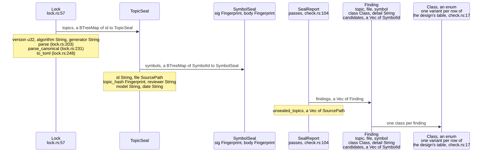
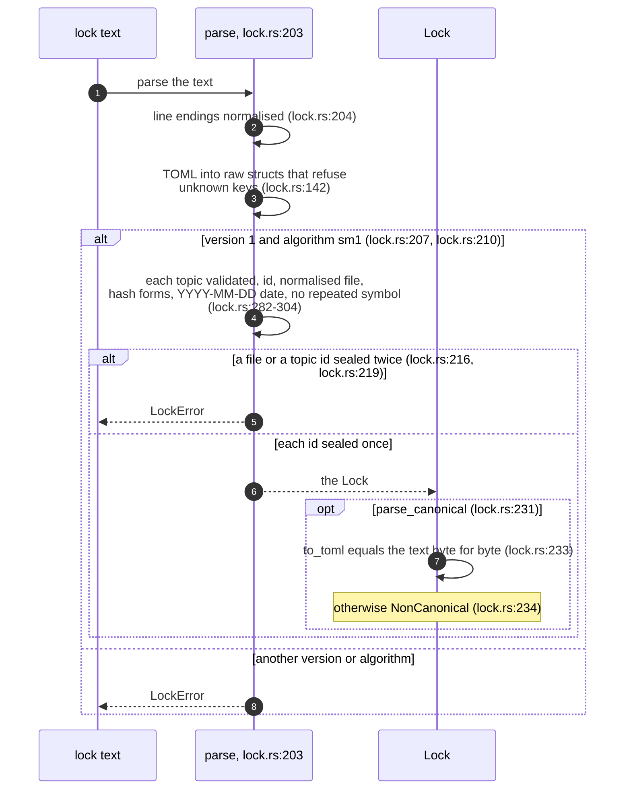
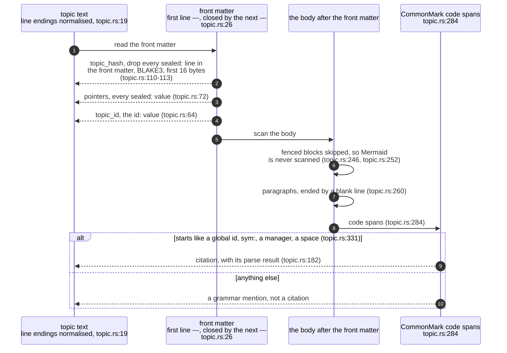
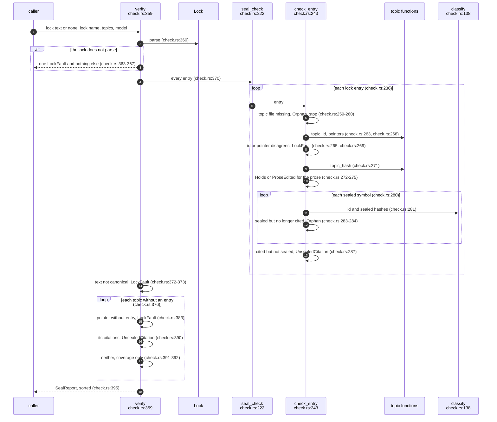
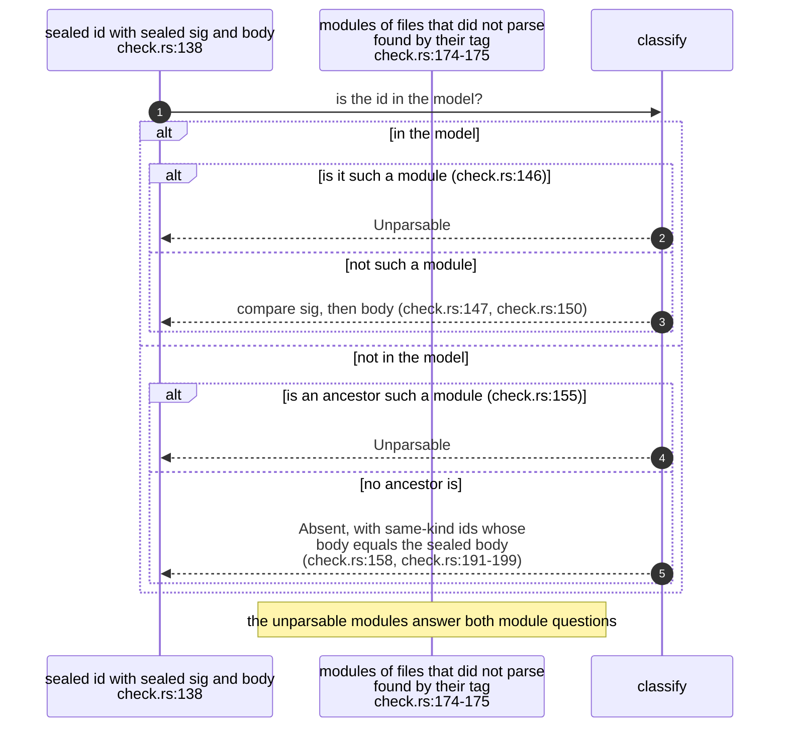
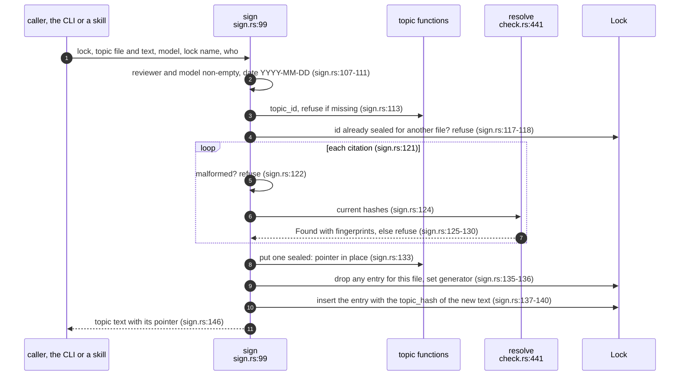

## For developers

A seal records that a hand-written topic was reviewed against exact versions
of the code it cites. `sealmap_corpus::seal` holds everything that makes that
record checkable: the lock format and its one canonical text, the hash that
binds a topic's prose, the rule that finds citations in Markdown, the
classifier, and the step that writes a seal. It is pure: callers pass models
and texts, and nothing reads the file system or runs git
(`crates/sealmap-corpus/src/seal/mod.rs:1`-`6`). The CLI around it is COR-05.

The module implements DESIGN §3 (`docs/DESIGN.md:50`-`121`). Where the design
was loose the build chose, and DESIGN now records the choices: the exact lock
layout, `topic_hash`, the citation rule, failing closed from the model alone,
and legacy topics as coverage rather than failures. After this topic you
should know what each class means, where it is decided, and which limits the
tests pin.

## For the business

A seal is the cheap, mechanical half of keeping a diagram true. A reviewer,
human or model, decides once that a topic matches the code; the lock then
remembers exactly which versions of which functions that judgement was about.
From then on a CI job can say "still true" or name the function that changed
and how (its behaviour, its contract, or its name), with no model and no
tokens involved.

It is deliberately strict where strictness is cheap. An edit to the prose
needs a re-seal, a function that cannot be parsed counts as changed rather
than as fine, and a lock edited by hand is refused. What it does not do is
judge: whether a behaviour change makes a diagram wrong is still the
reviewer's call, and the lock records who made it without policing who that
may be.

## COR-04.1 The lock and the report as types

**What it shows.** A lock is a map of topic seals keyed by topic id, each
holding the prose hash, two opaque strings and the two fingerprints of every
sealed symbol; a check produces findings, one class each.

**Why it is this way.** Ordered maps make the canonical text a function of the
data: topics in id order, symbols in id order, so two people sealing
different topics touch disjoint hunks (`crates/sealmap-corpus/src/seal/lock.rs:23`-`30`).
`reviewer` and `model` stay opaque so reviewer policy lives in the skill, not
the crate (`crates/sealmap-corpus/src/seal/lock.rs:79`-`82`).

**Invariant:** only `Holds` passes (`crates/sealmap-corpus/src/seal/check.rs:45`-`46`),
and a report passes only when every finding does
(`crates/sealmap-corpus/src/seal/check.rs:104`-`105`).

## COR-04.2 Reading a lock

**What it shows.** `parse` validates every field and returns a lock; only
`parse_canonical` also demands the exact bytes the writer would produce.

**Why it is this way.** Canonicality is checked by re-serialising, so the
writer is the only definition of the format and there is no second grammar to
drift from it (`crates/sealmap-corpus/src/seal/lock.rs:227`-`235`). `parse`
alone normalises line endings, so a lock checked out with `\r\n` can be read
and re-signed, while `verify` still reports it as not canonical
(`crates/sealmap-corpus/src/seal/lock.rs:229`-`230`).

**Invariant:** the writer round-trips byte for byte and is independent of
signing order, pinned by a fixed-layout test and a property test over
arbitrary strings (`crates/sealmap-corpus/tests/seal.rs:554`,
`crates/sealmap-corpus/tests/lock_props.rs:46`).

## COR-04.3 What a topic contributes

**What it shows.** The front matter yields the id, the pointer and (with the
pointer removed) the bytes the prose hash covers; the body yields citations,
which are code spans outside fences that start like a global `sym:` id.

**Why it is this way.** Ids contain spaces, so nothing but a code span can
delimit one, and a span can wrap across lines inside a paragraph
(`crates/sealmap-corpus/src/seal/topic.rs:198`-`214`). Removing the pointer
before hashing is what lets a re-seal leave the prose untouched
(`crates/sealmap-corpus/src/seal/topic.rs:92`-`94`). A span that starts like a
global id but does not parse is kept with its error, so a typo fails a check
instead of vanishing (`crates/sealmap-corpus/src/seal/topic.rs:198`-`200`).

**Open:** an example id written in prose is indistinguishable from a citation
(`crates/sealmap-corpus/src/seal/topic.rs:343`-`350`); the only escape is a
fenced block, and nothing records whether topics that explain the grammar are
meant to need one.

## COR-04.4 One verify run

**What it shows.** `seal_check` judges each lock entry against its topic and
the model; `verify` adds what only a corpus-wide view sees: canonicality,
pointers with no entry, and citations in topics nobody sealed.

**Why it is this way.** A non-canonical lock is still classified in full, so
one stray byte does not hide a real behaviour change
(`crates/sealmap-corpus/tests/seal.rs:387`). Legacy `path:line` topics are
coverage, not failures, so a corpus migrates one topic at a time
(`docs/DESIGN.md:119`-`121`).

**Debt:** removing a topic's lock entry and its pointer together passes
`verify` whenever the topic cites no `sym:` id, because such a topic is then
indistinguishable from one never sealed (`crates/sealmap-corpus/src/seal/check.rs:391`-`392`);
nothing remembers that a topic was once sealed.

## COR-04.5 Deciding one symbol, and failing closed

**What it shows.** A file the adapter could not parse survives in the model as
its module symbol tagged `parse_error`; any sealed id that is that module, or
sits beneath it and is missing, is unparsable before it can be called absent
or changed. MOD-02.5 draws the comparison itself.

**Why it is this way.** The tag is a named constant in the model
(`crates/sealmap-model/src/symbol.rs:360`), so the check needs nothing but the
`Codebase`, not the adapter's diagnostics. An unset fingerprint never matches
as a rename candidate (`crates/sealmap-corpus/src/seal/check.rs:192`).

**Invariant:** unparsable code never reads as holding or absent; pinned on a
broken file holding two sealed methods and the sealed module itself
(`crates/sealmap-corpus/tests/seal.rs:255`).

**Debt:** a module's `body_hash` folds its members in source order
(`crates/sealmap-rust/src/collect.rs:179`-`180`), so reordering methods inside
a sealed module turns the module into Behaviour while every method holds
(`crates/sealmap-corpus/tests/seal.rs:187`); a module is a poor thing to seal.

**Debt:** the generated diagram of `classify` omits this unparsable arm, and
the generated diagram of `sign` omits its success arm, because lowering drops
any arm without a kept call (`crates/sealmap-extract/src/lower.rs:71`,
`crates/sealmap-corpus/src/seal/check.rs:146`,
`crates/sealmap-corpus/src/seal/sign.rs:125`-`126`); read from the generated
corpus alone, both functions look as if they had no such path.

## COR-04.6 Writing a seal

**What it shows.** A seal is derived, never typed in: every cited id is
resolved now, and any citation `verify` could not confirm stops the seal
before the lock is touched.

**Why it is this way.** The design makes the sign step mechanical so the lock
is never hand-edited (`docs/DESIGN.md:80`-`85`). Replacing by file as well as
by id means a renumbered topic moves its seal rather than leaving the old
entry orphaned (`crates/sealmap-corpus/tests/seal.rs:543`).

**Invariant:** nothing is sealed that `verify` would not then pass: a citation
that is malformed, absent, unparsable or unfingerprinted is refused
(`crates/sealmap-corpus/src/seal/sign.rs:122`-`130`), pinned by
`crates/sealmap-corpus/tests/seal.rs:523`.
