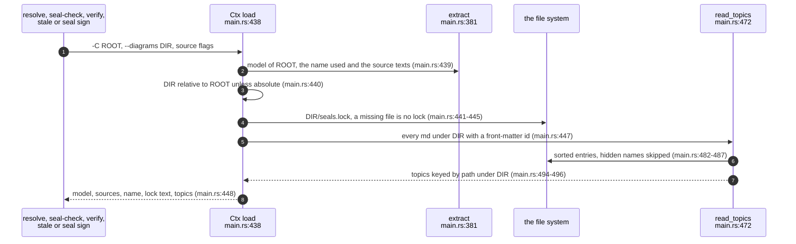
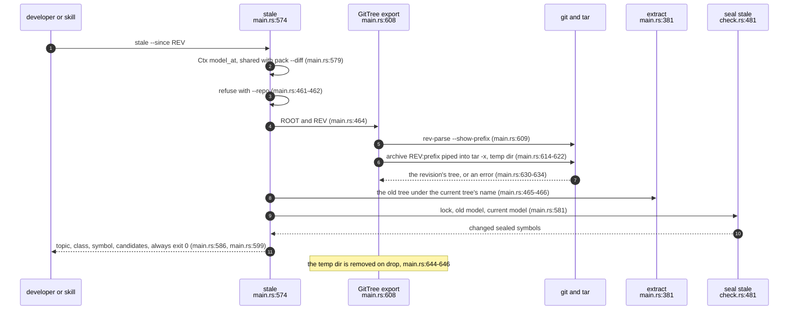
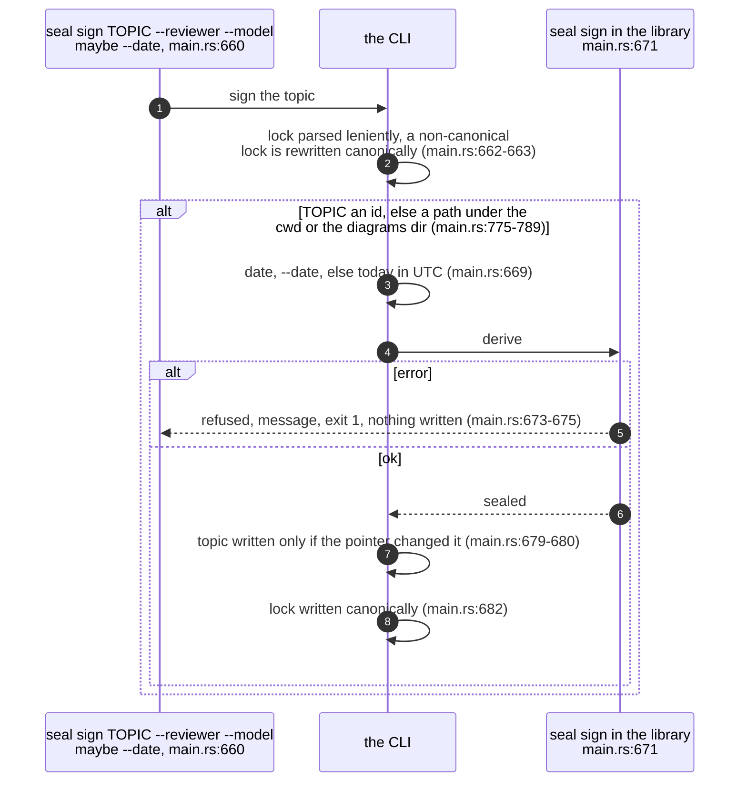
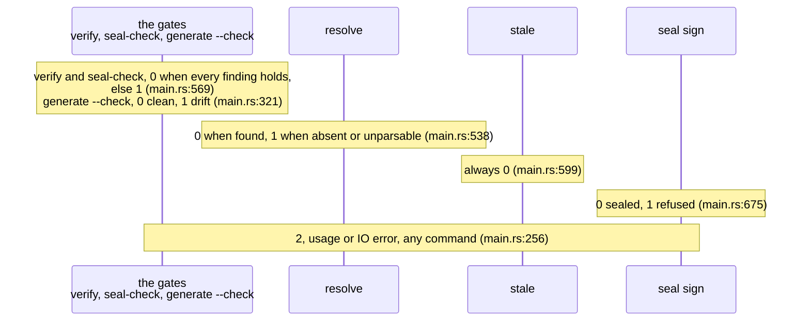

## For developers

The seal commands are thin: each one loads the same context (a model of the
source root, the lock text and the topic files), calls one function of
`sealmap_corpus::seal` (COR-04), and prints text or JSON. The only processes
the CLI spawns are for `stale --since` and `pack --diff`, which export a git
revision into a temporary directory so the library can compare two models,
and `git rev-parse` and `git status` for a pack's revision line; git stays out
of the libraries (`docs/DESIGN.md:166`-`169`). `pack` itself is COR-06.

After this topic you should know what each command reads and writes, how a
revision becomes a second model, what the exit codes mean, and which options
a seal silently depends on.

## For the business

Five commands cover the whole seal workflow for a pipeline or a skill: ask
where a function is now, seal a reviewed topic, gate CI on every seal,
classify a chosen few, and list what changed since a release or a branch
point. The last one always succeeds, so it can feed a report without failing
a build; the gate fails on anything short of "still true".

One caution for adopters: a seal remembers functions by id, and the ids
depend on how the code was read (whether tests were included, what the
codebase is called when no manifest names it). Checking a seal with different
settings from the ones it was signed with makes sealed functions look absent.

## COR-05.1 What every seal command loads

**What it shows.** One loader feeds every seal command, so they all see the
same model, the same lock bytes and the same topic set.

**Why it is this way.** The lock is kept as text, not parsed here, because
`verify` must judge its bytes for canonicality while `seal sign` only needs to
read it (`crates/sealmap/src/main.rs:433`,
`crates/sealmap/src/main.rs:662`-`663`). A topic is any Markdown file whose
front matter has an `id:`, so the corpus's README and indexes are ignored
(`crates/sealmap/src/main.rs:494`).

**Debt:** a seal does not record the extraction options that shape ids, so a
lock signed with `--tests` and checked without it reports its test symbols as
absent; only the flag's doc comment says so
(`crates/sealmap/src/main.rs:73`-`74`).

## COR-05.2 stale --since, two trees

**What it shows.** A revision becomes a second model by exporting only the
subdirectory the root points at, so paths line up, and reading it under the
current codebase name, so ids line up.

**Why it is this way.** Each sealed symbol's baseline is its hashes in the old
model when it is there, else its sealed hashes, so `--since` reports what
changed since that revision whatever the lock says
(`crates/sealmap-corpus/src/seal/check.rs:486`-`489`). The CLI test commits a
behaviour change, edits a signature after it, and sees only the contract
change with `--since HEAD` (`crates/sealmap/tests/cli.rs:116`, `crates/sealmap/tests/cli.rs:141`).

**Debt:** `--since` needs `tar` on the path as well as `git`
(`crates/sealmap/src/main.rs:622`), and a process killed mid-run leaves its
`sealmap-since-*` directory in the system temp directory, since only a normal
drop removes it (`crates/sealmap/src/main.rs:644`-`646`).

## COR-05.3 seal sign, from the command line

**What it shows.** Signing reads, derives and refuses before it writes; a
successful sign writes at most two files, the topic first and the lock last.

**Why it is this way.** The library does the derivation and the CLI only the
IO, so a skill can call either (`docs/DESIGN.md:80`-`85`). The default date is
computed from the system clock without a date library
(`crates/sealmap/src/main.rs:793`-`800`).

**Invariant:** a failure between the two writes leaves a pointer with no
entry, which `verify` reports as a lock fault, so an interrupted sign can
never pass the gate (`crates/sealmap/src/main.rs:680`-`682`,
`crates/sealmap-corpus/src/seal/check.rs:383`).

## COR-05.4 Exit codes

**What it shows.** Exit 1 always means "the check ran and said no", and 2
always means the command could not run.

**Why it is this way.** `stale` is a report, not a gate, so a skill can call
it on every commit without failing the build; the design gives it exit 0
(`docs/DESIGN.md:157`). `resolve` fails when the id is not found so a script
that checks diagram edges can branch on it (`README.md:291`-`292`); the codes
are pinned end to end (`crates/sealmap/tests/cli.rs:55`,
`crates/sealmap/tests/cli.rs:96`).
