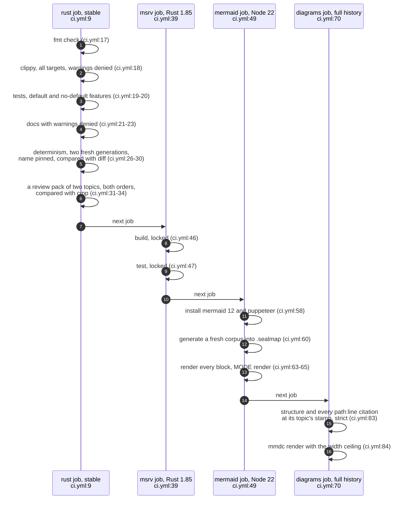
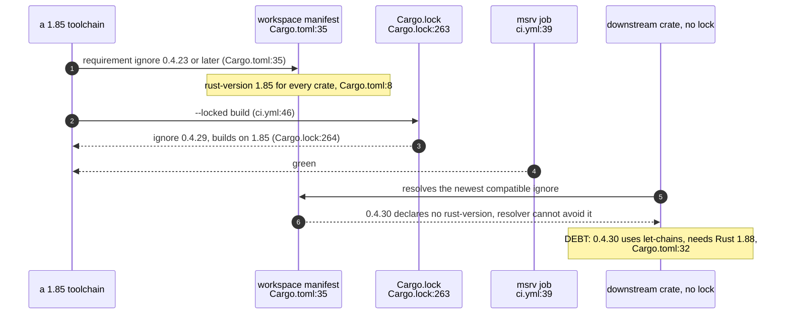
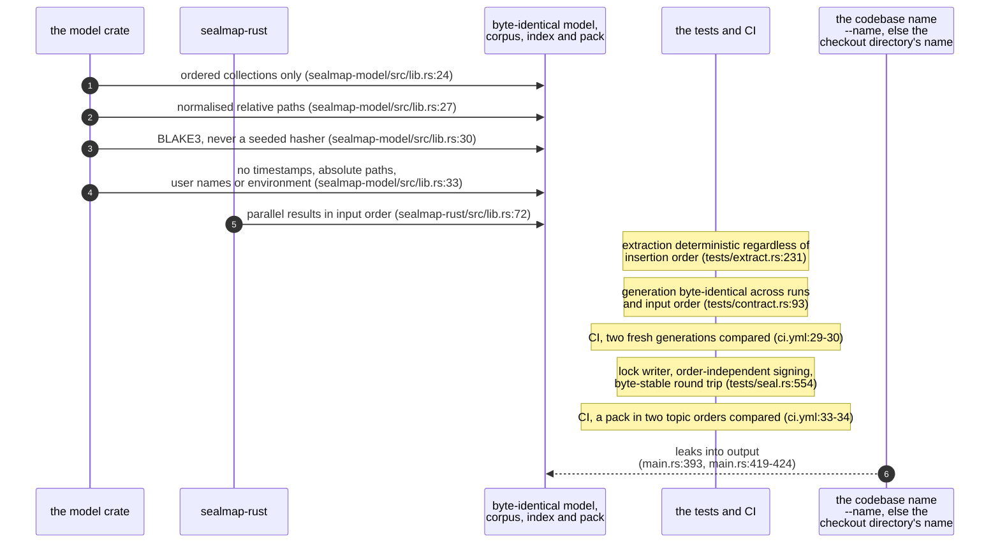
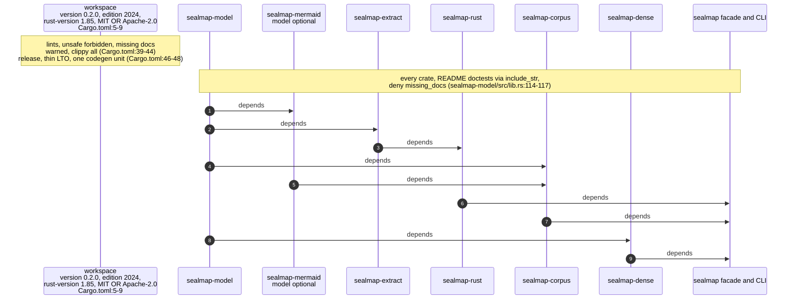
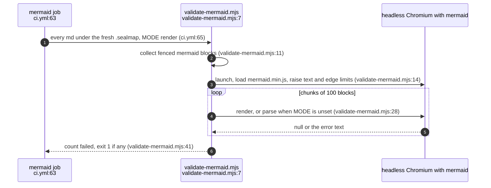

## For developers

sealmap's delivery surface is one workflow with four jobs, a workspace
manifest that every crate inherits its metadata, lints and MSRV from, and a
handful of guarantees the code makes about its own output. This topic draws
the jobs, the MSRV problem the `msrv` job found the day it was added, the
chain of mechanisms behind "byte-identical on every machine", and how the
crates are prepared for crates.io.

The relevant history is short: the `msrv` job came in `dc5e025`; per-crate
READMEs, docs.rs metadata and `deny(missing_docs)` in `d308faf`; the dual
licence in `0d1fe6b`; the committed generated corpus and its drift gate were
retired in step 3, when CI started checking determinism instead. None of the
0.2 crates in this tree is published yet; the README's roadmap puts the first
0.2 crates.io release after step 3, which is now done in the tree
(`README.md:364`-`367`).

## For the business

Three promises here are what make sealmap cheap to adopt in an agent harness.
It builds on a stated, tested minimum Rust (1.85), so a harness image does not
have to chase the newest toolchain. Its output is byte-identical for the same
sources and options on any machine, so results can be cached, diffed and
compared in CI without noise. And every crate is held to full documentation
and warning-free docs, which is the bar for a library others depend on.

There is one live caveat on the first promise. A dependency (`ignore` 0.4.30)
needs a newer Rust than it declares; inside this repository the lockfile
avoids it, but a project that depends on the published crates without that
lock can still pull it in on Rust 1.85 and fail to build.

## DEL-01.1 The four CI jobs

**What it shows.** Stable gets the full lint, test and doc gate and a
determinism check; the declared MSRV gets build and test against the
lockfile; a freshly generated corpus is rendered by real Mermaid in headless
Chromium; and the hand-authored corpus is checked and rendered by its own
generator.

**Why it is this way.** Nothing generated is committed any more, so the gate
is that two generations agree byte for byte (`.github/workflows/ci.yml:24`-`25`),
not that a committed copy matches. Testing with `--no-default-features`
exercises the sequential collection path, which must give the same output as
the parallel one (`crates/sealmap-rust/src/lib.rs:72`-`75`). The Mermaid job
is the proof that typed writers produce valid diagrams (`README.md:321`-`324`).

**Debt:** the MSRV job runs only `build` and `test` with default features
(`.github/workflows/ci.yml:46`-`47`); clippy, docs and the
`--no-default-features` configuration are checked on stable only.

**Open:** no job runs `sealmap verify` yet: this repository's topics are not
sealed (DESIGN step 6 adds it, non-blocking first), so the seal gate is
exercised only by its tests.

## DEL-01.2 The ignore 0.4.30 problem

**What it shows.** The repository builds on 1.85 because the lockfile pins
`ignore` 0.4.29; the requirement stays at `0.4.23` so downstream graphs can
unify on newer releases, which is exactly what exposes them to 0.4.30.

**Why it is this way.** The MSRV-aware resolver skips releases that declare a
newer `rust-version`, but 0.4.30 declares none, so it is chosen and fails; the
comment gives the manual remedy for a 1.85 user outside the workspace
(`Cargo.toml:32`-`34`, `.github/workflows/ci.yml:36`-`38`). `ignore` is a
dependency because the model crate's loader honours ignore files
(`crates/sealmap-model/Cargo.toml:21`).

**Tension (MSRV vs dependency):** `ignore` 0.4.30 needs Rust 1.88 without
declaring it (`Cargo.toml:32`-`33`), against the declared MSRV 1.85
(`Cargo.toml:8`); only the lockfile pin to 0.4.29 (`Cargo.lock:264`) keeps the
MSRV true, and a published crate ships without that lock.

## DEL-01.3 Where byte-identical output comes from

**What it shows.** Five mechanisms feed the guarantee, two tests and a CI step
hold it for generated output, and a test plus a property test
(`crates/sealmap-corpus/tests/lock_props.rs:46`) hold it for the seal lock;
one input, the codebase name, comes from outside the source bytes unless it is
pinned.

**Why it is this way.** The model crate states the four-clause contract that
downstream crates rely on (`crates/sealmap-model/src/lib.rs:18`-`34`). CI pins
`--name sealmap` so the checkout directory cannot leak into the output
(`.github/workflows/ci.yml:29`).

**Tension (determinism contract vs CLI):** "no ambient data"
(`crates/sealmap-model/src/lib.rs:33`-`34`) holds for the model's types, but the
CLI names the codebase after the canonicalised checkout directory when no
name is given (`crates/sealmap/src/main.rs:393`, `crates/sealmap/src/main.rs:419`-`424`),
and that name reaches the index and overview, so two clones in differently
named directories produce different bytes. For seals the name matters only
where no `Cargo.toml` names the package, which is why `stale --since` reads
the older tree under the current tree's name.

## DEL-01.4 Crates, dependencies and publication

**What it shows.** Seven crates inherit version, edition, MSRV, licence,
repository and lints from one manifest; the dependency graph runs model →
extract → rust, model/mermaid → corpus and model → dense, with the facade on
top.

**Why it is this way.** Workspace path dependencies carry a version too
(`Cargo.toml:17`-`22`), so the crates can be published without editing
manifests; the README examples of every crate compile as doctests, so the
crates.io page cannot drift from the API (`crates/sealmap-model/src/lib.rs:114`-`117`).

**Open:** the workspace lint level for missing docs is `warn`
(`Cargo.toml:41`) while every crate root raises it to `deny`
(`crates/sealmap-model/src/lib.rs:78`); nothing records which level a new
crate is meant to start from.

## DEL-01.5 The Mermaid validator

**What it shows.** The validator extracts every fenced block and asks real
Mermaid to lay it out, in batches, in one browser page.

**Why it is this way.** Rendering in the real library is the only check that
matches what a reader's renderer does; the edge and text limits are raised so
large generated diagrams are judged on grammar and layout, not size
(`tools/validate-mermaid.mjs:19`). The script defaults to `parse`
(`tools/validate-mermaid.mjs:15`); CI asks for a full render because some
faults only surface at layout (`.github/workflows/ci.yml:61`-`62`).
