# sealmap overview
37 files · 437 symbols · 1217 relations · 161 flows · 745 calls

## crates
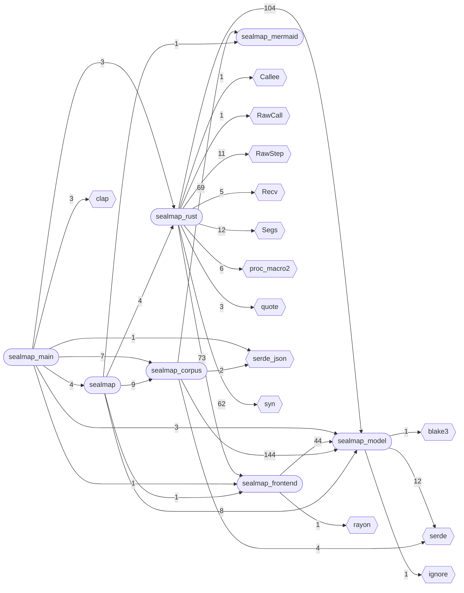

## modules: sealmap_corpus
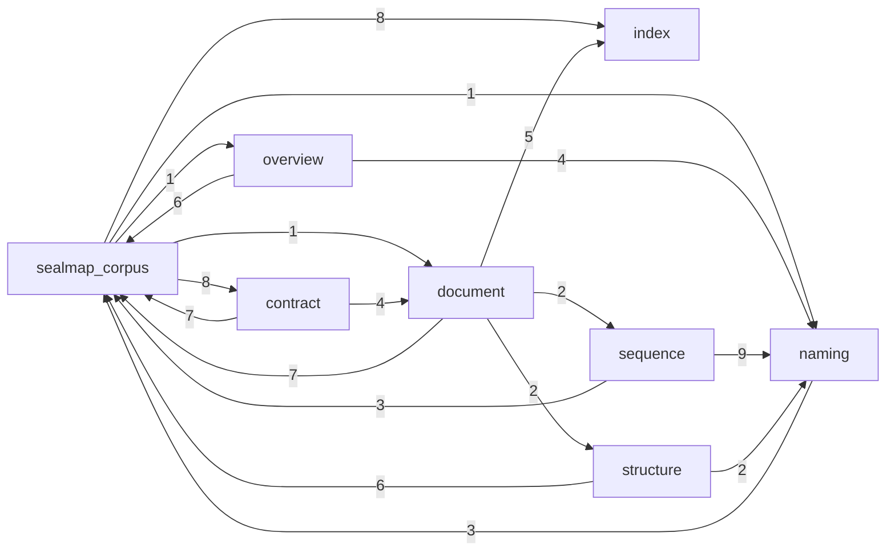

## modules: sealmap_frontend
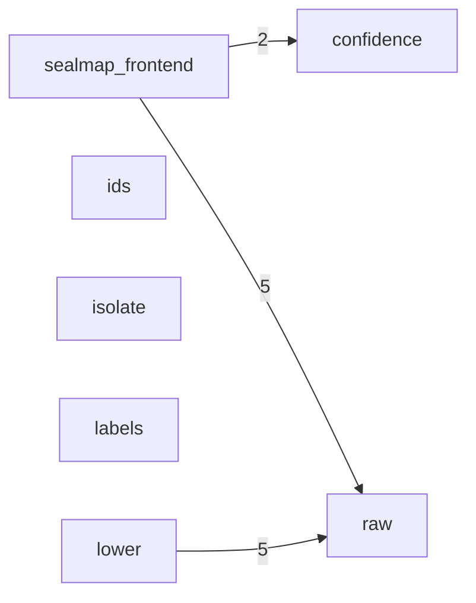

## modules: sealmap_mermaid
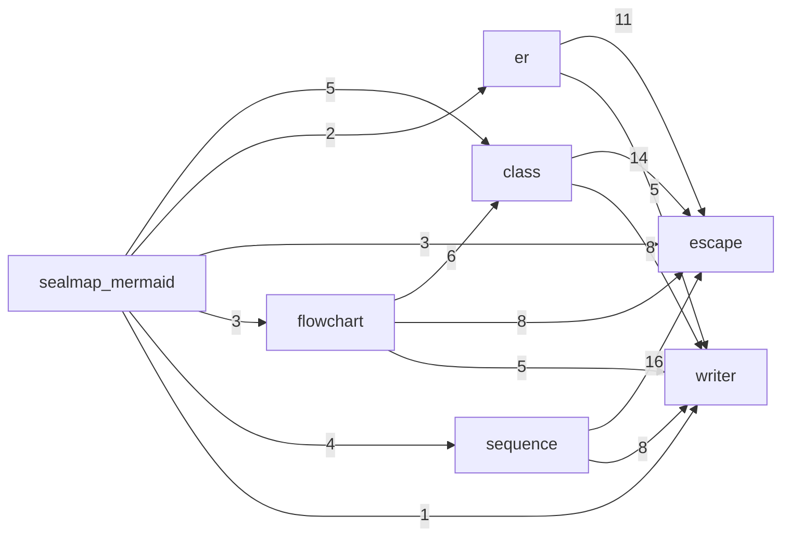

## modules: sealmap_model
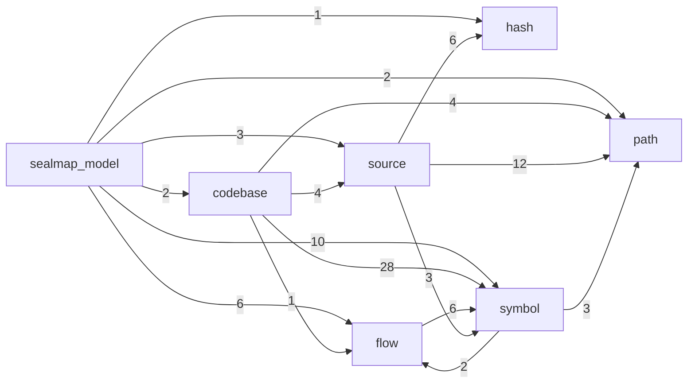

## modules: sealmap_rust
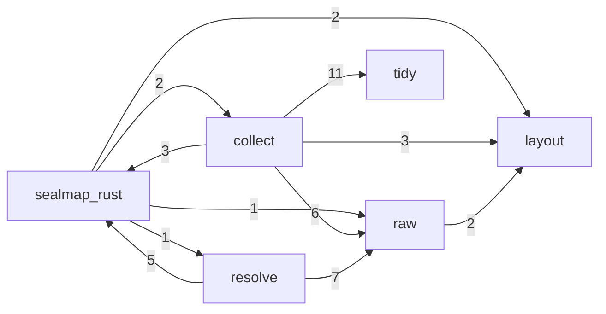

## data: sealmap_corpus
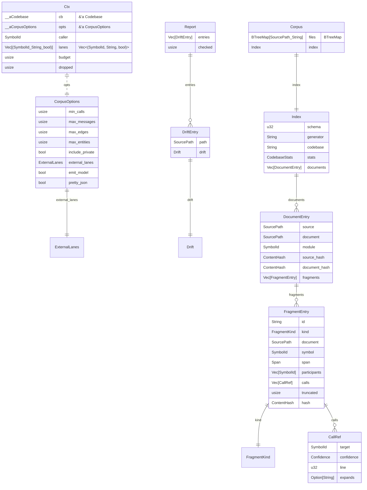

## data: sealmap_frontend
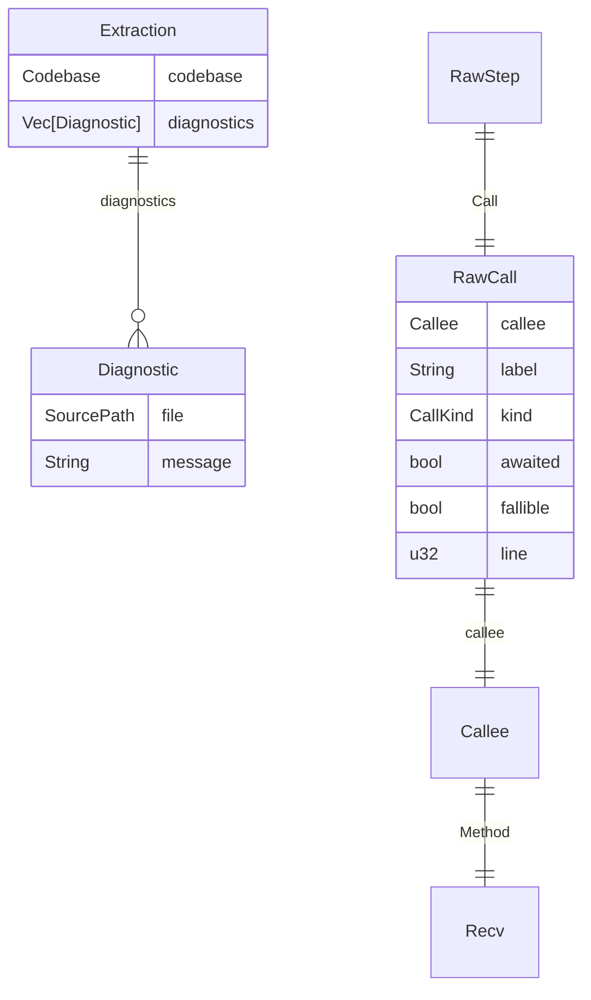

## data: sealmap_main
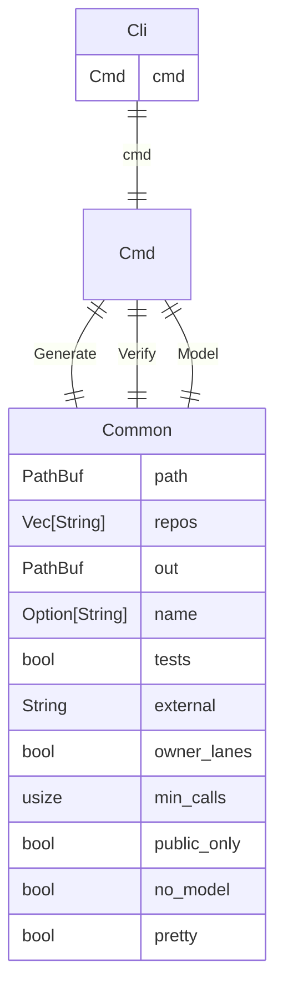

## data: sealmap_mermaid

## data: sealmap_model
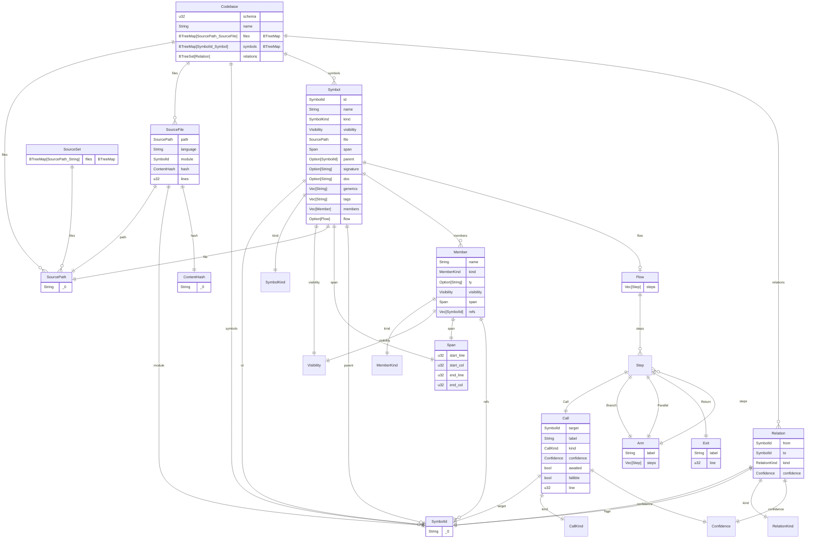

## data: sealmap_rust
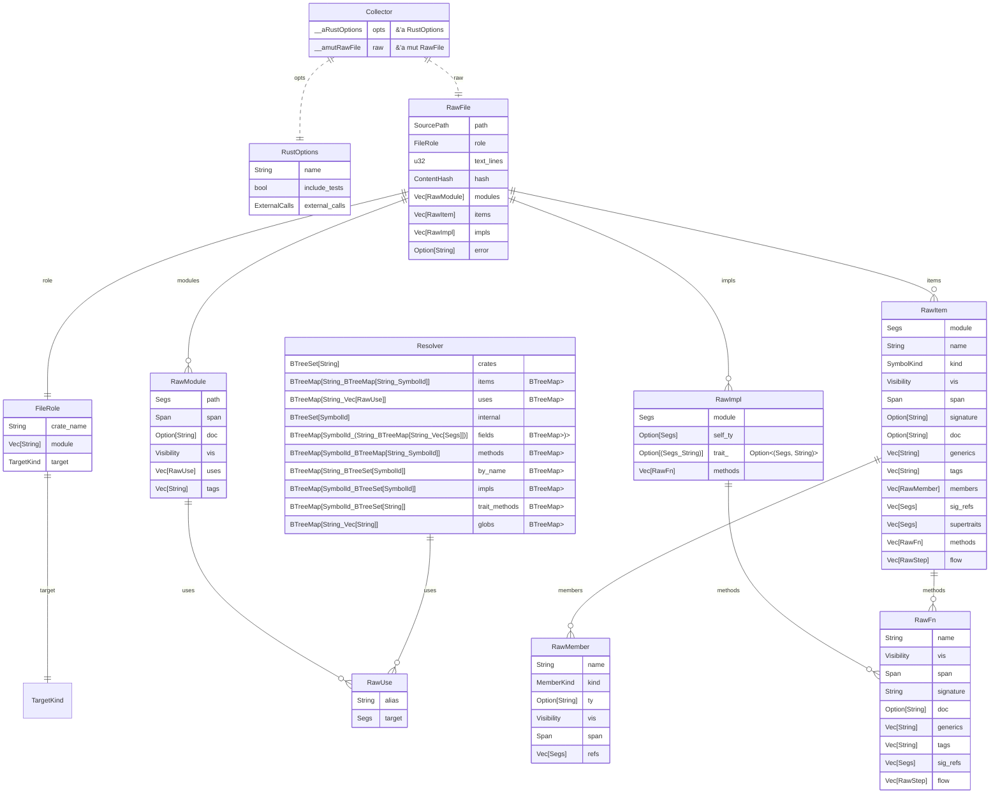
