# sealmap overview
41 files · 619 symbols · 1691 relations · 256 flows · 1177 calls

## crates
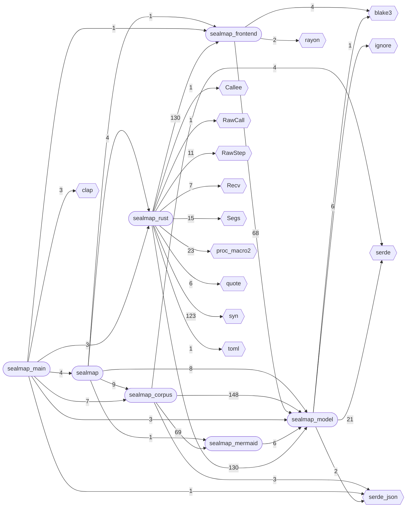

## modules: sealmap_corpus
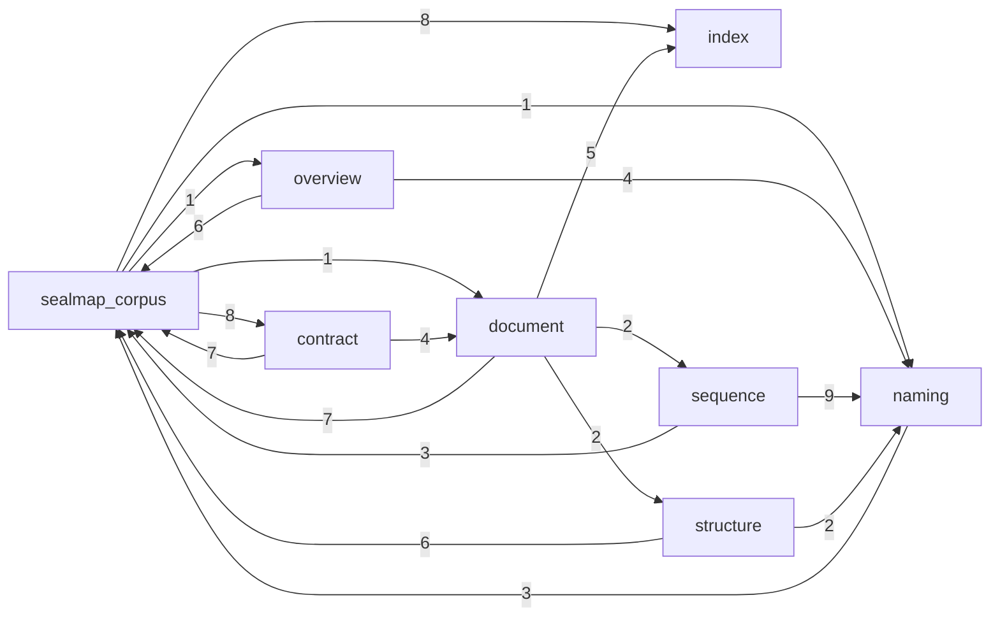

## modules: sealmap_frontend
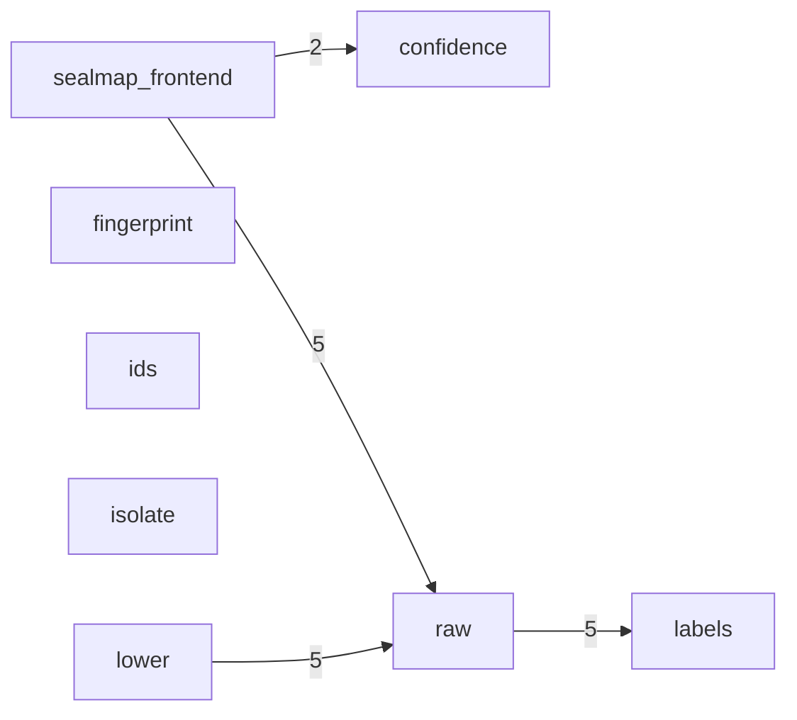

## modules: sealmap_mermaid
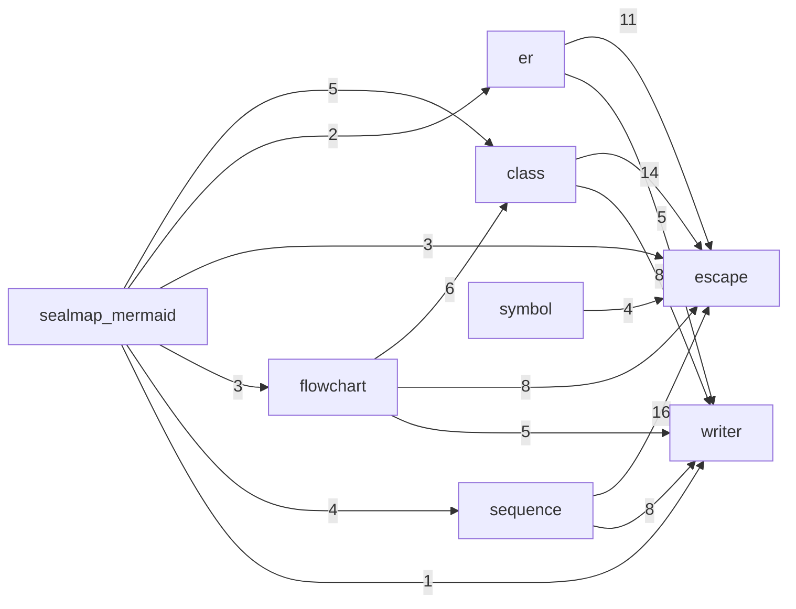

## modules: sealmap_model
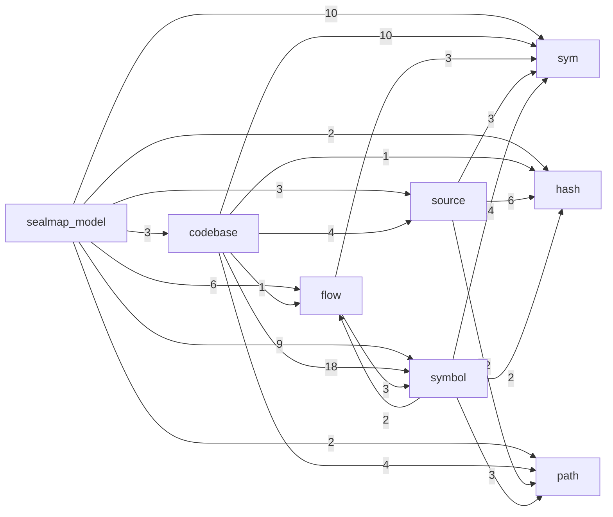

## modules: sealmap_rust
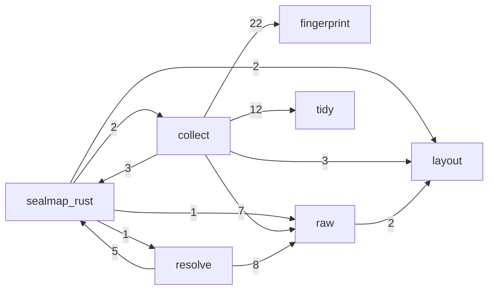

## data: sealmap_corpus
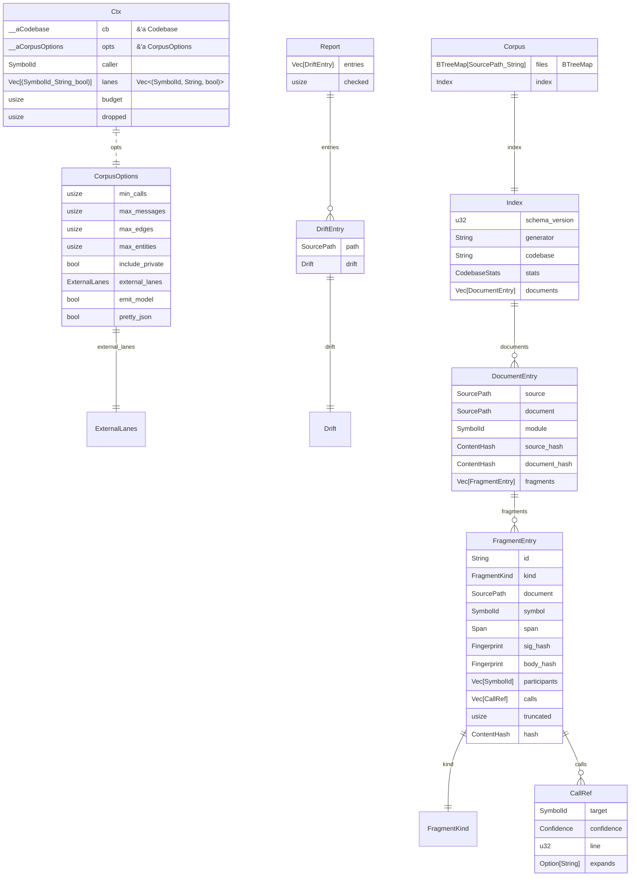

## data: sealmap_frontend
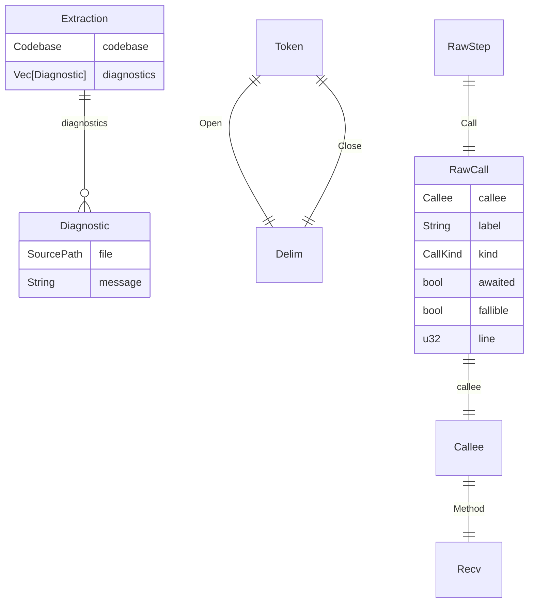

## data: sealmap_main
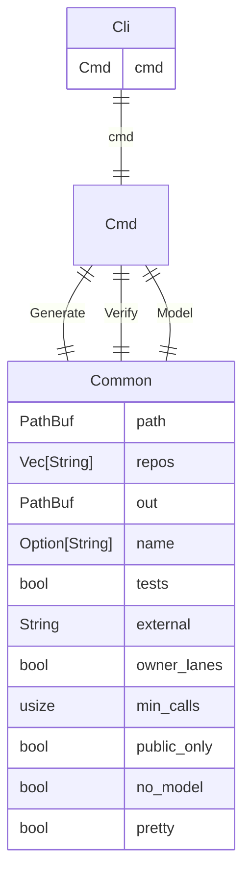

## data: sealmap_mermaid
```mermaid
erDiagram
  sealmap_mermaid__class___tClass["Class"] {
    Ident id
    String label
    Option[String] annotation
    Vec[String] members
  }
  sealmap_mermaid__class___tClassDiagram["ClassDiagram"] {
    Option[Direction] direction_
    Vec[Class] classes
    Vec[ClassRelation] relations
  }
  sealmap_mermaid__class___tClassRelation["ClassRelation"] {
    Ident from
    Ident to
    ClassRelationKind kind
    Option[String] label
  }
  sealmap_mermaid__class___tClassRelationKind["ClassRelationKind"]
  sealmap_mermaid__class___tDirection["Direction"]
  sealmap_mermaid__er___tAttr["Attr"] {
    String ty
    String name
    Option[__staticstr] key "Option<&'static str>"
    Option[String] comment
  }
  sealmap_mermaid__er___tCardinality["Cardinality"]
  sealmap_mermaid__er___tEntity["Entity"] {
    Ident id
    String label
    Vec[Attr] attrs
  }
  sealmap_mermaid__er___tErDiagram["ErDiagram"] {
    Vec[Entity] entities
    Vec[Rel] rels
  }
  sealmap_mermaid__er___tRel["Rel"] {
    Ident from
    Cardinality from_card
    Ident to
    Cardinality to_card
    bool identifying
    String label
  }
  sealmap_mermaid__escape___tIdent["Ident"] {
    String _0
  }
  sealmap_mermaid__flowchart___tEdgeStyle["EdgeStyle"]
  sealmap_mermaid__flowchart___tFlowchart["Flowchart"] {
    Direction direction_
    Vec[Stmt] body
  }
  sealmap_mermaid__flowchart___tNodeShape["NodeShape"]
  sealmap_mermaid__flowchart___tStmt["Stmt"]
  sealmap_mermaid__sequence___tArrow["Arrow"]
  sealmap_mermaid__sequence___tBlockKind["BlockKind"]
  sealmap_mermaid__sequence___tItem["Item"]
  sealmap_mermaid__sequence___tSeqBuilder["SeqBuilder"] {
    Vec[Item] items
  }
  sealmap_mermaid__sequence___tSequenceDiagram["SequenceDiagram"] {
    Option[String] title
    bool autonumber_
    Vec[(Ident_String_bool)] participants "Vec<(Ident, String, bool)>"
    SeqBuilder body
  }
  sealmap_mermaid__class___tClass ||--|| sealmap_mermaid__escape___tIdent : "id"
  sealmap_mermaid__class___tClassDiagram ||--o| sealmap_mermaid__class___tDirection : "direction"
  sealmap_mermaid__class___tClassDiagram ||--o{ sealmap_mermaid__class___tClass : "classes"
  sealmap_mermaid__class___tClassDiagram ||--o{ sealmap_mermaid__class___tClassRelation : "relations"
  sealmap_mermaid__class___tClassRelation ||--|| sealmap_mermaid__escape___tIdent : "from"
  sealmap_mermaid__class___tClassRelation ||--|| sealmap_mermaid__escape___tIdent : "to"
  sealmap_mermaid__class___tClassRelation ||--|| sealmap_mermaid__class___tClassRelationKind : "kind"
  sealmap_mermaid__er___tEntity ||--|| sealmap_mermaid__escape___tIdent : "id"
  sealmap_mermaid__er___tEntity ||--o{ sealmap_mermaid__er___tAttr : "attrs"
  sealmap_mermaid__er___tErDiagram ||--o{ sealmap_mermaid__er___tEntity : "entities"
  sealmap_mermaid__er___tErDiagram ||--o{ sealmap_mermaid__er___tRel : "rels"
  sealmap_mermaid__er___tRel ||--|| sealmap_mermaid__escape___tIdent : "from"
  sealmap_mermaid__er___tRel ||--|| sealmap_mermaid__er___tCardinality : "from_card"
  sealmap_mermaid__er___tRel ||--|| sealmap_mermaid__escape___tIdent : "to"
  sealmap_mermaid__er___tRel ||--|| sealmap_mermaid__er___tCardinality : "to_card"
  sealmap_mermaid__flowchart___tFlowchart ||--|| sealmap_mermaid__class___tDirection : "direction"
  sealmap_mermaid__flowchart___tFlowchart ||--o{ sealmap_mermaid__flowchart___tStmt : "body"
  sealmap_mermaid__flowchart___tStmt ||--|| sealmap_mermaid__escape___tIdent : "Node"
  sealmap_mermaid__flowchart___tStmt ||--|| sealmap_mermaid__flowchart___tNodeShape : "Node"
  sealmap_mermaid__flowchart___tStmt ||--|| sealmap_mermaid__escape___tIdent : "Edge"
  sealmap_mermaid__flowchart___tStmt ||--|| sealmap_mermaid__flowchart___tEdgeStyle : "Edge"
  sealmap_mermaid__flowchart___tStmt ||--|| sealmap_mermaid__escape___tIdent : "Subgraph"
  sealmap_mermaid__flowchart___tStmt ||--|| sealmap_mermaid__class___tDirection : "Subgraph"
  sealmap_mermaid__sequence___tItem ||--|| sealmap_mermaid__escape___tIdent : "Message"
  sealmap_mermaid__sequence___tItem ||--|| sealmap_mermaid__sequence___tArrow : "Message"
  sealmap_mermaid__sequence___tItem ||--|| sealmap_mermaid__escape___tIdent : "Note"
  sealmap_mermaid__sequence___tItem ||--|| sealmap_mermaid__sequence___tBlockKind : "Block"
  sealmap_mermaid__sequence___tSeqBuilder ||--o{ sealmap_mermaid__sequence___tItem : "items"
  sealmap_mermaid__sequence___tSequenceDiagram ||--o{ sealmap_mermaid__escape___tIdent : "participants"
  sealmap_mermaid__sequence___tSequenceDiagram ||--|| sealmap_mermaid__sequence___tSeqBuilder : "body"
```

## data: sealmap_model
```mermaid
erDiagram
  sealmap_model__codebase___tCodebase["Codebase"] {
    u32 schema_version
    String name
    BTreeMap[SourcePath_SourceFile] files "BTreeMap<SourcePath, SourceFile>"
    BTreeMap[SymbolId_Symbol] symbols "BTreeMap<SymbolId, Symbol>"
    BTreeSet[Relation] relations
  }
  sealmap_model__flow___tArm["Arm"] {
    String label
    Vec[Step] steps
  }
  sealmap_model__flow___tCall["Call"] {
    SymbolId target
    String label
    CallKind kind
    Confidence confidence
    bool awaited
    bool fallible
    u32 line
  }
  sealmap_model__flow___tCallKind["CallKind"]
  sealmap_model__flow___tExit["Exit"] {
    String label
    u32 line
  }
  sealmap_model__flow___tFlow["Flow"] {
    Vec[Step] steps
  }
  sealmap_model__flow___tStep["Step"]
  sealmap_model__hash___tContentHash["ContentHash"] {
    String _0
  }
  sealmap_model__hash___tFingerprint["Fingerprint"] {
    _[u8_16] _0 "[u8#59; 16]"
  }
  sealmap_model__path___tSourcePath["SourcePath"] {
    String _0
  }
  sealmap_model__source___tSourceFile["SourceFile"] {
    SourcePath path
    String language
    SymbolId module
    ContentHash hash
    u32 lines
  }
  sealmap_model__source___tSourceSet["SourceSet"] {
    BTreeMap[SourcePath_String] files "BTreeMap<SourcePath, String>"
  }
  sealmap_model__sym___tDescriptor["Descriptor"] {
    String name
    Suffix suffix
  }
  sealmap_model__sym___tDescriptorKind["DescriptorKind"]
  sealmap_model__sym___tDescriptorView["DescriptorView"] {
    Cow[_a_str] name "Cow<'a, str>"
    DescriptorKind kind
    Option[__astr] disambiguator "Option<&'a str>"
  }
  sealmap_model__sym___tGlobalView["GlobalView"] {
    __astr manager "&'a str"
    Cow[_a_str] package "Cow<'a, str>"
    Option[Cow[_a_str]] version "Option<Cow<'a, str>>"
    Vec[DescriptorView[_a]] descriptors "Vec<DescriptorView<'a>>"
  }
  sealmap_model__sym___tIdView["IdView"]
  sealmap_model__sym___tPackage["Package"] {
    String manager
    String name
    Version version
  }
  sealmap_model__sym___tRepr["Repr"]
  sealmap_model__sym___tSuffix["Suffix"]
  sealmap_model__sym___tSymbolId["SymbolId"] {
    Arc[str] _0
  }
  sealmap_model__sym___tVersion["Version"]
  sealmap_model__symbol___tConfidence["Confidence"]
  sealmap_model__symbol___tMember["Member"] {
    String name
    MemberKind kind
    Option[String] ty
    Visibility visibility
    Span span
    Vec[SymbolId] refs
  }
  sealmap_model__symbol___tMemberKind["MemberKind"]
  sealmap_model__symbol___tRelation["Relation"] {
    SymbolId from
    SymbolId to
    RelationKind kind
    Confidence confidence
  }
  sealmap_model__symbol___tRelationKind["RelationKind"]
  sealmap_model__symbol___tSpan["Span"] {
    u32 start_line
    u32 start_col
    u32 end_line
    u32 end_col
  }
  sealmap_model__symbol___tSymbol["Symbol"] {
    SymbolId id
    String name
    SymbolKind kind
    Visibility visibility
    SourcePath file
    Span span
    Fingerprint sig_hash
    Fingerprint body_hash
    Option[SymbolId] parent
    Option[String] signature
    Option[String] doc
    Vec[String] generics
    Vec[String] tags
    Vec[Member] members
    Option[Flow] flow
  }
  sealmap_model__symbol___tSymbolKind["SymbolKind"]
  sealmap_model__symbol___tVisibility["Visibility"]
  sealmap_model__codebase___tCodebase ||--o{ sealmap_model__path___tSourcePath : "files"
  sealmap_model__codebase___tCodebase ||--o{ sealmap_model__source___tSourceFile : "files"
  sealmap_model__codebase___tCodebase ||--o{ sealmap_model__sym___tSymbolId : "symbols"
  sealmap_model__codebase___tCodebase ||--o{ sealmap_model__symbol___tSymbol : "symbols"
  sealmap_model__codebase___tCodebase ||--o{ sealmap_model__symbol___tRelation : "relations"
  sealmap_model__flow___tArm ||--o{ sealmap_model__flow___tStep : "steps"
  sealmap_model__flow___tCall ||--|| sealmap_model__sym___tSymbolId : "target"
  sealmap_model__flow___tCall ||--|| sealmap_model__flow___tCallKind : "kind"
  sealmap_model__flow___tCall ||--|| sealmap_model__symbol___tConfidence : "confidence"
  sealmap_model__flow___tFlow ||--o{ sealmap_model__flow___tStep : "steps"
  sealmap_model__flow___tStep ||--|| sealmap_model__flow___tCall : "Call"
  sealmap_model__flow___tStep ||--|| sealmap_model__flow___tArm : "Branch"
  sealmap_model__flow___tStep ||--|| sealmap_model__flow___tArm : "Parallel"
  sealmap_model__flow___tStep ||--|| sealmap_model__flow___tExit : "Return"
  sealmap_model__source___tSourceFile ||--|| sealmap_model__path___tSourcePath : "path"
  sealmap_model__source___tSourceFile ||--|| sealmap_model__sym___tSymbolId : "module"
  sealmap_model__source___tSourceFile ||--|| sealmap_model__hash___tContentHash : "hash"
  sealmap_model__source___tSourceSet ||--o{ sealmap_model__path___tSourcePath : "files"
  sealmap_model__sym___tDescriptor ||--|| sealmap_model__sym___tSuffix : "suffix"
  sealmap_model__sym___tDescriptorView ||--|| sealmap_model__sym___tDescriptorKind : "kind"
  sealmap_model__sym___tGlobalView ||--o{ sealmap_model__sym___tDescriptorView : "descriptors"
  sealmap_model__sym___tIdView ||--|| sealmap_model__sym___tGlobalView : "Global"
  sealmap_model__sym___tPackage ||--|| sealmap_model__sym___tVersion : "version"
  sealmap_model__sym___tRepr ||--|| sealmap_model__sym___tPackage : "Global"
  sealmap_model__sym___tRepr ||--|| sealmap_model__sym___tDescriptor : "Global"
  sealmap_model__symbol___tMember ||--|| sealmap_model__symbol___tMemberKind : "kind"
  sealmap_model__symbol___tMember ||--|| sealmap_model__symbol___tVisibility : "visibility"
  sealmap_model__symbol___tMember ||--|| sealmap_model__symbol___tSpan : "span"
  sealmap_model__symbol___tMember ||--o{ sealmap_model__sym___tSymbolId : "refs"
  sealmap_model__symbol___tRelation ||--|| sealmap_model__sym___tSymbolId : "from"
  sealmap_model__symbol___tRelation ||--|| sealmap_model__sym___tSymbolId : "to"
  sealmap_model__symbol___tRelation ||--|| sealmap_model__symbol___tRelationKind : "kind"
  sealmap_model__symbol___tRelation ||--|| sealmap_model__symbol___tConfidence : "confidence"
  sealmap_model__symbol___tSymbol ||--|| sealmap_model__sym___tSymbolId : "id"
  sealmap_model__symbol___tSymbol ||--|| sealmap_model__symbol___tSymbolKind : "kind"
  sealmap_model__symbol___tSymbol ||--|| sealmap_model__symbol___tVisibility : "visibility"
  sealmap_model__symbol___tSymbol ||--|| sealmap_model__path___tSourcePath : "file"
  sealmap_model__symbol___tSymbol ||--|| sealmap_model__symbol___tSpan : "span"
  sealmap_model__symbol___tSymbol ||--|| sealmap_model__hash___tFingerprint : "sig_hash"
  sealmap_model__symbol___tSymbol ||--|| sealmap_model__hash___tFingerprint : "body_hash"
  sealmap_model__symbol___tSymbol ||--o| sealmap_model__sym___tSymbolId : "parent"
  sealmap_model__symbol___tSymbol ||--o{ sealmap_model__symbol___tMember : "members"
  sealmap_model__symbol___tSymbol ||--o| sealmap_model__flow___tFlow : "flow"
```

## data: sealmap_rust
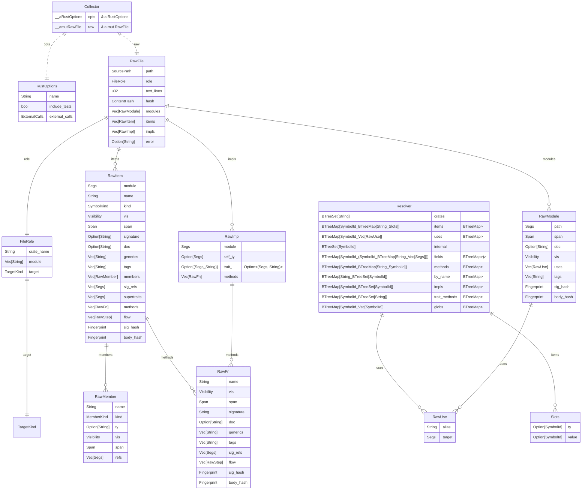
