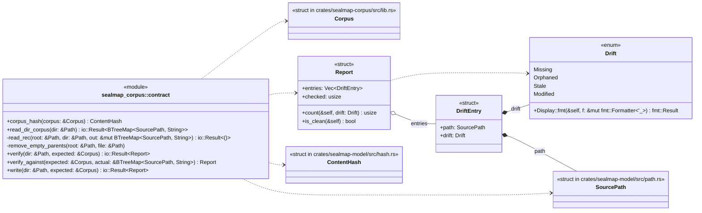
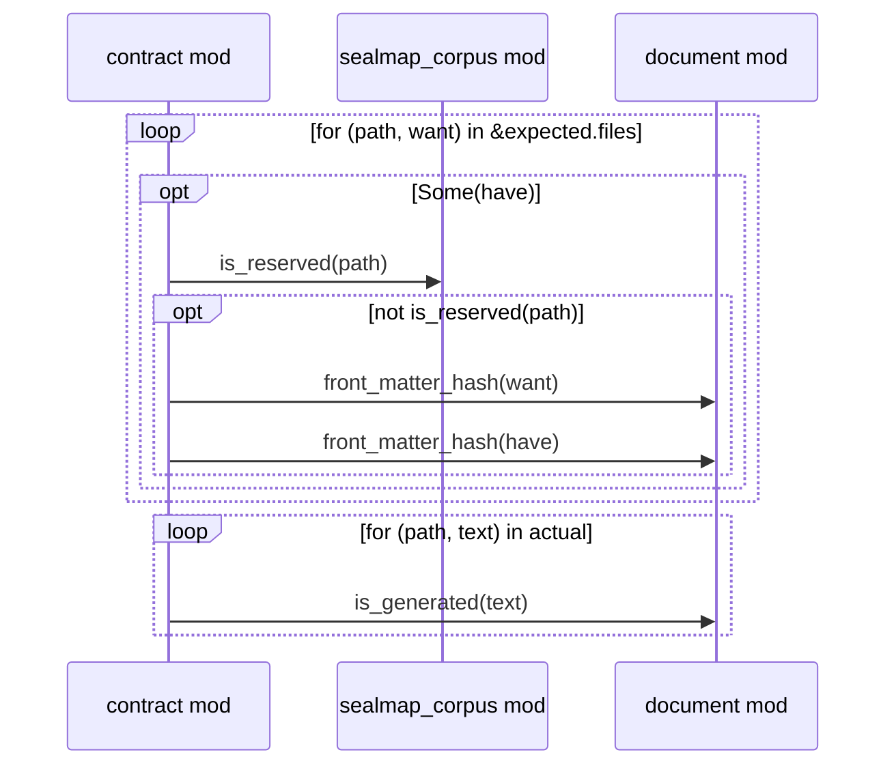
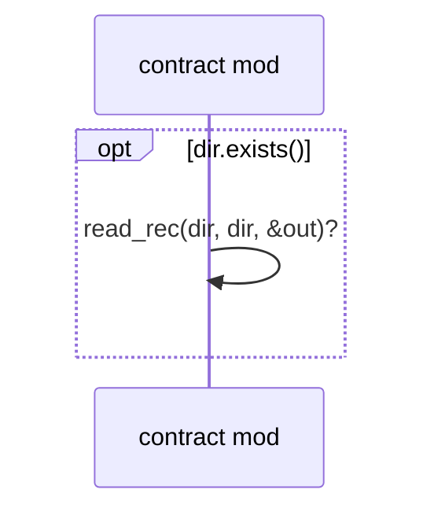
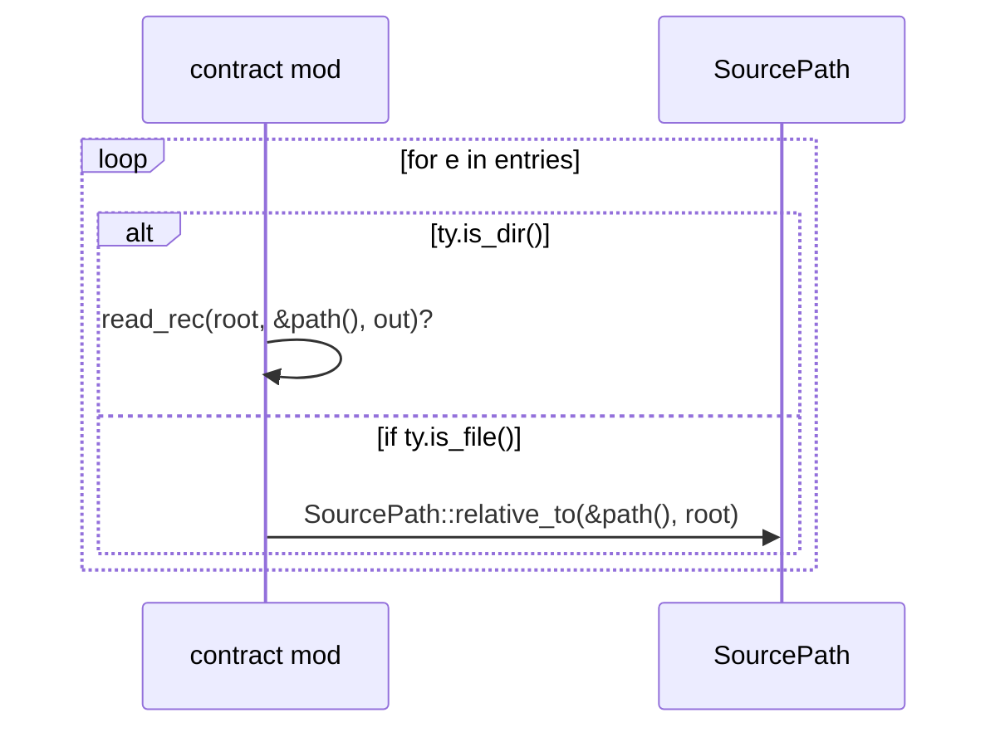
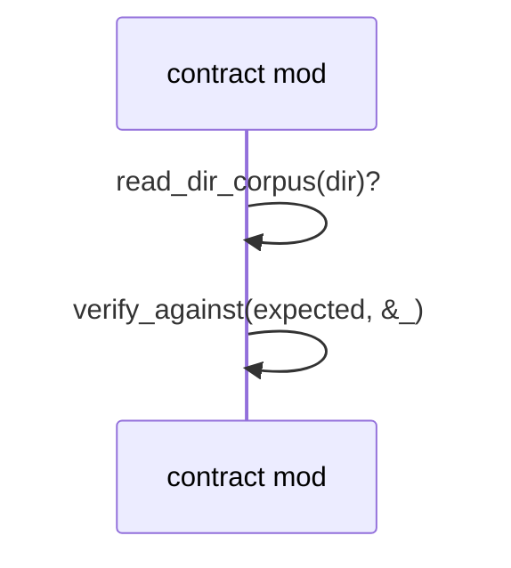
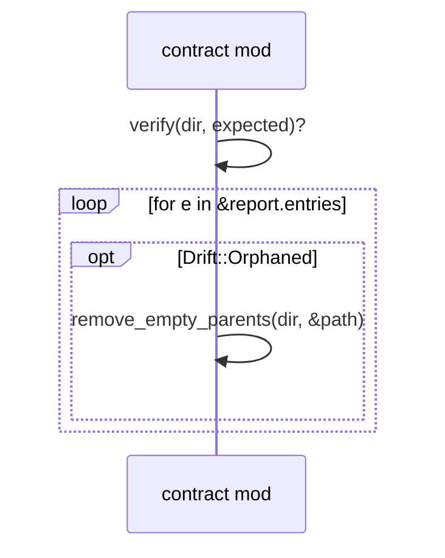
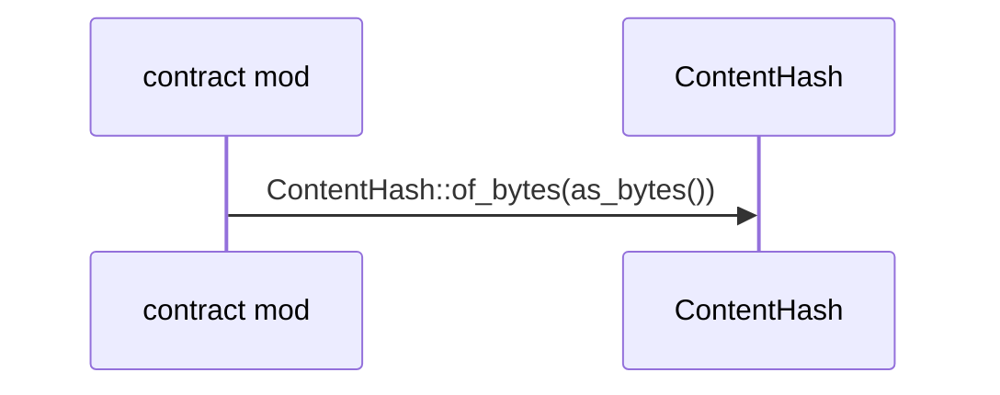

# `sym:cargo sealmap_corpus . contract/` · crates/sealmap-corpus/src/contract.rs
> The 1:1 contract: verify a corpus directory against freshly generated output, and write a directory into compliance.

## structure

## `sym:cargo sealmap_corpus . contract/verify_against().`
`pub fn verify_against(expected: &Corpus, actual: &BTreeMap<SourcePath, String>) -> Report` · L72-L105
> Compare `expected` (freshly generated) with `actual` (file path → text as found on disk or elsewhere).

## `sym:cargo sealmap_corpus . contract/read_dir_corpus().`
`pub fn read_dir_corpus(dir: &Path) -> io::Result<BTreeMap<SourcePath, String>>` · L107-L115
> Read every file under `dir` (UTF-8 only) keyed by relative path.

## `sym:cargo sealmap_corpus . contract/read_rec().`
`fn read_rec(root: &Path, dir: &Path, out: &mut BTreeMap<SourcePath, String>) -> io::Result<()>` · L117-L131

## `sym:cargo sealmap_corpus . contract/verify().`
`pub fn verify(dir: &Path, expected: &Corpus) -> io::Result<Report>` · L133-L136
> Verify the corpus in `dir` against `expected`.

## `sym:cargo sealmap_corpus . contract/write().`
`pub fn write(dir: &Path, expected: &Corpus) -> io::Result<Report>` · L138-L160
> Bring `dir` into compliance with `expected`: write missing, stale and modified files, delete orphaned generated documents (and nothing else).

## `sym:cargo sealmap_corpus . contract/corpus_hash().`
`pub fn corpus_hash(corpus: &Corpus) -> ContentHash` · L172-L183
> Hash of a whole corpus (all paths and contents), for cheap equality checks across machines.

