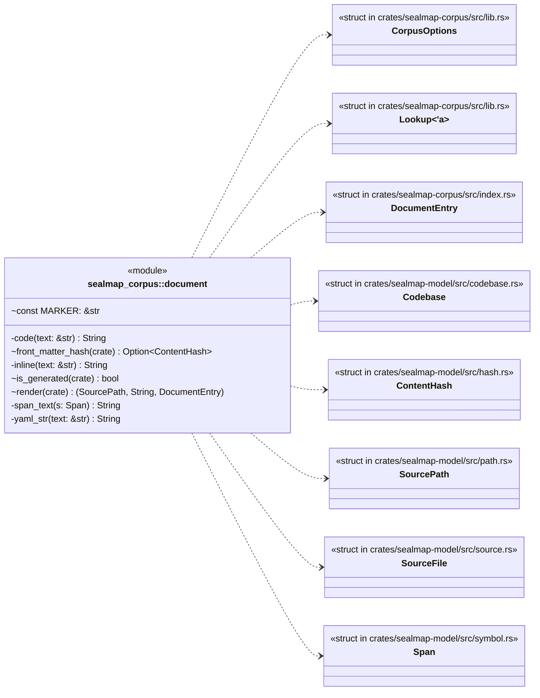
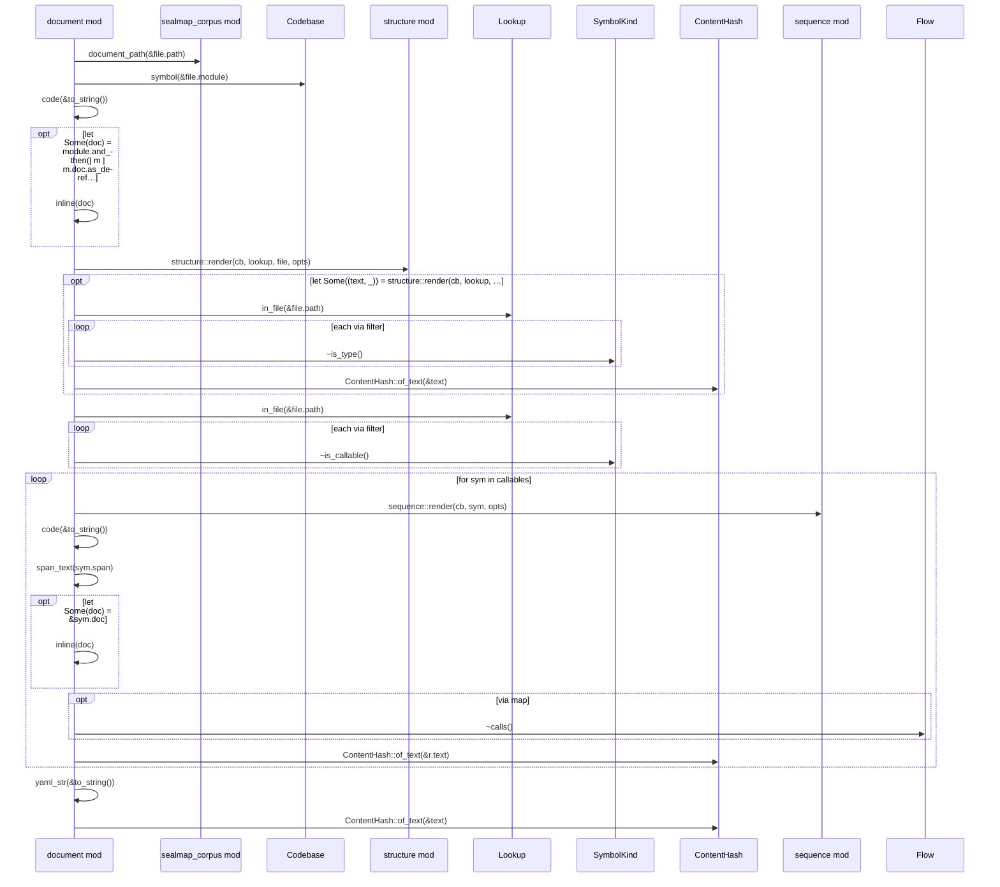
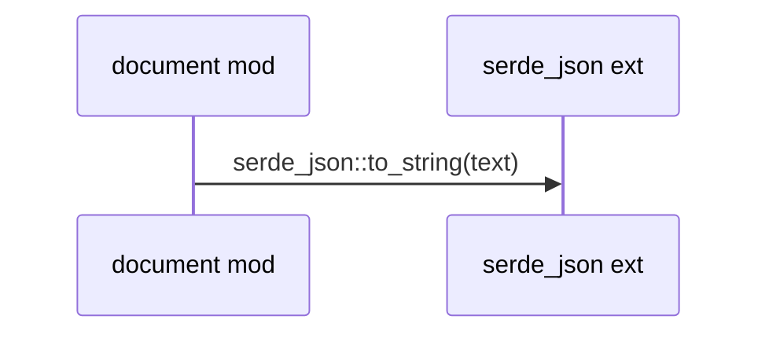
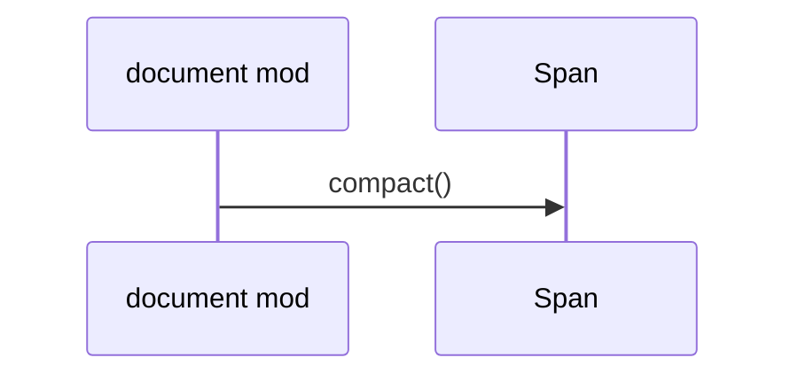

# `sym:cargo sealmap_corpus . document/` · crates/sealmap-corpus/src/document.rs
> One Markdown document per source file.

## structure

## `sym:cargo sealmap_corpus . document/render().`
`pub(crate) fn render(cb: &Codebase, lookup: &Lookup<'_>, file: &SourceFile, opts: &CorpusOptions,) -> (SourcePath, String, DocumentEntry)` · L14-L122

## `sym:cargo sealmap_corpus . document/yaml_str().`
`fn yaml_str(text: &str) -> String` · L124-L128
> A double-quoted YAML scalar (JSON string syntax is valid YAML), so ids holding `: ` or ` #` cannot be misread as structure or comments.

## `sym:cargo sealmap_corpus . document/span_text().`
`fn span_text(s: Span) -> String` · L141-L143

